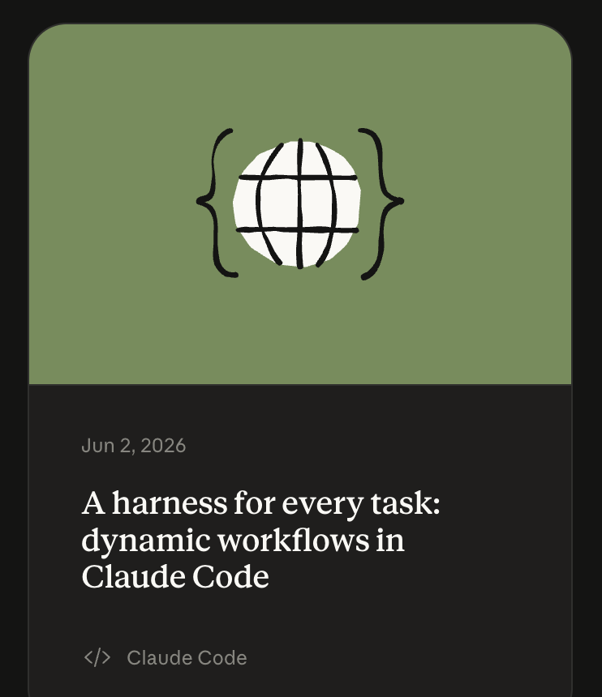
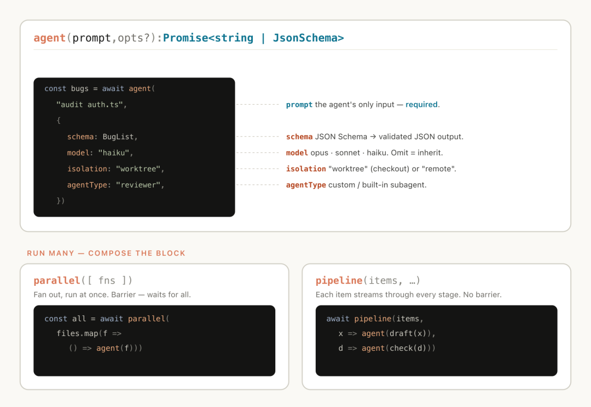
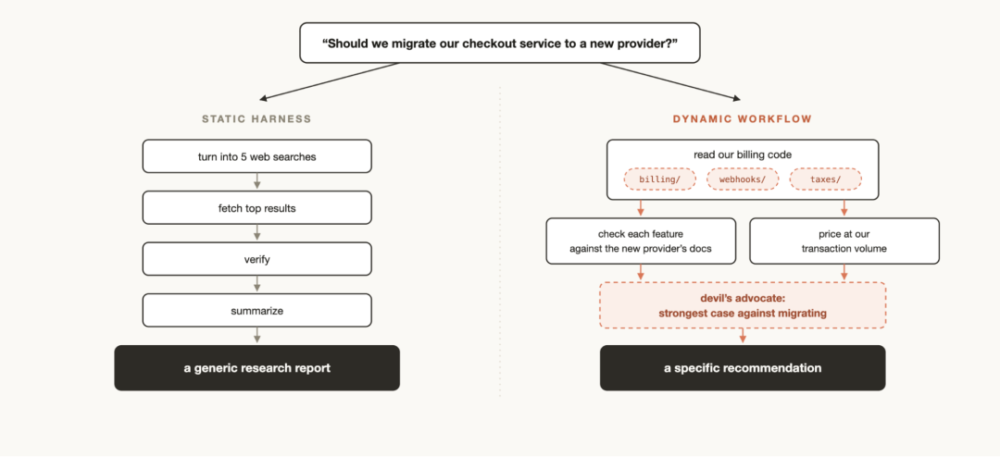
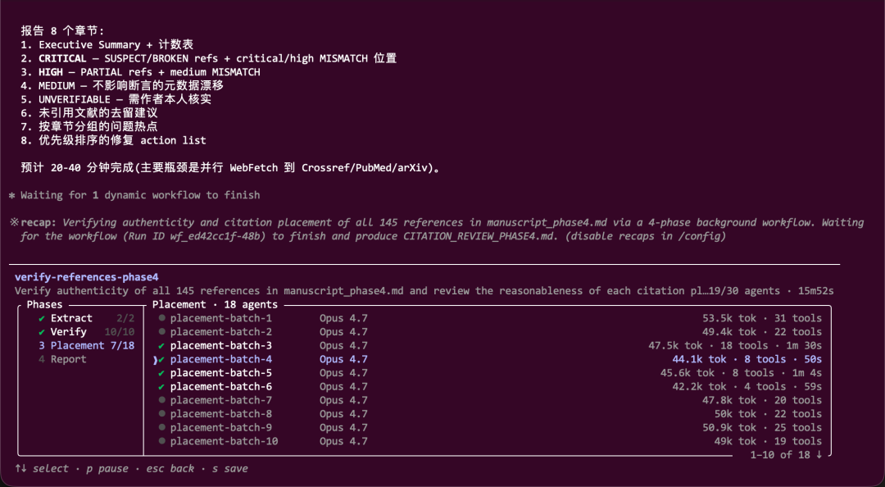
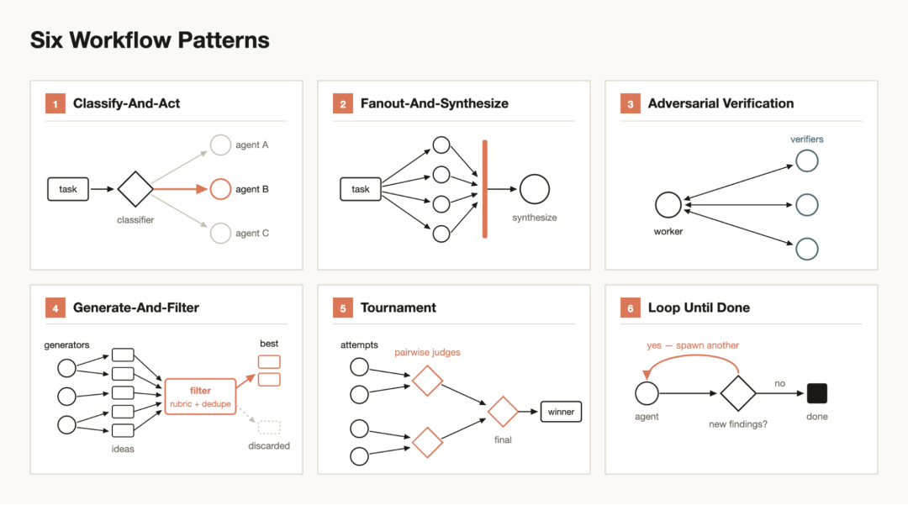

# Claude的workflows功能，是一套顶级的harness设计

大家好，我是鲁工。
前两天写Opus 4.8那篇文章，初步写了一下Claude Code新出的动态工作流功能。这几天深度用下来，也有了一些新的体会。
正好这两天，Claude在官方博客挂了篇新文，标题叫《A harness for every task，dynamic workflows in Claude Code》。

我全文仔细研读了下，内容正是我上篇最想讲、当时只跑了俩demo没深入展开的部分。上篇聊的是这东西是什么、为什么好用，官方这篇补的是它到底有哪几种玩法。这里多说一句，Anthropic的博客文章，除了涉及中国的，其他的真的都是实打实的Agent技术干货。
动态工作流是什么、跟普通subagent区别在哪，我在[Claude Opus 4.8 + Dynamic workflow，一次性并行上百个Subagents](https://mp.weixin.qq.com/s?__biz=MzE5ODY5MDU4Mw==&mid=2247485765&idx=1&sn=9babec634b850d896d87af668c8ccd0b&scene=21#wechat_redirect)里讲过，这里再重复一下：你给个需求，Claude Code自己写一段JavaScript把任务编排成流程，在后台开一批各自独立上下文的subagent去跑，最后只把收敛好的结果交回来。脚本里就几个关键函数，agent()开一个子agent，parallel()一批并行，pipeline()走流水线。它还能给不同agent指定不同模型、把某些agent关进独立 worktree，中途被打断重开会话也能接着跑。

## 为什么要设计workflow

你可能会问，Claude Code自己就能拆任务、能开subagent，干嘛还绕一圈写脚本。
官方给的理由都很真实。Claude Code默认那套harness，规划和执行是在同一个上下文窗口里的。短任务没问题，但任务一长、一复杂，单个上下文会犯三种很具体的毛病。

一个是**agentic laziness**，偷懒。一个50项的安全审查，它干到第35项就跟你说搞定了，剩下15项悄悄丢了。再一个是**self-preferential bias**，自我偏袒，让它回头验自己刚才的产出，它总下意识觉得自己是对的，很难对自己下狠手。最隐蔽的是**goal drift**，目标漂移，聊得越久、compact压缩的次数越多，最初那些「别碰 X」「注意这个边界」的约束就一点点被磨没了，因为每次摘要都是信息有损的。
workflow主要是针对上述三个问题而设计的。把任务拆分给一批各自独立、目标单一的subagent，每个只盯自己那一小块，上下文干净，跑完再合并。偷懒、偏袒、漂移，说到底都是一个脑子塞太多东西的并发症，那就别让一个脑子扛下全部工作。

## workflow的六种harness设计模式

标题里那个harness框架，指的就是这块。官方把常用的几种结构拆开讲了，我按自己的理解给大家梳理一遍。
最基础也最常用的，是fan-out-and-synthesize，拆分出去再合并回来。大任务切成很多小步，每步派个agent各跑各的，最后一个汇总agent把所有结构化结果并成一份。有个细节值得记，汇总这步是个栅栏（barrier），它会卡住，等所有分支都跑完才动手合并。我上篇那个deep-research 跑111个agent，背后应该用的就是这种模式。
跟它最配的是adversarial verification，对抗式核查。每开一个干活的agent，就再开一个专挑刺的agent，拿一份评分标准去验它的产出。这招直接冲着上面那个自我偏袒来的，验你的人跟干活的人不是同一个，自然没法偏袒。这个我个人觉得是整套里最该优先用的，尤其产出要给别人看、错了有代价的时候。比如我用Claude Code写了篇文献综述，它引用了100多篇文献，这里面肯定有胡编乱造的，我用workflow功能跑一个参考文献验证流程，基本上都可以把假引用全部给揪出来。

剩下几种看场景挑。任务类型拿不准的，先上classify-and-act，拿个分类agent判一下这是什么活、再路由到对应处理。要从一堆点子里淘金的，用generate-and-filter，先放开了生成一批，再拿规则筛、去重、留下经得起验证的那几个。
还有两种我挺喜欢。一种是tournament，锦标赛，先不分派任务，让N个agent用不同思路同时干同一件事，再让裁判agent两两PK，淘汰到剩一个赢家。官方说了个细节，做排序、做评判时，两两比较比让模型直接打绝对分靠谱得多。另一种是loop until done，跑到没有为止，工作量事先不知道有多少，就别定死跑几轮，循环开agent，直到没有新发现或者日志里没错了才停，特别适合配/loop干脏活累活。
六种模式汇总图示如下：

## 哪些任务适合workflow

workflow的六种模式讲完，落地场景官方列了一大长串，我挑几个最有代表性的。
最典型的是大型迁移和重构。Bun从Zig重写成Rust那个案例我上篇提过，几百个agent并行、每个文件配俩reviewer，就是这套玩法。思路是把活拆成一串能独立操作的单元，改一处调用、修一个测试、迁一个模块，每个单元丢进一个worktree里的agent去干，再来个agent对抗review，没问题之后再merge。
Claude文章里有个场景也值得一说，因为跟安全沾边，叫规模化分拣。一个永远处理不完的工单队列或者bug backlog，工作流能挨个分类、跟已有记录去重、再决定是自己修还是升级给人。官方提了个我觉得很关键的模式，叫隔离区（quarantine）：让那些去读不可信公开内容的agent，不准碰高权限操作，高权限的动作交给另一批专门的agent做。读和做分开。做过数据安全的看到这条应该都懂，本质就是最小权限。
workflow拿来排查问题也非常适合。调试的正确姿势本就是多开几个独立假设挨个验，但单上下文里Claude容易偏袒自己最先想到的那个。工作流能从结构上解决这个，让不同agent从互不相干的证据里各自提假设，一拨看日志、一拨看文件、一拨看数据，再拉一队验证加反驳的agent去审核。这套还不止能调代码，上个月流量数据为什么下滑、数据管道为什么挂了，任何复盘性质的工作都能拿来试一手。
但官方也专门留了一段讲什么时候不要用workflow。
workflow非常废token，不是每个任务都无脑用，我这两深度用的时候时不时就触发五小时limit。常规写代码，动手前先问自己一句，这活真需要更多算力吗。大部分传统编码任务，根本不需要五个reviewer组团。
真要用，几个官方提的小技巧值得记一下：

- 工作流不只服务大任务，你可以让它开个quick workflow，比如就对某个假设做一次快速对抗复查。 能重复跑的活，像分拣、调研、核查，拿/loop定时跑、拿/goal卡一个硬性完成标准，俩搭一块用效果更佳。
- 嫌它费钱，prompt里直接卡token用量上限，写一句「用 100k token」就给你封顶。
- 跑出个满意的流程，在工作流菜单里按s存下来，保存到~/.claude/workflows，或者放到一个skill里分发给别人。

上篇我说，工作流第一次让我觉得，过去按季度算的大活有机会压进几天。过去大家拼的是模型单点多聪明，往后更拼你会不会给手头这个任务，现写一套配得上它的harness。
年初我写harness engineering那篇文章时说，今年是harness之年，虽然模型智能进化能代替一部分harness，但harness本身对于模型的加成仍然非常有效。
如果觉得有用，点个赞或者在看，也方便更多朋友看到。
感谢您阅读我的文章。我是鲁工，九年AI算法老兵，AI全栈开发者，深耕AI编程赛道与AI科研赛道。
>/ 作者：鲁工

---

## 📚 专业词汇通俗解释（结合 NanoHermes 实践）

### 1. Harness（框架/缰绳）

**一句话：** 套在 AI 模型外面的"控制系统"。

**类比：** 你的 NanoHermes 就是一个 harness。Qwen 模型本身只会生成文字，但 NanoHermes 给了它工具（terminal、browser、read_file）、给了它技能（SKILL.md）、给了它记忆（MEMORY.md）、给了它对话循环（conversation loop）。**模型是引擎，harness 是整车。**

**文章中的意思：** 不是讨论模型多聪明，而是讨论怎么给模型设计一套靠谱的"工作环境"。

### 2. Workflow（工作流）

**一句话：** 用一段脚本把大任务拆成多个子任务，每个交给独立的 subagent 去跑。

**类比：** 你的 NanoHermes 里的  就是类似的概念。比如你要同时测试 3 个模块，你开 3 个子代理各跑各的，最后汇总结果。Claude 的 workflow 是用 JavaScript 脚本来编排这个流程。

### 3. Subagent（子代理）

**一句话：** 被主代理派出去干活的独立"小助手"。

**类比：** 你调用  时生成的子代理就是 subagent。每个有自己的终端会话、工具集、上下文窗口，互不干扰。

### 4. 三大单上下文问题（文章重点）

| 问题 | 通俗解释 | NanoHermes 中的对应 |
|------|---------|-------------------|
| **Agentic laziness（偷懒）** | 任务干一半就说"搞定了"，剩下漏掉了 | 如果让 NanoHermes 一次性跑 100 个测试用例，它可能在第 60 个就停止了 |
| **Self-preferential bias（自我偏袒）** | 自己检查自己的产出，总觉得自己是对的 | 让同一个代理写完代码又自己审查，很难发现自己写的 bug |
| **Goal drift（目标漂移）** | 聊久了，最初的约束条件被遗忘 | 上下文压缩后，"别碰 X 模块"这类约束可能丢失 |

**Workflow 的解法：** 不让一个脑子扛全部工作，拆成多个独立的 subagent，每个只盯一小块。

### 5. 六种 Harness 设计模式

| 模式 | 一句话 | 类比 |
|------|--------|------|
| **Fan-out-and-synthesize** | 拆成多份各跑各的，最后汇总 | 老板分 100 份报告给 100 个实习生，最后组长汇总 |
| **Adversarial verification** | 一个干活，一个挑刺 | 工厂的"生产者 + 质检员"分离 |
| **Classify-and-act** | 先分类，再路由到专人处理 | 医院前台分诊：先看你挂哪个科 |
| **Generate-and-filter** | 先大量生成，再筛选去重 | 海选面试：先收 1000 份简历，再筛 50 个面试 |
| **Tournament（锦标赛）** | N 个不同思路 PK，淘汰到剩一个 | 辩论赛：两队 PK，裁判判谁赢 |
| **Loop until done** | 循环跑，直到没新发现才停 | 保安巡逻：一圈一圈走，直到确认没异常 |

### 6. Quarantine（隔离区）

**一句话：** 读不可信内容的 agent 不准碰高权限操作。

**NanoHermes 类比：** 你的 hooks 系统里的危险命令拦截器就是这个思路——让 AI 能读取文件，但执行某些危险命令时必须经过人工确认。最小权限原则。

### 其他术语

**Barrier（栅栏）**
> 在并行任务中设置一个"集合点"，所有分支必须跑完才能继续下一步。就像旅游团说"所有人下午 3 点在大门口集合，到齐了才去下一个景点"。

**Token 用量封顶**
> 在 prompt 里直接写"用 100k token"给 workflow 设一个预算上限，防止无节制烧钱。相当于给外包项目定一个预算红线，超了就得停。

---

**💡 核心洞察**

> 这篇文章的核心观点是：**未来拼的不是模型多聪明，而是你会不会给任务设计一套合适的 harness（工作系统）。**

你的 NanoHermes 项目本身就是一套 harness 工程——你在做的是 Python 版的、带自进化能力的 harness 系统。这篇文章里提到的很多问题（偷懒、偏袒、目标漂移）也正是你在设计和测试 NanoHermes 时需要解决的。
