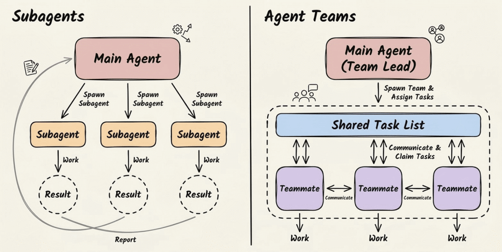
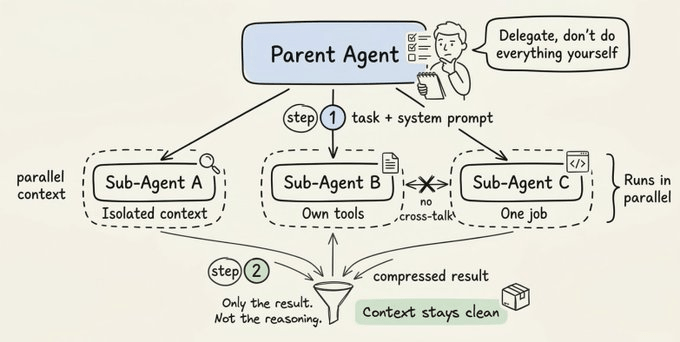
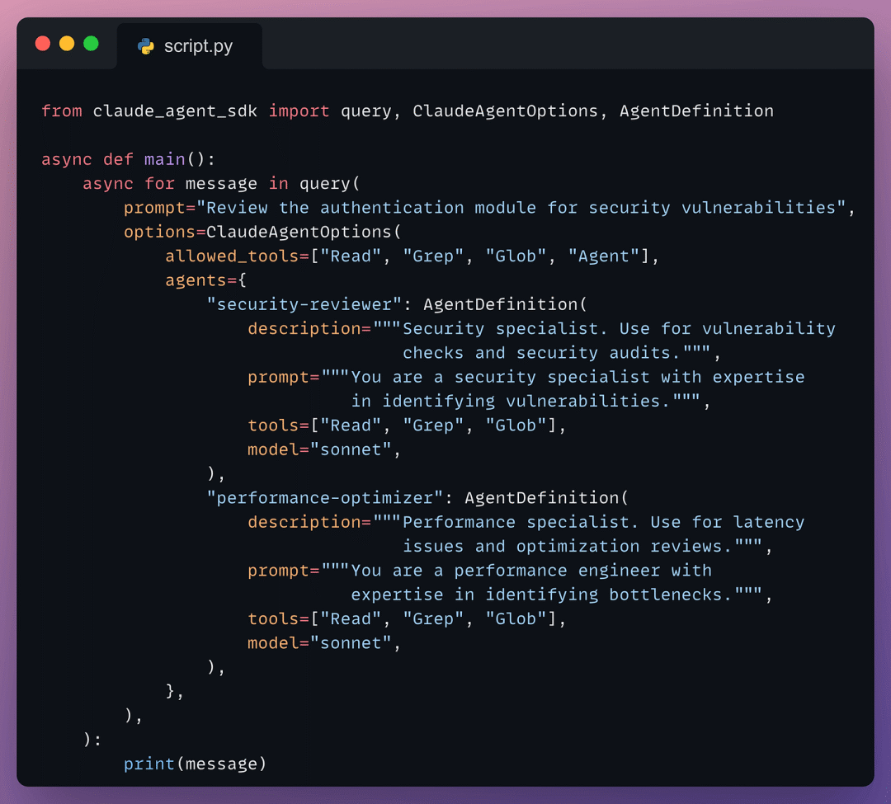
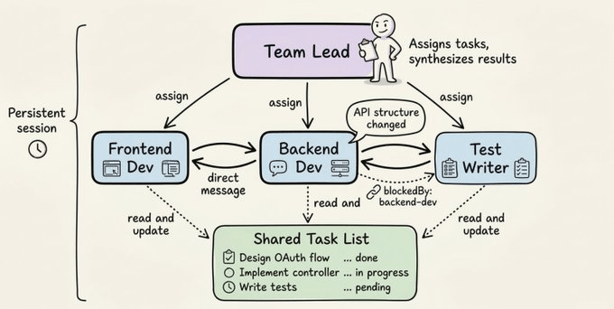
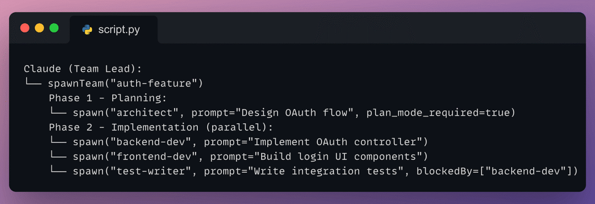
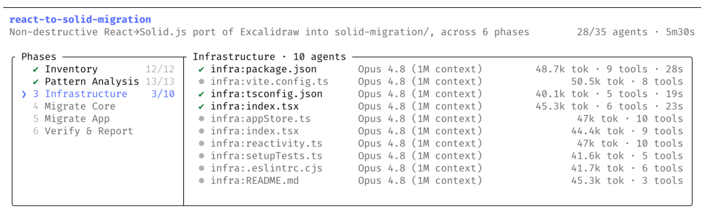
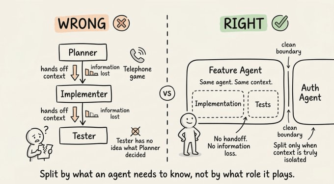
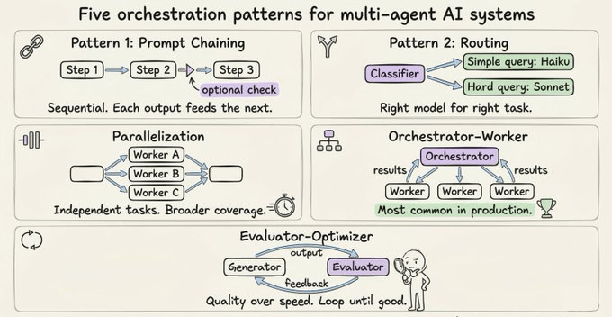

# Claude Code 多智能体编排全解：Sub-Agents、Agent Teams 与 Dynamic Workflows

从「一个 Agent 干所有活」到「千个 Agent 并行协作」，Claude Code 的编排能力正在重新定义 AI 工程的上限。
为什么你需要了解多智能体架构？
大部分人面对复杂任务的第一反应是：「我需要多个 Agent 来搞定这件事。」
**这几乎总是错误的直觉。**
真正该问的问题不是「要不要用多 Agent」，而是 **「这个任务到底需要什么样的协调方式？」**
答案决定了你的整个架构设计。
Claude 给了你三种递进式的编排范式：**Sub-Agents（子智能体）**、**Agent Teams（智能体团队）** 和全新的 **Dynamic Workflows（动态工作流）**。它们表面相似，但解决的是完全不同层次的问题。

第一层：Sub-Agents — 通过隔离实现并行
Sub-Agent 是运行在独立上下文窗口中的专用 Claude 实例。
**心智模型**：想象你是研究负责人。你不会亲自阅读每一份原始资料。你把聚焦的问题分派给研究员，他们带着提炼后的发现回来，你负责整合成一份连贯的输出。
这就是 Sub-Agent 做的事。
每个 Sub-Agent 拥有：

完成任务后，只有最终结果返回给父 Agent。不是完整的推理链，不是中间步骤 — 只有压缩后的输出。

真正的要点不只是并行 — 而是**压缩**。你把海量的探索提炼成干净的信号，同时不会用噪音污染父 Agent 的上下文。

**硬约束**：Sub-Agent 不能再生成 Sub-Agent，也不能互相通信。所有结果流回父级。父级是唯一的协调者。
这个约束是特性，不是缺陷。它让系统保持可预测性 — 你永远知道信息流向哪里，决策在哪里做出。
以下是 SDK 中定义和调用 Sub-Agent 的最小示例：

description 字段告诉父 Agent 该调用哪个 Sub-Agent。如果 prompt 提到「安全漏洞」，父级会路由到 *security-reviewer*；如果是延迟或瓶颈问题，则路由到 *performance-optimizer*。description 就是路由信号 — 保持具体。
第二层：Agent Teams — 通过通信实现协作
Agent Teams 是根本不同的模型。
Sub-Agent 是完成任务后消失的短命工人；Agent Teams 是**持久运行的实例**，它们互相直接通信，通过共享状态协调。

关键不是谁能做更多的事，而是**谁需要和谁说话**。

类比：Sub-Agent 像雇外包做隔离任务，Agent Teams 像组建一个在同一间屋子里协作的团队。
Agent Team 有三个核心组件：

典型的生命周期如下：

注意 test writer 上的 blockedBy 字段 — 共享任务列表在做真正的协调工作：test writer 不会开始，直到 backend agent 完成。无需 lead 手动管理这个顺序。
与 Sub-Agent 的最大区别：**点对点通信**。队友可以直接互发消息、分享发现、标记阻塞、协商方案 — 不需要所有东西都经过 lead 路由。
第三层：Dynamic Workflows — 终极编排形态
2026年5月28日，Anthropic 发布了 Dynamic Workflows 研究预览。这是 Claude Code 编排能力的全新高度。

▎底层逻辑是：让 Claude 自己写编排脚本，然后在单个 session 中并行运行数十到数百个 subagent，在任何东西到达你手里之前自行校验。

### 工作原理

当 workflow 启动时：

- **Claude 根据你的 prompt 动态规划**，将其分解为子任务
- **并行扇出**到多个 subagent 同时执行
- **结果在合并前被校验** — Agent 从独立角度解决问题，其他 Agent 尝试反驳发现
- **迭代直到答案收敛** — 这就是 workflow 能达到单次执行达不到的结果的原因

进度实时保存。如果任务被中断，它会**从断点恢复**，而非从头来过。

### 启动方式

- **直接请求**：在 prompt 中说「Create a workflow」
- **UltraCode 模式**：在 effort 菜单中开启 ultracode，让 Claude 自动判断何时使用 workflow

### 实战案例：Bun 从 Zig 到 Rust 的迁移

Jarred Sumner 用 Dynamic Workflows 将 Bun 从 Zig 移植到 Rust：

- **99.8%** 的现有测试套件通过
- 约 **750,000 行** Rust 代码
- 从第一个 commit 到合并只用了 **11 天**

一个 workflow 映射了 Zig 代码库中每个 struct 字段的正确 Rust lifetime。下一个写了每个 .rs 文件作为其 .zig 对应物的行为等价移植 — 数百个 Agent 并行工作，每个文件有两个 reviewer。修复循环驱动构建和测试套件直到两者都通过。

### 适用场景

- **全代码库 Bug 搜寻**：并行搜索整个服务，独立验证每个发现
- **大规模迁移**：框架替换、API 废弃处理、跨千文件的语言移植
- **需要反复验证的关键工作**：独立尝试 + 对抗性 Agent 试图打破结果

如何选择：三层编排的决策框架
维度
通信模型
父子单向
点对点 + 共享状态
自动编排脚本
短命，完成即消失
按需伸缩
适合场景
可隔离的并行子任务
需要实时协商的协作
大规模并行 + 自我验证
复杂度
低
高（但自动管理）
Token 消耗
中等
较高
显著更高
设计原则：从第一性原理出发
大部分多 Agent 设计失败是因为人们**按角色分工**而非**按上下文分工**。
直觉上的做法是按角色切分：planner、implementer、tester。看起来有序，实际上创造了一个「传话游戏」— 信息在每次交接时退化。

**正确的心智模型是以上下文为中心的分解。**
问：这个子任务到底需要什么上下文？如果两个子任务需要深度重叠的信息，它们可能属于同一个 Agent。如果它们可以用真正隔离的信息和干净的接口操作，那才是分割点。

▎不是按组织架构设计 Agent 架构，而是按上下文边界设计。

### 五种值得了解的编排模式

不管你用哪种范式，这五种模式覆盖了大部分真实场景：

什么时候不该用多 Agent？
这是大部分文章跳过的部分。
很多团队花了数月构建精心设计的多 Agent 流水线，结果发现**对单 Agent 的更好提示**达到了同等效果。
**从简单开始。只在能明确衡量需要时才加复杂度。**
多 Agent 系统在三种情况下值得：

- 任务可以被自然分解为真正独立的上下文
- 工作量超出单个上下文窗口
- 你需要独立视角来交叉验证结论

它们在以下情况是错误选择：

- 更好的 prompt 就能搞定
- 任务之间的依赖比隔离更多
- 你不想付出 N 倍的 Token 成本

**关于编码的特别警告**：并行 Agent 写代码会做出不兼容的假设。合并时，那些隐式决策以难以调试的方式冲突。编码 Sub-Agent 应该回答问题和探索，而不是与主 Agent 同时写代码。
三大失败模式

- **模糊的任务描述导致重复工作**

每个 Agent 需要：明确的目标、预期的输出格式、该使用什么工具/源、以及不应该覆盖什么的显式边界。

- **验证 Agent 不验证就宣布成功**

必须给出具体的验证指令：跑完整测试套件，覆盖特定用例，在每个都通过前不要标记完成。

- **Token 成本的复合增长超出预期**

解决方案是智能分级模型：用便宜模型做初步筛选，用强模型做最终判断。
总结：一个设计原则统治所有
**围绕上下文边界设计，而不是围绕角色或组织架构。**
从单个 Agent 开始。推到它断裂的地方。那个断裂点告诉你接下来该加什么：

- 需要隔离并行？→ **Sub-Agents**
- 需要实时协商？→ **Agent Teams**
- 需要大规模并行 + 自动验证 + 长时运行？→ **Dynamic Workflows**

只在解决真正的、可衡量的问题时才增加复杂度。

**原文出处：**Avi Chawla, "Claude Subagents vs. Agent Teams", Daily Dose of Data Science
https://www.dailydoseofds.com/p/claude-subagents-vs-agent-teams/[1]Anthropic, "Introducing dynamic workflows in Claude Code", May 28, 2026
https://claude.com/blog/introducing-dynamic-workflows-in-claude-code[2]

### 引用链接

[1]*https://www.dailydoseofds.com/p/claude-subagents-vs-agent-teams/*
[2]*https://claude.com/blog/introducing-dynamic-workflows-in-claude-code*

---

## 📚 专业词汇通俗解释（结合 NanoHermes 项目源码）

### 1. Sub-Agents（子智能体）

**一句话：** 运行在独立上下文窗口中的专用 AI 实例，完成任务后只返回压缩后的结果。

**NanoHermes 源码对应：** `src/delegation/manager.py` → `DelegationManager` 类：
- 每个子 Agent 有独立的会话（独立的 JSONL 文件）
- 子 Agent 不能再生成子 Agent（`delegate_task` 在 `DELEGATE_BLOCKED_TOOLS` 中）
- 结果通过 `DelegationResult` 返回：包含 `summary`、`error`、`duration`、`tool_calls` 等

**关键参数（`manager.py` 第 46-70 行）：**
- `max_concurrent_children`：最大并发子 Agent 数（默认 3）
- `max_spawn_depth`：最大委托深度（默认 2）
- `child_timeout_seconds`：子 Agent 超时时间（默认 300 秒）

**与文章的对应：** 文章说"Sub-Agent 是短命工人，完成任务后消失"——NanoHermes 的子 Agent 执行完即返回结果摘要，中间推理过程不污染主 Agent 上下文。

### 2. Agent Role（子 Agent 角色）

**一句话：** 控制子 Agent 权限边界的角色系统。

**NanoHermes 源码对应：** `src/delegation/types.py` → `AgentRole` 枚举：

| 角色 | 含义 | 权限 |
|------|------|------|
| `LEAF`（叶子节点） | 普通工作者，只能完成分配的特定任务 | 不能委托、不能交互用户、不能写共享记忆、不能执行代码 |
| `ORCHESTRATOR`（编排者） | 可以分解任务并进一步委托 | 额外允许 `delegate_task` 工具 |

**安全考量（`types.py` 第 30-35 行）：** `DELEGATE_BLOCKED_TOOLS` 明确禁止子 Agent 访问危险工具——防止无限递归、保护用户不被打扰、防止共享记忆冲突。

### 3. 上下文隔离（Context Isolation）

**一句话：** 每个子 Agent 有独立的上下文窗口，不会污染主 Agent 的会话状态。

**NanoHermes 实现：**
- 每个子 Agent 有独立的 session ID（`parent_session_id` 参数用于关联命名）
- 独立的 JSONL 消息历史文件存储在 `~/.nanohermes/sessions/<child_session_id>.jsonl`
- 独立的工具集（通过 `tool_schemas` 过滤子 Agent 可用工具）
- 事件总线转发（`parent_event_bus`）：子 Agent 的进度可以转发到主 Agent 的 TUI

**文章观点：** "只有压缩后的输出返回给父 Agent，不是完整的推理链"——这是上下文隔离的核心价值：探索海量信息，提炼干净信号。

### 4. 并发控制（Concurrency Control）

**一句话：** 通过信号量限制同时运行的子 Agent 数量，防止资源耗尽。

**NanoHermes 源码对应：** `src/delegation/semaphore.py` → `Semaphore` 类 + `DelegationManager` 中的 `max_concurrent_children` 参数。

**类比：** 高速公路收费站——同时只能通过 3 辆车（3 个子 Agent），其他的要排队等。

### 5. Agent Teams（智能体团队）

**一句话：** 持久运行的实例，互相直接通信，通过共享状态协调。

**NanoHermes 对比：** NanoHermes 目前实现的是 Sub-Agents 模式（父子单向通信），尚未实现完整的 Agent Teams（点对点通信）。但可以借鉴文章中的 `blockedBy` 依赖关系概念，在 `delegate_task` 的 `tasks` 数组中加入依赖字段。

**文章观点：** "Sub-Agent 像雇外包做隔离任务，Agent Teams 像组建一个在同一间屋子里协作的团队。"

### 6. Dynamic Workflows（动态工作流）

**一句话：** 让 AI 自己写编排脚本，在单个 session 中并行运行数十到数百个子 Agent。

**NanoHermes 对应：** 虽然 NanoHermes 没有直接的 workflow 功能，但以下组件组合起来可以实现类似能力：
- `delegate_task` → 并行子 Agent（最多 3 个并发）
- `cronjob` → 定时触发和自动化
- `src/conversation/` → 对话循环，AI 可以在循环中自主决定何时委派任务

**文章中的 Bun 迁移案例：** 99.8% 测试通过率、75 万行 Rust 代码、11 天完成——这就是大规模并行 + 自我验证的威力。

### 7. 按上下文切分 vs 按角色切分

**一句话：** 多 Agent 设计应该按"需要什么信息"来划分，而不是按"什么职能"来划分。

**文章核心原则：** "围绕上下文边界设计，而不是围绕角色或组织架构。"

**NanoHermes 中的体现：** `DelegationManager` 通过 `context` 参数传递子 Agent 需要的上下文，通过 `allowed_toolsets` 控制工具权限——这就是按上下文边界设计的实践。

### 8. 五种编排模式

**一句话：** 覆盖大部分真实场景的多 Agent 协调模式。

| 模式 | 说明 | NanoHermes 对应 |
|------|------|----------------|
| Fan-out | 拆成多份各跑各的 | `delegate_task(tasks=[...])` 并行执行 |
| Pipeline | 顺序传递，每步处理 | 子代理 1 输出作为子代理 2 的 context |
| Review-Refine | 一个生成，一个审查 | leaf 生成 + orchestrator 审查 |
| Map-Reduce | 分别处理，最后汇总 | 多个子代理处理 + 主代理汇总 |
| Debate | 多个视角对抗讨论 | 多个子代理从不同角度分析同一问题 |

### 9. 委托深度限制（Depth Limiting）

**一句话：** 防止子 Agent 无限递归委托导致资源耗尽。

**NanoHermes 源码对应：** `DelegationManager.__init__()` 中的 `max_spawn_depth` 参数（默认 2）。当深度达到限制时，orchestrator 角色的子 Agent 也无法继续 `delegate_task`。

**安全考量：** 如果没有深度限制，一个子 Agent 可以无限生成子代理，最终耗尽系统资源（内存、API 调用额度、上下文窗口）。

### 10. 工具权限过滤（Tool Permission Filtering）

**一句话：** 根据子 Agent 角色动态过滤其可用的工具集。

**NanoHermes 源码对应：**
- `DELEGATE_BLOCKED_TOOLS`（`types.py`）：所有子 Agent 都不能访问的工具
- `ORCHESTRATOR_ALLOWED_TOOLS`：orchestrator 角色可以额外访问的工具
- `tool_schemas` 参数：注入完整的工具 schema 列表，`DelegationManager` 过滤后只给子 Agent 需要的工具

**四种被禁止的工具及原因：**
| 工具 | 禁止原因 |
|------|---------|
| `delegate_task` | 防止 LEAF 角色继续生成子 Agent 导致无限递归 |
| `clarify` | 子 Agent 不应直接打扰用户，澄清应由主 Agent 处理 |
| `memory` | 防止多个子 Agent 同时写入 MEMORY.md 导致冲突 |
| `execute_code` | 子 Agent 应逐步推理，而非编写脚本：降低安全风险 |

### 11. 结果压缩（Result Compression）

**一句话：** 子 Agent 只返回最终摘要，不返回完整的推理链和中间步骤。

**NanoHermes 实现：** `DelegationResult` 只包含 `summary`（摘要）、`success`（成功/失败）、`error`（错误信息）、`duration`（耗时）、`tool_calls`（工具调用次数）。中间的推理过程、工具调用详情、消息历史都保存在子 Agent 的独立 JSONL 文件中，不会污染主 Agent 的上下文。

**文章观点：** "真正的要点不只是并行——而是压缩。你把海量的探索提炼成干净的信号，同时不会用噪音污染父 Agent 的上下文。"

---

**💡 核心洞察：NanoHermes vs 文章理念的对照**

> 文章的核心观点是：**围绕上下文边界设计多 Agent 架构，而不是围绕角色或组织架构。**

你的 NanoHermes 在以下方面**已经实现**了文章的理念：

| 文章理念 | NanoHermes 实现 | 状态 |
|---------|----------------|------|
| Sub-Agents 上下文隔离 | 独立 session ID + JSONL 文件 | ✅ 已实现 |
| 角色权限控制 | `AgentRole.LEAF` / `ORCHESTRATOR` | ✅ 已实现 |
| 工具权限过滤 | `DELEGATE_BLOCKED_TOOLS` | ✅ 已实现，且更精细 |
| 并发控制 | `max_concurrent_children` + Semaphore | ✅ 已实现 |
| 深度限制 | `max_spawn_depth`（默认 2） | ✅ 已实现 |
| 结果压缩 | `DelegationResult` 只返回摘要 | ✅ 已实现 |
| 按上下文切分 | `context` + `allowed_toolsets` 参数 | ✅ 已实现 |

**NanoHermes 可以借鉴文章改进的方向：**

1. **Agent Teams 模式**：文章提到的点对点通信 + 共享状态协调是 NanoHermes 尚未实现的——可以考虑在 `delegate_task` 中加入 `blockedBy` 依赖字段
2. **Dynamic Workflows**：让 AI 自主编写编排脚本，在单个 session 中运行数百个子 Agent——这是 Claude Code 的新范式，值得参考
3. **分级模型策略**：文章中提到"用便宜模型做初步筛选，用强模型做最终判断"——NanoHermes 的 `provider` 系统支持多提供商，可以为不同角色分配不同模型
