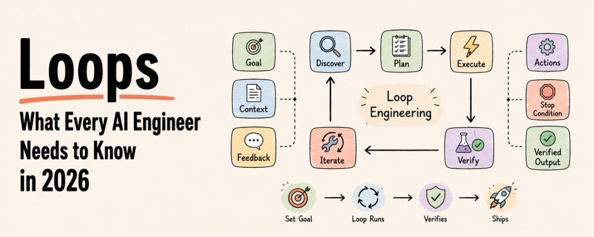
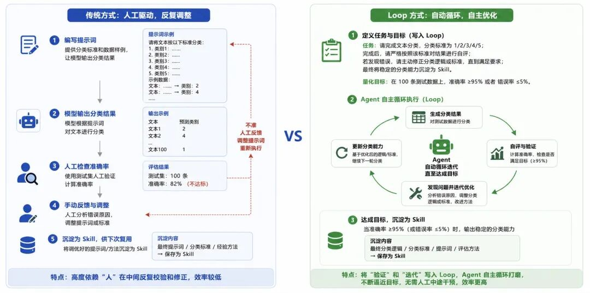

# Loop Engineering 概念解析、思考与实践

**这是2026年的第****25****篇文章**
（ 本文阅读时间：约20分钟 ）

# 01

# 背景

此前已有不少文章围绕Agent自进化这个主题展开过讨论，内容涵盖了Hermes Agent等自进化框架，以及Skill自进化等具体技术方向。而最近，AI领域又出现一个新的概念，叫做**Loop**（循环）或者叫Loop Engineering（中文翻译一般叫“循环工程”）。因此，本文将重点聊聊这个话题，尽量系统化地介绍一下Loop与**Loop Engineering**究竟是什么，以及它们背后有哪些思考。

之所以关注Loop以及Loop Engineering的技术概念，主要是因为最近AI行业里不少大佬都在密集讨论这个话题。
首先，作为AI领域的风向标，Anthropic公司Claude Code的负责人Boris Cherny就明确表示，他在使用Claude Code时已经**不再手写提示词****Prompt**了，而是**转向编写****Loop**，用Loop来驱动工作流的完成。与此同时，小龙虾OpenClaw的创始人Peter Steinberger也在X上指出过，不应该再用传统的提示词去指挥Agent，而应该**通过设计****Loop****来引导****Agent****的行为**。此外，AI大神，也是Vibe Coding和LLM-Wiki的提出人Andrej Karpathy，也在同样强调说“**你必须把你自己从****Loop****的执行过程中移除出去”**。就在6月初（也就是上周），Google AI总监Addy Osmani专门写了一篇文章，正式定义了「Loop Engineering」这个概念[1]，并在文章开头就给出了一句核心定义：**Loop engineering is replacing yourself as the person who prompts the agent. You design the system that does it instead.**（Loop Engineering就是把你从“给Agent提示词的人”这个位置上替换掉。你不需要再亲自去写提示词，而是转而设计一套能够自动完成这件事的系统）。
听到这里，可能很多同学会觉得：Loop？不就是循环吗？Agent本身不就是一个Loop吗？但需要强调的是，此Loop非彼Loop。接下来就重点拆解一下这背后的区别与深意。

# 02

Agent Loop vs Loop Engineering
要理解Loop Engineering，首先需要搞清楚这个Loop与基础的Agent Loop的本质区别。
先来看看Agent Loop。本质上讲，Agent本身就是一个Loop。正常情况下，大模型运行一次就是“输入一段话、输出一段话”，它本身并不会在一次回复里自动完成工具调用和推理，形成一条很长的**Agent****轨迹（****Trajectory****）**。所以，想让Agent持续、自动化地运行，就必须把它构建成一个Loop。
Agent Loop的核心逻辑其实很简单：当输入进去之后，大模型的输出通常有两种情况。一种是**直接给出****Response**，流程就结束了；另一种是**返回****Function Call**。如果把Function Call对应的工具执行结果再次作为“输入”喂给大模型，这就形成了一个循环。如果下一轮模型输出的是Response，循环就停止；如果依然是Function Call，就会继续调用下一个工具，进入下一轮循环。换句话说，只要把所有关键步骤都设计成Function Call，模型就能在这个过程中不停地循环调用各种工具链，同时穿插必要的Response，从而形成一个完整的Loop。
无论现在的Agent有多复杂，底层都是基于这个简单的原理构建的。当然，在实际运行中，Loop也可能会出现不可控的情况，比如模型该调用工具时突然断了、产生幻觉，或者陷入死循环等等。针对这些问题，业界也有很多应对做法。例如，可以引入一个**额外的****Validation Agent****来做验证**，发现任务中断时再把它拉起来继续跑；也可以设置一个**Max Steps****上限**，让模型在陷入死循环时能够强制跳出，避免无谓地消耗Token资源。包括大家熟知的ReAct、Ralph Loop等，本质上都是Agent Loop的不同变种。归根结底，Agent最核心的逻辑就是一个Loop。

那问题来了，既然Agent Loop早就有了，为什么最近各路AI大佬又开始密集讨论它？他们口中的Loop和Loop Engineering到底是什么？
其实，大佬们说的这个Loop，跟刚才讲的底层Agent Loop完全不是一回事。底层的Agent Loop是Agent最核心的基础循环，现在已经是默认的基础设施了，没必要再单独拿出来强调。而他们真正想表达的Loop以及Loop Engineering，是构建在Agent之上或者说Harness之上的，是一种**由人来设计和控制****Agent****使用方式的新的范式**。
举个例子，正常情况下用Agent，大概率是这样的流程：提一个需求，比如“帮我实现某某系统的代码”或者“搭建一个某某系统”，然后Claude Code、Codex这些工具就开始执行。虽然底层有Agent Loop在跑，中间也做了各种任务拆解，但最终它会把一个完整的系统交付过来。整体来看，这依然是一个“一次性”的过程：提需求，模型干活，最后交付结果。这时候人要做的就是验收：跑一下系统、看看效果、调试一下是否满足预期。
但在实际使用中，经常会发现一次提了的需求，Agent最后的产出结果**并不能完全满足预期，**或者说在测试过程中暴露出来很多问题。于是网上就出现了一个很火的梗：以前写代码用的是标准的QWERTY键盘，到了AI时代，“键盘”变成了几个固定按钮，比如“说中文”、“继续”、“还是报错”、“你改了啥”、“先别重构”、“回滚”等等。用Claude Code或Codex时，指令还真就大概率是这些。虽然是个梗，但这确实是当下使用AI的真实常态。

# 03

「人机协同循环」重构为「自动化验收闭环」
当高频地使用“继续”、“报错”、“回滚”这些指令去催促模型完善、调试或修改错误时，是不是可以思考，**这个动作本身是不是也可以自动化？**所以，大佬们提出所谓的Loop和Loop Engineering，本质上就是想解决这个问题：能不能在提完需求之后，模型不用等人再去喊“检查错误或”不符合预期”，而是自己先对自己说这些话，主动完成验证？也就是说，让模型**把原本需要人来催的环节自动化掉。**
但光做到这一步可能还不够。因为在实际场景中，验证和测试往往比较复杂，可能有专门的验证集、测试用例。期望的流程是：第一步让模型完成开发，第二步让它基于测试集去跑，拿到反馈的错误后再去调优系统，然后再测试、再调优……这是一个大的循环。以前这叫「**人在循环（环路）」**（HITL，Human-in-the-Loop），人在这个大循环里做验证和测试；而现在的思路是，能不能让模型自己在这个外部验收项目的Loop里闭环跑起来？注意，这已经不是底层那个小的执行Agent Loop了，而是一个**更上层的、面向需求验收**的外部Loop。
但问题是，如果不去设计这个Loop，不把循环逻辑写清楚，模型很可能就不Loop，或者瞎Loop。这也是为什么现阶段大家都在提倡Loop Engineering，就是为了避免写一次性的Prompt、提一次性的需求，然后人在里面不停地跟AI人机协同、反复调试。那种方式既不自动化，又耗时耗力，人还特别累。如果能提前把**开发需求、验证内容、预期目标都定义清楚**，Agent是不是就能在整个过程中自己Loop起来？至少在不万不得已需要人介入的情况下，它能尽快自动化地达到想要的目标。
这或许才是Loop Engineering最近兴起的根本原因：人们其实是在原有基础上再次追求效率的提升。回想一下AI Coding的演进过程：最开始人们不满足于自己写代码，于是**让****AI****写**；后来不满足于短任务，开始用Agent跑长链条任务；再后来不满足于Agent只在本机运行，让它**上云端、上移动端**，有了OpenClaw这样的产品；接着又不满足于Skill是静态固定的，希望它能**自进化**；而现在，人们已经不满足于使用这些工具本身了，因为里面还有大量的人工交互和参与。所以大家希望更进一步，**把从开发到验证、再到反馈调优的整个循环**都设计好，让Agent自己动起来，Loop出一个更完善的系统。如果一个系统能把这个外部Loop跑得又好又稳，那才真正体现了它处理长程任务的核心能力。
说白了，Loop Engineering本质上就是一种可以循环起来的Pipeline。这种Pipeline的触发方式主要有两种：第一种是**人工触发**，就跟现在提需求一样，直接写一个Loop形式的Pipeline，让它一步步自动执行下去，这在现阶段已经完全可以实现了；第二种是**定时触发**，适用于那些需要周期性执行的任务。比如在AI Coding场景下，很多开发者每天都要拉取PR、做Review、审核、合并分支，只要把评审和合并的逻辑定义清楚，这个任务就可以每天自动跑；再比如公司里的周报、日报，也可以根据预设好的数据源让模型每天自动抽取汇总；甚至像股票盯盘系统，每天定时抓取信息、选股、交易，这些过程都可以写成Loop定时完成。所以归根结底，这就是一种让AI自动运行的机制。
这里面其实有一个非常关键的变化脉络：从Coding到Vibe Coding，是**从「****写代码」****变成了「****提需求」**；而从Vibe Coding到Loop Engineering，则是从“提一个需求”变成了“提一套闭环流程”。不再只是告诉模型要**做什么**，而是把**从开发、测试、验收、调优，再到反馈迭代**的完整链路都定义好，让模型在这个流程里自己转起来。这或许才是Loop Engineering最核心的价值所在。

# 04

Loop Engineering 的六大核心框架
其实关于Loop这个概念，业界已经关注了一段时间，但此前一直没有看到系统性的总结文章。主要原因在于，它当时还比较零散，更多只是大家在提需求时尝试用循环的方式去描述，没有形成一套系统化的方法论。直到最近，Google AI总监Addy Osmani对Loop Engineering做了相对完整的梳理和定义，这个概念总算有了比较清晰的雏形，也到了可以拿出来系统讨论的时候。做科普的同时，也希望大家能借此思考一下：在自己的项目或日常工作、生活中，是否可以引入这种Loop Engineering的思维，让Agent真正自动化跑起来、闭环起来。
根据Addy Osmani的定义，一个完整的Loop主要包含以下**六个核心部分**，下面逐一来看。
**1. Automations（自动化）**
有了Automations（自动化），Loop就可以**定时循环**了，不然就只是手动跑一次的一次性操作。比如使用Codex就可以创建一个自动化任务：选好项目、定好要跑的Prompt、设好频率，还能选是在本地代码上跑还是在后台分支上跑。要是跑出来发现问题了，它就进Triage收件箱；没发现问题就直接自动归档。比如每天的一些问题分类、CI失败总结、写提交简报，还有排查上周别人引入的Bug等等。Codex还有个命令，叫做/goal，会在多轮对话里持续工作，一直跑到设定的条件真正满足为止，还支持暂停、恢复和清除。
Claude Code也类似，只不过它是靠Cron调度和Hook实现的。可以用/loop命令让某个Prompt或命令按间隔跑，可以设Cron定时任务，也能在Agent生命周期的特定节点用Hook触发Shell命令。核心逻辑也一样：定义一个自主任务，给它定好节奏，然后等着结果就可以了。另外，Claude Code也支持/goal命令，每轮交互之后，会有个独立的小模型来检查是不是完成了，因此写代码的Agent不是给自己打分的那个。只要给它定个目标，比如“test/auth下所有测试都通过且lint检查无误”，然后就可以不管了。
**2. Worktrees（工作树隔离）**
只要同时跑多个Agent，就很容易有文件冲突的问题，也很容易导致任务失败。两个Agent同时改同一个文件，就有点像两个工程师没打招呼就往同一行代码里提交修改一样，那么怎么解决呢？其实很简单，使用Git的Worktree就能解决这个问题，它本质上是一个独立的工作目录，有自己的分支，但共享同一个仓库历史，所以一个Agent的改动根本碰不到另一个Agent的代码。
Codex是直接把Worktree支持内置进去了，这样多个线程可以同时操作同一个仓库而不会互相打架。Claude Code也提供了相同的隔离能力：可以用--worktree参数在一个独立的checkout里开启会话，也可以给子Agent设置isolation: worktree，让每个Agent都拿到一份全新的、用完自动清理的代码副本。这样就让并行任务之间隔离了起来，避免"打架"。
**3. Skills（可进化的技能包）**
关于Skill，之前的文章中已讲过多次，这里就不赘述了。Skill就是一种可渐进式披露、可复用的能力包，基本上由Markdown文档、代码脚本这些组成。但在Loop Engineering这里，如果Skill具备**自我沉淀**的能力，它就能在Loop的每一次循环中不断更新、积累经验，变成一种“活的知识”。这样Agent就不会每次都在同一个坑里跌倒，而是越跑越聪明，真正实现能力的迭代与复用。
**4. Connectors / Plugins（连接器 / 插件）**
Connectors / Plugins本质上就是MCP及其延伸的各类工具，负责把各种外部API工具接入Agent。有了这些，模型才能真正“伸手”触达现实世界中的各类服务与数据源。没有Connectors或者Plugin，Agent就只是一个封闭的推理引擎；有了它，Agent才具备完成实际任务的行动能力。这也早就是目前大家最熟悉、落地最广泛的基础设施了。
**5. Sub Agents（子智能体）**
第五个核心部分是Sub Agents，也就是子Agent。可以把它理解为在主Loop运行过程中动态生成的**「****分支智能体」**，它们各司其职，共同支撑整个循环的高质量运转。
举个典型的例子：当主Agent完成开发任务后，可以生成一个独立的验收Sub Agent来检查结果。这个验收Agent拥有自己专属的Prompt和验证标准，与主Agent完全解耦。这种设计刻意制造了一种“博弈”的关系，如果主Agent的产出不符合需求，验收Agent就会提出质疑和挑战。之所以不让主Agent自我检查，是因为它往往“当局者迷”，就有点像人一样，自己写完代码总觉得完美无缺，但换个人一看就能发现问题。引入独立的验证Sub Agent，本质上就是用角色隔离来打破这种认知盲区。
当然，Sub Agent的价值远不止于验证。在复杂任务中，探索、设计、实现等环节都可以拆分为独立的Sub Agent并行执行。它们各自拥有更大的发挥空间，又能通过相互制衡提升整体产出质量。不过需要注意的是，Sub Agent并非越多越好。如果缺乏主Agent的有效调度，多个子Agent很容易各干各的，导致结果分崩离析、失去一致性。因此，是否拆分、如何拆分，必须根据具体任务特性来决定。
关于这部分更细致的实践技巧，之前讨论Claude Code的文章中已有详细展开，这里不再赘述。核心原则是：对于探索性、分析性的子任务，可以大胆生成Sub Agent来分担；但最终结果必须汇总回主Agent进行整合；而验证类Sub Agent，则务必保持独立，避免“既当运动员又当裁判员”。只有这样，Loop才能在自动化运转的同时，守住质量的底线。
**6. 状态（State）**
最后，是状态管理，也就是怎么追踪**「****哪些事已经做完了」**。这块可以用Markdown文件来记录，比如搞个AGENTS.md或者专门的进度文件；要是习惯用Linear这类项目管理工具，也可以通过MCP连接器直接对接上去，让Agent自动同步状态。

# 05

简单实践与思考
讲了这么多理论，接下来举一个实际落地的Loop例子。
如果看Addy Osmani的原文或者网络上其他文章谈Loop Engineering的案例，会发现绝大多数都是围绕代码审查、自动PR、CI/CD这些场景展开的。这些例子确实经典，这里就不再赘述了。这里分享的是一个经过小测试验证过的、用Claude Code或Codex都能轻松实现的Loop实践。
具体来说，是一个简单的**文本分类任务**：手头有一批文本，需要按预设标准分成几个类别。

- **传统方式：**写一个提示词，告诉模型分类标准和数据样例，让它输出分类结果；然后人工检查准确率，发现不准就手动反馈调整；最后把调好的提示词沉淀成Skill，供下次复用。整个过程高度依赖“人”在中间反复校验和修正。
- **Loop****方式：**把“验证”和“迭代”直接写进Loop的定义里。具体来说，可以这样描述任务：“请完成文本分类，分类标准为1/2/3/4/5；完成后，请严格按照该标准对结果进行自评；若发现错误，请主动修正分类逻辑或标准，直到满足要求；最终将稳定的分类能力沉淀为Skill。”同时设定量化目标，比如“在100条测试数据上，准确率≥95%或者错误率≤5%”。那么这个目标写入Loop之后，Agent就会自主循环打磨，不断逼近这个指标，无需人工中途干预。

看到这里，可能有同学会问：这不就是之前文章里提到比如EvoSkill、SkillOpt这些Skill自进化差不多吗？
确实很像，主要区别就在于：**这个过程完全由****Agent****自主驱动完成的****Loop****，不依赖任何外部开源框架或预置代码。**Agent会在Loop运行中自己构建一套类似EvoSkill的验证与优化机制，自己跑测试、自己改逻辑、自己沉淀能力。
其实，这也是一个值得关注的趋势：在AI时代，未必需要先造一个全新的框架才能实现高级能力，只要用Claude Code或Codex写一个结构化的Loop，很多原本需要工程化封装的能力，现在可以直接"跑"出来。
这个小例子也再次印证了Loop Engineering的核心意义：它不是取代AI Coding，而是在AI Coding的基础上，进一步压缩了Human-in-the-Loop的比例。人不再需要全程盯着、反复纠错，只需**设定清晰的目标和验收标准**，然后等待Agent自主达到预期水位后再做**最终确认**。所以Loop Engineering概念也没那么复杂，它可以被普通人快速上手，并在真实任务中显著提升自动化程度与交付质量。上面提到的文本分类的例子，就是抛砖引玉做个简单实验，大家完全可以照着这个思路，在自己的日常工作里多试一试。
比如文本分类任务如果每天都要跑，也可以设成定时Loop每天去运行。不过更推荐的做法是把这类成熟任务沉淀成脚本或者Skill，而不是每天现开一个Loop去跑。原因很简单：一是每天重跑Loop太费token；二是大模型每次跑Loop的实现路径不一定一样，哪怕需求没变，今天和明天的代码、实现方式也可能有较大差别，结果就容易漂移，不好复现。
所以比较合理的建议是：如果流程是固定的、不需要模型每次都重新推理，那就直接写成脚本；如果确实需要模型每天介入、做动态判断，那就把它做成可复用的Skill。这样既用上了Loop Engineering的思路，又能保证运行的稳定、成本可控。
当然这只是一点经验之谈，不是什么标准做法。具体怎么技术选型，大家还是结合自己的业务、成本和质量要求，自己评估着来就好。

# 06

Loop 不是银弹，用之前需要先想清楚
最后还需要补充几点。虽然Loop确实是个提效的好手段，但用的时候一定要清醒：**它不是什么横空出世的全新技术，只是在原有基础上把自动化又往前推了一步。**AI的发展本来就是循序渐进的，很少有突然蹦出来一个完全颠覆的东西，更多是量变引起质变，慢慢长出新的效果。
另外特别要提醒的是：用Loop的时候，**需求和验证标准必须比原来写得更加明确。**
为什么？因为以前提需求哪怕模糊一点也没关系，模型先出个初版，人在Human-in-the-Loop的过程中可以**不断纠偏、调整，靠人工反馈**来保证最终结果的可靠性。但用了Loop之后，中间过程人不参与了，如果开头没把需求写清楚、没把验证逻辑定义明白，Loop很可能从一开始就跑偏了，验证也不是按预想来的。跑了一大圈、烧了很多token，最后出来的东西还是跟预期差十万八千里。
Loop虽然好用，但它对使用者描述需求和验证的能力要求其实更高了。因为希望模型自闭环跑，它就没机会中途确认，只能自己发挥。而模型的“自己发挥”跟真实想法之间往往是有gap的。对于顶尖大牛来说这可能不是问题，所以他们用得飞起；但对大多数人来说，如果发现很难把需求和验证写清楚、把控不住Loop的效果，那还是建议老老实实回到Human-in-the-Loop的模式，先人工迭代几轮再说。毕竟token烧起来成本不低，盲目让模型自主跑一大通却拿不到想要的结果，其实是时间和钱的双重浪费。
所以这次聊Loop Engineering，好处和坑都尽量讲清楚了：**当有明确的需求和清晰的验证标准**时，Loop绝对是**提效神器**，能省下大量时间和成本；但如果需求和验证都是**模糊**的，那人在中间不停反馈、校正、确认，反而可能是更稳妥、更经济的选择。
技术方法论没有对错，只有适不适合。AI时代从来没有万金油，每种思想都有它的适用边界。这点格外提出来，就是希望大家用的时候能多留个心眼，别为了用而用。

# 07

这篇文章的内容到这里就全部结束了。如果看完之后有什么疑问、不同的看法，或者在实践中遇到了什么问题，都非常欢迎在评论区留言交流探讨。
最后还是要说明一下，本文内容只是技术探索过程中的一些心得与总结，纯属一家之言、经验之谈。受限于认知和实践范围，文中难免存在疏漏、片面甚至错误的地方，还请各位读者朋友不吝批评指正。互相学习、共同提升，才能更好地将Agent技术应用到各自所属的业务领域中。
在AI时代浪潮奔涌向前的当下，技术迭代日新月异，唯有保持开放心态、持续精进，才能不被落下。愿大家都能在这条路上携手同行，一起往前走，再进一步！

# 08

References
[1] Loop Engineering：
https://addyosmani.com/blog/loop-engineering/
[2] Loop Engineering: Build Self-Running Coding Agents 2026
https://www.the-ai-corner.com/p/loop-engineering-coding-agents-2026
欢迎留言一起参与讨论~

---

## 📚 专业词汇通俗解释（结合 NanoHermes 项目源码）

### 1. Agent Loop（代理循环）

**一句话：** Agent 底层的核心运行机制——"接收输入→生成输出/调用工具→把工具结果作为下一轮输入"的循环。

**NanoHermes 源码对应：** `src/conversation/` 中的核心对话循环就是这个 Agent Loop：
1. 用户输入 → 组装 system prompt + 消息历史
2. LLM 输出 → 如果是 text，直接返回给用户
3. 如果是 tool call → 执行工具（terminal、browser 等）
4. 把工具输出加到消息历史 → 回到步骤 2

**文章中的区分：** 文章特别强调"Agent Loop"和"Loop Engineering"是两个层面的东西。Agent Loop 是底层基础设施（NanoHermes 已有），Loop Engineering 是上层设计范式（本文讨论的重点）。

### 2. Loop Engineering（循环工程）

**一句话：** 不是每次手动告诉 AI 做什么，而是设计一套"能自动循环运转的系统"。

**Google AI 总监 Addy Osmani 的定义：** "Loop engineering is replacing yourself as the person who prompts the agent. You design the system that does it instead."

**类比：** Agent Loop 是"引擎的活塞循环"（机械原理），Loop Engineering 是"你设计整条自动生产线"（系统工程）。

**NanoHermes 对应：** 你项目中的多个机制都体现了 Loop Engineering 思想：
- `cronjob` 工具 → 定时触发循环
- `Curator` → 自动审查技能的生命循环
- `delegate_task` + 审查 → 开发-验证的闭环循环

### 3. HITL / Human-in-the-Loop（人在环中）

**一句话：** 人在 AI 的循环中做验证和判断的环节。

**文章的演进观：**
| 阶段 | 模式 | 人的角色 |
|------|------|---------|
| 传统 AI Coding | HITL | 人每步都要参与 |
| Vibe Coding | 减少 HITL | 人提需求，偶尔检查 |
| Loop Engineering | 最小化 HITL | 人只设目标和最终确认 |

**NanoHermes 对应：** 你的 hooks 系统中的"危险命令拦截器"就是一个 HITL 设计——AI 可以自主执行大部分操作，但碰到危险命令时必须暂停等人确认。

### 4. Automations（自动化触发）

**一句话：** 让 Loop 按时间或事件自动启动的机制。

**NanoHermes 对应：**
- `cronjob` 工具 → 支持 cron 表达式定时、ISO 时间戳一次性、相对时间（如 `30m`、`every 2h`）
- `src/background/review.py` / `src/background/skill_review.py` → 后台自动审查
- `Curator.maybe_run()` → 检查空闲时间和间隔，自动执行技能审查

**典型场景：** 每天早上自动检查 CI 失败、定期审查 Skill 健康度、定时生成项目状态简报。

### 5. Worktrees（工作树隔离）

**一句话：** 给每个并行 Agent 独立的 Git 工作目录，避免文件冲突。

**NanoHermes 对应：** 虽然 NanoHermes 本身不直接实现 Worktree，但 `delegate_task` 的子代理可以配置不同的 `workdir`，实现类似的隔离效果。`cronjob` 的 `workdir` 参数也允许每个定时任务在独立的项目目录下运行。

### 6. Skills（可进化的技能包）

**一句话：** 在 Loop 中不断积累经验、自我更新的能力包。

**NanoHermes 独有增强：** `Curator` 自动管理技能生命周期（active → stale → archived），`skill_manage(action='patch')` 发现坑就更新——这就是文章说的"自我沉淀"能力。每次循环中积累的经验教训都会被写回 SKILL.md，下次循环时 Agent 就不会再犯同样的错。

### 7. Connectors / Plugins（连接器/插件）

**一句话：** 把外部工具和服务接入 Agent 的接口。

**NanoHermes 对应：**
- `src/mcp/` → MCP 协议实现，连接外部 MCP 服务
- `src/tools/` → 内置工具系统（16+ 个工具）
- 搜索工具 → BM25 + Regex 双引擎搜索

### 8. Sub Agents（子智能体）

**一句话：** 主循环中动态生成的"分支智能体"，各司其职。

**NanoHermes 源码对应：** `src/delegation/` 模块实现 `delegate_task` 工具：
- 支持并行最多 3 个子代理
- leaf 角色（不能继续委托）和 orchestrator 角色（可以继续委托）
- 每个子代理有独立的终端会话、工具集、上下文

**文章观点：** "不让主 Agent 自我检查，而是引入独立的验证 Sub Agent"——这就是 NanoHermes 中可以实现的模式：一个子代理写代码，另一个子代理审查。

### 9. 状态管理（State）

**一句话：** 追踪"哪些事已做完、哪些还在进行中"。

**NanoHermes 对应：**
- `src/session/` → SQLite + JSONL 双存储管理会话状态
- `src/memory/` → MEMORY.md / USER.md 持久化跨轮次状态
- `.usage.json` → 技能使用统计状态
- `todo` 工具 → 当前会话的任务列表状态

### 10. Validation Agent（验证代理）

**一句话：** 独立的子 Agent，专门负责检查和质疑主 Agent 的产出。

**NanoHermes 实践：** 通过 `delegate_task` 可以实现这种模式：
1. 子代理 A 完成任务
2. 子代理 B 用不同提示词审查 A 的产出
3. 主代理汇总 A 和 B 的结果

**文章观点：** "既当运动员又当裁判员不可靠"——验证必须独立。

---

**💡 核心洞察：NanoHermes vs 文章理念的对照**

> 文章的核心观点是：**Loop Engineering 不是新技术，而是在原有基础上把自动化又往前推了一步——把"人催 AI 改"的环节也自动化掉。**

你的 NanoHermes 在以下方面**已经实现**了文章的理念：

| 文章理念 | NanoHermes 实现 | 状态 |
|---------|----------------|------|
| Agent Loop 底层循环 | `src/conversation/` 对话循环 | ✅ 已实现 |
| 自动化触发（Automations） | `cronjob` + 后台审查 | ✅ 已实现 |
| 技能自沉淀（Skills） | SKILL.md + Curator 生命周期管理 | ✅ NanoHermes 独有增强 |
| 子智能体分工（Sub Agents） | `delegate_task` 支持并行子代理 | ✅ 已实现 |
| 验证代理独立（Validation Agent） | leaf/orchestrator 角色分离 | ✅ 可实现 |
| 状态管理（State） | SQLite + MEMORY.md + .usage.json | ✅ 已实现 |
| HITL 最小化 | 危险命令拦截器 | ✅ 已实现 |

**文章提醒的两个关键注意事项：**
1. **需求和验证标准必须更明确**——因为中间过程人不参与了，开头不清晰就跑偏
2. **不要为了用而用**——模糊需求下人在环中反而更稳妥经济
