这是2026年的第28篇文章

（ 本文阅读时间：约15分钟 ）

# 01

为什么 Agent 评测需要体系化划重点：Agent 评测是把「不稳定的智能行为」持续收敛成「可发布的工程质量」，不是上线前抽查。和传统软件相比，Agent 的输入、输出和状态空间都更开放：用户表达不可穷举，模型输出有随机性，多轮对话会累积上下文，工具调用还会改变系统状态。也就是说，Agent 从 Demo 到生产可用，真正要跨过的是三道门槛：非确定性（同样输入不一定同样输出）、黑盒化（内部决策过程不透明）和错误级联放大（前一步小错会在后续被放大）。所以，“跑几条 case 感觉还行”远远不够：

- 同一 Prompt 跑通一次，不代表稳定可用；
- 每次改模型、改 Prompt 或改工具参数，都可能把原来好用的场景改坏，而且不容易第一时间发现；
- 多步链路里前面一个小偏差，也可能在后面被放大成错误结论；
- 更隐蔽的是，有些样本最终答案看起来对，但执行路径已经偏离或带风险，这类假阳性（结果看起来通过、过程其实有问题）在生产里迟早会暴露。

评测体系必须嵌入研发流程，而不是上线前人工抽查。评测平台不只是“出分工具”，它的核心价值是把问题稳定转化为可执行修复，形成持续迭代闭环：

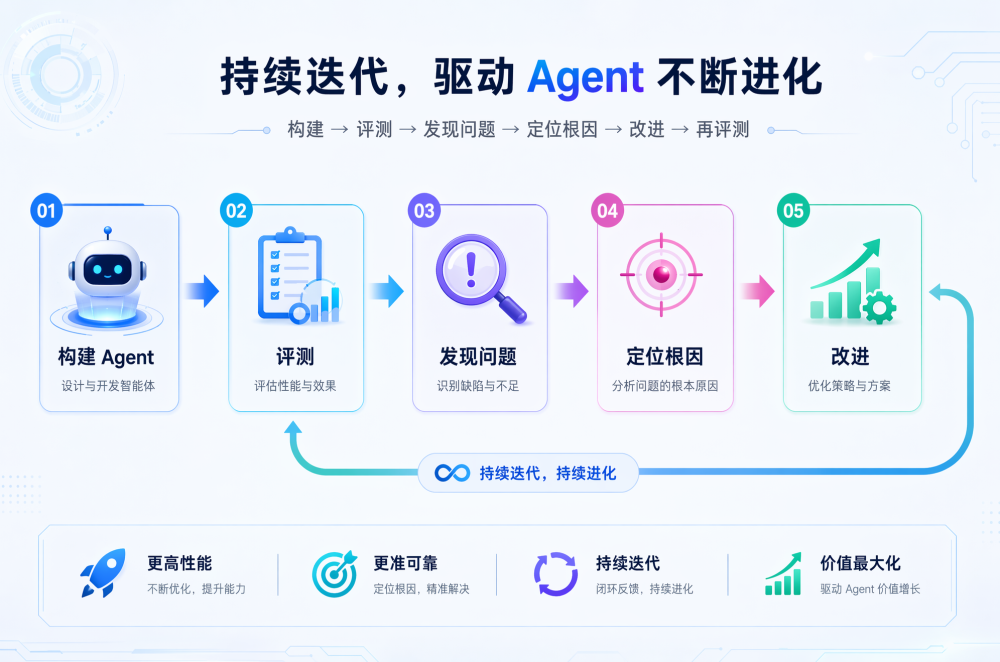

一套成熟的 Agent 评测体系至少要回答三类问题：

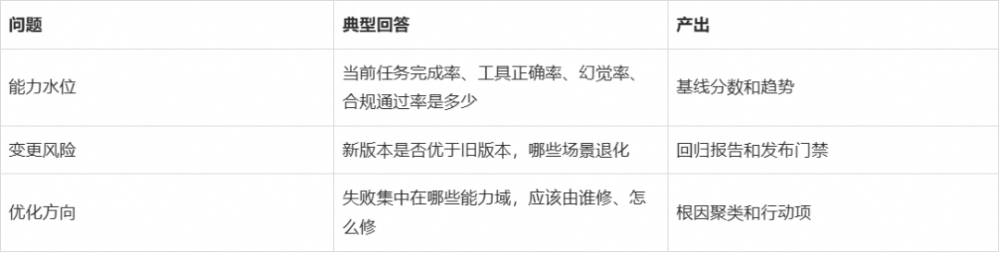

# 02

Agent 类型与评测侧重划重点：先分清 Agent 类型，再定义评测指标；类型不分，评测结果基本不可用。Agent 的系统形态差异很大，不能用一套“万能指标”评所有系统。

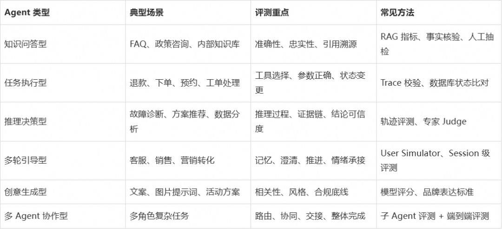

评测底层骨架可以复用：执行用例、采集 Trace（执行轨迹）、运行 Scorer（评分器）、生成报告、做根因归类。真正需要按业务定制的是“评什么”和“怎么判”。除了按 Agent 类型设计评测体系，还需要关注 Agent 内部的能力单元。随着 Agent 越来越多地通过 Skill 完成工具调用、数据处理、报告生成和业务动作，Skill 本身也需要测评：它是否该触发、触发后是否走对流程、工具参数是否正确、最终产物是否可用、异常时是否能降级。本文会把 Skill 相关方法拆到指标、数据集、评分、归因和优化各章节中统一说明。

# 03

对话 Agent 的特殊性划重点：对话 Agent 不能只看单轮答案，必须把整段会话是否解决问题作为主评判对象。如果聚焦在“对话形态”的Agent，客服、营销、导购、售后等系统往往同时包含知识问答、任务执行、推理决策和多轮引导能力，但只要它们通过多轮对话面向用户，就会额外面临上下文、目标切换、情绪回应和人工接管等评测问题。对话 Agent 至少有五个特殊难点：

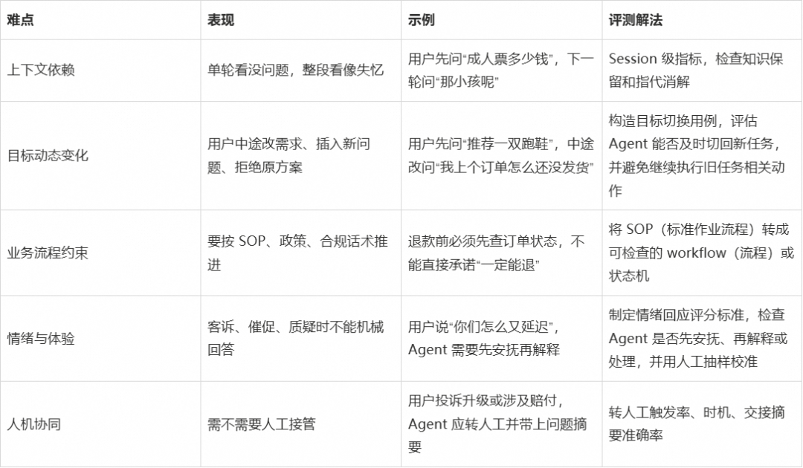

对话评测不要只平均每轮分数。一段会话每轮都“答得还行”，但最终没有解决用户问题，仍然是失败。正确做法是同时看历史 Turn（单轮）、Session（整段会话）、Trace（执行轨迹）、Outcome（最终结果）四个层次。

# 04

指标体系划重点：指标体系不止用于打分，更用于驱动可落地、可验证的持续优化。Agent 评测要从“感觉好不好”变成“可量化、可比较、可回归”，关键抓手就是指标体系。指标的作用，是把业务目标和专家经验拆成可观察、可打分、可追踪的检查项，让每次评测不只给分，还能明确好在哪、差在哪、下一步该改什么。Agent 评测指标建议分成五大类。P0 指标用于上线门禁（不达标不能发），P1 指标用于版本比较和工程优化，P2 指标用于体验改善和长期观察。

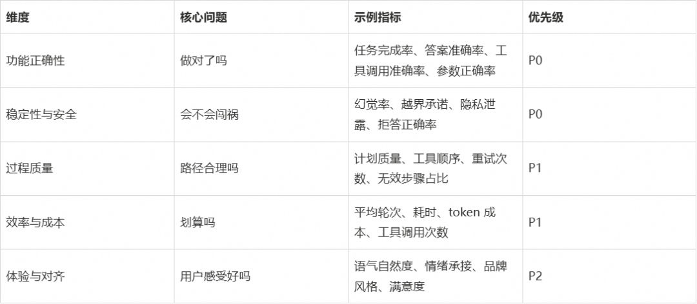

如果系统大量依赖 Skill，可以在上述五大维度下再补一组 Skill 子指标：

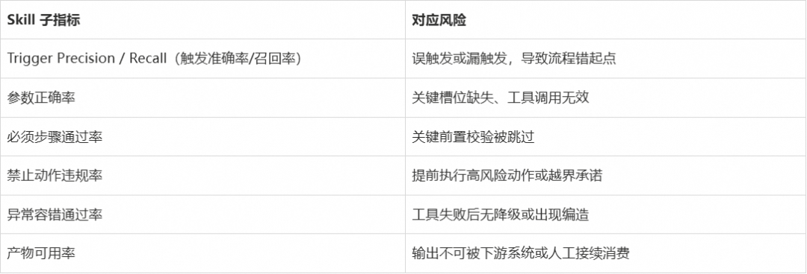

对于任务执行型，以及客服、营销、导购、售后这类对话型 Agent，要特别重视“多次运行的一致性”。同一个任务建议重复运行多次，观察两类结果：

- 至少一次成功率：同一个任务跑N次，只要有一次成功，就说明 Agent 具备完成这个任务的可能性，适合观察能力上限；
- 连续成功率：同一个任务跑N次，必须每次都成功，才说明 Agent 稳定可靠，适合客服、支付、退款、合规等生产级场景。

生产系统更关心“连续成功率”。因为用户不会接受“多试几次总有一次成功”，他们需要的是每次都稳定完成。在版本对比场景里，至少一次成功率和连续成功率还需要配套统计检验，避免把随机波动误判为能力变化。建议在报告中同时给出：

- 关键指标的置信区间：说明结果的稳定范围，避免只看单点分数；
- 与基线版本的显著性判断：判断差异是“真实提升/下降”还是随机波动；
- 最小可感知变化阈值：提前定义“至少提升（或下降）多少才算值得做发布判断”。

简单说，门禁不只看“差了多少”，还要看“这个差异是否超过统计噪声”。

# 05

评测数据集建设划重点：评测集并非线上数据的随机抽样，是围绕高风险路径、关键逻辑和失败模式设计出来的质量资产。评测集不能只靠随机抽样线上数据。线上样本往往有明显幸存者偏差：正常流程占大多数，真正会让 Agent 出错的边缘场景占比很低。只做随机采样，报告通常“看起来不错”，但关键问题会被漏掉。本文中的“黄金评测集（Golden Set）”默认作为“基线评测集”使用（一组相对稳定、长期复用的核心样本），主要用于版本对比和发布门禁。推荐的数据集建设路径：

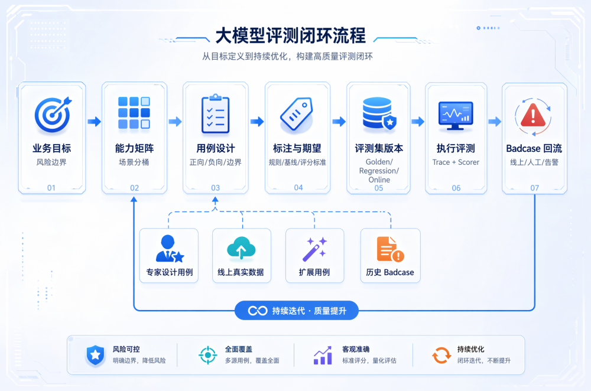

评测集至少包括四类来源：

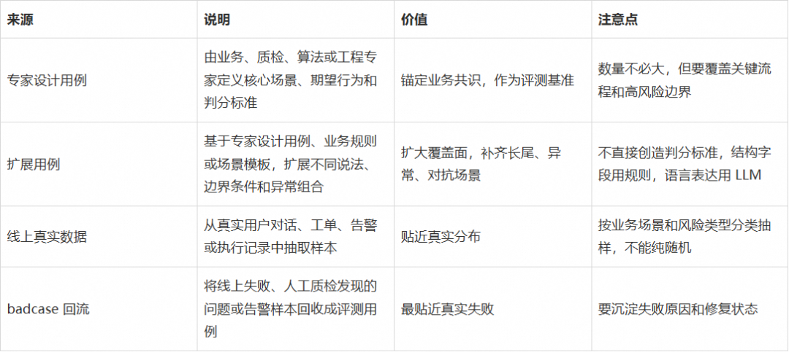

- 专家设计用例负责“定标准”，扩展用例负责“扩覆盖”。扩展用例不应脱离专家用例和业务规则自由生成，建议先用规则确定场景类型、订单状态、用户诉求、期望动作等结构字段，再用 LLM 生成更接近真实用户的自然语言表达。
- 先做 50-200 条高质量 golden set，覆盖核心业务路径和高风险边界；成熟后再扩展到分类采样集、长尾集、对抗集、线上回流集。
- 对包含 Skill 的 Agent，用例设计可沿“触发、核心逻辑、产物质量、异常容错”四类组织：
- 示例

# 06

评分划重点：可以用规则来主判打分，LLM Judge主要用于语义和策略这类非确定性维度。评分器可以分三类，优先级从高到低：

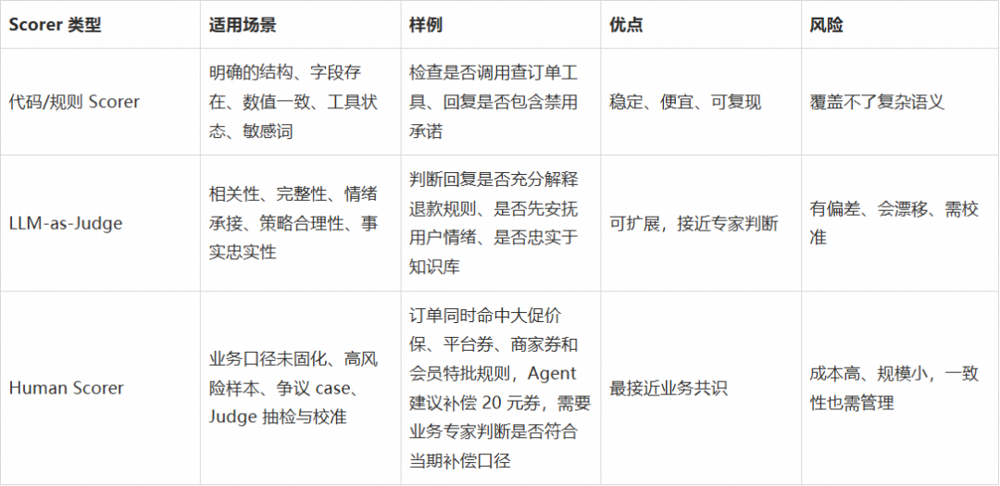

1. 整体原则是：2. LLM-as-Judge 不能只写“请从 1 到 5 打分”，好的 Judge 至少需要：3. 人工评分不适合承担日常全量打分，更适合用在以下几个环节：4. 是否进入人工评分不应只由 LLM Judge 的分数阈值决定，而应做成“人工评分路由”：5. 对于 Skill 密集型任务，可以针对 Skill 做专项评测，避免只看端到端结果。这里的 Skill 检查项用于“判分与分流”，不用于“归因与定责”；归因和责任判定统一放到第 7 章的 badcase 分析阶段：

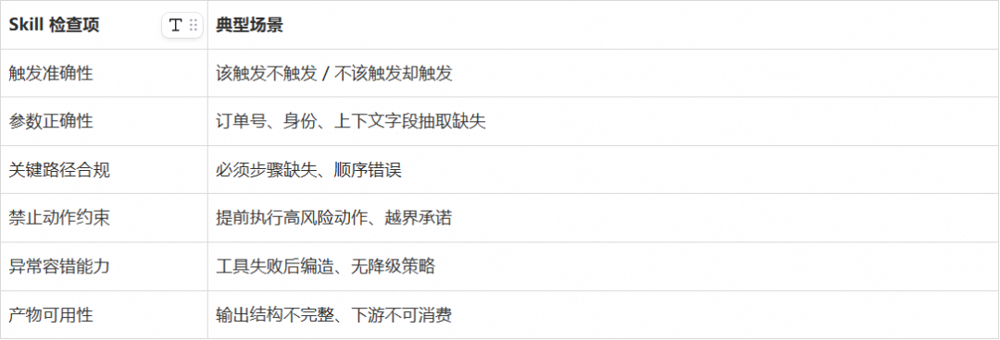

6. 持续评测，可以维护一套 Judge 金标校准集，并在每次 Judge Prompt/模型版本升级时固定产出三类统计指标：7. 在评分的实际执行阶段，可以采用“分层筛查”识别 badcase，并控制进入 RCA 的样本质量：先用低成本、确定性强的能力快速分流，再对疑似样本做更完整的语义和策略判断，最后把高风险、低置信或冲突样本交给人工终判。评分结果不应只输出pass/fail，还应输出初始问题分类、问题现象、置信度和判定依据。这样第 7 章做根因定位时，才能基于“现象入口”收敛候选模块，而不是对所有模块无差别排查。这里的问题分类是现象层分类，例如“事实性错误”“答非所问”“过度承诺”，不等同于最终根因或责任模块。

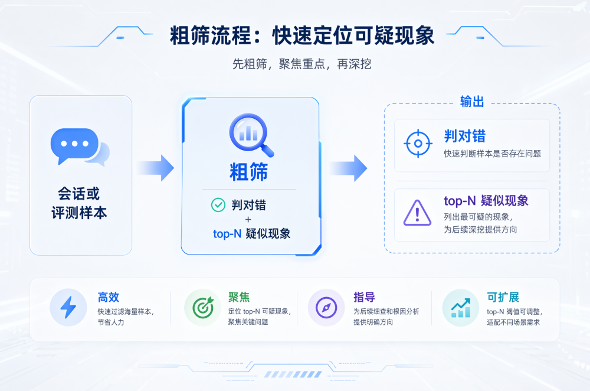

对结果假阳性case（最终回复看起来正确，但执行路径或风险检查不通过）可增加过程型和风险型检查：

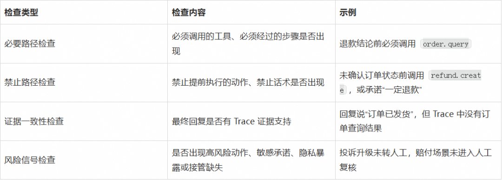

综上，除了输出分值、pass/fail，评分结还应输出问题分类（可以提前由产品、业务、研发协商定义出来）、问题现象、置信度和判定依据。这样第 7 章做根因定位时，才能基于“现象入口”收敛候选模块，而不是对所有模块无差别排查。这里的问题分类是现象层分类，例如“事实性错误”“答非所问”“过度承诺”，不等同于最终根因或责任模块。

# 07

Badcase 分析与根因定位划重点：Badcase 根因定位的核心是把错例稳定追到责任模块和可修复原因。Tips：Badcase 不只来自离线评测集，也来自线上会话、人工质检、投诉工单、低满意度样本、版本回归失败和监控告警（可以作为评测集的补充）。在进入根因定位前，我们把入口统一为两条通路：

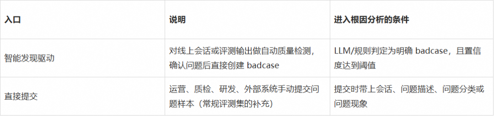

这两条链路最终应汇入同一个 badcase 任务表和同一套根因分析 Pipeline（处理流水线），这样既能覆盖线上长尾，也能支持运营和研发主动排查。根因定位要判断「哪里出问题了」。端到端失败通常只是表象，真正原因可能来自用户意图识别、上下文记忆、检索召回、工具选择、参数构造、业务规则理解、模型推理、回复生成、Guardrail（安全护栏）拦截或外部系统异常等等诸多环节。Badcase RCA（根因分析）可以用一个“先收集证据、再收敛范围、最后定责落盘”的通用链路来表达：

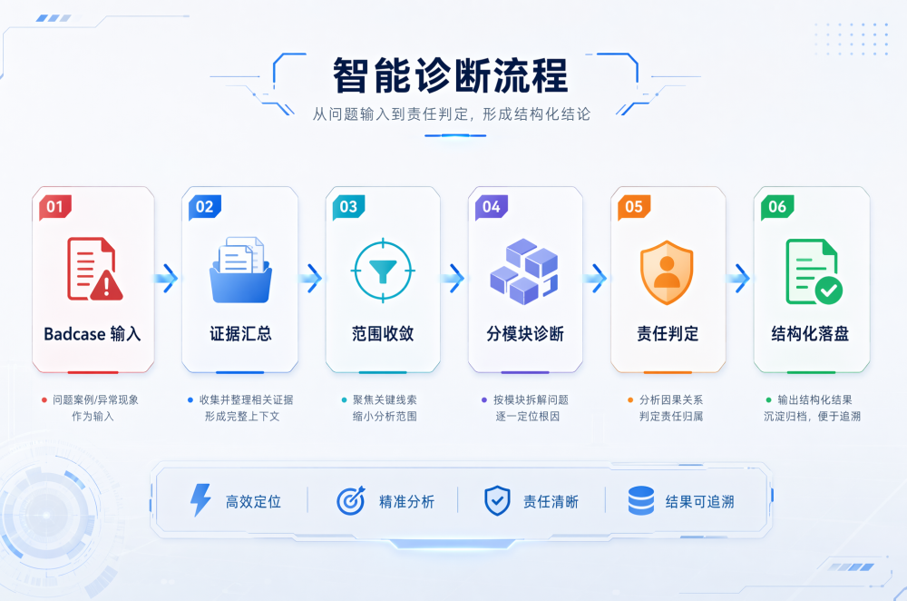

第一步是证据汇总。可以按sessionId、chatId、traceId或评测运行 ID 找到对应链路日志，汇总用户输入、Agent 回复、功能模块输入输出、prompt、工具调用、异常、耗时和中间产物。状态以持久化任务记录为准，运行时工作区保存中间产物，便于异步执行、轮询查询和失败恢复。第二步是范围收敛。不要对全部功能模块无差别分析，否则成本高、噪声大、结论也容易散。更好的方式是维护“问题现象 × 功能模块”的映射。例如“答非所问”优先看意图识别、Query 改写、知识筛选；“过度承诺”优先看风险拦截和回复生成；“订单未澄清”优先看槽位抽取和上下文判断。映射命中走确定性路径，未命中再让 LLM 做兜底缩圈。示例如下：

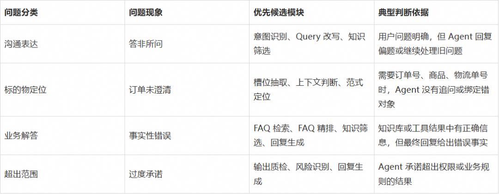

这张表只用于缩小候选范围，不直接等同于最终定责。最终责任仍要结合 Trace、模块输入输出、工具返回和规则/Judge 结论确认（见第六章的输出结果）。第三步是分模块诊断。对候选模块逐个读取 input、output、prompt、工具返回和异常日志，输出要有问题摘要、关键证据、改进建议和可归因的结构化字段。举例：一条Badcase的问题现象是“事实性错误”，优先排查FAQ 检索、知识检索和回复生成。分模块诊断时可以先看 FAQ 检索是否召回正确政策，再看知识检索是否保留关键片段，最后看回复生成是否忠实使用这些证据。如果前两段都通过但最终回复仍说错，就可以把回复生成标为FAIL，并把前两个模块标为PASS或SOFT_PASS（基本通过但有轻微瑕疵）。第四步是责任判定。该阶段消费“问题现象 + 分模块诊断结果 + 根因知识库”，输出责任模块、问题分类、问题枚举和修复建议。

- 这里的问题分类是面向报告和看板的问题大类，比如语义理解、知识召回、工具执行、风险防控；
- 问题枚举则是更细的失败类型。做法是可以不是完全交给 LLM，而是三层策略：先用严重模块结论直接定责，再用规则引擎匹配确定性模式，最后用 LLM 汇总复杂链路中的责任传递关系。这样既保留确定性，又能处理多模块耦合问题。

举例：上面的“事实性错误”样本中，分模块诊断显示 FAQ 检索和知识筛选都通过，只有回复生成把正确业务政策解释错。责任判定阶段就可以把主责落到回复生成模块，问题分类归为“模型指令遵循”，问题枚举归为“证据使用错误”，修复建议则指向回复生成 Prompt、引用约束或忠实性校验。第五步是结构化落盘与查询。根因结果不要只存在一次性报告里，而应结构化写入任务记录，至少包括问题分类、问题现象、问题枚举、责任层、责任模块、置信度、详细报告和修复建议。前端或看板可渐进展示：范围收敛后展示候选列表，分模块诊断后展示逐模块结论，责任判定完成后展示主责、次责和建议动作。工程实现上，可以把单次 badcase 分析建模成一个异步 Multi-Agent Workflow（第六章的评分能力也可以是Multi-Agent形式），例如：

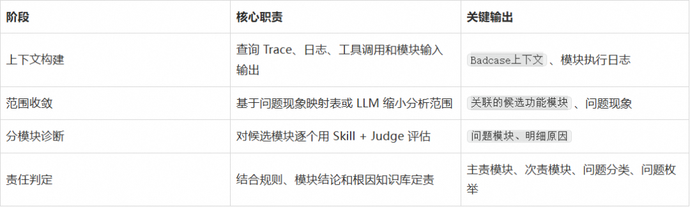

可以把每条Badcase拆成三层归因：

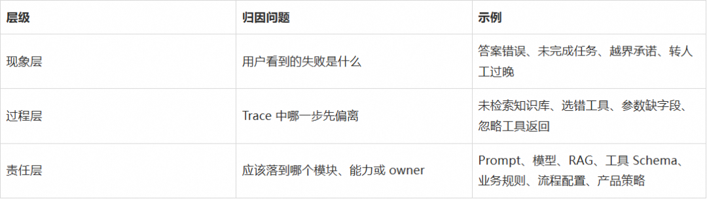

而 Skill 相关问题可以进一步快速分流，避免归因时反复拉扯：

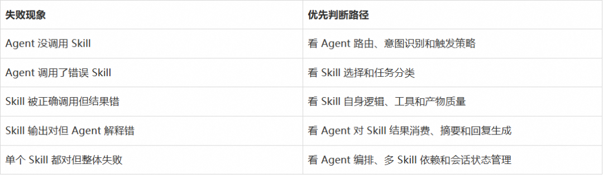

另外，RCA在落地时，也可以参考第六章的评分逻辑，按「确定性优先、模型辅助、人审兜底」的方式实现：

1. 先用规则定位硬错误。例如工具未调用、调用顺序违反 SOP、参数缺失、工具报错未重试、数据库状态未变化、引用来源不存在；
1. 再用 Trace Scorer 定位过程偏差。例如计划与目标不一致、检索证据不足、工具返回被误读、多轮上下文被覆盖；
1. 然后用映射表缩小候选范围。例如问题现象已知为“事实性错误”，优先检查 FAQ 精排、FAQ 检索、文档召回、知识筛选和生成模块；
1. 最后用 LLM 辅助语义归类和聚类。例如将“解释不完整”“业务口径理解错”“用户意图澄清不足”这类自然语言描述，映射到既有的问题分类和问题枚举，避免同类问题被拆成多个零散标签；
1. 对高风险、低置信或规则与 Judge 冲突的样本进入人工复核，人工结论反向校准规则、Judge Prompt 和根因标签体系。

根因标签要稳定、可统计，并能指向明确 owner 和处理动作，方便后续进入工单流转。一个根因标签体系（供参考）可以从以下几类开始：

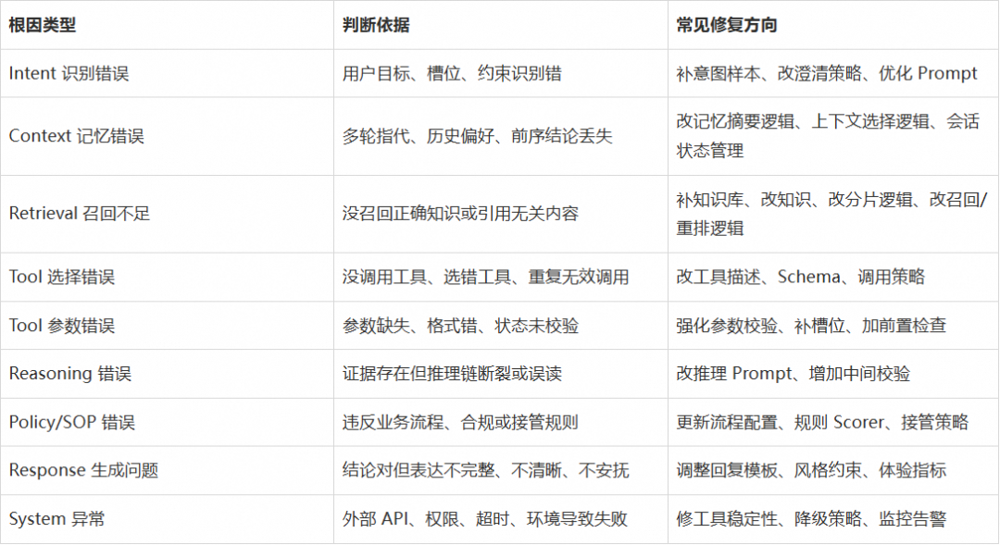

站在每个问题枚举的角度，是可以绑定解决角色，例如运营可配置、算法需优化、工程需修复、业务需定口径。例如用户申请已发货订单退款时，Agent 没有先查询订单状态就直接承诺“可以退款”。这条 Badcase 可以归到“工具覆盖与执行”，问题枚举是“关键工具未调用”，责任模块是退款 Skill / 退款流程执行模块。站在评测整体的角度，可以支持Badcase的聚类：同一根因、同一业务场景、同一工具或同一知识点的失败应该自动聚成问题簇。这样报告里不只是列出 100 条Badcase，而是产出“退款已发货场景中，Agent 23 次跳过订单状态校验，主要集中在 v1.8 Prompt”的问题簇。

# 08

自动优化建议产出划重点：优化建议要落到明确 owner、修复动作和回归验证，不能只停留在报告结论里。完成根因定位后，下一步就是把“原因”翻译成“动作”。建议项不能只停留在“优化 Prompt”“加强训练”“提升准确率”这类泛化表述，而要明确失败范围、证据、具体动作、owner、验收方式和优先级。工程化落地时，不应只生成自然语言结论，要产出结构化行动项。行动项要能被工单系统、看板、配置平台和研发流水线直接消费。换句话说，建议是质量工程里的标准任务对象。继续使用第 7 章“已发货退款未查订单状态”的例子，可以把“为什么这么建议”展开成一条证据链：

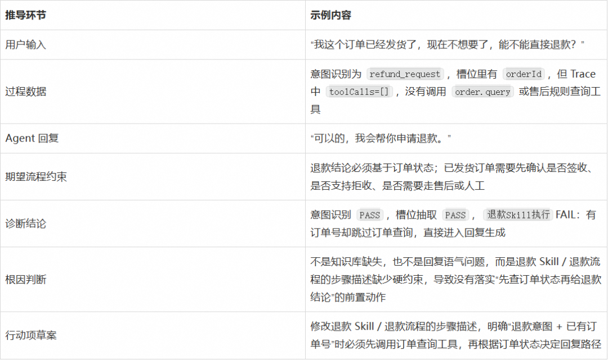

这条证据链落到标准行动项里，可以写成：

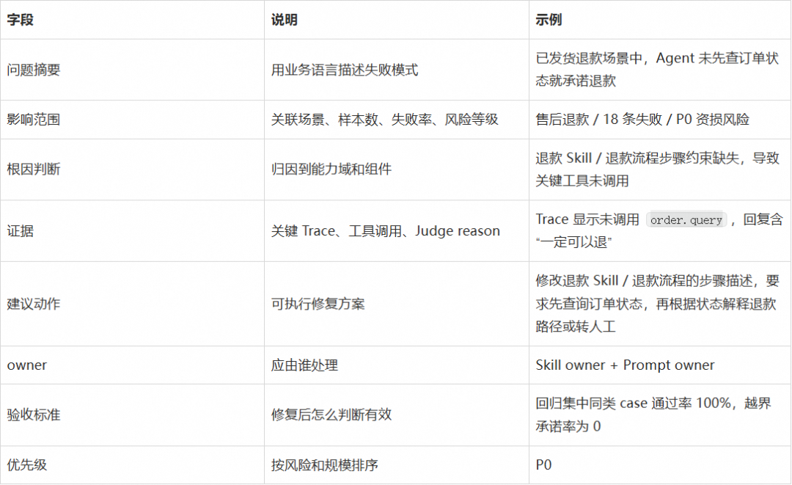

不同根因对应的优化手段也应该区分处理（仅供参考）：

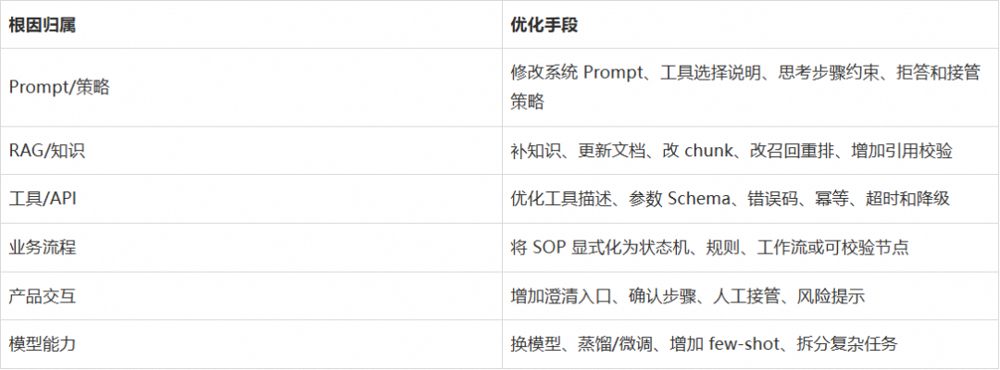

甚至可以分成四个等级：

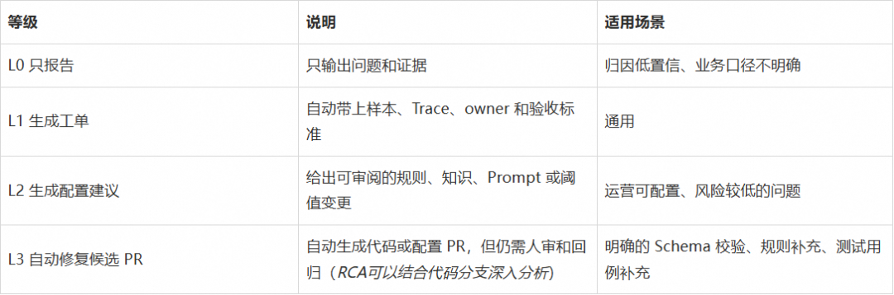

# 09

全链路闭环：从 Bug 到生产反馈划重点：评测平台的终点不是报告，而是把线上失败持续转化为可复用的研发资产。第 7、8 章分别解决“为什么错”和“怎么修”，第 9 章要解决的是“如何持续运转”。一套完整评测系统不能停在报告和建议上，还要把 Badcase 变成 bug、工单、配置变更、知识库修订、训练数据和回归用例，并在每个版本周期里持续运行。一个完整的 Agent 评测平台通常包含九个能力模块：

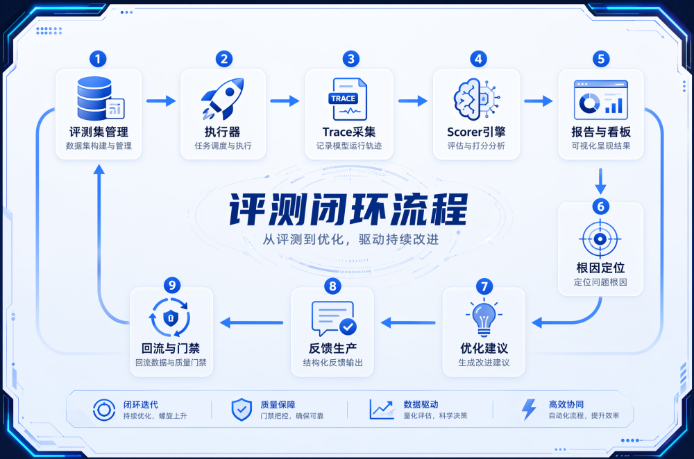

离线评测通过不等于线上一定变好。发布阶段建议把离线门禁和线上灰度联动，至少跟踪三类信号：

- 离线质量信号：核心场景通过率、P0 风险数、关键工具参数正确率；
- 线上体验信号：转人工率、重复追问率、投诉率、满意度变化；
- 业务结果信号：任务完成率、工单闭环率、退款/赔付成功率等。

如果离线提升但线上关键信号恶化，应该触发回滚或降级！工程化时要把 Trace 输出当作被测 Agent 的标准能力，而不是事后补救。Trace 至少需要稳定记录工具名、入参、返回值、时间戳、耗时和错误；复杂 Agent 还应记录计划、检索、Guardrail等。评测执行环境也要隔离，避免多个用例共享状态导致分数不可复现。反馈生产是评测闭环里最容易被低估的一环。发现问题本身不会自动带来收益，只有把问题沉淀成可复用资产，下一轮迭代成本才会下降。反馈生产要把“线上失败”变成“研发资产”。一个成熟闭环通常长这样：

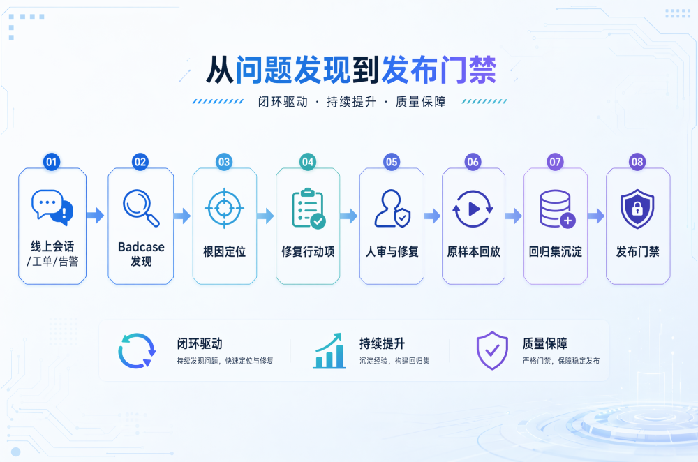

一条Badcase至少可以生产3类反馈：

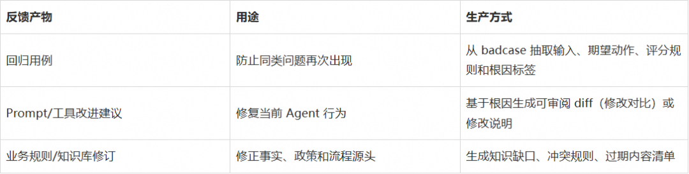

更进一步，平台可以把反馈分成三条生产线：

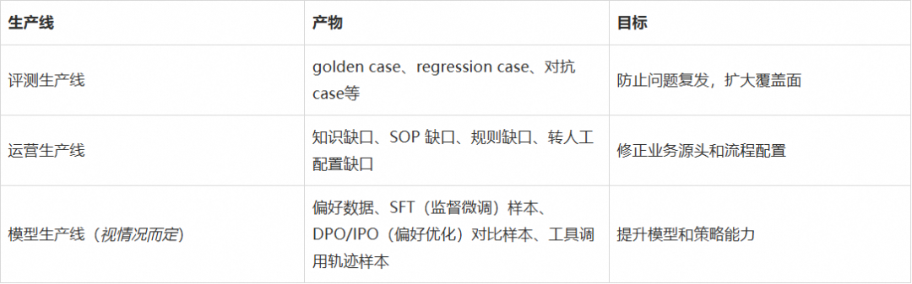

反馈生产要有“入库标准”，不能把所有失败都无差别塞进回归集。建议满足以下条件再入库：

1. 失败可复现，或至少有稳定 Trace 和人工确认；
1. 期望行为明确，可以写成规则、Judge 标准或人工验收标准；
1. 根因标签清楚，能归到具体能力域或业务流程；
1. 样本有代表性，能覆盖一类问题，而不是一次性环境抖动；
1. 已完成脱敏，符合隐私和数据合规要求。

为了避免回归集无限膨胀，还需要做样本治理：同簇样本保留代表例，关键 P0/P1 风险长期保留，已稳定多版本通过且风险低的样本可以降级为抽样集；线上新分布出现时，通过主动学习优先抽取低置信、高影响、新意图、新工具和新知识点样本进入人工确认。最终，评测平台要沉淀的是一套可复用的质量资产库：用例库、Trace 库、根因标签库、修复建议库、Judge 校准集和回归集。质量资产越厚，Agent 迭代越不会靠个人经验和临时救火。

# 10

难点与解法划重点：评测体系的成败，取决于它能否在跨团队协作中长期、稳定地产生可执行行动项。

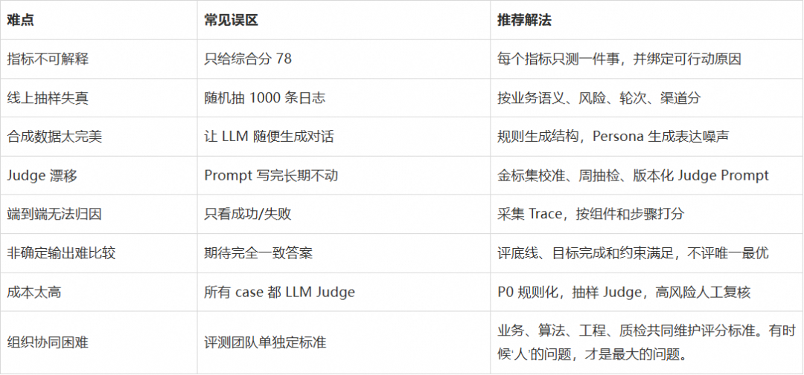

评测体系必须把低分稳定转成行动项，否则再精细的分数也只是报表。

欢迎留言一起参与讨论~