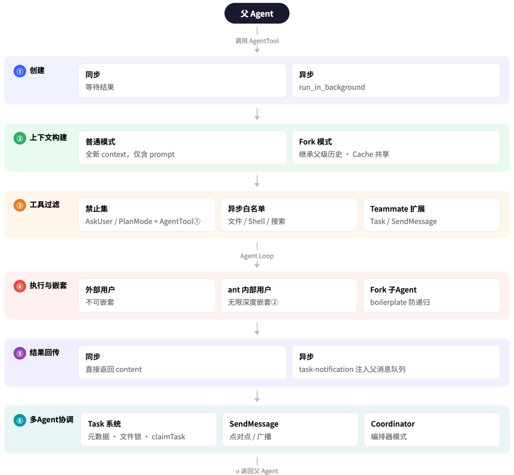

# 深入解析Claude Code的Subagent机制

前文推荐：[Claude Code源码泄漏，51 万行！我用Claude Code深度解析Claude Code](https://mp.weixin.qq.com/s?__biz=MzkyNzQ5NjA1MA==&mid=2247485367&idx=1&sn=62cf1f4a070d58640ff46a58f3a39083&scene=21#wechat_redirect)

本文基于 Claude Code 源码，深入分析 Subagent 的完整实现——它如何被创建、如何管理上下文、能看到哪些工具、如何并行、能否嵌套，以及与 Task 系统的本质区别。

## 目录

- 1. 什么是 Subagent：从工具调用到独立 Claude 实例
- 2. AgentTool 的完整参数
- 3. 上下文管理：Subagent 能"看到"什么
- 4. Fork 模式：共享父 Agent 完整上下文的特殊机制
- 5. 工具可见性：三级工具过滤体系
- 6. 并行执行：fire-and-forget 的无锁并发
- 7. 嵌套 Subagent：能嵌套几层？
- 8. SendMessageTool：Agent 间的双向通信
- 9. Worktree 隔离：给 Agent 一个独立的 Git 工作区
- 10. Agent 持久记忆：跨会话的经验积累
- 11. Task vs Agent：概念辨析
- 12. 多 Agent 协调全景：Coordinator 模式
- 13. 关键文件速查
- 14. 总结：设计哲学

## 概览

Claude Code 中的**Subagent**是通过AgentTool（曾用名Task）创建的**独立 Claude 实例**。当父 Agent 的 LLM 决定调用这个工具时，系统会启动一个完整的新 Agent Loop，这个子实例拥有自己的：

- • 独立的对话历史（消息队列）
- • 独立的 context window
- • 独立的工具权限集合
- • 独立的 abort controller（但与父级联动）
- • 可选的独立 Git 工作区（worktree）

**核心文件**：src/tools/AgentTool/AgentTool.tsx
一个有意思的历史遗留细节：
// src/tools/AgentTool/constants.ts:1-3
export
AGENT_TOOL_NAME
'Agent'
// Legacy wire name for backward compat
LEGACY_AGENT_TOOL_NAME
'Task'
AgentTool 在协议层曾经叫Task，现在改名为Agent，但为了向后兼容（权限规则、hooks 配置、resumed session），旧名称依然被保留。这也是为什么 Task 和 Agent 概念容易混淆的历史原因之一。

## 二、AgentTool 的完整参数

interface
AgentToolInput
{
// 基础参数
description
string
// 3-5 词的任务简述（展示给用户）
prompt
// 交给子 Agent 的完整任务描述
// Agent 类型
subagent_type
?:
// 内置类型：'Explore'、'Plan' 等；省略则触发 fork
// 模型覆盖
model
'sonnet'
|
'opus'
'haiku'
// 可选，默认继承父级
// 执行模式
run_in_background
boolean
// true = 异步后台执行，立即返回 agentId
// 多 Agent 协作参数
// 赋予 Agent 一个名字，使其可被 SendMessage 寻址
team_name
// 加入某个 Team，共享 taskListId
PermissionMode
// 权限模式，如 'plan'
// 隔离参数
isolation
'worktree'
'remote'
// Git worktree 隔离或远程执行
cwd
// 强制覆盖工作目录
}
**内置 Subagent 类型**（src/tools/AgentTool/built-in/）：

### 类型用途Explore快速探索代码库，只读操作Plan设计实现方案，输出步骤计划verification验证代码正确性（省略）触发 fork 模式（见第四节）

**One-shot 类型**（src/tools/AgentTool/constants.ts:9）：Explore和Plan被标记为 one-shot——父 Agent 不会再 SendMessage 继续它们，结果返回后即终止。为节省 token（~135 chars × 3400 万次/周），这两种类型的结果不附带 agentId 和 usage trailer。

## 三、上下文管理：Subagent 能"看到"什么

Subagent 的上下文是**从零构建的**，而不是继承父级的对话历史。

### 3.1 普通 Subagent 的上下文初始化

**文件**：src/tools/AgentTool/runAgent.ts，src/utils/forkedAgent.ts:345
父 Agent 调用 AgentTool
↓
子 Agent 收到的初始消息 = [单条 user 消息: prompt 内容]
系统提示 = selectedAgent.getSystemPrompt()（该 agent 类型的专用系统提示）
工具列表 = 按该 agent 类型过滤后的工具集合（见第五节）
子 Agent**看不到**父级的对话历史，它只知道prompt里写了什么。

### 3.2 上下文隔离的具体实现

createSubagentContext()函数（forkedAgent.ts:345）负责为子 Agent 构建隔离的执行上下文：
属性
处理方式
readFileState
（文件缓存）
**克隆**
自父级
避免重复读取，但不共享写状态
abortController
**新建**
，链接到父级
父级取消可传播，但子级取消不影响父级
setAppState
**no-op**
（静默丢弃）
防止子 Agent 污染父级 UI 状态
setResponseLength
子 Agent 的输出长度不计入父级
updateFileHistoryState
文件修改历史独立
updateAttributionState
**共享**
父级回调
功能安全，attribution 需跨 Agent 统计
setAppStateForTasks
**始终路由到根**
Task 状态必须在全局根 store 注册
**关键设计原则**：子 Agent 默认与父级完全隔离，只有少数需要跨 Agent 协调的状态（attribution、task 注册）才共享根回调。

## 四、Fork 模式：共享父 Agent 完整上下文的特殊机制

这是 Claude Code 中最精妙的设计之一。
**文件**：src/tools/AgentTool/forkSubagent.ts，通过 feature flagFORK_SUBAGENT控制

### 4.1 Fork 是什么

当 feature flagFORK_SUBAGENT开启，且父 Agent 在一次响应中**省略subagent_type**时，触发 fork 模式。Fork 子 Agent 不是从零开始——它**继承父 Agent 的完整对话历史**，从当前时刻"分叉"出去并行工作。
FORK_AGENT 的定义（forkSubagent.ts:60）：
= {
agentType
'fork'
,
: [
'*'
],
// 继承父 Agent 的全部工具
maxTurns
200
'inherit'
// 模型与父 Agent 完全一致（保证 cache 命中）
'bubble'
// 权限弹窗"冒泡"给父级处理
() =>
''
// 不用自己的系统提示，直接用父级已渲染的

### 4.2 Fork 上下文的构建（buildForkedMessages）

buildForkedMessages()函数（forkSubagent.ts:107）构建子 Agent 的初始消息序列：
[...父级历史消息]
+ [父级最后一条 assistant 消息（完整保留所有 tool_use blocks）]
+ [user 消息: 占位 tool_result × N 条 + 专属指令]
**最关键的工程细节**：所有 fork 子 Agent 的 tool_result 占位符使用**完全相同的文本**：
// forkSubagent.ts:93
FORK_PLACEHOLDER_RESULT
'Fork started — processing in background'
这保证了多个 fork 子 Agent 向 API 发出的请求前缀是**字节完全相同**的，从而最大化 prompt cache 命中率。每个子 Agent 只有最末尾的指令 text block 不同——这是唯一区分它们的部分。

### 4.3 Fork 子 Agent 的行为约束

每个 fork 子 Agent 的指令末尾会附上一段强制性的规则（forkSubagent.ts:171）：
<fork_boilerplate_tag>
规则（不可违反）：
1. 你就是这个 fork，不要再派生子 Agent
2. 不要对话，不要提问
3. 直接静默地使用工具
4. 如果修改了文件，汇报前先 commit（附 hash）
5. 工具调用之间要输出文字（进度说明）
6. 保持在分配的范围内
7. 最终报告不超过 500 字
8. 以 "Scope:" 开头
</fork_boilerplate_tag>

### 4.4 防止递归 Fork

Fork 子 Agent 虽然工具列表里有 AgentTool，但调用时会被检测拦截（forkSubagent.ts:78）：
function
isInForkChild
messages:MessageType[]
):
return
messages.
some
m=>
// 检测消息历史中是否含有 <fork_boilerplate_tag>
content.
block=>
block.
===
'text'
&&
includes
`<${FORK_BOILERPLATE_TAG}>`
})
只要消息历史中存在<fork_boilerplate_tag>，就判定当前是 fork child，拒绝再次 fork。这是通过**检测对话内容**而不是维护计数器来防递归的——因为在 fork 继承的上下文中，boilerplate 标记永远存在。

## 五、工具可见性：三级工具过滤体系

**文件**：src/tools/AgentTool/agentToolUtils.ts:70，src/constants/tools.ts
Subagent 能看到的工具由三级过滤规则共同决定：

### 5.1 全局禁止工具（所有 Agent 都不可用）

// ALL_AGENT_DISALLOWED_TOOLS（节选）
TASK_OUTPUT_TOOL_NAME
// 仅用于主线程向外输出
EXIT_PLAN_MODE_V2_TOOL_NAME
// 计划模式退出（需单独授权）
ENTER_PLAN_MODE_TOOL_NAME
// 进入计划模式
ASK_USER_QUESTION_TOOL_NAME
// 子 Agent 不能向用户提问
TASK_STOP_TOOL_NAME
// 不能从内部停止 task
// 外部用户禁止；USER_TYPE==='ant'（Anthropic 内部员工）时跳过，可无限嵌套
**注意最后一条**：在非 Anthropic 内部员工（USER_TYPE !== 'ant'）的构建中，AgentTool本身也在禁止列表里——普通 Subagent**默认不能再派生 Subagent**。

### 5.2 异步 Agent 的限制工具集

后台异步 Agent（run_in_background: true）只能使用白名单工具：
// ASYNC_AGENT_ALLOWED_TOOLS
FileReadTool
WebSearchTool
TodoWriteTool
GrepTool
WebFetchTool
GlobTool
BashTool
PowerShellTool
FileEditTool
FileWriteTool
NotebookEditTool
SkillTool
ToolSearchTool
EnterWorktreeTool
ExitWorktreeTool

### 5.3 In-Process Teammate 额外工具

当 Agent 作为团队成员（team_name参数）以 in-process 方式运行时，额外获得：
// IN_PROCESS_TEAMMATE_ALLOWED_TOOLS
TaskCreateTool
TaskGetTool
TaskListTool
TaskUpdateTool
SendMessageTool
CronCreateTool
CronDeleteTool
CronListTool
// 如果 AGENT_TRIGGERS 开启

### 5.4 过滤逻辑的优先级

MCP 工具（mcp__ 前缀）→ 始终允许（最高优先级）
计划模式退出工具 → 仅在 mode='plan' 时允许
ALL_AGENT_DISALLOWED_TOOLS → 始终禁止
CUSTOM_AGENT_DISALLOWED_TOOLS → 非内置 Agent 额外禁止
isAsync 限制 → 后台 Agent 只能用白名单
其余工具 → 允许

### 5.5 工具规格中的 allowedAgentTypes

父 Agent 配置权限规则时，可以对 AgentTool 本身加限制：
// 权限规则格式
"Agent(worker, researcher)"
// 表示只允许派生 'worker' 或 'researcher' 类型的子 Agent

## 六、并行执行：fire-and-forget 的无锁并发

**文件**：src/tools/AgentTool/AgentTool.tsx:733

### 6.1 并行的实现方式

当 LLM 在一次响应中同时调用多个 AgentTool 时，每个调用都立即以异步方式启动：
// AgentTool.tsx:733（核心）
void
runWithAgentContext
asyncAgentContext,
wrapWithCwd
runAsyncAgentLifecycle
({...}))
**void是关键**——它显式地"点火不等待"，每个 AgentTool 调用立即返回async_launched状态，父 Agent 继续执行。所有子 Agent 在后台并发运行，无需任何协调锁。

### 6.2 并发上限

**源码中没有发现并发 Agent 数量上限**。与工具执行（最多 10 个并发）不同，Agent 的并发完全没有限制——可以同时启动数十个子 Agent。
这也意味着：如果 LLM 判断某个任务可以拆成 20 个子任务并行，它完全可以一次性发出 20 个 AgentTool 调用，全部同时在后台跑。

### 6.3 父 Agent 如何感知子 Agent 完成

子 Agent 完成时，通过enqueuePendingNotification()向父 Agent 的消息队列注入一条通知：
<task-notification>
<task-id>
agent-abc123
</task-id>
<status>
completed
</status>

探索了 src/utils 目录，发现 3 个相关函数

<result>
</result>
<usage>
</usage>
</task-notification>
父 Agent 在下一次 LLM 调用时会在 user 消息中看到这个通知，然后决定下一步行动。**整个机制是纯异步事件驱动的**，没有任何 join/await 语义。

## 七、嵌套 Subagent：能嵌套几层？

### 7.1 默认情况：不能嵌套

如前文所述，ALL_AGENT_DISALLOWED_TOOLS在非 ant 构建中包含了AgentTool本身，所以普通 Subagent**默认不能再派生 Subagent**。

### 7.2 开启嵌套的条件

在以下情况下，Subagent 可以嵌套：

- 1.**Anthropic 内部构建**（USER_TYPE === 'ant'）：AgentTool 从禁止列表中移除
- 2.**In-process Teammate**（Agent Swarms 模式）：in-process teammate 被允许调用 AgentTool 派生同步子 Agent（agentToolUtils.ts:101-106）

### 7.3 Anthropic 内部已在使用的嵌套 Agent

这一行代码值得单独拿出来分析（src/constants/tools.ts:40-41）：
// Allow Agent tool for agents when user is ant (enables nested agents)
...(process.
env
? [] : [
]),
注释原文写得很清楚：**"Allow Agent tool for agents when user is ant (enables nested agents)"**。
这是一个典型的**内部灰度**模式：

- •USER_TYPE === 'ant'（Anthropic 内部员工）→ 展开空数组，AgentTool**不进**禁止列表 → 子 Agent 可以继续调 AgentTool，**任意深度嵌套**
- • 外部用户 → 展开[AGENT_TOOL_NAME]，进入禁止列表 → 无法嵌套

也就是说，**Anthropic 内部员工今天就可以用多层嵌套 Agent**，例如：
用户（外部）→ 主 Agent
└─ [当前对外限制到这一层]
用户（Anthropic 内部）→ 主 Agent
└─ Subagent（Explore）
└─ Subagent（Plan）
└─ Subagent（verification）...（任意深度）
这表明 Anthropic 在内部已经验证了多层 Agent 编排的可行性，并在实际工作流中使用它。**对外开放只是时间问题**，锁住的原因可能是：

- 1.**成本控制**：嵌套越深，token 消耗指数级增长，需要确保用户理解成本
- 2.**安全审查**：深层嵌套中权限传播路径更复杂，需要充分测试权限边界
- 3.**体验打磨**：嵌套 Agent 的 UI 展示、进度追踪、中断恢复等体验尚未完善

### 7.4 嵌套深度限制

**源码中没有MAX_AGENT_DEPTH或类似常量**。理论上，在允许嵌套的场景下，嵌套深度是无限的——依赖 LLM 自己判断何时停止。这说明 Anthropic 并不打算用硬性计数器来限制深度，而是相信 LLM 自身的判断。

### 7.5 Fork 子 Agent 的特殊限制

如第四节所述，fork 子 Agent 通过检测消息历史中的<fork_boilerplate_tag>来拒绝再次 fork。这是目前源码中**唯一一处硬性的嵌套防递归机制**——且只针对 fork 路径，不影响普通嵌套。

## 八、SendMessageTool：Agent 间的双向通信

**文件**：src/tools/SendMessageTool/SendMessageTool.ts

### 8.1 三种通信模式

### 模式用法说明点对点to: "agent-name"通过名字寻址已命名的 Agent直接 IDto: "agentId"通过内部 agentId 寻址广播to: "*"发给所有 teammates

### 8.2 消息路由逻辑

SendMessage(to: "worker-b", message: "...")
查询 agentNameRegistry（名字 → agentId 的 Map）
agent 状态检查：
├─ 正在运行 → 追加到 agent 的 pending message 队列
│              → agent 在下一轮工具执行后会读到
└─ 已停止    → 自动 Resume（从上次 transcript 恢复）
→ 携带该消息作为新的 user input

### 8.3 消息内容格式（Coordinator 模式）

在多 Agent 协调场景中，任务完成通知以 XML 格式传递（coordinator/coordinatorMode.ts:142）：
t42
实现了 UserAuth 模块，共 3 个文件
详细结果...
{ "input_tokens": 12000, "output_tokens": 800 }

### 8.4 Async Agent 的名字注册

子 Agent 在创建时如果指定了name参数，会在全局agentNameRegistry中注册（AgentTool.tsx:703）：
rootSetAppState
prev=>
next =
new
(prev.
next.
(name,
asAgentId
(asyncAgentId))
// "worker-b" → "agt_a1b2c3..."
{ ...prev,
: next }
这个注册表是实现SendMessage(to: "worker-b")的底层机制。

## 九、Worktree 隔离：给 Agent 一个独立的 Git 工作区

**文件**：src/tools/AgentTool/AgentTool.tsx:590，src/tools/EnterWorktreeTool/

### 9.1 什么是 Worktree 隔离

当isolation: 'worktree'时，Claude Code 会为子 Agent 创建一个独立的 Git worktree——同一个仓库，但在不同的 branch 上，文件完全独立。
// AgentTool.tsx:590-593
(effectiveIsolation ===
) {
slug =
`agent-${earlyAgentId.slice(0,8)}`
worktreeInfo =
createAgentWorktree
(slug)
子 Agent 的所有文件操作都在这个 worktree 目录下进行，不影响父 Agent 的工作目录。

### 9.2 Fork + Worktree 的上下文提示

当 fork 子 Agent 在 worktree 中运行时，会自动收到一条上下文提示（forkSubagent.ts:205）：
你正在独立的 git worktree 中运行（路径：{worktreePath}）
——同一个仓库，相同的相对文件结构，但独立的工作副本。
继承的上下文中的路径指向父 Agent 的工作目录；
请将它们翻译到你的 worktree 根目录。

### 9.3 Worktree 的自动清理

子 Agent 完成后，cleanupWorktreeIfNeeded()决定是否保留 worktree：

- •**有 Git 变更**→ 保留 worktree，并将 branch 信息写入结果
- •**无变更**→ 自动删除 worktree
- •**Hook-based worktree**→ 始终保留（无法检测变更）

结果中会携带 worktree 信息，供父 Agent 决定如何处理这些变更（merge、review 等）：
// 子 Agent 返回结果中包含
'/path/to/repo/.git/worktrees/agent-abc123'
worktreeBranch
'agent-abc123'

## 十、Agent 持久记忆：跨会话的经验积累

**文件**：src/tools/AgentTool/agentMemory.ts
每种类型的 Agent 可以维护跨会话的**持久记忆**，以MEMORY.md文件的形式存储。

### 10.1 三种记忆范围

AgentMemoryScope
'user'
'project'
'local'

### 范围存储路径特点user~/.claude/agent-memory/<agentType>/跨项目，适合通用学习project.claude/agent-memory/<agentType>/随代码库 Git 管理，团队共享local.claude/agent-memory-local/<agentType>/项目级但不提交，机器私有

如果设置了CLAUDE_CODE_REMOTE_MEMORY_DIR环境变量，local 范围的记忆会存储到远端挂载目录，实现跨机器共享。

### 10.2 记忆文件的加载

loadAgentMemoryPrompt()在每次 Agent 启动时读取MEMORY.md，将内容注入系统提示的末尾。记忆内容对该类型的所有 Agent 实例生效——不论是第一次还是第 100 次被派生。
**路径安全**：isAgentMemoryPath()通过normalize()防止路径穿越攻击（..绕过），避免 Agent 操作非法路径。

## 十一、Task vs Agent：概念辨析

这是最容易混淆的部分，源码中有明确的设计边界。

### 11.1 核心区别

维度
**本质**
纯数据，工作单元描述
可执行实体，独立 Claude 实例
**存储**
JSON 文件（
~/.claude/tasks/
AppState（内存中的运行状态）
**执行**
不执行任何代码
有完整的 Agent Loop
**状态**
pending / in_progress / completed
pending / running / completed / failed / killed
整个 team 共享同一个 taskListId
每个 Agent 有独立的 agentId
**原子性**
文件锁保证并发安全
不需要锁，各自独立执行
**用途**
多 Agent 的工作分配和进度追踪
实际执行工作

### 11.2 两者的协作关系

Task 和 Agent 配合使用，实现多 Agent 的任务分发：
Orchestrator（Agent A）
├─ TaskCreate("实现 UserAuth 模块") → task [#1]()，status=pending
├─ TaskCreate("实现 PaymentAPI 模块") → task [#2]()，status=pending
├─ 派生 Worker B（Agent B，name="worker-b"）
└─ 派生 Worker C（Agent C，name="worker-c"）
Worker B（Agent B）
├─ TaskList() → 看到 [#1](), [#2]() 都是 pending
├─ claimTask([#1](), "worker-b") → 文件锁 + 写入 owner
└─ 执行工作... TaskUpdate([#1](), status='completed')
Worker C（Agent C）
├─ TaskList() → 看到 [#1]() 被 worker-b 占了
├─ claimTask([#2](), "worker-c")
**Task 是"招聘公告"，Agent 是"应聘者"**。Task 说明要做什么，Agent 认领并完成它。

### 11.3 claimTask 的原子性

多个 Agent 同时竞争同一个 Task 时，claimTask()通过文件锁确保只有一个能成功：
// tasks.ts:541
taskListId, taskId, agentName, options
(taskFilePath)
// 文件锁
task =
readTask
(taskId)
(task.
&& task.
!== agentName) {
success
false
reason
'already_claimed'
blockedBy
id=>
isCompleted
(tasks[id]))) {
'blocked'
writeTask
({ ...task,
: agentName,
'in_progress'
finally
unlock

### 11.4 getAgentStatuses：了解整个 Team 的状态

getAgentStatuses(teamName)扫描 task list，推断每个 Agent 的忙闲状态：
'idle'
'busy'
// busy = 持有任何未完成的 task
currentTasks
// 正在处理的 task ID 列表
Orchestrator 可以通过这个函数了解哪些 worker 当前空闲，决定是否需要派生新 worker 或向空闲 worker 分配更多工作。

## 十二、多 Agent 协调全景：Coordinator 模式

**文件**：src/coordinator/coordinatorMode.ts（369 行），通过COORDINATOR_MODEfeature flag 开启
Coordinator 模式是 Claude Code 最高级的多 Agent 协调机制，专为"有 Orchestrator 统筹、多 Worker 并行"的场景设计。

### 12.1 设计思想

Coordinator 的系统提示中有一段关键指导（coordinatorMode.ts:213）：

**并行是你的超能力**："同时启动多个独立 worker，不要串行等待"。 **Coordinator 不执行，只综合**："合成研究成果是你的工作，别把理解本身委托出去"。 **写入操作要串行**：如果多个 worker 要写同一批文件，让它们一个一个来。

### 12.2 Worker 的工具限制

在 Coordinator 模式下，Worker Agent 看不到以下工具（对它们隐藏）：
// 对 worker 隐藏的工具
TEAM_CREATE
TEAM_DELETE
// 管理团队（只有 coordinator 能做）
SEND_MESSAGE
// 消息传递（只有 coordinator 主动联系 worker）
SYNTHETIC_OUTPUT
// 内部输出工具
Worker 只拥有标准工具集（Bash、Read、Edit、MCP 工具等），专注执行。

### 12.3 完整的多 Agent 生命周期

用户输入任务
Coordinator Agent 启动
分析任务，制定并行策略
一次 LLM 响应中同时调用多个 AgentTool（全部 run_in_background）
所有 worker 并发启动（fire-and-forget）
Coordinator 继续等待通知
Worker 完成时发送 <task-notification>
Coordinator 读取通知，综合结果
如需继续，SendMessage 给特定 worker
输出最终结果给用户

## 十三、关键文件速查

行数
职责
~1,300
Subagent 创建、生命周期、结果处理
~220
Fork 模式：上下文继承、prompt cache 优化
~180
三级持久记忆系统
~480
工具过滤、结果 schema 验证
~280
Agent Loop 入口、消息流处理
~15
工具名常量、one-shot 类型集合
~470
Subagent 上下文隔离构建
~900
Agent 间消息路由
~370
多 Agent 协调器系统提示与配置
src/utils/tasks.ts
~862
Task 系统（文件存储、文件锁、claim）
~100
工具白名单常量定义
~130
Git worktree 创建
src/tools/ExitWorktreeTool/
~340
Git worktree 清理

## 十四、总结：设计哲学

### 1. 隔离是默认，共享是例外

普通 Subagent 与父 Agent 的状态完全隔离（no-op 回调），只有少数协调性状态（task 注册、attribution）通过明确共享的回调传递。这防止了"子 Agent 污染父 Agent 状态"的隐患，同时保留了必要的协调能力。

### 2. Fork 模式的 cache 工程

Fork 模式在实现"继承完整上下文"的同时，通过统一的占位符文本和 byte-identical 消息前缀，把 prompt cache 命中率最大化。这是一个精心设计的性能优化——多个并行 fork child 共享同一个 cache 前缀，大幅降低 token 开销。

### 3. 并发无上限，设计上就是如此

Agent 并发没有限制，这是有意为之——Coordinator 模式的核心价值就是"同时启动尽可能多的独立 worker"。依赖 LLM 的判断来决定合适的并发度，而不是硬编码限制。

### 4. Task 是数据，Agent 是执行，两者正交

Task 系统和 Agent 系统是两个独立的机制：Task 处理"要做什么"（工作项目、状态追踪、协调），Agent 处理"谁来做"（执行实体、上下文管理）。两者通过owner字段和claimTask()连接，但在设计上完全解耦。

### 5. AgentTool 曾经叫 Task

LEGACY_AGENT_TOOL_NAME = 'Task'这个历史遗留常量，是 Claude Code 早期设计演化的印记。当时"任务"和"智能体"是同一个概念，后来才分化为今天的两个独立系统。了解这段历史，有助于理解为什么两者在概念上如此接近却又不同。

**代码索引提示**：本文所有引用均附有文件路径和行号，可直接在项目中定位验证。

## 📚 专业词汇通俗解释（结合 NanoHermes 项目源码）

### 1. Agent Loop（代理循环）

**一句话：** Agent Loop 就是 AI 的"思考-行动-观察"循环——接收输入→调用 LLM 决定下一步→执行工具调用→看结果→继续循环，直到任务完成。

**类比：** 就像厨师做菜：看菜谱（接收指令）→决定先切菜还是先热锅（LLM 决策）→执行操作（工具调用）→尝味道看效果（观察结果）→循环直到菜做好。

**NanoHermes 源码对应：**
- `src/conversation/loop.py` → `ConversationLoop` 类
- 核心循环：`run()` 方法（第 88-409 行），while 循环最多 `max_iterations=90` 次迭代
- 每轮迭代做 4 件事：组装工具列表→调用模型→分发工具调用→检查是否结束

**关键字段/方法：**
| 字段/方法 | 作用 | 示例 |
|------|------|------|
| `_always_loaded_schemas` | 始终加载的核心工具 schema | read_file, terminal 等 6 个基础工具 |
| `_discovered_tools` | 通过 search_tools 动态发现的工具 | delegate_task, cronjob 等 11 个延迟加载工具 |
| `events` (EventBus) | 事件总线，解耦循环逻辑与外部处理器 | TUI 显示、记忆管理、调试日志都通过订阅事件接入 |

---

### 2. Subagent / 子代理（delegate_task）

**一句话：** Subagent 就是从主 Agent 中"分裂"出来的独立 AI 实例，有自己的对话历史、工具权限和超时限制，完成后把结果汇报给父 Agent。

**类比：** 老板（主 Agent）接到一个大项目，派 3 个员工（子 Agent）分别做市场调研、技术方案、成本估算，每个人独立完成自己的部分后汇报。

**NanoHermes 源码对应：**
- `src/delegation/manager.py` → `DelegationManager` 类
- `src/delegation/types.py` → `AgentRole`（LEAF / ORCHESTRATOR）、`ChildAgentConfig`
- `delegate_task` 工具：用户通过它触发子 Agent 创建

**关键参数：**
| 参数 | 作用 | NanoHermes 默认值 |
|------|------|------|
| `max_concurrent_children` | 最大并发子 Agent 数 | 3（通过 Semaphore 控制） |
| `max_spawn_depth` | 最大委托深度（防递归） | 2（当前用户配置为 1，禁止嵌套） |
| `child_timeout_seconds` | 子 Agent 超时时间 | 300 秒（5 分钟） |

---

### 3. 工具可见性 / 权限过滤

**一句话：** 不是所有工具都对子 Agent 开放——系统根据角色（LEAF vs ORCHESTRATOR）自动过滤掉危险或不适用的工具，防止子 Agent 做不该做的事。

**类比：** 公司里实习生（LEAF）只能用基础办公软件，项目经理（ORCHESTRATOR）可以审批预算和招人，但 CEO 才能决定公司战略。

**NanoHermes 源码对应：**
- `src/delegation/types.py:30-40` → `DELEGATE_BLOCKED_TOOLS` 和 `ORCHESTRATOR_ALLOWED_TOOLS`
- LEAF 被禁止的工具：`delegate_task`（防递归）、`clarify`（不能打扰用户）、`memory`（防写入冲突）、`execute_code`（降低安全风险）
- ORCHESTRATOR 额外获得：`delegate_task`（可以继续分解任务）

---

### 4. 上下文隔离

**一句话：** 子 Agent 从零开始构建自己的对话上下文，不继承父 Agent 的聊天历史，只拿到父 Agent 给的 task prompt 和专属工具集。

**类比：** 新员工入职，不会知道公司过去所有会议记录，只拿到岗位说明书（prompt）和必要的系统权限（工具）。

**NanoHermes 源码对应：**
- `src/delegation/manager.py` 中子 Agent 有独立的 `_event_bus`（第 82 行），不与父级共享
- 子 Agent 的会话通过 `parent_session_id` 建立关联但内容独立
- 子 Agent 的工具 schema 是通过 `_tool_schemas` 过滤后的子集传入

**Claude Code vs NanoHermes 对比：**
| 维度 | Claude Code Subagent | NanoHermes delegate_task |
|------|---------------------|--------------------------|
| 上下文构建 | 从零开始，只有 prompt | 从零开始，goal + context |
| Fork 模式 | 继承父级完整对话历史 | ❌ 未实现 |
| 工具过滤 | 三级过滤（全局/异步/团队） | 两级（BLOCKED + ALLOWED） |
| 并发控制 | 无上限 | Semaphore 限制 `max_concurrent=3` |
| 嵌套深度 | 内部无限制（仅外部用户锁住） | `max_spawn_depth=1`（当前配置） |

---

### 5. Task 系统 vs Agent 系统

**一句话：** Task 是"待办事项清单"（纯数据），Agent 是"执行任务的员工"（运行中的实体）。两者正交——Task 描述要做什么，Agent 决定谁来做。

**类比：** Jira 看板上的 ticket 就是 Task，开发 ticket 的程序员就是 Agent。ticket 不会自己写代码，程序员不接 ticket 也不知道该干什么。

**NanoHermes 对应概念：**
- NanoHermes 目前没有独立的 Task 文件系统（如 Claude Code 的 `~/.claude/tasks/`）
- 但通过 `todo` 工具实现了类似的待办管理功能
- `src/delegation/` 模块管理 Agent 的创建和执行，不管理 Task 列表
- **差异**：NanoHermes 的子 Agent 没有 claimTask 机制，直接由父 Agent 分配 goal

---

### 6. Event Bus（事件总线）

**一句话：** 事件总线是 Agent 内部的"广播系统"——核心循环发出事件，外部模块（TUI、记忆、调试）按需订阅，核心代码不需要知道谁在监听。

**类比：** 机场的航班信息显示屏——塔台（核心循环）发布航班状态变化事件，各个屏幕（TUI、日志、监控）自动更新，塔台不需要知道有多少屏幕在显示。

**NanoHermes 源码对应：**
- `src/conversation/events.py` → `EventBus` 类
- 支持 18+ 种事件类型：`LOOP_START`、`MODEL_REQUEST`、`TOOL_START`、`DELEGATION_START` 等
- 三种事件模式：仅观察（emit）、可修改（从 data 读回）、可阻断（检查 blocked）

---

### 7. Semaphore（信号量 / 并发控制）

**一句话：** 信号量就像游乐园的闸机——最多允许 N 个人同时进入，超过的人在门外排队等，有人出来才能进去下一个。

**类比：** 餐厅只有 5 张桌子（`max_concurrent=5`），来的客人超过 5 批就要等位，吃完一批出来才能进一批。

**NanoHermes 源码对应：**
- `src/delegation/semaphore.py` → `Semaphore` 类
- 核心计数器 `_active` 跟踪当前活跃子 Agent 数
- 双模式：同步（`acquire_sync`/`release_sync`）和异步（`acquire`/`release`）
- `__enter__`/`__exit__` 上下文管理器确保异常时自动释放

---

### 8. AgentRole（角色系统：LEAF / ORCHESTRATOR）

**一句话：** LEAF 是"只干活不指挥"的执行者，ORCHESTRATOR 是"既能干活也能分派任务"的协调者。

**类比：** 蚂蚁群——工蚁（LEAF）只负责搬食物，蚁后（ORCHESTRATOR）可以派出更多工蚁。

**NanoHermes 源码对应：**
- `src/delegation/types.py:12-26` → `AgentRole` 枚举
- `LEAF`：禁止 `delegate_task`、`clarify`、`memory`、`execute_code`
- `ORCHESTRATOR`：额外获得 `delegate_task` 权限，但受 `max_spawn_depth` 限制

---

### 9. Worktree（Git 工作树隔离）

**一句话：** 同一个 Git 仓库的不同分支的工作副本，多个 Agent 可以在各自的 worktree 里修改文件互不干扰，最后再合并。

**类比：** 同一套设计图纸的多份复印件，每位设计师在自己的复印件上画修改标记，互不影响原件。

**NanoHermes 对应：** NanoHermes 目前没有实现 worktree 隔离功能。子 Agent 在同一个工作目录中执行，依赖工具调用层面的隔离（如独立的文件读写）而非 Git 级别的隔离。

---

### 10. 持久记忆（Agent Memory）

**一句话：** Agent 的记忆是跨会话的持久文件（MEMORY.md / USER.md），每次启动新对话时自动加载，让 Agent"记住"过去学到的东西。

**类比：** 员工的笔记本——每天上班带着，昨天的笔记今天还能看到，不用从头教起。

**NanoHermes 源码对应：**
- `src/memory/` → 记忆系统模块
- `~/.nanohermes/memory/MEMORY.md` → 项目/环境记忆
- `~/.nanohermes/memory/USER.md` → 用户画像和偏好
- `memory` 工具 → Agent 主动写入/更新记忆

---

---

**💡 核心洞察：NanoHermes vs 文章理念的对照**

> 文章揭示了 Claude Code 如何通过 Subagent 系统实现多 Agent 并行、上下文隔离、工具权限过滤和跨 Agent 协调，核心设计哲学是"隔离是默认，共享是例外"。

你的 NanoHermes 在以下方面**已经实现**了文章的理念：

| 文章理念 | NanoHermes 实现 | 状态 |
|---------|----------------|------|
| 子 Agent 上下文隔离 | `DelegationManager` 为每个子 Agent 创建独立 EventBus 和会话 | ✅ 已实现 |
| 工具权限过滤 | `DELEGATE_BLOCKED_TOOLS` + `ORCHESTRATOR_ALLOWED_TOOLS` 两级过滤 | ✅ 已实现 |
| 角色系统（LEAF/ORCHESTRATOR） | `AgentRole` 枚举 + 工具白名单/黑名单 | ✅ 已实现 |
| 并发控制 | `Semaphore` 控制 `max_concurrent_children=3` | ✅ 已实现（且有上限，更安全） |
| 深度限制防递归 | `max_spawn_depth` 参数 | ✅ 已实现 |
| Agent 持久记忆 | `src/memory/` + MEMORY.md / USER.md | ✅ 已实现 |
| 事件驱动解耦 | `EventBus` 18+ 种事件类型 | ✅ 已实现 |
| Fork 模式（继承父上下文） | ❌ 未实现 | ⬜ 可实现 |
| Worktree 隔离 | ❌ 未实现 | ⬜ 可实现 |
| Task 系统（文件锁 + claim） | 有 `todo` 工具但无独立 Task 文件 | ⬜ 可实现 |
| SendMessage 跨 Agent 通信 | ❌ 无独立消息工具 | ⬜ 可实现 |
| Coordinator 模式 | ❌ 无专门的协调器系统提示 | ⬜ 可实现 |

**可以借鉴文章改进的方向：**

1. **Fork 模式**：Claude Code 的 Fork 设计精妙地解决了"既要继承上下文又要最大化 prompt cache 命中"的矛盾。NanoHermes 可以添加一个 `fork` 参数，让子 Agent 继承父 Agent 的部分消息历史，适用于需要上下文连续的复杂任务。

2. **三级工具过滤体系**：NanoHermes 目前是两级（BLOCKED + ALLOWED），可以参考 Claude Code 的全局禁止 → 异步白名单 → 团队额外工具的三级体系，更精细地控制不同场景下的工具可见性。

3. **Agent 持久记忆按类型分路径**：Claude Code 分 user/project/local 三级记忆路径。NanoHermes 可以扩展 memory 模块，支持按 Agent 类型存储不同的 MEMORY.md，让不同类型的子 Agent 积累专属经验。

4. **Task 系统 + claimTask 原子性**：当前 NanoHermes 由父 Agent 直接分配 task，缺少多个子 Agent 自主认领任务的机制。可以参考 Claude Code 的文件锁 + `claimTask()` 实现，让 ORCHESTRATOR 发布任务后，多个 LEAF 自主竞争认领。
