# Stanford CME 296 - Lecture 1: Diffusion (DDPM, ELBO, DDIM)

> **课程**: Stanford CME 296 - Diffusion & Large Vision Models
> **讲师**: Afshine Amidi & Shervine Amidi
> **视频**: [YouTube 1:46:26](https://www.youtube.com/watch?v=tr-CUpw--ck&list=PLoROMvodv4rNdy8rt2rZ4T2xM0OjADnfu&index=1)
> **Slides PDF**: [spring26-cme296-lecture1.pdf](../spring26-cme296-lecture1.pdf)
> **总页数**: 117 页幻灯片

---

## Slide 1

### 幻灯片内容

CME 296: Diffusion &
Large Vision Models
Afshine Amidi & Shervine Amidi
Lecture 1

### 通俗解释

课程封面。CME 296 是斯坦福大学关于**扩散模型与大视觉模型**的进阶课程。扩散模型是 AI 绘画（DALL-E、Stable Diffusion、Midjourney）的核心技术。

---

## Slide 2

### 幻灯片内容

Teaching staff
Afshine and Shervine

### 通俗解释

课程信息页，包含课程名称、学期等基本信息。

---

## Slide 3

### 幻灯片内容

Teaching staff
Afshine
Centrale Paris ('16), MIT ('17)
Uber, Google, Netflix
Shervine
Centrale Paris ('16), Stanford ('19)
Uber, Google, Netflix

### 通俗解释

讲师介绍：Afshine 和 Shervine Amidi，斯坦福资深讲师，有 Uber、Google、Netflix 工业界经验。他们还开过 CME 295（Transformers 与大语言模型）。

---

## Slide 4

### 幻灯片内容

Motivation behind CME 296
Images from Generative Adversarial Networks, Goodfellow et al., 2014.

### 通俗解释

课程动机：扩散模型正在改变 AI 行业。从文生图到视频生成，这些技术成为 AI 应用的核心基础设施。就像 Transformers 改变了 NLP，扩散模型正在改变计算机视觉。

---

## Slide 5

### 幻灯片内容

Motivation behind CME 296
Images generated by ChatGPT, March 2026.

### 通俗解释

扩散模型的应用场景广泛：图像生成、视频生成、3D 生成、分子设计、音频生成等。掌握这些技术等于拿到进入下一代 AI 应用的门票。

---

## Slide 6

### 通俗解释

课程过渡页。

---

## Slide 7

### 幻灯片内容

CME 296 overview
Goals.
1.
Understand paradigm behind how we generate images
2.
Learn how image generation models are trained & used

### 通俗解释

课程概览：8 讲完整体系——从扩散基础（DDPM）到评分匹配、流匹配、潜空间、引导、架构（U-Net/DiT）、训练微调、评估方法、前沿话题。

---

## Slide 8

### 幻灯片内容

CME 296 overview
Goals.
1.
Understand paradigm behind how we generate images
2.
Learn how image generation models are trained & used
Audience. Interested in state-of-the-art image generation models
1.
Career goal
2.
Personal project
3.
Curiosity

### 通俗解释

课程结构：第 1-3 讲是三种等价的生成范式（Diffusion/Score Matching/Flow Matching），只是数学表述不同。理解等价关系是关键。

---

## Slide 9

### 幻灯片内容

Prerequisites
●
Linear algebra
Vectors, matrices, gradient, divergence

### 通俗解释

先修条件：线性代数、概率论、微积分、机器学习基础。需要理解矩阵运算、概率分布、梯度下降等。

---

## Slide 10

### 幻灯片内容

Prerequisites
●
Linear algebra
●
Probability theory
Vectors, matrices, gradient, divergence
Bayes' rule, conditional/marginal probability, expectation, covariance, Gaussian distribution

### 通俗解释

概率论特别重要：扩散模型是概率生成模型，需要理解正态分布、贝叶斯定理、最大似然估计。

---

## Slide 11

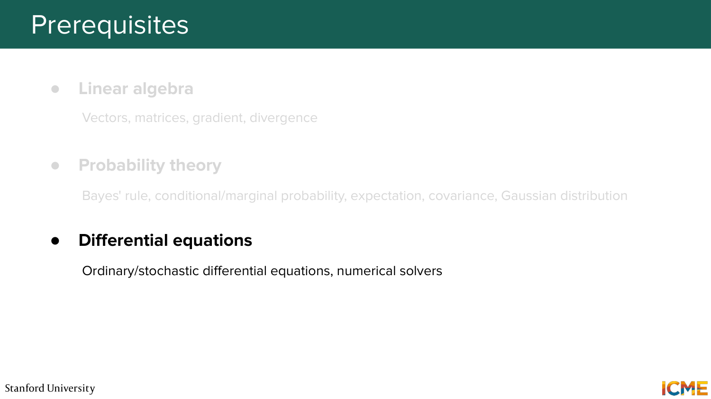

### 幻灯片内容

Prerequisites
●
Linear algebra
●
Probability theory
●
Differential equations
Vectors, matrices, gradient, divergence
Bayes' rule, conditional/marginal probability, expectation, covariance, Gaussian distribution
Ordinary/stochastic differential equations, numerical solvers

### 通俗解释

机器学习基础：监督学习、损失函数、反向传播。熟悉神经网络原理会让学习更容易。

---

## Slide 12

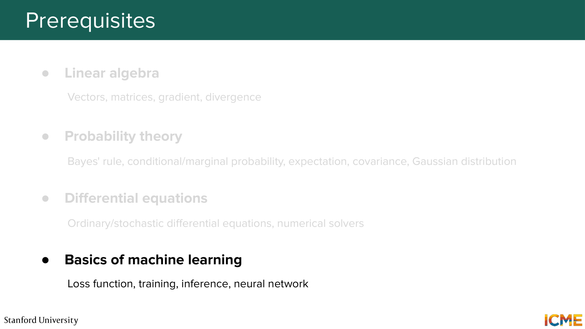

### 幻灯片内容

Prerequisites
●
Linear algebra
●
Probability theory
●
Differential equations
●
Basics of machine learning
Vectors, matrices, gradient, divergence
Bayes' rule, conditional/marginal probability, expectation, covariance, Gaussian distribution
Ordinary/stochastic differential equations, numerical solvers
Loss function, training, inference, neural network

### 通俗解释

建议了解深度学习框架（如 PyTorch），课程可能涉及代码示例。

---

## Slide 13

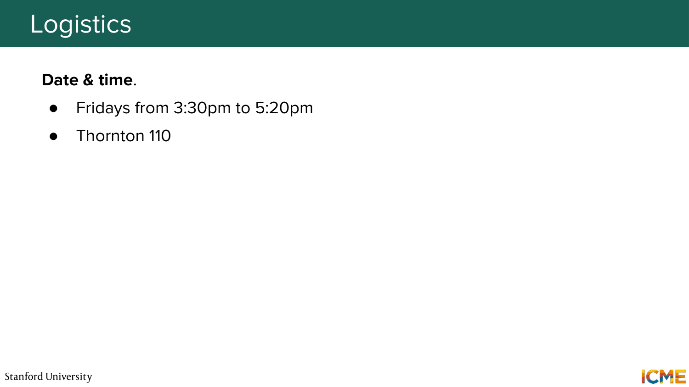

### 幻灯片内容

Logistics
Date & time.
●
Fridays from 3:30pm to 5:20pm
●
Thornton 110

### 通俗解释

后勤信息：上课时间（周五 3:30-5:20pm）、地点（Thornton 110）、考试安排（期中和期末）。

---

## Slide 14

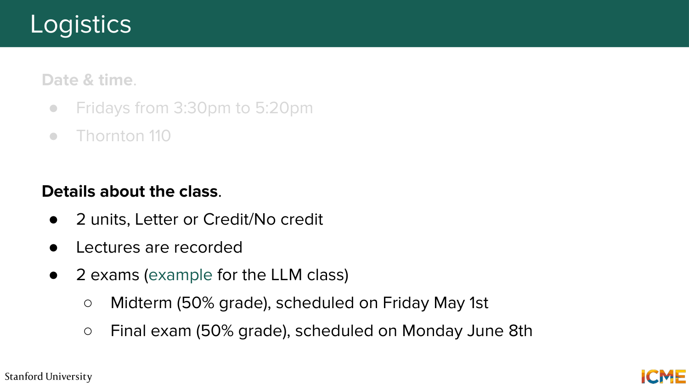

### 幻灯片内容

Logistics
Date & time.
●
Fridays from 3:30pm to 5:20pm
●
Thornton 110
Details about the class.
●
2 units, Letter or Credit/No credit
●
Lectures are recorded
●
2 exams (example for the LLM class)
○
Midterm (50% grade), scheduled on Friday May 1st
○
Final exam (50% grade), scheduled on Monday June 8th

### 通俗解释

后勤信息继续：作业政策、评分标准等。

---

## Slide 15

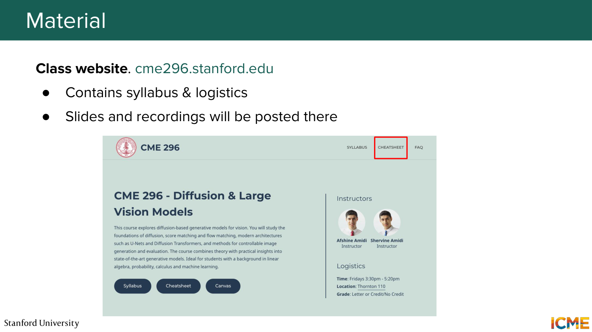

### 幻灯片内容

Material
Class website. cme296.stanford.edu
●
Contains syllabus & logistics
●
Slides and recordings will be posted there

### 通俗解释

课程材料：教材、参考资料。

---

## Slide 16

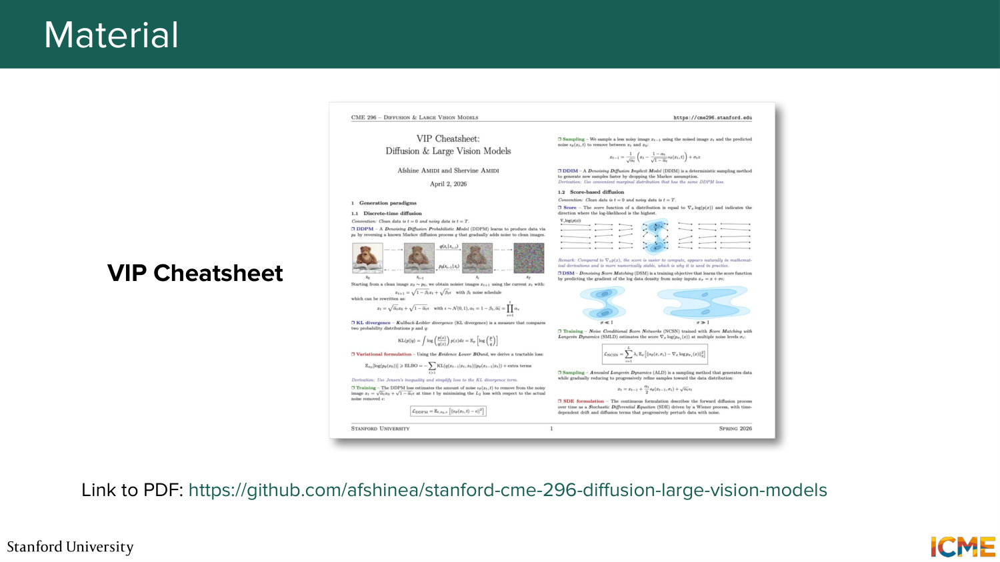

### 幻灯片内容

Material
VIP Cheatsheet
Link to PDF: https://github.com/afshinea/stanford-cme-296-diffusion-large-vision-models

### 通俗解释

材料继续：推荐论文、在线资源。

---

## Slide 17

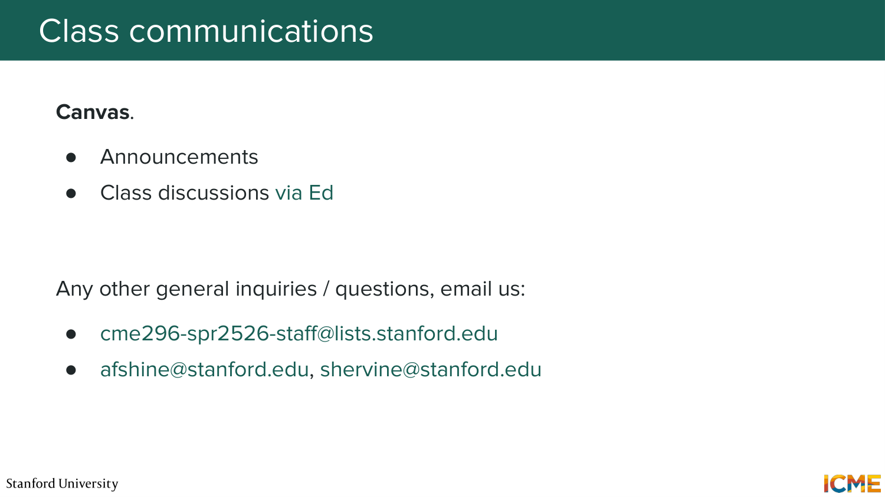

### 幻灯片内容

Class communications
Canvas.
●
Announcements
●
Class discussions via Ed
Any other general inquiries / questions, email us:
●
cme296-spr2526-staff@lists.stanford.edu
●
afshine@stanford.edu, shervine@stanford.edu

### 通俗解释

课程通讯：邮件列表 cme296-spr2526-staff@lists.stanford.edu。

---

## Slide 18

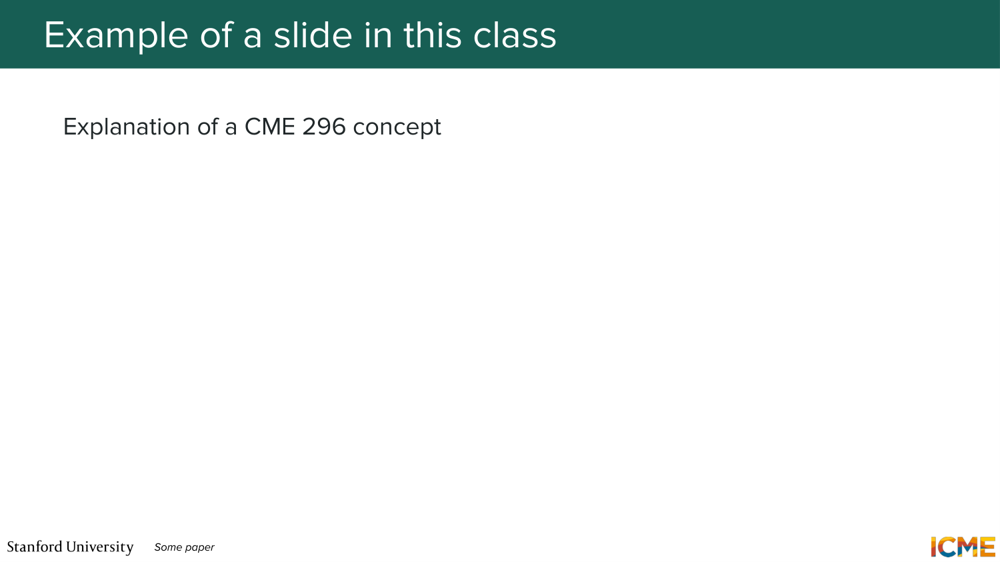

### 幻灯片内容

Example of a slide in this class
Explanation of a CME 296 concept
Some paper

### 通俗解释

幻灯片示例：展示排版风格。

---

## Slide 19

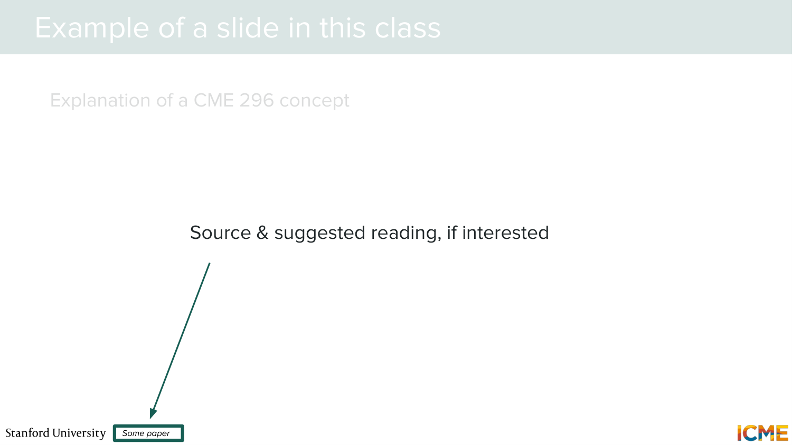

### 幻灯片内容

Example of a slide in this class
Explanation of a CME 296 concept
Some paper
Source & suggested reading, if interested

### 通俗解释

幻灯片示例继续：公式、图表的呈现方式。

---

## Slide 20

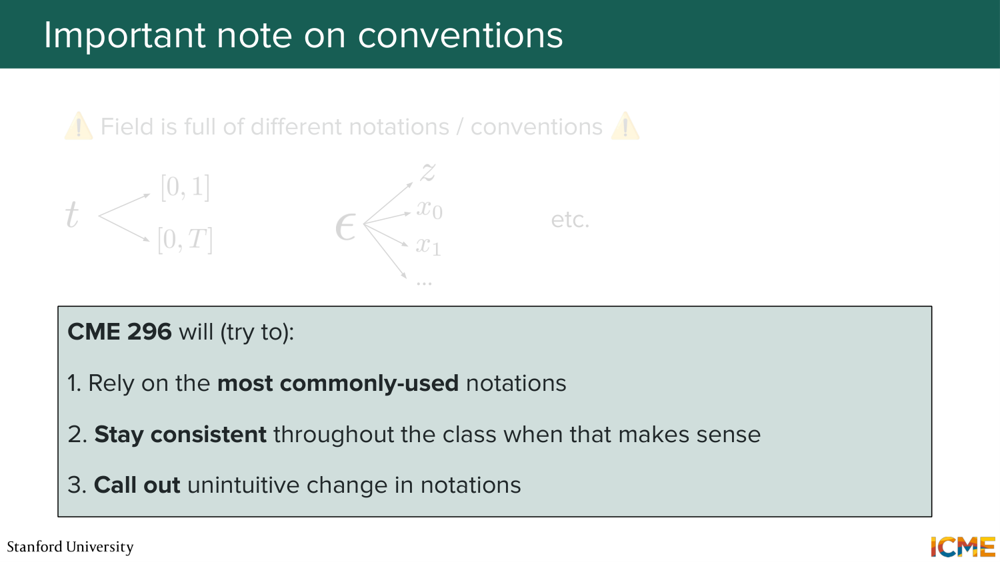

### 幻灯片内容

Important note on conventions
⚠ Field is full of different notations / conventions ⚠
CME 296 will (try to):
1. Rely on the most commonly-used notations
2. Stay consistent throughout the class when that makes sense
3. Call out unintuitive change in notations
etc.
…

### 通俗解释

符号约定：x=原始数据，epsilon=噪声，t=时间步。理解约定对后续学习很重要。

---

## Slide 21

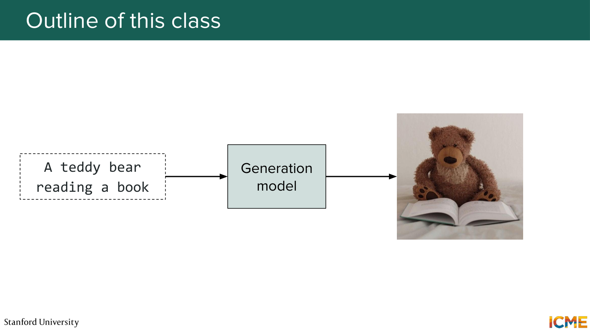

### 幻灯片内容

Outline of this class
A teddy bear 
reading a book
Generation 
model

### 通俗解释

课程大纲开始：第 1 讲 - 扩散模型。

---

## Slide 22

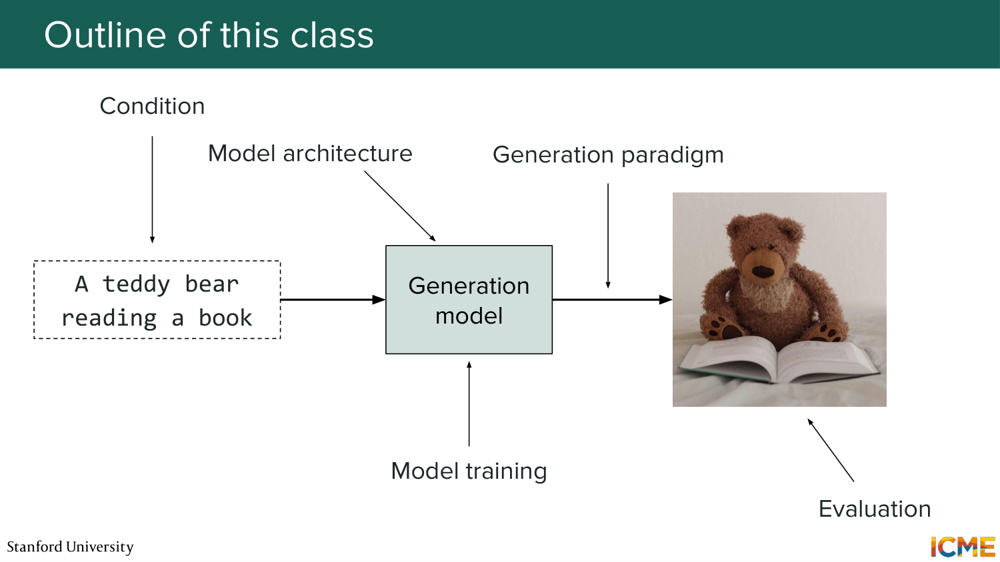

### 幻灯片内容

Outline of this class
A teddy bear 
reading a book
Generation 
model
Condition
Model architecture
Generation paradigm
Model training
Evaluation

### 通俗解释

DDPM：Denoising Diffusion Probabilistic Models，Ho et al. 2020 的开创性工作。

---

## Slide 23

### 幻灯片内容

Outline of this class
A teddy bear 
reading a book
Generation 
model
Condition
Model architecture
Generation paradigm
Model training
Evaluation
L1-3:

### 通俗解释

ELBO：Evidence Lower Bound，变分推断核心概念，用于推导扩散模型训练目标。

---

## Slide 24

### 幻灯片内容

Outline of this class
A teddy bear 
reading a book
Generation 
model
Condition
Model architecture
Generation paradigm
Model training
Evaluation
L4:
L1-3:

### 通俗解释

DDIM：Denoising Diffusion Implicit Models，加速采样方法，可从 1000 步减到 50 步。

---

## Slide 25

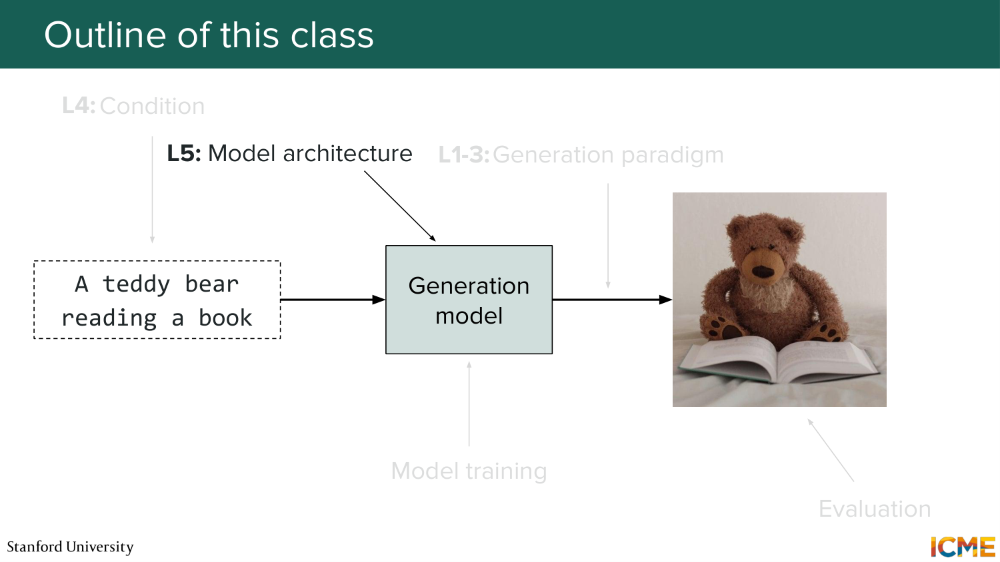

### 幻灯片内容

Outline of this class
A teddy bear 
reading a book
Generation 
model
Condition
Model architecture
Generation paradigm
Model training
Evaluation
L5:
L4:
L1-3:

### 通俗解释

大纲：第 2 讲 - 评分匹配（Score Matching）。

---

## Slide 26

### 幻灯片内容

Outline of this class
A teddy bear 
reading a book
Generation 
model
Condition
Model architecture
Generation paradigm
Model training
Evaluation
L5:
L4:
L1-3:
L6:

### 通俗解释

大纲：第 3 讲 - 流匹配（Flow Matching）。

---

## Slide 27

### 幻灯片内容

Outline of this class
A teddy bear 
reading a book
Generation 
model
Condition
Model architecture
Generation paradigm
Model training
Evaluation
L5:
L4:
L1-3:
L6:
L7:

### 通俗解释

前 3 讲等价关系：Diffusion=离散时间，Score Matching=连续时间（SDE），Flow Matching=ODE 视角。

---

## Slide 28

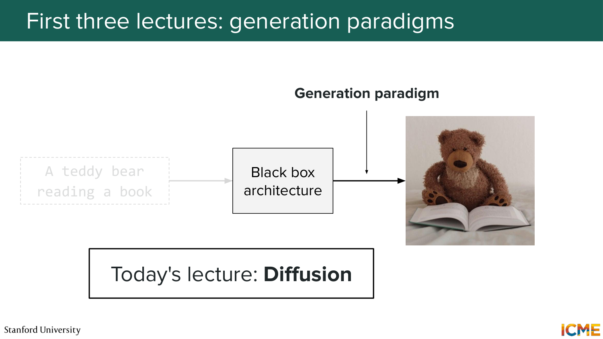

### 幻灯片内容

First three lectures: generation paradigms
A teddy bear 
reading a book
Black box 
architecture
Generation paradigm
Today's lecture: Diffusion

### 通俗解释

三种生成范式总结：Diffusion=噪声中逐步恢复信号，Score Matching=学习数据分布的梯度场，Flow Matching=学习从噪声到数据的流动路径。

---

## Slide 29

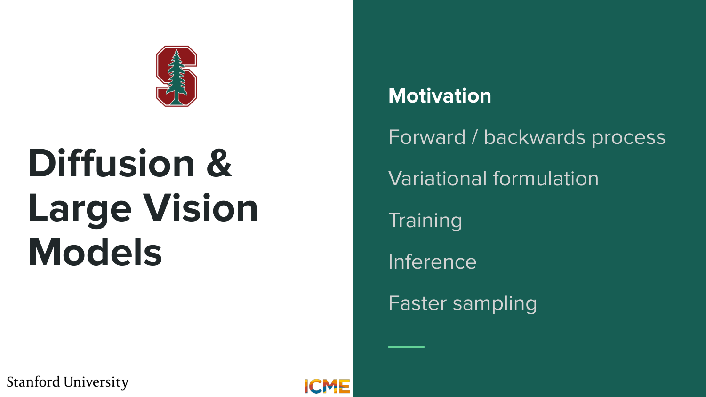

### 幻灯片内容

Motivation
Forward / backwards process
Variational formulation
Training
Inference
Faster sampling
Diffusion & 
Large Vision 
Models

### 通俗解释

扩散动机：如何从噪声生成真实图像？核心思想：如果知道如何加噪把图像变成纯噪声，能否反过来从噪声恢复图像？

---

## Slide 30

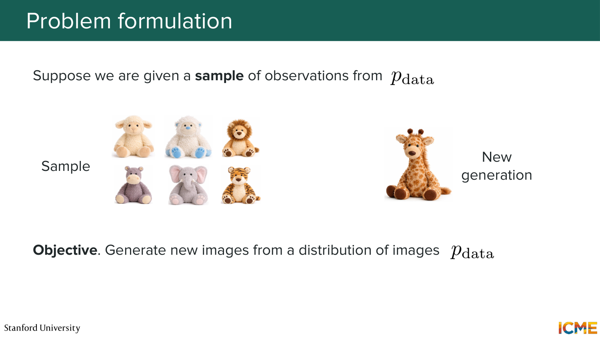

### 幻灯片内容

Problem formulation
Objective. Generate new images from a distribution of images
Suppose we are given a sample of observations from 
New 
generation
Sample

### 通俗解释

问题公式化：扩散模型包含两个过程——前向过程（加噪，固定）和反向过程（去噪，需要学习）。

---

## Slide 31

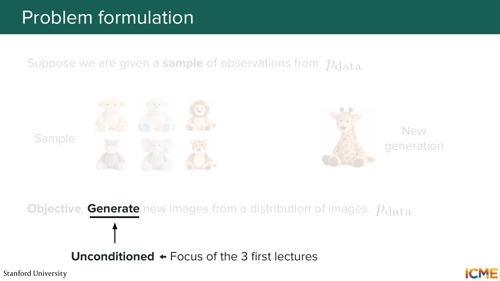

### 幻灯片内容

Problem formulation
Objective. Generate new images from a distribution of images
Unconditioned ← Focus of the 3 first lectures
New 
generation
Sample
Suppose we are given a sample of observations from

### 通俗解释

问题公式化继续：我们需要定义两个概率分布——前向分布 q（加噪过程）和反向分布 p（去噪过程）。

---

## Slide 32

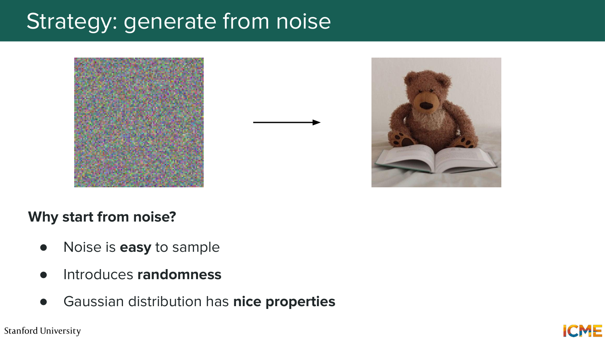

### 幻灯片内容

Strategy: generate from noise
●
Noise is easy to sample
●
Introduces randomness
●
Gaussian distribution has nice properties
Why start from noise?

### 通俗解释

策略：从噪声生成。类比雕刻——米开朗基罗说雕塑已经存在于石头中，只需去掉多余的部分。扩散模型类似：从纯噪声开始，逐步去掉噪声，最终得到清晰的图像。

---

## Slide 33

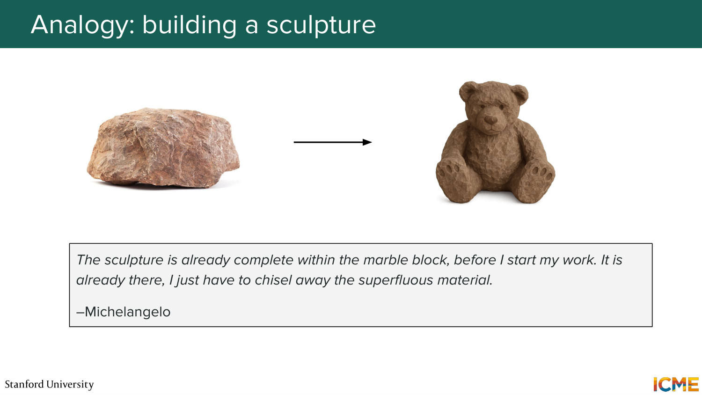

### 幻灯片内容

Analogy: building a sculpture
The sculpture is already complete within the marble block, before I start my work. It is 
already there, I just have to chisel away the superfluous material.
–Michelangelo

### 通俗解释

雕塑类比详解：想象一块大理石（纯噪声），雕塑家（模型）一步步凿去多余部分（去噪），最终显现出雕像（清晰图像）。扩散模型的训练就是教模型如何当好这个雕塑家。

---

## Slide 34

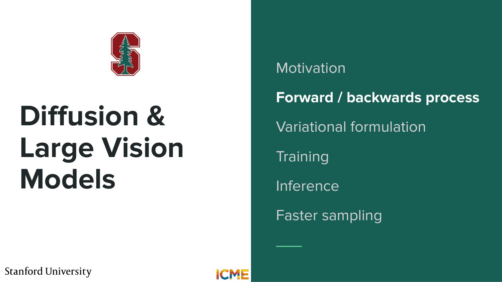

### 幻灯片内容

Motivation
Forward / backwards process
Variational formulation
Training
Inference
Faster sampling
Diffusion & 
Large Vision 
Models

### 通俗解释

前向/反向过程概述：前向过程逐步添加高斯噪声，反向过程逐步去除噪声。这两个过程都是马尔可夫链——每一步只依赖于前一步。

---

## Slide 35

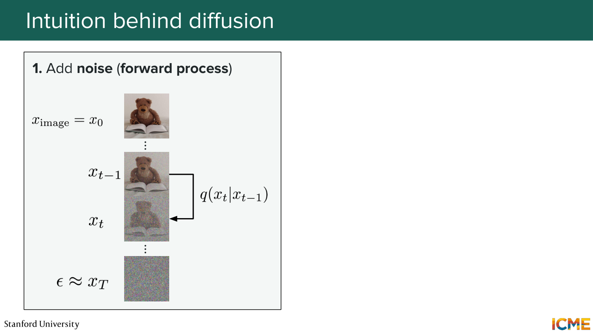

### 幻灯片内容

Intuition behind diffusion
1. Add noise (forward process)
…
…

### 通俗解释

前向过程第 1 步：添加噪声。具体来说，每一步都添加少量高斯噪声，经过 T 步后，原始图像完全变成纯噪声。

---

## Slide 36

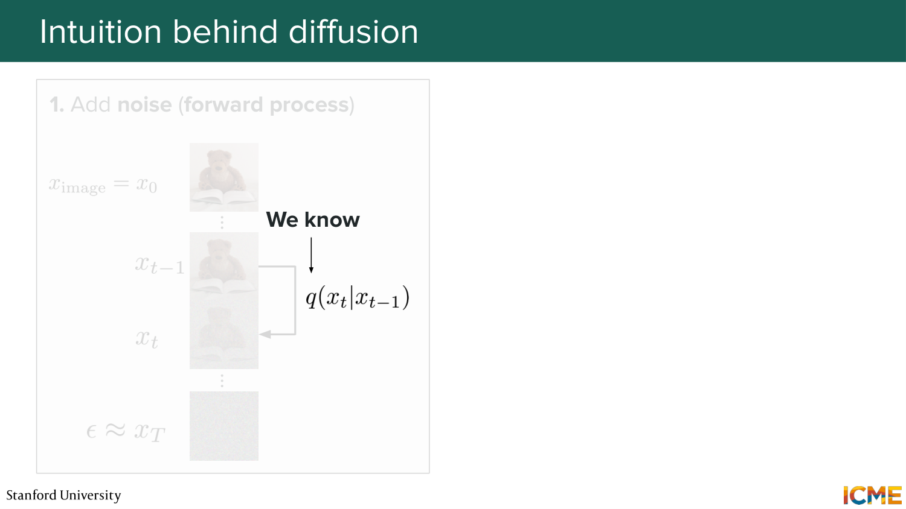

### 幻灯片内容

Intuition behind diffusion
1. Add noise (forward process)
…
…
We know

### 通俗解释

前向过程继续：每一步添加的噪声量由 beta 调度（beta schedule）控制。开始加得少，后来越加越多。

---

## Slide 37

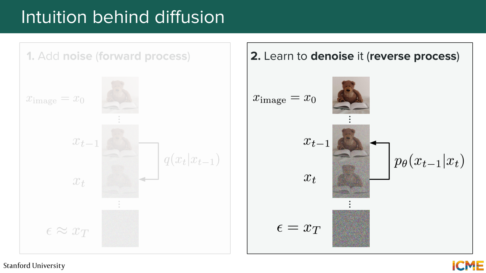

### 幻灯片内容

Intuition behind diffusion
2. Learn to denoise it (reverse process)
1. Add noise (forward process)
…
…
…
…

### 通俗解释

反向过程：学习去噪。这是模型需要学习的部分——给定一个带噪声的图像，预测并去除噪声。

---

## Slide 38

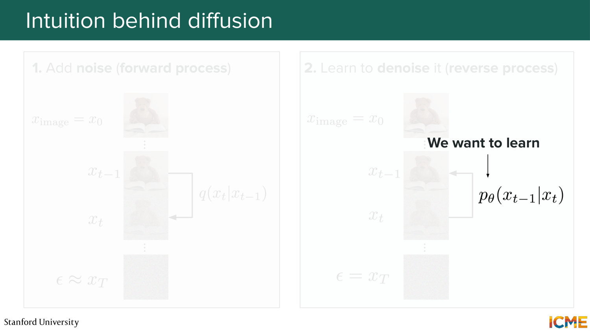

### 幻灯片内容

Intuition behind diffusion
2. Learn to denoise it (reverse process)
1. Add noise (forward process)
…
…
…
…
We want to learn

### 通俗解释

反向过程继续：模型（通常是 U-Net）在每个时间步预测噪声，然后减去它，逐步恢复原始图像。

---

## Slide 39

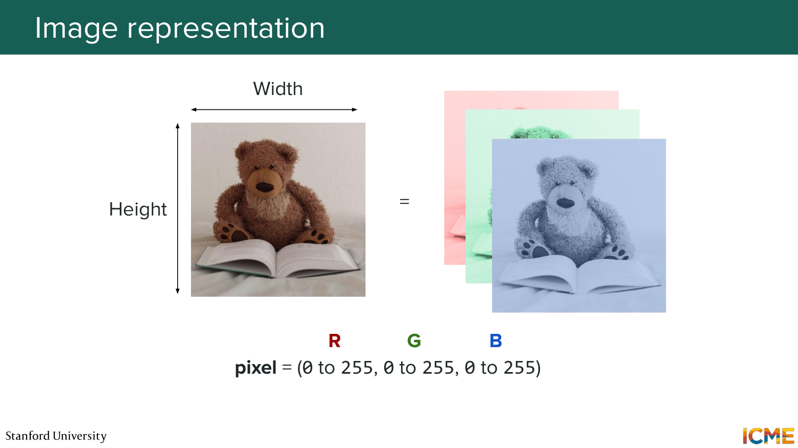

### 幻灯片内容

Image representation
Width
Height
=
pixel = (0 to 255, 0 to 255, 0 to 255)
R
G
B

### 通俗解释

图像表示：图像可以表示为像素值的向量。比如 32x32 RGB 图像有 3072 个像素值。扩散模型在这个高维空间中操作。

---

## Slide 40

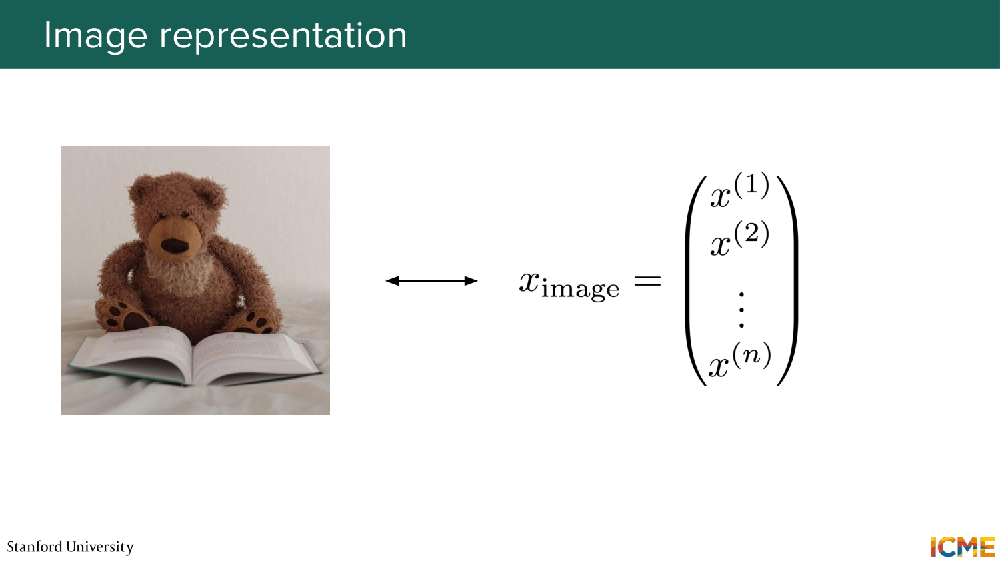

### 通俗解释

过渡页。

---

## Slide 41

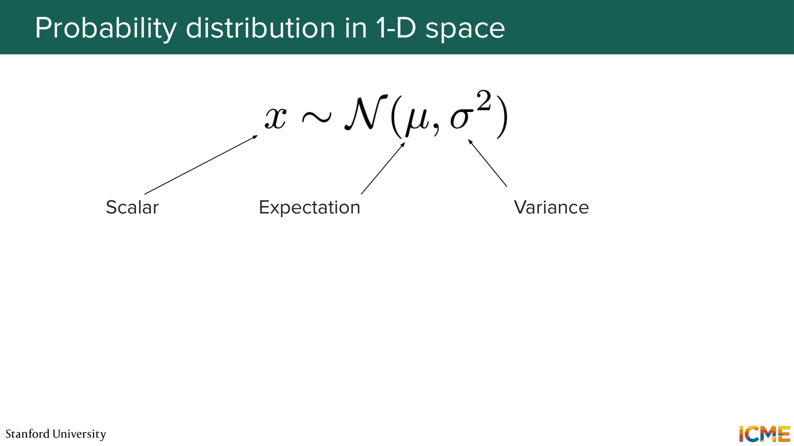

### 幻灯片内容

Probability distribution in 1-D space
Variance
Expectation
Scalar

### 通俗解释

方差：衡量数据分散程度的统计量。在扩散模型中，我们主要使用高斯分布，方差控制噪声的强度。

---

## Slide 42

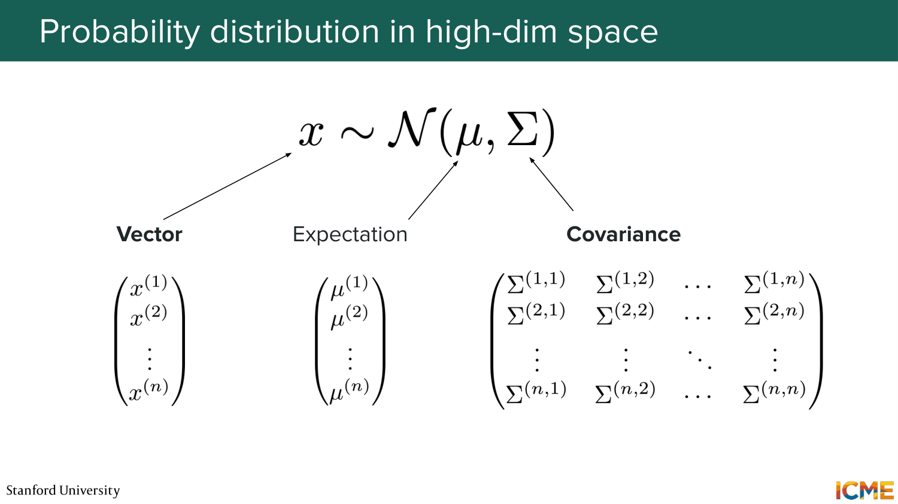

### 幻灯片内容

Probability distribution in high-dim space
Covariance
Expectation
Vector

### 通俗解释

协方差：多维随机变量之间的关系。但在扩散模型中，我们通常假设各维度独立（各向同性高斯），所以协方差矩阵是对角阵。

---

## Slide 43

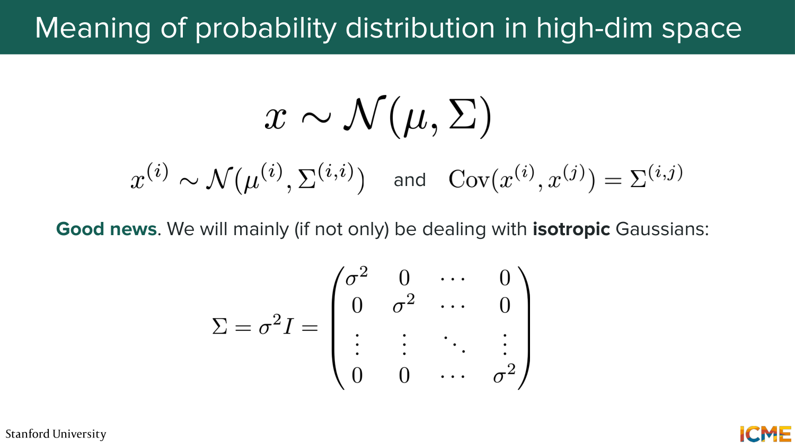

### 幻灯片内容

Meaning of probability distribution in high-dim space
Good news. We will mainly (if not only) be dealing with isotropic Gaussians:
and

### 通俗解释

各向同性高斯：所有维度有相同的方差，且相互独立。这大大简化了数学计算——协方差矩阵变成 sigma^2 * I（单位矩阵的倍数）。

---

## Slide 44

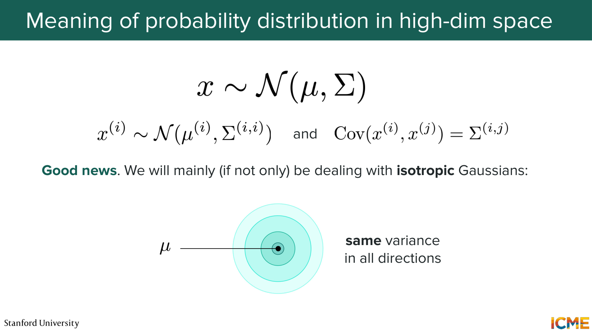

### 幻灯片内容

Meaning of probability distribution in high-dim space
same variance 
in all directions
Good news. We will mainly (if not only) be dealing with isotropic Gaussians:
and

### 通俗解释

各向同性高斯继续：这意味着噪声在每个像素方向上的强度相同，没有方向偏好。

---

## Slide 45

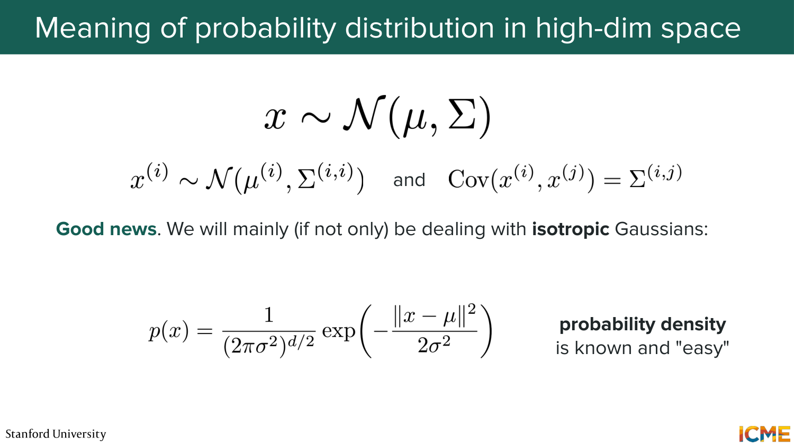

### 幻灯片内容

Meaning of probability distribution in high-dim space
Good news. We will mainly (if not only) be dealing with isotropic Gaussians:
and
probability density 
is known and "easy"

### 通俗解释

各向同性高斯的优势：计算简单，只需要一个标量 sigma^2 而不是完整的协方差矩阵。

---

## Slide 46

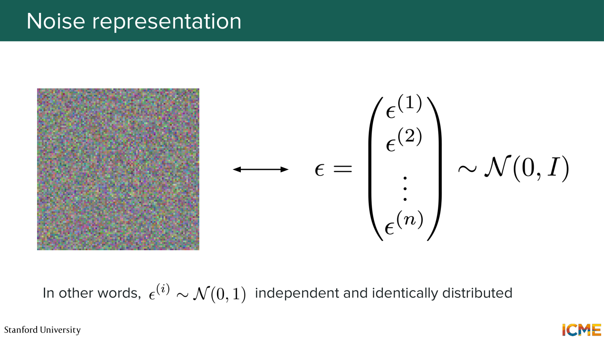

### 幻灯片内容

In other words, 
Noise representation
independent and identically distributed

### 通俗解释

噪声表示：用 epsilon ~ N(0, I) 表示标准高斯噪声。这是扩散模型的核心——每一步添加的噪声都来自这个分布。

---

## Slide 47

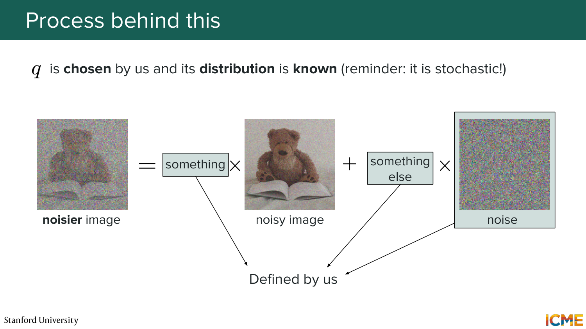

### 幻灯片内容

Process behind this
is chosen by us and its distribution is known (reminder: it is stochastic!)
something
something 
else
noisier image
noisy image
noise
Defined by us

### 通俗解释

前向过程的数学表达：x_t = sqrt(1-beta_t) * x_{t-1} + sqrt(beta_t) * epsilon。这是一个线性组合，逐渐用噪声替换原始信号。

---

## Slide 48

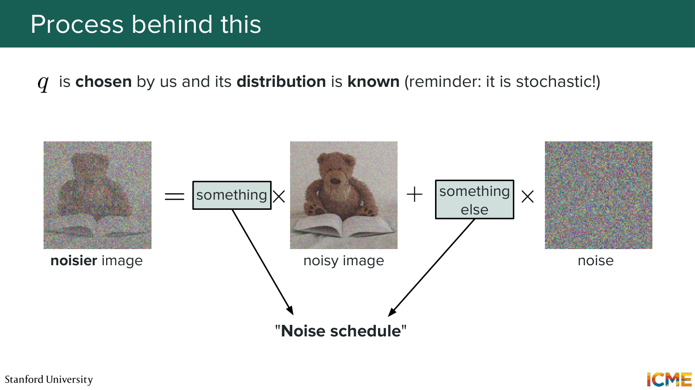

### 幻灯片内容

Process behind this
is chosen by us and its distribution is known (reminder: it is stochastic!)
something
something 
else
noisier image
noisy image
noise
"Noise schedule"

### 通俗解释

前向过程继续：经过 T 步后，x_T 近似于标准高斯分布 N(0, I)。这就是为什么我们可以从纯噪声开始反向生成。

---

## Slide 49

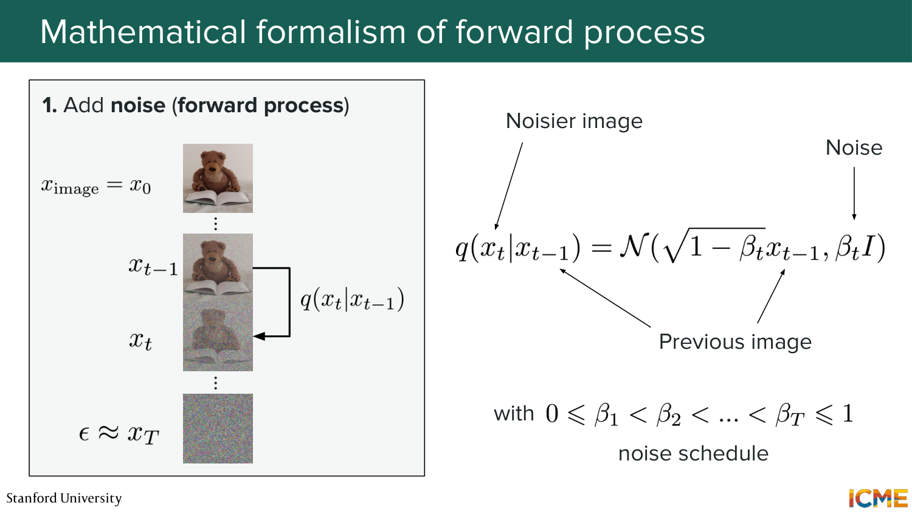

### 幻灯片内容

Mathematical formalism of forward process
1. Add noise (forward process)
…
…
Noise
Previous image
Noisier image
with
noise schedule

### 通俗解释

前向过程的数学形式化：引入 alpha_t = 1 - beta_t 和 alpha_bar_t = prod(alpha_1...alpha_t)，可以一步计算任意时间步的 x_t。

---

## Slide 50

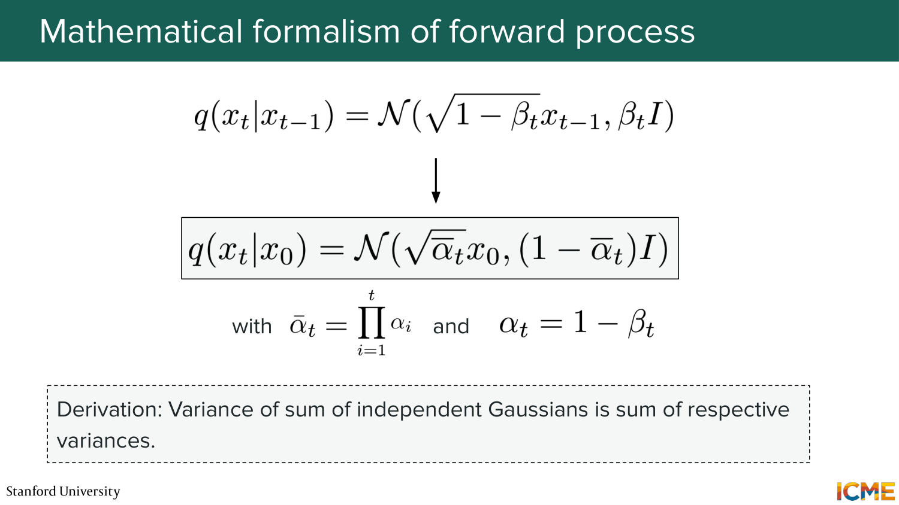

### 幻灯片内容

Mathematical formalism of forward process
with
and
Derivation: Variance of sum of independent Gaussians is sum of respective 
variances.

### 通俗解释

关键公式：x_t = sqrt(alpha_bar_t) * x_0 + sqrt(1-alpha_bar_t) * epsilon。这个公式允许我们直接从 x_0 跳到 x_t，不需要逐步计算。

---

## Slide 51

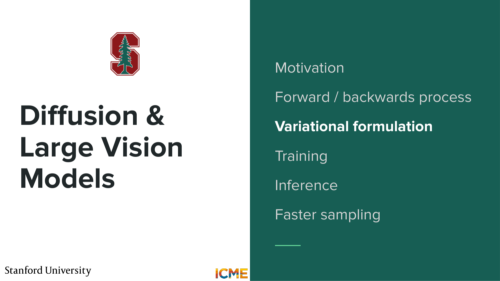

### 幻灯片内容

Motivation
Forward / backwards process
Variational formulation
Training
Inference
Faster sampling
Diffusion & 
Large Vision 
Models

### 通俗解释

前向/反向过程对比：前向过程是固定的（已知），反向过程是需要学习的（未知）。训练的目标就是学习反向过程的参数。

---

## Slide 52

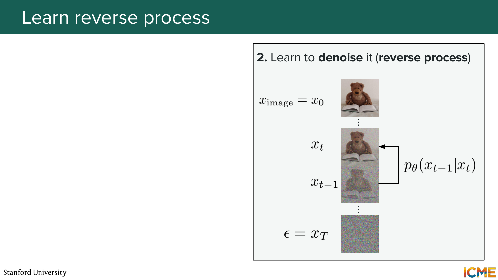

### 幻灯片内容

Learn reverse process
2. Learn to denoise it (reverse process)
…
…

### 通俗解释

学习反向过程：我们需要学习一个参数化的分布 p_theta，使得它能够近似真实的反向分布 q。

---

## Slide 53

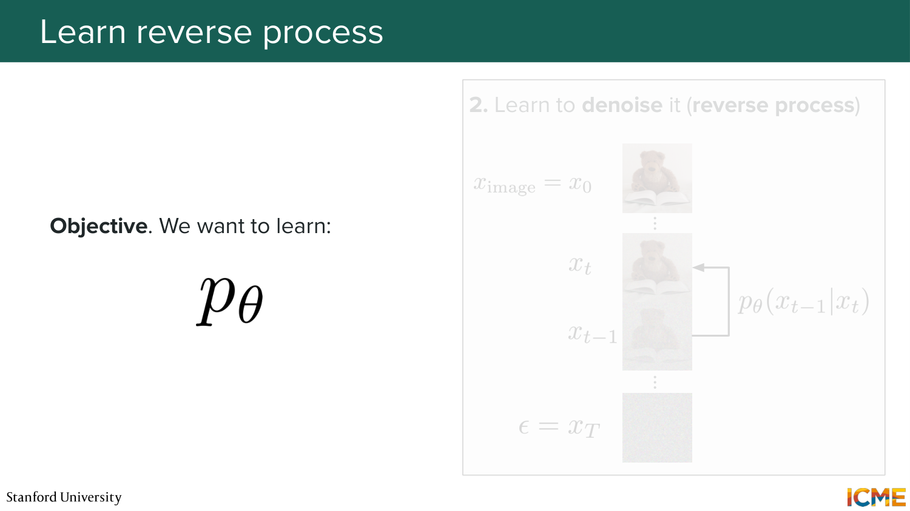

### 幻灯片内容

Learn reverse process
Objective. We want to learn:
2. Learn to denoise it (reverse process)
…
…

### 通俗解释

反向过程的参数化：p_theta(x_{t-1} | x_t) = N(x_{t-1}; mu_theta(x_t, t), sigma_t^2 * I)。模型预测均值 mu，方差可以固定或学习。

---

## Slide 54

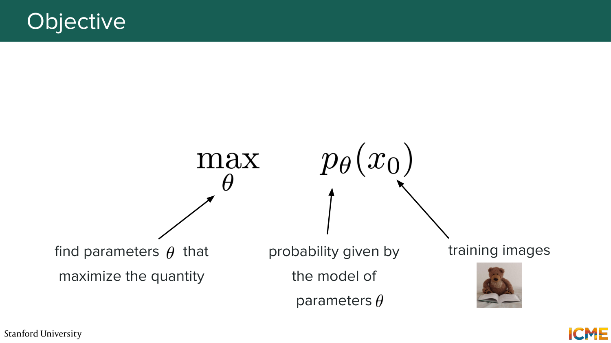

### 幻灯片内容

find parameters      that 
maximize the quantity
Objective
probability given by 
the model of 
parameters    
training images

### 通俗解释

寻找最优参数 theta：通过最大化数据的对数似然 log p(x_0)，但直接计算不可行，需要使用变分推断。

---

## Slide 55

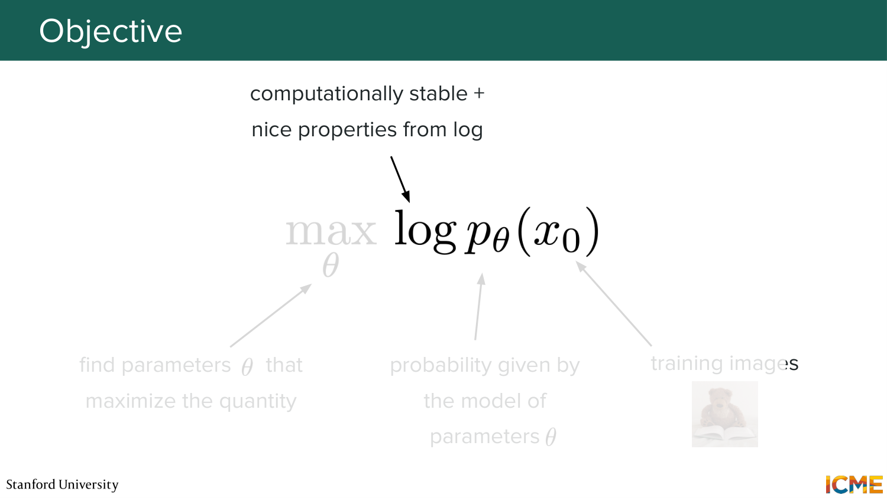

### 幻灯片内容

find parameters      that 
maximize the quantity
Objective
probability given by 
the model of 
parameters    
computationally stable + 
nice properties from log
training images

### 通俗解释

变分推断：引入 ELBO（证据下界）作为对数似然的下界，优化 ELBO 等价于近似最大化对数似然。

---

## Slide 56

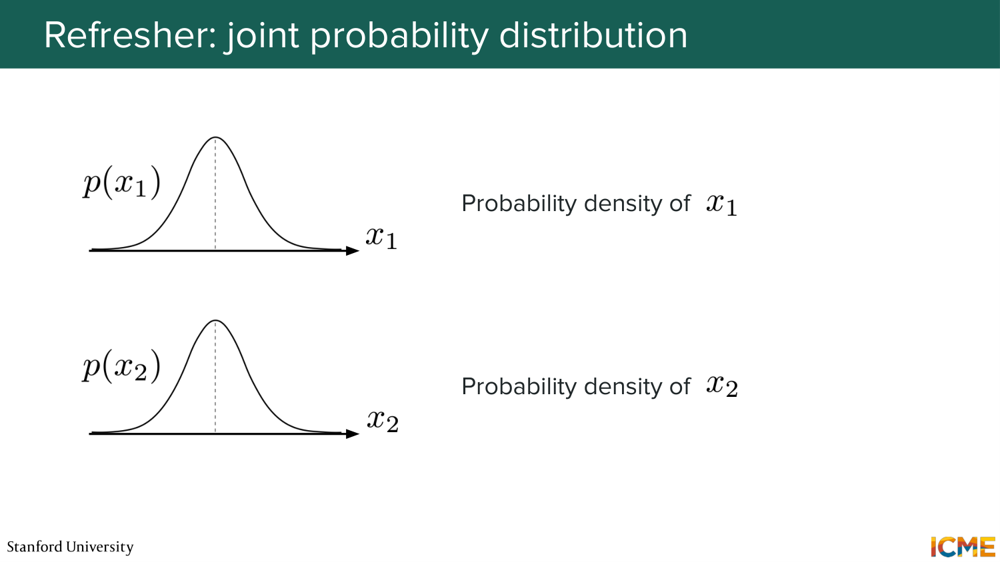

### 幻灯片内容

Refresher: joint probability distribution
Probability density of 
Probability density of

### 通俗解释

联合概率分布复习：p(x,y) = p(x) * p(y|x)。这是概率论的基础公式。

---

## Slide 57

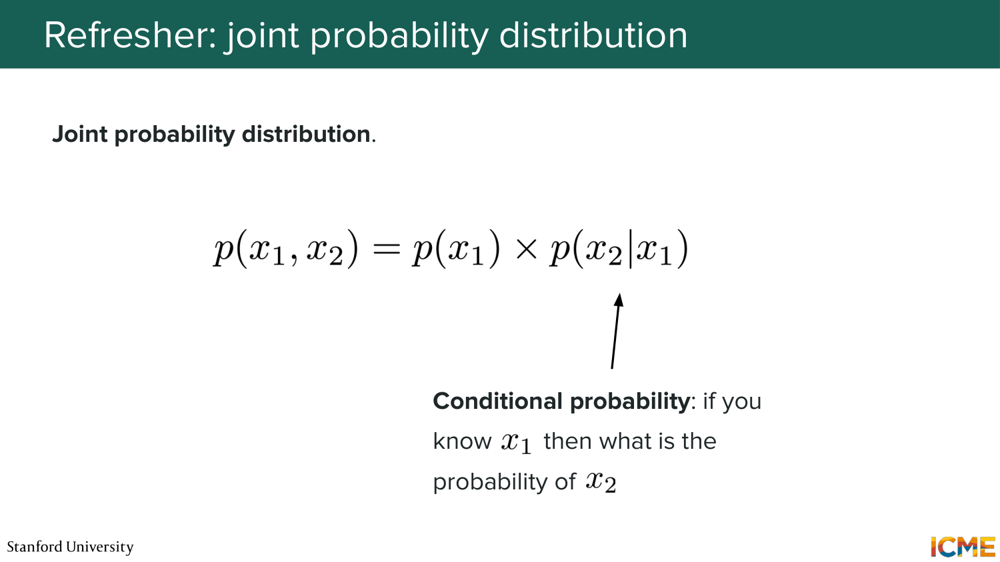

### 幻灯片内容

Conditional probability: if you 
know        then what is the 
probability of 
Refresher: joint probability distribution
Joint probability distribution.

### 通俗解释

条件概率：如果你知道 y，x 的条件分布是什么？这是反向过程的核心——给定 x_t，预测 x_{t-1}。

---

## Slide 58

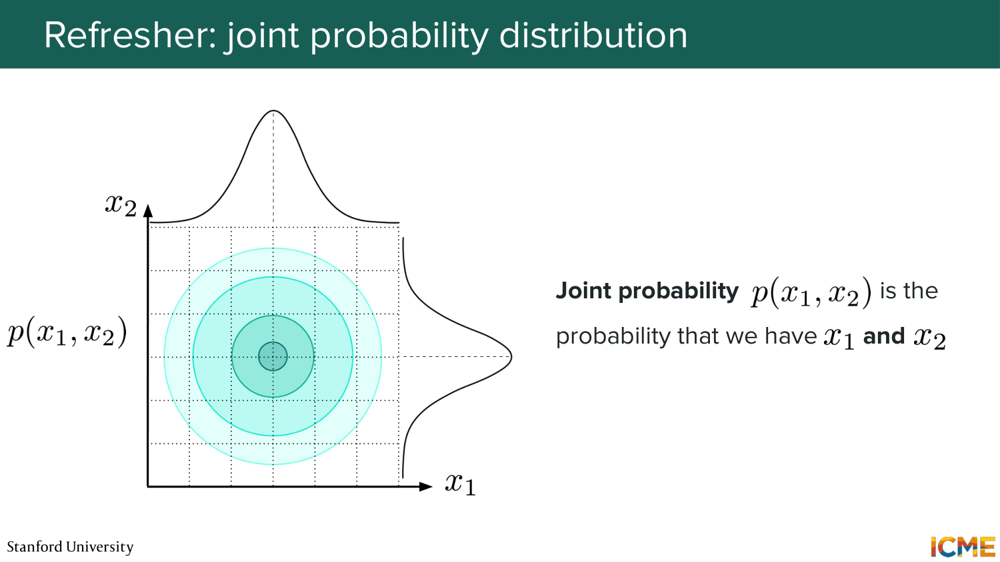

### 幻灯片内容

Refresher: joint probability distribution
Joint probability                      is the 
probability that we have       and

### 通俗解释

联合分布继续：链式法则 p(x_0, x_1, ..., x_T) = p(x_T) * p(x_{T-1}|x_T) * ... * p(x_0|x_1)。

---

## Slide 59

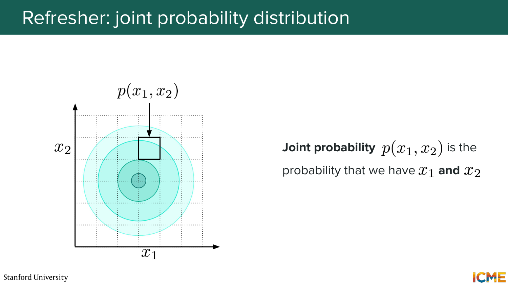

### 幻灯片内容

Refresher: joint probability distribution
Joint probability                      is the 
probability that we have       and

### 通俗解释

联合分布复习：扩散模型的联合分布是马尔可夫链，每一步只依赖于前一步。

---

## Slide 60

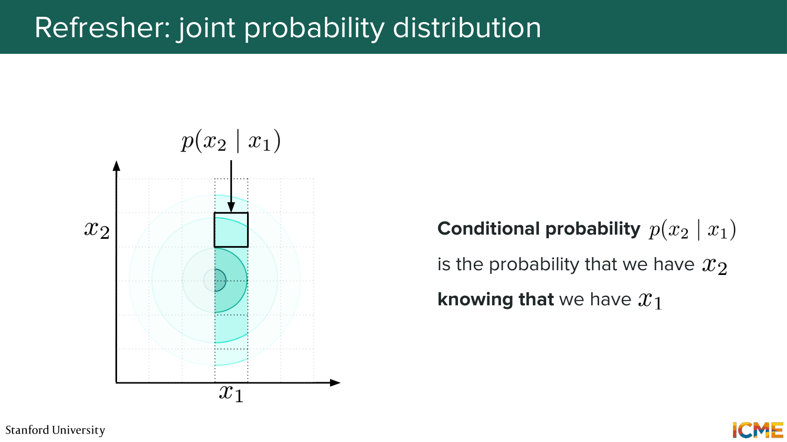

### 幻灯片内容

Conditional probability                       
is the probability that we have       
knowing that we have 
Refresher: joint probability distribution

### 通俗解释

条件概率复习：p(A|B) = p(A,B) / p(B)。在扩散模型中，我们需要计算 p(x_{t-1} | x_t)。

---

## Slide 61

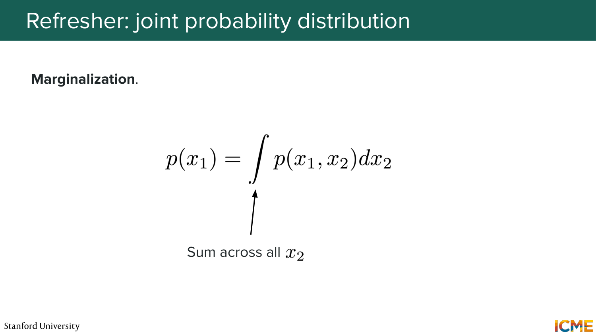

### 幻灯片内容

Sum across all 
Refresher: joint probability distribution
Marginalization.

### 通俗解释

边缘化：通过对联合分布求和（或积分）得到边缘分布。在扩散模型中，我们需要对中间变量积分。

---

## Slide 62

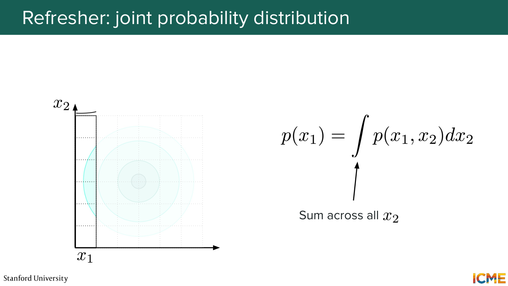

### 幻灯片内容

Refresher: joint probability distribution
Sum across all

### 通俗解释

联合分布继续：马尔可夫性质简化了计算——p(x_t | x_{t-1}, x_{t-2}, ...) = p(x_t | x_{t-1})。

---

## Slide 63

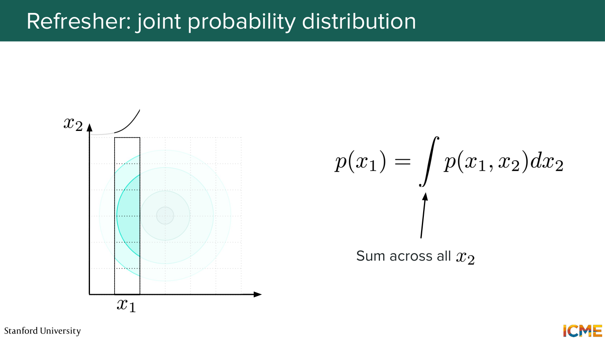

### 幻灯片内容

Refresher: joint probability distribution
Sum across all

### 通俗解释

联合分布复习：前向过程的联合分布可以分解为 T 个条件分布的乘积。

---

## Slide 64

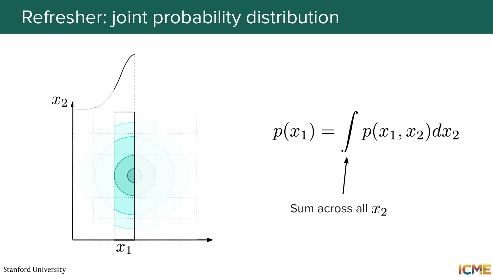

### 幻灯片内容

Refresher: joint probability distribution
Sum across all

### 通俗解释

联合分布继续：这允许我们使用链式法则来计算整个过程的概率。

---

## Slide 65

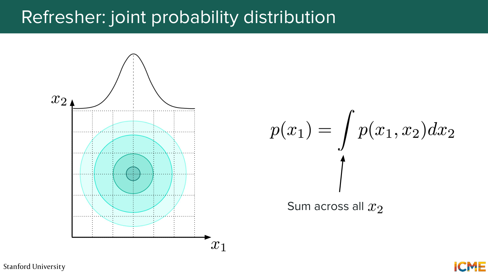

### 幻灯片内容

Refresher: joint probability distribution
Sum across all

### 通俗解释

联合分布复习：反向过程同理，但参数是 theta，需要学习。

---

## Slide 66

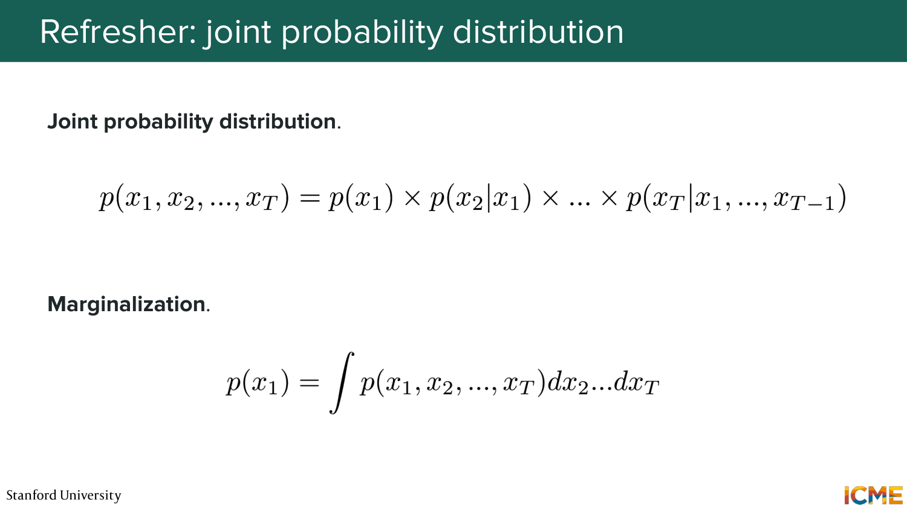

### 幻灯片内容

Refresher: joint probability distribution
Joint probability distribution.
Marginalization.

### 通俗解释

联合分布继续：对比前向和反向的联合分布，它们的形式相似但方向相反。

---

## Slide 67

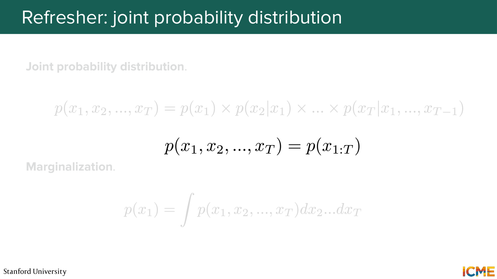

### 幻灯片内容

Refresher: joint probability distribution
Joint probability distribution.
Marginalization.

### 通俗解释

联合分布复习：这个分解是推导 ELBO 的基础。

---

## Slide 68

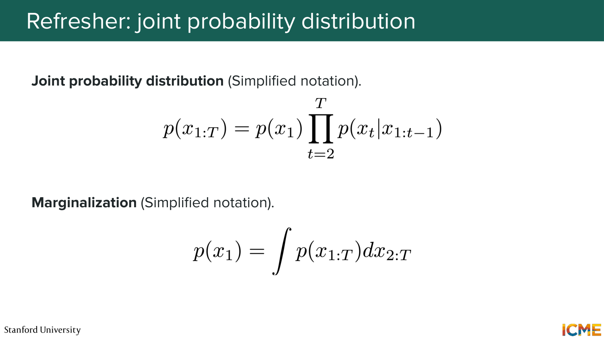

### 幻灯片内容

Refresher: joint probability distribution
Joint probability distribution (Simplified notation).
Marginalization (Simplified notation).

### 通俗解释

过渡页：接下来推导 ELBO。

---

## Slide 69

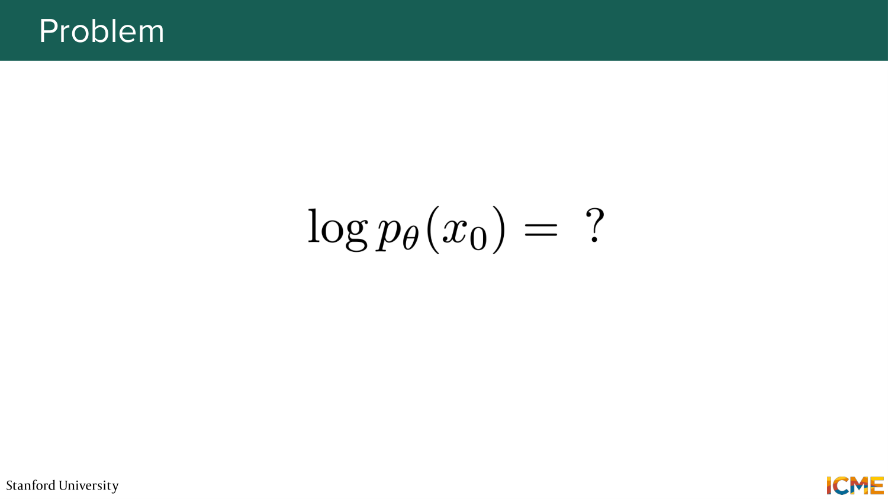

### 通俗解释

过渡页：ELBO 推导开始。

---

## Slide 70

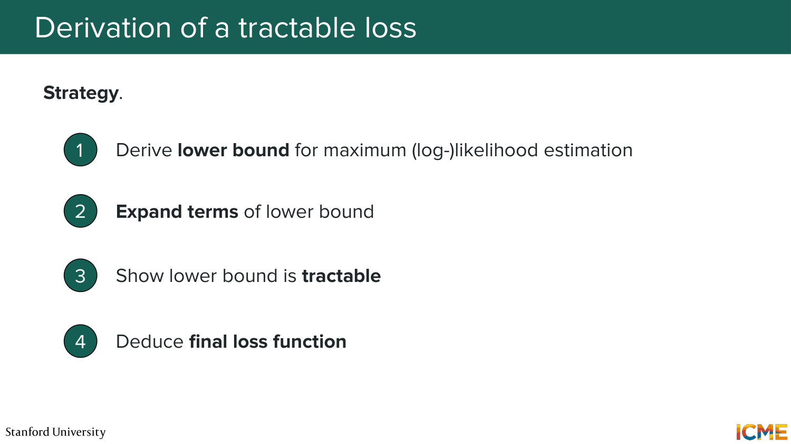

### 幻灯片内容

Derivation of a tractable loss
Strategy.
Derive lower bound for maximum (log-)likelihood estimation
Expand terms of lower bound
1
2
3
Show lower bound is tractable
4
Deduce final loss function

### 通俗解释

推导可计算的损失函数：原始的对数似然 log p(x_0) 难以直接计算，因为需要对所有中间变量积分。ELBO 提供了一个可计算的下界。

---

## Slide 71

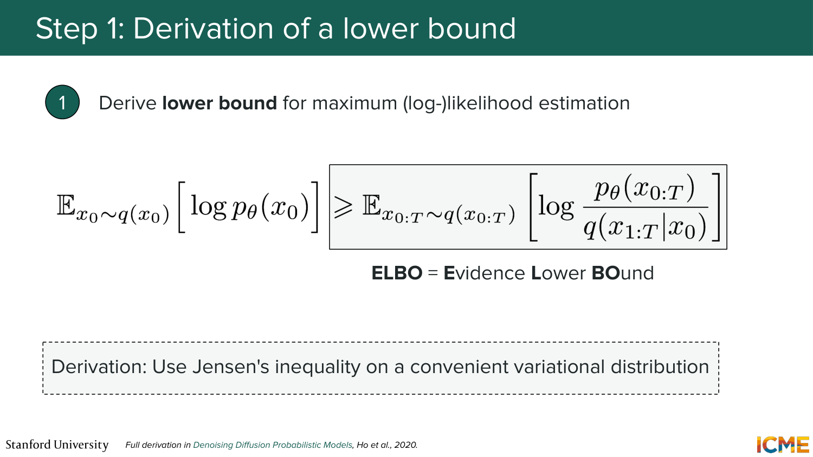

### 幻灯片内容

Step 1: Derivation of a lower bound
ELBO = Evidence Lower BOund
Derivation: Use Jensen's inequality on a convenient variational distribution
Derive lower bound for maximum (log-)likelihood estimation
1
Full derivation in Denoising Diffusion Probabilistic Models, Ho et al., 2020.

### 通俗解释

ELBO = Evidence Lower BOund（证据下界）。核心思想：与其直接计算难以处理的 log p(x)，不如优化它的下界。下界越高，真实对数似然也越高。

---

## Slide 72

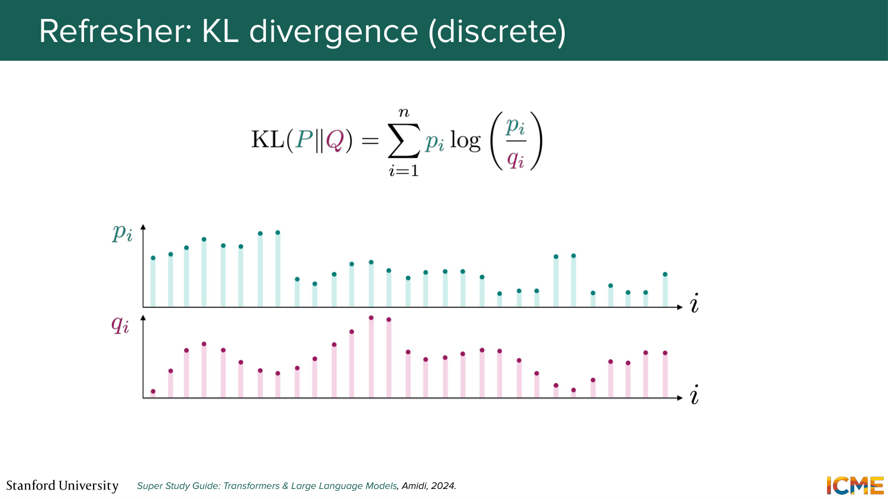

### 幻灯片内容

Refresher: KL divergence (discrete)
Super Study Guide: Transformers & Large Language Models, Amidi, 2024.

### 通俗解释

KL 散度复习（离散）：KL(P||Q) 衡量两个概率分布 P 和 Q 的差异。KL=0 表示完全相同，KL>0 表示有差异。

---

## Slide 73

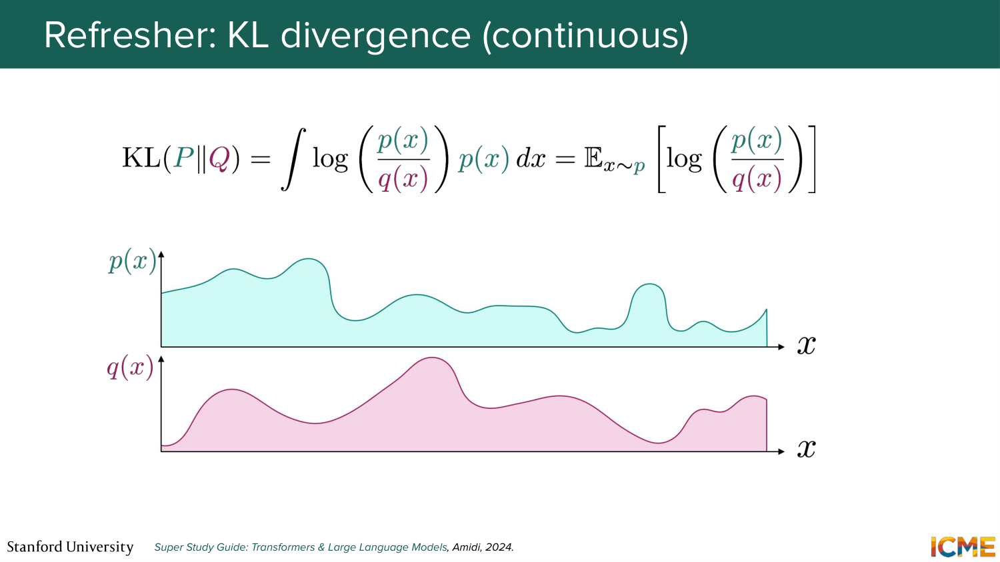

### 幻灯片内容

Refresher: KL divergence (continuous)
Super Study Guide: Transformers & Large Language Models, Amidi, 2024.

### 通俗解释

KL 散度（连续）：对连续分布，KL 散度是积分形式。在扩散模型中，由于所有分布都是高斯分布，KL 散度有闭式解。

---

## Slide 74

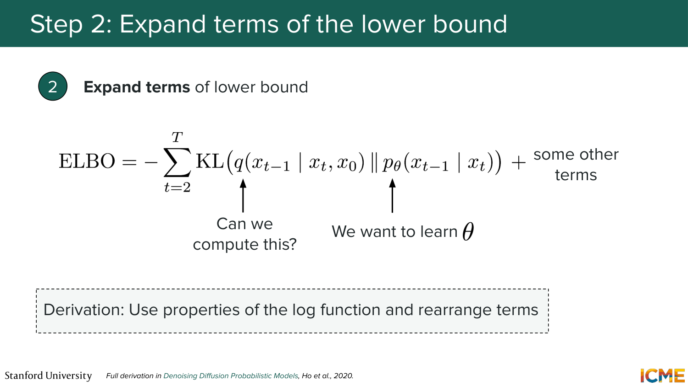

### 幻灯片内容

Step 2: Expand terms of the lower bound
Can we 
compute this?
We want to learn 
Expand terms of lower bound
2
Derivation: Use properties of the log function and rearrange terms
some other 
terms
Full derivation in Denoising Diffusion Probabilistic Models, Ho et al., 2020.

### 通俗解释

展开下界项：ELBO 可以分解为 T+1 个项——重建项、正则化项（KL 散度）和先验项。每项都有明确的含义。

---

## Slide 75

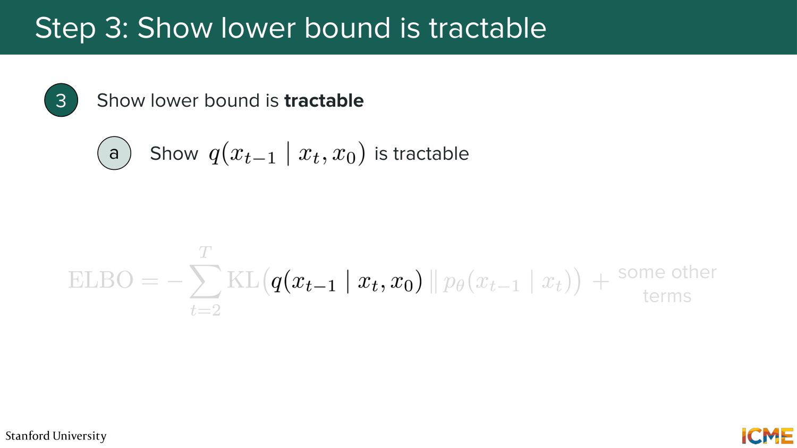

### 幻灯片内容

Step 3: Show lower bound is tractable
3
Show lower bound is tractable
some other 
terms
Show 
a
is tractable

### 通俗解释

证明下界可计算：关键发现是，由于前向过程是固定的高斯过程，KL 散度项有闭式解，可以直接计算。

---

## Slide 76

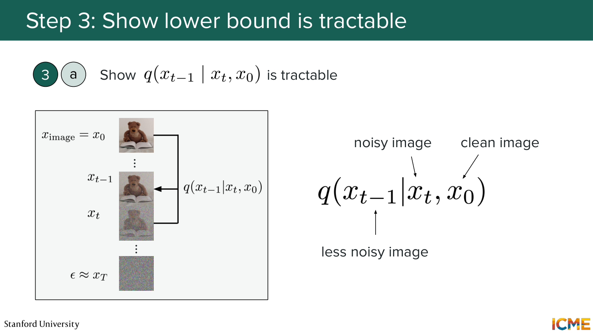

### 幻灯片内容

Step 3: Show lower bound is tractable
…
…
noisy image
clean image
less noisy image
3
Show 
a
is tractable

### 通俗解释

下界可计算继续：具体来说，q(x_{t-1} | x_t, x_0) 是两个高斯分布的乘积，仍然是高斯分布，可以解析计算。

---

## Slide 77

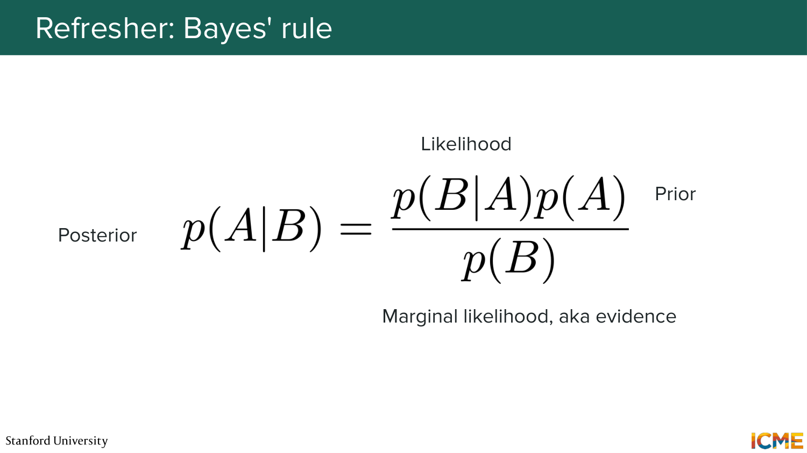

### 幻灯片内容

Refresher: Bayes' rule
Posterior
Prior
Likelihood
Marginal likelihood, aka evidence

### 通俗解释

贝叶斯公式复习：p(A|B) = p(B|A) * p(A) / p(B)。在扩散模型中用于推导 q(x_{t-1} | x_t, x_0)。

---

## Slide 78

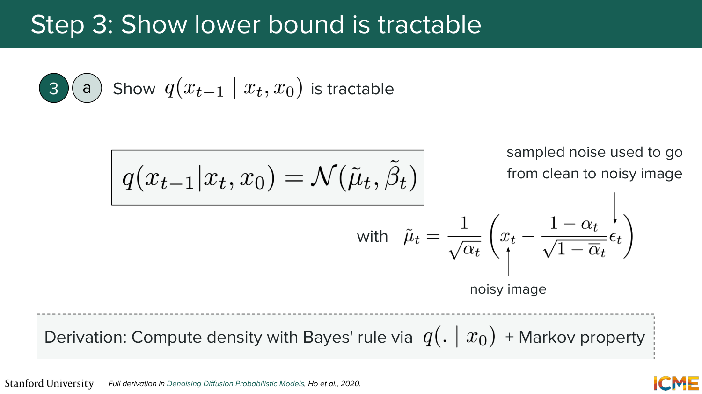

### 幻灯片内容

Step 3: Show lower bound is tractable
with
noisy image
sampled noise used to go 
from clean to noisy image
Derivation: Compute density with Bayes' rule via
+ Markov property
3
Show 
a
is tractable 
Full derivation in Denoising Diffusion Probabilistic Models, Ho et al., 2020.

### 通俗解释

后验分布：给定 x_t 和 x_0，x_{t-1} 的分布也是高斯分布。这允许我们计算 KL 散度的闭式解。

---

## Slide 79

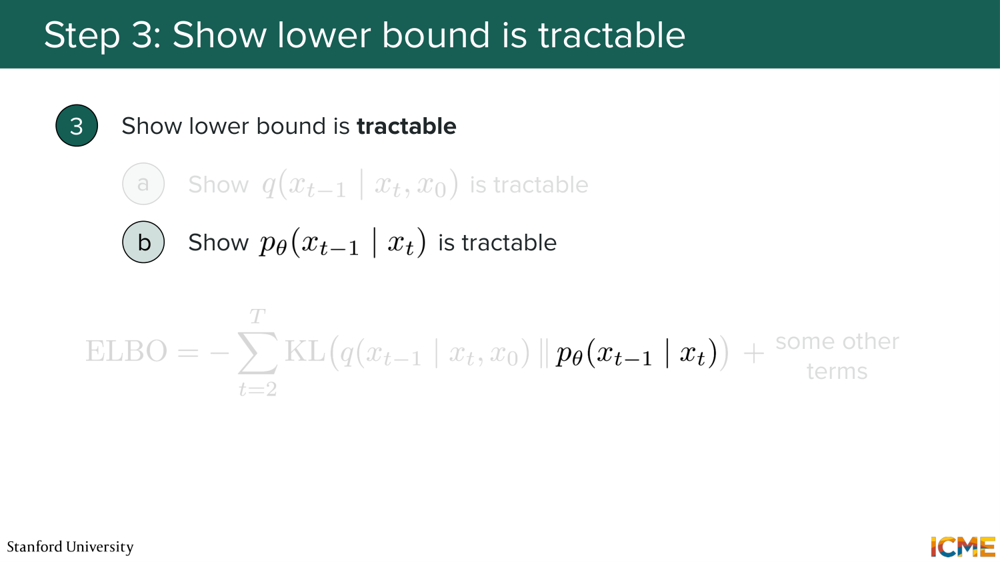

### 幻灯片内容

Step 3: Show lower bound is tractable
3
Show lower bound is tractable
some other 
terms
Show 
b
is tractable 
Show 
a
is tractable

### 通俗解释

下界可计算继续：由于所有涉及的分布都是高斯分布，KL 散度可以用均值和方差的简单公式计算。

---

## Slide 80

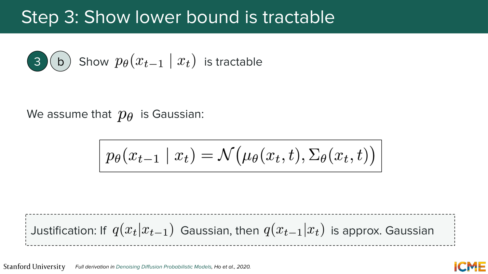

### 幻灯片内容

Step 3: Show lower bound is tractable
We assume that
is Gaussian:
3
Show 
b
is tractable 
Justification: If
Gaussian, then 
is approx. Gaussian
Full derivation in Denoising Diffusion Probabilistic Models, Ho et al., 2020.

### 通俗解释

高斯分布性质：两个高斯分布的 KL 散度只依赖于它们的均值和方差。这大大简化了计算。

---

## Slide 81

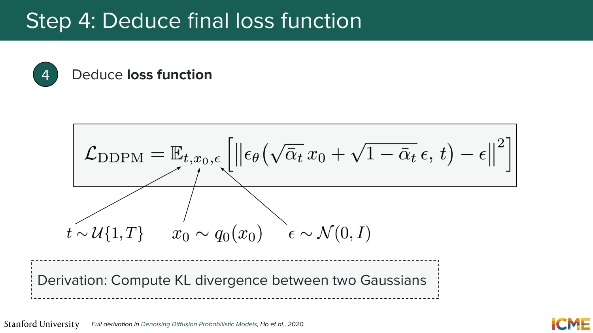

### 幻灯片内容

Step 4: Deduce final loss function
4
Deduce loss function
Derivation: Compute KL divergence between two Gaussians
Full derivation in Denoising Diffusion Probabilistic Models, Ho et al., 2020.

### 通俗解释

最终损失函数：经过推导，ELBO 的优化等价于最小化预测噪声和真实噪声之间的均方误差。这就是 DDPM 的损失函数。

---

## Slide 82

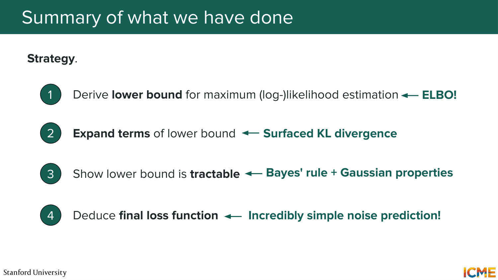

### 幻灯片内容

Summary of what we have done
Strategy.
Derive lower bound for maximum (log-)likelihood estimation
Expand terms of lower bound
1
2
3
Show lower bound is tractable
4
Deduce final loss function
Surfaced KL divergence
Bayes' rule + Gaussian properties
Incredibly simple noise prediction!
ELBO!

### 通俗解释

推导总结：从 log p(x_0) 出发，通过变分推断得到 ELBO，展开后简化为噪声预测的 MSE 损失。这个推导是扩散模型的核心理论基础。

---

## Slide 83

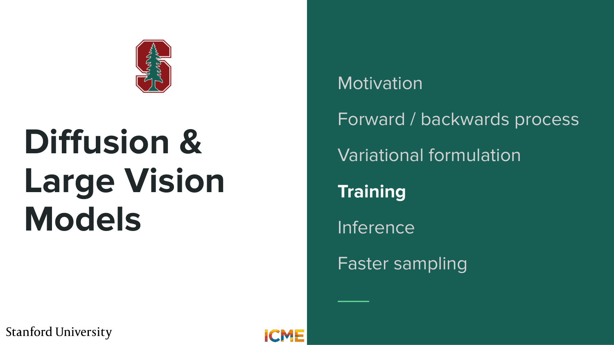

### 幻灯片内容

Motivation
Forward / backwards process
Variational formulation
Training
Inference
Faster sampling
Diffusion & 
Large Vision 
Models

### 通俗解释

前向/反向过程回顾：现在我们已经有了损失函数，可以开始训练模型了。

---

## Slide 84

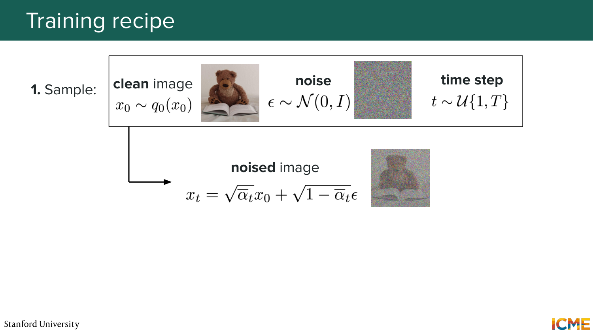

### 幻灯片内容

Training recipe
1. Sample:
time step
noise
clean image
noised image

### 通俗解释

训练步骤 1：从数据中采样 x_0。

---

## Slide 85

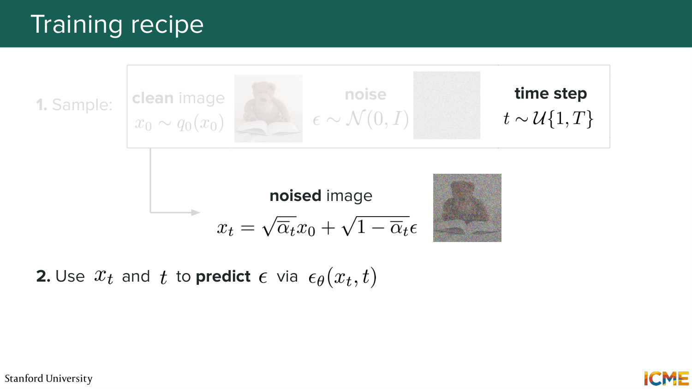

### 幻灯片内容

Training recipe
1. Sample:
time step
noise
2. Use
via
clean image
noised image
and
to predict

### 通俗解释

训练步骤 1 继续：随机采样一张真实图像作为起始点。

---

## Slide 86

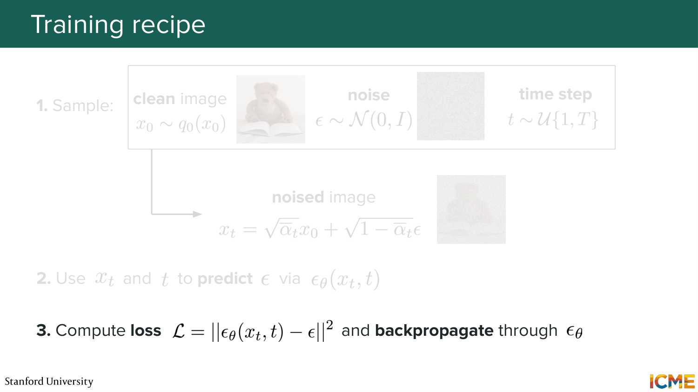

### 幻灯片内容

Training recipe
1. Sample:
3. Compute loss
time step
noise
2. Use
via
clean image
noised image
and
to predict
and backpropagate through

### 通俗解释

训练步骤 2：采样时间步 t 和噪声 epsilon。

---

## Slide 87

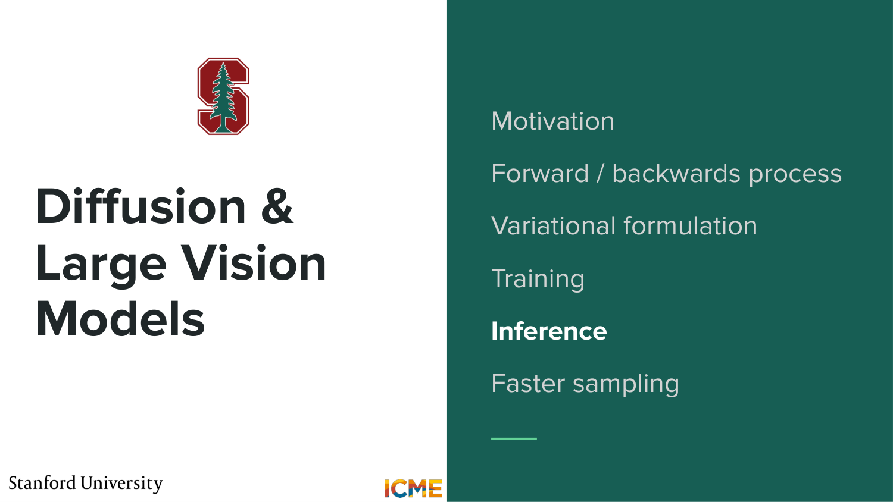

### 幻灯片内容

Motivation
Forward / backwards process
Variational formulation
Training
Inference
Faster sampling
Diffusion & 
Large Vision 
Models

### 通俗解释

训练步骤 2 继续：t 均匀采样自 {1,...,T}，epsilon 来自标准高斯分布。

---

## Slide 88

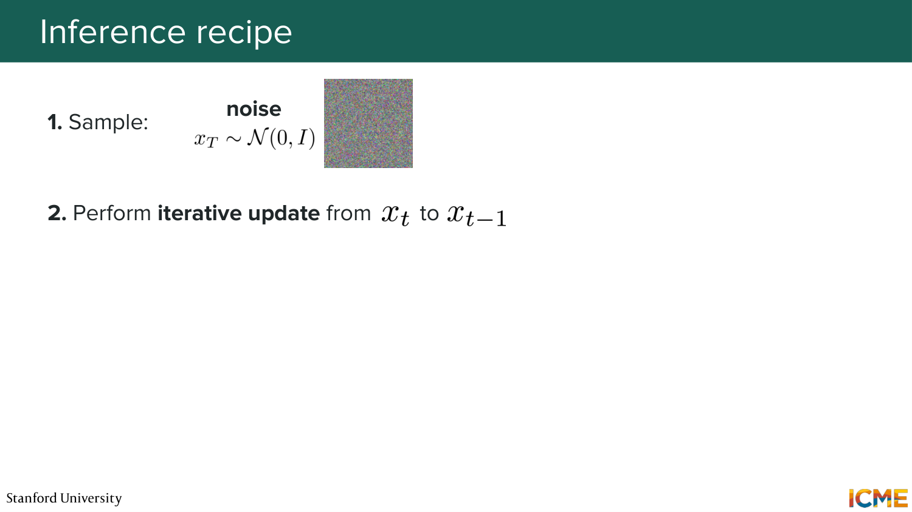

### 幻灯片内容

Inference recipe
1. Sample:
2. Perform iterative update from 
noise
to

### 通俗解释

训练步骤 3：计算带噪声的 x_t = sqrt(alpha_bar_t) * x_0 + sqrt(1-alpha_bar_t) * epsilon。

---

## Slide 89

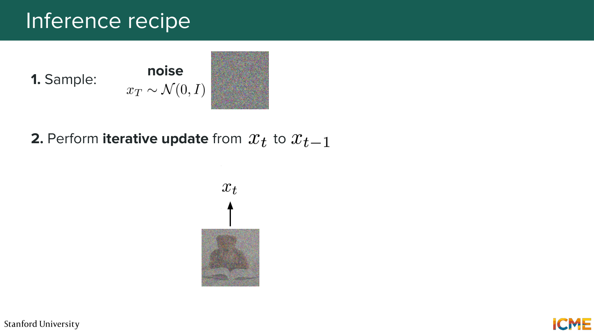

### 幻灯片内容

Inference recipe
1. Sample:
2. Perform iterative update from 
noise
to
Predicted noise 
to remove
Sampled from a 
Normal distribution

### 通俗解释

训练步骤 3 继续：这个公式允许我们一步计算任意时间步的噪声图像。

---

## Slide 90

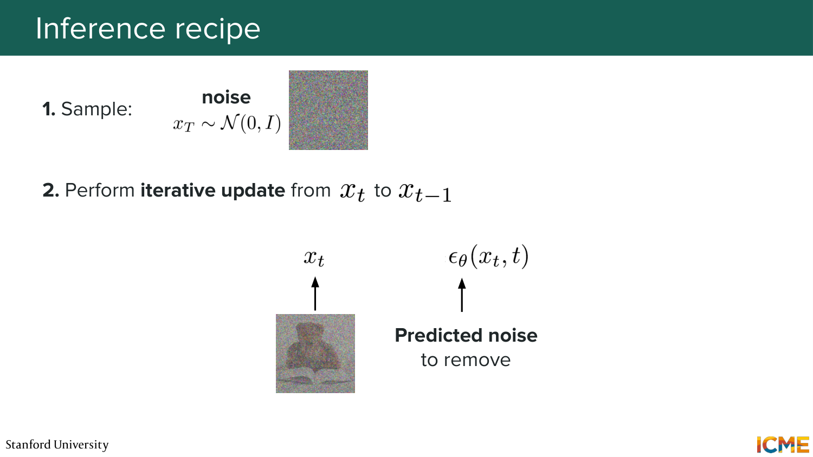

### 幻灯片内容

Inference recipe
1. Sample:
2. Perform iterative update from 
noise
to
Predicted noise 
to remove

### 通俗解释

训练步骤 4：用模型预测噪声 epsilon_theta = model(x_t, t)。

---

## Slide 91

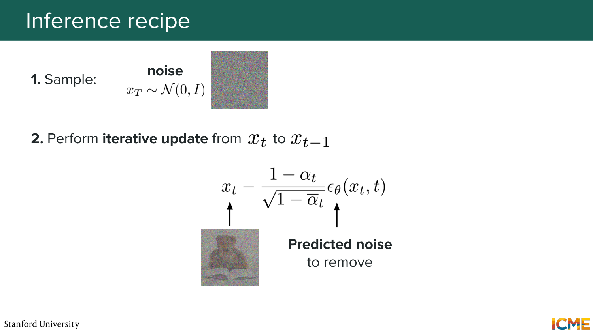

### 幻灯片内容

Inference recipe
1. Sample:
2. Perform iterative update from 
noise
to
Predicted noise 
to remove

### 通俗解释

训练步骤 4 继续：模型（通常是 U-Net）接收带噪声的图像 x_t 和时间步 t，输出预测的噪声。

---

## Slide 92

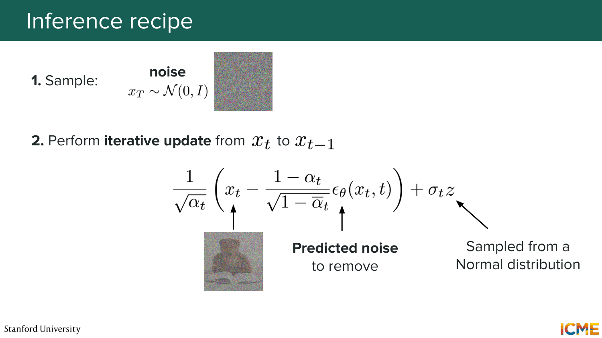

### 幻灯片内容

Inference recipe
1. Sample:
2. Perform iterative update from 
noise
to
Predicted noise 
to remove
Sampled from a 
Normal distribution

### 通俗解释

训练步骤 5：计算损失 L = ||epsilon - epsilon_theta||^2（均方误差）。

---

## Slide 93

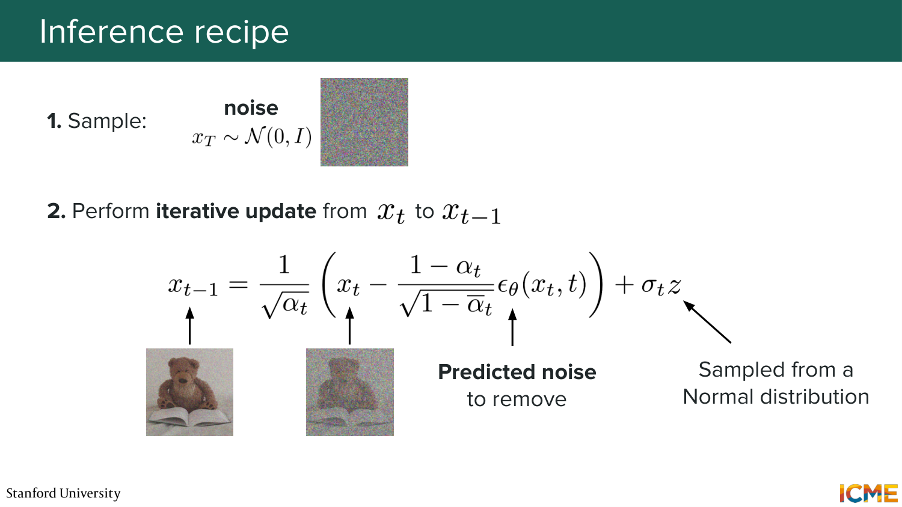

### 幻灯片内容

Inference recipe
1. Sample:
2. Perform iterative update from 
noise
to
Predicted noise 
to remove
Sampled from a 
Normal distribution

### 通俗解释

训练步骤 5 继续：这个损失衡量模型预测的噪声与真实噪声的差距。

---

## Slide 94

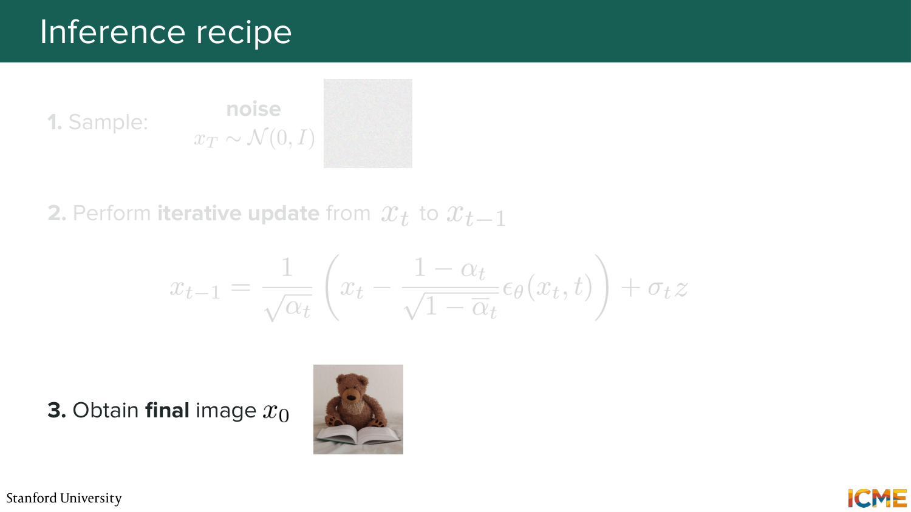

### 幻灯片内容

Inference recipe
1. Sample:
2. Perform iterative update from 
3. Obtain final image
noise
to

### 通俗解释

训练步骤 6：反向传播更新参数 theta。

---

## Slide 95

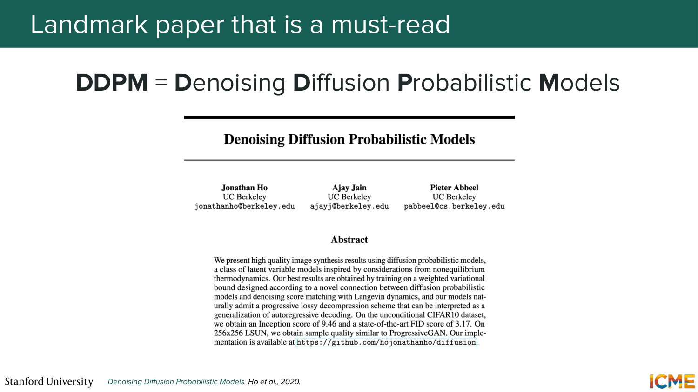

### 幻灯片内容

Landmark paper that is a must-read
Denoising Diffusion Probabilistic Models, Ho et al., 2020.
DDPM = Denoising Diffusion Probabilistic Models

### 通俗解释

DDPM 总结：Denoising Diffusion Probabilistic Models。核心是训练一个噪声预测模型，然后从纯噪声开始逐步去噪生成新样本。

---

## Slide 96

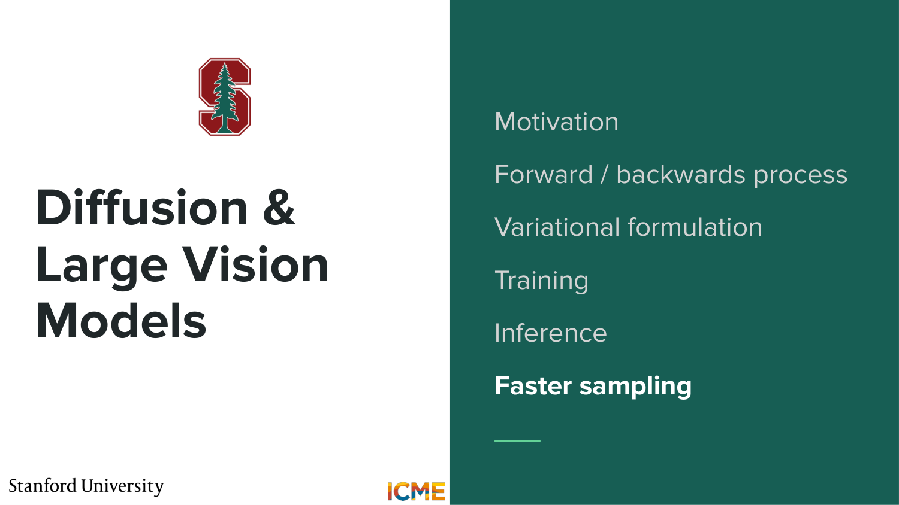

### 幻灯片内容

Motivation
Forward / backwards process
Variational formulation
Training
Inference
Faster sampling
Diffusion & 
Large Vision 
Models

### 通俗解释

前向/反向过程回顾：训练完成后，如何生成新样本？从 x_T ~ N(0,I) 开始，逐步应用反向过程。

---

## Slide 97

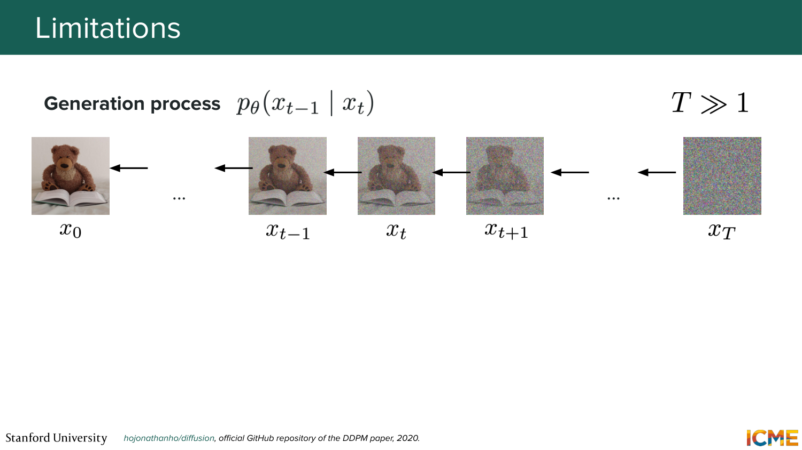

### 幻灯片内容

Limitations
Generation process
...
...
hojonathanho/diffusion, official GitHub repository of the DDPM paper, 2020.

### 通俗解释

官方代码：hojonathanho/diffusion 是 DDPM 论文的 GitHub 仓库。可以参考实际实现。

---

## Slide 98

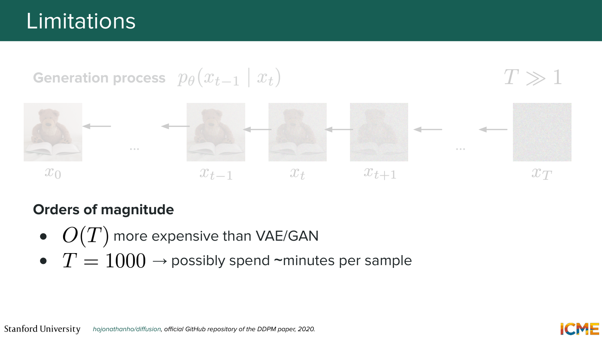

### 幻灯片内容

Limitations
Generation process
Orders of magnitude
●
             more expensive than VAE/GAN
●
                       → possibly spend ~minutes per sample 
...
...
hojonathanho/diffusion, official GitHub repository of the DDPM paper, 2020.

### 通俗解释

DDPM 的缺点：采样慢。需要 T=1000 步才能生成一张图，比 VAE/GAN 慢很多。

---

## Slide 99

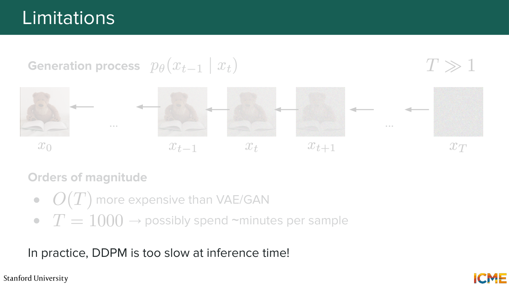

### 幻灯片内容

Limitations
Generation process
Orders of magnitude
●
             more expensive than VAE/GAN
●
                       → possibly spend ~minutes per sample 
In practice, DDPM is too slow at inference time!
...
...

### 通俗解释

采样慢的原因：每一步只能去除少量噪声，需要很多步才能得到清晰图像。

---

## Slide 100

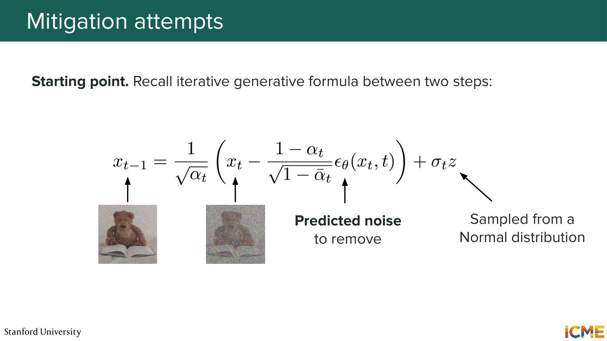

### 幻灯片内容

Mitigation attempts
Starting point. Recall iterative generative formula between two steps:
Predicted noise 
to remove
Sampled from a 
Normal distribution

### 通俗解释

预测噪声：模型在每个时间步预测的噪声 epsilon_theta。这个预测的质量决定了生成效果。

---

## Slide 101

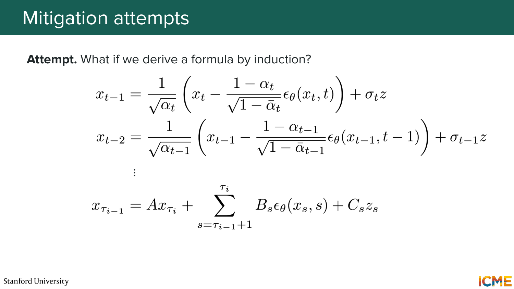

### 幻灯片内容

Mitigation attempts
Attempt. What if we derive a formula by induction?
...

### 通俗解释

缓解采样慢的尝试：减少时间步数 T。但直接使用较少步数会导致质量下降。

---

## Slide 102

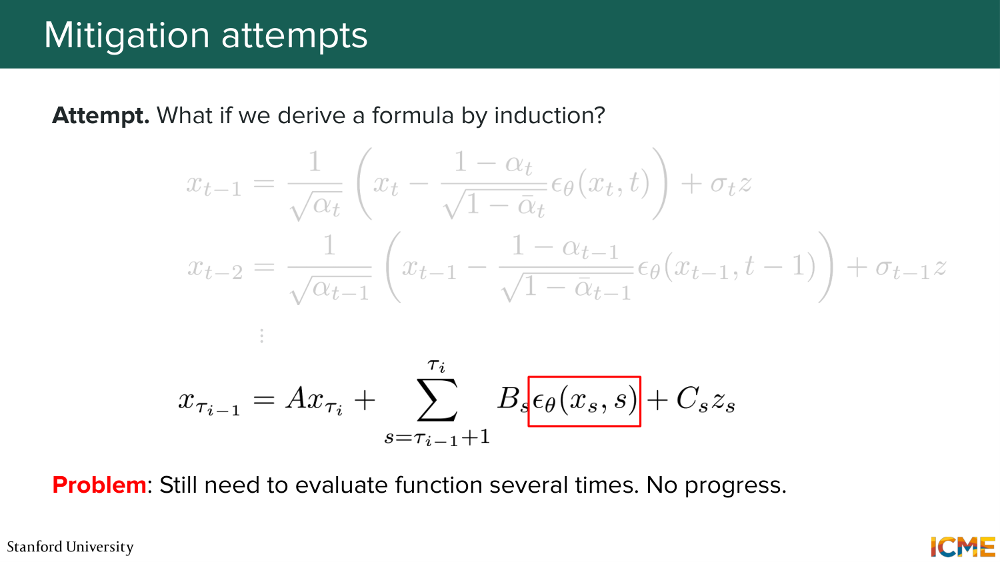

### 幻灯片内容

Mitigation attempts
Attempt. What if we derive a formula by induction?
Problem: Still need to evaluate function several times. No progress.
...

### 通俗解释

缓解尝试继续：需要修改采样策略，而不仅仅是减少步数。

---

## Slide 103

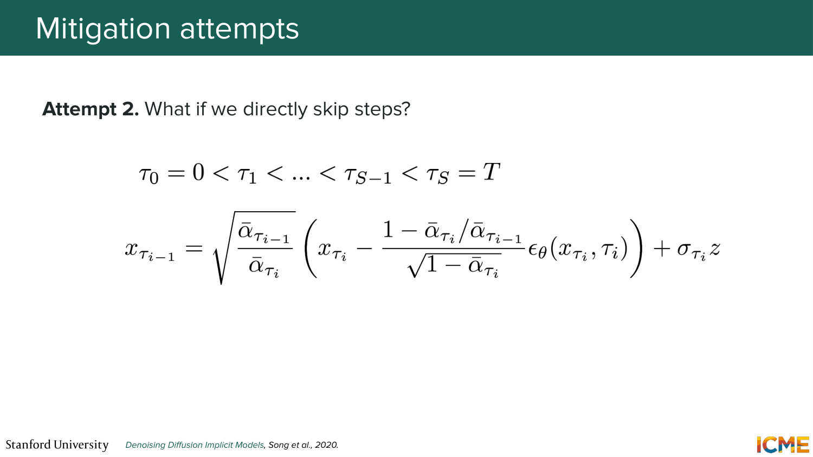

### 幻灯片内容

Mitigation attempts
Denoising Diffusion Implicit Models, Song et al., 2020.
Attempt 2. What if we directly skip steps?

### 通俗解释

缓解尝试继续：DDIM 就是一种改进的采样方法。

---

## Slide 104

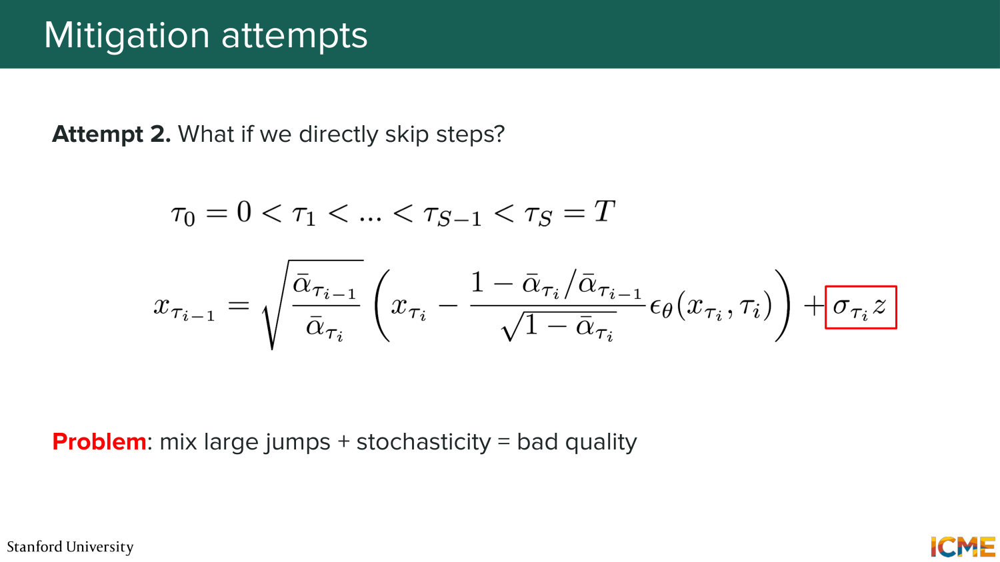

### 幻灯片内容

Mitigation attempts
Attempt 2. What if we directly skip steps?
 
Problem: mix large jumps + stochasticity = bad quality

### 通俗解释

缓解尝试继续：还有其他方法如蒸馏、知识蒸馏等。

---

## Slide 105

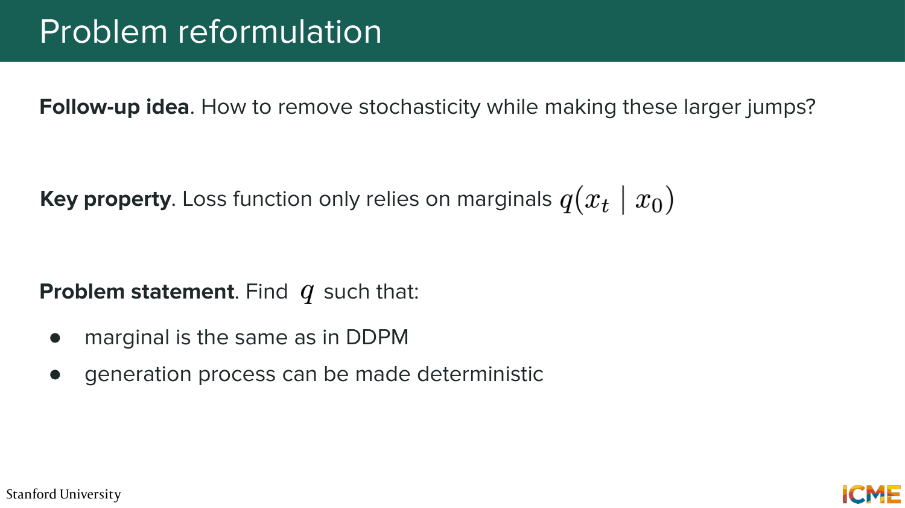

### 幻灯片内容

Problem statement. Find      such that:
●
marginal is the same as in DDPM
●
generation process can be made deterministic
Key property. Loss function only relies on marginals
Problem reformulation
Follow-up idea. How to remove stochasticity while making these larger jumps?

### 通俗解释

DDIM 的关键观察：DDPM 的边缘分布（marginal）与 DDIM 相同，但条件分布不同。DDIM 是确定性的。

---

## Slide 106

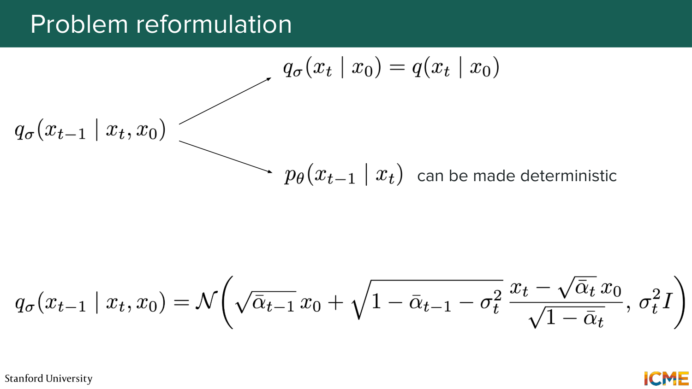

### 幻灯片内容

Problem reformulation
can be made deterministic

### 通俗解释

过渡页：DDIM 公式。

---

## Slide 107

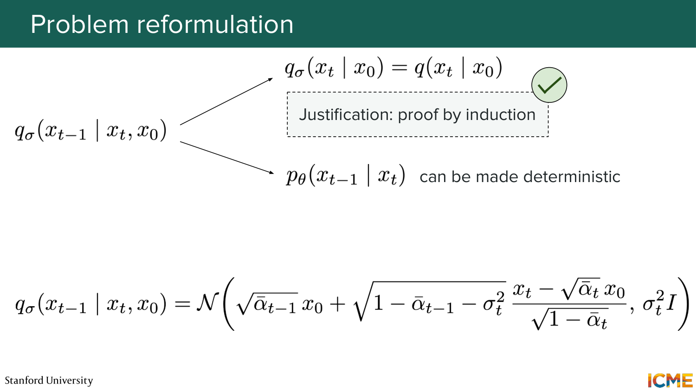

### 幻灯片内容

Problem reformulation
can be made deterministic
Justification: proof by induction

### 通俗解释

问题重新公式化：DDIM 将反向过程重新定义为确定性过程，而不是随机过程。

---

## Slide 108

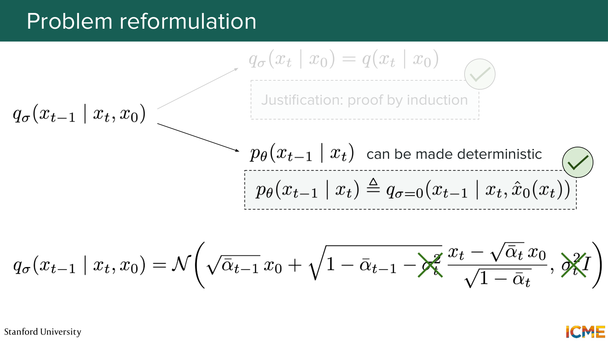

### 幻灯片内容

Problem reformulation
can be made deterministic
Justification: proof by induction

### 通俗解释

DDIM 公式：x_{t-1} = sqrt(alpha_{t-1}) * (x_t - sqrt(1-alpha_t) * epsilon_theta) / sqrt(alpha_t) + sqrt(1-alpha_{t-1}) * epsilon_theta。

---

## Slide 109

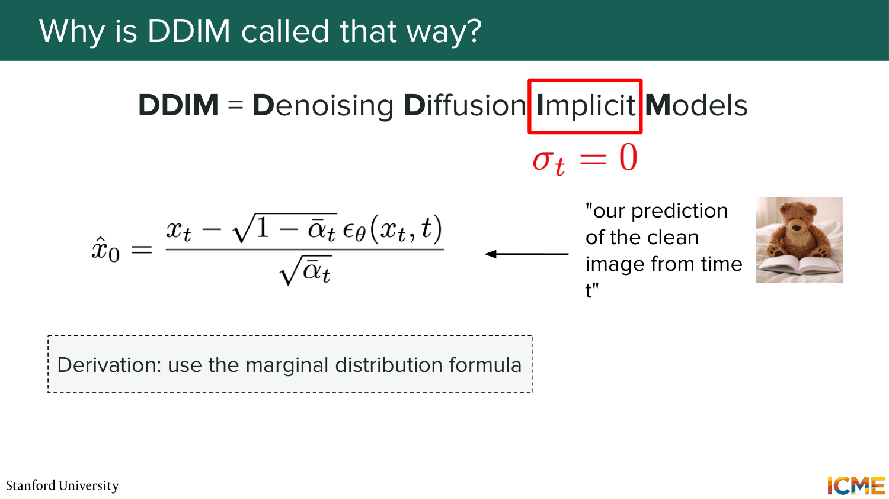

### 幻灯片内容

Why is DDIM called that way?
DDIM = Denoising Diffusion Implicit Models
"our prediction 
of the clean 
image from time 
t"
Derivation: use the marginal distribution formula

### 通俗解释

为什么叫 DDIM：Denoising Diffusion Implicit Models。Implicit 意味着它是隐式的、确定性的，而不是显式的随机过程。

---

## Slide 110

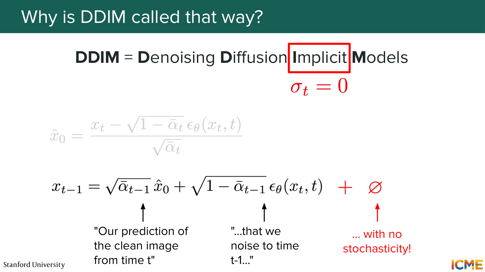

### 幻灯片内容

Why is DDIM called that way?
DDIM = Denoising Diffusion Implicit Models
"...that we 
noise to time 
t-1..."
"Our prediction of 
the clean image 
from time t"
... with no 
stochasticity!

### 通俗解释

DDIM 的确定性：给定 x_t 和 epsilon_theta，x_{t-1} 是唯一确定的。没有随机噪声项。

---

## Slide 111

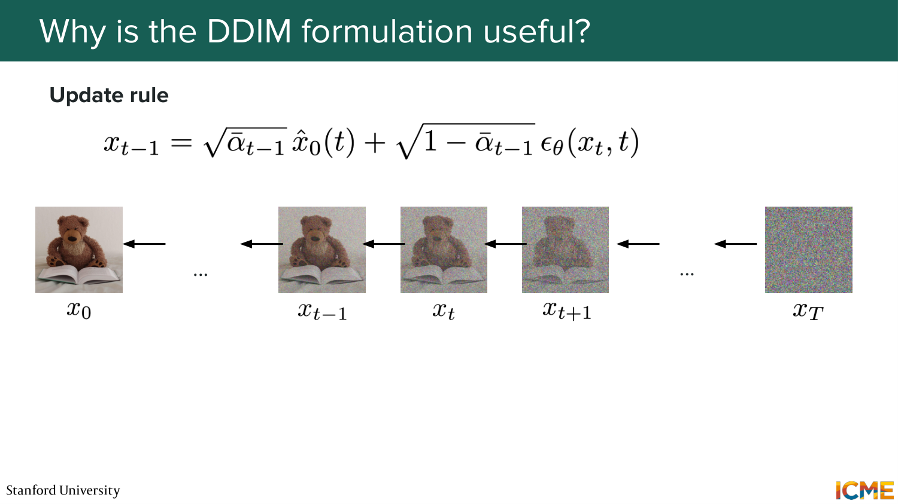

### 幻灯片内容

Why is the DDIM formulation useful?
Update rule
...
...

### 通俗解释

DDIM 的优势：因为确定性，可以跳过中间步骤，直接用子序列 {s_1, s_2, ..., s_k} 采样，大幅加速。

---

## Slide 112

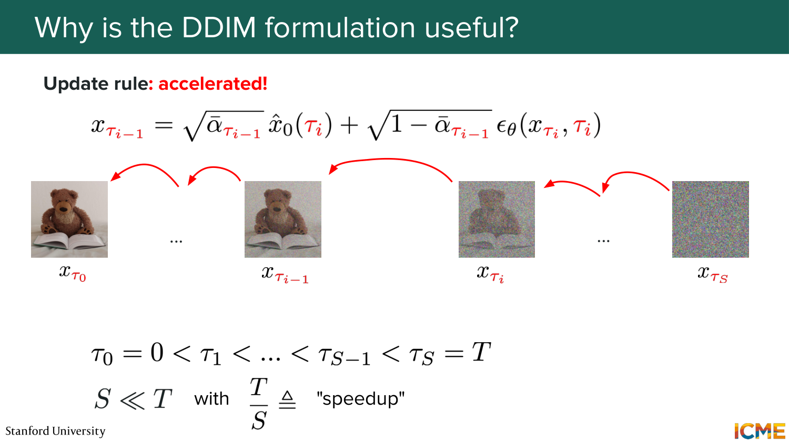

### 幻灯片内容

...
...
Why is the DDIM formulation useful?
Update rule: accelerated!
with                 "speedup"

### 通俗解释

DDIM 加速原理：可以从 1000 步减少到 50 步甚至 20 步，同时保持较好的生成质量。

---

## Slide 113

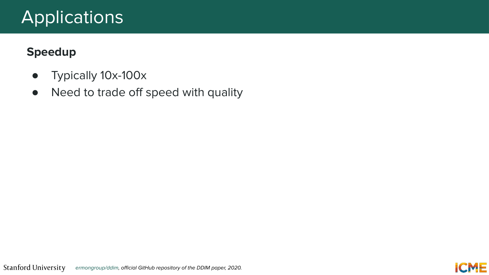

### 幻灯片内容

Speedup
●
Typically 10x-100x
●
Need to trade off speed with quality
Applications
ermongroup/ddim, official GitHub repository of the DDIM paper, 2020.

### 通俗解释

加速效果：DDIM 用 50 步可以达到 DDPM 1000 步的质量，速度提升 20 倍。

---

## Slide 114

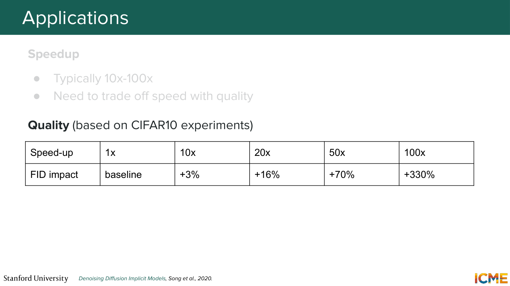

### 幻灯片内容

Speedup
●
Typically 10x-100x
●
Need to trade off speed with quality
Quality (based on CIFAR10 experiments)
Applications
Denoising Diffusion Implicit Models, Song et al., 2020.
Speed-up
1x
10x
20x
50x
100x
FID impact
baseline
+3%
+16%
+70%
+330%

### 通俗解释

加速继续：步数越少，速度越快，但质量可能略有下降。

---

## Slide 115

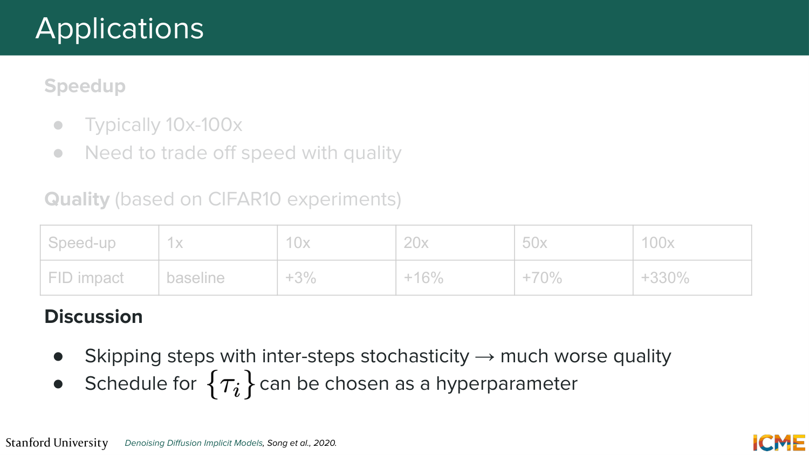

### 幻灯片内容

Speedup
●
Typically 10x-100x
●
Need to trade off speed with quality
Quality (based on CIFAR10 experiments)
Discussion
●
Skipping steps with inter-steps stochasticity → much worse quality
●
Schedule for            can be chosen as a hyperparameter
Applications
Speed-up
1x
10x
20x
50x
100x
FID impact
baseline
+3%
+16%
+70%
+330%
Denoising Diffusion Implicit Models, Song et al., 2020.

### 通俗解释

加速总结：DDIM 是实用的采样方法，使得扩散模型在实际应用中可行。

---

## Slide 116

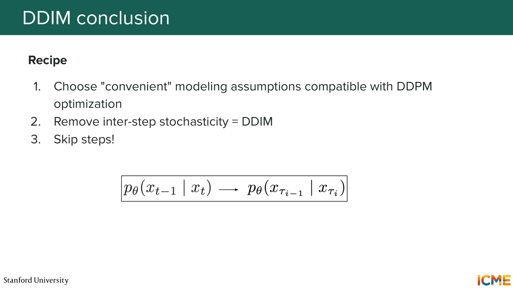

### 幻灯片内容

DDIM conclusion
Recipe
1.
Choose "convenient" modeling assumptions compatible with DDPM 
optimization
2.
Remove inter-step stochasticity = DDIM
3.
Skip steps!

### 通俗解释

DDIM 结论：通过确定性采样和步数跳跃，DDIM 大幅加速了扩散模型的生成过程，同时保持了较好的质量。

---

## Slide 117

### 通俗解释

Lecture 1 总结/结束页。

---
