# Stanford CME 296 - Lecture 4: Latent Space & Guidance (VAE, CLIP, CFG)

> **课程**: Stanford CME 296 - Diffusion & Large Vision Models
> **讲师**: Afshine Amidi & Shervine Amidi
> **视频**: [YouTube 1:40:58](https://www.youtube.com/watch?v=WUUq6TVAu8U&list=PLoROMvodv4rNdy8rt2rZ4T2xM0OjADnfu&index=4)
> **Slides PDF**: [spring26-cme296-lecture4.pdf](../spring26-cme296-lecture4.pdf)
> **总页数**: 148 页幻灯片

---

## Slide 1

### 幻灯片内容

CME 296: Diffusion &
Large Vision Models
Afshine Amidi & Shervine Amidi
Lecture 4

### 通俗解释

Lecture 4 封面：潜空间与引导（Latent Space & Guidance）。从像素级扩散到潜空间扩散的关键转折。

---

## Slide 2

### 幻灯片内容

Recap of last episodes…
Lecture 1: 
Diffusion, 
DDPM

### 通俗解释

回顾 Lecture 1：扩散模型（DDPM）——通过前向加噪和反向去噪学习从噪声生成图像。

---

## Slide 3

### 幻灯片内容

Recap of last episodes…
Lecture 2: 
Score matching, 
SDE
Lecture 1: 
Diffusion, 
DDPM

### 通俗解释

回顾 Lecture 2：评分匹配（Score Matching）和 SDE——扩散模型的连续时间视角。

---

## Slide 4

### 幻灯片内容

Recap of last episodes…
Lecture 3:
Flow matching
Lecture 2: 
Score matching, 
SDE
Lecture 1: 
Diffusion, 
DDPM

### 通俗解释

回顾 Lecture 3：流匹配（Flow Matching）和 Rectified Flow——通过 ODE 视角学习从噪声到数据的流动。

---

## Slide 5

### 幻灯片内容

Recap of last episodes…
Lecture 3:
Flow matching
Lecture 2: 
Score matching, 
SDE
Lecture 1: 
Diffusion, 
DDPM

### 通俗解释

三种范式总结：Diffusion（离散）、Score Matching（SDE）、Flow Matching（ODE）本质等价。

---

## Slide 6

### 幻灯片内容

Recap of last episodes…
Lecture 3:
Flow matching
Lecture 2: 
Score matching, 
SDE
Lecture 1: 
Diffusion, 
DDPM

### 通俗解释

回顾继续：它们都解决了同一个问题——如何从噪声生成高质量数据。

---

## Slide 7

### 幻灯片内容

Recap of last episodes…
Lecture 3:
Flow matching
Lecture 2: 
Score matching, 
SDE
Lecture 1: 
Diffusion, 
DDPM

### 通俗解释

回顾结束：现在进入 Lecture 4，讨论如何在潜空间（而非像素空间）进行扩散。

---

## Slide 8

### 幻灯片内容

Today's lecture
A teddy bear 
reading a book
Condition
Black box 
architecture
Today's lecture: Multimodal guided generation
Representation
Guided generation

### 通俗解释

今天的内容：Part 1-从像素到潜空间（VAE）；Part 2-文本和图像表示（CLIP）；Part 3-引导（Guidance）。

---

## Slide 9

### 幻灯片内容

Today's lecture: Part 1
A teddy bear 
reading a book
Condition
Black box 
architecture
Today's lecture: Multimodal guided generation
Representation
1
Guided generation

### 通俗解释

Part 1 概览：为什么要在潜空间做扩散？像素空间的问题是什么？

---

## Slide 10

### 幻灯片内容

From pixel to latent space
Latent diffusion models
Text representation
Image representation
Contrastive learning
Guidance
Diffusion & 
Large Vision 
Models

### 通俗解释

从像素到潜空间：像素空间太大太冗余。一张 1024x1024 RGB 图像有 300 万像素，直接扩散计算量巨大。

---

## Slide 11

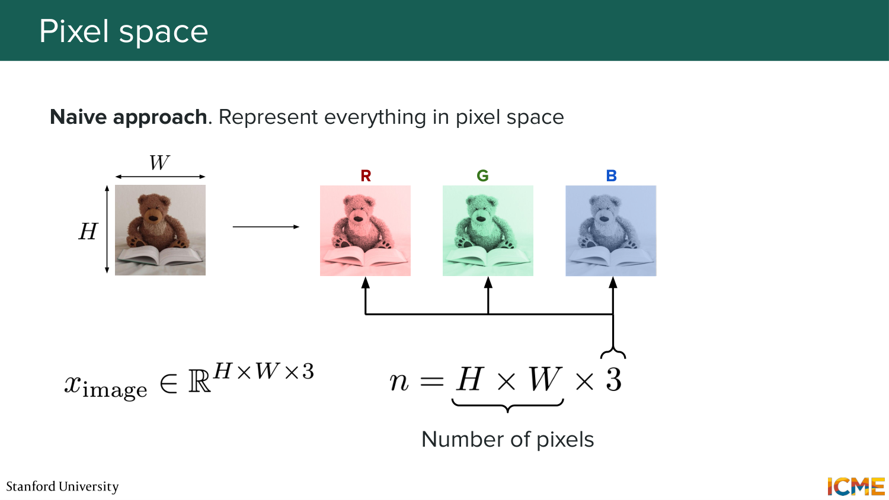

### 幻灯片内容

Pixel space
Naive approach. Represent everything in pixel space
R
G
B
Number of pixels

### 通俗解释

像素空间：每个像素是一个维度。高维=高计算成本+冗余信息。

---

## Slide 12

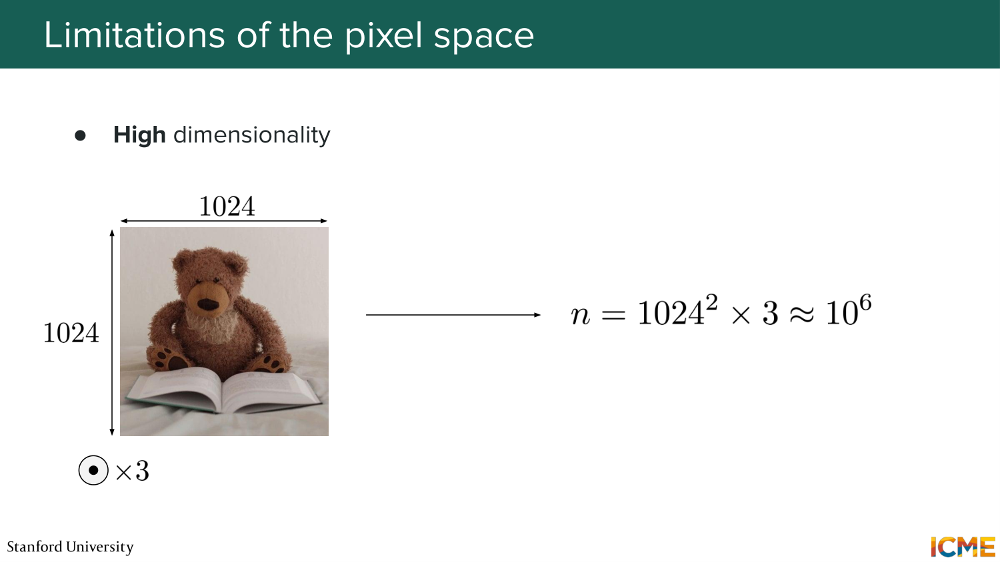

### 幻灯片内容

Limitations of the pixel space
●
High dimensionality

### 通俗解释

像素空间局限性1：计算成本高。扩散模型每步需处理整个图像，像素越多越慢。

---

## Slide 13

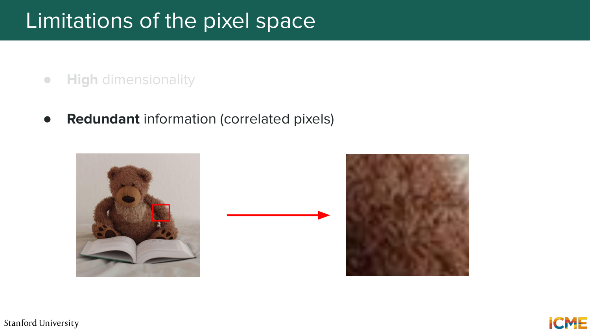

### 幻灯片内容

Limitations of the pixel space
●
High dimensionality
●
Redundant information (correlated pixels)

### 通俗解释

像素空间局限性2：冗余。相邻像素高度相关，不需要每个像素独立建模。

---

## Slide 14

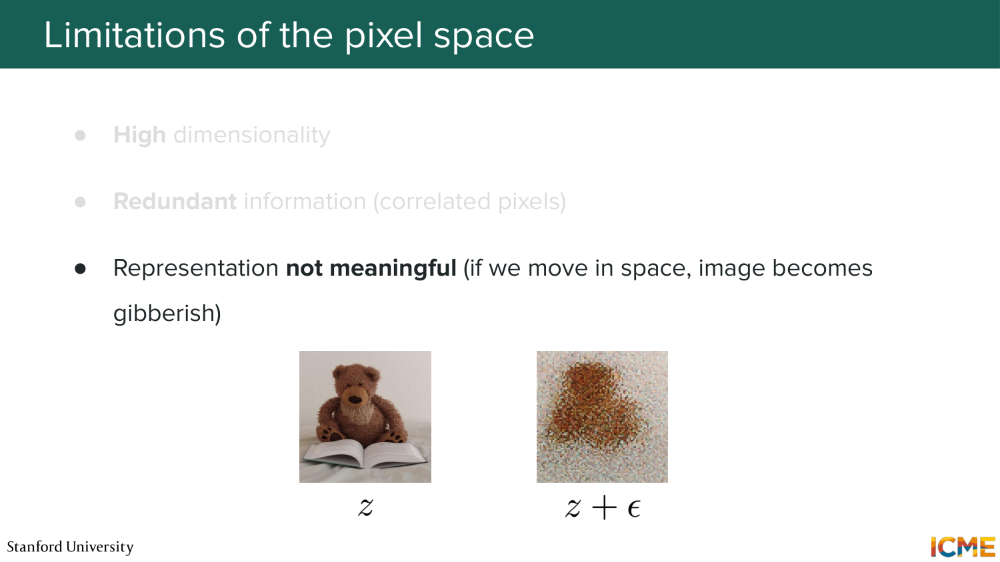

### 幻灯片内容

Limitations of the pixel space
●
High dimensionality
●
Redundant information (correlated pixels)
●
Representation not meaningful (if we move in space, image becomes 
gibberish)

### 通俗解释

像素空间局限性3：高频细节难学习。像素级 MSE 损失倾向产生模糊图像。

---

## Slide 15

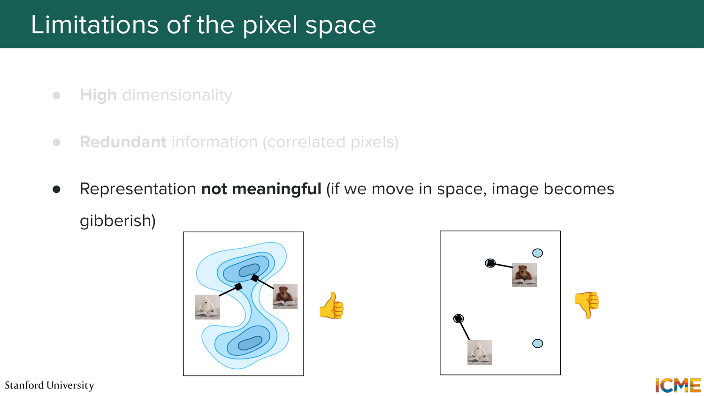

### 幻灯片内容

Limitations of the pixel space
●
High dimensionality
●
Redundant information (correlated pixels)
●
Representation not meaningful (if we move in space, image becomes 
gibberish)
👍
👎

### 通俗解释

像素空间局限性4：生成质量受限。直接在像素空间生成高分辨率图像很困难。

---

## Slide 16

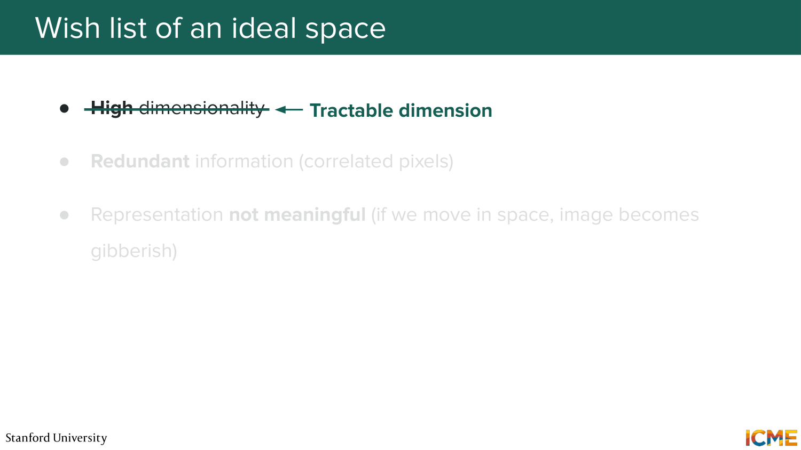

### 幻灯片内容

Wish list of an ideal space
Tractable dimension
●
High dimensionality
●
Redundant information (correlated pixels)
●
Representation not meaningful (if we move in space, image becomes 
gibberish)

### 通俗解释

理想空间愿望清单1：低维度（减少计算量）。

---

## Slide 17

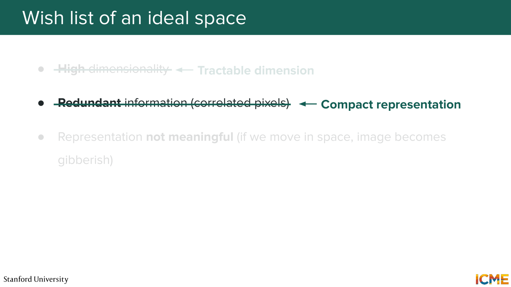

### 幻灯片内容

Wish list of an ideal space
Tractable dimension
●
High dimensionality
●
Redundant information (correlated pixels)
Compact representation
●
Representation not meaningful (if we move in space, image becomes 
gibberish)

### 通俗解释

理想空间愿望清单2：语义丰富（每个维度代表有意义的特征）。

---

## Slide 18

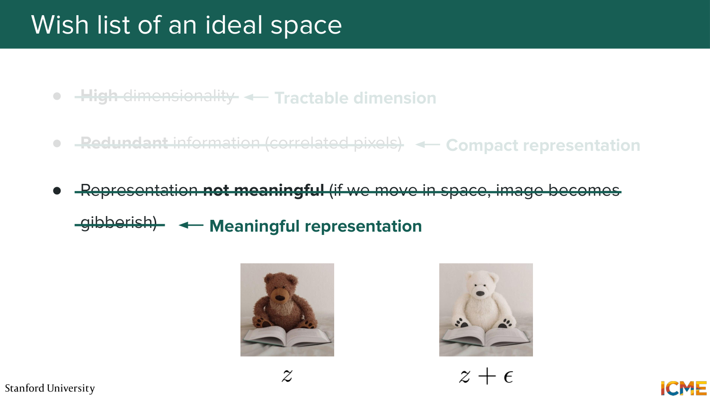

### 幻灯片内容

Wish list of an ideal space
Tractable dimension
●
High dimensionality
●
Redundant information (correlated pixels)
●
Representation not meaningful (if we move in space, image becomes 
gibberish)
Compact representation
Meaningful representation

### 通俗解释

理想空间愿望清单3：可逆（能从潜空间恢复原始图像）。

---

## Slide 19

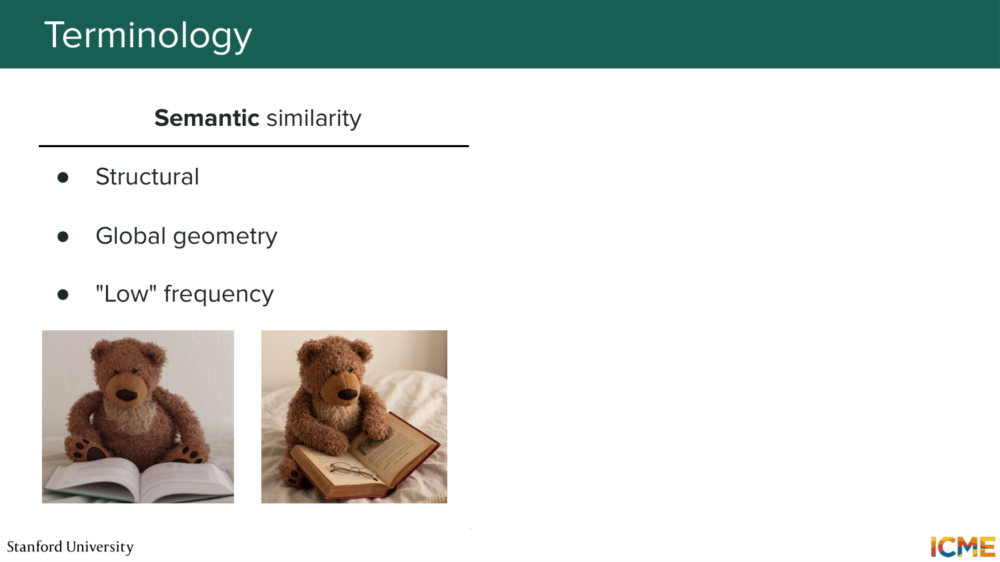

### 幻灯片内容

Terminology
Semantic similarity
●
Structural
●
Global geometry
●
"Low" frequency

### 通俗解释

术语：编码器（Encoder）将像素压缩为潜变量，解码器（Decoder）从潜变量恢复像素。

---

## Slide 20

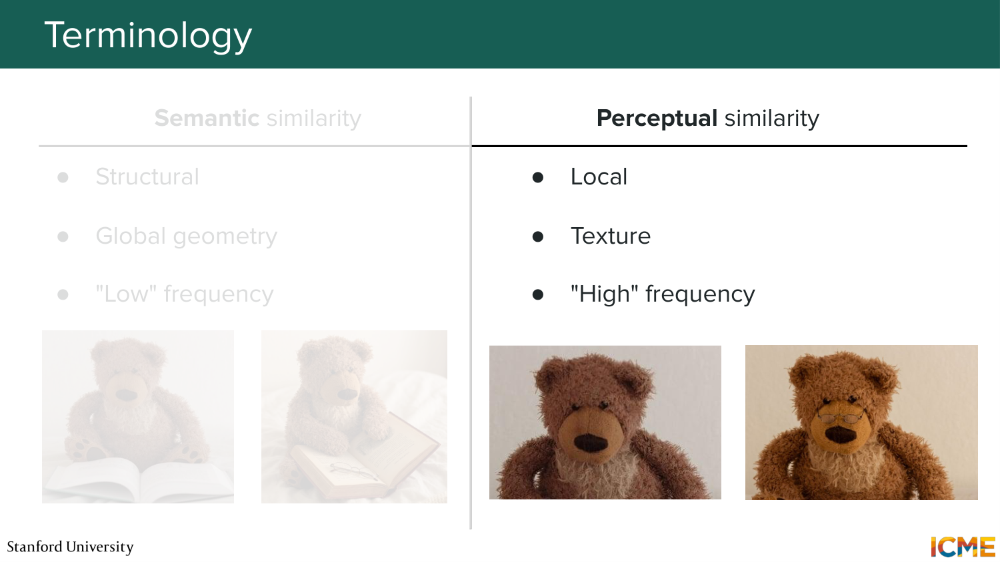

### 幻灯片内容

Terminology
Semantic similarity
Perceptual similarity
●
Structural
●
Global geometry
●
"Low" frequency
●
Local
●
Texture
●
"High" frequency

### 通俗解释

术语继续：潜空间（Latent Space）是压缩后的低维表示空间。

---

## Slide 21

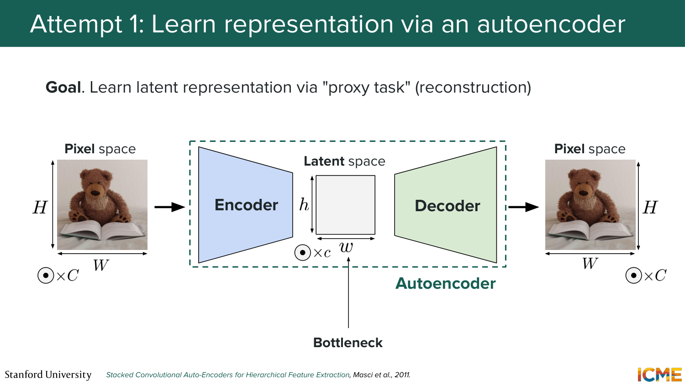

### 幻灯片内容

Attempt 1: Learn representation via an autoencoder
Encoder
Decoder
Bottleneck
Pixel space
Pixel space
Latent space
Stacked Convolutional Auto-Encoders for Hierarchical Feature Extraction, Masci et al., 2011.
Goal. Learn latent representation via "proxy task" (reconstruction)
Autoencoder

### 通俗解释

尝试1：用自动编码器（Autoencoder）学习表示。编码器压缩，解码器重建。

---

## Slide 22

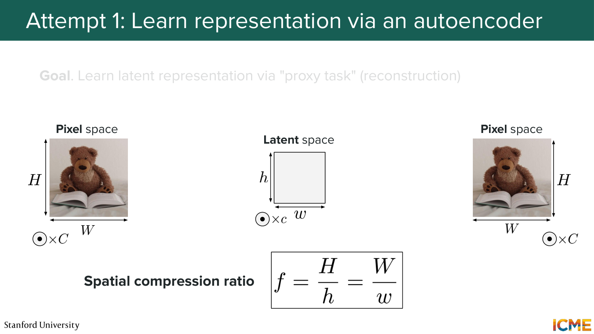

### 幻灯片内容

Attempt 1: Learn representation via an autoencoder
Pixel space
Pixel space
Latent space
Goal. Learn latent representation via "proxy task" (reconstruction)
Spatial compression ratio

### 通俗解释

自动编码器结构：Encoder -> Latent -> Decoder -> Reconstruction。损失是重建误差。

---

## Slide 23

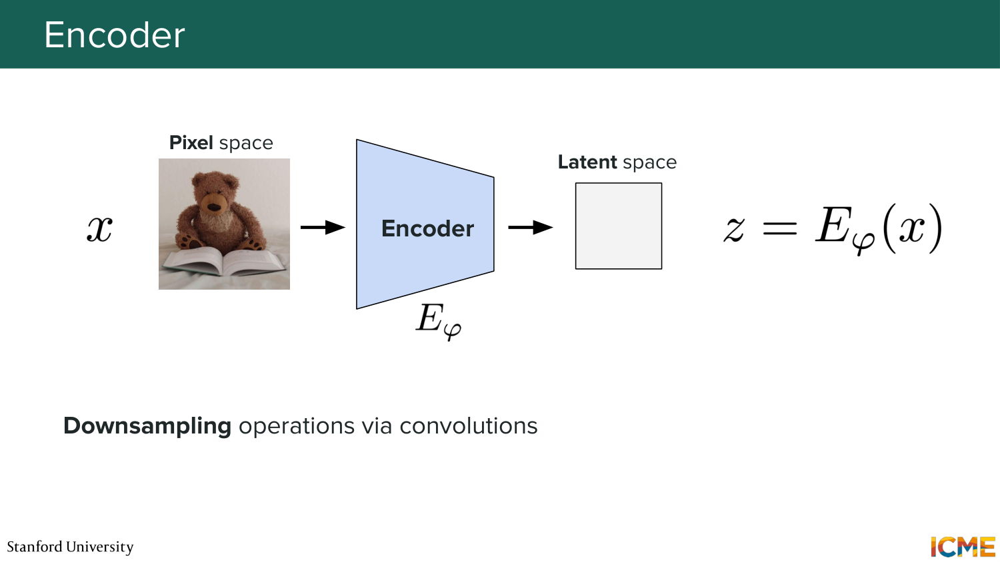

### 幻灯片内容

Encoder
Downsampling operations via convolutions
Encoder
Pixel space
Latent space

### 通俗解释

编码器：将高维像素 x 压缩为低维潜变量 z。z = Encoder(x)。

---

## Slide 24

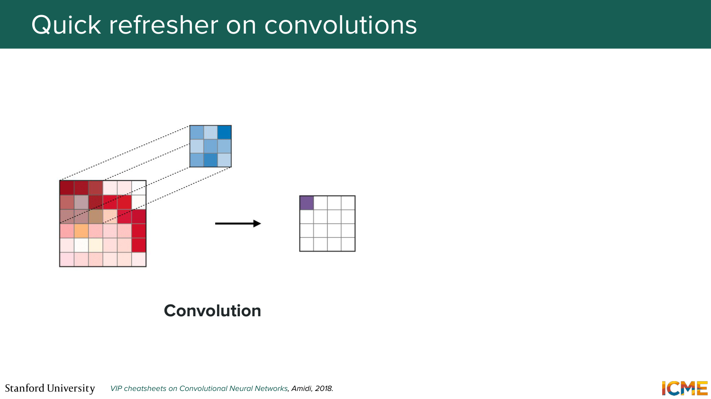

### 幻灯片内容

Quick refresher on convolutions
Convolution
VIP cheatsheets on Convolutional Neural Networks, Amidi, 2018.

### 通俗解释

卷积快速复习：卷积核在图像上滑动，提取局部特征。

---

## Slide 25

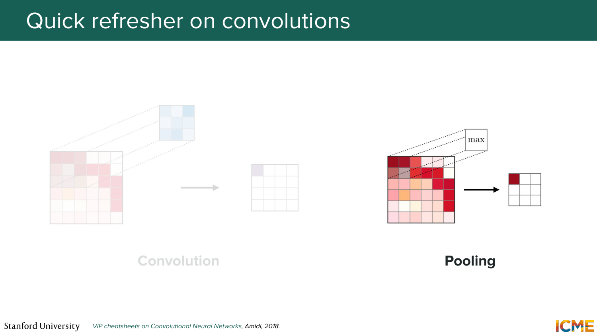

### 幻灯片内容

Quick refresher on convolutions
Convolution
Pooling
VIP cheatsheets on Convolutional Neural Networks, Amidi, 2018.

### 通俗解释

卷积继续：堆叠卷积层可学习越来越抽象的特征表示。

---

## Slide 26

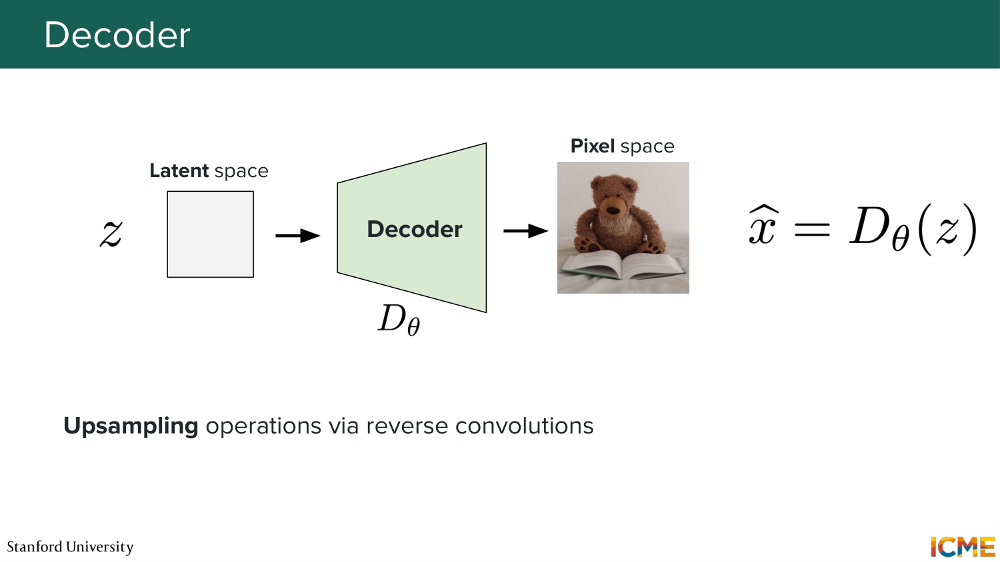

### 幻灯片内容

Decoder
Latent space
Decoder
Pixel space
Upsampling operations via reverse convolutions

### 通俗解释

解码器：从潜变量 z 重建图像 x_hat = Decoder(z)。

---

## Slide 27

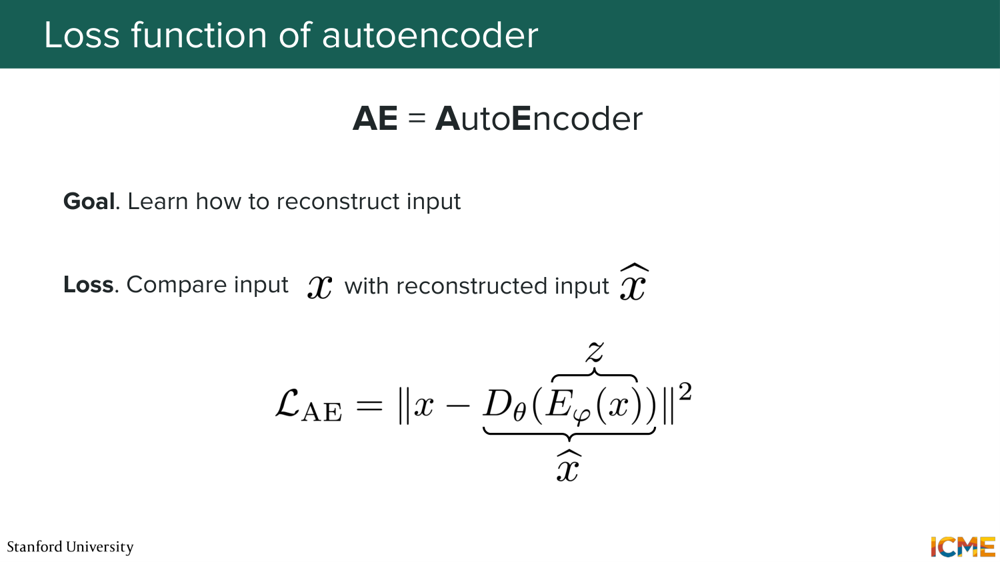

### 幻灯片内容

Loss function of autoencoder
Loss. Compare input
Goal. Learn how to reconstruct input 
with reconstructed input
AE = AutoEncoder

### 通俗解释

自动编码器损失函数：重建损失 = ||x - x_hat||^2。目标是让重建尽可能接近原始。

---

## Slide 28

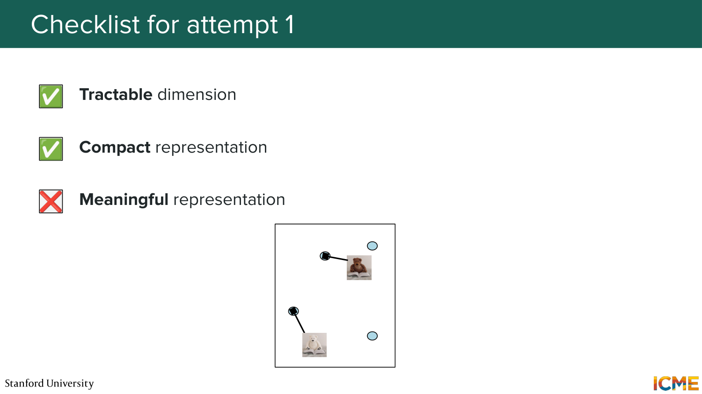

### 幻灯片内容

Checklist for attempt 1
✅
✅
Tractable dimension
Compact representation
❌
Meaningful representation

### 通俗解释

尝试1检查清单：问题1-潜变量没有约束，可能不连续；问题2-无法从随机潜变量生成新样本。

---

## Slide 29

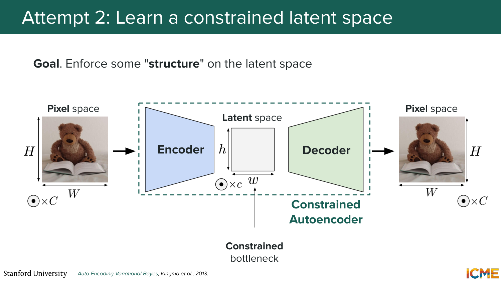

### 幻灯片内容

Attempt 2: Learn a constrained latent space
Auto-Encoding Variational Bayes, Kingma et al., 2013.
Goal. Enforce some "structure" on the latent space
Encoder
Decoder
Constrained 
bottleneck
Pixel space
Pixel space
Latent space
Constrained 
Autoencoder

### 通俗解释

尝试2：学习有约束的潜空间。这就是 VAE（变分自动编码器）的核心思想。

---

## Slide 30

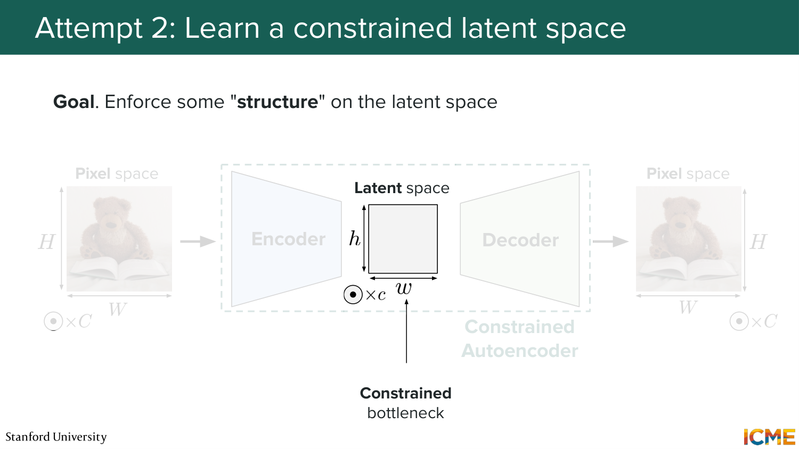

### 幻灯片内容

Attempt 2: Learn a constrained latent space
Goal. Enforce some "structure" on the latent space
Encoder
Decoder
Pixel space
Pixel space
Latent space
Constrained 
Autoencoder
Constrained 
bottleneck

### 通俗解释

VAE 核心：强制潜变量服从标准正态分布 N(0,I)。这样可从分布中采样生成新样本。

---

## Slide 31

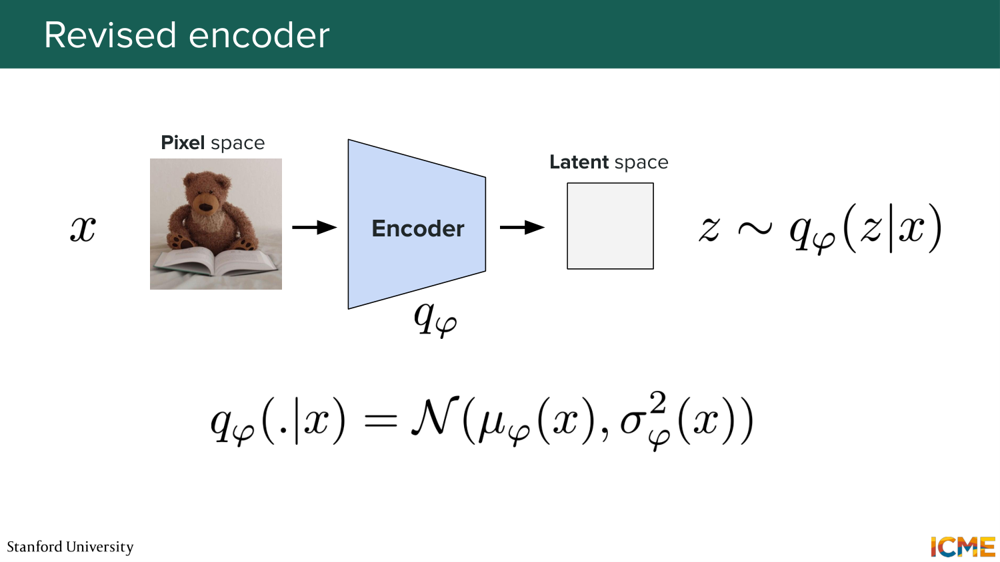

### 幻灯片内容

Revised encoder
Encoder
Pixel space
Latent space

### 通俗解释

这页内容：Revised encoder Encoder Pixel space Latent space...

---

## Slide 32

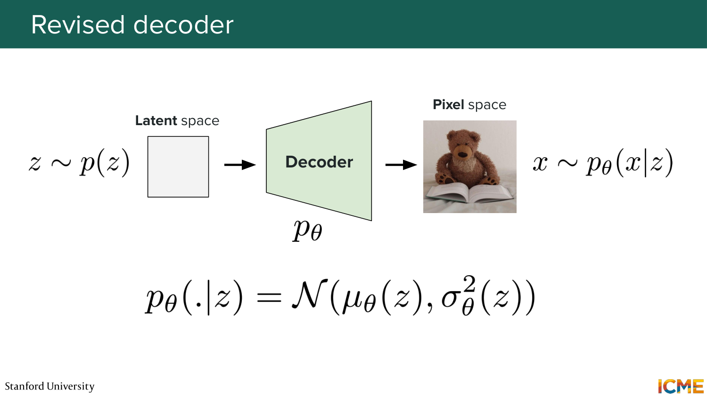

### 幻灯片内容

Revised decoder
Latent space
Decoder
Pixel space

### 通俗解释

这页内容：Revised decoder Latent space Decoder Pixel space...

---

## Slide 33

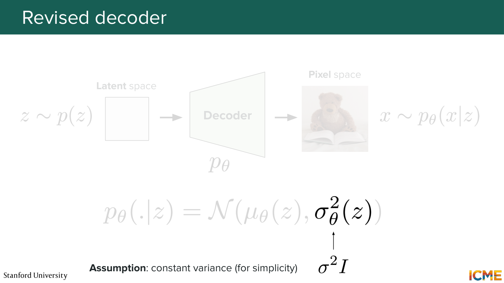

### 幻灯片内容

Revised decoder
Latent space
Decoder
Pixel space
Assumption: constant variance (for simplicity)

### 通俗解释

这页内容：Revised decoder Latent space Decoder Pixel space Assumption: constant variance (...

---

## Slide 34

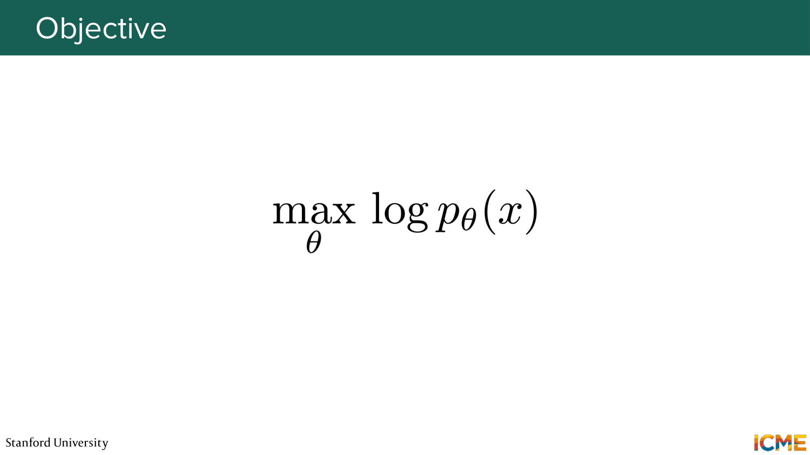

### 通俗解释

过渡页或标题页。

---

## Slide 35

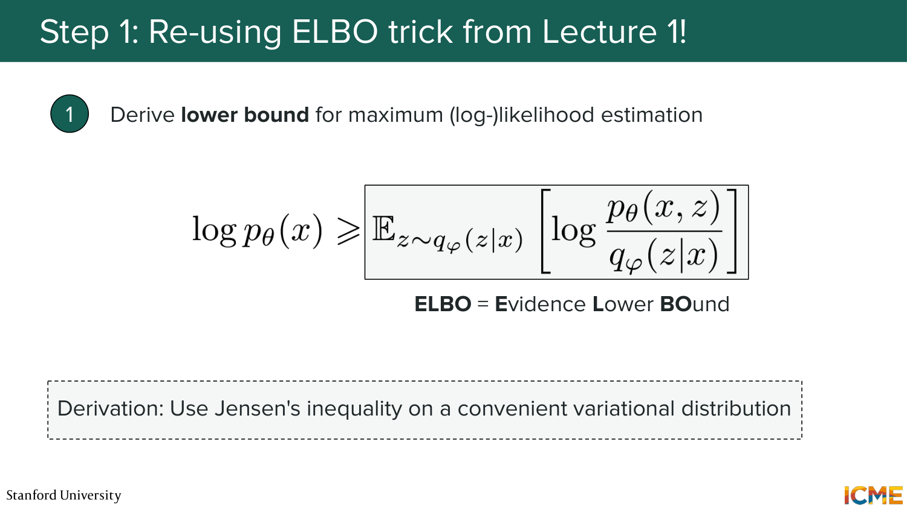

### 幻灯片内容

Step 1: Re-using ELBO trick from Lecture 1!
Derive lower bound for maximum (log-)likelihood estimation
1
ELBO = Evidence Lower BOund
Derivation: Use Jensen's inequality on a convenient variational distribution

### 通俗解释

重用 Lecture 1 的 ELBO 技巧：VAE 训练目标也是 ELBO，由重建项和 KL 正则化项组成。

---

## Slide 36

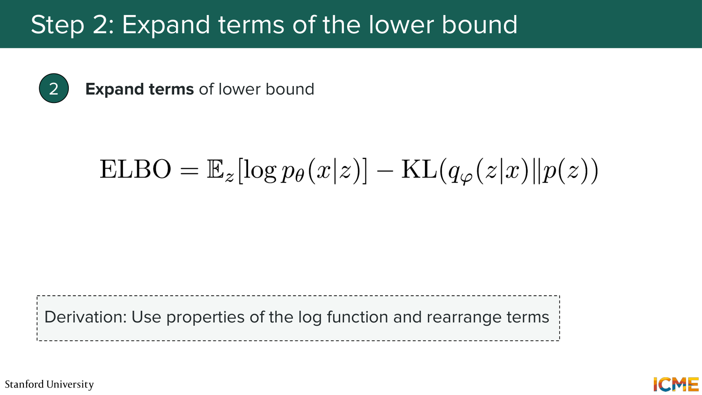

### 幻灯片内容

Step 2: Expand terms of the lower bound
Expand terms of lower bound
2
Derivation: Use properties of the log function and rearrange terms

### 通俗解释

展开下界项：ELBO = E[log p(x|z)] - KL(q(z|x) || p(z))。第一项是重建，第二项是正则化。

---

## Slide 37

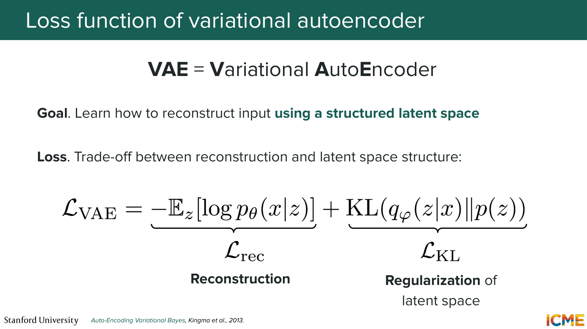

### 幻灯片内容

Loss function of variational autoencoder
Goal. Learn how to reconstruct input using a structured latent space
Loss. Trade-off between reconstruction and latent space structure:
Reconstruction
Regularization of 
latent space
VAE = Variational AutoEncoder
Auto-Encoding Variational Bayes, Kingma et al., 2013.

### 通俗解释

VAE 损失函数：重建损失 + beta * KL 散度。beta 控制两者之间的权衡。

---

## Slide 38

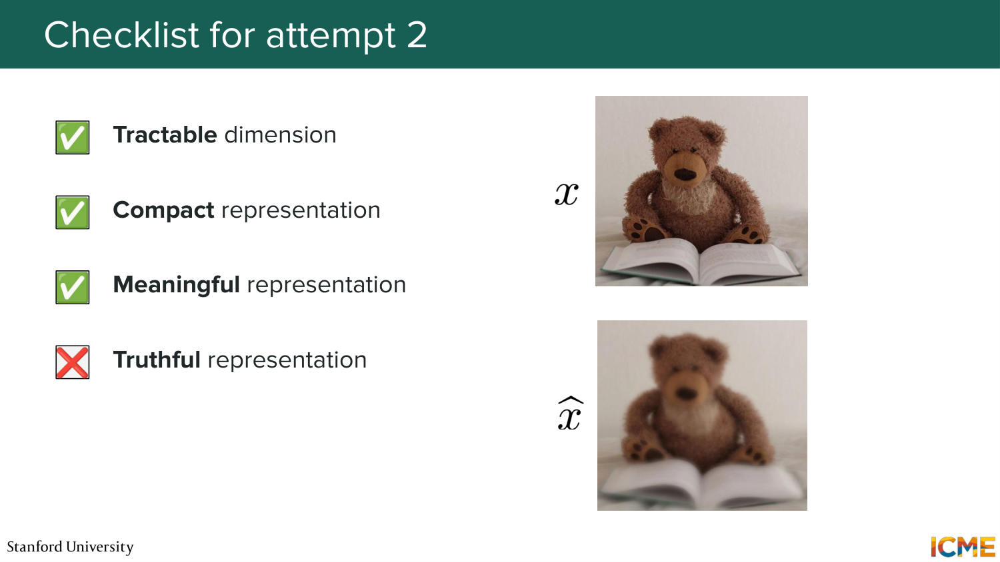

### 幻灯片内容

Checklist for attempt 2
✅
✅
Tractable dimension
Compact representation
✅
Meaningful representation
❌
Truthful representation

### 通俗解释

尝试2检查清单：解决了连续性问题，但仍有模糊问题（blurriness）。

---

## Slide 39

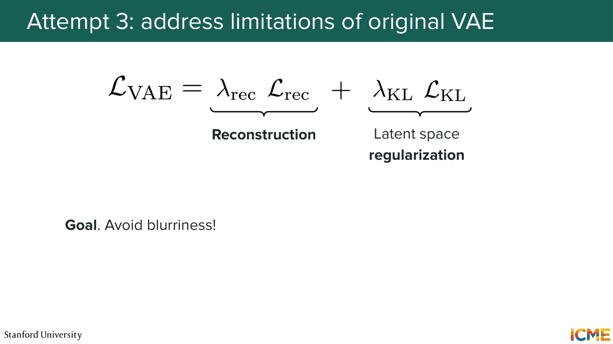

### 幻灯片内容

Attempt 3: address limitations of original VAE
Reconstruction
Latent space 
regularization
Goal. Avoid blurriness!

### 通俗解释

尝试3：解决 VAE 的局限性——使用改进的 VAE（如 LDM 中使用的）。

---

## Slide 40

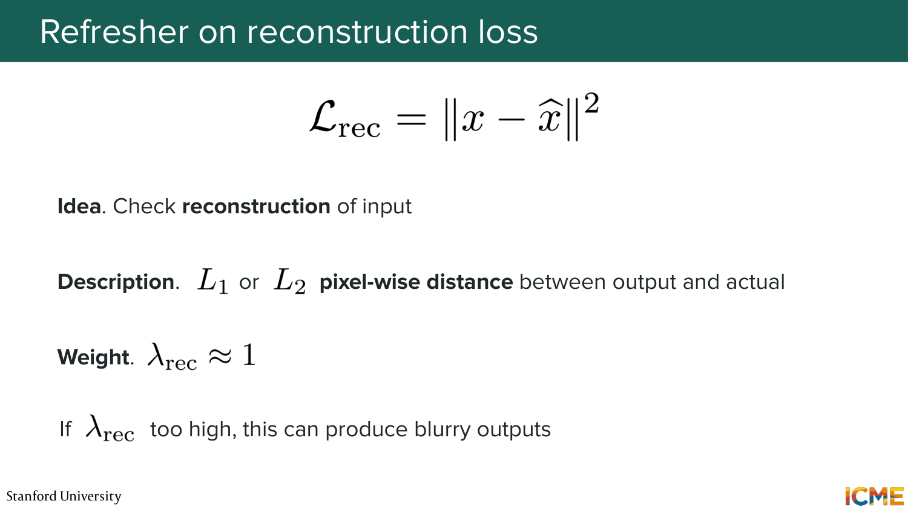

### 幻灯片内容

Refresher on reconstruction loss
Idea. Check reconstruction of input
Description. 
or 
      pixel-wise distance between output and actual
Weight.
If 
too high, this can produce blurry outputs

### 通俗解释

重建损失复习：MSE 倾向产生模糊图像，因为它对所有像素平等对待。

---

## Slide 41

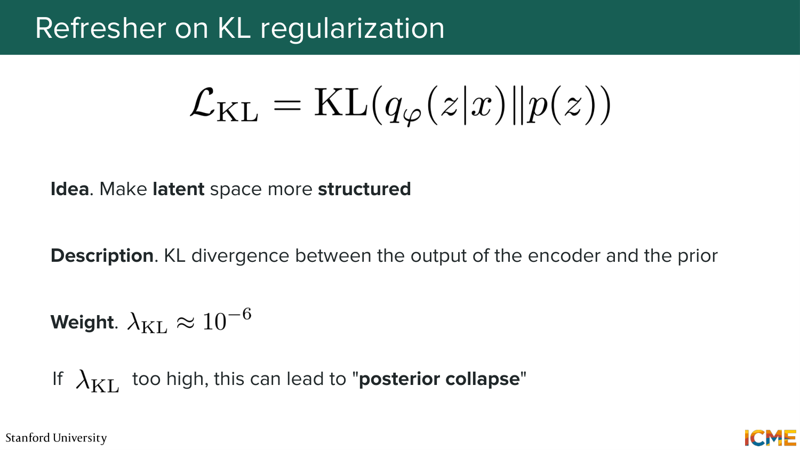

### 幻灯片内容

Refresher on KL regularization
Idea. Make latent space more structured
Description. KL divergence between the output of the encoder and the prior
Weight.
If 
too high, this can lead to "posterior collapse"

### 通俗解释

KL 正则化复习：强制潜变量接近标准正态分布，保证潜空间的连续性。

---

## Slide 42

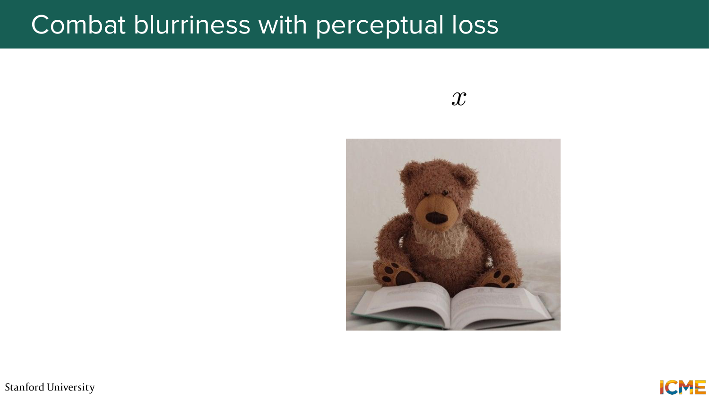

### 幻灯片内容

Combat blurriness with perceptual loss

### 通俗解释

这页内容：Combat blurriness with perceptual loss...

---

## Slide 43

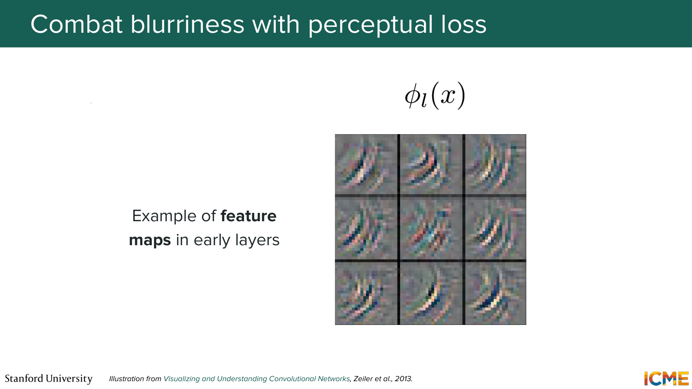

### 幻灯片内容

Combat blurriness with perceptual loss
 Illustration from Visualizing and Understanding Convolutional Networks, Zeiler et al., 2013.
Example of feature 
maps in early layers

### 通俗解释

用感知损失（Perceptual Loss）对抗模糊：不是比较像素，而是比较特征。

---

## Slide 44

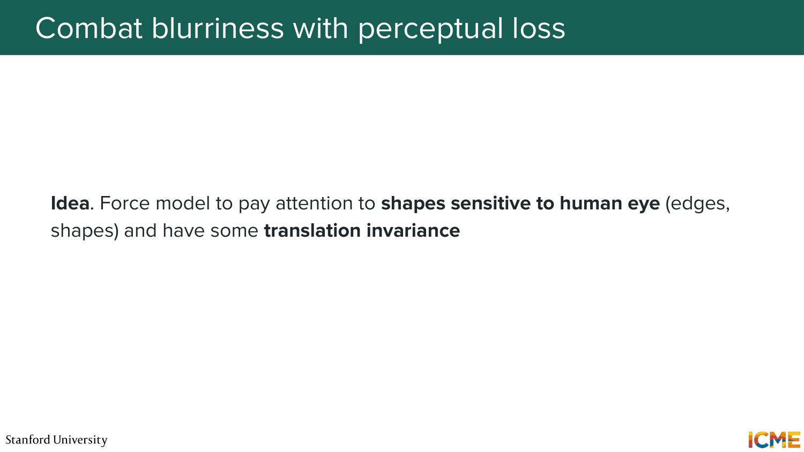

### 幻灯片内容

Combat blurriness with perceptual loss
Idea. Force model to pay attention to shapes sensitive to human eye (edges, 
shapes) and have some translation invariance

### 通俗解释

感知损失：使用预训练的 VGG 网络提取特征，在特征空间计算损失。

---

## Slide 45

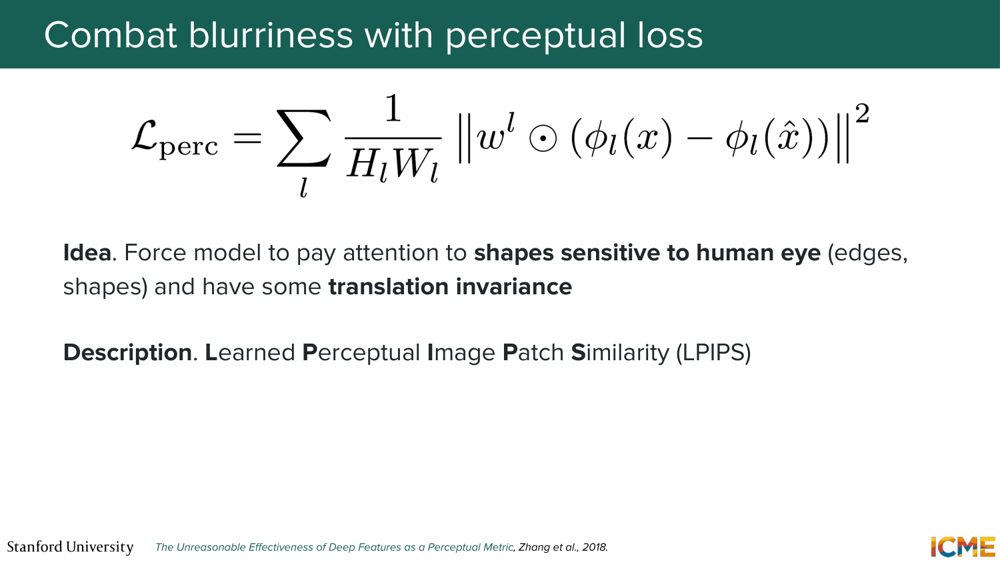

### 幻灯片内容

Combat blurriness with perceptual loss
Idea. Force model to pay attention to shapes sensitive to human eye (edges, 
shapes) and have some translation invariance
Description. Learned Perceptual Image Patch Similarity (LPIPS)
The Unreasonable Effectiveness of Deep Features as a Perceptual Metric, Zhang et al., 2018.

### 通俗解释

感知损失继续：这样更关注语义内容而非像素级差异。

---

## Slide 46

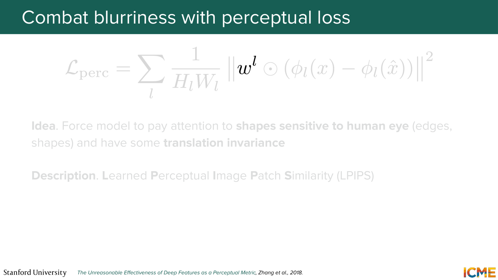

### 幻灯片内容

Combat blurriness with perceptual loss
Idea. Force model to pay attention to shapes sensitive to human eye (edges, 
shapes) and have some translation invariance
Description. Learned Perceptual Image Patch Similarity (LPIPS)
The Unreasonable Effectiveness of Deep Features as a Perceptual Metric, Zhang et al., 2018.

### 通俗解释

感知损失继续：结果更清晰、更自然。

---

## Slide 47

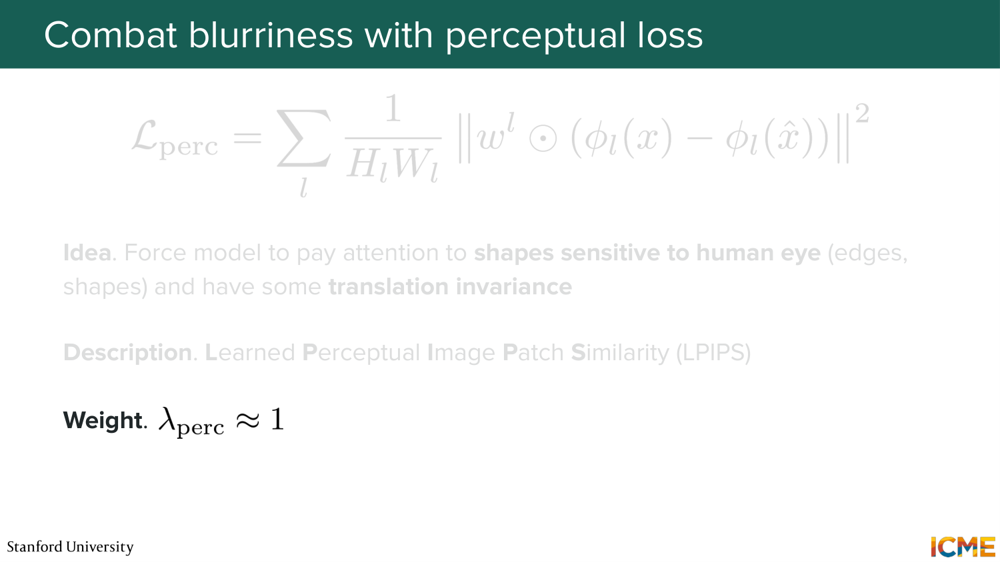

### 幻灯片内容

Combat blurriness with perceptual loss
Idea. Force model to pay attention to shapes sensitive to human eye (edges, 
shapes) and have some translation invariance
Description. Learned Perceptual Image Patch Similarity (LPIPS)
Weight.

### 通俗解释

感知损失总结：比 MSE 更好的重建质量。

---

## Slide 48

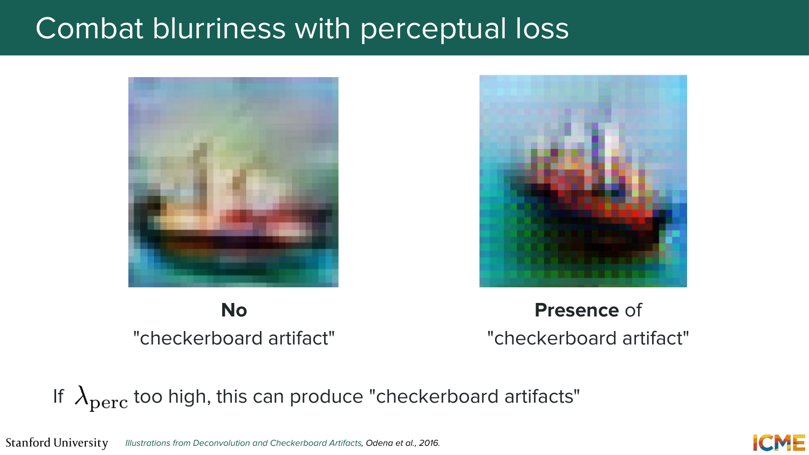

### 幻灯片内容

No
"checkerboard artifact"
Combat blurriness with perceptual loss
If 
too high, this can produce "checkerboard artifacts"
Illustrations from Deconvolution and Checkerboard Artifacts, Odena et al., 2016.
Presence of  
"checkerboard artifact"

### 通俗解释

这页内容：No "checkerboard artifact" Combat blurriness with perceptual loss If  too high, ...

---

## Slide 49

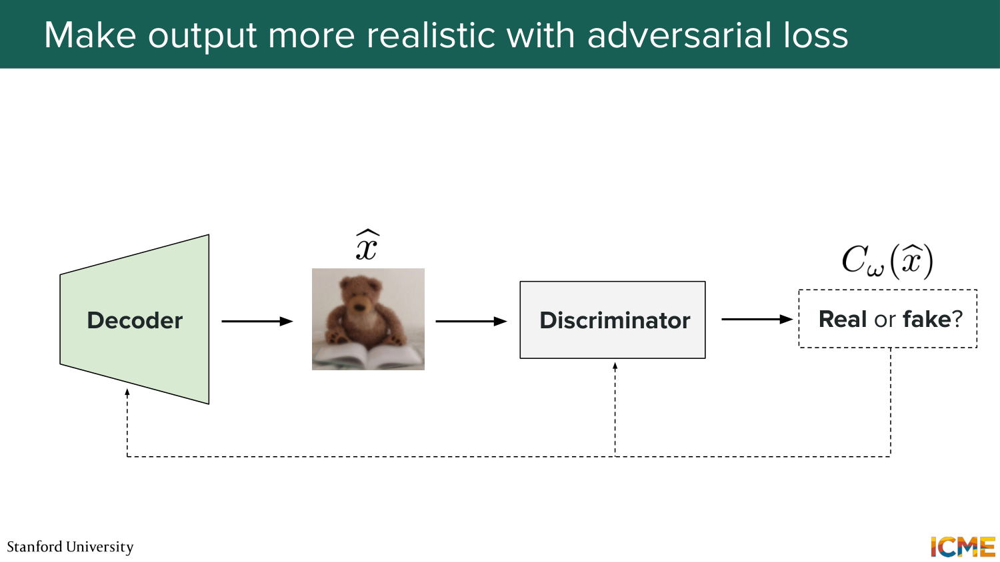

### 幻灯片内容

Make output more realistic with adversarial loss
Decoder
Discriminator
Real or fake?

### 通俗解释

用对抗损失（Adversarial Loss）让输出更真实：引入判别器，让生成器学习产生逼真的图像。

---

## Slide 50

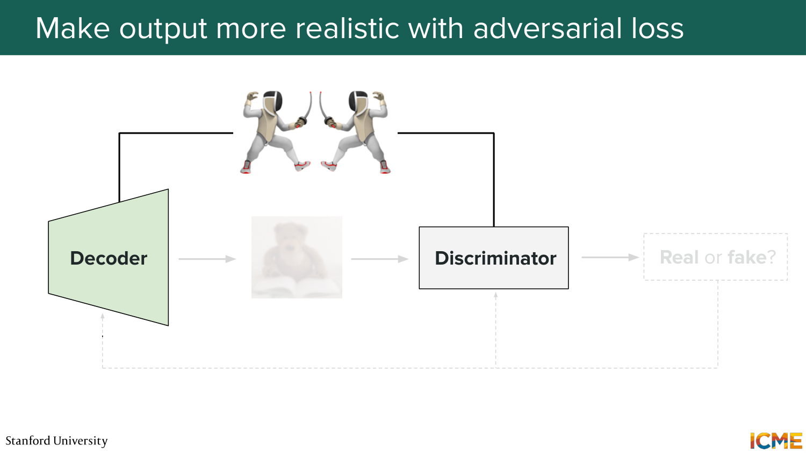

### 幻灯片内容

Make output more realistic with adversarial loss
Decoder
Discriminator
Real or fake?

### 通俗解释

对抗损失：类似 GAN 思想，判别器区分真假，生成器试图骗过判别器。

---

## Slide 51

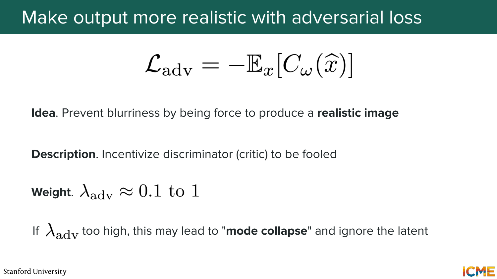

### 幻灯片内容

Make output more realistic with adversarial loss
Idea. Prevent blurriness by being force to produce a realistic image
Description. Incentivize discriminator (critic) to be fooled
Weight.
If 
too high, this may lead to "mode collapse" and ignore the latent

### 通俗解释

对抗损失继续：结合感知损失和对抗损失，得到更好的重建质量。

---

## Slide 52

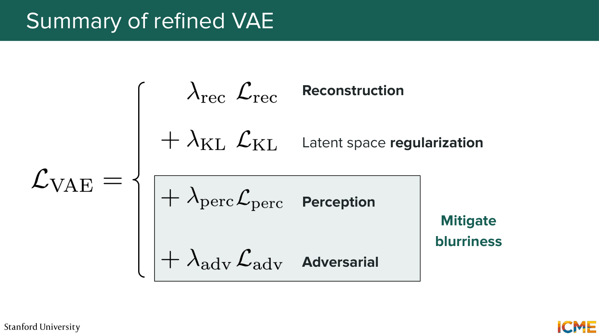

### 幻灯片内容

Summary of refined VAE
Reconstruction
Adversarial
Perception
Mitigate 
blurriness
Latent space regularization

### 通俗解释

改进版 VAE 总结：重建损失 + 感知损失 + 对抗损失 + KL 正则化。这是 Stable Diffusion 使用的 VAE。

---

## Slide 53

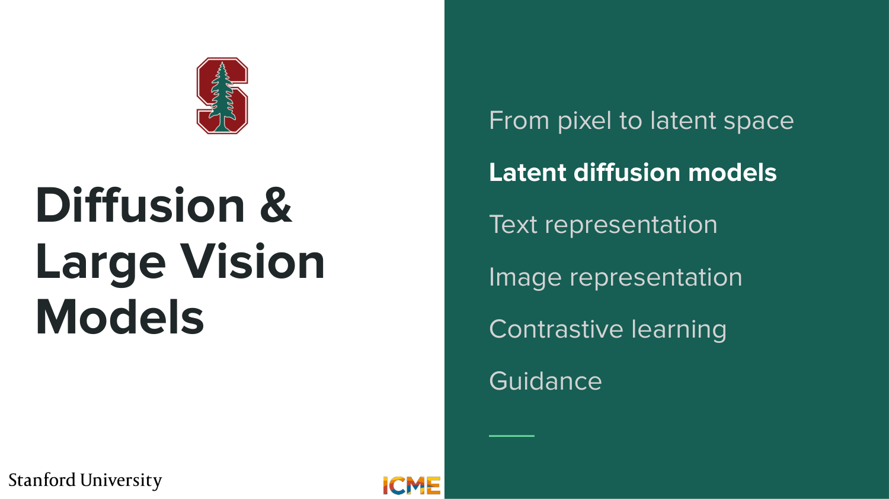

### 幻灯片内容

From pixel to latent space
Latent diffusion models
Text representation
Image representation
Contrastive learning
Guidance
Diffusion & 
Large Vision 
Models

### 通俗解释

从像素到潜空间：现在有了好的编码器-解码器对，可以在潜空间做扩散。

---

## Slide 54

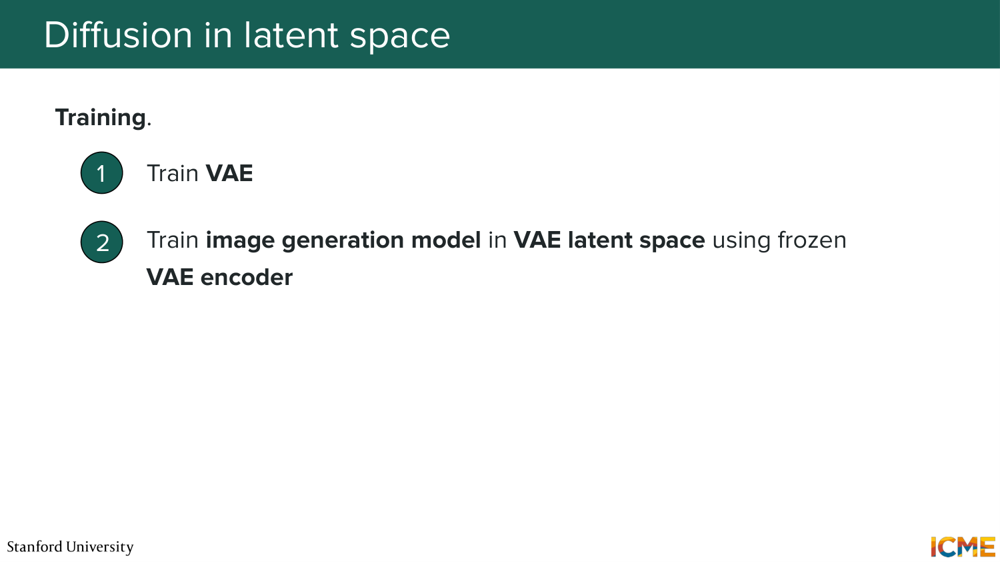

### 幻灯片内容

Diffusion in latent space
Train VAE
Train image generation model in VAE latent space using frozen 
VAE encoder
1
2
Training.

### 通俗解释

潜空间中的扩散：不是对像素 x 做扩散，而是对潜变量 z 做扩散。计算量大幅减少。

---

## Slide 55

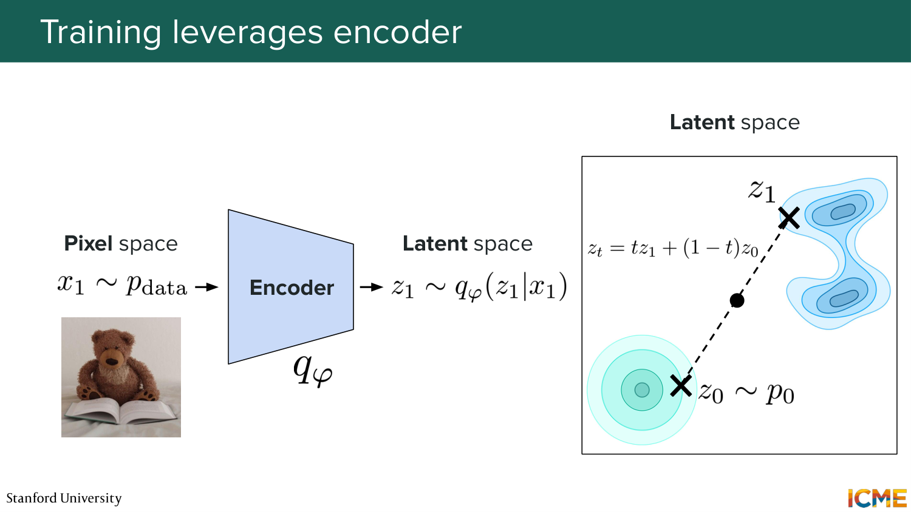

### 幻灯片内容

Training leverages encoder
Pixel space
Encoder
Latent space
Latent space

### 通俗解释

训练利用编码器：先将图像编码为 z，然后在 z 上训练扩散模型。

---

## Slide 56

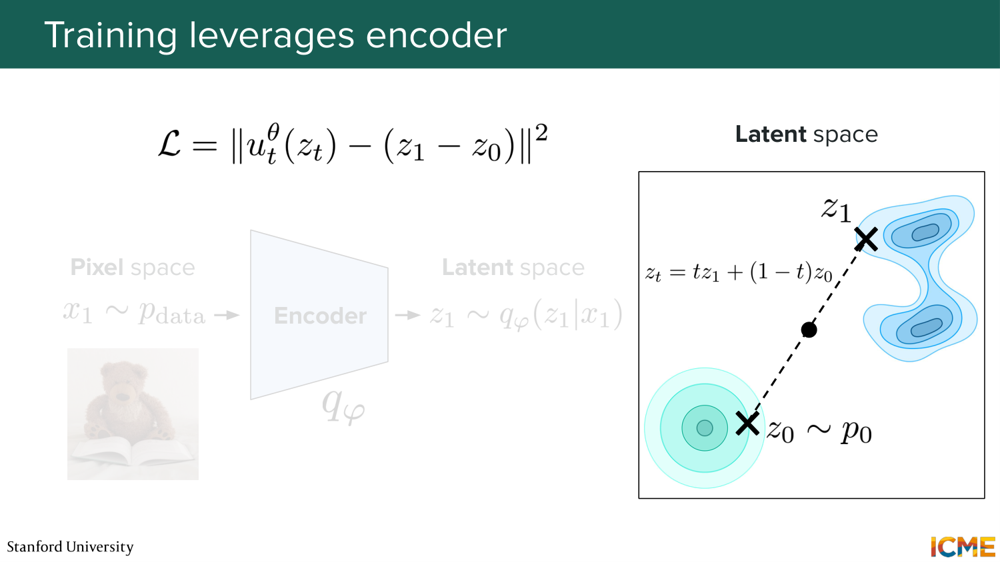

### 幻灯片内容

Training leverages encoder
Pixel space
Encoder
Latent space
Latent space

### 通俗解释

训练继续：扩散模型学习从噪声潜变量去噪到干净潜变量。

---

## Slide 57

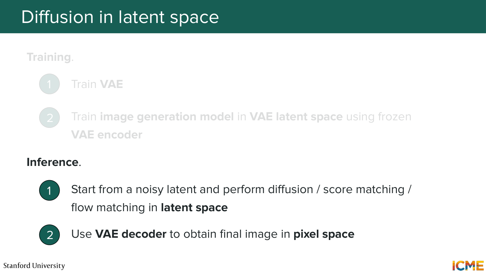

### 幻灯片内容

Diffusion in latent space
Train VAE
Train image generation model in VAE latent space using frozen 
VAE encoder
1
2
Training.
Start from a noisy latent and perform diffusion / score matching / 
flow matching in latent space
1
Inference.
Use VAE decoder to obtain final image in pixel space
2

### 通俗解释

潜空间扩散：与像素空间扩散数学形式相同，但维度更低。

---

## Slide 58

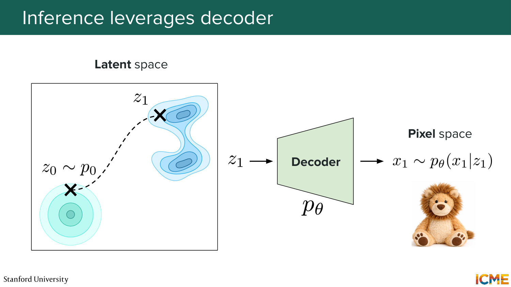

### 幻灯片内容

Inference leverages decoder
Latent space
Decoder
Pixel space

### 通俗解释

推理利用解码器：生成潜变量后，用解码器转换为像素图像。

---

## Slide 59

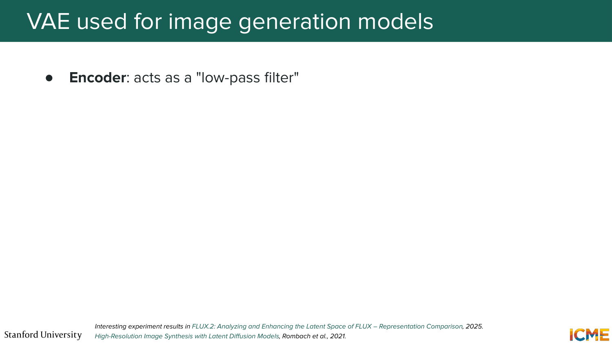

### 幻灯片内容

VAE used for image generation models
High-Resolution Image Synthesis with Latent Diffusion Models, Rombach et al., 2021.
●
Encoder: acts as a "low-pass filter"
Interesting experiment results in FLUX.2: Analyzing and Enhancing the Latent Space of FLUX – Representation Comparison, 2025.

### 通俗解释

VAE 在图像生成模型中的应用：Stable Diffusion 使用的就是这个架构。

---

## Slide 60

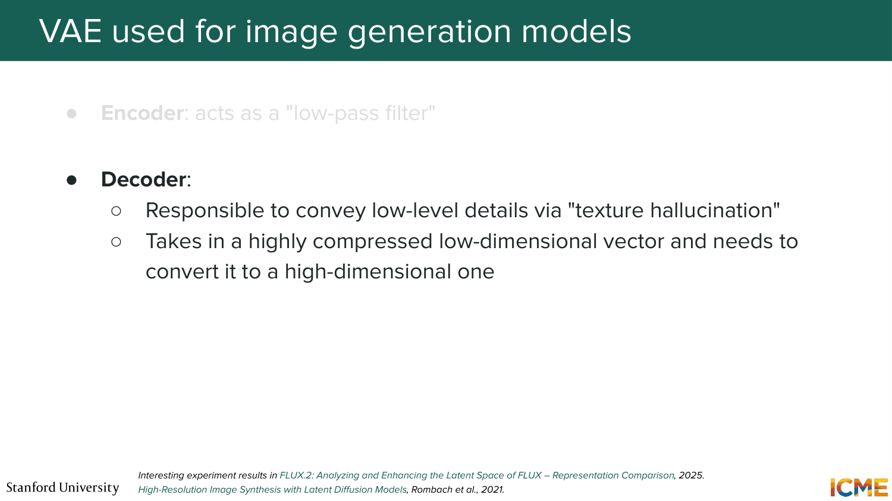

### 幻灯片内容

VAE used for image generation models
High-Resolution Image Synthesis with Latent Diffusion Models, Rombach et al., 2021.
●
Encoder: acts as a "low-pass filter"
●
Decoder: 
○
Responsible to convey low-level details via "texture hallucination"
○
Takes in a highly compressed low-dimensional vector and needs to 
convert it to a high-dimensional one
Interesting experiment results in FLUX.2: Analyzing and Enhancing the Latent Space of FLUX – Representation Comparison, 2025.

### 通俗解释

VAE 应用继续：LAION 数据集上训练的 VAE 可以高质量地编码和解码图像。

---

## Slide 61

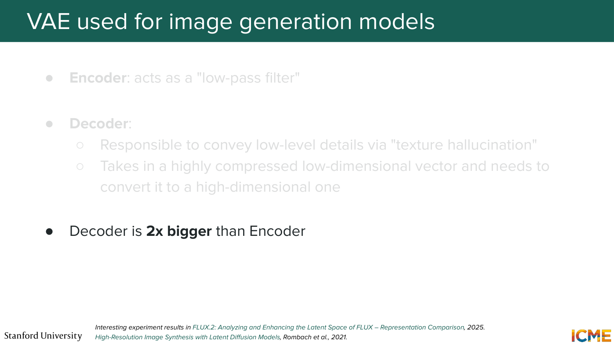

### 幻灯片内容

VAE used for image generation models
●
Decoder is 2x bigger than Encoder
High-Resolution Image Synthesis with Latent Diffusion Models, Rombach et al., 2021.
●
Encoder: acts as a "low-pass filter"
●
Decoder: 
○
Responsible to convey low-level details via "texture hallucination"
○
Takes in a highly compressed low-dimensional vector and needs to 
convert it to a high-dimensional one
Interesting experiment results in FLUX.2: Analyzing and Enhancing the Latent Space of FLUX – Representation Comparison, 2025.

### 通俗解释

这页内容：VAE used for image generation models ● Decoder is 2x bigger than Encoder High-Re...

---

## Slide 62

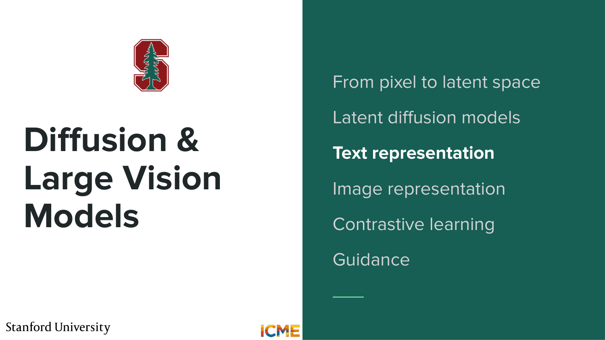

### 幻灯片内容

From pixel to latent space
Latent diffusion models
Text representation
Image representation
Contrastive learning
Guidance
Diffusion & 
Large Vision 
Models

### 通俗解释

从像素到潜空间总结：潜空间扩散比像素空间高效得多——维度大幅降低。

---

## Slide 63

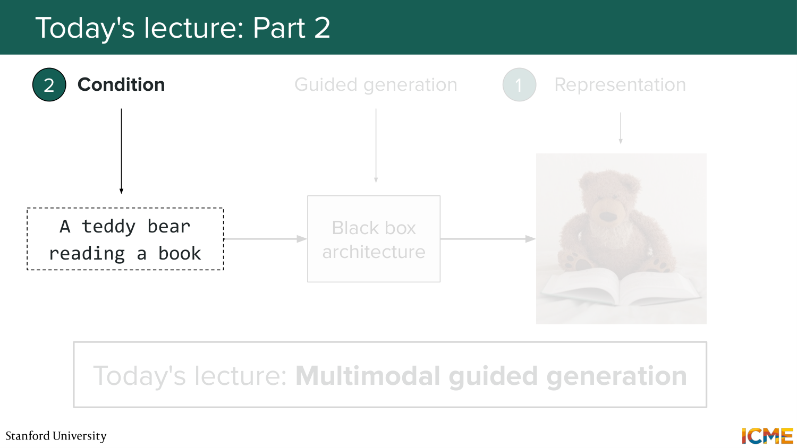

### 幻灯片内容

Today's lecture: Part 2
A teddy bear 
reading a book
Condition
Black box 
architecture
Today's lecture: Multimodal guided generation
Representation
1
2
Guided generation

### 通俗解释

这页内容：Today's lecture: Part 2 A teddy bear  reading a book Condition Black box  archit...

---

## Slide 64

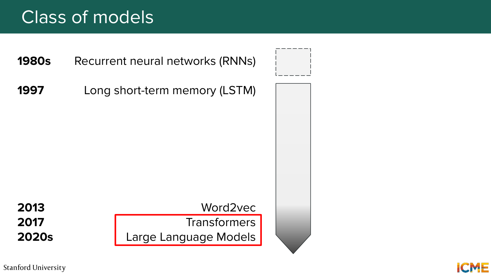

### 幻灯片内容

Class of models
Recurrent neural networks (RNNs)
Long short-term memory (LSTM)
Word2vec
Transformers
Large Language Models
1980s
1997
2013
2017
2020s

### 通俗解释

这页内容：Class of models Recurrent neural networks (RNNs) Long short-term memory (LSTM) W...

---

## Slide 65

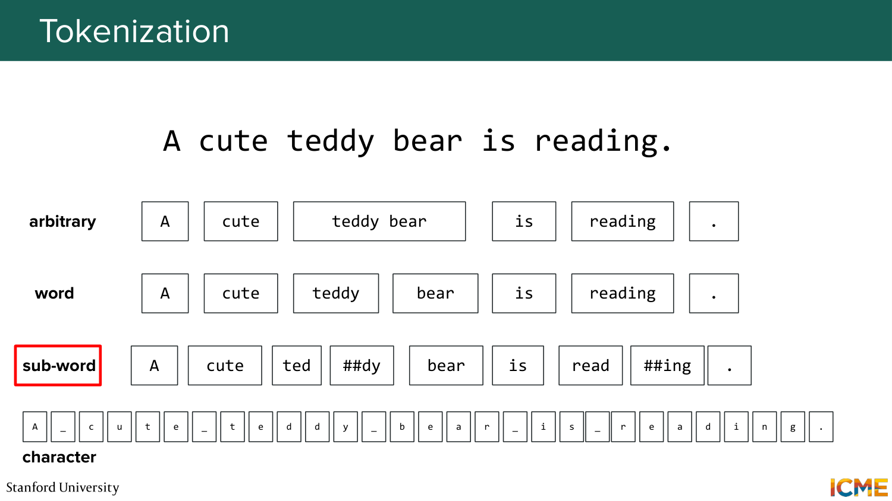

### 幻灯片内容

Tokenization
A cute teddy bear is reading.
A
cute
teddy bear
is
reading
.
A
cute
teddy
is
reading
.
bear
A
c
u
t
e
t
e
d
d
y
b
e
a
r
i
s
r
e
a
d
i
n
g
.
_
_
_
_
_
A
cute
ted
is
read
.
bear
##dy
##ing
sub-word
word
arbitrary
character

### 通俗解释

这页内容：Tokenization A cute teddy bear is reading. A cute teddy bear is reading . A cute...

---

## Slide 66

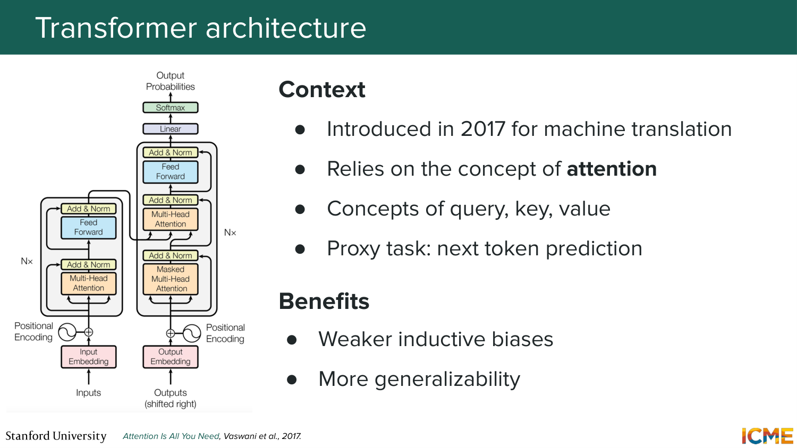

### 幻灯片内容

Transformer architecture
Attention Is All You Need, Vaswani et al., 2017.
●
Introduced in 2017 for machine translation
●
Relies on the concept of attention
●
Concepts of query, key, value
●
Proxy task: next token prediction
●
Weaker inductive biases
●
More generalizability
Context
Benefits

### 通俗解释

这页内容：Transformer architecture Attention Is All You Need, Vaswani et al., 2017. ● Intr...

---

## Slide 67

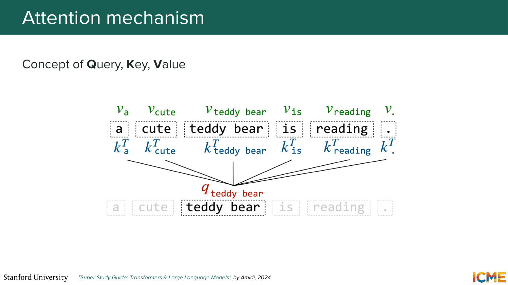

### 幻灯片内容

Attention mechanism 
Concept of Query, Key, Value
"Super Study Guide: Transformers & Large Language Models", by Amidi, 2024.

### 通俗解释

这页内容：Attention mechanism  Concept of Query, Key, Value "Super Study Guide: Transforme...

---

## Slide 68

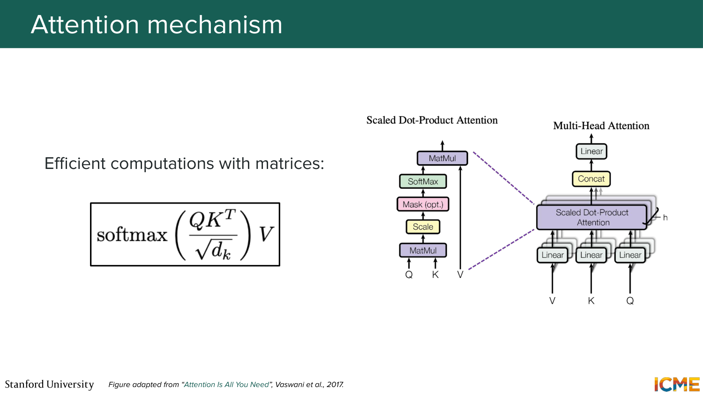

### 幻灯片内容

Attention mechanism
Efficient computations with matrices:
Figure adapted from “Attention Is All You Need”, Vaswani et al., 2017.

### 通俗解释

这页内容：Attention mechanism Efficient computations with matrices: Figure adapted from “Att...

---

## Slide 69

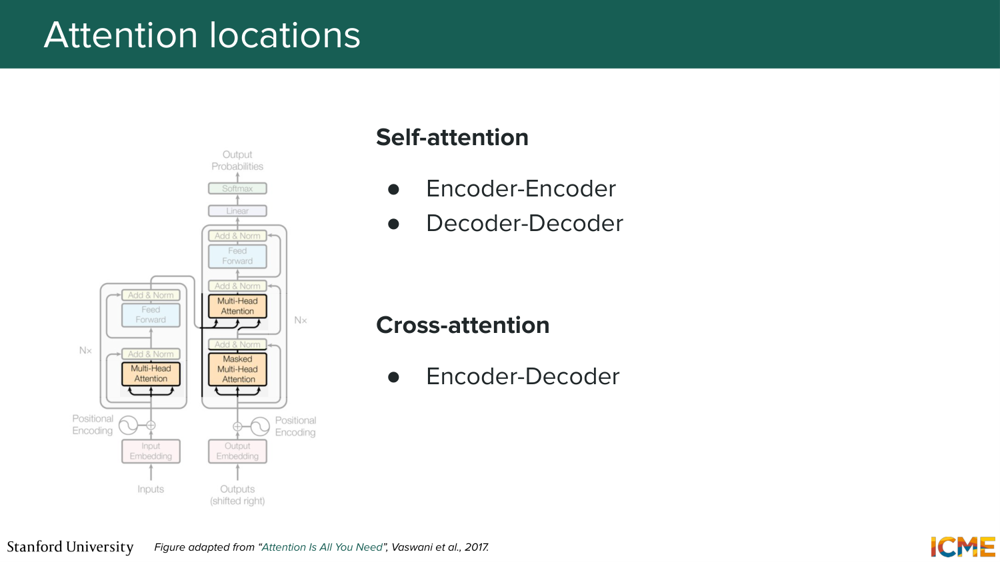

### 幻灯片内容

Attention locations
Self-attention
●
Encoder-Encoder
●
Decoder-Decoder
Cross-attention
●
Encoder-Decoder
Figure adapted from “Attention Is All You Need”, Vaswani et al., 2017.

### 通俗解释

这页内容：Attention locations Self-attention ● Encoder-Encoder ● Decoder-Decoder Cross-att...

---

## Slide 70

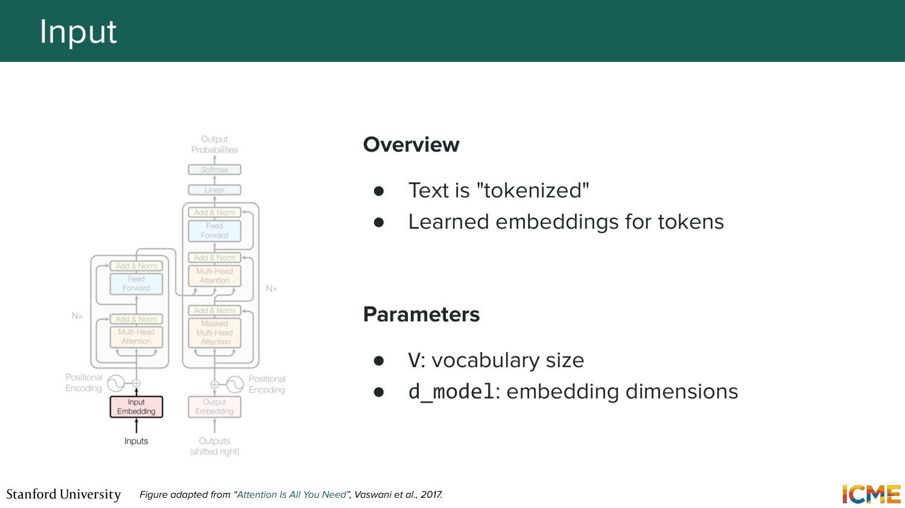

### 幻灯片内容

Input
Overview
●
Text is "tokenized"
●
Learned embeddings for tokens
Parameters
●
V: vocabulary size
●
d_model: embedding dimensions
Figure adapted from “Attention Is All You Need”, Vaswani et al., 2017.

### 通俗解释

输入：文本描述经过编码器转为向量，然后与噪声图像一起输入模型。

---

## Slide 71

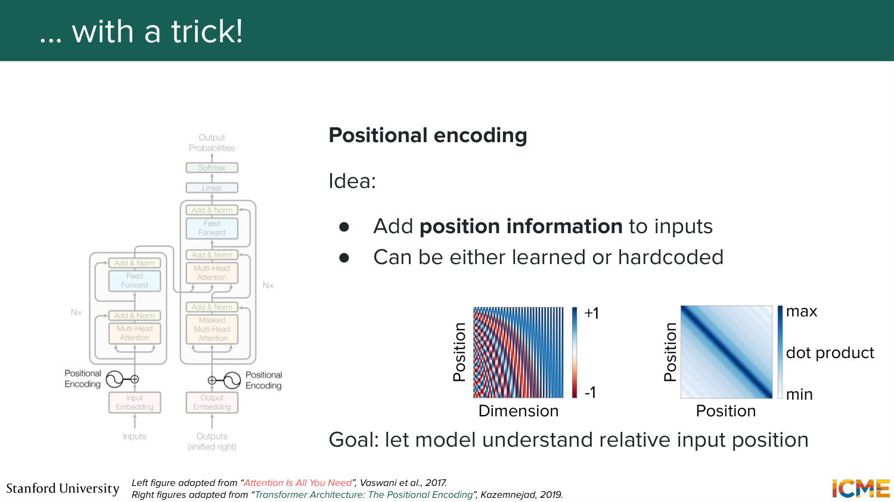

### 幻灯片内容

... with a trick!
Positional encoding
Idea:
●
Add position information to inputs
●
Can be either learned or hardcoded
Goal: let model understand relative input position
Left figure adapted from “Attention Is All You Need”, Vaswani et al., 2017.
Right figures adapted from “Transformer Architecture: The Positional Encoding”, Kazemnejad, 2019.
+1
-1
Dimension
Position
Position
Position
max
dot product
min

### 通俗解释

这页内容：... with a trick! Positional encoding Idea: ● Add position information to inputs...

---

## Slide 72

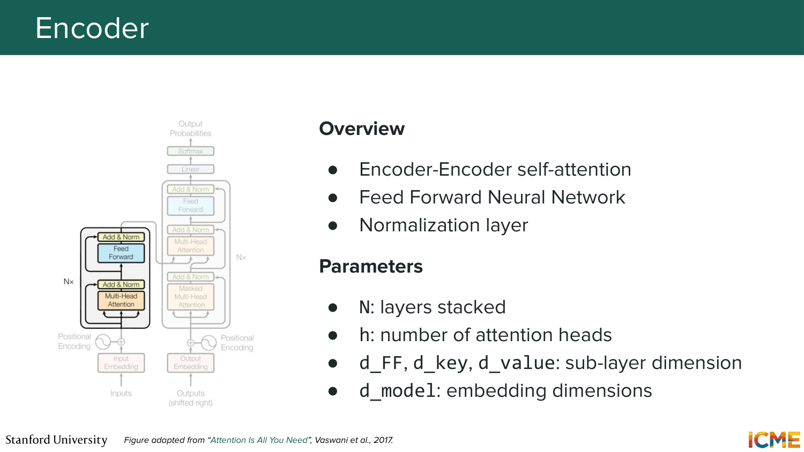

### 幻灯片内容

Encoder
Overview
●
Encoder-Encoder self-attention
●
Feed Forward Neural Network
●
Normalization layer
Parameters
●
N: layers stacked
●
h: number of attention heads
●
d_FF, d_key, d_value: sub-layer dimension 
●
d_model: embedding dimensions
Figure adapted from “Attention Is All You Need”, Vaswani et al., 2017.

### 通俗解释

这页内容：Encoder Overview ● Encoder-Encoder self-attention ● Feed Forward Neural Network ...

---

## Slide 73

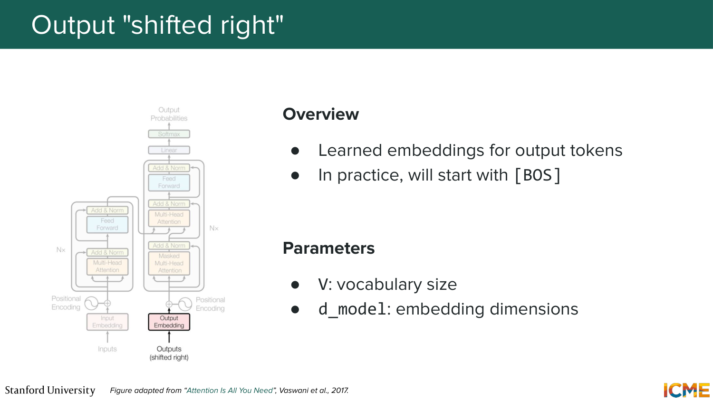

### 幻灯片内容

Output "shifted right"
Overview
●
Learned embeddings for output tokens
●
In practice, will start with [BOS]
Parameters
●
V: vocabulary size
●
d_model: embedding dimensions
Figure adapted from “Attention Is All You Need”, Vaswani et al., 2017.

### 通俗解释

Cross-attention：文本作为 key/value，图像特征作为 query，让图像关注相关文本。

---

## Slide 74

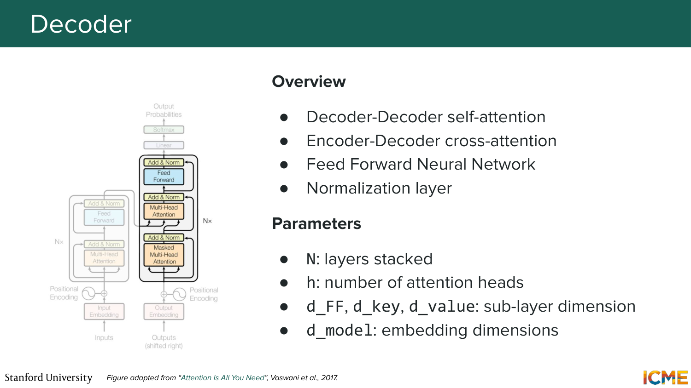

### 幻灯片内容

Decoder
Overview
●
Decoder-Decoder self-attention
●
Encoder-Decoder cross-attention
●
Feed Forward Neural Network
●
Normalization layer
Parameters
●
N: layers stacked
●
h: number of attention heads
●
d_FF, d_key, d_value: sub-layer dimension 
●
d_model: embedding dimensions
Figure adapted from “Attention Is All You Need”, Vaswani et al., 2017.

### 通俗解释

Cross-attention 继续：这是 Stable Diffusion 中使用的主要方式。

---

## Slide 75

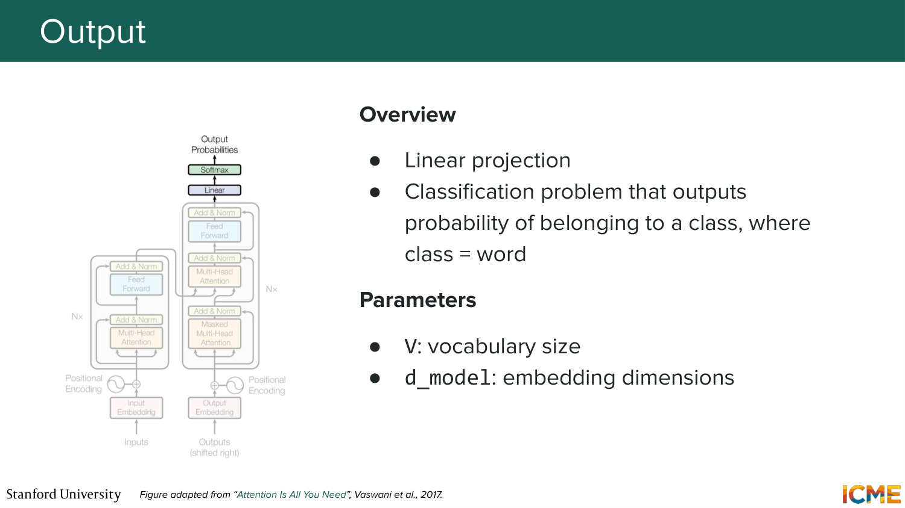

### 幻灯片内容

Output
Overview
●
Linear projection
●
Classification problem that outputs 
probability of belonging to a class, where 
class = word
Parameters
●
V: vocabulary size
●
d_model: embedding dimensions
Figure adapted from “Attention Is All You Need”, Vaswani et al., 2017.

### 通俗解释

这页内容：Output Overview ● Linear projection ● Classification problem that outputs  probab...

---

## Slide 76

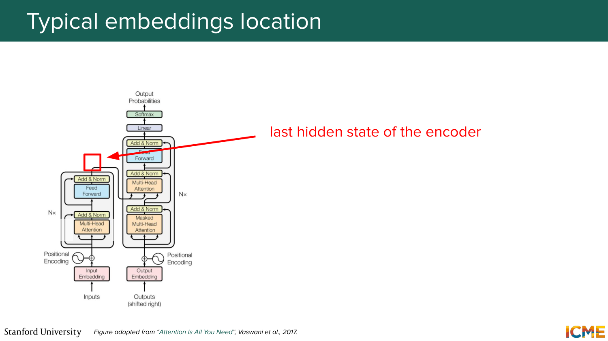

### 幻灯片内容

Typical embeddings location
Figure adapted from “Attention Is All You Need”, Vaswani et al., 2017.
last hidden state of the encoder

### 通俗解释

这页内容：Typical embeddings location Figure adapted from “Attention Is All You Need”, Vas...

---

## Slide 77

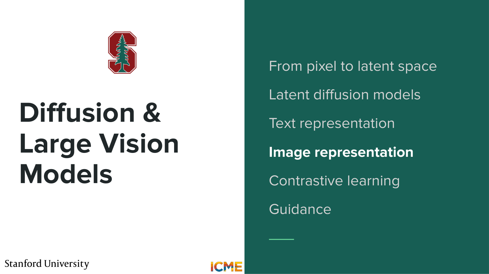

### 幻灯片内容

From pixel to latent space
Latent diffusion models
Text representation
Image representation
Contrastive learning
Guidance
Diffusion & 
Large Vision 
Models

### 通俗解释

从像素到潜空间总结：编码器压缩图像，扩散模型在潜空间操作，解码器恢复图像。

---

## Slide 78

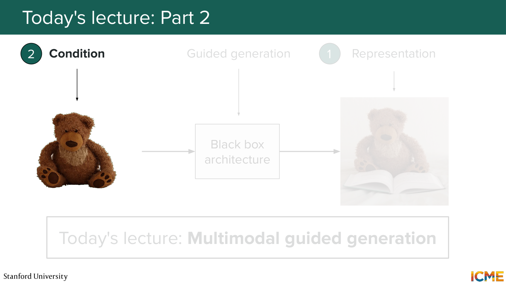

### 幻灯片内容

Today's lecture: Part 2
Condition
Black box 
architecture
Today's lecture: Multimodal guided generation
Representation
1
2
Guided generation

### 通俗解释

这页内容：Today's lecture: Part 2 Condition Black box  architecture Today's lecture: Multi...

---

## Slide 79

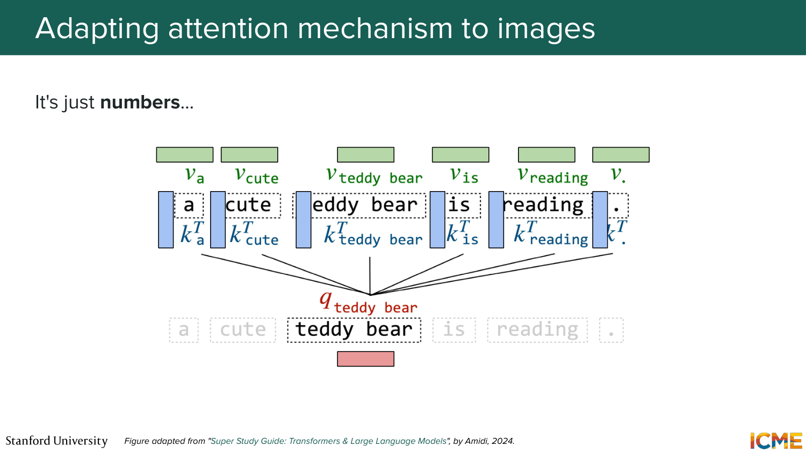

### 幻灯片内容

Adapting attention mechanism to images
It's just numbers...
Figure adapted from "Super Study Guide: Transformers & Large Language Models", by Amidi, 2024.

### 通俗解释

这页内容：Adapting attention mechanism to images It's just numbers... Figure adapted from ...

---

## Slide 80

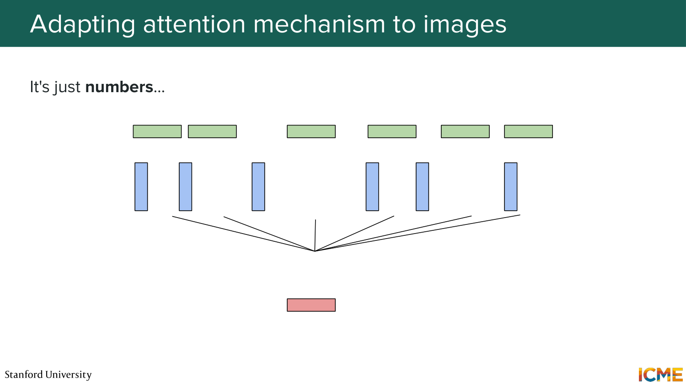

### 幻灯片内容

Adapting attention mechanism to images
It's just numbers...

### 通俗解释

这页内容：Adapting attention mechanism to images It's just numbers......

---

## Slide 81

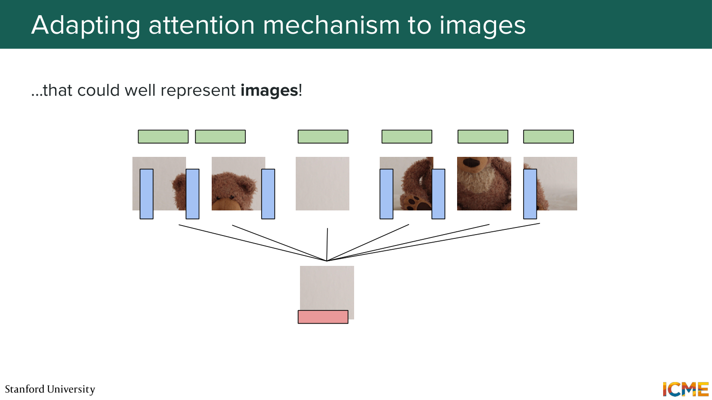

### 幻灯片内容

Adapting attention mechanism to images
...that could well represent images!

### 通俗解释

这页内容：Adapting attention mechanism to images ...that could well represent images!...

---

## Slide 82

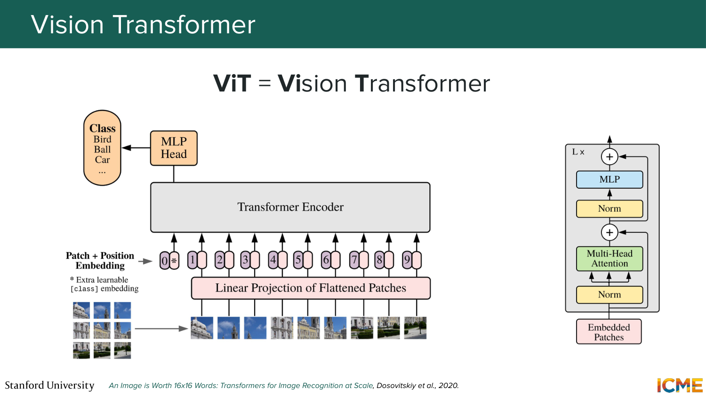

### 幻灯片内容

Vision Transformer
An Image is Worth 16x16 Words: Transformers for Image Recognition at Scale, Dosovitskiy et al., 2020.
ViT = Vision Transformer

### 通俗解释

这页内容：Vision Transformer An Image is Worth 16x16 Words: Transformers for Image Recogni...

---

## Slide 83

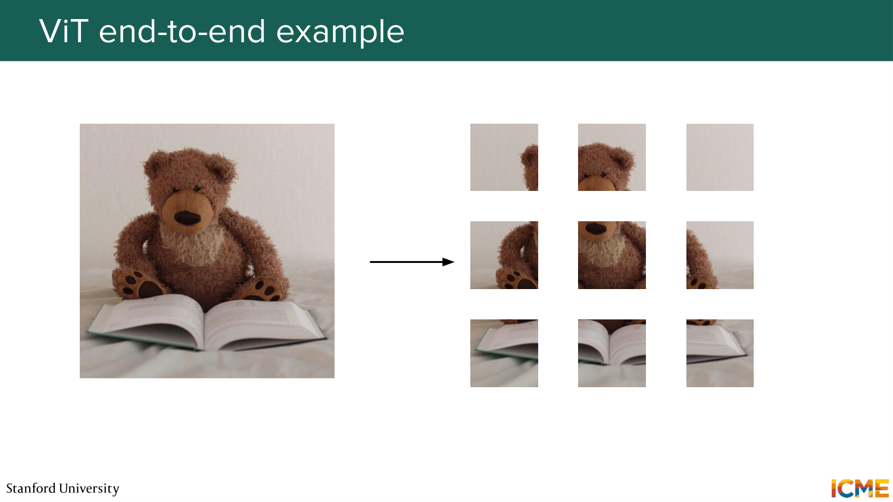

### 通俗解释

图像-文本对齐：关键思想是让图像和文本在同一个 embedding 空间中对齐。

---

## Slide 84

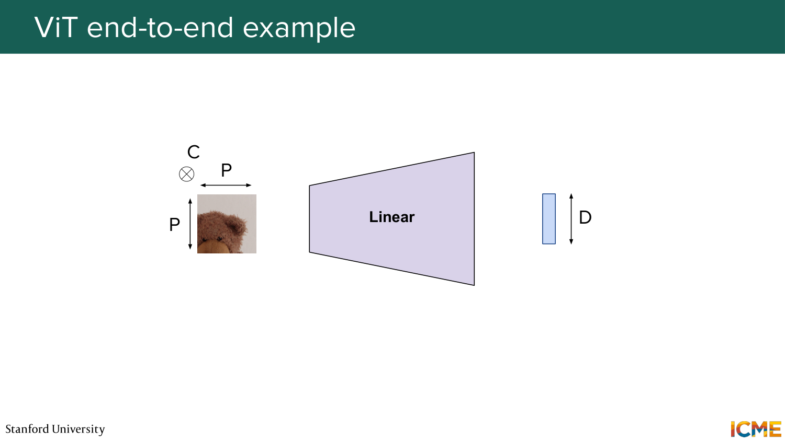

### 幻灯片内容

ViT end-to-end example
P
P
C
Linear
D

### 通俗解释

对齐方法：对比学习（Contrastive Learning）——拉近匹配的图像-文本对，推远不匹配的。

---

## Slide 85

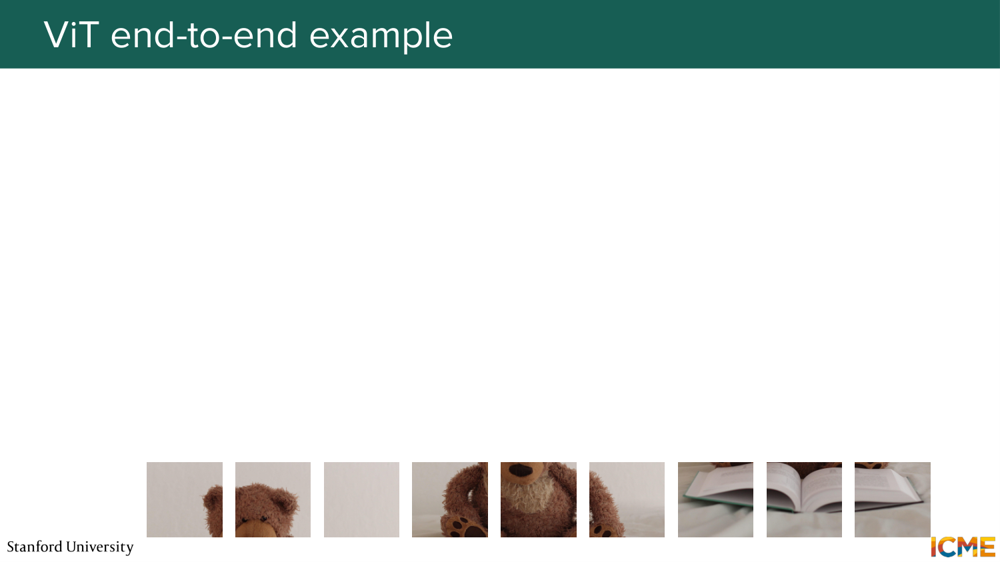

### 通俗解释

对比学习继续：这是 CLIP 的核心训练方法。

---

## Slide 86

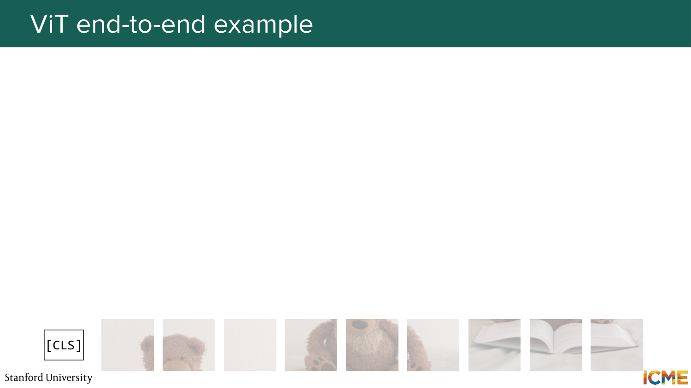

### 通俗解释

过渡页或标题页。

---

## Slide 87

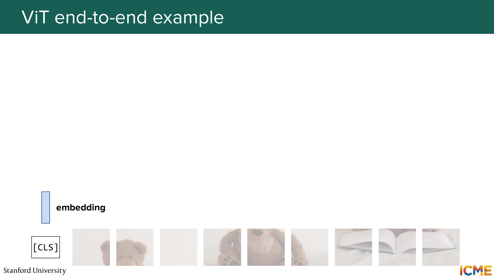

### 幻灯片内容

[CLS]
embedding
ViT end-to-end example

### 通俗解释

这页内容：[CLS] embedding ViT end-to-end example...

---

## Slide 88

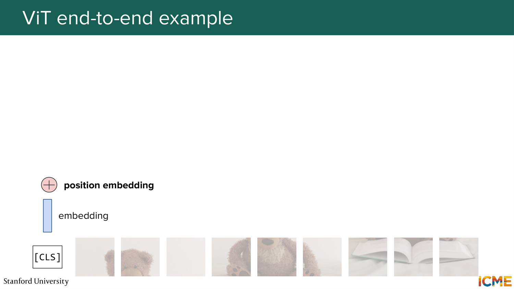

### 幻灯片内容

[CLS]
embedding
position embedding
ViT end-to-end example

### 通俗解释

这页内容：[CLS] embedding position embedding ViT end-to-end example...

---

## Slide 89

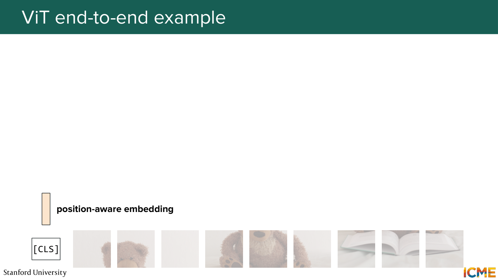

### 幻灯片内容

[CLS]
position-aware embedding
ViT end-to-end example

### 通俗解释

CLIP 介绍：Contrastive Language-Image Pre-training，OpenAI 2021 年提出。

---

## Slide 90

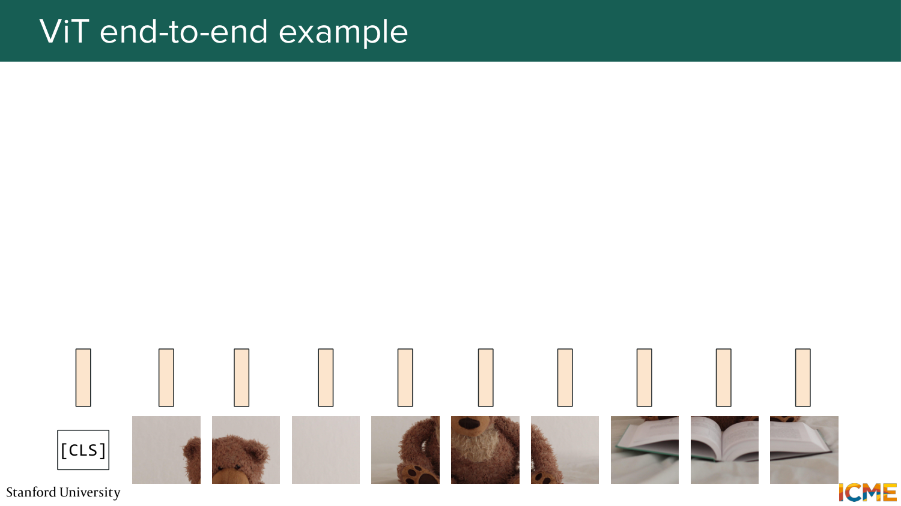

### 通俗解释

CLIP 架构：图像编码器（ViT 或 ResNet）+ 文本编码器（Transformer）。

---

## Slide 91

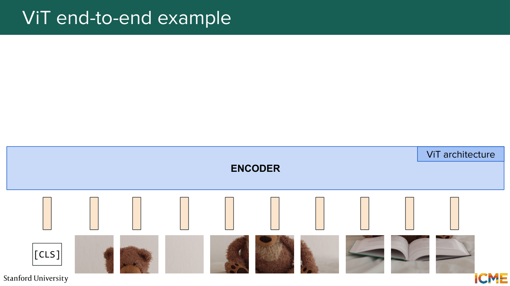

### 幻灯片内容

[CLS]
ENCODER
ViT architecture
ViT end-to-end example

### 通俗解释

CLIP 训练：在 4 亿图像-文本对上训练，使用对比损失。

---

## Slide 92

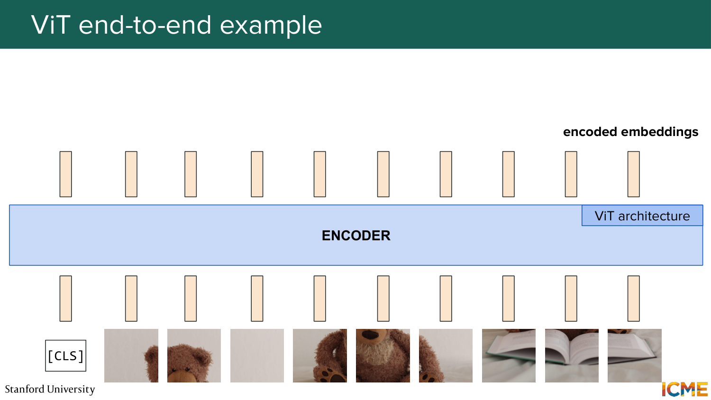

### 幻灯片内容

[CLS]
ENCODER
ViT architecture
encoded embeddings
ViT end-to-end example

### 通俗解释

CLIP 能力：零样本图像分类、图文检索、文生图的条件编码。

---

## Slide 93

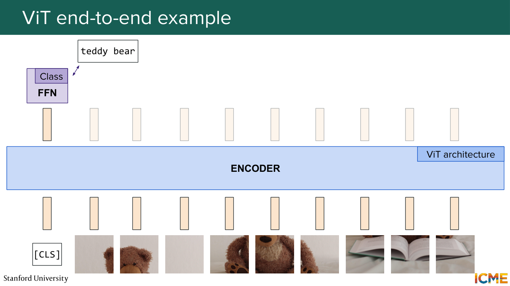

### 幻灯片内容

[CLS]
ENCODER
ViT architecture
FFN
Class
teddy bear
ViT end-to-end example

### 通俗解释

CLIP 在扩散模型中的应用：提供文本条件的 embedding，指导生成过程。

---

## Slide 94

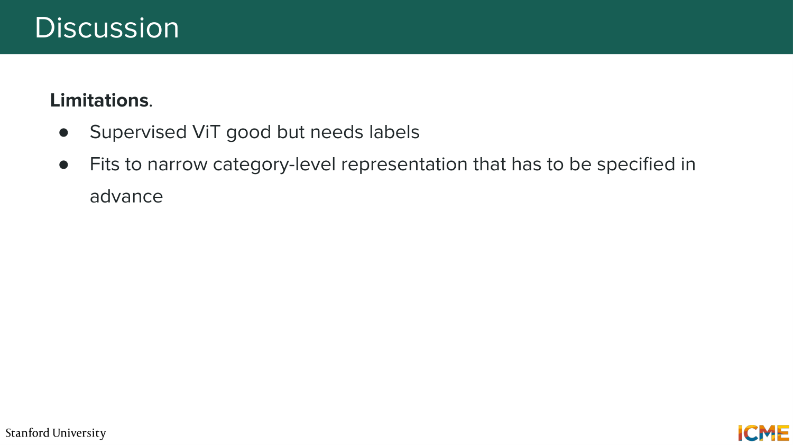

### 幻灯片内容

Discussion
Limitations.
●
Supervised ViT good but needs labels
●
Fits to narrow category-level representation that has to be specified in 
advance

### 通俗解释

这页内容：Discussion Limitations. ● Supervised ViT good but needs labels ● Fits to narrow ...

---

## Slide 95

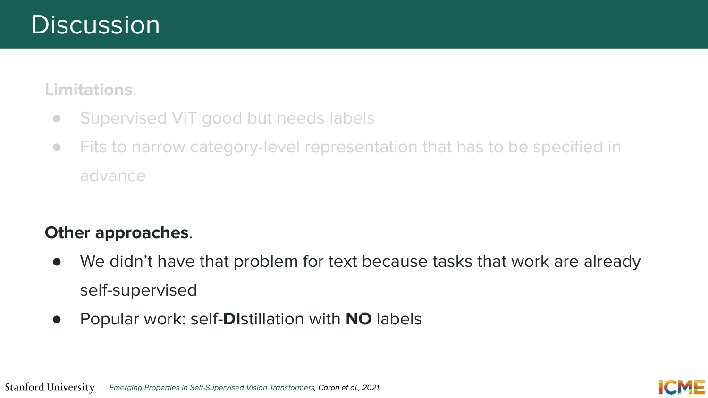

### 幻灯片内容

Discussion
Limitations.
●
Supervised ViT good but needs labels
●
Fits to narrow category-level representation that has to be specified in 
advance
Other approaches.
●
We didn’t have that problem for text because tasks that work are already 
self-supervised
●
Popular work: self-DIstillation with NO labels
Emerging Properties in Self-Supervised Vision Transformers, Caron et al., 2021.

### 通俗解释

讨论：CLIP 的训练需要大量计算资源，但效果显著。

---

## Slide 96

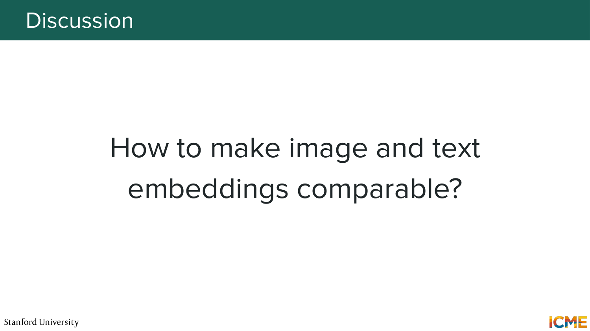

### 幻灯片内容

Discussion
How to make image and text 
embeddings comparable?

### 通俗解释

这页内容：Discussion How to make image and text  embeddings comparable?...

---

## Slide 97

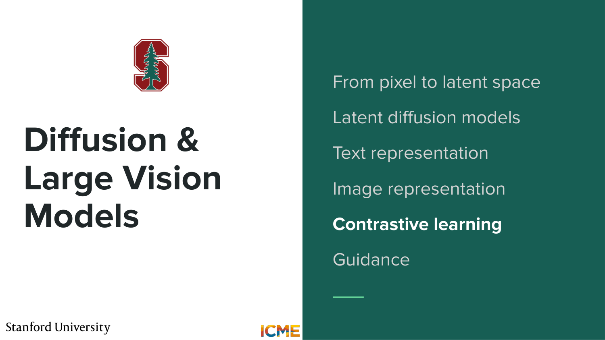

### 幻灯片内容

From pixel to latent space
Latent diffusion models
Text representation
Image representation
Contrastive learning
Guidance
Diffusion & 
Large Vision 
Models

### 通俗解释

这页内容：From pixel to latent space Latent diffusion models Text representation Image repr...

---

## Slide 98

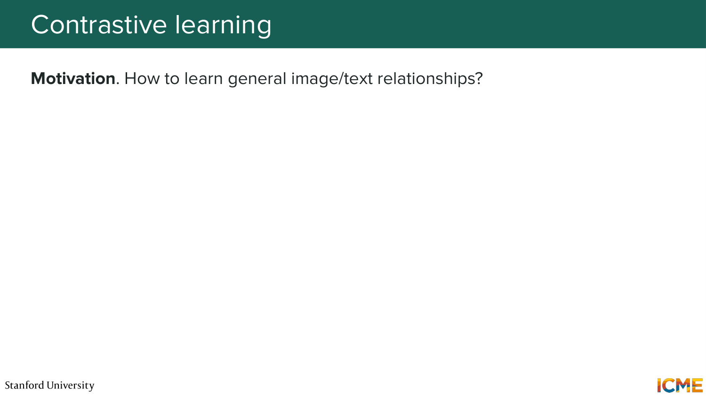

### 幻灯片内容

Contrastive learning
Motivation. How to learn general image/text relationships?

### 通俗解释

这页内容：Contrastive learning Motivation. How to learn general image/text relationships?...

---

## Slide 99

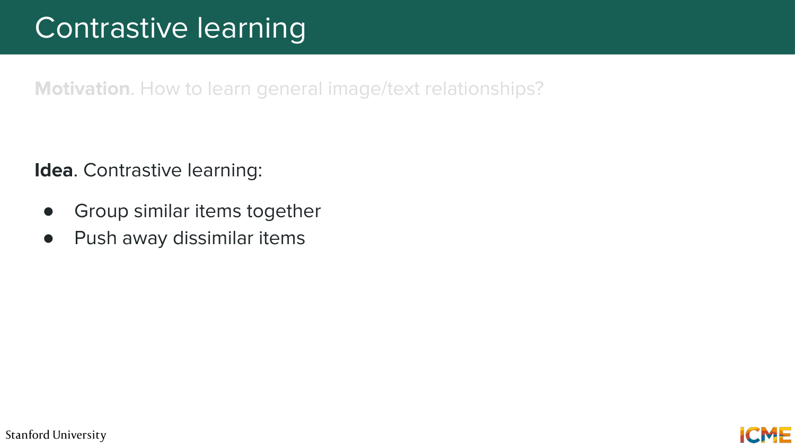

### 幻灯片内容

Contrastive learning
Motivation. How to learn general image/text relationships?
Idea. Contrastive learning:
●
Group similar items together
●
Push away dissimilar items

### 通俗解释

这页内容：Contrastive learning Motivation. How to learn general image/text relationships? ...

---

## Slide 100

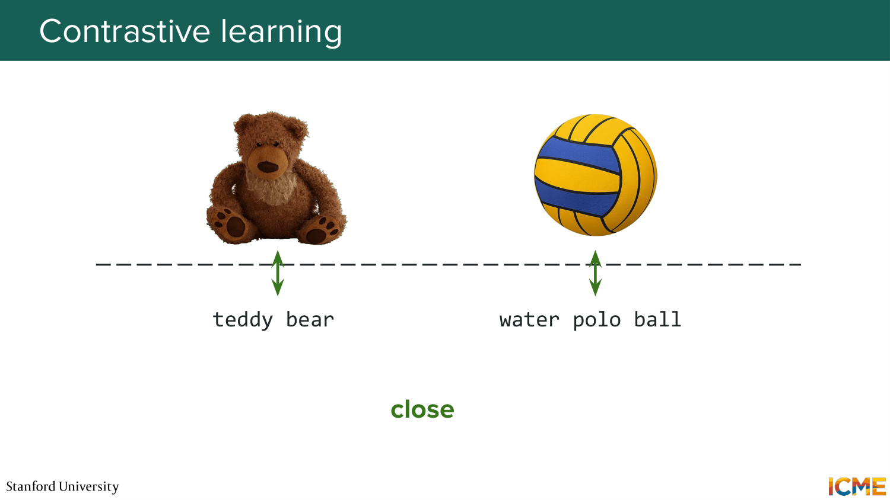

### 幻灯片内容

Contrastive learning
teddy bear
water polo ball
close

### 通俗解释

这页内容：Contrastive learning teddy bear water polo ball close...

---

## Slide 101

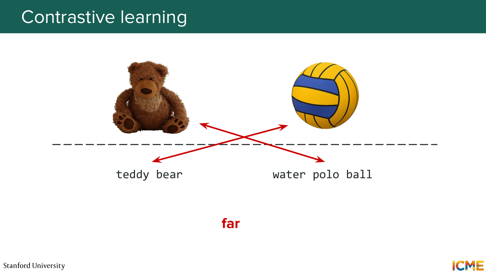

### 幻灯片内容

Contrastive learning
teddy bear
water polo ball
far

### 通俗解释

这页内容：Contrastive learning teddy bear water polo ball far...

---

## Slide 102

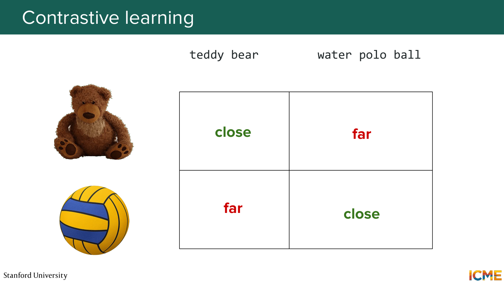

### 幻灯片内容

Contrastive learning
teddy bear
water polo ball
far
far
close
close

### 通俗解释

这页内容：Contrastive learning teddy bear water polo ball far far close close...

---

## Slide 103

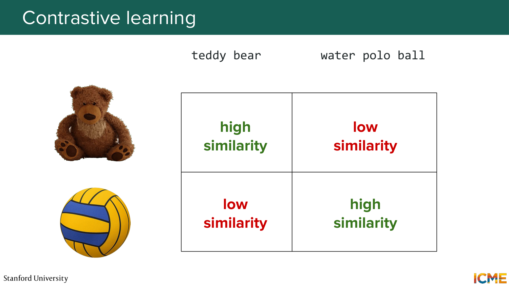

### 幻灯片内容

Contrastive learning
low
similarity
high 
similarity
high 
similarity
low
similarity
teddy bear
water polo ball

### 通俗解释

这页内容：Contrastive learning low similarity high  similarity high  similarity low simila...

---

## Slide 104

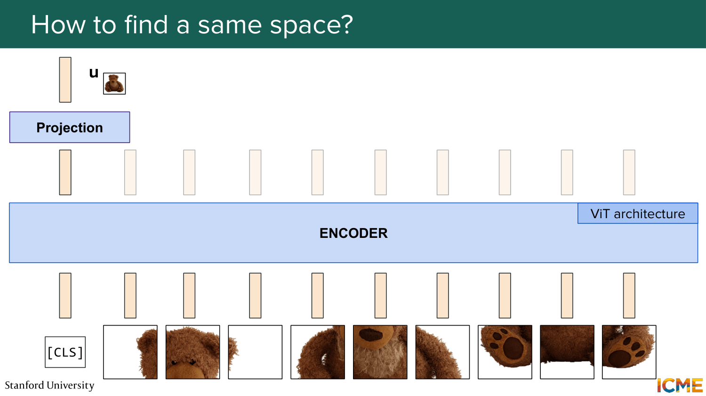

### 幻灯片内容

How to find a same space?
ENCODER
ViT architecture
[CLS]
Projection
u

### 通俗解释

这页内容：How to find a same space? ENCODER ViT architecture [CLS] Projection u...

---

## Slide 105

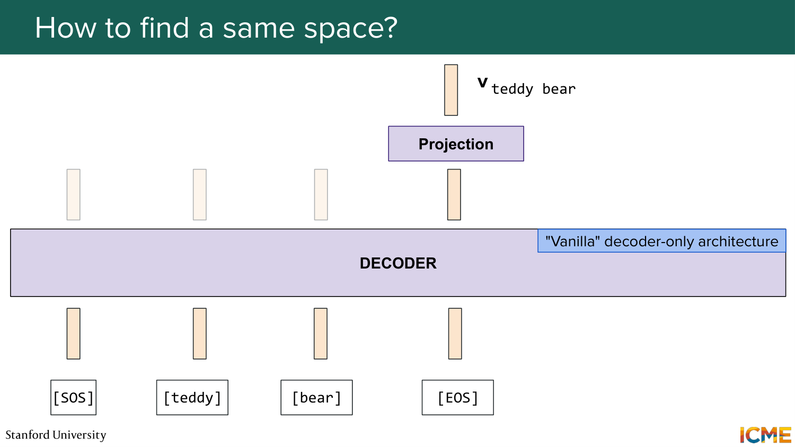

### 幻灯片内容

How to find a same space?
DECODER
"Vanilla" decoder-only architecture
[SOS]
[teddy]
[bear]
[EOS]
Projection
v teddy bear

### 通俗解释

这页内容：How to find a same space? DECODER "Vanilla" decoder-only architecture [SOS] [tedd...

---

## Slide 106

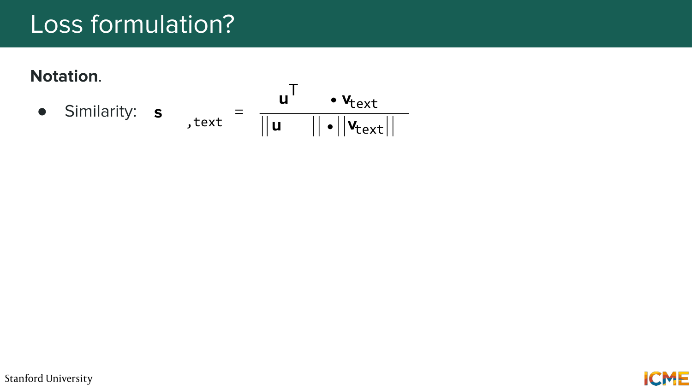

### 幻灯片内容

Notation.
●
Similarity:
Loss formulation?
s �� 
,text
uT
�� text
v
u �� 
text
v
=

### 通俗解释

Classifier Guidance：训练一个单独的分类器，在采样时用分类器的梯度引导去噪方向。

---

## Slide 107

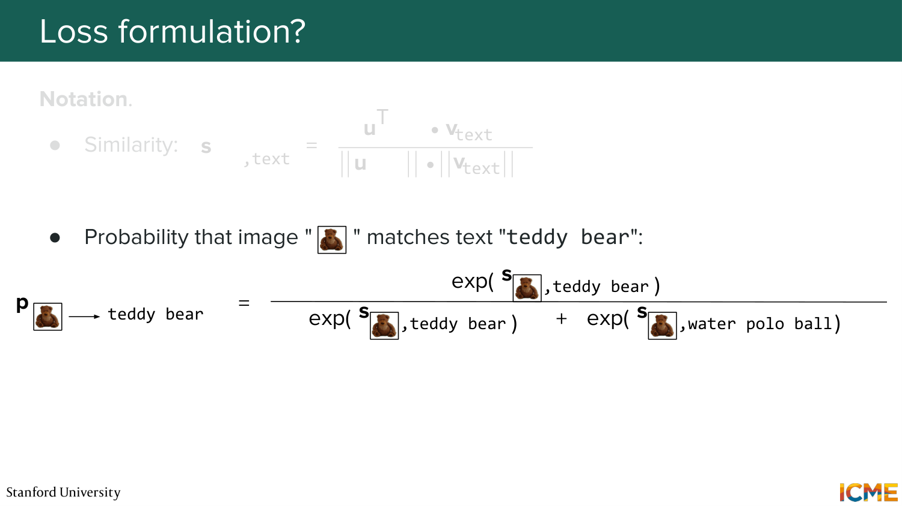

### 幻灯片内容

Notation.
●
Similarity:
●
Probability that image "       " matches text "teddy bear": 
Loss formulation?
s �� 
,text
uT
�� text
v
u �� 
text
v
p
teddy bear
=
=
exp( s
,teddy bear )
+
exp( s
,teddy bear )
exp( s
,water polo ball)

### 通俗解释

Classifier Guidance 原理：分类器给出图像属于某类的概率，梯度指向增加该概率的方向。

---

## Slide 108

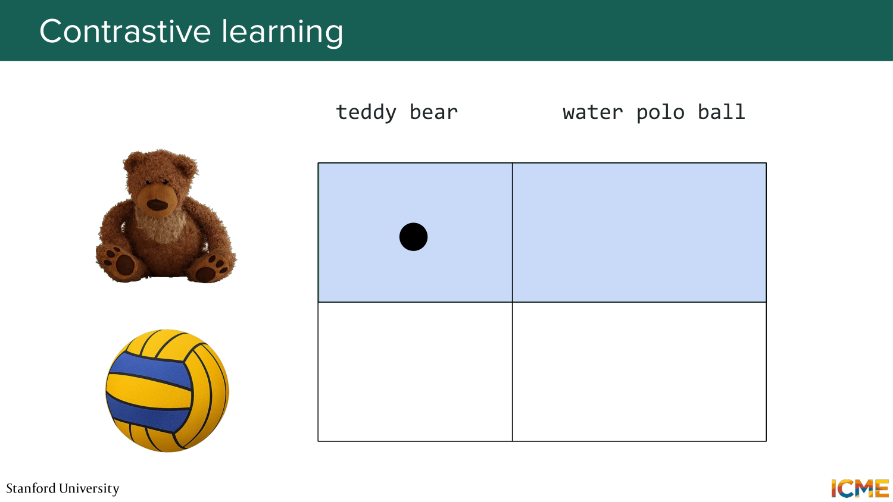

### 幻灯片内容

Contrastive learning
teddy bear
water polo ball

### 通俗解释

Classifier Guidance 公式：在去噪步骤中添加分类器梯度的缩放项。

---

## Slide 109

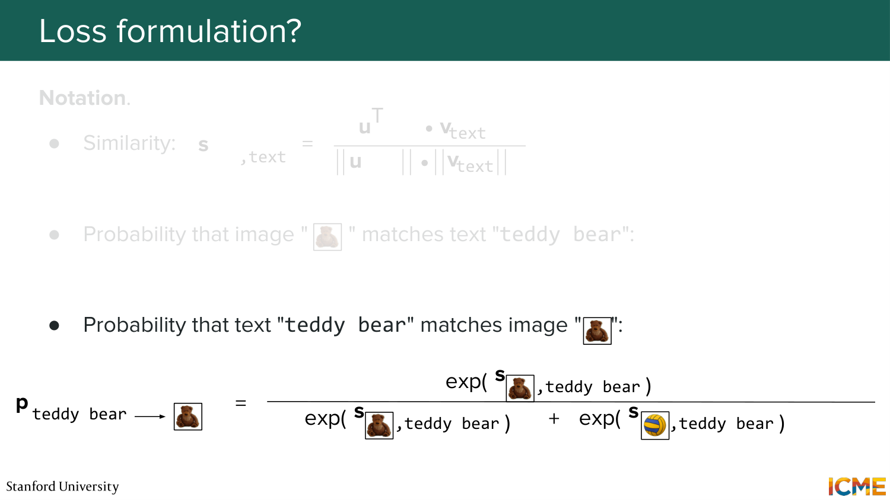

### 幻灯片内容

Notation.
●
Similarity:
●
Probability that image "       " matches text "teddy bear": 
●
Probability that text "teddy bear" matches image "     ":
Loss formulation?
s �� 
,text
uT
�� text
v
u �� 
text
v
p teddy bear
=
=
exp( s
,teddy bear )
+
exp( s
,teddy bear )
exp( s
,teddy bear )

### 通俗解释

引导强度：用 gamma 参数控制引导的强度。gamma 越大，条件约束越强。

---

## Slide 110

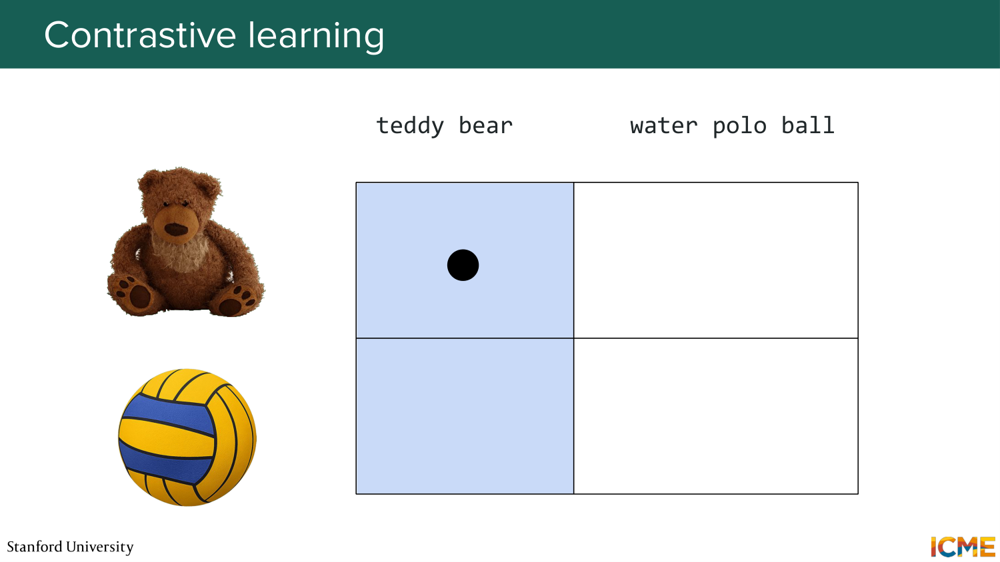

### 幻灯片内容

Contrastive learning
teddy bear
water polo ball

### 通俗解释

Classifier Guidance 的缺点：需要额外训练分类器，且只适用于有标签的任务。

---

## Slide 111

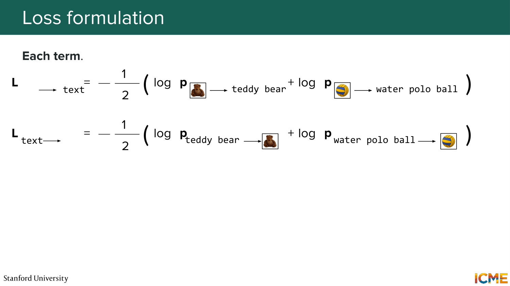

### 幻灯片内容

1
2
water polo ball
Each term.
Loss formulation
L��   text=
log 
1
2
p
teddy bear
log p
water polo ball
(
)
+
L
�� 
  text
=
log pteddy bear
log p
(
)
+

### 通俗解释

这页内容：1 2 water polo ball Each term. Loss formulation L��   text= log  1 2 p teddy bea...

---

## Slide 112

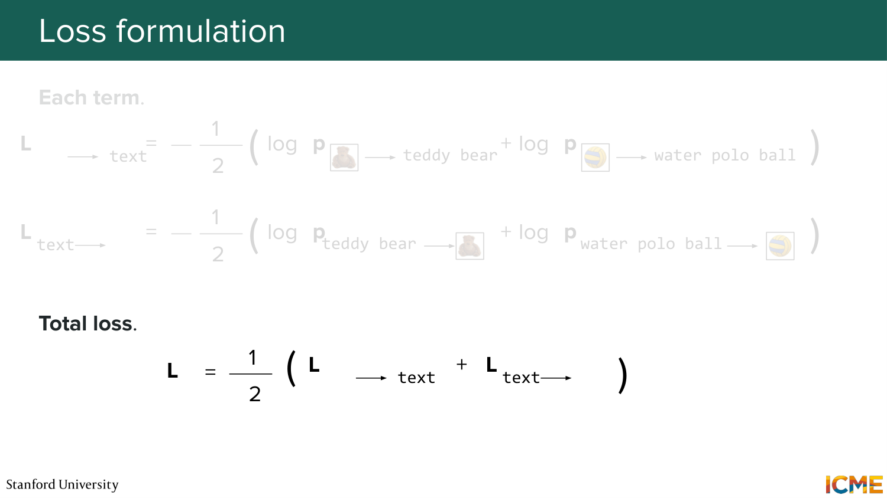

### 幻灯片内容

1
2
water polo ball
Each term.
Total loss.
Loss formulation
L��   text=
log 
1
2
p
teddy bear
log p
water polo ball
(
)
+
L
�� 
  text
=
log pteddy bear
log p
(
)
+
L
1
2
=
( L��   text
+
L
�� 
  text
)

### 通俗解释

引导方法2：Classifier-Free Guidance（无分类器引导）。

---

## Slide 113

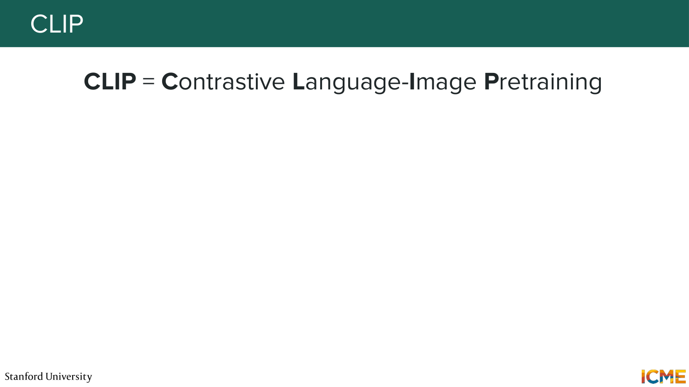

### 幻灯片内容

CLIP
CLIP = Contrastive Language-Image Pretraining

### 通俗解释

Classifier-Free Guidance：不需要单独的分类器，在扩散模型内部实现引导。

---

## Slide 114

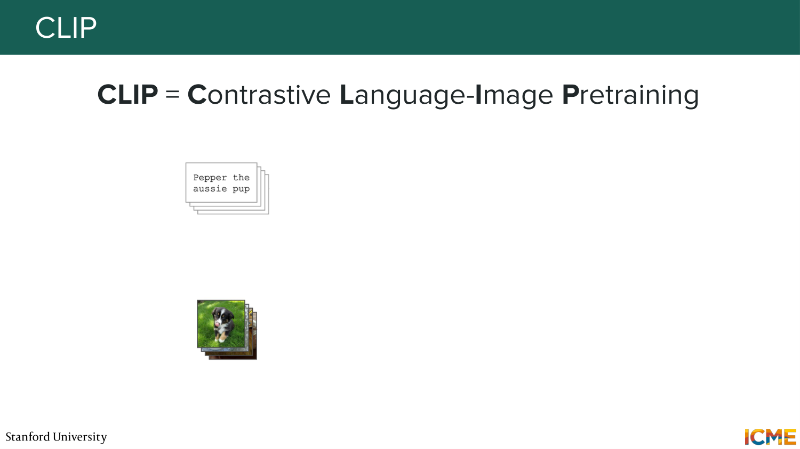

### 幻灯片内容

CLIP
CLIP = Contrastive Language-Image Pretraining

### 通俗解释

CFG 核心思想：训练时随机丢弃条件（如 10% 概率用空文本），让模型同时学习有条件无条件。

---

## Slide 115

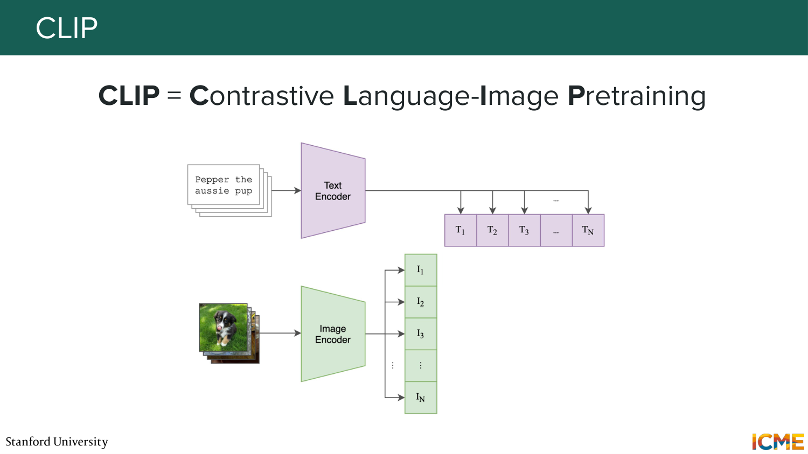

### 幻灯片内容

CLIP
CLIP = Contrastive Language-Image Pretraining

### 通俗解释

CFG 采样：结合有条件和无条件的预测，公式 epsilon_cfg = epsilon_uncond + w * (epsilon_cond - epsilon_uncond)。

---

## Slide 116

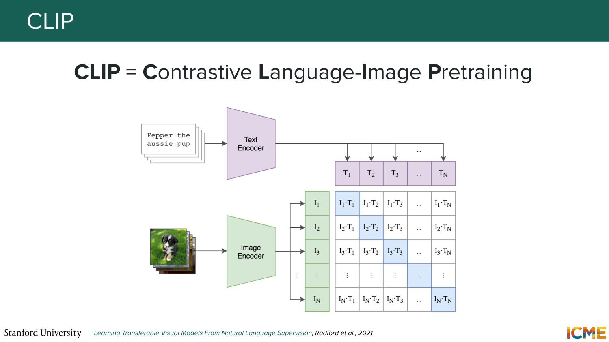

### 幻灯片内容

CLIP
CLIP = Contrastive Language-Image Pretraining
Learning Transferable Visual Models From Natural Language Supervision, Radford et al., 2021

### 通俗解释

CLIP 详解：图像和文本编码器将输入映射到同一个 embedding 空间。

---

## Slide 117

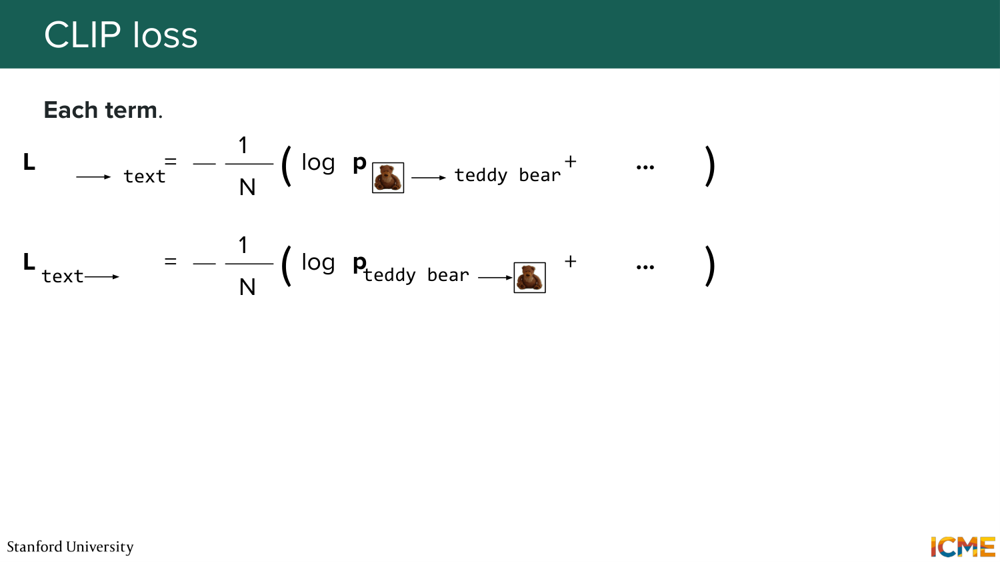

### 幻灯片内容

Each term.
CLIP loss
1
N
L��   text=
log 
1
N
p
teddy bear
(
)
+
L
�� 
  text
=
log pteddy bear
...
(
)
+
...

### 通俗解释

这页内容：Each term. CLIP loss 1 N L��   text= log  1 N p teddy bear ( ) + L ��    text = ...

---

## Slide 118

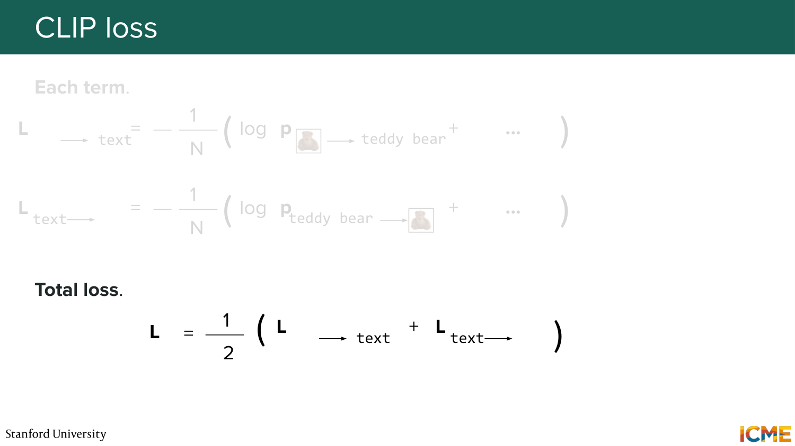

### 幻灯片内容

Each term.
Total loss.
CLIP loss
1
N
L��   text=
log 
1
N
p
teddy bear
(
)
+
L
�� 
  text
=
log pteddy bear
...
(
)
+
L
1
2
=
( L��   text
+
L
�� 
  text
)
...

### 通俗解释

这页内容：Each term. Total loss. CLIP loss 1 N L��   text= log  1 N p teddy bear ( ) + L �...

---

## Slide 119

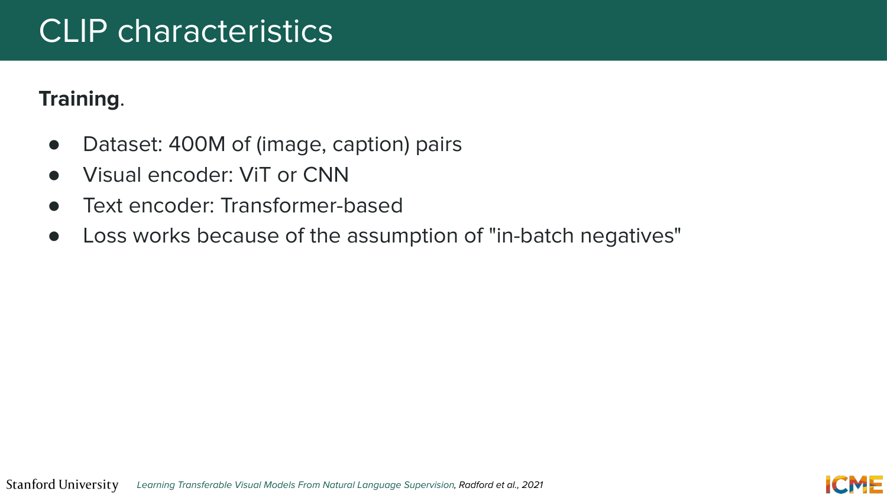

### 幻灯片内容

CLIP characteristics
Training.
●
Dataset: 400M of (image, caption) pairs
●
Visual encoder: ViT or CNN
●
Text encoder: Transformer-based
●
Loss works because of the assumption of "in-batch negatives"
Learning Transferable Visual Models From Natural Language Supervision, Radford et al., 2021

### 通俗解释

CLIP 特性：零样本能力、多模态理解、开放词汇分类。

---

## Slide 120

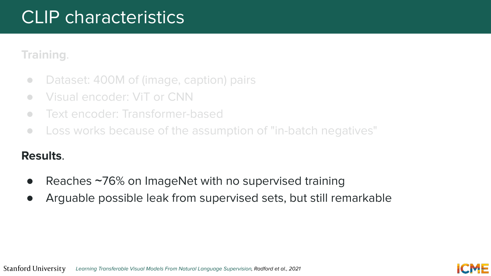

### 幻灯片内容

Training.
●
Dataset: 400M of (image, caption) pairs
●
Visual encoder: ViT or CNN
●
Text encoder: Transformer-based
●
Loss works because of the assumption of "in-batch negatives"
Results.
●
Reaches ~76% on ImageNet with no supervised training
●
Arguable possible leak from supervised sets, but still remarkable
Learning Transferable Visual Models From Natural Language Supervision, Radford et al., 2021
CLIP characteristics

### 通俗解释

这页内容：Training. ● Dataset: 400M of (image, caption) pairs ● Visual encoder: ViT or CNN...

---

## Slide 121

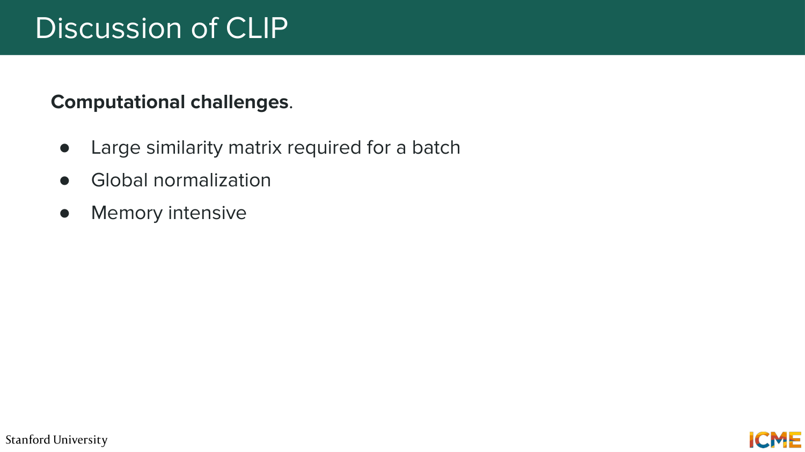

### 幻灯片内容

Discussion of CLIP
Computational challenges.
●
Large similarity matrix required for a batch
●
Global normalization
●
Memory intensive

### 通俗解释

CLIP 讨论：CLIP 是连接文本和图像的桥梁，让文生图成为可能。

---

## Slide 122

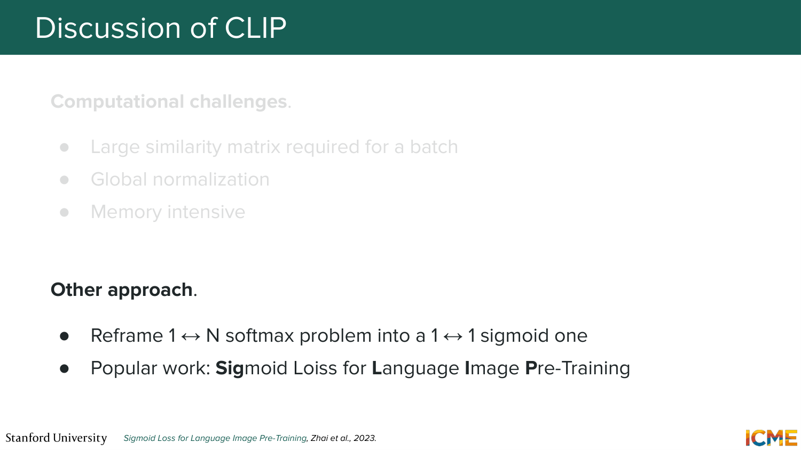

### 幻灯片内容

Discussion of CLIP
Computational challenges.
●
Large similarity matrix required for a batch
●
Global normalization
●
Memory intensive
Other approach.
●
Reframe 1 ↔ N softmax problem into a 1 ↔ 1 sigmoid one
●
Popular work: Sigmoid Loiss for Language Image Pre-Training
Sigmoid Loss for Language Image Pre-Training, Zhai et al., 2023.

### 通俗解释

CLIP 讨论继续：CLIP 的 embedding 质量直接影响生成图像与文本的匹配程度。

---

## Slide 123

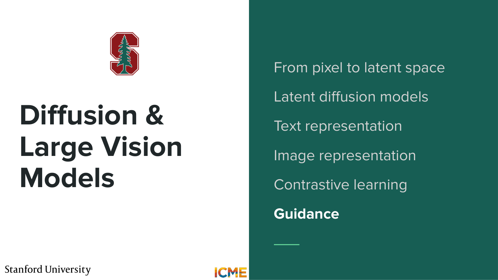

### 幻灯片内容

From pixel to latent space
Latent diffusion models
Text representation
Image representation
Contrastive learning
Guidance
Diffusion & 
Large Vision 
Models

### 通俗解释

这页内容：From pixel to latent space Latent diffusion models Text representation Image repr...

---

## Slide 124

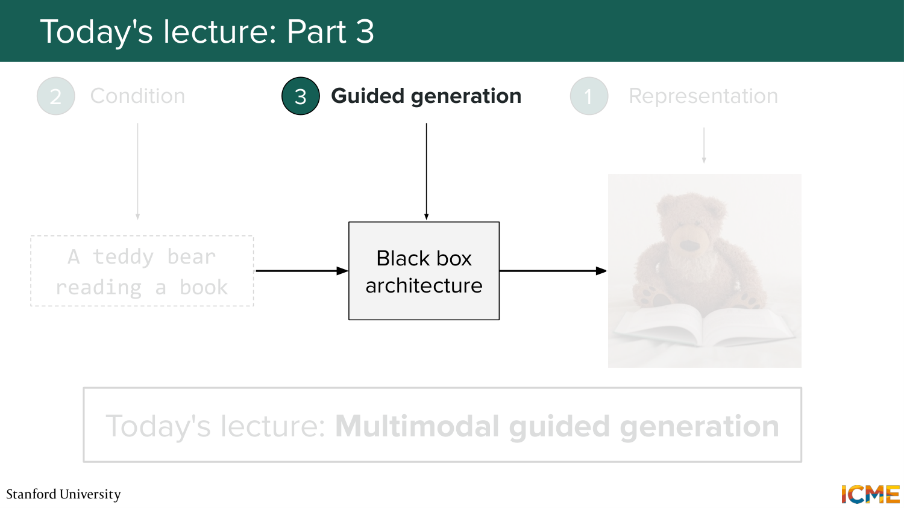

### 幻灯片内容

Today's lecture: Part 3
A teddy bear 
reading a book
Condition
Black box 
architecture
Today's lecture: Multimodal guided generation
Representation
Guided generation
3
1
2

### 通俗解释

这页内容：Today's lecture: Part 3 A teddy bear  reading a book Condition Black box  archit...

---

## Slide 125

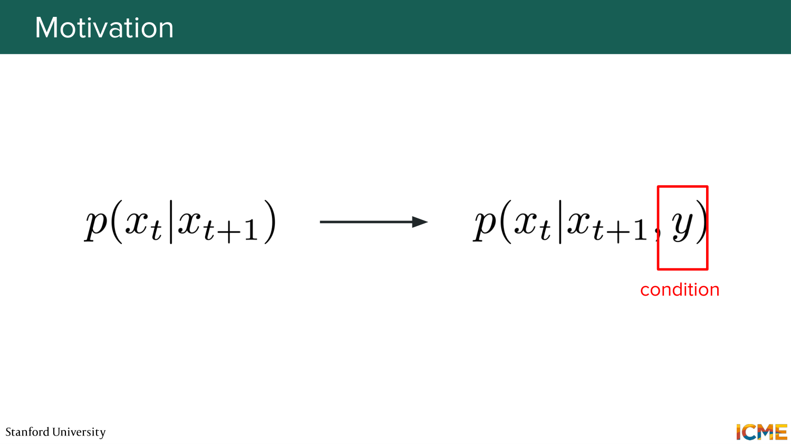

### 通俗解释

过渡页或标题页。

---

## Slide 126

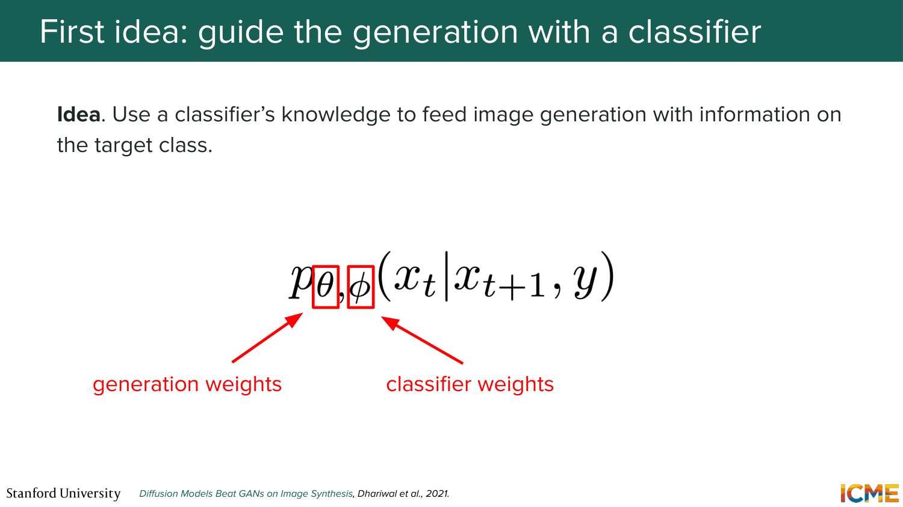

### 幻灯片内容

First idea: guide the generation with a classifier
Idea. Use a classifier’s knowledge to feed image generation with information on 
the target class.
Diffusion Models Beat GANs on Image Synthesis, Dhariwal et al., 2021.
generation weights
classifier weights

### 通俗解释

CFG 训练：模型同时接收有条件（文本）和无条件（空文本）的输入。

---

## Slide 127

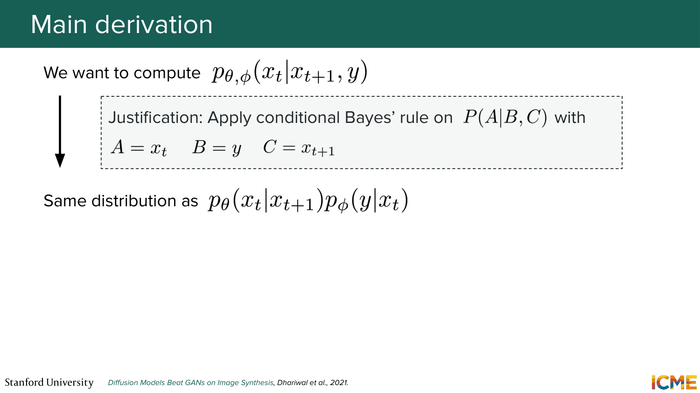

### 幻灯片内容

Justification: Apply conditional Bayes’ rule on
We want to compute
Main derivation
Diffusion Models Beat GANs on Image Synthesis, Dhariwal et al., 2021.
Same distribution as
with

### 通俗解释

CFG 训练继续：通过随机丢弃条件，模型学会在有/无条件之间切换。

---

## Slide 128

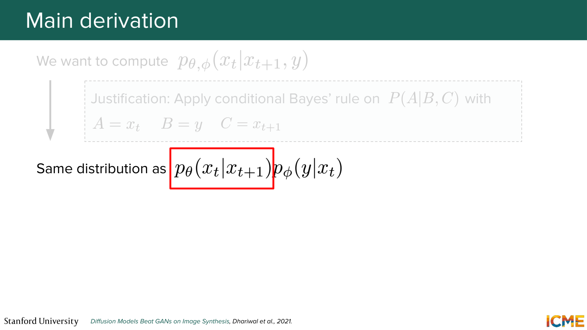

### 幻灯片内容

Justification: Apply conditional Bayes’ rule on
We want to compute
Main derivation
Diffusion Models Beat GANs on Image Synthesis, Dhariwal et al., 2021.
Same distribution as
with

### 通俗解释

CFG 采样公式：epsilon_cfg = epsilon_uncond + w * (epsilon_cond - epsilon_uncond)。

---

## Slide 129

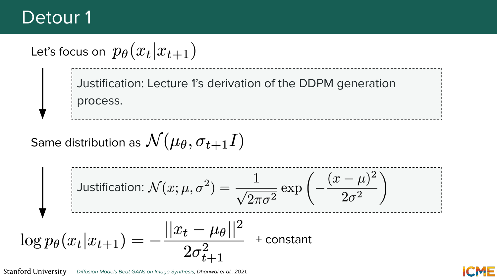

### 幻灯片内容

Justification: 
Justification: Lecture 1’s derivation of the DDPM generation 
process.
Same distribution as
Let’s focus on
Detour 1
Diffusion Models Beat GANs on Image Synthesis, Dhariwal et al., 2021.
+ constant

### 通俗解释

CFG 参数 w：引导权重。w=1 相当于无条件，w 越大条件约束越强。

---

## Slide 130

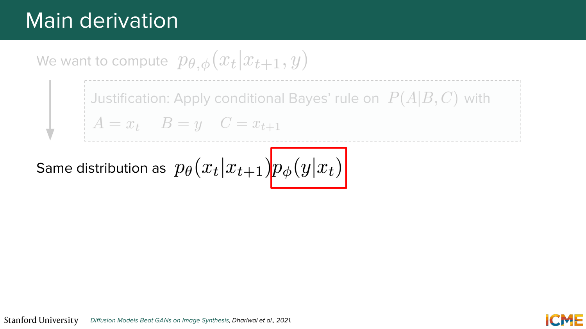

### 幻灯片内容

Justification: Apply conditional Bayes’ rule on
We want to compute
Main derivation
Diffusion Models Beat GANs on Image Synthesis, Dhariwal et al., 2021.
Same distribution as
with

### 通俗解释

CFG 效果：w=7.5 通常是文本到图像生成的好选择。

---

## Slide 131

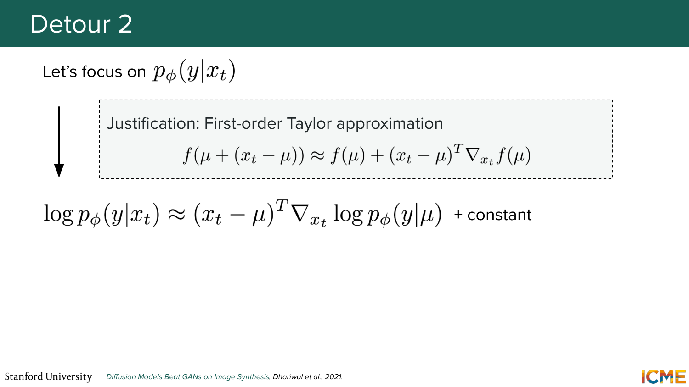

### 幻灯片内容

Let’s focus on
Justification: First-order Taylor approximation
Detour 2
Diffusion Models Beat GANs on Image Synthesis, Dhariwal et al., 2021.
+ constant

### 通俗解释

这页内容：Let’s focus on Justification: First-order Taylor approximation Detour 2 Diffusion ...

---

## Slide 132

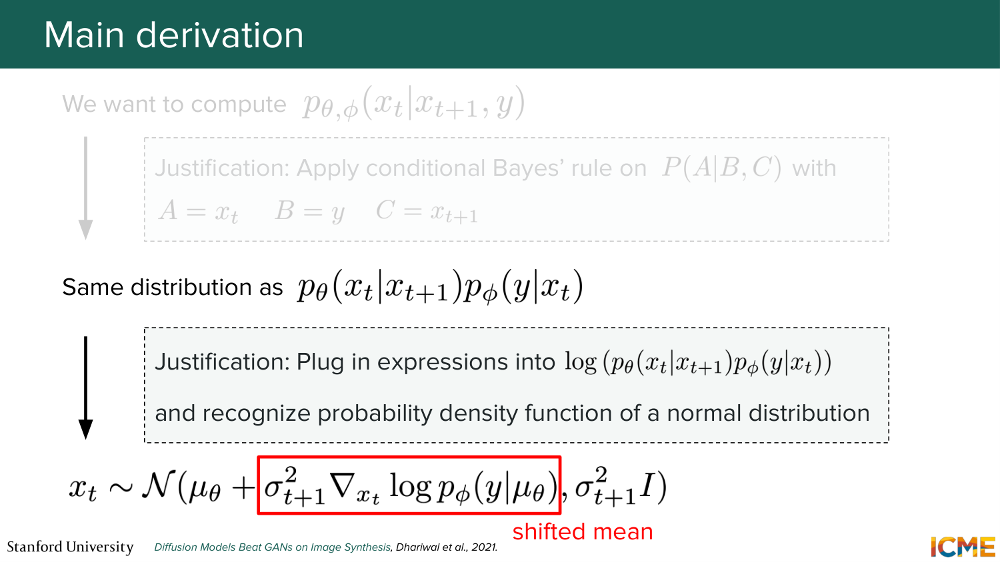

### 幻灯片内容

Justification: Plug in expressions into
and recognize probability density function of a normal distribution 
Justification: Apply conditional Bayes’ rule on
We want to compute
Main derivation
Diffusion Models Beat GANs on Image Synthesis, Dhariwal et al., 2021.
Same distribution as
with
shifted mean

### 通俗解释

CFG 的优势：不需要额外训练分类器，适用于任何条件类型。

---

## Slide 133

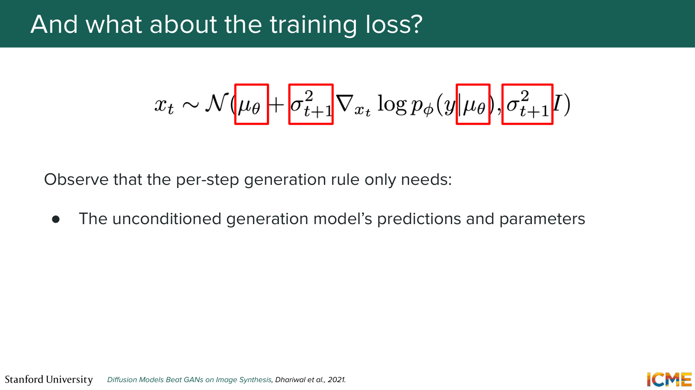

### 幻灯片内容

And what about the training loss?
Observe that the per-step generation rule only needs:
●
The unconditioned generation model’s predictions and parameters
Diffusion Models Beat GANs on Image Synthesis, Dhariwal et al., 2021.

### 通俗解释

CFG 在 Stable Diffusion 中的应用：默认使用 CFG 进行文本引导。

---

## Slide 134

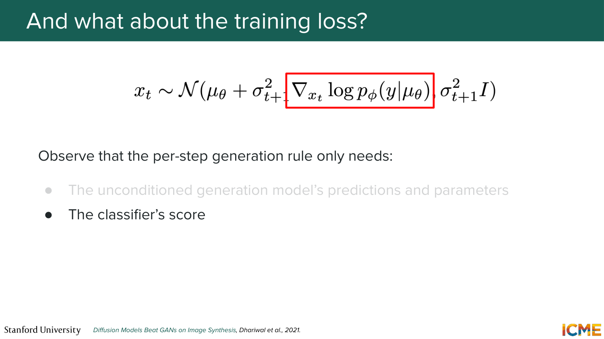

### 幻灯片内容

And what about the training loss?
Observe that the per-step generation rule only needs:
●
The unconditioned generation model’s predictions and parameters
●
The classifier’s score
Diffusion Models Beat GANs on Image Synthesis, Dhariwal et al., 2021.

### 通俗解释

CFG 继续：w 的选择影响生成质量——太大可能过饱和，太小可能不遵循文本。

---

## Slide 135

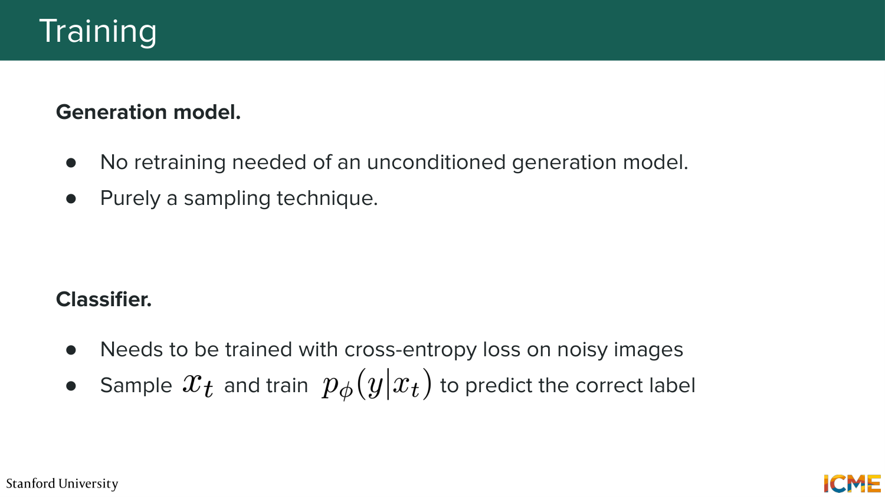

### 幻灯片内容

Training
Generation model.
●
No retraining needed of an unconditioned generation model.
●
Purely a sampling technique.
Classifier.
●
Needs to be trained with cross-entropy loss on noisy images
●
Sample         and train                       to predict the correct label

### 通俗解释

CFG 实践：通常尝试 w=5, 7.5, 10 等值，找到最佳平衡。

---

## Slide 136

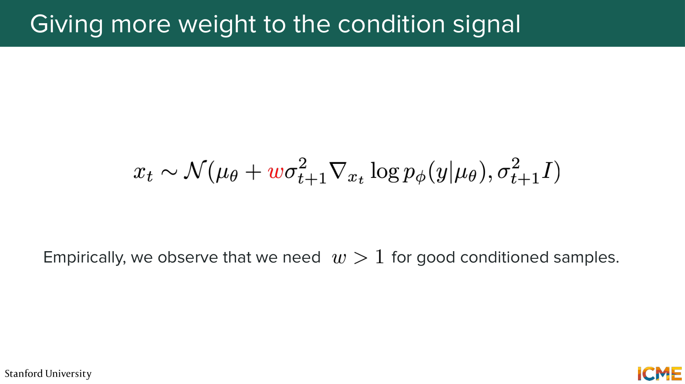

### 幻灯片内容

Giving more weight to the condition signal
Empirically, we observe that we need                for good conditioned samples.

### 通俗解释

这页内容：Giving more weight to the condition signal Empirically, we observe that we need ...

---

## Slide 137

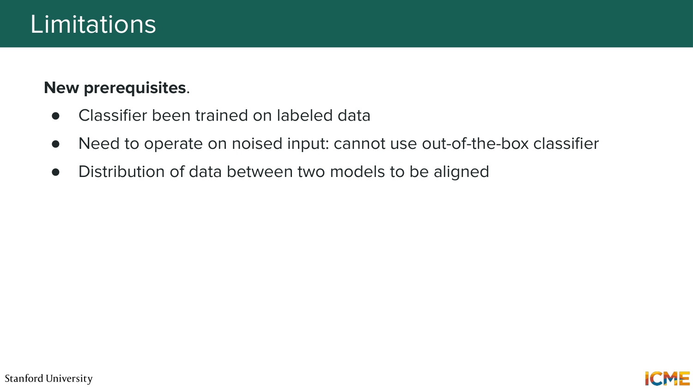

### 幻灯片内容

Limitations
New prerequisites.
●
Classifier been trained on labeled data
●
Need to operate on noised input: cannot use out-of-the-box classifier
●
Distribution of data between two models to be aligned

### 通俗解释

这页内容：Limitations New prerequisites. ● Classifier been trained on labeled data ● Need t...

---

## Slide 138

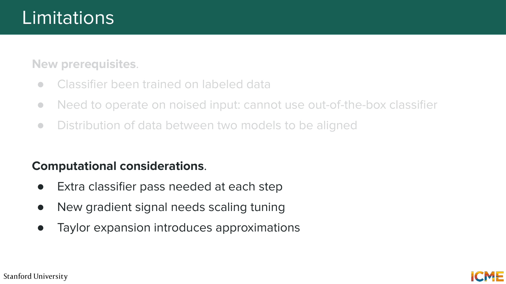

### 幻灯片内容

Limitations
New prerequisites.
●
Classifier been trained on labeled data
●
Need to operate on noised input: cannot use out-of-the-box classifier
●
Distribution of data between two models to be aligned
Computational considerations.
●
Extra classifier pass needed at each step
●
New gradient signal needs scaling tuning
●
Taylor expansion introduces approximations

### 通俗解释

引导总结：CFG 是目前最主流的引导方法。

---

## Slide 139

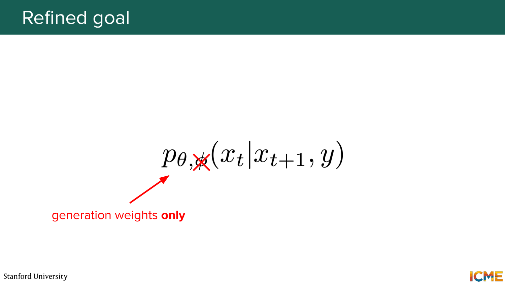

### 幻灯片内容

Refined goal
generation weights only

### 通俗解释

引导继续：结合潜空间扩散、CLIP 文本编码和 CFG，构成了 Stable Diffusion 的核心。

---

## Slide 140

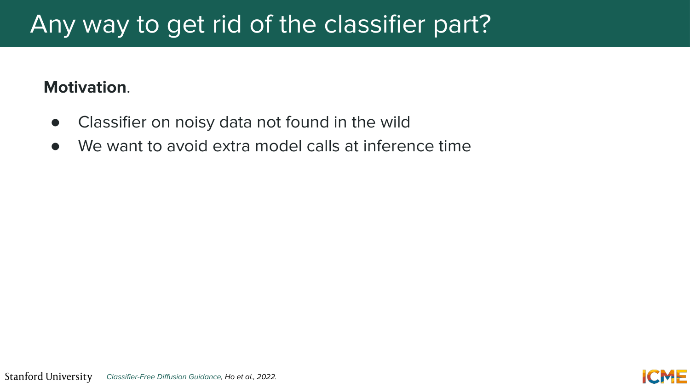

### 幻灯片内容

Any way to get rid of the classifier part?
Motivation.
●
Classifier on noisy data not found in the wild
●
We want to avoid extra model calls at inference time
Classifier-Free Diffusion Guidance, Ho et al., 2022.

### 通俗解释

能否去掉分类器部分？这就是 CFG 的动机——不需要额外分类器。

---

## Slide 141

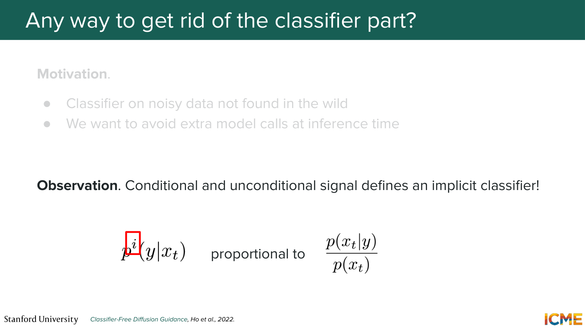

### 幻灯片内容

Any way to get rid of the classifier part?
Motivation.
●
Classifier on noisy data not found in the wild
●
We want to avoid extra model calls at inference time
Classifier-Free Diffusion Guidance, Ho et al., 2022.
Observation. Conditional and unconditional signal defines an implicit classifier!
proportional to

### 通俗解释

CFG 的优雅之处：同一个模型既做有条件预测又做无条件预测。

---

## Slide 142

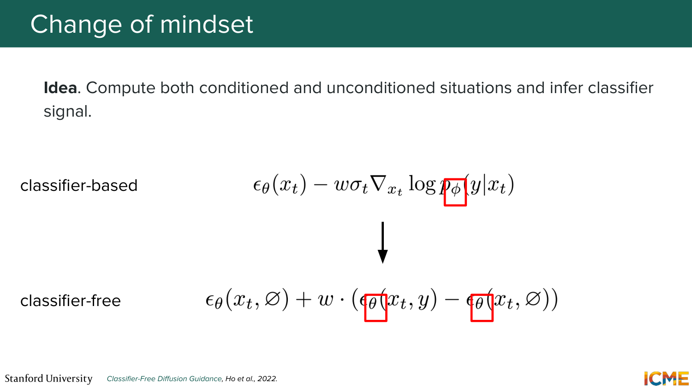

### 幻灯片内容

Change of mindset
Idea. Compute both conditioned and unconditioned situations and infer classifier 
signal. 
Classifier-Free Diffusion Guidance, Ho et al., 2022.
classifier-based
classifier-free

### 通俗解释

思维转变：从需要外部分类器引导到模型自身实现引导。

---

## Slide 143

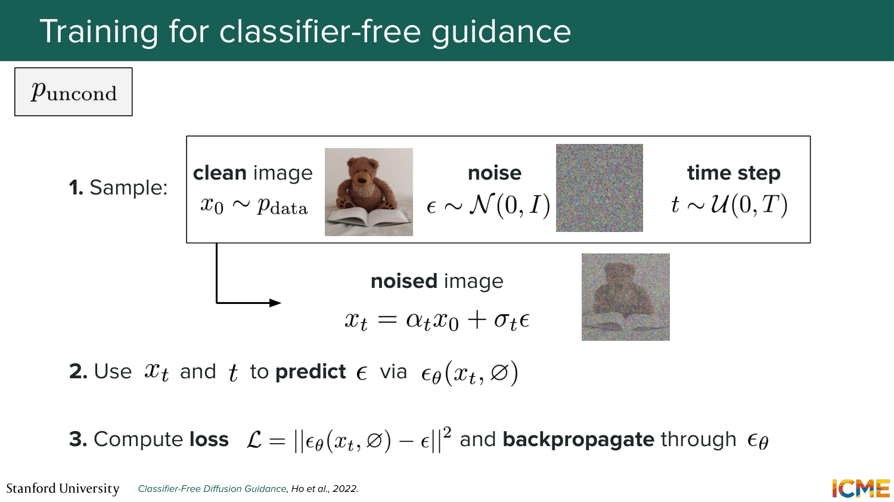

### 幻灯片内容

Training for classifier-free guidance
Classifier-Free Diffusion Guidance, Ho et al., 2022.
1. Sample:
time step
noise
clean image
noised image
2. Use
via
and
to predict
3. Compute loss
and backpropagate through

### 通俗解释

CFG 训练细节：训练时以概率 p 丢弃条件（用空 token 替换）。

---

## Slide 144

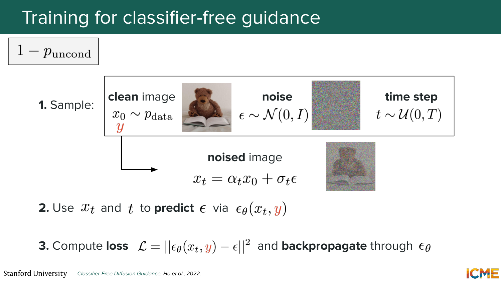

### 幻灯片内容

Training for classifier-free guidance
Classifier-Free Diffusion Guidance, Ho et al., 2022.
1. Sample:
time step
noise
clean image
noised image
2. Use
via
and
to predict
3. Compute loss
and backpropagate through

### 通俗解释

CFG 训练继续：模型学会在有条件和无条件之间共享知识。

---

## Slide 145

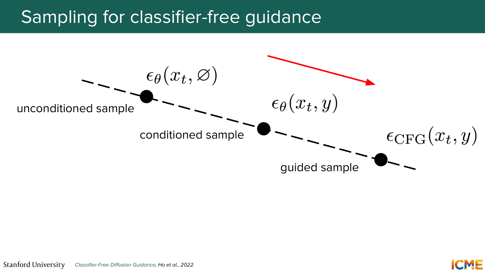

### 幻灯片内容

Sampling for classifier-free guidance
Classifier-Free Diffusion Guidance, Ho et al., 2022.
unconditioned sample
conditioned sample
guided sample

### 通俗解释

CFG 采样：运行两次模型（一次有条件，一次无条件），然后组合结果。

---

## Slide 146

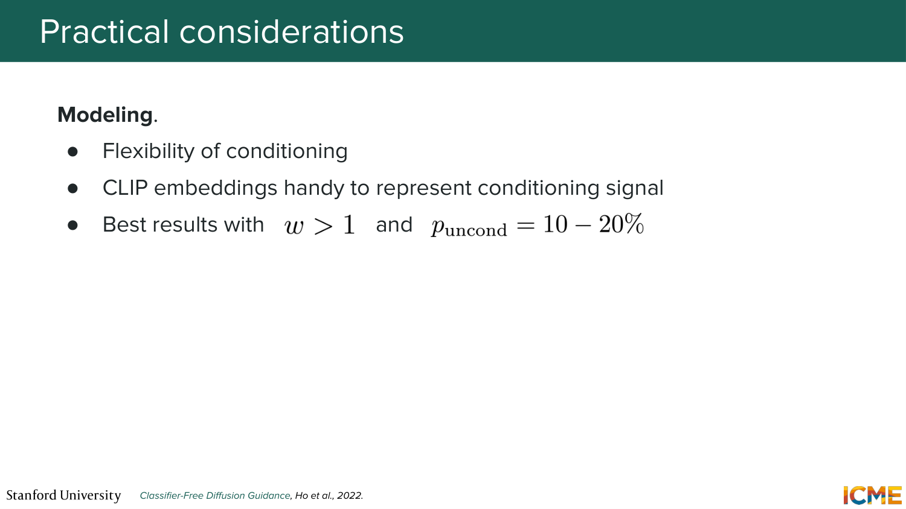

### 幻灯片内容

Practical considerations
Modeling.
●
Flexibility of conditioning
●
CLIP embeddings handy to represent conditioning signal
●
Best results with                   and 
Classifier-Free Diffusion Guidance, Ho et al., 2022.

### 通俗解释

实际考虑：CFG 需要两次前向传播，计算成本翻倍。但有更好的实现方式。

---

## Slide 147

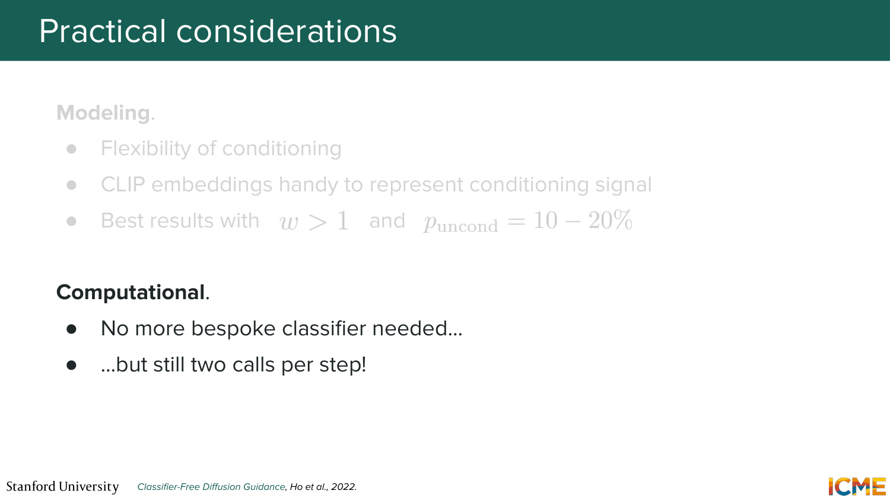

### 幻灯片内容

Practical considerations
Modeling.
●
Flexibility of conditioning
●
CLIP embeddings handy to represent conditioning signal
●
Best results with                   and 
Computational.
●
No more bespoke classifier needed...
●
...but still two calls per step!
Classifier-Free Diffusion Guidance, Ho et al., 2022.

### 通俗解释

CFG 优化：可以共享部分计算，减少额外开销。

---

## Slide 148

### 通俗解释

Lecture 4 总结：潜空间扩散 + CLIP 文本编码 + Classifier-Free Guidance = 现代文生图模型的基础。

---
