# Stanford CME 296 - Lecture 5: Image Generation Architectures (U-Net, DiT)

> **课程**: Stanford CME 296 - Diffusion & Large Vision Models
> **讲师**: Afshine Amidi & Shervine Amidi
> **视频**: [YouTube 1:46:26](https://www.youtube.com/watch?v=HpFdSlMeXzQ&list=PLoROMvodv4rNdy8rt2rZ4T2xM0OjADnfu&index=5)
> **Slides PDF**: [spring26-cme296-lecture5.pdf](../spring26-cme296-lecture5.pdf)
> **总页数**: 171 页幻灯片

---

## Slide 1

### 📝 幻灯片内容

CME 296: Diffusion &
Large Vision Models
Afshine Amidi & Shervine Amidi
Lecture 5

### 💡 通俗解释

*（待补充解释）*

---

## Slide 2

### 📝 幻灯片内容

Recap of last episodes…
Lectures 1, 2, 3
Generation paradigms
Diffusion
Score 
matching
Flow 
matching

### 💡 通俗解释

*（待补充解释）*

---

## Slide 3

### 📝 幻灯片内容

Recap of last episodes…
Lectures 1, 2, 3
Generation paradigms
Lecture 4
Latent space, guidance
Diffusion
Score 
matching
Flow 
matching
Encoder
Decoder
Latent 
space
Variational AutoEncoder (VAE)

### 💡 通俗解释

*（待补充解释）*

---

## Slide 4

### 📝 幻灯片内容

Today's lecture
A teddy bear 
reading a book
Generation 
model
Today's lecture: Image generation architectures
Model architecture

### 💡 通俗解释

*（待补充解释）*

---

## Slide 5

### 📝 幻灯片内容

Motivation
U-Net
Diffusion Transformer
End-to-end example
Multimodal DiT
Optimizations
Diffusion & 
Large Vision 
Models

### 💡 通俗解释

*（待补充解释）*

---

## Slide 6

### 📝 幻灯片内容

Problem statement
Generation 
model
Noise level 
Condition
A teddy bear 
reading a book
Noisy latent
Velocity

### 💡 通俗解释

*（待补充解释）*

---

## Slide 7

### 📝 幻灯片内容

Objective of this lecture
Generation 
model
Noise level 
Condition
A teddy bear 
reading a book
Noisy latent
Velocity

### 💡 通俗解释

*（待补充解释）*

---

## Slide 8

### 📝 幻灯片内容

Side notes
Generation 
model
Noise level 
Condition
A teddy bear 
reading a book
Noisy latent
Velocity

### 💡 通俗解释

*（待补充解释）*

---

## Slide 9

### 📝 幻灯片内容

Side notes
Generation 
model
Noise level 
Condition
Make this teddy 
bear dance
Noisy latent
Velocity
Could also be:

### 💡 通俗解释

*（待补充解释）*

---

## Slide 10

### 📝 幻灯片内容

Side notes
Generation 
model
Noise level 
Condition
A teddy bear 
reading a book
Noisy latent
Velocity

### 💡 通俗解释

*（待补充解释）*

---

## Slide 11

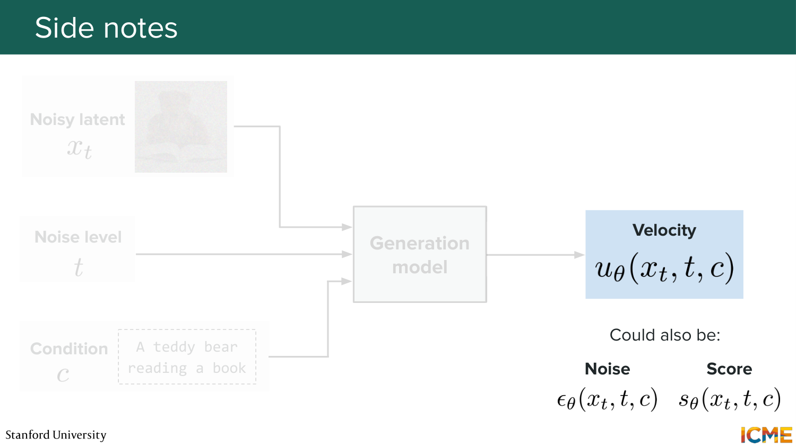

### 📝 幻灯片内容

Side notes
Generation 
model
Noise level 
Condition
A teddy bear 
reading a book
Noisy latent
Noise
Score
Velocity
Could also be:

### 💡 通俗解释

*（待补充解释）*

---

## Slide 12

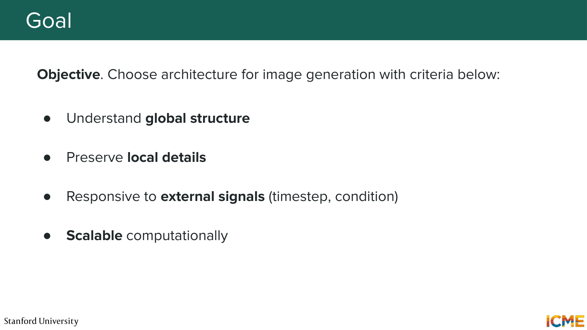

### 📝 幻灯片内容

Goal
Objective. Choose architecture for image generation with criteria below:
●
Understand global structure
●
Preserve local details
●
Responsive to external signals (timestep, condition)
●
Scalable computationally

### 💡 通俗解释

*（待补充解释）*

---

## Slide 13

### 📝 幻灯片内容

Motivation
U-Net
Diffusion Transformer
End-to-end example
Multimodal DiT
Optimizations
Diffusion & 
Large Vision 
Models

### 💡 通俗解释

*（待补充解释）*

---

## Slide 14

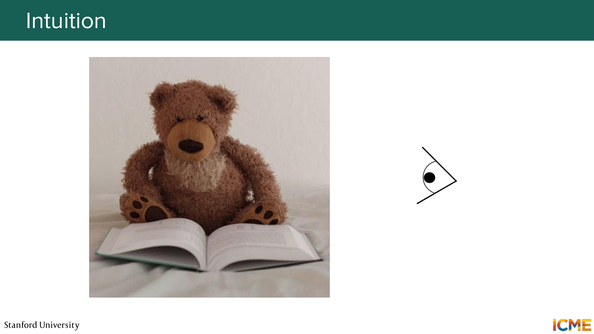

### 💡 通俗解释

*（待补充解释）*

---

## Slide 15

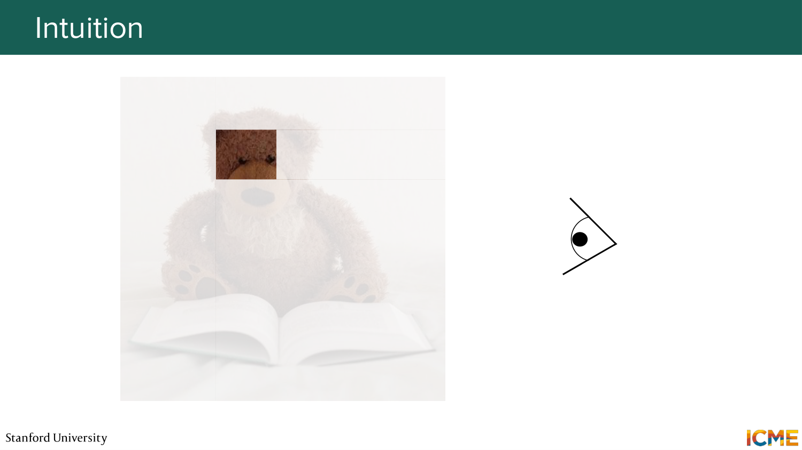

### 💡 通俗解释

*（待补充解释）*

---

## Slide 16

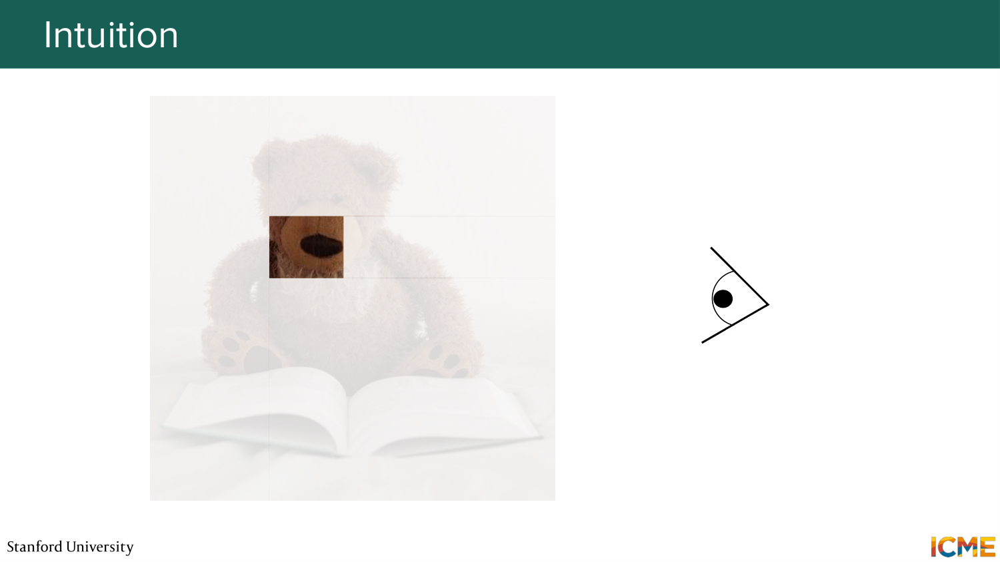

### 💡 通俗解释

*（待补充解释）*

---

## Slide 17

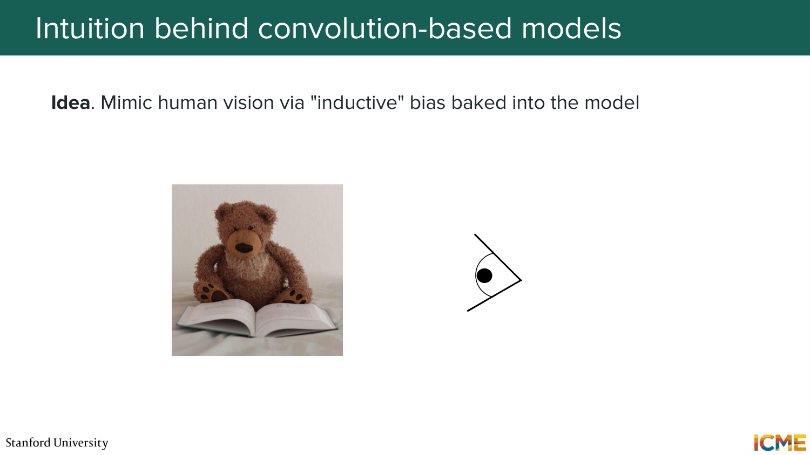

### 📝 幻灯片内容

Intuition behind convolution-based models
Idea. Mimic human vision via "inductive" bias baked into the model

### 💡 通俗解释

*（待补充解释）*

---

## Slide 18

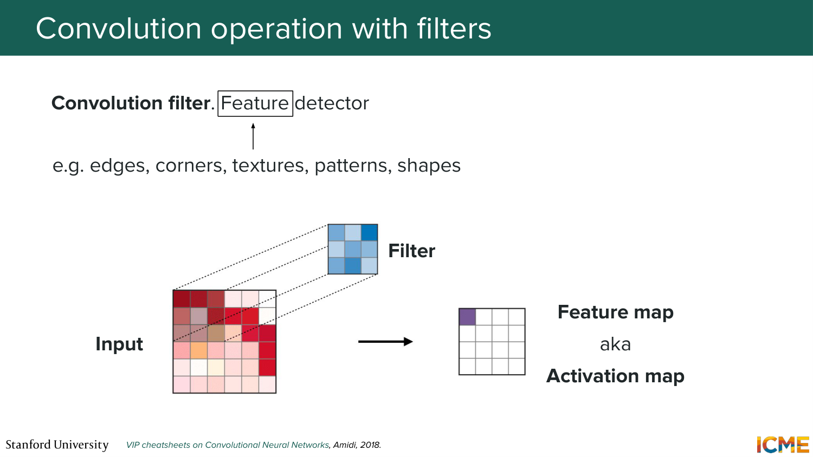

### 📝 幻灯片内容

Convolution operation with filters
VIP cheatsheets on Convolutional Neural Networks, Amidi, 2018.
Convolution filter. Feature detector
Filter
Feature map
Activation map
aka
Input
e.g. edges, corners, textures, patterns, shapes

### 💡 通俗解释

*（待补充解释）*

---

## Slide 19

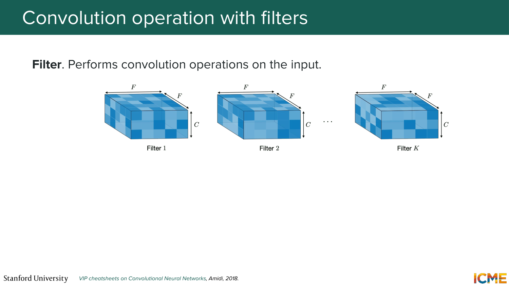

### 📝 幻灯片内容

Convolution operation with filters
VIP cheatsheets on Convolutional Neural Networks, Amidi, 2018.
Filter. Performs convolution operations on the input.

### 💡 通俗解释

*（待补充解释）*

---

## Slide 20

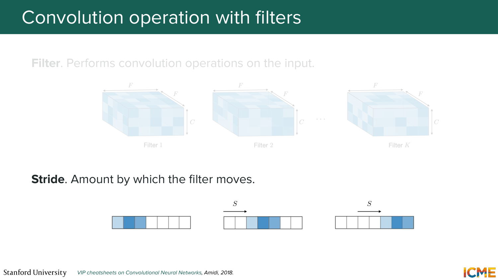

### 📝 幻灯片内容

Convolution operation with filters
VIP cheatsheets on Convolutional Neural Networks, Amidi, 2018.
Filter. Performs convolution operations on the input.
Stride. Amount by which the filter moves.

### 💡 通俗解释

*（待补充解释）*

---

## Slide 21

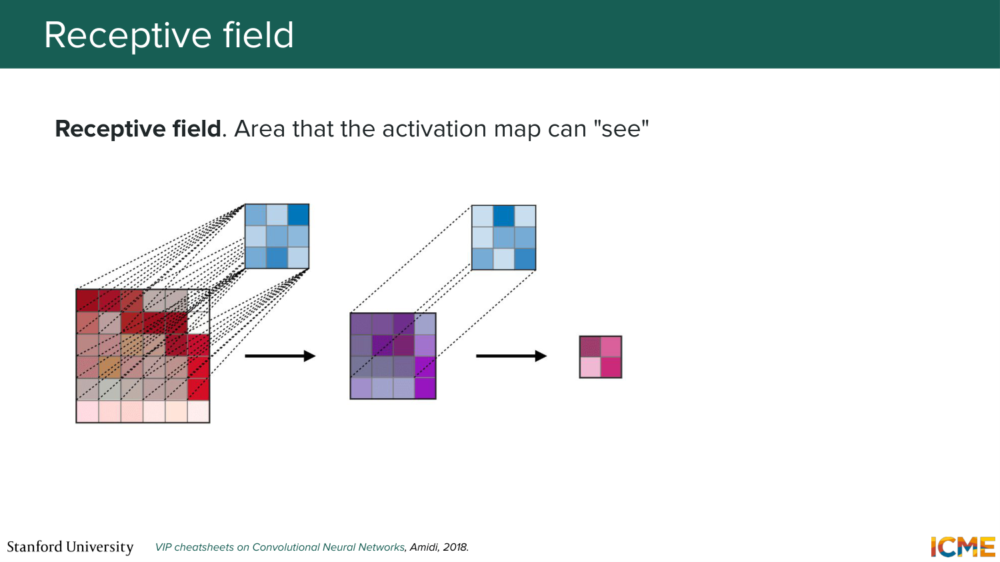

### 📝 幻灯片内容

Receptive field
Receptive field. Area that the activation map can "see"
VIP cheatsheets on Convolutional Neural Networks, Amidi, 2018.

### 💡 通俗解释

*（待补充解释）*

---

## Slide 22

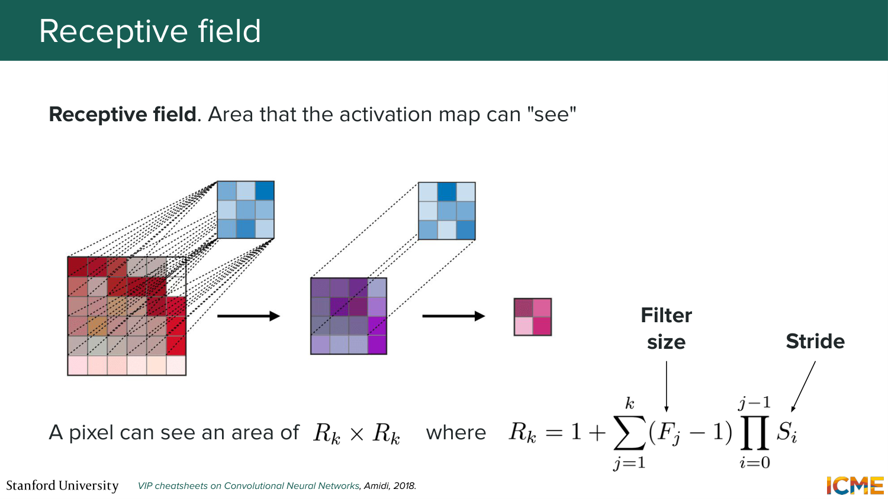

### 📝 幻灯片内容

Receptive field
Receptive field. Area that the activation map can "see"
VIP cheatsheets on Convolutional Neural Networks, Amidi, 2018.
A pixel can see an area of 
where
Filter 
size
Stride

### 💡 通俗解释

*（待补充解释）*

---

## Slide 23

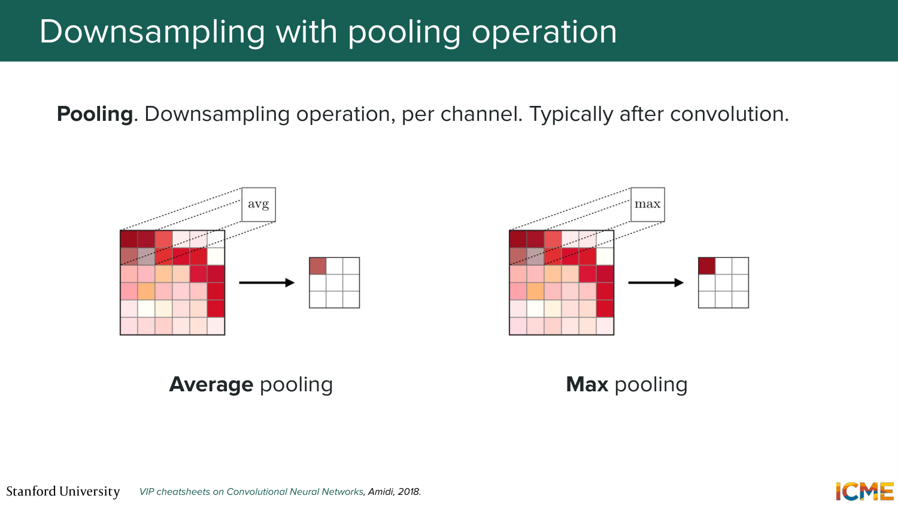

### 📝 幻灯片内容

Downsampling with pooling operation
Pooling. Downsampling operation, per channel. Typically after convolution.
VIP cheatsheets on Convolutional Neural Networks, Amidi, 2018.
Average pooling
Max pooling

### 💡 通俗解释

*（待补充解释）*

---

## Slide 24

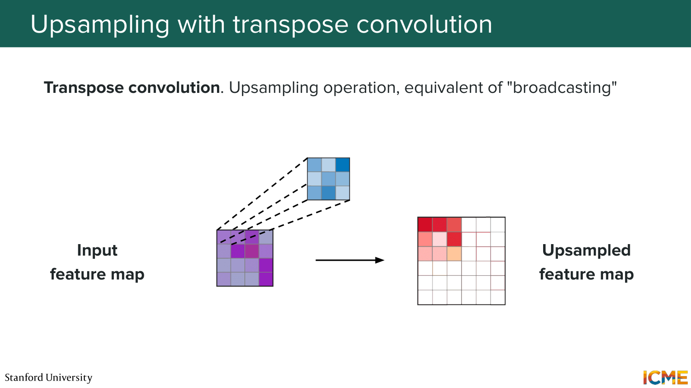

### 📝 幻灯片内容

Upsampling with transpose convolution
Input
feature map
Upsampled 
feature map
Transpose convolution. Upsampling operation, equivalent of "broadcasting"

### 💡 通俗解释

*（待补充解释）*

---

## Slide 25

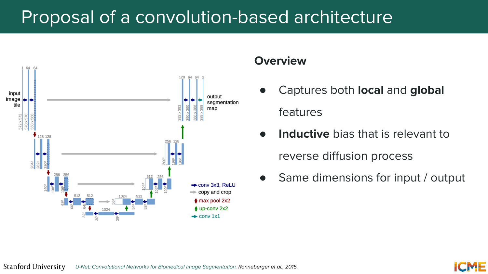

### 📝 幻灯片内容

Proposal of a convolution-based architecture
U-Net: Convolutional Networks for Biomedical Image Segmentation, Ronneberger et al., 2015.
●
Captures both local and global 
features
●
Inductive bias that is relevant to 
reverse diffusion process
●
Same dimensions for input / output
Overview

### 💡 通俗解释

*（待补充解释）*

---

## Slide 26

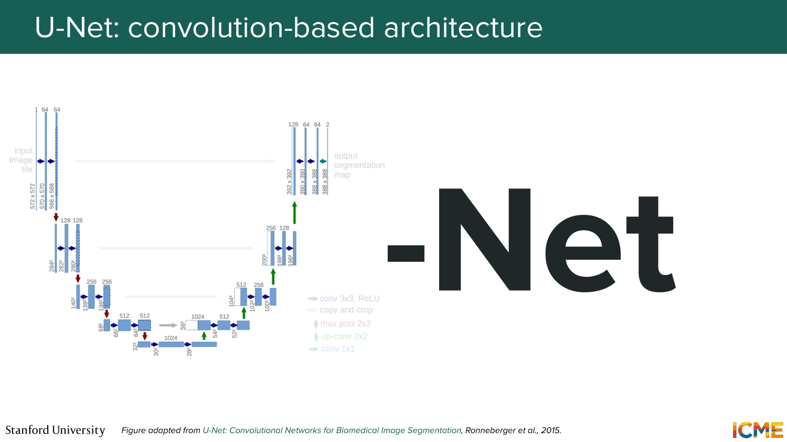

### 📝 幻灯片内容

U-Net: convolution-based architecture
-Net
Figure adapted from U-Net: Convolutional Networks for Biomedical Image Segmentation, Ronneberger et al., 2015.

### 💡 通俗解释

*（待补充解释）*

---

## Slide 27

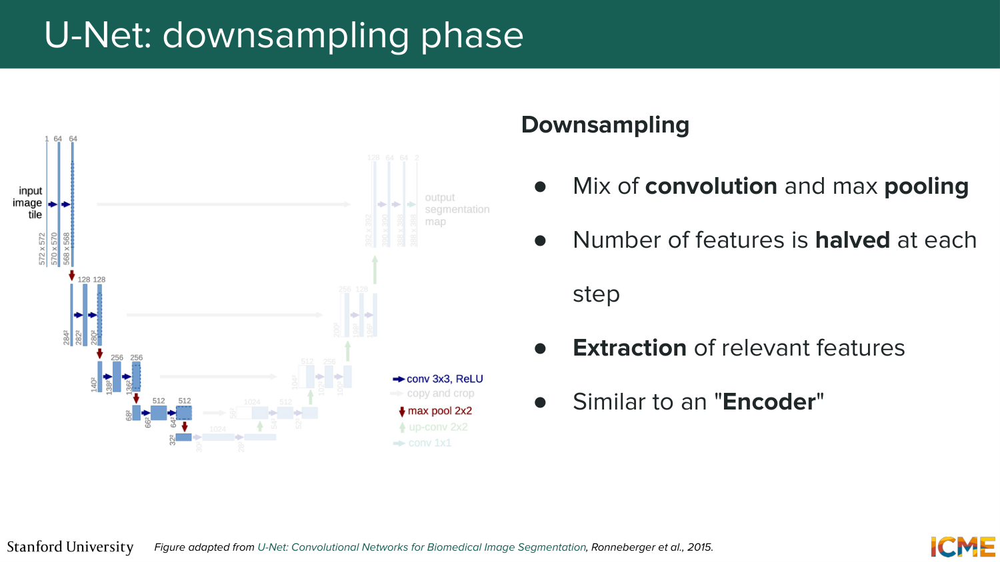

### 📝 幻灯片内容

U-Net: downsampling phase
Figure adapted from U-Net: Convolutional Networks for Biomedical Image Segmentation, Ronneberger et al., 2015.
Downsampling
●
Mix of convolution and max pooling
●
Number of features is halved at each 
step
●
Extraction of relevant features
●
Similar to an "Encoder"

### 💡 通俗解释

*（待补充解释）*

---

## Slide 28

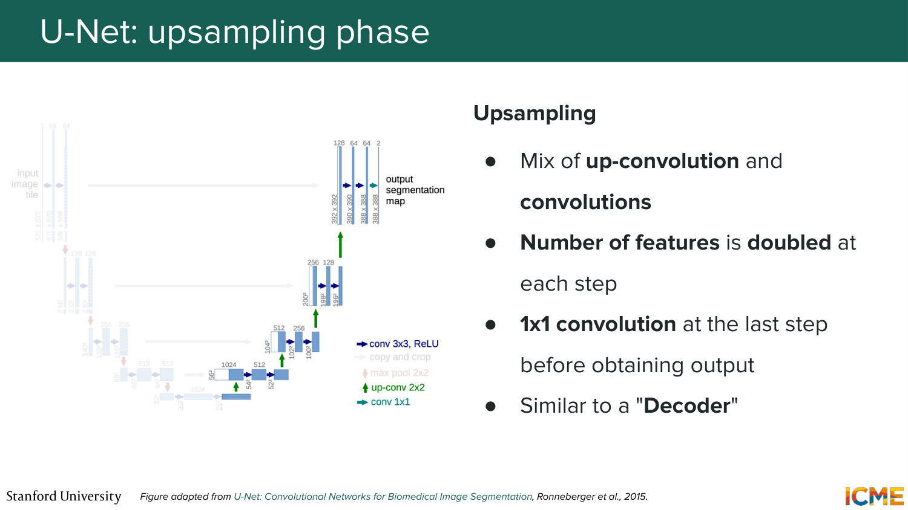

### 📝 幻灯片内容

U-Net: upsampling phase
Figure adapted from U-Net: Convolutional Networks for Biomedical Image Segmentation, Ronneberger et al., 2015.
●
Mix of up-convolution and 
convolutions
●
Number of features is doubled at 
each step
●
1x1 convolution at the last step 
before obtaining output
●
Similar to a "Decoder"
Upsampling

### 💡 通俗解释

*（待补充解释）*

---

## Slide 29

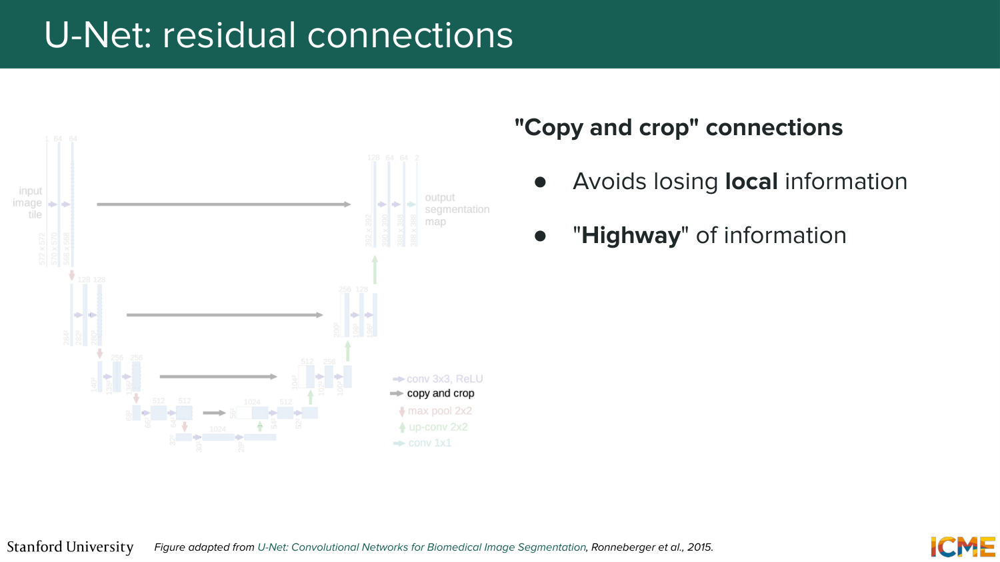

### 📝 幻灯片内容

Figure adapted from U-Net: Convolutional Networks for Biomedical Image Segmentation, Ronneberger et al., 2015.
●
Avoids losing local information
●
"Highway" of information
U-Net: residual connections
"Copy and crop" connections

### 💡 通俗解释

*（待补充解释）*

---

## Slide 30

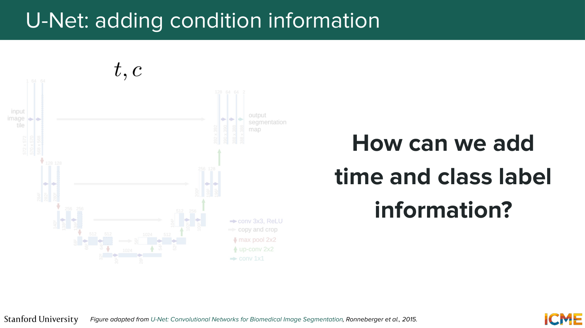

### 📝 幻灯片内容

Figure adapted from U-Net: Convolutional Networks for Biomedical Image Segmentation, Ronneberger et al., 2015.
U-Net: adding condition information
How can we add 
time and class label 
information?

### 💡 通俗解释

*（待补充解释）*

---

## Slide 31

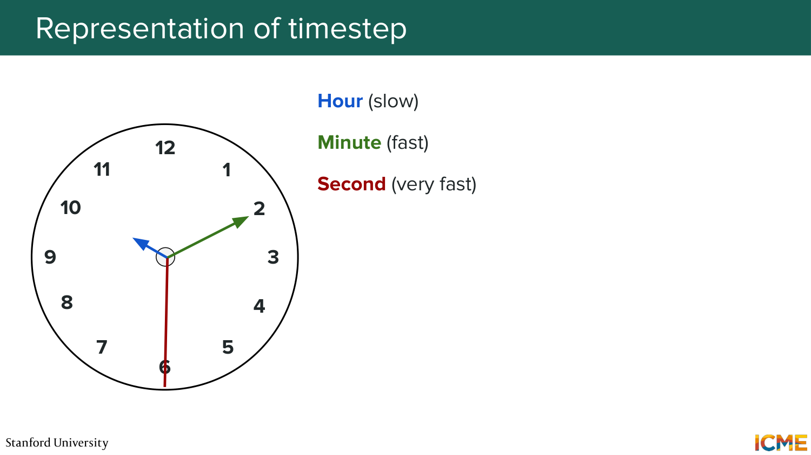

### 📝 幻灯片内容

Representation of timestep
12
3
6
9
10
11
1
2
8
7
4
5
Hour (slow)
Minute (fast)
Second (very fast)

### 💡 通俗解释

*（待补充解释）*

---

## Slide 32

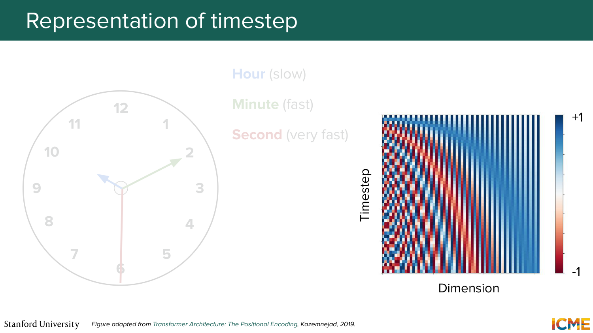

### 📝 幻灯片内容

Representation of timestep
+1
-1
Dimension
Timestep
Figure adapted from Transformer Architecture: The Positional Encoding, Kazemnejad, 2019.
12
3
6
9
10
11
1
2
8
7
4
5
Hour (slow)
Minute (fast)
Second (very fast)

### 💡 通俗解释

*（待补充解释）*

---

## Slide 33

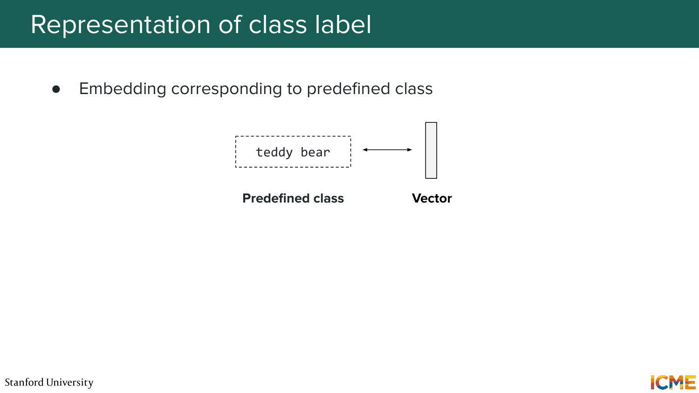

### 📝 幻灯片内容

Representation of class label
teddy bear
Vector
●
Embedding corresponding to predefined class
Predefined class

### 💡 通俗解释

*（待补充解释）*

---

## Slide 34

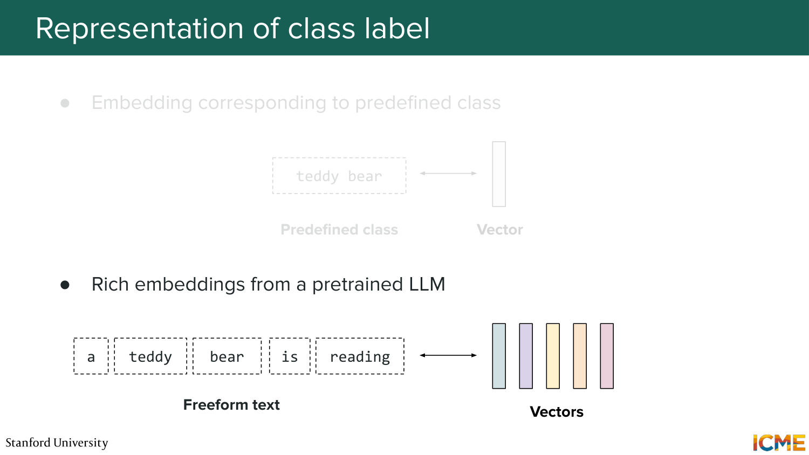

### 📝 幻灯片内容

Representation of class label
teddy bear
Vector
●
Embedding corresponding to predefined class
●
Rich embeddings from a pretrained LLM
a
Vectors
teddy
bear
is
reading
Predefined class
Freeform text

### 💡 通俗解释

*（待补充解释）*

---

## Slide 35

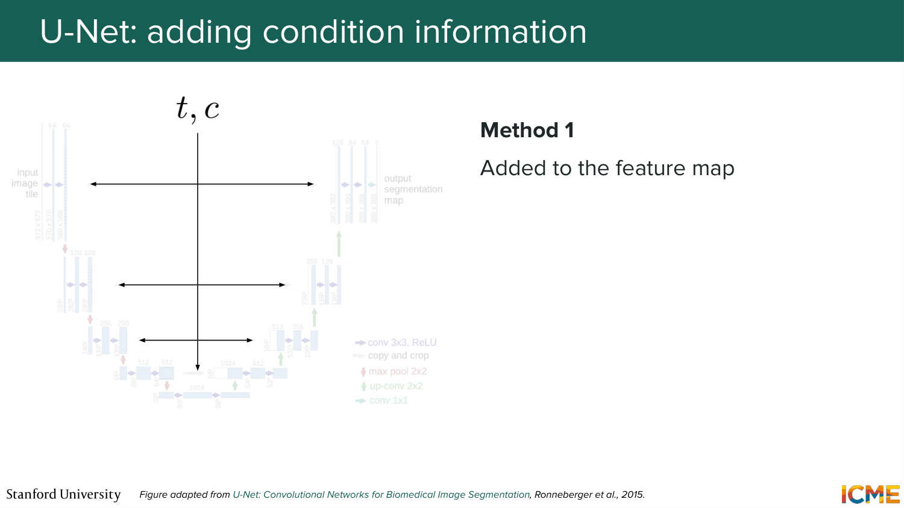

### 📝 幻灯片内容

Figure adapted from U-Net: Convolutional Networks for Biomedical Image Segmentation, Ronneberger et al., 2015.
Method 1
U-Net: adding condition information
Added to the feature map

### 💡 通俗解释

*（待补充解释）*

---

## Slide 36

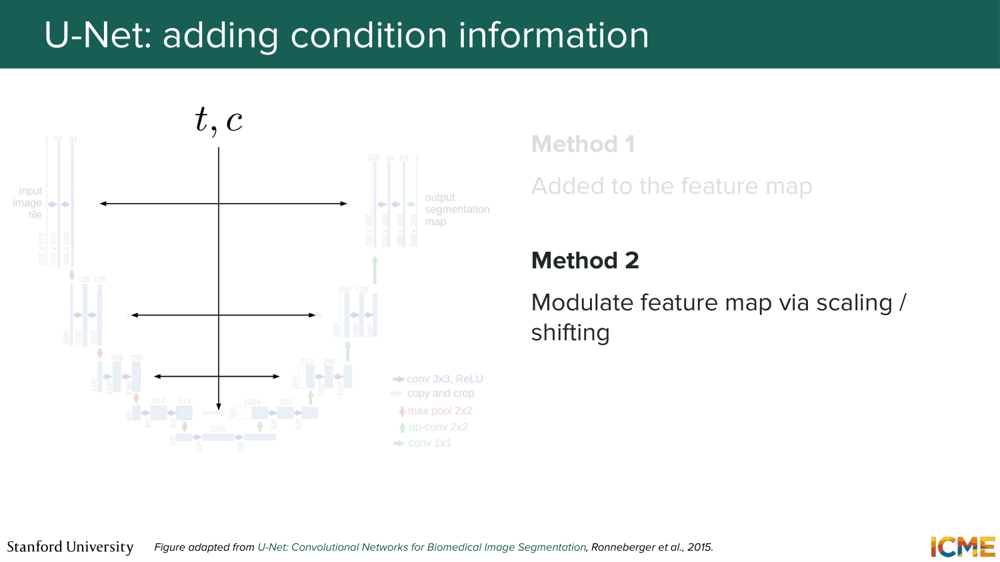

### 📝 幻灯片内容

Figure adapted from U-Net: Convolutional Networks for Biomedical Image Segmentation, Ronneberger et al., 2015.
Method 1
U-Net: adding condition information
Added to the feature map
Method 2
Modulate feature map via scaling / 
shifting

### 💡 通俗解释

*（待补充解释）*

---

## Slide 37

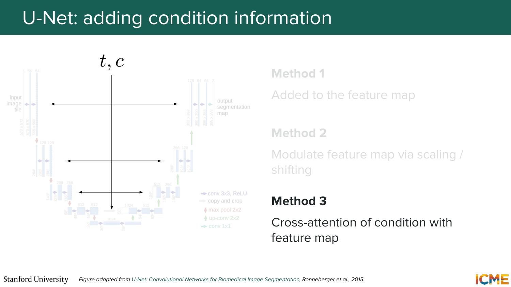

### 📝 幻灯片内容

Figure adapted from U-Net: Convolutional Networks for Biomedical Image Segmentation, Ronneberger et al., 2015.
Method 1
U-Net: adding condition information
Added to the feature map
Method 2
Modulate feature map via scaling / 
shifting
Method 3
Cross-attention of condition with 
feature map

### 💡 通俗解释

*（待补充解释）*

---

## Slide 38

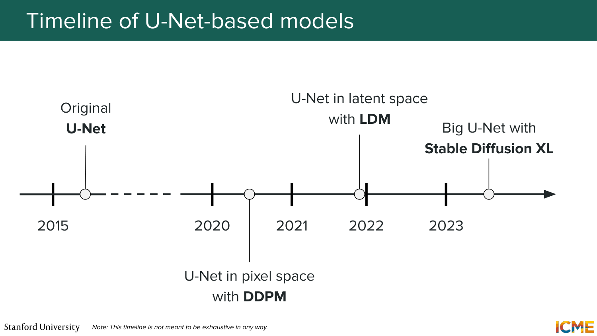

### 📝 幻灯片内容

Timeline of U-Net-based models
Original 
U-Net
2015
2020
U-Net in pixel space 
with DDPM
2021
2022
U-Net in latent space 
with LDM
2023
Big U-Net with
Stable Diffusion XL
Note: This timeline is not meant to be exhaustive in any way.

### 💡 通俗解释

*（待补充解释）*

---

## Slide 39

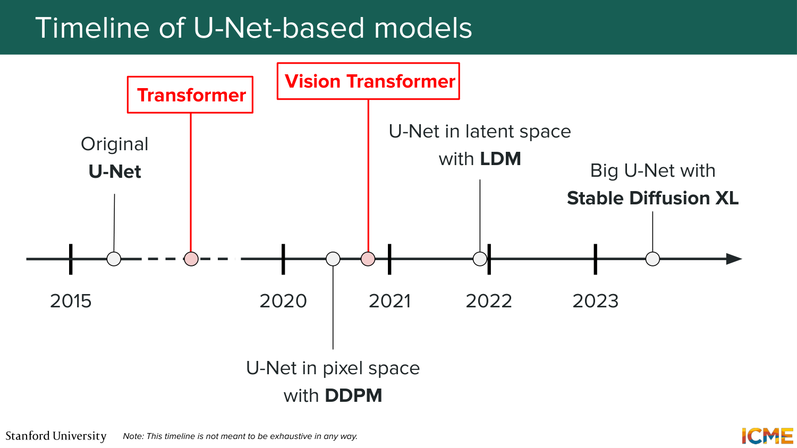

### 📝 幻灯片内容

Timeline of U-Net-based models
Original 
U-Net
2015
2020
2021
2022
U-Net in latent space 
with LDM
2023
Transformer
Vision Transformer
Note: This timeline is not meant to be exhaustive in any way.
Big U-Net with
Stable Diffusion XL
U-Net in pixel space 
with DDPM

### 💡 通俗解释

*（待补充解释）*

---

## Slide 40

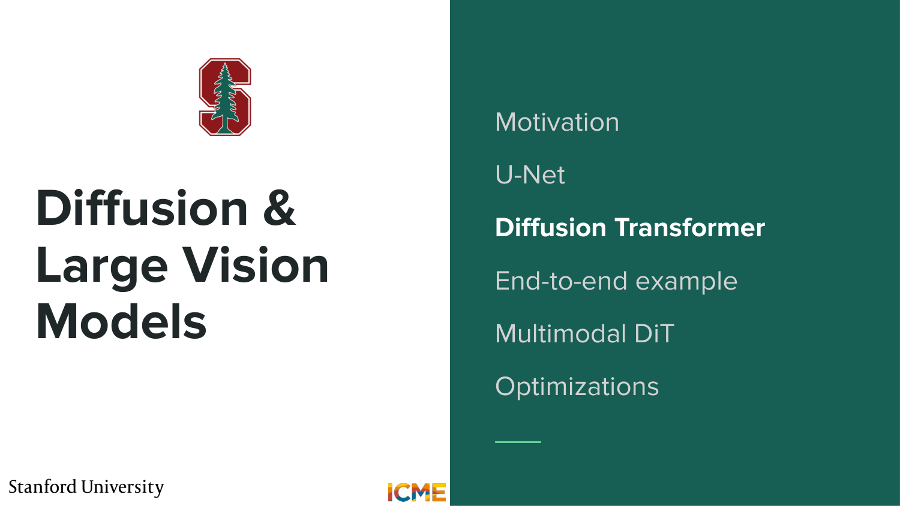

### 📝 幻灯片内容

Motivation
U-Net
Diffusion Transformer
End-to-end example
Multimodal DiT
Optimizations
Diffusion & 
Large Vision 
Models

### 💡 通俗解释

*（待补充解释）*

---

## Slide 41

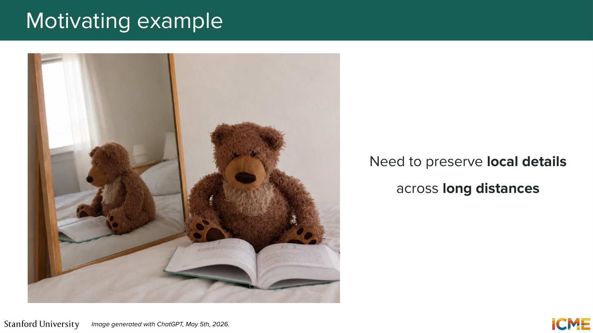

### 📝 幻灯片内容

Motivating example
Image generated with ChatGPT, May 5th, 2026.
Need to preserve local details 
across long distances

### 💡 通俗解释

*（待补充解释）*

---

## Slide 42

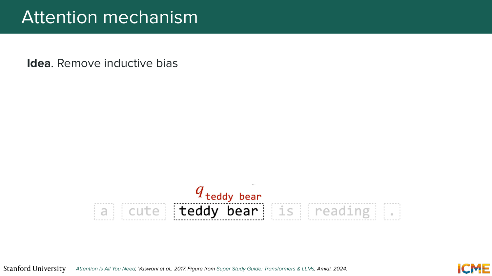

### 📝 幻灯片内容

Attention mechanism
Attention Is All You Need, Vaswani et al., 2017. Figure from Super Study Guide: Transformers & LLMs, Amidi, 2024.
Idea. Remove inductive bias

### 💡 通俗解释

*（待补充解释）*

---

## Slide 43

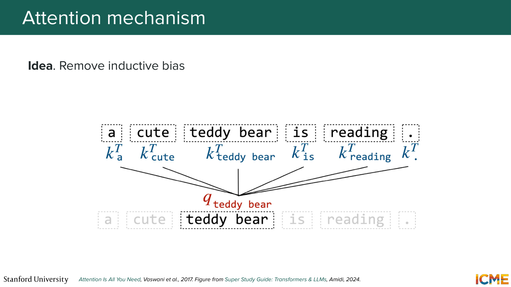

### 📝 幻灯片内容

Attention mechanism
Attention Is All You Need, Vaswani et al., 2017. Figure from Super Study Guide: Transformers & LLMs, Amidi, 2024.
Idea. Remove inductive bias

### 💡 通俗解释

*（待补充解释）*

---

## Slide 44

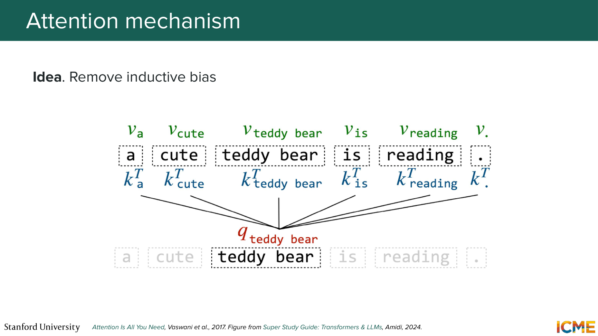

### 📝 幻灯片内容

Attention mechanism
Attention Is All You Need, Vaswani et al., 2017. Figure from Super Study Guide: Transformers & LLMs, Amidi, 2024.
Idea. Remove inductive bias

### 💡 通俗解释

*（待补充解释）*

---

## Slide 45

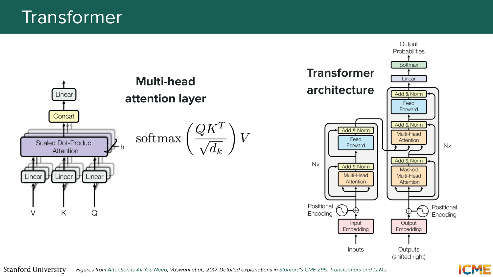

### 📝 幻灯片内容

Transformer
Figures from Attention Is All You Need, Vaswani et al., 2017. Detailed explanations in Stanford's CME 295: Transformers and LLMs.
Multi-head 
attention layer
Transformer 
architecture

### 💡 通俗解释

*（待补充解释）*

---

## Slide 46

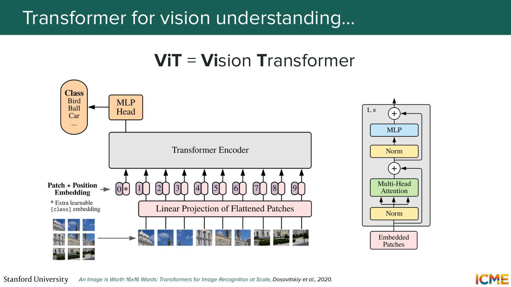

### 📝 幻灯片内容

Transformer for vision understanding…
An Image is Worth 16x16 Words: Transformers for Image Recognition at Scale, Dosovitskiy et al., 2020.
ViT = Vision Transformer

### 💡 通俗解释

*（待补充解释）*

---

## Slide 47

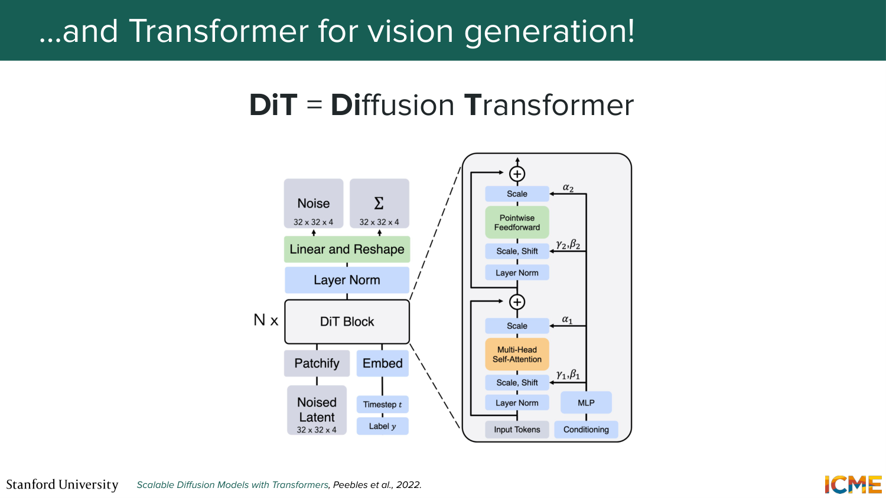

### 📝 幻灯片内容

…and Transformer for vision generation!
DiT = Diffusion Transformer
Scalable Diffusion Models with Transformers, Peebles et al., 2022.

### 💡 通俗解释

*（待补充解释）*

---

## Slide 48

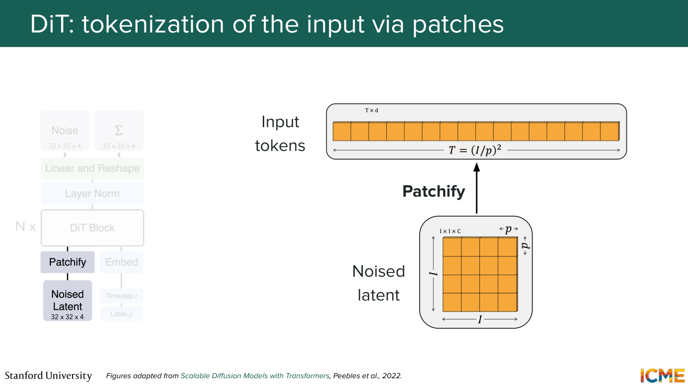

### 📝 幻灯片内容

DiT: tokenization of the input via patches
Figures adapted from Scalable Diffusion Models with Transformers, Peebles et al., 2022.
Noised 
latent
Patchify
Input 
tokens

### 💡 通俗解释

*（待补充解释）*

---

## Slide 49

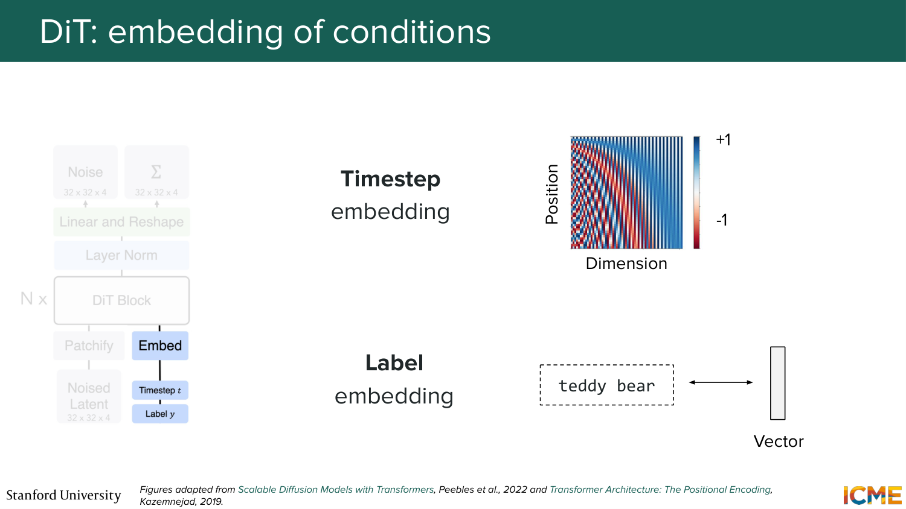

### 📝 幻灯片内容

DiT: embedding of conditions
+1
-1
Dimension
Position
Timestep 
embedding
Label 
embedding
teddy bear
Vector
Figures adapted from Scalable Diffusion Models with Transformers, Peebles et al., 2022 and Transformer Architecture: The Positional Encoding, 
Kazemnejad, 2019.

### 💡 通俗解释

*（待补充解释）*

---

## Slide 50

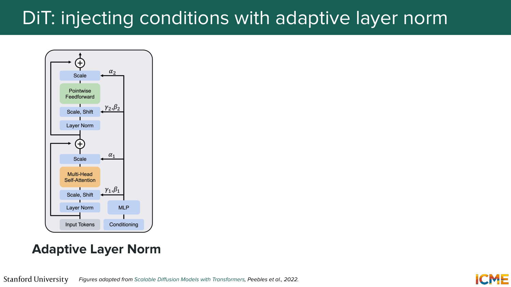

### 📝 幻灯片内容

DiT: injecting conditions with adaptive layer norm
Adaptive Layer Norm
Figures adapted from Scalable Diffusion Models with Transformers, Peebles et al., 2022.

### 💡 通俗解释

*（待补充解释）*

---

## Slide 51

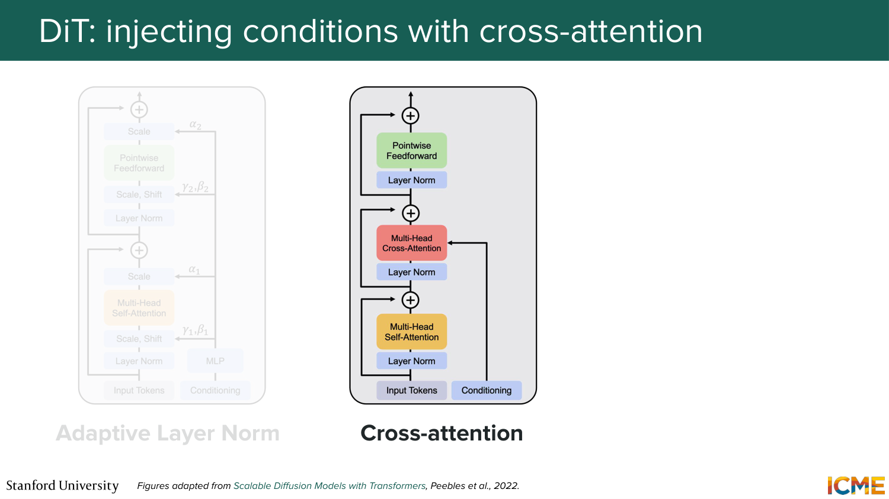

### 📝 幻灯片内容

DiT: injecting conditions with cross-attention
Adaptive Layer Norm
Cross-attention
Figures adapted from Scalable Diffusion Models with Transformers, Peebles et al., 2022.

### 💡 通俗解释

*（待补充解释）*

---

## Slide 52

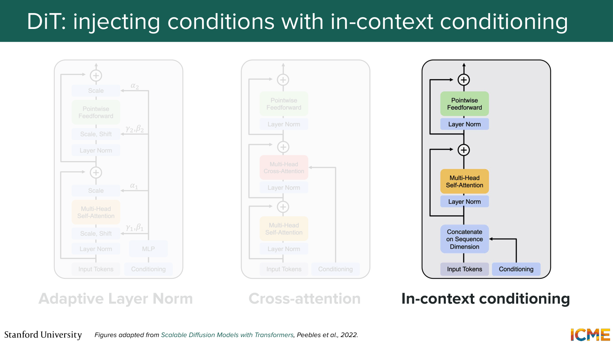

### 📝 幻灯片内容

DiT: injecting conditions with in-context conditioning
Adaptive Layer Norm
Cross-attention
In-context conditioning
Figures adapted from Scalable Diffusion Models with Transformers, Peebles et al., 2022.

### 💡 通俗解释

*（待补充解释）*

---

## Slide 53

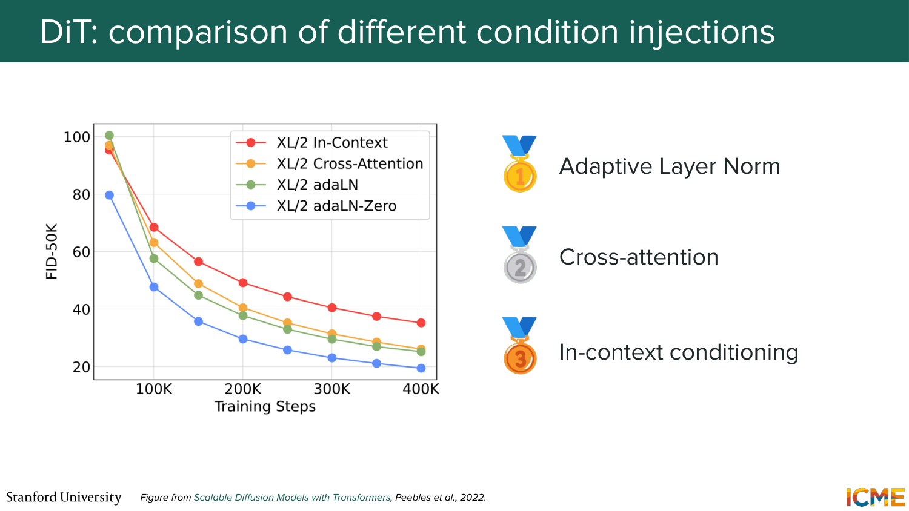

### 📝 幻灯片内容

DiT: comparison of different condition injections
🥇
🥈
🥉
Adaptive Layer Norm
Cross-attention
In-context conditioning
Figure from Scalable Diffusion Models with Transformers, Peebles et al., 2022.

### 💡 通俗解释

*（待补充解释）*

---

## Slide 54

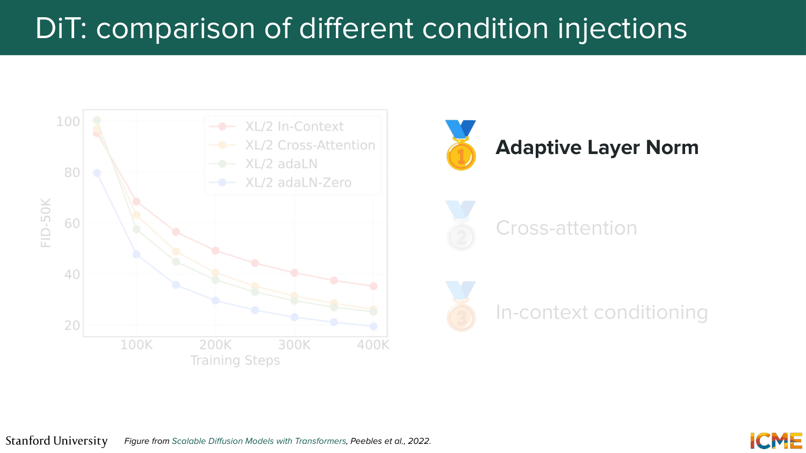

### 📝 幻灯片内容

DiT: comparison of different condition injections
🥇
🥈
🥉
Adaptive Layer Norm
Cross-attention
In-context conditioning
Figure from Scalable Diffusion Models with Transformers, Peebles et al., 2022.

### 💡 通俗解释

*（待补充解释）*

---

## Slide 55

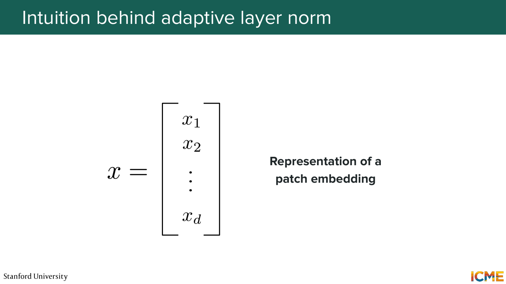

### 📝 幻灯片内容

Intuition behind adaptive layer norm
Representation of a 
patch embedding

### 💡 通俗解释

*（待补充解释）*

---

## Slide 56

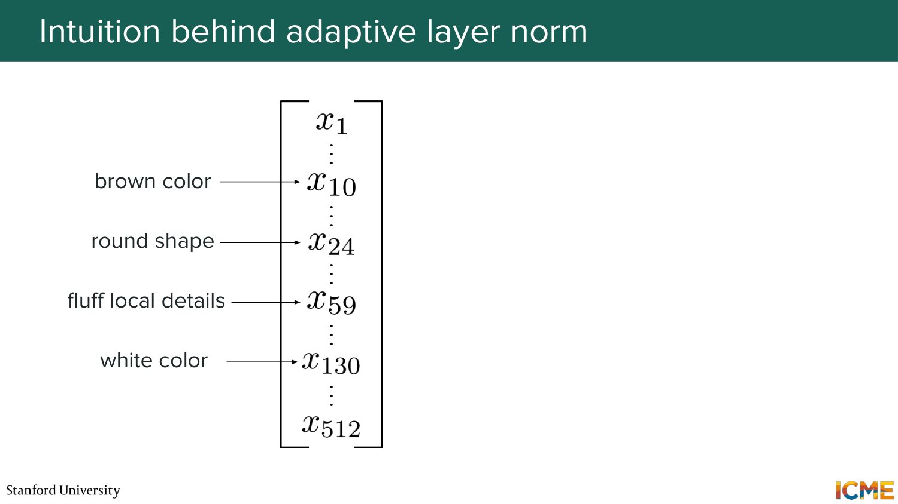

### 📝 幻灯片内容

Intuition behind adaptive layer norm
brown color
round shape
fluff local details
white color

### 💡 通俗解释

*（待补充解释）*

---

## Slide 57

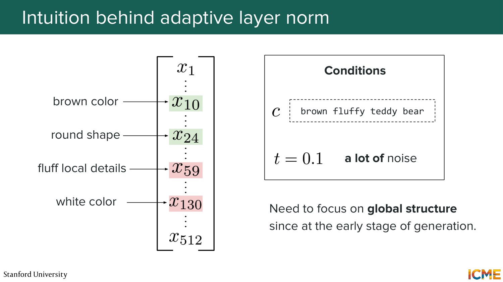

### 📝 幻灯片内容

Intuition behind adaptive layer norm
brown fluffy teddy bear
a lot of noise
brown color
round shape
fluff local details
white color
Conditions
Need to focus on global structure 
since at the early stage of generation.

### 💡 通俗解释

*（待补充解释）*

---

## Slide 58

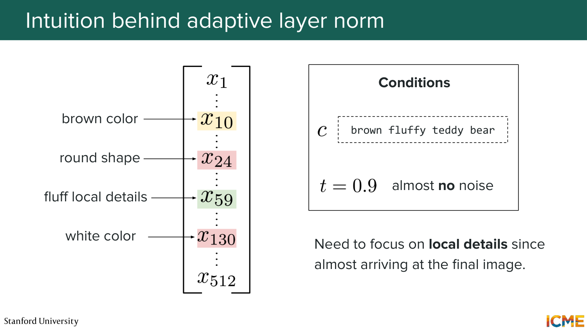

### 📝 幻灯片内容

Intuition behind adaptive layer norm
brown fluffy teddy bear
brown color
round shape
fluff local details
white color
Conditions
almost no noise
Need to focus on local details since 
almost arriving at the final image.

### 💡 通俗解释

*（待补充解释）*

---

## Slide 59

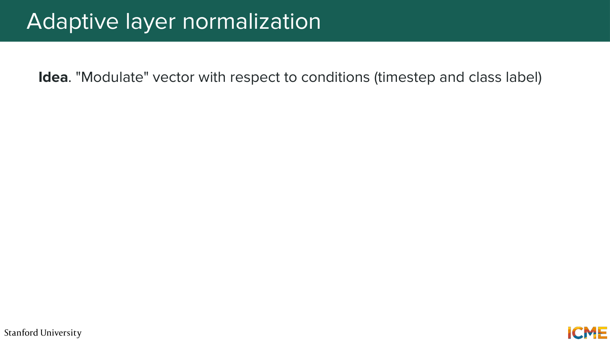

### 📝 幻灯片内容

Adaptive layer normalization
Idea. "Modulate" vector with respect to conditions (timestep and class label)

### 💡 通俗解释

*（待补充解释）*

---

## Slide 60

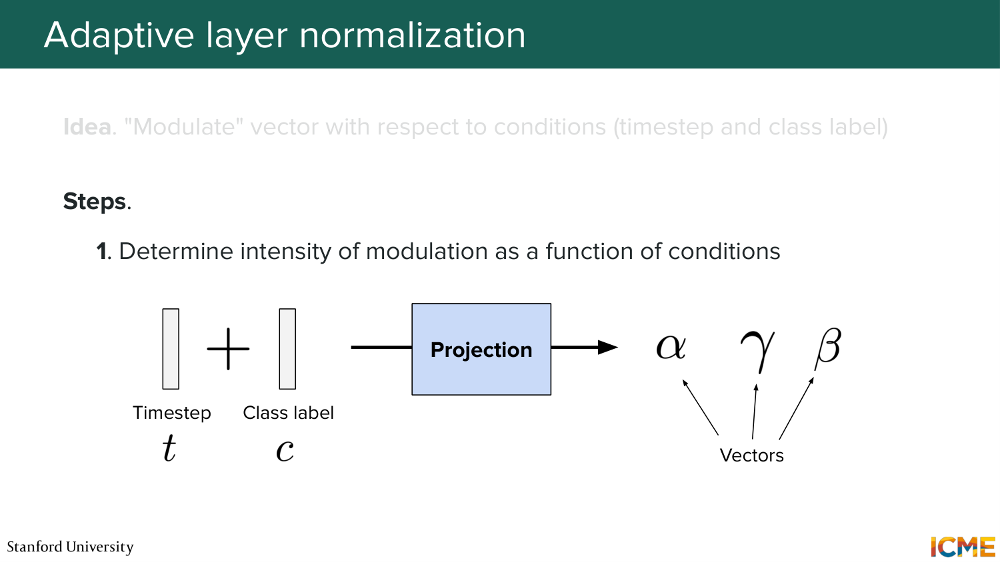

### 📝 幻灯片内容

Adaptive layer normalization
Idea. "Modulate" vector with respect to conditions (timestep and class label)
1. Determine intensity of modulation as a function of conditions
Steps.
Timestep
Class label
Projection
Vectors

### 💡 通俗解释

*（待补充解释）*

---

## Slide 61

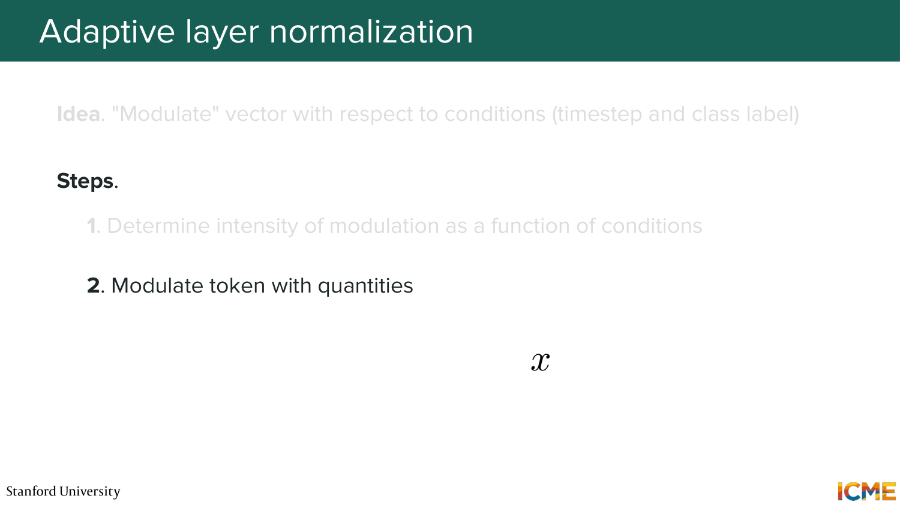

### 📝 幻灯片内容

Adaptive layer normalization
Idea. "Modulate" vector with respect to conditions (timestep and class label)
1. Determine intensity of modulation as a function of conditions
2. Modulate token with quantities
Steps.

### 💡 通俗解释

*（待补充解释）*

---

## Slide 62


### 📝 幻灯片内容

Adaptive layer normalization
Idea. "Modulate" vector with respect to conditions (timestep and class label)
1. Determine intensity of modulation as a function of conditions
2. Modulate token with quantities
Steps.

### 💡 通俗解释

*（待补充解释）*

---

## Slide 63


### 📝 幻灯片内容

Adaptive layer normalization
Idea. "Modulate" vector with respect to conditions (timestep and class label)
1. Determine intensity of modulation as a function of conditions
2. Modulate token with quantities
Steps.

### 💡 通俗解释

*（待补充解释）*

---

## Slide 64


### 📝 幻灯片内容

Adaptive layer normalization
Idea. "Modulate" vector with respect to conditions (timestep and class label)
1. Determine intensity of modulation as a function of conditions
2. Modulate token with quantities
Steps.

### 💡 通俗解释

*（待补充解释）*

---

## Slide 65


### 📝 幻灯片内容

Adaptive layer normalization
Idea. "Modulate" vector with respect to conditions (timestep and class label)
1. Determine intensity of modulation as a function of conditions
2. Modulate token with quantities
Steps.

### 💡 通俗解释

*（待补充解释）*

---

## Slide 66

### 📝 幻灯片内容

Adaptive layer normalization
Idea. "Modulate" vector with respect to conditions (timestep and class label)
1. Determine intensity of modulation as a function of conditions
2. Modulate token with quantities
Steps.

### 💡 通俗解释

*（待补充解释）*

---

## Slide 67


### 📝 幻灯片内容

Adaptive layer normalization
Idea. "Modulate" vector with respect to conditions (timestep and class label)
1. Determine intensity of modulation as a function of conditions
2. Modulate token with quantities
Steps.

### 💡 通俗解释

*（待补充解释）*

---

## Slide 68


### 📝 幻灯片内容

Adaptive layer normalization
Idea. "Modulate" vector with respect to conditions (timestep and class label)
1. Determine intensity of modulation as a function of conditions
2. Modulate token with quantities
Steps.

### 💡 通俗解释

*（待补充解释）*

---

## Slide 69


### 📝 幻灯片内容

Adaptive layer normalization
Idea. "Modulate" vector with respect to conditions (timestep and class label)
1. Determine intensity of modulation as a function of conditions
2. Modulate token with quantities
Steps.
element-wise multiplication

### 💡 通俗解释

*（待补充解释）*

---

## Slide 70


### 📝 幻灯片内容

Adaptive layer normalization
Idea. "Modulate" vector with respect to conditions (timestep and class label)
1. Determine intensity of modulation as a function of conditions
2. Modulate token with quantities
Steps.
Gate
Scale
Shift

### 💡 通俗解释

*（待补充解释）*

---

## Slide 71


### 📝 幻灯片内容

Adaptive layer normalization
Idea. "Modulate" vector with respect to conditions (timestep and class label)
1. Determine intensity of modulation as a function of conditions
2. Modulate token with quantities
Steps.
At the beginning:
adaLN-Zero

### 💡 通俗解释

*（待补充解释）*

---

## Slide 72


### 📝 幻灯片内容

●
Gate
DiT: injection of conditions with adaLN-Zero
Modulation of representation with:
Figures adapted from Scalable Diffusion Models with Transformers, Peebles et al., 2022.
●
Scale
●
Shift
as a function of

### 💡 通俗解释

*（待补充解释）*

---

## Slide 73


### 📝 幻灯片内容

DiT: reformatting the output
Tokens
Linear and Reshape
Noise
Diagonal 
covariance
Layer Norm
Figures adapted from Scalable Diffusion Models with Transformers, Peebles et al., 2022.

### 💡 通俗解释

*（待补充解释）*

---

## Slide 74


### 📝 幻灯片内容

Scaling up DiT…
Figures from Scalable Diffusion Models with Transformers, Peebles et al., 2022.
●
Number of parameters is not enough to quantify model complexity
●
FLoating-point OPerations (FLOPs) = # operations in forward pass
●
Smaller patch size corresponds to higher FLOPs

### 💡 通俗解释

*（待补充解释）*

---

## Slide 75


### 📝 幻灯片内容

Scaling up DiT… improves results!
Figures from Scalable Diffusion Models with Transformers, Peebles et al., 2022.

### 💡 通俗解释

*（待补充解释）*

---

## Slide 76


### 📝 幻灯片内容

Motivation
U-Net
Diffusion Transformer
End-to-end example
Multimodal DiT
Optimizations
Diffusion & 
Large Vision 
Models

### 💡 通俗解释

*（待补充解释）*

---

## Slide 77


### 📝 幻灯片内容

Let's go through an end-to-end example together!
Image 
generation 
model
teddy bear

### 💡 通俗解释

*（待补充解释）*

---

## Slide 78


### 📝 幻灯片内容

Sample a noisy latent
Latent space
learned by the VAE

### 💡 通俗解释

*（待补充解释）*

---

## Slide 79


### 📝 幻灯片内容

Patchify noisy latent
patches
Divide

### 💡 通俗解释

*（待补充解释）*

---

## Slide 80


### 📝 幻灯片内容

Patchify noisy latent
Patch
Patch embedding 
Perform projection

### 💡 通俗解释

*（待补充解释）*

---

## Slide 81


### 📝 幻灯片内容

Embed conditions
Timestep 
embedding
Label 
embedding
Condition 
embedding

### 💡 通俗解释

*（待补充解释）*

---

## Slide 82


### 📝 幻灯片内容

Attention layers with noisy latent

### 💡 通俗解释

*（待补充解释）*

---

## Slide 83


### 📝 幻灯片内容

Attention layers with noisy latent

### 💡 通俗解释

*（待补充解释）*

---

## Slide 84


### 📝 幻灯片内容

Attention layers with noisy latent
Patch embedding

### 💡 通俗解释

*（待补充解释）*

---

## Slide 85


### 📝 幻灯片内容

Attention layers with noisy latent
Position embedding
Patch embedding

### 💡 通俗解释

*（待补充解释）*

---

## Slide 86


### 📝 幻灯片内容

Attention layers with noisy latent
Position-aware patch embedding

### 💡 通俗解释

*（待补充解释）*

---

## Slide 87


### 📝 幻灯片内容

Attention layers with noisy latent
Position-aware patch embeddings

### 💡 通俗解释

*（待补充解释）*

---

## Slide 88


### 📝 幻灯片内容

Attention layers with noisy latent
Position-aware patch 
embeddings matrix

### 💡 通俗解释

*（待补充解释）*

---

## Slide 89


### 📝 幻灯片内容

Attention layers with noisy latent
Position-aware patch 
embeddings matrix

### 💡 通俗解释

*（待补充解释）*

---

## Slide 90


### 📝 幻灯片内容

Attention layers with noisy latent
Condition embedding
Position-aware patch 
embeddings matrix

### 💡 通俗解释

*（待补充解释）*

---

## Slide 91


### 📝 幻灯片内容

Attention layers with noisy latent
Condition embedding
Position-aware patch 
embeddings matrix
DIFFUSION TRANSFORMER BLOCK

### 💡 通俗解释

*（待补充解释）*

---

## Slide 92


### 📝 幻灯片内容

Process condition embeddings
Condition embedding
Position-aware patch 
embeddings matrix

### 💡 通俗解释

*（待补充解释）*

---

## Slide 93


### 📝 幻灯片内容

Process condition embeddings
Condition embedding
Position-aware patch 
embeddings matrix
MLP layer

### 💡 通俗解释

*（待补充解释）*

---

## Slide 94


### 📝 幻灯片内容

Obtain gate from conditions
Condition embedding
Position-aware patch 
embeddings matrix
MLP layer
Gate

### 💡 通俗解释

*（待补充解释）*

---

## Slide 95


### 📝 幻灯片内容

Obtain scale from conditions
Condition embedding
Position-aware patch 
embeddings matrix
MLP layer
Gate
Scale

### 💡 通俗解释

*（待补充解释）*

---

## Slide 96


### 📝 幻灯片内容

Obtain shift from conditions
Condition embedding
Position-aware patch 
embeddings matrix
MLP layer
Gate
Shift
Scale

### 💡 通俗解释

*（待补充解释）*

---

## Slide 97


### 📝 幻灯片内容

Obtain quantities from condition
Condition embedding
Position-aware patch 
embeddings matrix
MLP layer
Gate
Shift
Scale

### 💡 通俗解释

*（待补充解释）*

---

## Slide 98


### 📝 幻灯片内容

Process patch embeddings
Condition embedding
Position-aware patch 
embeddings matrix
MLP layer
Gate
Shift
Scale

### 💡 通俗解释

*（待补充解释）*

---

## Slide 99


### 📝 幻灯片内容

Process patch embeddings through attention
Condition embedding
Position-aware patch 
embeddings matrix
Normalize
MLP layer
Gate
Shift
Scale

### 💡 通俗解释

*（待补充解释）*

---

## Slide 100


### 📝 幻灯片内容

Process patch embeddings through attention
Condition embedding
Position-aware patch 
embeddings matrix
Normalize
Scale & shift with
MLP layer
Gate
Shift
Scale

### 💡 通俗解释

*（待补充解释）*

---

## Slide 101


### 📝 幻灯片内容

Process patch embeddings through attention
Condition embedding
Position-aware patch 
embeddings matrix
Self-attention
Normalize
Scale & shift with
MLP layer
Gate
Shift
Scale

### 💡 通俗解释

*（待补充解释）*

---

## Slide 102


### 📝 幻灯片内容

Process patch embeddings through attention
Condition embedding
Position-aware patch 
embeddings matrix
Self-attention
Scale & shift with
Gate with
MLP layer
Gate
Shift
Scale
Normalize

### 💡 通俗解释

*（待补充解释）*

---

## Slide 103


### 📝 幻灯片内容

Process patch embeddings through attention
Condition embedding
Position-aware patch 
embeddings matrix
Self-attention
Normalize
Scale & shift with
Gate with
MLP layer
Gate
Shift
Scale

### 💡 通俗解释

*（待补充解释）*

---

## Slide 104


### 📝 幻灯片内容

Process patch embeddings through attention
Condition embedding
Position-aware patch 
embeddings matrix
Self-attention
MLP layer
Gate
Shift
Scale

### 💡 通俗解释

*（待补充解释）*

---

## Slide 105


### 📝 幻灯片内容

Process patch embeddings through attention

### 💡 通俗解释

*（待补充解释）*

---

## Slide 106


### 📝 幻灯片内容

Process patch embeddings through FFNN
Condition embedding
Position-aware patch 
embeddings matrix
Self-attention
FFNN
MLP layer
Gate
Shift
Scale

### 💡 通俗解释

*（待补充解释）*

---

## Slide 107


### 📝 幻灯片内容

Process patch embeddings through FFNN

### 💡 通俗解释

*（待补充解释）*

---

## Slide 108


### 📝 幻灯片内容

Obtain output from DiT block
Condition embedding
Position-aware patch 
embeddings matrix
Self-attention
FFNN
MLP layer
Gate
Shift
Scale
Contextualized 
latent state matrix

### 💡 通俗解释

*（待补充解释）*

---

## Slide 109


### 📝 幻灯片内容

Project and reshape to desired quantity
Condition embedding
Position-aware patch 
embeddings matrix
Contextualized 
latent state matrix
Self-attention
FFNN
MLP layer
Gate
Shift
Scale
Norm, linear, 
reshape

### 💡 通俗解释

*（待补充解释）*

---

## Slide 110


### 📝 幻灯片内容

Project and reshape to desired quantity
Condition embedding
Position-aware patch 
embeddings matrix
Contextualized 
latent state matrix
Self-attention
FFNN
MLP layer
Gate
Shift
Scale
Norm, linear, 
reshape
Predicted velocity

### 💡 通俗解释

*（待补充解释）*

---

## Slide 111


### 📝 幻灯片内容

Recap of prediction
DIFFUSION TRANSFORMER
teddy bear
Class label
Timestep
Latent
Predicted velocity

### 💡 通俗解释

*（待补充解释）*

---

## Slide 112


### 📝 幻灯片内容

Deduce resulting latent
Latent space
learned by the VAE
Prediction from the DiT

### 💡 通俗解释

*（待补充解释）*

---

## Slide 113


### 📝 幻灯片内容

Deduce resulting latent
Latent space
learned by the VAE
Prediction from the DiT

### 💡 通俗解释

*（待补充解释）*

---

## Slide 114


### 📝 幻灯片内容

Deduce resulting latent
Latent space
learned by the VAE
Prediction from the DiT

### 💡 通俗解释

*（待补充解释）*

---

## Slide 115


### 📝 幻灯片内容

Perform iteration over latents
DIFFUSION TRANSFORMER
teddy bear
Class label
Timestep
Latent
Predicted velocity

### 💡 通俗解释

*（待补充解释）*

---

## Slide 116


### 📝 幻灯片内容

Perform iteration over latents
Latent space
learned by the VAE
Prediction from the DiT

### 💡 通俗解释

*（待补充解释）*

---

## Slide 117


### 📝 幻灯片内容

Perform iteration over latents
Latent space
learned by the VAE
Prediction from the DiT

### 💡 通俗解释

*（待补充解释）*

---

## Slide 118


### 📝 幻灯片内容

Perform iteration over latents
Latent space
learned by the VAE
Prediction from the DiT

### 💡 通俗解释

*（待补充解释）*

---

## Slide 119


### 📝 幻灯片内容

Obtain final latent
Latent space
learned by the VAE

### 💡 通俗解释

*（待补充解释）*

---

## Slide 120


### 📝 幻灯片内容

Decode latent back into pixel space
Decoder
Pixel space
Latent space
learned by the VAE

### 💡 通俗解释

*（待补充解释）*

---

## Slide 121


### 📝 幻灯片内容

Motivation
U-Net
Diffusion Transformer
End-to-end example
Multimodal DiT
Optimizations
Diffusion & 
Large Vision 
Models

### 💡 通俗解释

*（待补充解释）*

---

## Slide 122


### 📝 幻灯片内容

Intuition: back to the example we had
brown fluffy teddy bear
a lot of noise
brown color
round shape
fluff local details
white color
Conditions
Need to focus on global structure 
since at the early stage of generation.

### 💡 通俗解释

*（待补充解释）*

---

## Slide 123


### 📝 幻灯片内容

Intuition: back to the example we had
brown fluffy teddy bear
a lot of noise
brown color
round shape
fluff local details
white color
Conditions
Need to focus on global structure 
since at the early stage of generation.

### 💡 通俗解释

*（待补充解释）*

---

## Slide 124


### 📝 幻灯片内容

Intuition: more subtle text prompt
brown fluffy teddy bear surrounded 
by white walls
a lot of noise
brown color
round shape
fluff local details
white color
Conditions
Need to focus on global structure 
since at the early stage of generation.

### 💡 通俗解释

*（待补充解释）*

---

## Slide 125


### 📝 幻灯片内容

Intuition: more subtle text prompt
brown color
round shape
fluff local details
white color
Limitation. All patch latents are subject to 
same "modulation"

### 💡 通俗解释

*（待补充解释）*

---

## Slide 126


### 📝 幻灯片内容

Intuition: more subtle text prompt
brown color
round shape
fluff local details
white color
Limitation. All patch latents are subject to 
same "modulation"

### 💡 通俗解释

*（待补充解释）*

---

## Slide 127


### 📝 幻灯片内容

Mitigate lack of nuance of previous approach
Keep "modulating" using the timestep embedding
1
Strategy.

### 💡 通俗解释

*（待补充解释）*

---

## Slide 128


### 📝 幻灯片内容

Mitigate lack of nuance of previous approach
Keep "modulating" using the timestep embedding
Do something else to allow for more complex interaction for the condition
1
2
Strategy.
Cross-attention
Joint attention

### 💡 通俗解释

*（待补充解释）*

---

## Slide 129


### 📝 幻灯片内容

Mitigate lack of nuance of previous approach
Keep "modulating" using the timestep embedding
Do something else to allow for more complex interaction for the condition
1
2
Strategy.
Cross-attention
Joint attention

### 💡 通俗解释

*（待补充解释）*

---

## Slide 130


### 📝 幻灯片内容

Intuition behind joint attention
Patch embeddings
Condition embedding
Self-attention layer

### 💡 通俗解释

*（待补充解释）*

---

## Slide 131


### 📝 幻灯片内容

MultiModal-Diffusion Transformer
MM-DiT = MultiModal-Diffusion Transformer
Scaling Rectified Flow Transformers for High-Resolution Image Synthesis, Esser et al., 2024.
Single-stream
Everyone treated equally
●
Term coined in the Stable Diffusion 3 paper published in 2024
●
Relies on joint attention of different modalities

### 💡 通俗解释

*（待补充解释）*

---

## Slide 132


### 📝 幻灯片内容

MultiModal-Diffusion Transformer
MM-DiT = MultiModal-Diffusion Transformer
Scaling Rectified Flow Transformers for High-Resolution Image Synthesis, Esser et al., 2024.
Single-stream
Double-stream
Each modality is in its own 
stream
Everyone treated equally
●
Term coined in the Stable Diffusion 3 paper published in 2024
●
Relies on joint attention of different modalities

### 💡 通俗解释

*（待补充解释）*

---

## Slide 133


### 📝 幻灯片内容

MultiModal-Diffusion Transformer
MM-DiT = MultiModal-Diffusion Transformer
Scaling Rectified Flow Transformers for High-Resolution Image Synthesis, Esser et al., 2024.
Single-stream
Double-stream
Hybrid
Each modality is in its own 
stream
Everyone treated equally
Contains both "single-stream" 
and "double-stream" layer
●
Term coined in the Stable Diffusion 3 paper published in 2024
●
Relies on joint attention of different modalities

### 💡 通俗解释

*（待补充解释）*

---

## Slide 134


### 📝 幻灯片内容

"Double-stream" DiT variant: SD3, Qwen-Image
Figure from Qwen-Image Technical Report, Qwen Team, 2025.

### 💡 通俗解释

*（待补充解释）*

---

## Slide 135


### 📝 幻灯片内容

"Single-stream" DiT variant: Z-Image
Figure from Z-Image: An Efficient Image Generation Foundation Model with Single-Stream Diffusion Transformer, Z-Image Team, 2025.

### 💡 通俗解释

*（待补充解释）*

---

## Slide 136


### 📝 幻灯片内容

Hybrid approach: FLUX.1 Kontext
Figure from FLUX.1 Kontext: Flow Matching for In-Context Image Generation and Editing in Latent Space, Black Forest Labs, 2025.

### 💡 通俗解释

*（待补充解释）*

---

## Slide 137


### 📝 幻灯片内容

Timeline
Diffusion 
Transformer
2022
2023
2025
2024
Stable 
Diffusion 3
Qwen-Image
Single-stream
Double-stream
2026
Hybrid
FLUX.1
Z-Image
Note: This timeline is not meant to be exhaustive in any way.
"MM-DiT" 
coined

### 💡 通俗解释

*（待补充解释）*

---

## Slide 138

### 📝 幻灯片内容

Motivation
U-Net
Diffusion Transformer
End-to-end example
Multimodal DiT
Optimizations
Diffusion & 
Large Vision 
Models

### 💡 通俗解释

*（待补充解释）*

---

## Slide 139


### 📝 幻灯片内容

Need for position information
Motivation. Direct links "lose" position info
close
Figure from Super Study Guide: Transformers & Large Language Models, Amidi et al., 2024.

### 💡 通俗解释

*（待补充解释）*

---

## Slide 140


### 📝 幻灯片内容

Need for position information
Motivation. Direct links "lose" position info
far
Figure from Super Study Guide: Transformers & Large Language Models, Amidi et al., 2024.

### 💡 通俗解释

*（待补充解释）*

---

## Slide 141


### 📝 幻灯片内容

Need for position information
Hope. Dot products convey distance between token representations
"
"

### 💡 通俗解释

*（待补充解释）*

---

## Slide 142


### 📝 幻灯片内容

Absolute positional embeddings
Idea. Add position-specific embedding to token vector
Figure adapted from Attention Is All You Need, Vaswani et al., 2017.

### 💡 通俗解释

*（待补充解释）*

---

## Slide 143


### 📝 幻灯片内容

Absolute positional embeddings
Idea. Add position-specific embedding to token vector
 = some terms +
What choice for position embeddings?
Figure adapted from Attention Is All You Need, Vaswani et al., 2017.

### 💡 通俗解释

*（待补充解释）*

---

## Slide 144


### 📝 幻灯片内容

Hardcoded position embeddings
2i
2i+1
. . .
. . .
Position
Proposal. A mix of sines and cosines.
between 0 and 1

### 💡 通俗解释

*（待补充解释）*

---

## Slide 145


### 📝 幻灯片内容

Hardcoded position embeddings
2i
2i+1
. . .
. . .
Position
Proposal. A mix of sines and cosines.
greater than sequence 
lengths

### 💡 通俗解释

*（待补充解释）*

---

## Slide 146


### 📝 幻灯片内容

Hardcoded position embeddings
Figure from Transformer Architecture: The Positional Encoding, Kazemnejad, 2019.
Position embeddings values
Dimension depth
Sequence 
position
high frequency
low frequency

### 💡 通俗解释

*（待补充解释）*

---

## Slide 147


### 📝 幻灯片内容

Hardcoded position embeddings
2i
2i+1
. . .
. . .
Position
with

### 💡 通俗解释

*（待补充解释）*

---

## Slide 148


### 📝 幻灯片内容

Hardcoded position embeddings
2i
2i+1
. . .
. . .
Position
2i
2i+1
. . .
. . .
Position

### 💡 通俗解释

*（待补充解释）*

---

## Slide 149


### 📝 幻灯片内容

Hardcoded position embeddings
Property:

### 💡 通俗解释

*（待补充解释）*

---

## Slide 150


### 📝 幻灯片内容

Hardcoded position embeddings
~all cosines drop
high frequency terms 
cancel out
residual low 
frequency terms

### 💡 通俗解释

*（待补充解释）*

---

## Slide 151

### 📝 幻灯片内容

Discussion
Benefits.
●
Simple to implement
●
Does the job well as a baseline
●
Gives every position a direct representational identity

### 💡 通俗解释

*（待补充解释）*

---

## Slide 152


### 📝 幻灯片内容

Discussion
Benefits.
●
Simple to implement
●
Does the job well as a baseline
●
Gives every position a direct representational identity
Limitations. 
●
Doesn't seem to be injected at the appropriate place
●
Side effect: extra interaction terms
●
Position embedding also makes it to value embeddings

### 💡 通俗解释

*（待补充解释）*

---

## Slide 153


### 📝 幻灯片内容

Absolute position embeddings
Who used it?
Figures adapted from Attention Is All You Need, Vaswani et al., 2017, An Image is Worth 16x16 Words: Transformers for Image Recognition at Scale, 
Dosovitskiy et al., 2020, Scalable Diffusion Models with Transformers, Peebles et al., 2022.
Original Transformer
2017
Original ViT
2020
Original DiT
2022

### 💡 通俗解释

*（待补充解释）*

---

## Slide 154


### 📝 幻灯片内容

From absolute to relative position info
Refinement. Any way to move position information to where it's intuitively needed?
Figure adapted from Attention Is All You Need, Vaswani et al., 2017.

### 💡 通俗解释

*（待补充解释）*

---

## Slide 155


### 📝 幻灯片内容

Default choice nowadays: rotations in attention layer
Idea. Rotate query and key vectors with rotation matrix
RoPE = Rotary Position Embeddings
RoFormer: Enhanced Transformer with Rotary Position Embeddings, Su et al., 2021.
Figure from Super Study Guide: Transformers & Large Language Models, Amidi et al., 2024.
queries
keys

### 💡 通俗解释

*（待补充解释）*

---

## Slide 156


### 📝 幻灯片内容

Default choice nowadays: rotations in attention layer
Benefits. Relative distance nicely captured:
RoFormer: Enhanced Transformer with Rotary Position Embeddings, Su et al., 2021.
effective rotation by angle

### 💡 通俗解释

*（待补充解释）*

---

## Slide 157


### 📝 幻灯片内容

Generalization to 2D?
Text.
1
2
3
4
5
6
...
✅

### 💡 通俗解释

*（待补充解释）*

---

## Slide 158


### 📝 幻灯片内容

1
2
3
4
5
6
7
8
9
Generalization to 2D?
Text.
1
Images.
2
3
4
5
6
...
✅
❓

### 💡 通俗解释

*（待补充解释）*

---

## Slide 159


### 📝 幻灯片内容

Generalization to 2D?
First idea. Axial RoPE
1D
2D
even indices
odd indices
Rotary Position Embedding for Vision Transformer, Heo et al., 2024.

### 💡 通俗解释

*（待补充解释）*

---

## Slide 160


### 📝 幻灯片内容

Generalization to 2D?
Problems. No cross axes interactions + segregated information is arbitrary
no interaction!
Rotary Position Embedding for Vision Transformer, Heo et al., 2024.

### 💡 通俗解释

*（待补充解释）*

---

## Slide 161


### 📝 幻灯片内容

2D RoPE
Proposal. Mix both axes as part of the same rotation matrix
Rotary Position Embedding for Vision Transformer, Heo et al., 2024.

### 💡 通俗解释

*（待补充解释）*

---

## Slide 162


### 📝 幻灯片内容

2D RoPE
Consequence. Avoid axes artifacts.
Figure from Rotary Position Embedding for Vision Transformer, Heo et al., 2024.
2D Axial RoPE
2D Mixed RoPE
Patch position

### 💡 通俗解释

*（待补充解释）*

---

## Slide 163


### 📝 幻灯片内容

Scaling RoPE
Common case. Resolution variations?
vs
0,0
2,0
0,2
0,0
0,5
5,0

### 💡 通俗解释

*（待补充解释）*

---

## Slide 164


### 📝 幻灯片内容

0,0
2,0
0,2
0,0
0,5
5,0
Scaling RoPE
Problem. Spatial meaning also changes.
vs
"center"
"center"

### 💡 通俗解释

*（待补充解释）*

---

## Slide 165


### 📝 幻灯片内容

Scaling RoPE
Remedy. Scale to canonical coordinates.
vs
-1,-1
1,-1
-1,1
-3,-3
-3,2
2,-3
0,0
≈ 0,0
Seedream 2.0: A Native Chinese-English Bilingual Image Generation Foundation Model, Gong et al., 2025.

### 💡 通俗解释

*（待补充解释）*

---

## Slide 166


### 📝 幻灯片内容

Multimodal RoPE
Qwen-Image Technical Report, Wu et al., 2025.
Potential area of interest
Common case. Multimodality?

### 💡 通俗解释

*（待补充解释）*

---

## Slide 167


### 📝 幻灯片内容

Multimodal RoPE
2D
1D
How to reconcile the two?

### 💡 通俗解释

*（待补充解释）*

---

## Slide 168


### 📝 幻灯片内容

Multimodal RoPE
Qwen-Image Technical Report, Wu et al., 2025.
...
MSRoPE = Multimodal Scalable RoPE
Benefits.
●
Image and text can cohabit without 
interference

### 💡 通俗解释

*（待补充解释）*

---

## Slide 169


### 📝 幻灯片内容

Multimodal RoPE
Qwen-Image Technical Report, Wu et al., 2025.
...
MSRoPE = Multimodal Scalable RoPE
Benefits.
●
Image and text can cohabit without 
interference  
●
Text is functionally equivalent to 1D 
RoPE

### 💡 通俗解释

*（待补充解释）*

---

## Slide 170


### 📝 幻灯片内容

Conclusion
Embedding positions = open problem.
●
Many variations out there
●
Dust hasn't settled yet
●
Trade-offs

### 💡 通俗解释

*（待补充解释）*

---

## Slide 171

### 💡 通俗解释

*（待补充解释）*

---
