# Stanford CME 296 - Lecture 7: Evaluation (FID, CLIPScore, MLLM-as-a-Judge)

> **课程**: Stanford CME 296 - Diffusion & Large Vision Models
> **讲师**: Afshine Amidi & Shervine Amidi
> **视频**: [YouTube 1:41:12](https://www.youtube.com/watch?v=iNaRBp4T57Q&list=PLoROMvodv4rNdy8rt2rZ4T2xM0OjADnfu&index=7)
> **Slides PDF**: [spring26-cme296-lecture7.pdf](../spring26-cme296-lecture7.pdf)
> **总页数**: 137 页幻灯片

---

## Slide 1

### 📝 幻灯片内容

CME 296: Diffusion &
Large Vision Models
Afshine Amidi & Shervine Amidi
Lecture 7

### 💡 通俗解释

*（待补充解释）*

---

## Slide 2

### 💡 通俗解释

*（待补充解释）*

---

## Slide 3

### 📝 幻灯片内容

Recap of last episode…
Logit-Normal distribution
Figure from Scaling Rectified Flow Transformers for High-Resolution Image Synthesis, Esser et al., 2024.

### 💡 通俗解释

*（待补充解释）*

---

## Slide 4

### 📝 幻灯片内容

Recap of last episode…
Logit-Normal distribution
Figure from Scaling Rectified Flow Transformers for High-Resolution Image Synthesis, Esser et al., 2024.

### 💡 通俗解释

*（待补充解释）*

---

## Slide 5

### 📝 幻灯片内容

Recap of last episode…
Pre-training
🖼
Learn how to 
generate images
1

### 💡 通俗解释

*（待补充解释）*

---

## Slide 6

### 📝 幻灯片内容

Recap of last episode…
Pre-training
Post-training
🖼
😃
Learn how to 
generate images
Learn how to 
generate good 
images
1
2

### 💡 通俗解释

*（待补充解释）*

---

## Slide 7

### 📝 幻灯片内容

Recap of last episode…
Pre-training
Post-training
Tuning
🖼
😃
⚙
Learn how to 
generate images
Learn how to 
generate good 
images
Learn how to 
generate images 
for a special case
1
2
3

### 💡 通俗解释

*（待补充解释）*

---

## Slide 8

### 📝 幻灯片内容

Recap of last episode…
Pre-training
Post-training
Tuning
Distillation
⚡
🖼
😃
⚙
Learn how to 
generate images
Learn how to 
generate good 
images
Learn how to 
generate images 
for a special case
Learn how to 
generate images, 
fast
1
2
3
4

### 💡 通俗解释

*（待补充解释）*

---

## Slide 9

### 📝 幻灯片内容

Today's lecture
A teddy bear 
reading a book
Generation 
model
Today's lecture: Evaluation
Evaluation

### 💡 通俗解释

*（待补充解释）*

---

## Slide 10

### 📝 幻灯片内容

Setup
Input prompt
A teddy bear 
reading a book
Image
Generation 
model

### 💡 通俗解释

*（待补充解释）*

---

## Slide 11

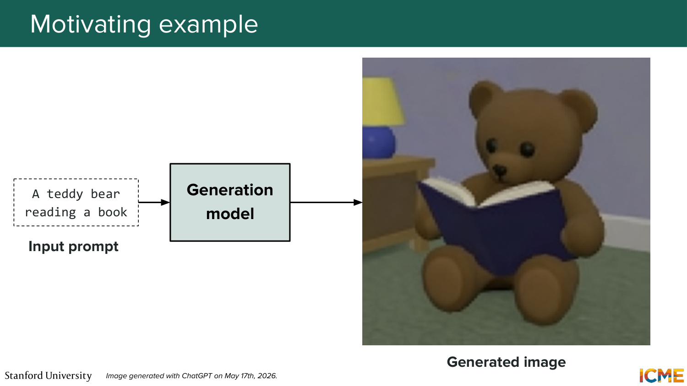

### 📝 幻灯片内容

Motivating example
Generated image
Generation 
model
Input prompt
A teddy bear 
reading a book
Image generated with ChatGPT on May 17th, 2026.

### 💡 通俗解释

*（待补充解释）*

---

## Slide 12

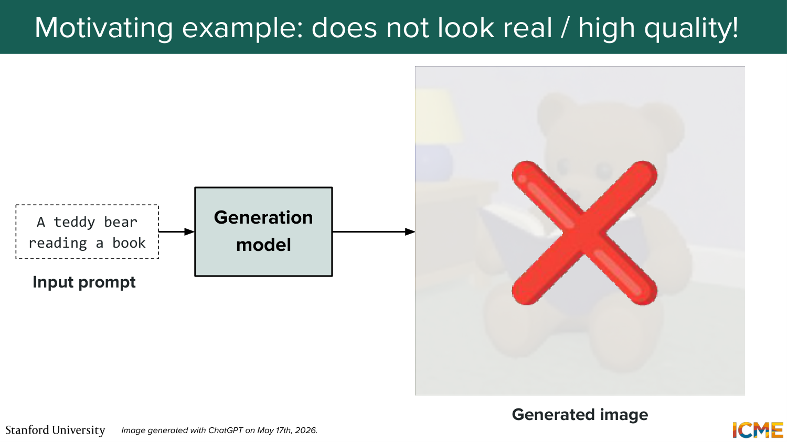

### 📝 幻灯片内容

Motivating example: does not look real / high quality!
Generation 
model
Input prompt
A teddy bear 
reading a book
Image generated with ChatGPT on May 17th, 2026.
❌
Generated image

### 💡 通俗解释

*（待补充解释）*

---

## Slide 13

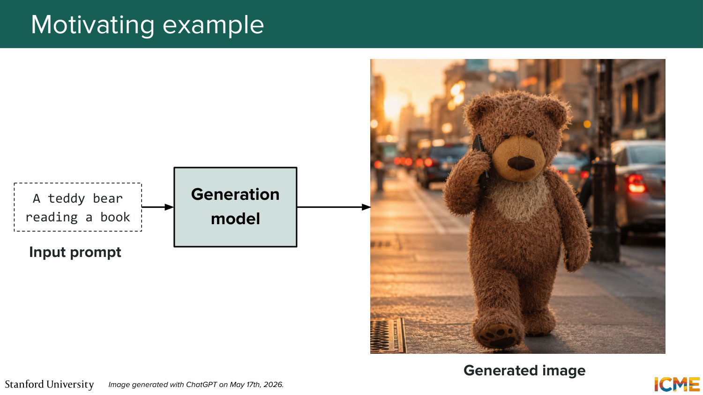

### 📝 幻灯片内容

Motivating example
Generated image
Generation 
model
Input prompt
A teddy bear 
reading a book
Image generated with ChatGPT on May 17th, 2026.

### 💡 通俗解释

*（待补充解释）*

---

## Slide 14

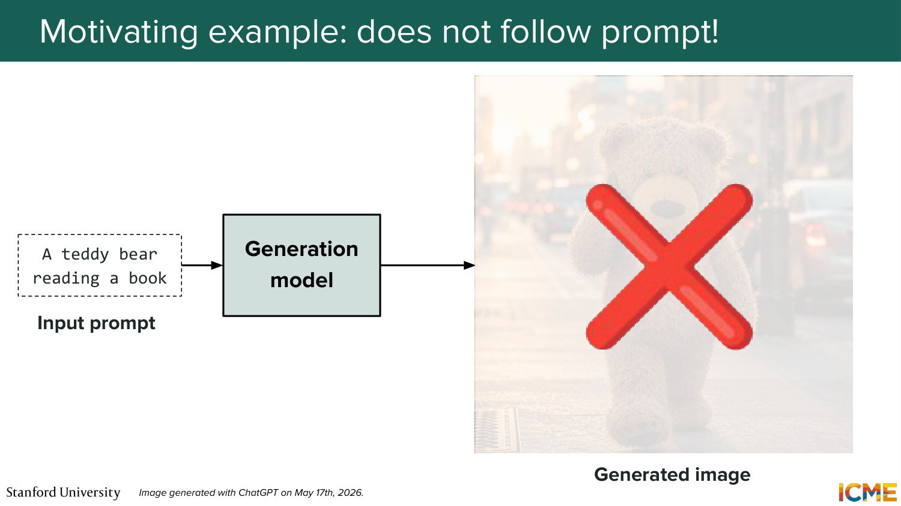

### 📝 幻灯片内容

Motivating example: does not follow prompt!
Generated image
Generation 
model
Input prompt
A teddy bear 
reading a book
❌
Image generated with ChatGPT on May 17th, 2026.

### 💡 通俗解释

*（待补充解释）*

---

## Slide 15

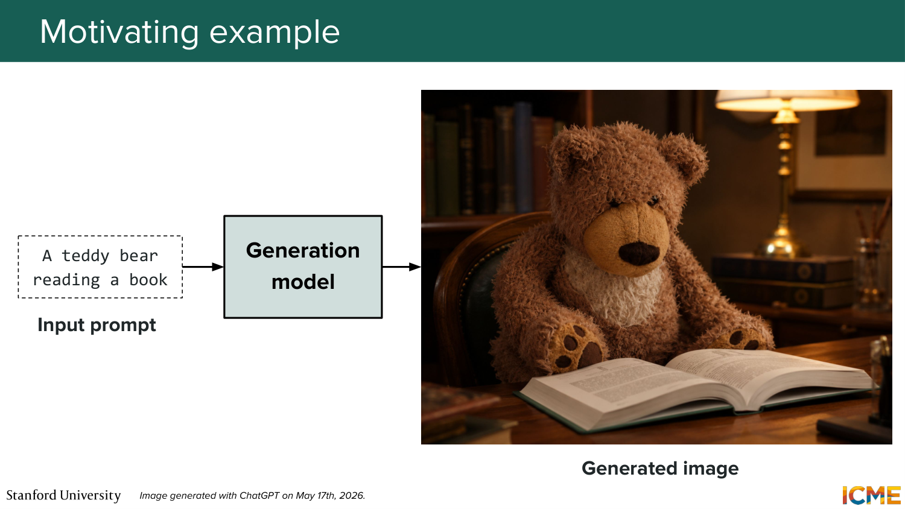

### 📝 幻灯片内容

Motivating example
Generation 
model
Input prompt
A teddy bear 
reading a book
Generated image
Image generated with ChatGPT on May 17th, 2026.

### 💡 通俗解释

*（待补充解释）*

---

## Slide 16

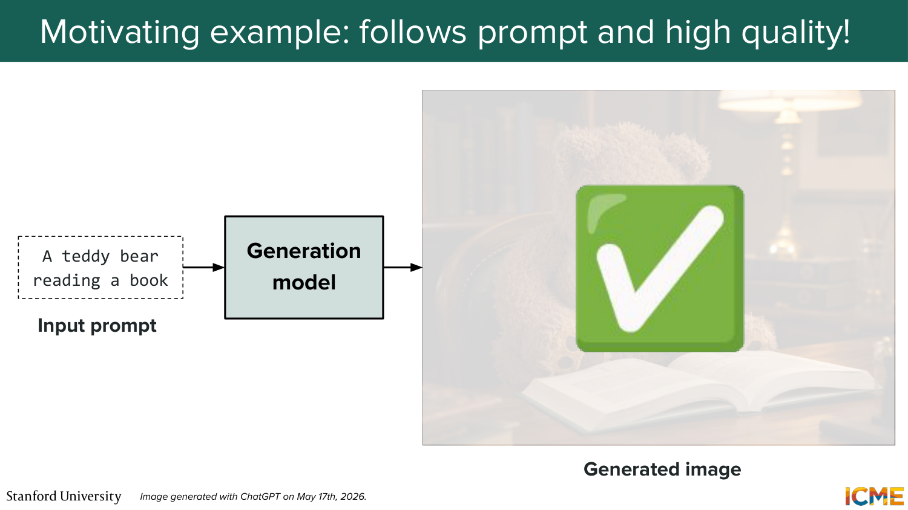

### 📝 幻灯片内容

Motivating example: follows prompt and high quality!
Generation 
model
Input prompt
A teddy bear 
reading a book
✅
Image generated with ChatGPT on May 17th, 2026.
Generated image

### 💡 通俗解释

*（待补充解释）*

---

## Slide 17

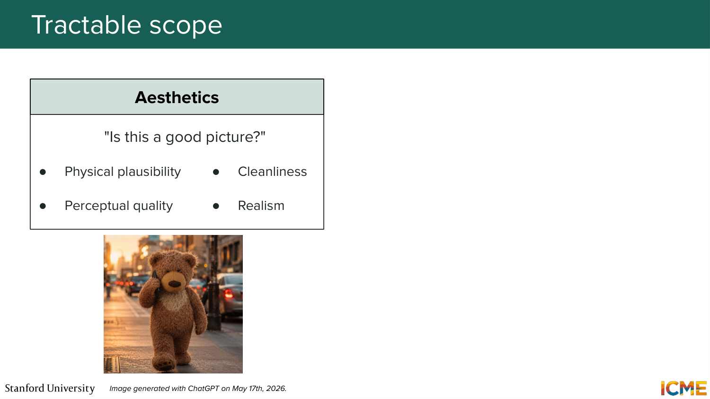

### 📝 幻灯片内容

Tractable scope
Aesthetics
"Is this a good picture?"
●
Physical plausibility
●
Cleanliness
●
Perceptual quality
●
Realism
Image generated with ChatGPT on May 17th, 2026.

### 💡 通俗解释

*（待补充解释）*

---

## Slide 18

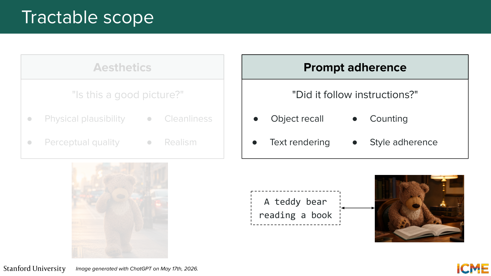

### 📝 幻灯片内容

Tractable scope
Aesthetics
"Is this a good picture?"
Prompt adherence
"Did it follow instructions?"
●
Physical plausibility
●
Cleanliness
●
Perceptual quality
●
Realism
●
Object recall
●
Counting
●
Text rendering
●
Style adherence
A teddy bear 
reading a book
Image generated with ChatGPT on May 17th, 2026.

### 💡 通俗解释

*（待补充解释）*

---

## Slide 19

### 📝 幻灯片内容

…but not exhaustive!
Other notable dimensions.
●
🛡 Safety
●
🧩 Diversity
●
🧠 Memorization
●
🔍 Bias

### 💡 通俗解释

*（待补充解释）*

---

## Slide 20

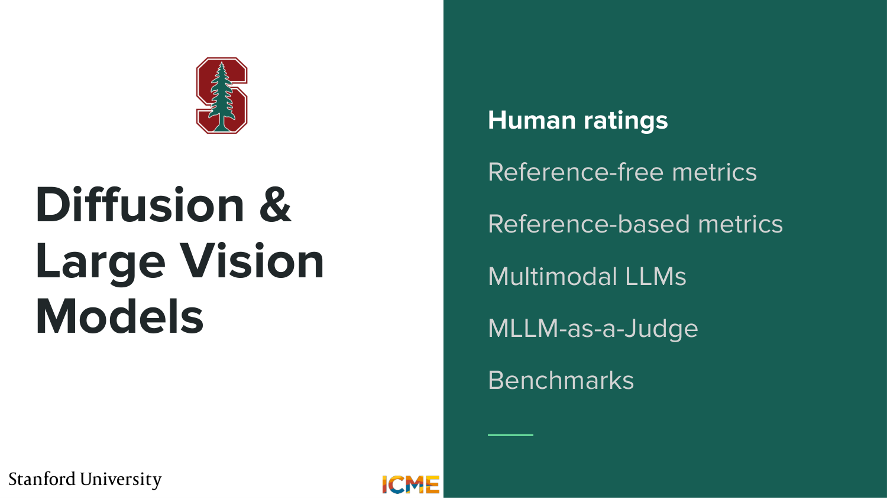

### 📝 幻灯片内容

Human ratings
Reference-free metrics
Reference-based metrics
Multimodal LLMs
MLLM-as-a-Judge
Benchmarks
Diffusion & 
Large Vision 
Models

### 💡 通俗解释

*（待补充解释）*

---

## Slide 21

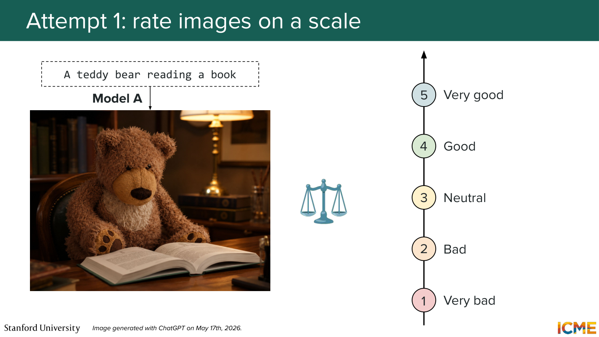

### 📝 幻灯片内容

Attempt 1: rate images on a scale
A teddy bear reading a book
Very good
Good
Neutral
Bad
Very bad
⚖
Image generated with ChatGPT on May 17th, 2026.
Model A
5
4
3
2
1

### 💡 通俗解释

*（待补充解释）*

---

## Slide 22

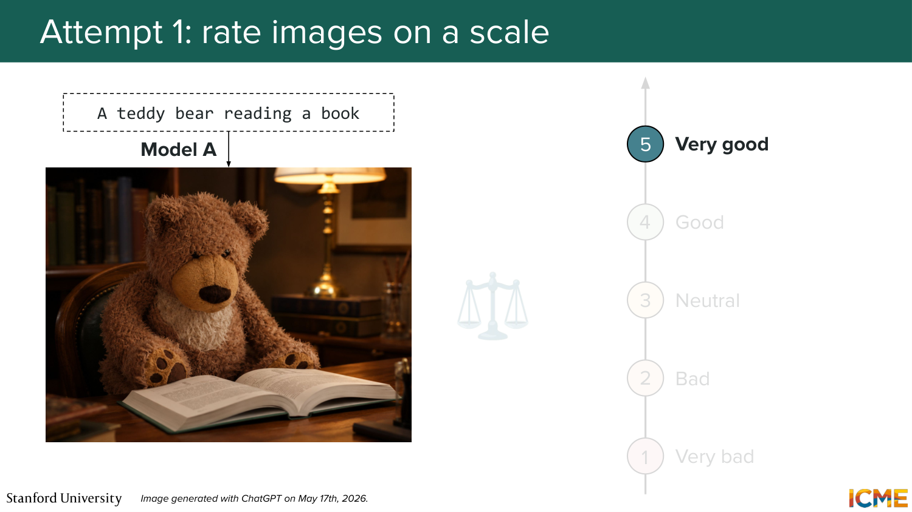

### 📝 幻灯片内容

Attempt 1: rate images on a scale
A teddy bear reading a book
Very good
Good
Neutral
Bad
Very bad
⚖
Image generated with ChatGPT on May 17th, 2026.
Model A
4
3
2
1
5

### 💡 通俗解释

*（待补充解释）*

---

## Slide 23

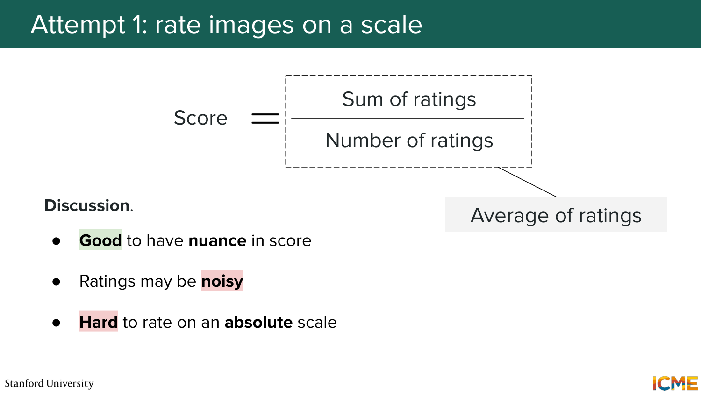

### 📝 幻灯片内容

Attempt 1: rate images on a scale
Score
Average of ratings
Discussion.
●
Good to have nuance in score
●
Ratings may be noisy
●
Hard to rate on an absolute scale
Sum of ratings
Number of ratings

### 💡 通俗解释

*（待补充解释）*

---

## Slide 24

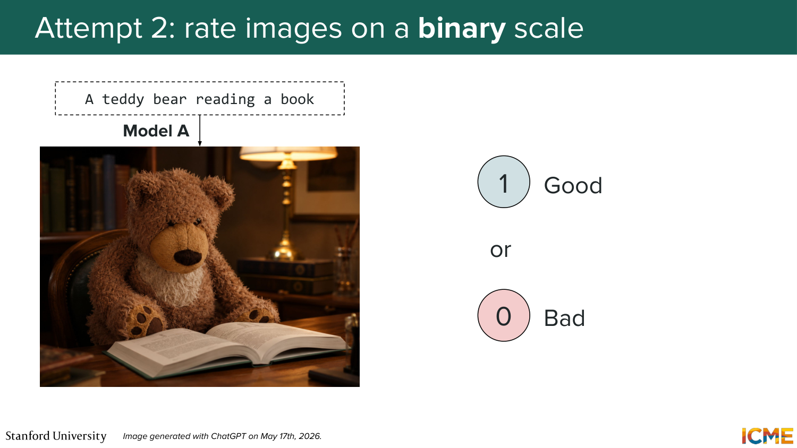

### 📝 幻灯片内容

Attempt 2: rate images on a binary scale
Good
Bad
or
A teddy bear reading a book
Image generated with ChatGPT on May 17th, 2026.
1
0
Model A

### 💡 通俗解释

*（待补充解释）*

---

## Slide 25

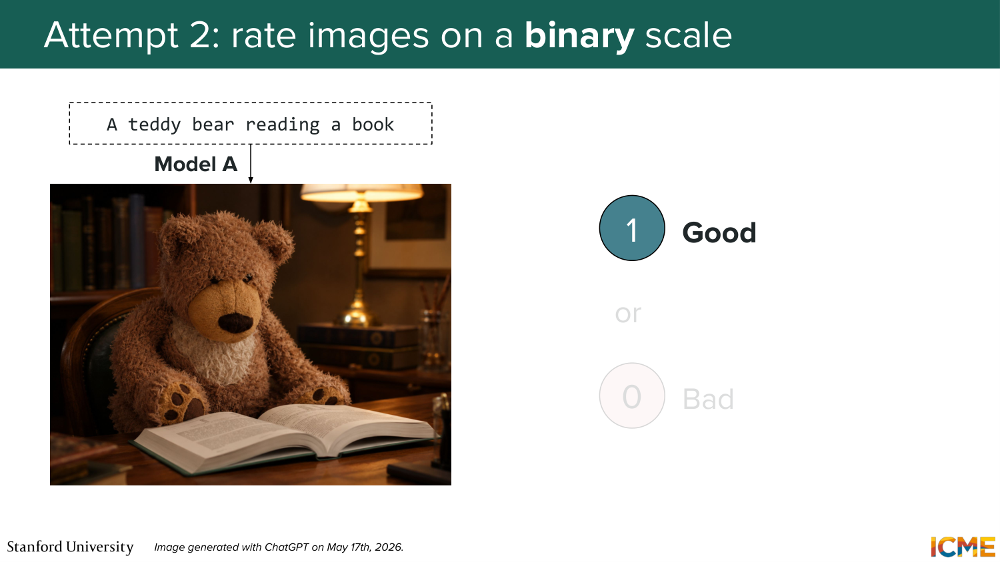

### 📝 幻灯片内容

Attempt 2: rate images on a binary scale
Good
Bad
or
A teddy bear reading a book
Image generated with ChatGPT on May 17th, 2026.
1
0
Model A

### 💡 通俗解释

*（待补充解释）*

---

## Slide 26

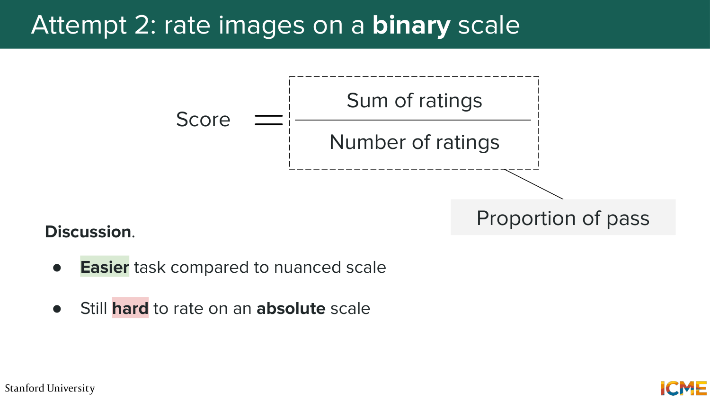

### 📝 幻灯片内容

Attempt 2: rate images on a binary scale
Discussion.
●
Easier task compared to nuanced scale
●
Still hard to rate on an absolute scale
Score
Proportion of pass
Sum of ratings
Number of ratings

### 💡 通俗解释

*（待补充解释）*

---

## Slide 27

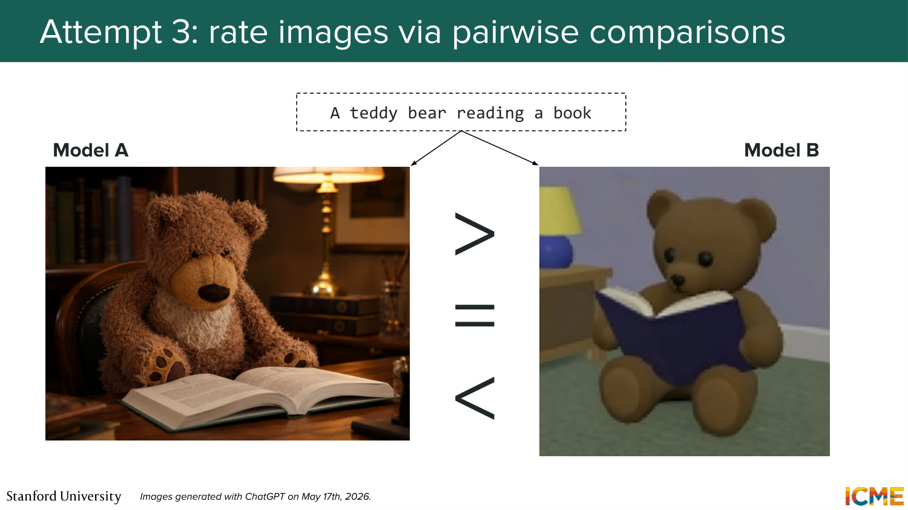

### 📝 幻灯片内容

Attempt 3: rate images via pairwise comparisons
A teddy bear reading a book
>
=
<
Images generated with ChatGPT on May 17th, 2026.
Model A
Model B

### 💡 通俗解释

*（待补充解释）*

---

## Slide 28

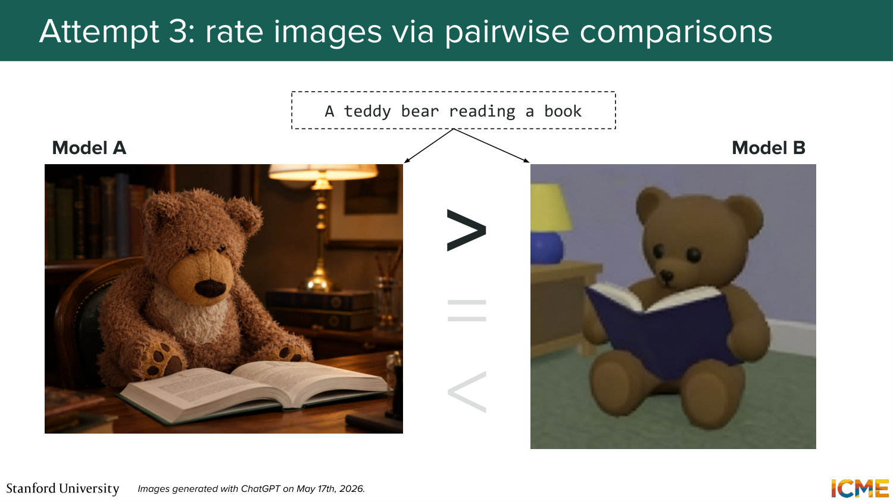

### 📝 幻灯片内容

Attempt 3: rate images via pairwise comparisons
A teddy bear reading a book
Images generated with ChatGPT on May 17th, 2026.
Model A
Model B
>
=
<

### 💡 通俗解释

*（待补充解释）*

---

## Slide 29

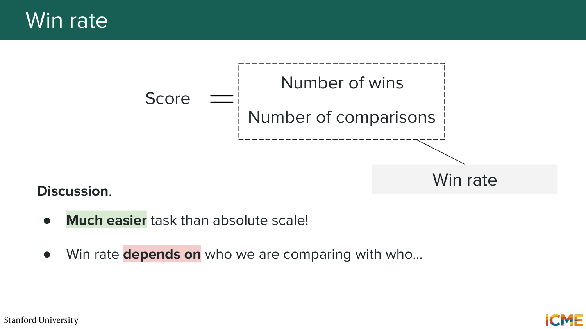

### 📝 幻灯片内容

Win rate
Score
Win rate
Number of wins
Number of comparisons
Discussion.
●
Much easier task than absolute scale!
●
Win rate depends on who we are comparing with who…

### 💡 通俗解释

*（待补充解释）*

---

## Slide 30

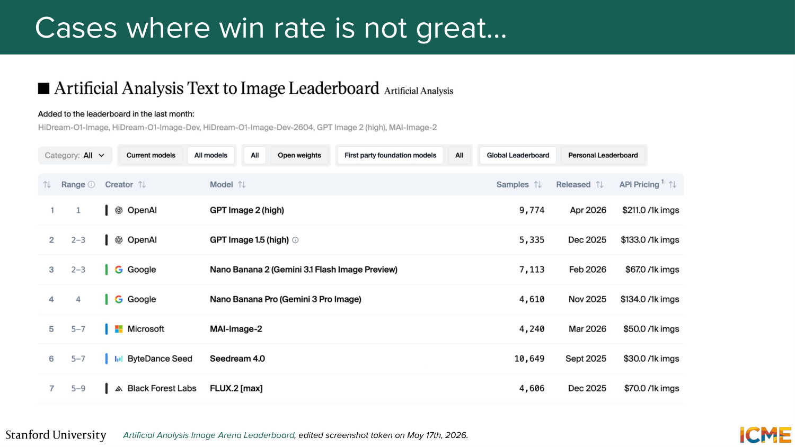

### 📝 幻灯片内容

Cases where win rate is not great…
Artificial Analysis Image Arena Leaderboard, edited screenshot taken on May 17th, 2026.

### 💡 通俗解释

*（待补充解释）*

---

## Slide 31

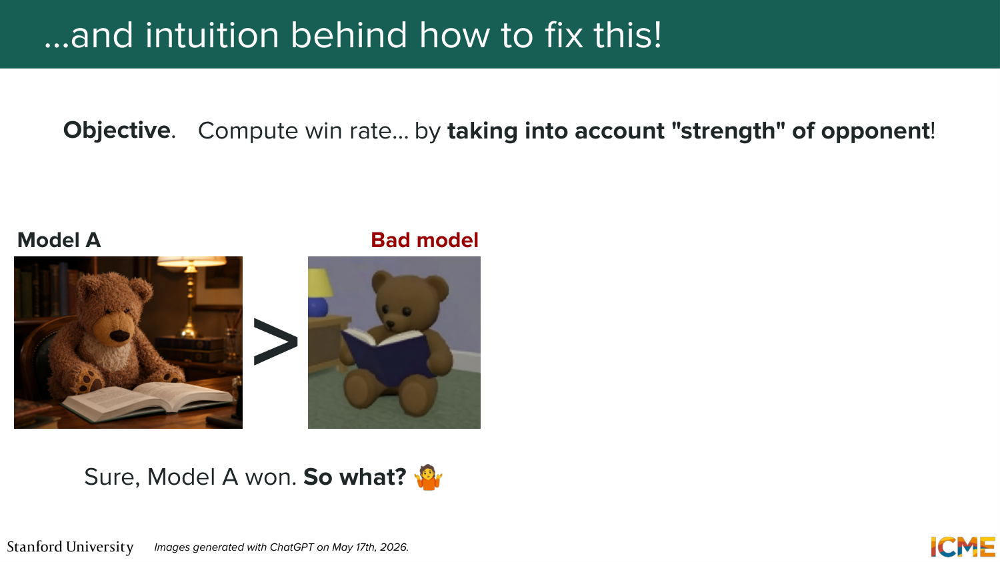

### 📝 幻灯片内容

…and intuition behind how to fix this!
Objective.
Compute win rate… by taking into account "strength" of opponent!
Sure, Model A won. So what? 🤷
>
Images generated with ChatGPT on May 17th, 2026.
Model A
Bad model

### 💡 通俗解释

*（待补充解释）*

---

## Slide 32

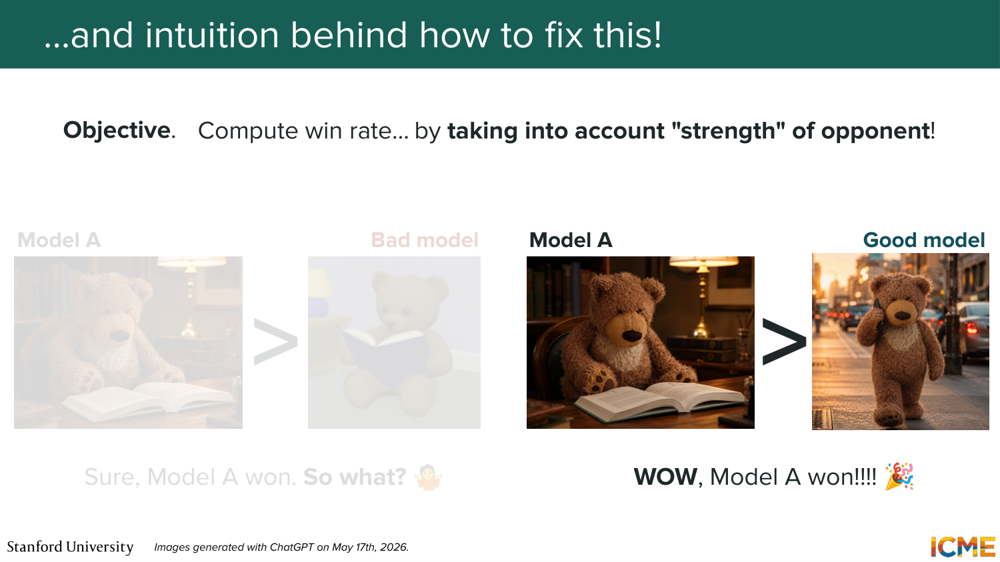

### 📝 幻灯片内容

…and intuition behind how to fix this!
Objective.
Compute win rate… by taking into account "strength" of opponent!
Sure, Model A won. So what? 🤷
WOW, Model A won!!!! 🎉
>
>
Images generated with ChatGPT on May 17th, 2026.
Model A
Bad model
Model A
Good model

### 💡 通俗解释

*（待补充解释）*

---

## Slide 33

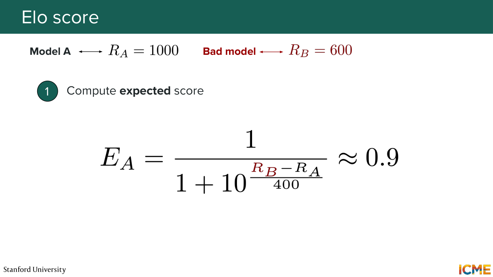

### 📝 幻灯片内容

Elo score
Model A
Bad model
Compute expected score
1

### 💡 通俗解释

*（待补充解释）*

---

## Slide 34

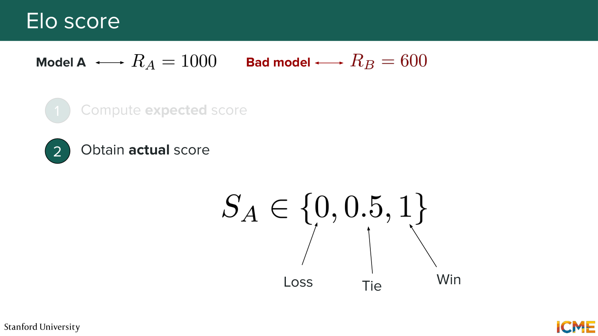

### 📝 幻灯片内容

Elo score
Compute expected score
Obtain actual score
1
2
Loss
Win
Tie
Model A
Bad model

### 💡 通俗解释

*（待补充解释）*

---

## Slide 35

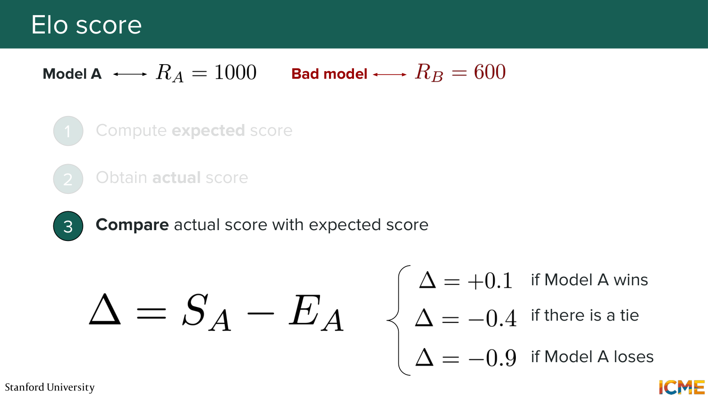

### 📝 幻灯片内容

Elo score
Compute expected score
Obtain actual score
Compare actual score with expected score
1
2
3
Model A
Bad model
if Model A wins
if there is a tie
if Model A loses

### 💡 通俗解释

*（待补充解释）*

---

## Slide 36

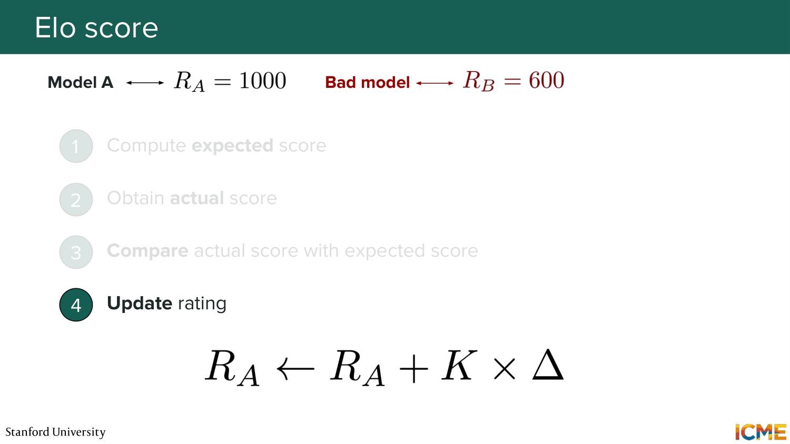

### 📝 幻灯片内容

Elo score
Compute expected score
Obtain actual score
Compare actual score with expected score
1
2
Update rating
3
4
Model A
Bad model

### 💡 通俗解释

*（待补充解释）*

---

## Slide 37

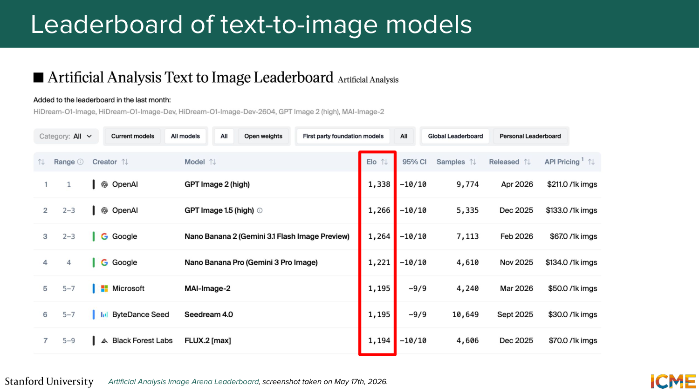

### 📝 幻灯片内容

Leaderboard of text-to-image models
Artificial Analysis Image Arena Leaderboard, screenshot taken on May 17th, 2026.

### 💡 通俗解释

*（待补充解释）*

---

## Slide 38

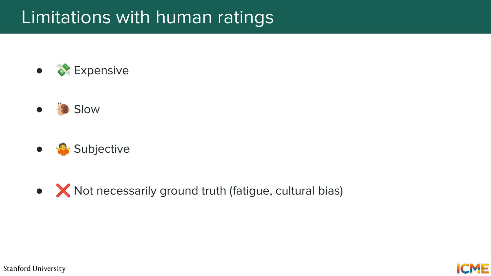

### 📝 幻灯片内容

Limitations with human ratings
●
💸 Expensive
●
🐌 Slow
●
❌ Not necessarily ground truth (fatigue, cultural bias)
●
🤷 Subjective

### 💡 通俗解释

*（待补充解释）*

---

## Slide 39

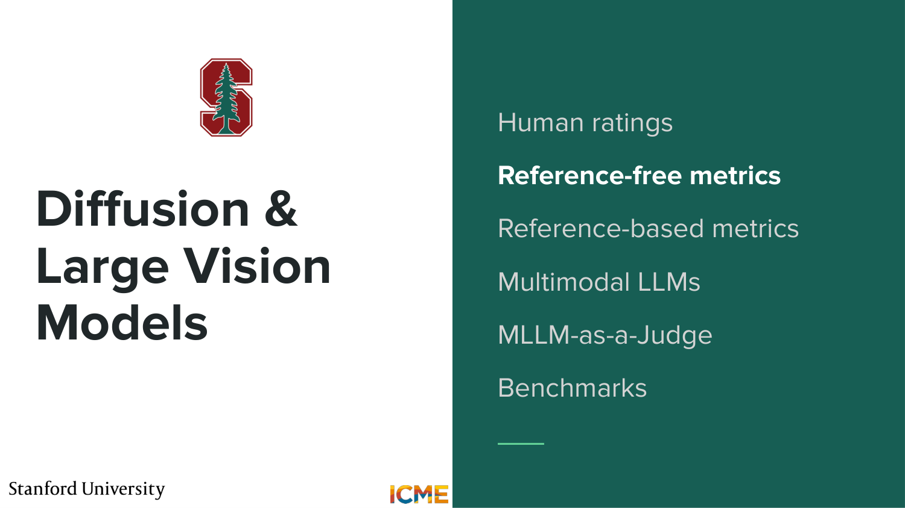

### 📝 幻灯片内容

Human ratings
Reference-free metrics
Reference-based metrics
Multimodal LLMs
MLLM-as-a-Judge
Benchmarks
Diffusion & 
Large Vision 
Models

### 💡 通俗解释

*（待补充解释）*

---

## Slide 40

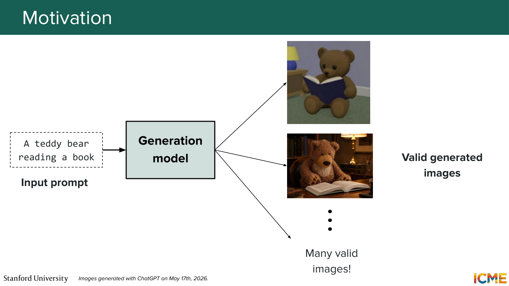

### 📝 幻灯片内容

Motivation
Input prompt
A teddy bear 
reading a book
Valid generated 
images
Generation 
model
Many valid 
images!
Images generated with ChatGPT on May 17th, 2026.

### 💡 通俗解释

*（待补充解释）*

---

## Slide 41

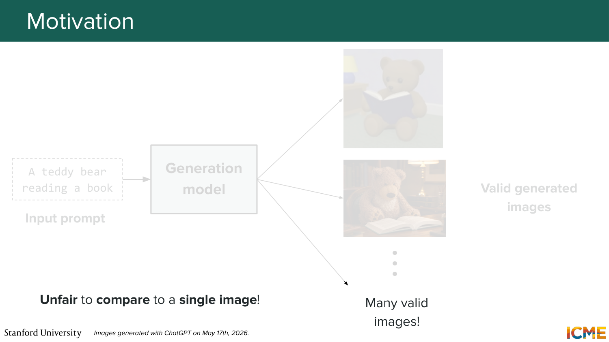

### 📝 幻灯片内容

Motivation
Input prompt
A teddy bear 
reading a book
Valid generated 
images
Generation 
model
Many valid 
images!
Unfair to compare to a single image!
Images generated with ChatGPT on May 17th, 2026.

### 💡 通俗解释

*（待补充解释）*

---

## Slide 42

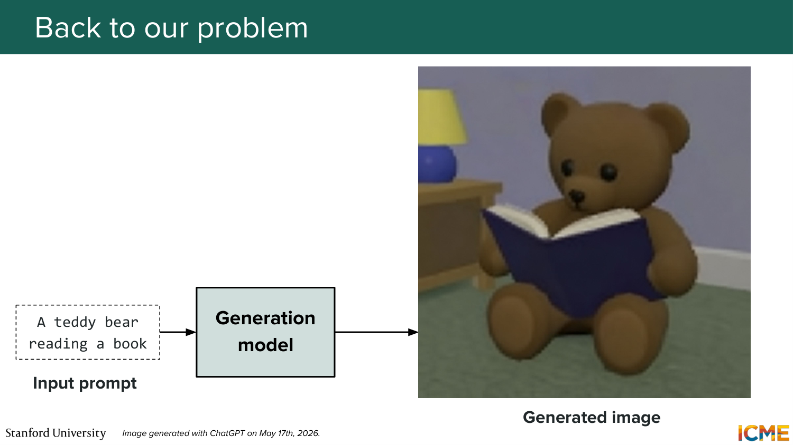

### 📝 幻灯片内容

Back to our problem
Generated image
Generation 
model
Input prompt
A teddy bear 
reading a book
Image generated with ChatGPT on May 17th, 2026.

### 💡 通俗解释

*（待补充解释）*

---

## Slide 43

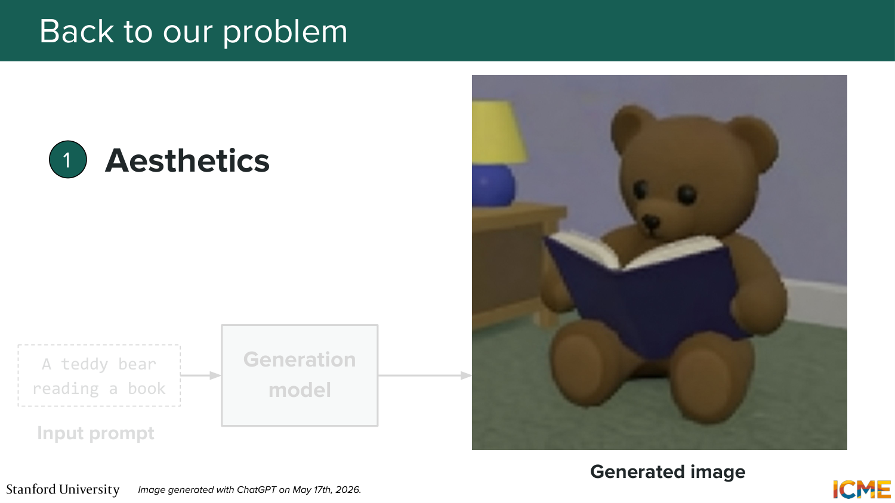

### 📝 幻灯片内容

Back to our problem
Generated image
Generation 
model
Input prompt
A teddy bear 
reading a book
1
Aesthetics
Image generated with ChatGPT on May 17th, 2026.

### 💡 通俗解释

*（待补充解释）*

---

## Slide 44

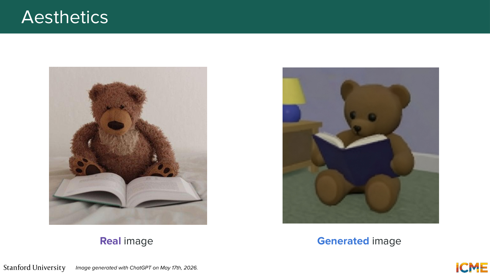

### 📝 幻灯片内容

Aesthetics
Real image
Generated image
Image generated with ChatGPT on May 17th, 2026.

### 💡 通俗解释

*（待补充解释）*

---

## Slide 45

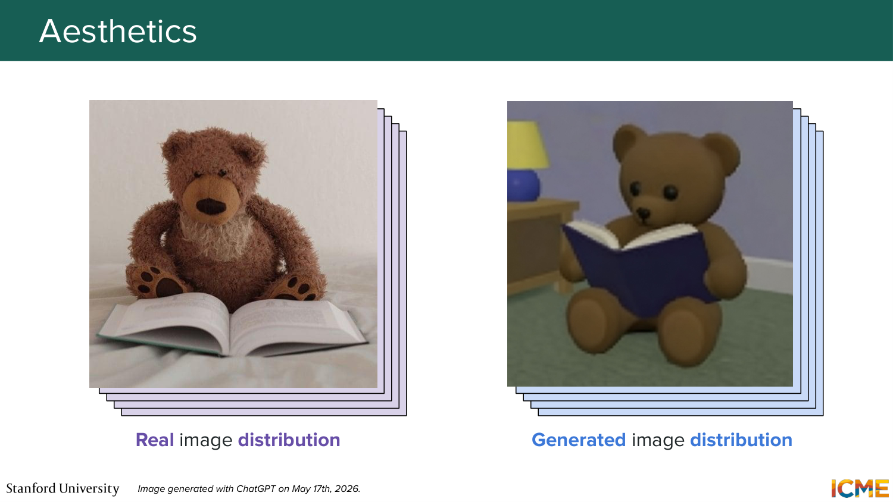

### 📝 幻灯片内容

Aesthetics
Real image distribution
Generated image distribution
Image generated with ChatGPT on May 17th, 2026.

### 💡 通俗解释

*（待补充解释）*

---

## Slide 46

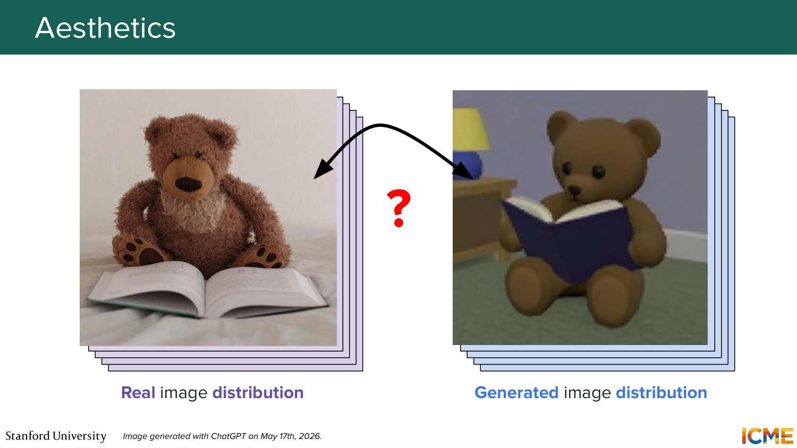

### 📝 幻灯片内容

Aesthetics
Real image distribution
Generated image distribution
?
Image generated with ChatGPT on May 17th, 2026.

### 💡 通俗解释

*（待补充解释）*

---

## Slide 47

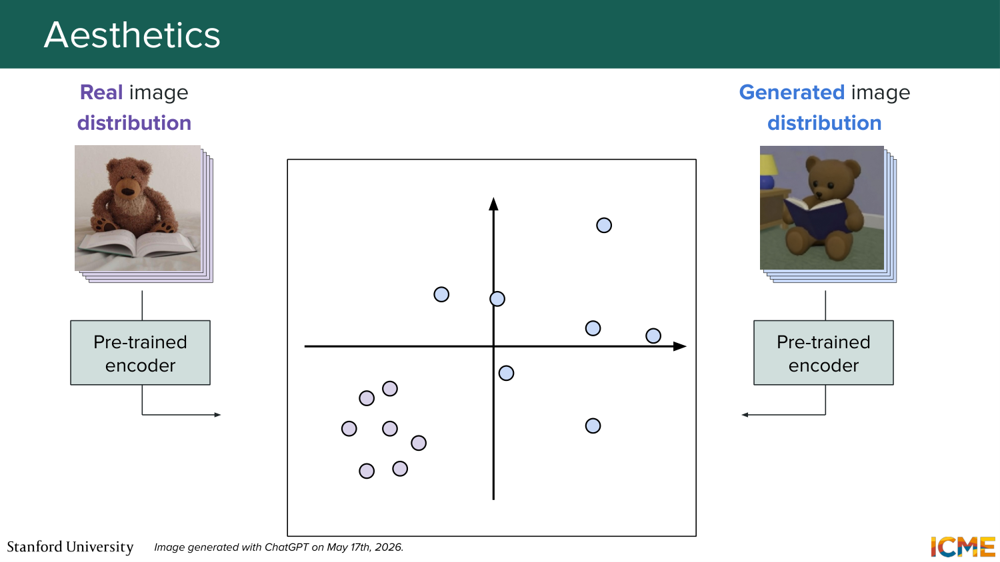

### 📝 幻灯片内容

Aesthetics
Pre-trained 
encoder
Pre-trained 
encoder
Real image 
distribution
Generated image 
distribution
Image generated with ChatGPT on May 17th, 2026.

### 💡 通俗解释

*（待补充解释）*

---

## Slide 48

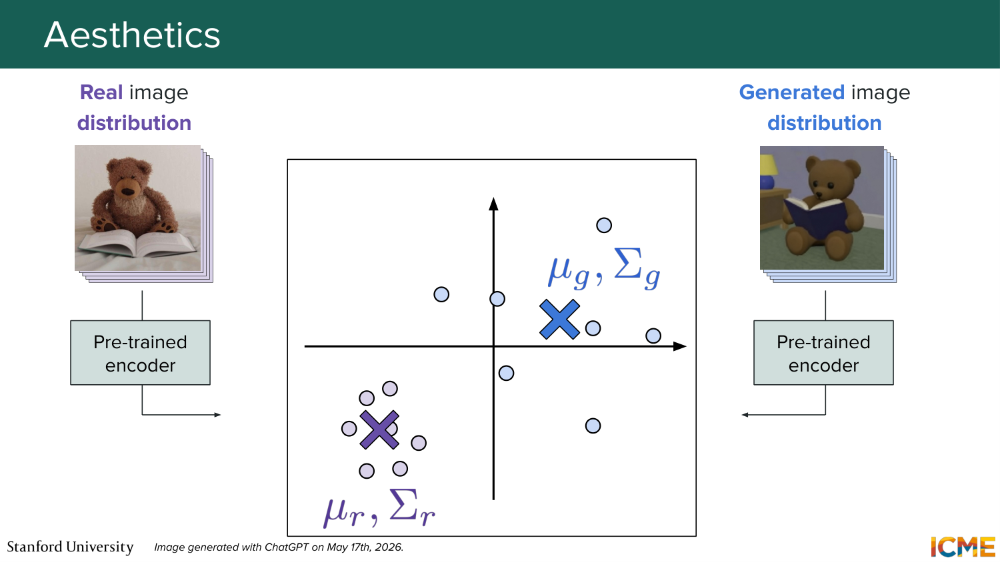

### 📝 幻灯片内容

Aesthetics
Pre-trained 
encoder
Pre-trained 
encoder
Real image 
distribution
Generated image 
distribution
Image generated with ChatGPT on May 17th, 2026.

### 💡 通俗解释

*（待补充解释）*

---

## Slide 49

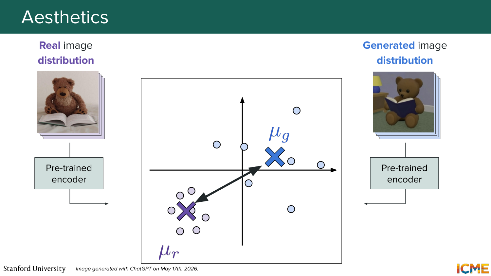

### 📝 幻灯片内容

Aesthetics
Pre-trained 
encoder
Pre-trained 
encoder
Real image 
distribution
Generated image 
distribution
Image generated with ChatGPT on May 17th, 2026.

### 💡 通俗解释

*（待补充解释）*

---

## Slide 50

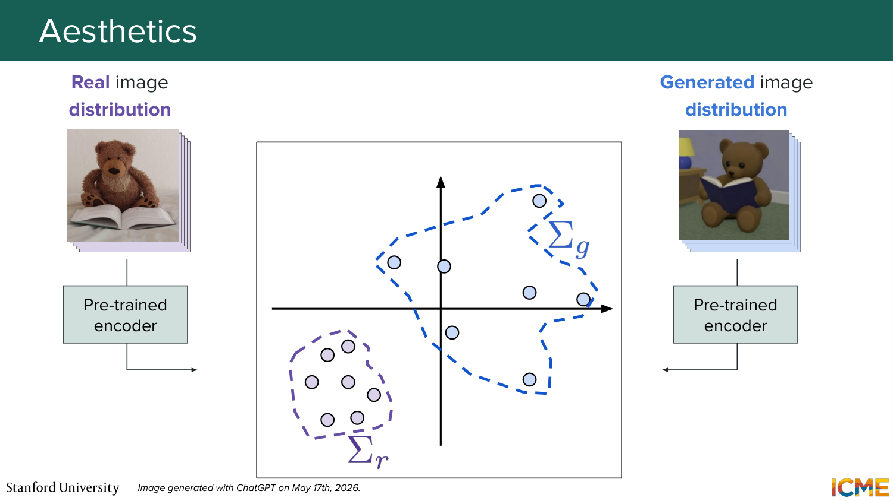

### 📝 幻灯片内容

Aesthetics
Pre-trained 
encoder
Pre-trained 
encoder
Real image 
distribution
Generated image 
distribution
Image generated with ChatGPT on May 17th, 2026.

### 💡 通俗解释

*（待补充解释）*

---

## Slide 51

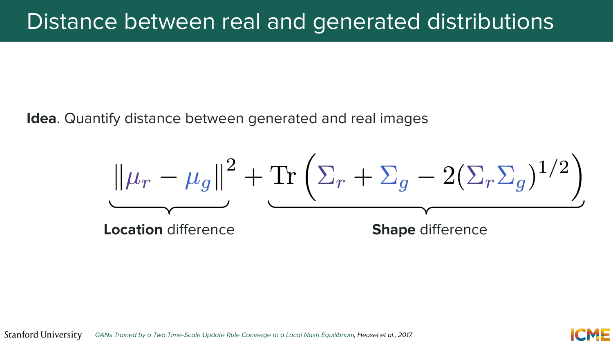

### 📝 幻灯片内容

Distance between real and generated distributions
GANs Trained by a Two Time-Scale Update Rule Converge to a Local Nash Equilibrium, Heusel et al., 2017.
Idea. Quantify distance between generated and real images
Location difference
Shape difference

### 💡 通俗解释

*（待补充解释）*

---

## Slide 52

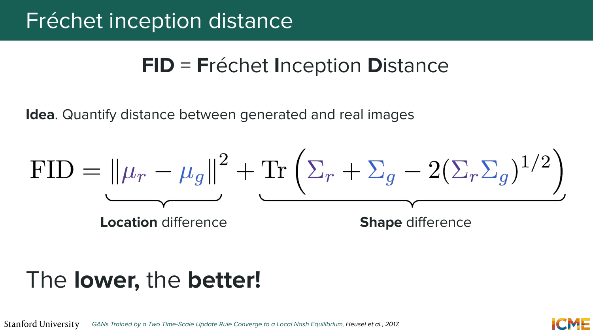

### 📝 幻灯片内容

Fréchet inception distance
GANs Trained by a Two Time-Scale Update Rule Converge to a Local Nash Equilibrium, Heusel et al., 2017.
FID = Fréchet Inception Distance
Idea. Quantify distance between generated and real images
Location difference
Shape difference
The lower, the better!

### 💡 通俗解释

*（待补充解释）*

---

## Slide 53

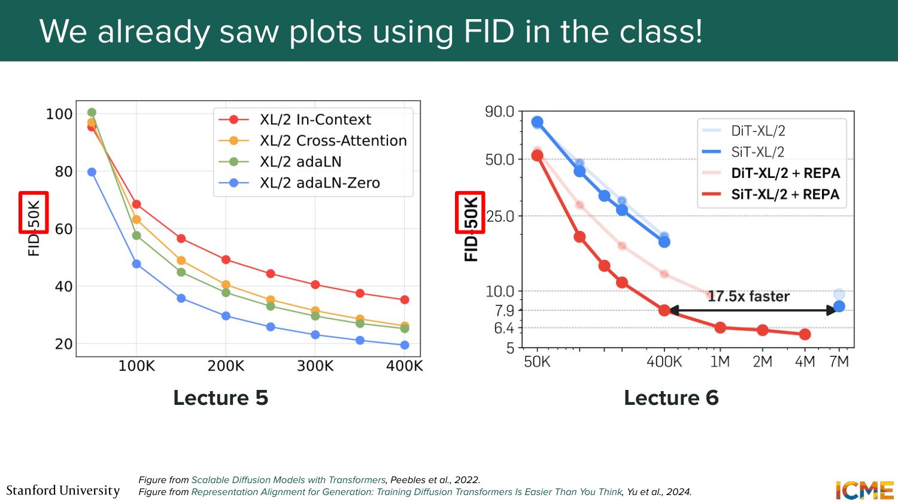

### 📝 幻灯片内容

We already saw plots using FID in the class!
Lecture 5
Lecture 6
Figure from Scalable Diffusion Models with Transformers, Peebles et al., 2022.
Figure from Representation Alignment for Generation: Training Diffusion Transformers Is Easier Than You Think, Yu et al., 2024.

### 💡 通俗解释

*（待补充解释）*

---

## Slide 54

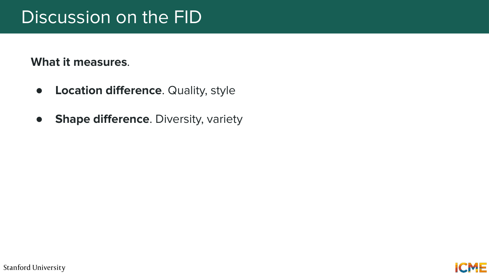

### 📝 幻灯片内容

Discussion on the FID
What it measures.
●
Location difference. Quality, style
●
Shape difference. Diversity, variety

### 💡 通俗解释

*（待补充解释）*

---

## Slide 55

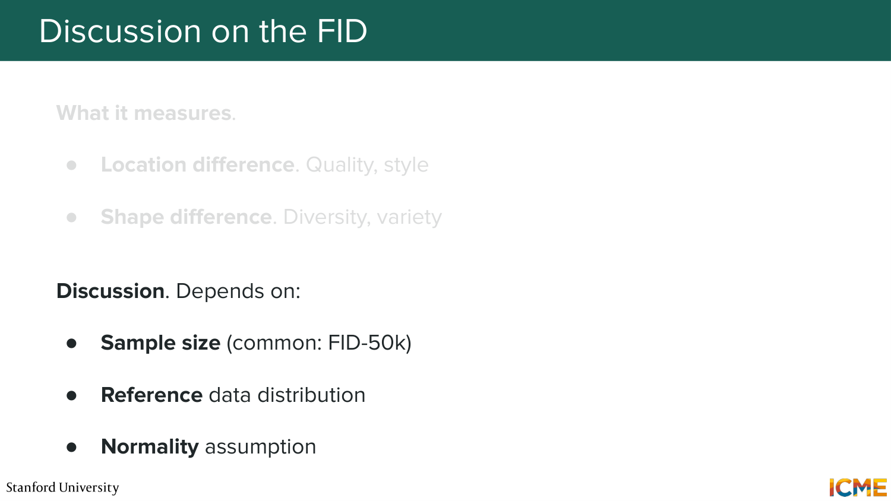

### 📝 幻灯片内容

Discussion on the FID
What it measures.
●
Location difference. Quality, style
●
Shape difference. Diversity, variety
Discussion. Depends on:
●
Sample size (common: FID-50k)
●
Reference data distribution
●
Normality assumption

### 💡 通俗解释

*（待补充解释）*

---

## Slide 56

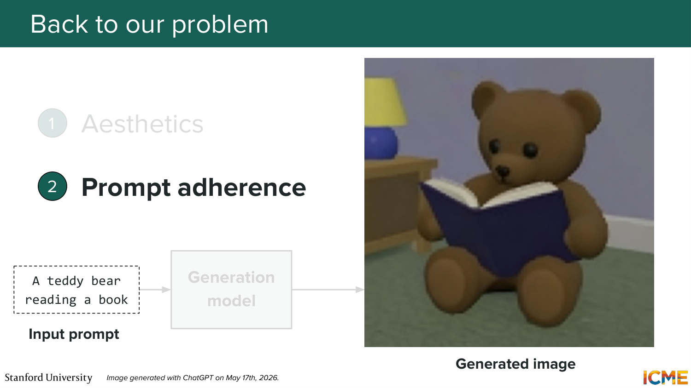

### 📝 幻灯片内容

Back to our problem
Generated image
Generation 
model
Input prompt
A teddy bear 
reading a book
1
Aesthetics
2
Prompt adherence
Image generated with ChatGPT on May 17th, 2026.

### 💡 通俗解释

*（待补充解释）*

---

## Slide 57

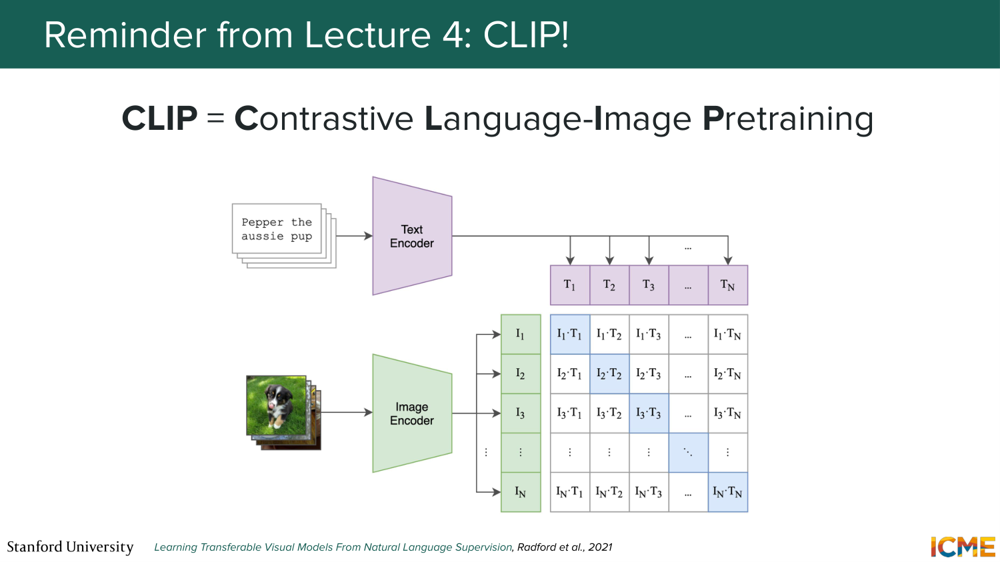

### 📝 幻灯片内容

Reminder from Lecture 4: CLIP!
CLIP = Contrastive Language-Image Pretraining
Learning Transferable Visual Models From Natural Language Supervision, Radford et al., 2021

### 💡 通俗解释

*（待补充解释）*

---

## Slide 58

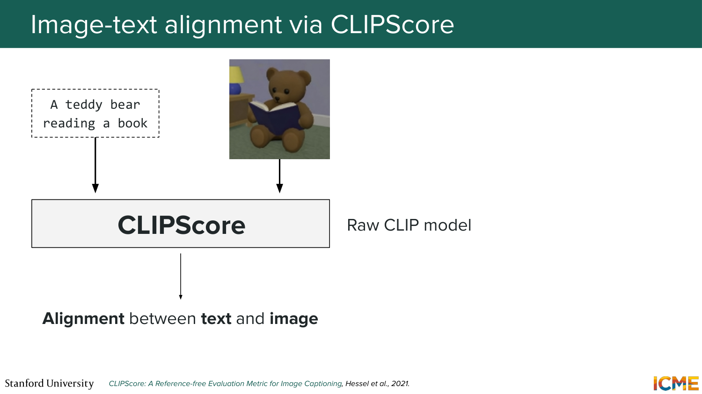

### 📝 幻灯片内容

Image-text alignment via CLIPScore
CLIPScore: A Reference-free Evaluation Metric for Image Captioning, Hessel et al., 2021.
A teddy bear 
reading a book
CLIPScore
Alignment between text and image
Raw CLIP model

### 💡 通俗解释

*（待补充解释）*

---

## Slide 59

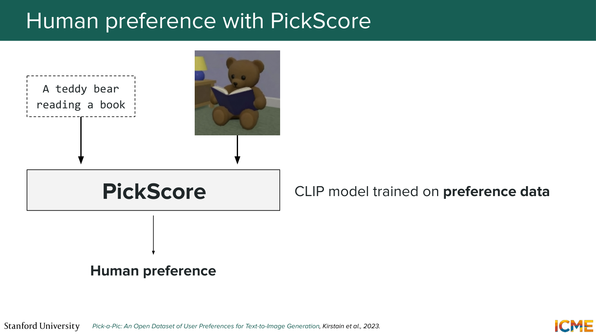

### 📝 幻灯片内容

Human preference with PickScore
Pick-a-Pic: An Open Dataset of User Preferences for Text-to-Image Generation, Kirstain et al., 2023.
A teddy bear 
reading a book
PickScore
Human preference
CLIP model trained on preference data

### 💡 通俗解释

*（待补充解释）*

---

## Slide 60

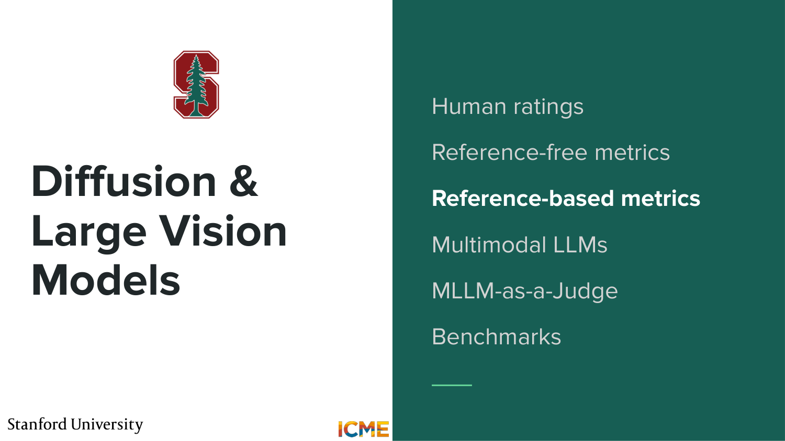

### 📝 幻灯片内容

Human ratings
Reference-free metrics
Reference-based metrics
Multimodal LLMs
MLLM-as-a-Judge
Benchmarks
Diffusion & 
Large Vision 
Models

### 💡 通俗解释

*（待补充解释）*

---

## Slide 61

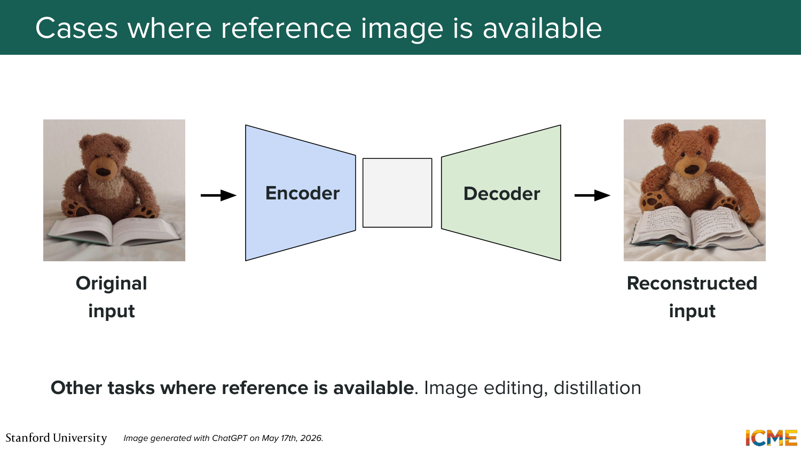

### 📝 幻灯片内容

Cases where reference image is available
Encoder
Decoder
Reconstructed 
input 
Original
input 
Other tasks where reference is available. Image editing, distillation
Image generated with ChatGPT on May 17th, 2026.

### 💡 通俗解释

*（待补充解释）*

---

## Slide 62

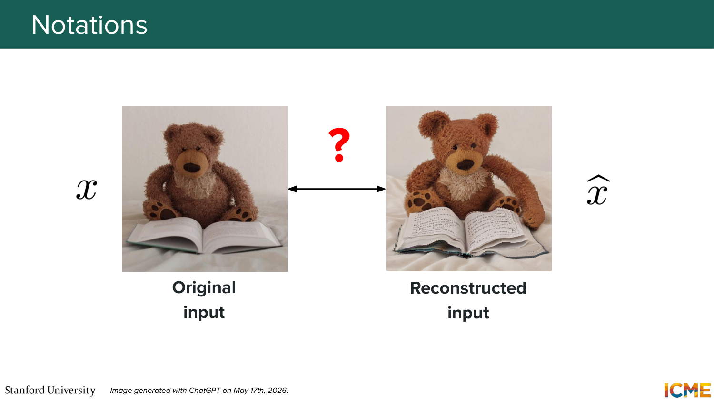

### 📝 幻灯片内容

Notations
Original
input 
Reconstructed 
input 
Image generated with ChatGPT on May 17th, 2026.
?

### 💡 通俗解释

*（待补充解释）*

---

## Slide 63

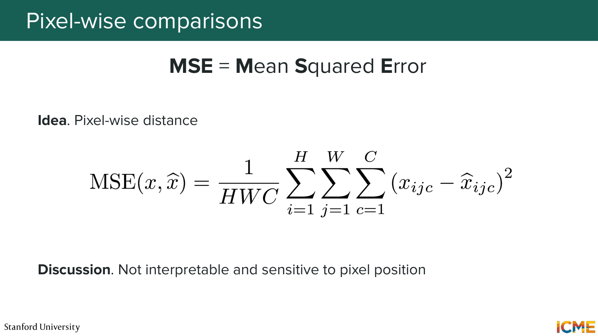

### 📝 幻灯片内容

Pixel-wise comparisons
Idea. Pixel-wise distance
MSE = Mean Squared Error
Discussion. Not interpretable and sensitive to pixel position

### 💡 通俗解释

*（待补充解释）*

---

## Slide 64

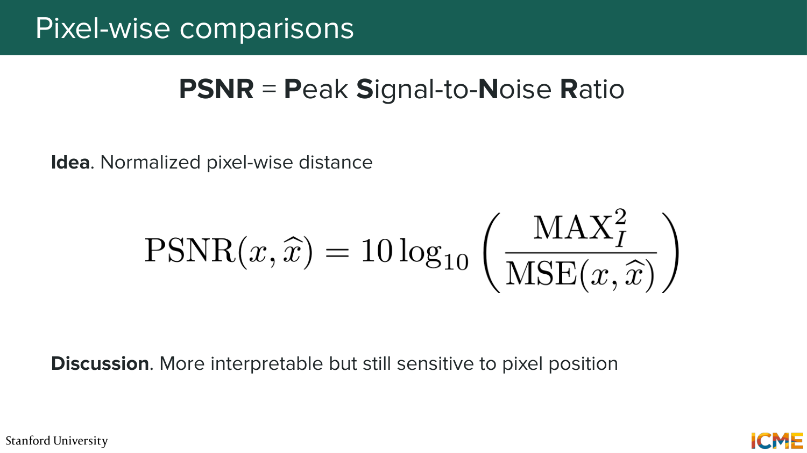

### 📝 幻灯片内容

PSNR = Peak Signal-to-Noise Ratio
Pixel-wise comparisons
Idea. Normalized pixel-wise distance
Discussion. More interpretable but still sensitive to pixel position

### 💡 通俗解释

*（待补充解释）*

---

## Slide 65

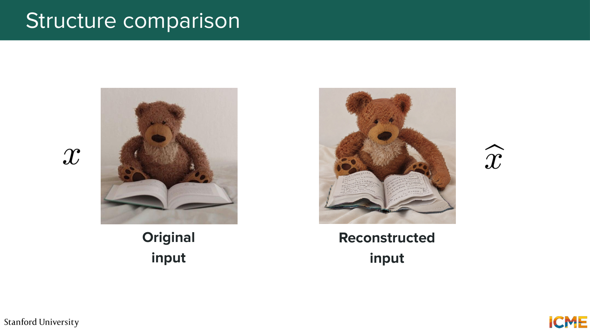

### 📝 幻灯片内容

Structure comparison
Original
input 
Reconstructed 
input

### 💡 通俗解释

*（待补充解释）*

---

## Slide 66

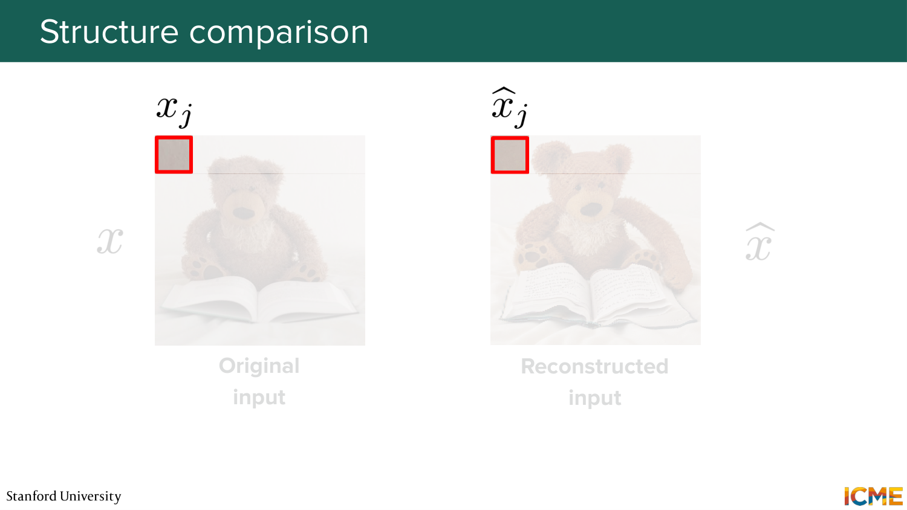

### 📝 幻灯片内容

Structure comparison
Original
input 
Reconstructed 
input

### 💡 通俗解释

*（待补充解释）*

---

## Slide 67

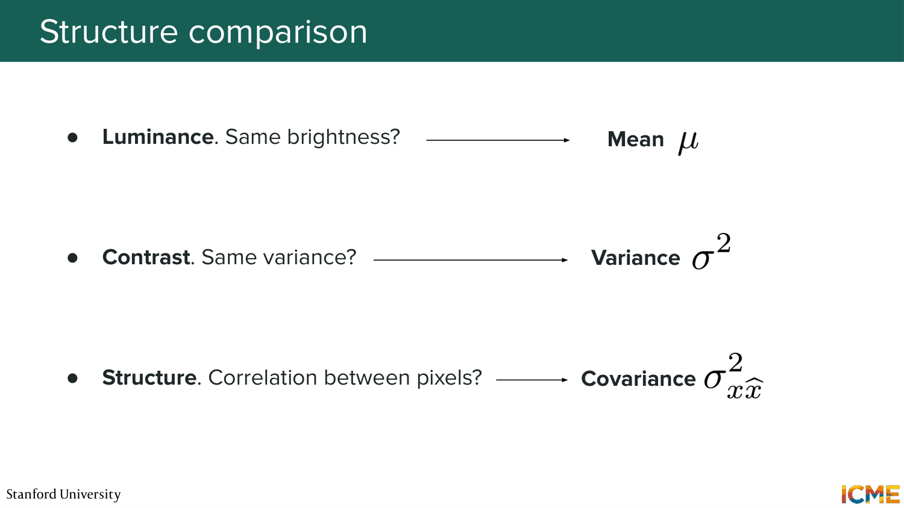

### 📝 幻灯片内容

Structure comparison
Mean
Variance
Covariance
●
Luminance. Same brightness?
●
Contrast. Same variance?
●
Structure. Correlation between pixels?

### 💡 通俗解释

*（待补充解释）*

---

## Slide 68

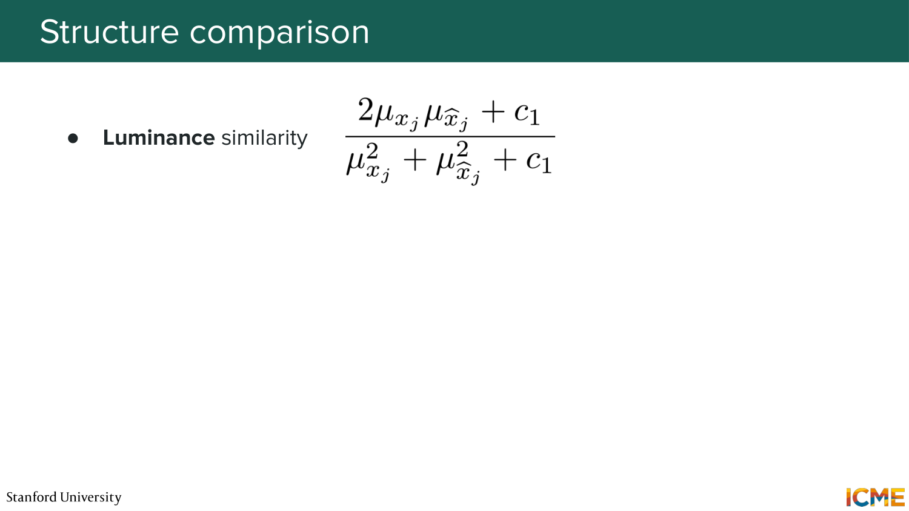

### 📝 幻灯片内容

Structure comparison
●
Luminance similarity

### 💡 通俗解释

*（待补充解释）*

---

## Slide 69

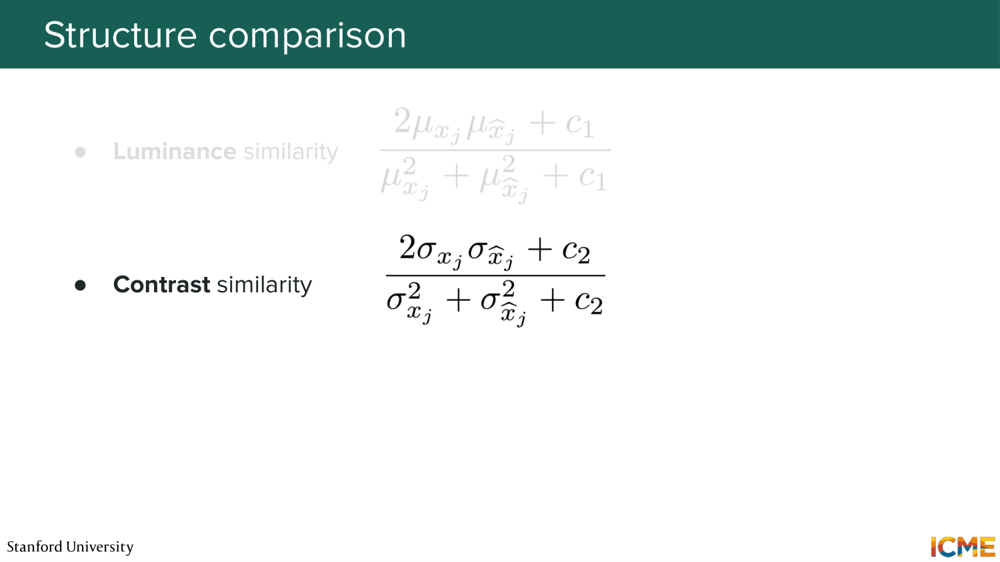

### 📝 幻灯片内容

Structure comparison
●
Luminance similarity
●
Contrast similarity

### 💡 通俗解释

*（待补充解释）*

---

## Slide 70

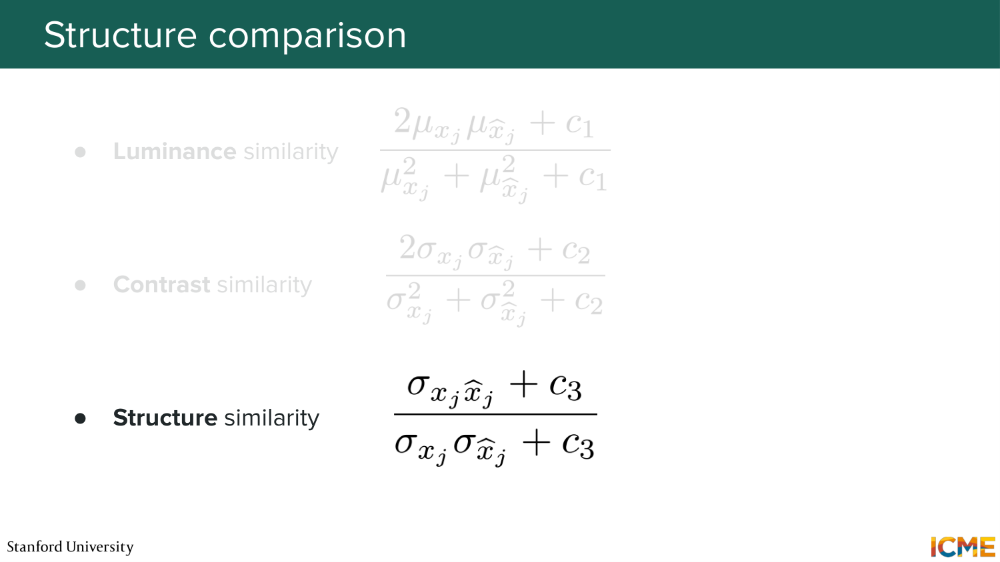

### 📝 幻灯片内容

Structure comparison
●
Luminance similarity
●
Contrast similarity
●
Structure similarity

### 💡 通俗解释

*（待补充解释）*

---

## Slide 71

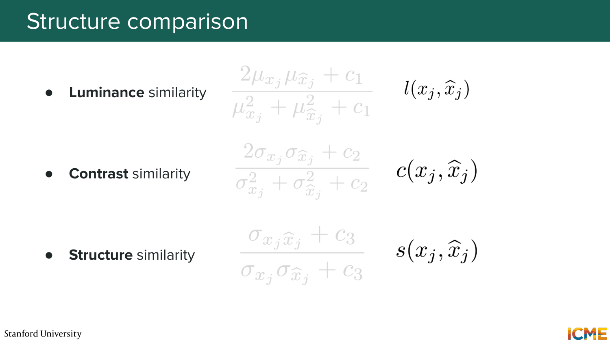

### 📝 幻灯片内容

Structure comparison
●
Luminance similarity
●
Contrast similarity
●
Structure similarity

### 💡 通俗解释

*（待补充解释）*

---

## Slide 72

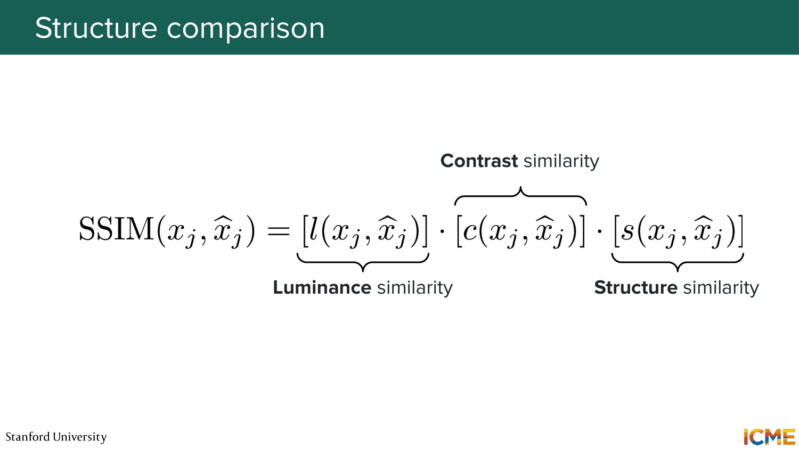

### 📝 幻灯片内容

Structure comparison
Luminance similarity
Contrast similarity
Structure similarity

### 💡 通俗解释

*（待补充解释）*

---

## Slide 73

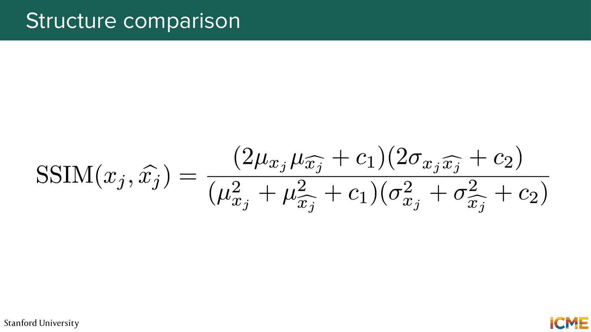

### 💡 通俗解释

*（待补充解释）*

---

## Slide 74

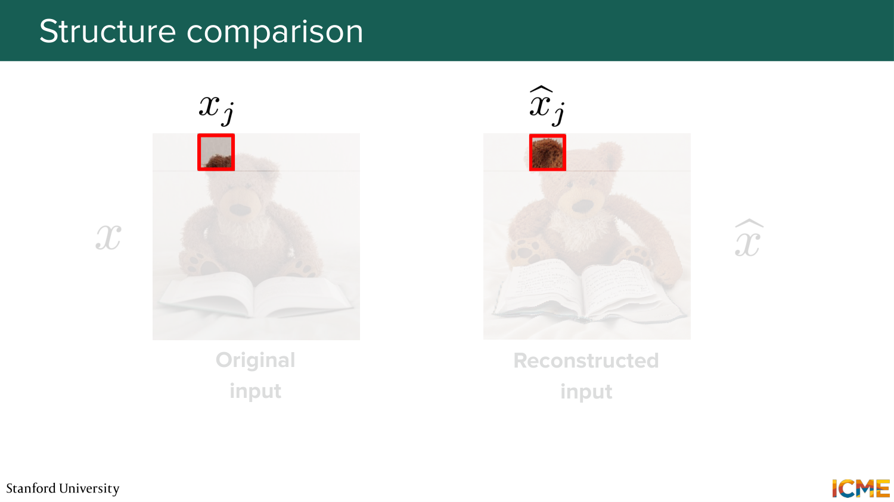

### 📝 幻灯片内容

Structure comparison
Original
input 
Reconstructed 
input

### 💡 通俗解释

*（待补充解释）*

---

## Slide 75

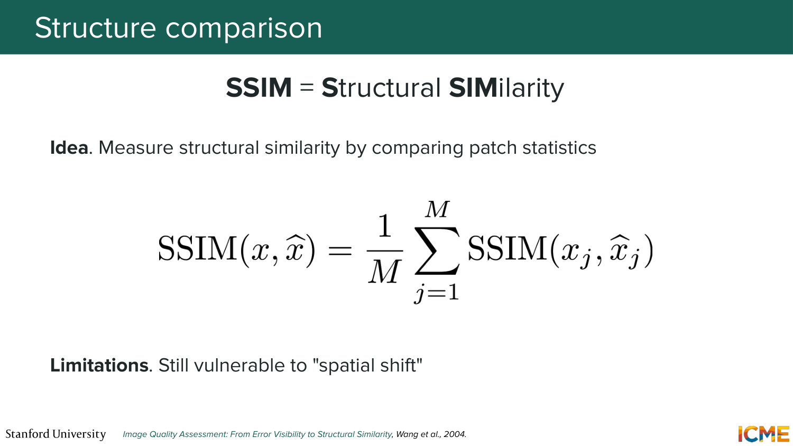

### 📝 幻灯片内容

SSIM = Structural SIMilarity
Image Quality Assessment: From Error Visibility to Structural Similarity, Wang et al., 2004.
Structure comparison
Idea. Measure structural similarity by comparing patch statistics
Limitations. Still vulnerable to "spatial shift"

### 💡 通俗解释

*（待补充解释）*

---

## Slide 76

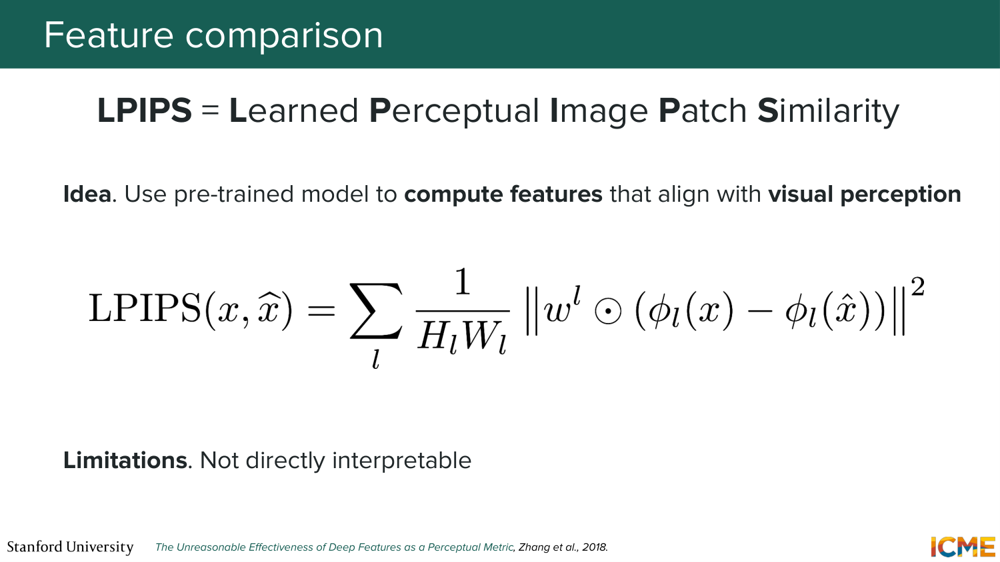

### 📝 幻灯片内容

LPIPS = Learned Perceptual Image Patch Similarity
The Unreasonable Effectiveness of Deep Features as a Perceptual Metric, Zhang et al., 2018.
Feature comparison
Idea. Use pre-trained model to compute features that align with visual perception
Limitations. Not directly interpretable

### 💡 通俗解释

*（待补充解释）*

---

## Slide 77

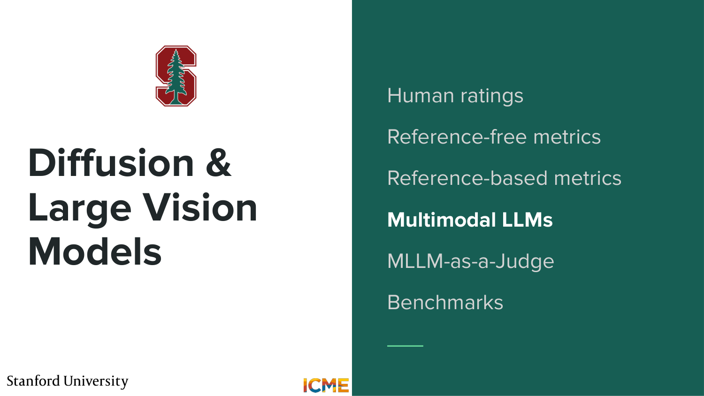

### 📝 幻灯片内容

Human ratings
Reference-free metrics
Reference-based metrics
Multimodal LLMs
MLLM-as-a-Judge
Benchmarks
Diffusion & 
Large Vision 
Models

### 💡 通俗解释

*（待补充解释）*

---

## Slide 78

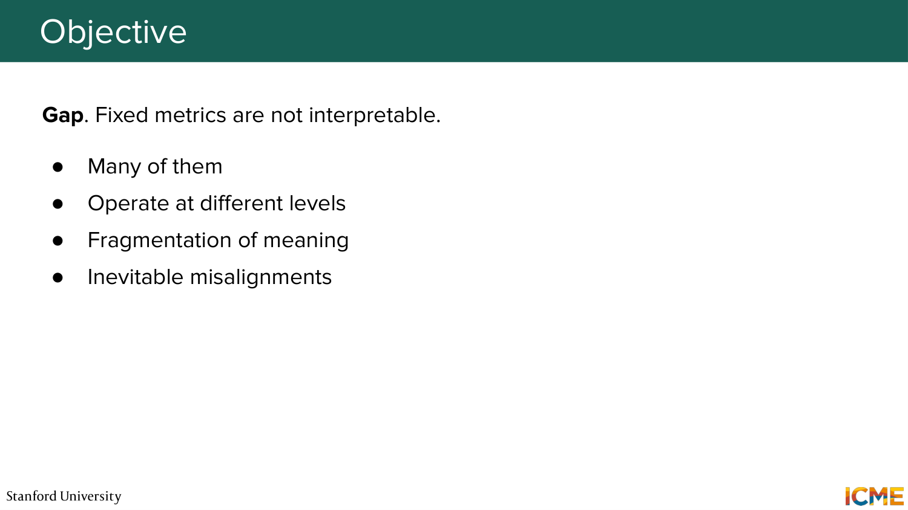

### 📝 幻灯片内容

Objective
Gap. Fixed metrics are not interpretable.
●
Many of them
●
Operate at different levels
●
Fragmentation of meaning
●
Inevitable misalignments

### 💡 通俗解释

*（待补充解释）*

---

## Slide 79

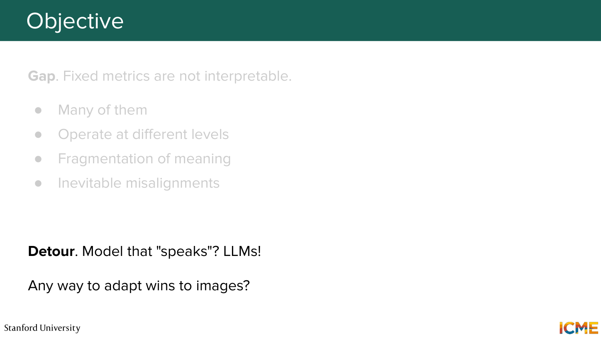

### 📝 幻灯片内容

Objective
Gap. Fixed metrics are not interpretable.
●
Many of them
●
Operate at different levels
●
Fragmentation of meaning
●
Inevitable misalignments
Detour. Model that "speaks"? LLMs!
Any way to adapt wins to images?

### 💡 通俗解释

*（待补充解释）*

---

## Slide 80

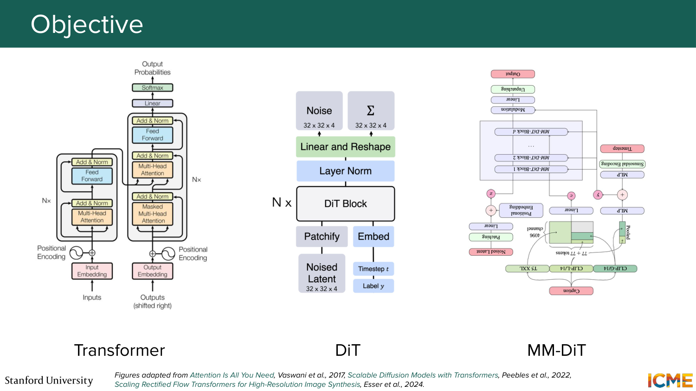

### 📝 幻灯片内容

Objective
Figures adapted from Attention Is All You Need, Vaswani et al., 2017, Scalable Diffusion Models with Transformers, Peebles et al., 2022,
Scaling Rectified Flow Transformers for High-Resolution Image Synthesis, Esser et al., 2024.
Transformer
DiT
MM-DiT

### 💡 通俗解释

*（待补充解释）*

---

## Slide 81

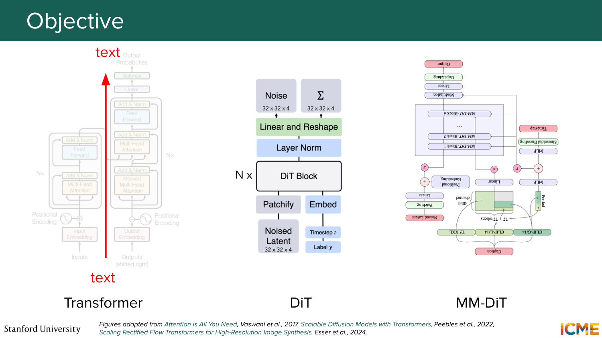

### 📝 幻灯片内容

Objective
Figures adapted from Attention Is All You Need, Vaswani et al., 2017, Scalable Diffusion Models with Transformers, Peebles et al., 2022,
Scaling Rectified Flow Transformers for High-Resolution Image Synthesis, Esser et al., 2024.
Transformer
DiT
MM-DiT
text
text

### 💡 通俗解释

*（待补充解释）*

---

## Slide 82

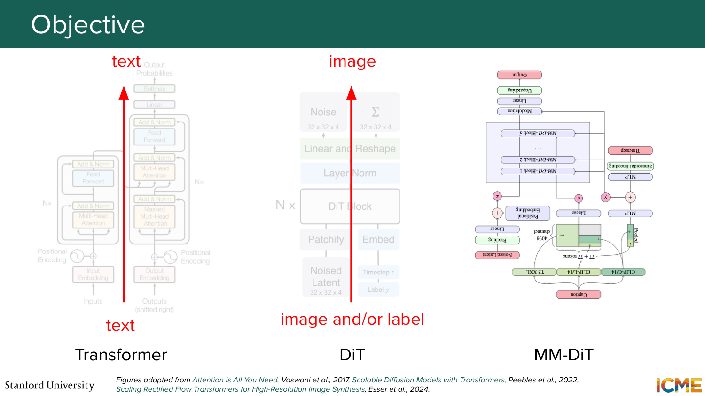

### 📝 幻灯片内容

Objective
Figures adapted from Attention Is All You Need, Vaswani et al., 2017, Scalable Diffusion Models with Transformers, Peebles et al., 2022,
Scaling Rectified Flow Transformers for High-Resolution Image Synthesis, Esser et al., 2024.
Transformer
DiT
MM-DiT
image
image and/or label
text
text

### 💡 通俗解释

*（待补充解释）*

---

## Slide 83

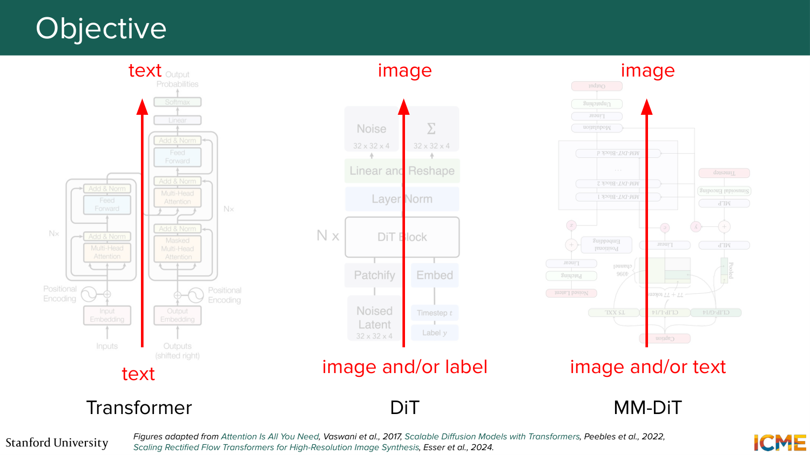

### 📝 幻灯片内容

Objective
Figures adapted from Attention Is All You Need, Vaswani et al., 2017, Scalable Diffusion Models with Transformers, Peebles et al., 2022,
Scaling Rectified Flow Transformers for High-Resolution Image Synthesis, Esser et al., 2024.
Transformer
MM-DiT
image and/or text
image
DiT
image
text
text
image and/or label

### 💡 通俗解释

*（待补充解释）*

---

## Slide 84

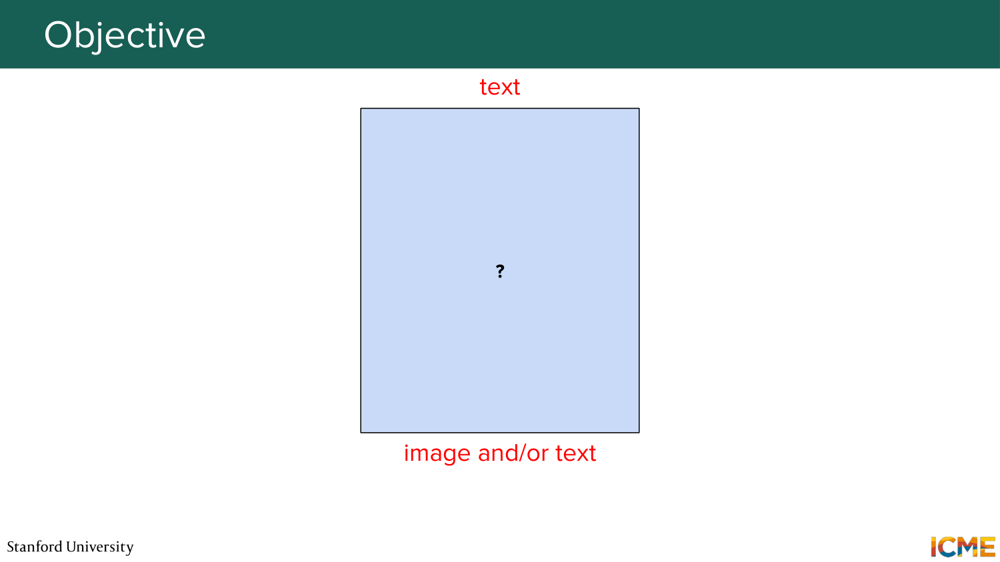

### 📝 幻灯片内容

Objective
text
image and/or text
?

### 💡 通俗解释

*（待补充解释）*

---

## Slide 85

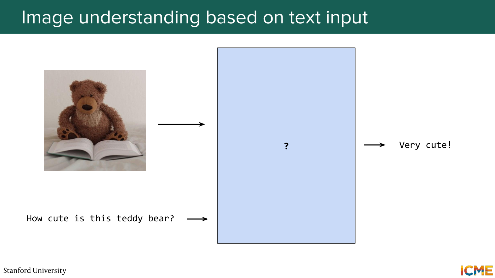

### 📝 幻灯片内容

Image understanding based on text input
How cute is this teddy bear?
?
Very cute!

### 💡 通俗解释

*（待补充解释）*

---

## Slide 86

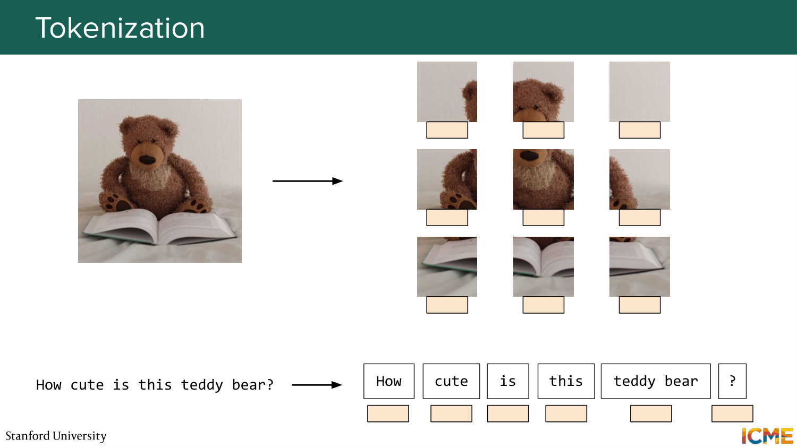

### 📝 幻灯片内容

Tokenization
How cute is this teddy bear?
How
cute
is
this
teddy bear
?

### 💡 通俗解释

*（待补充解释）*

---

## Slide 87

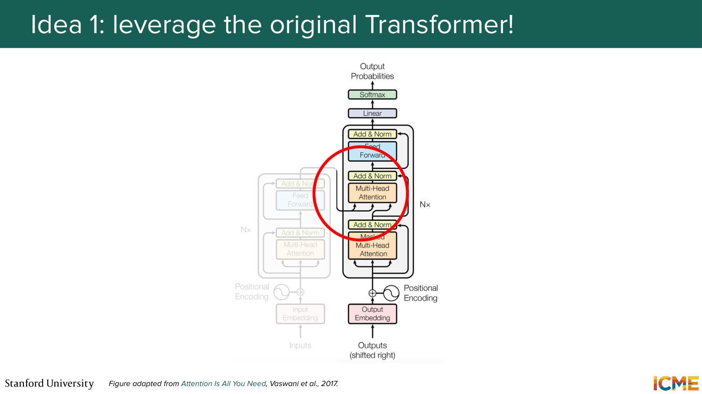

### 📝 幻灯片内容

Idea 1: leverage the original Transformer!
Figure adapted from Attention Is All You Need, Vaswani et al., 2017.

### 💡 通俗解释

*（待补充解释）*

---

## Slide 88

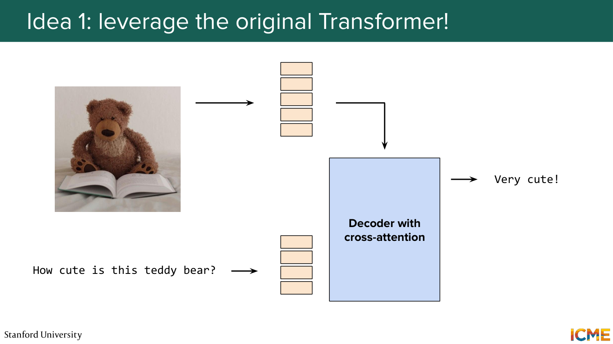

### 📝 幻灯片内容

How cute is this teddy bear?
Decoder with 
cross-attention
Very cute!
Idea 1: leverage the original Transformer!

### 💡 通俗解释

*（待补充解释）*

---

## Slide 89

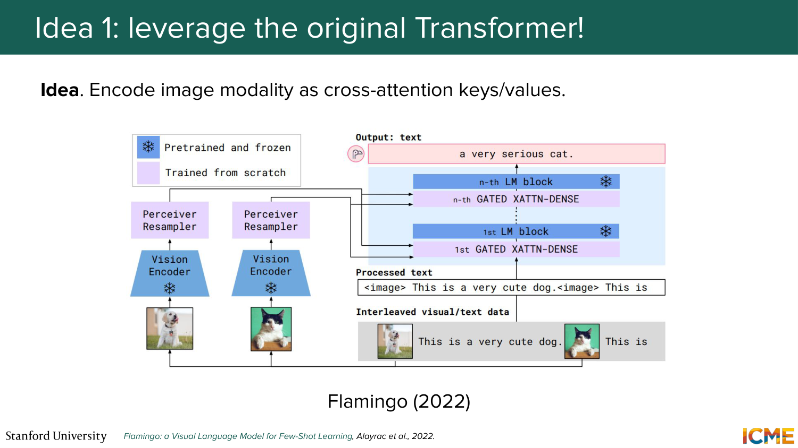

### 📝 幻灯片内容

Idea. Encode image modality as cross-attention keys/values.
Flamingo: a Visual Language Model for Few-Shot Learning, Alayrac et al., 2022.
Flamingo (2022)
Idea 1: leverage the original Transformer!

### 💡 通俗解释

*（待补充解释）*

---

## Slide 90

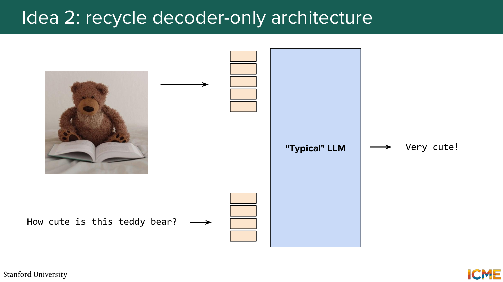

### 📝 幻灯片内容

Idea 2: recycle decoder-only architecture
How cute is this teddy bear?
"Typical" LLM
Very cute!

### 💡 通俗解释

*（待补充解释）*

---

## Slide 91

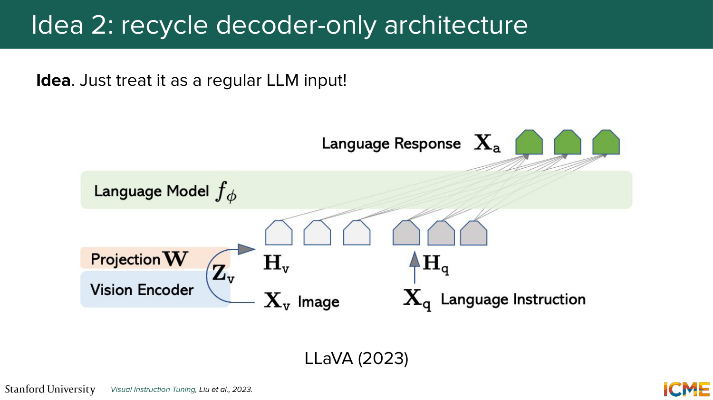

### 📝 幻灯片内容

Idea 2: recycle decoder-only architecture
Idea. Just treat it as a regular LLM input!
Visual Instruction Tuning, Liu et al., 2023.
LLaVA (2023)

### 💡 通俗解释

*（待补充解释）*

---

## Slide 92

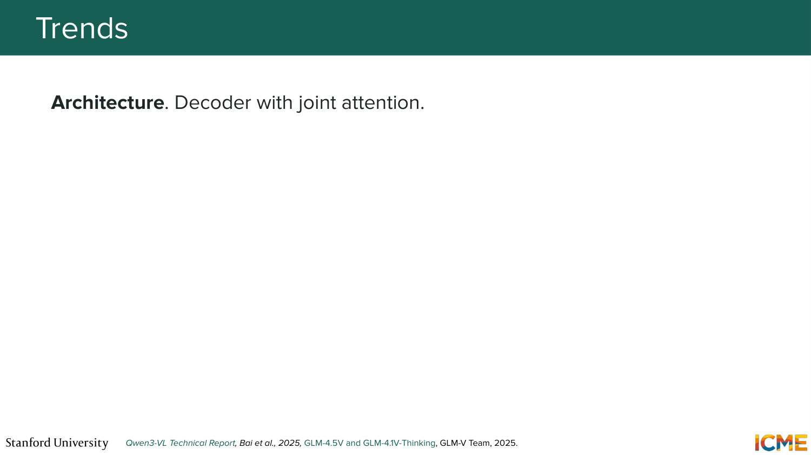

### 📝 幻灯片内容

Trends
Architecture. Decoder with joint attention.
Qwen3-VL Technical Report, Bai et al., 2025, GLM-4.5V and GLM-4.1V-Thinking, GLM-V Team, 2025.

### 💡 通俗解释

*（待补充解释）*

---

## Slide 93

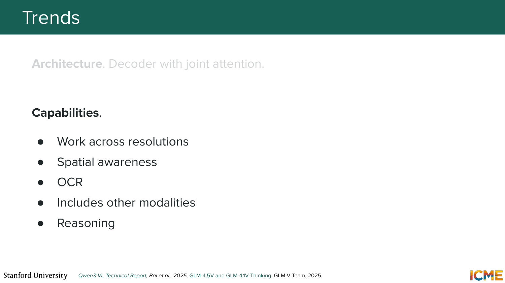

### 📝 幻灯片内容

Trends
Architecture. Decoder with joint attention.
Capabilities.
●
Work across resolutions
●
Spatial awareness
●
OCR
●
Includes other modalities
●
Reasoning
Qwen3-VL Technical Report, Bai et al., 2025, GLM-4.5V and GLM-4.1V-Thinking, GLM-V Team, 2025.

### 💡 通俗解释

*（待补充解释）*

---

## Slide 94

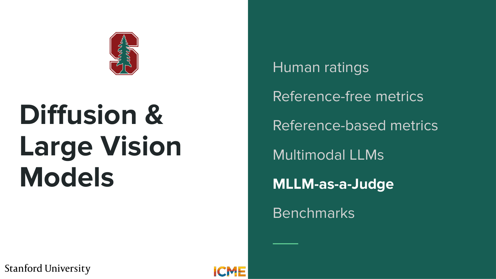

### 📝 幻灯片内容

Human ratings
Reference-free metrics
Reference-based metrics
Multimodal LLMs
MLLM-as-a-Judge
Benchmarks
Diffusion & 
Large Vision 
Models

### 💡 通俗解释

*（待补充解释）*

---

## Slide 95

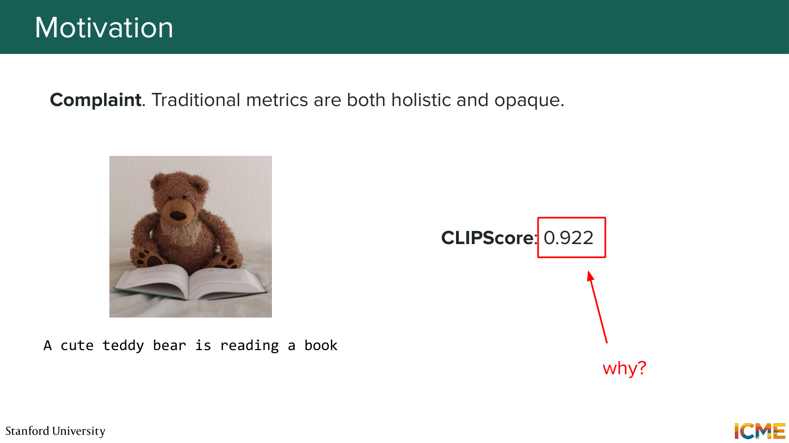

### 📝 幻灯片内容

Motivation
Complaint. Traditional metrics are both holistic and opaque.
A cute teddy bear is reading a book
CLIPScore: 0.922
why?

### 💡 通俗解释

*（待补充解释）*

---

## Slide 96

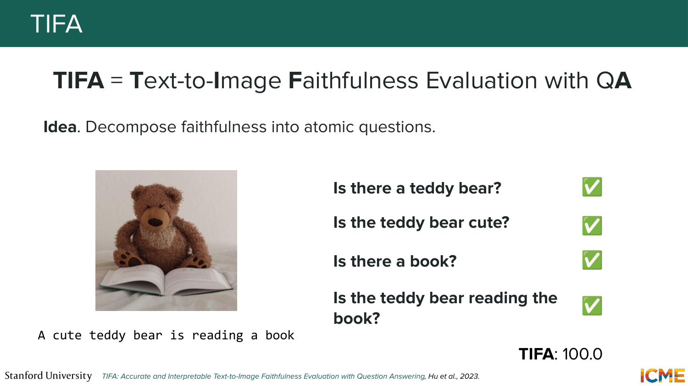

### 📝 幻灯片内容

TIFA
A cute teddy bear is reading a book
Is there a teddy bear?
TIFA = Text-to-Image Faithfulness Evaluation with QA
TIFA: Accurate and Interpretable Text-to-Image Faithfulness Evaluation with Question Answering, Hu et al., 2023.
Is the teddy bear cute?
Is there a book?
Is the teddy bear reading the 
book?
✅
✅
✅
✅
TIFA: 100.0
Idea. Decompose faithfulness into atomic questions.

### 💡 通俗解释

*（待补充解释）*

---

## Slide 97

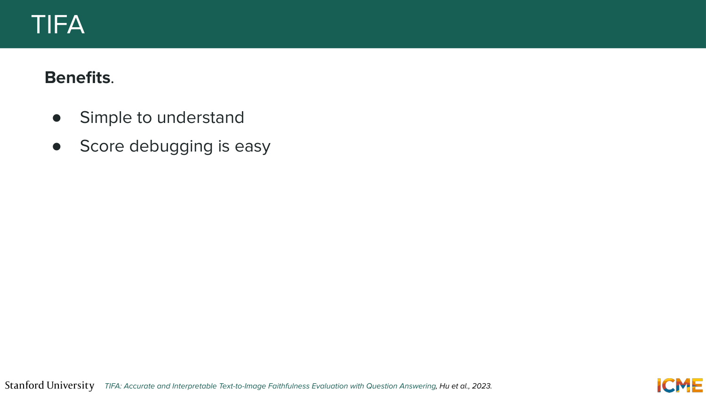

### 📝 幻灯片内容

TIFA
TIFA: Accurate and Interpretable Text-to-Image Faithfulness Evaluation with Question Answering, Hu et al., 2023.
Benefits. 
●
Simple to understand
●
Score debugging is easy

### 💡 通俗解释

*（待补充解释）*

---

## Slide 98

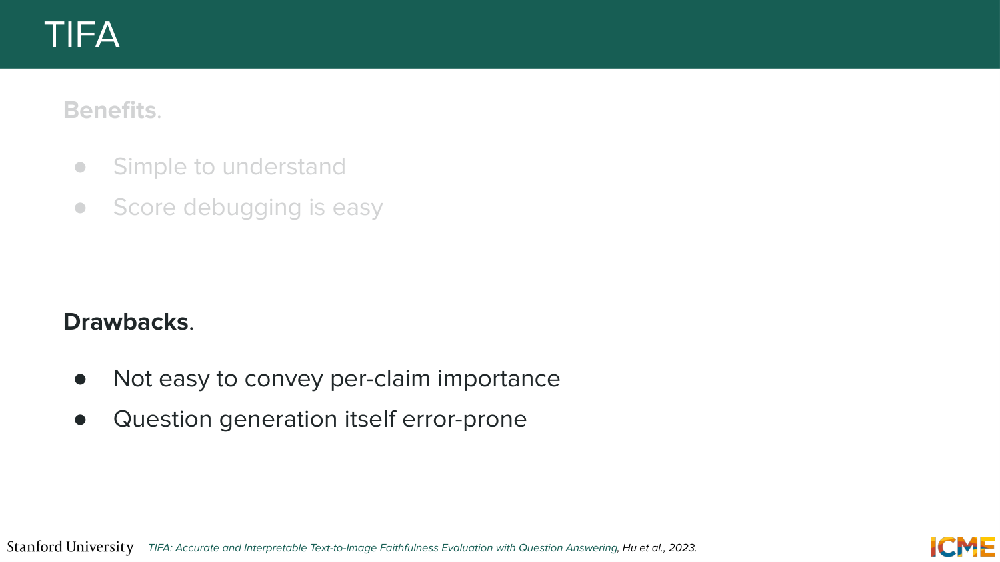

### 📝 幻灯片内容

TIFA
TIFA: Accurate and Interpretable Text-to-Image Faithfulness Evaluation with Question Answering, Hu et al., 2023.
Benefits. 
●
Simple to understand
●
Score debugging is easy
Drawbacks.
●
Not easy to convey per-claim importance
●
Question generation itself error-prone

### 💡 通俗解释

*（待补充解释）*

---

## Slide 99

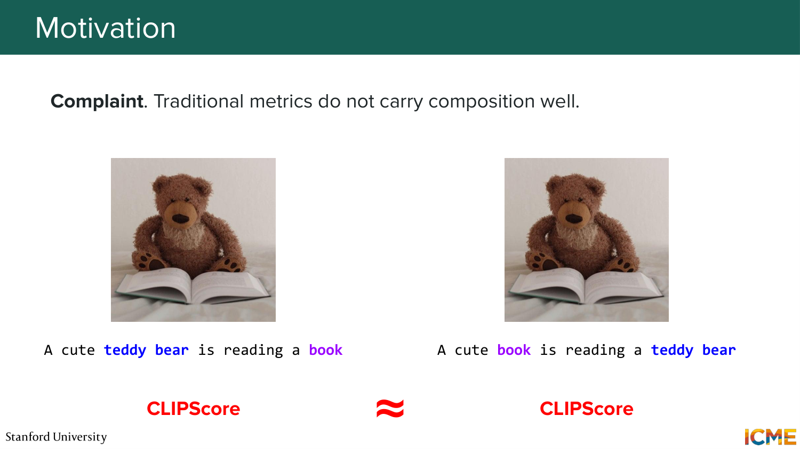

### 📝 幻灯片内容

Motivation
Complaint. Traditional metrics do not carry composition well.
A cute teddy bear is reading a book
A cute book is reading a teddy bear
CLIPScore
≈
CLIPScore

### 💡 通俗解释

*（待补充解释）*

---

## Slide 100

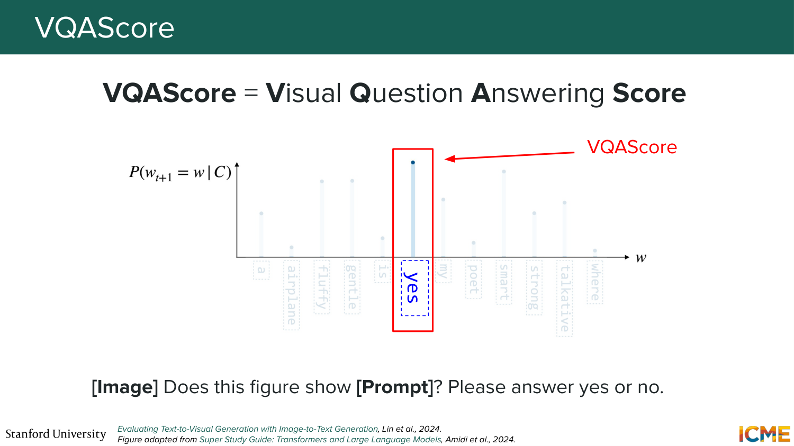

### 📝 幻灯片内容

VQAScore
Evaluating Text-to-Visual Generation with Image-to-Text Generation, Lin et al., 2024. 
Figure adapted from Super Study Guide: Transformers and Large Language Models, Amidi et al., 2024.
VQAScore = Visual Question Answering Score
[Image] Does this figure show [Prompt]? Please answer yes or no.
yes
VQAScore

### 💡 通俗解释

*（待补充解释）*

---

## Slide 101

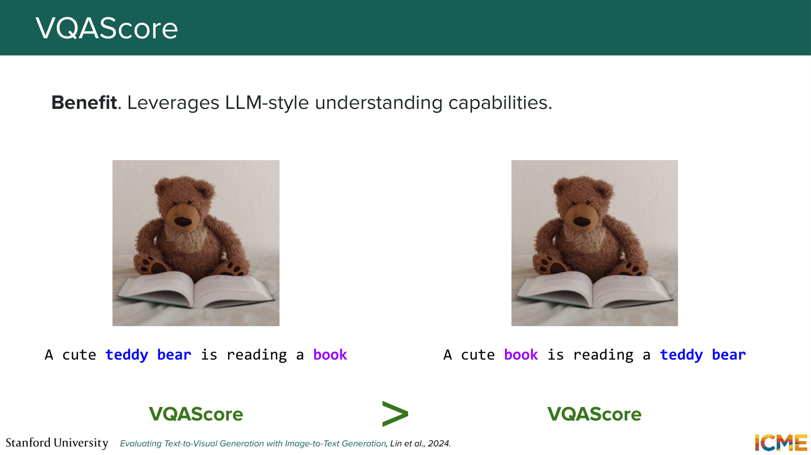

### 📝 幻灯片内容

Benefit. Leverages LLM-style understanding capabilities.
A cute teddy bear is reading a book
A cute book is reading a teddy bear
VQAScore
>
VQAScore
VQAScore
Evaluating Text-to-Visual Generation with Image-to-Text Generation, Lin et al., 2024.

### 💡 通俗解释

*（待补充解释）*

---

## Slide 102

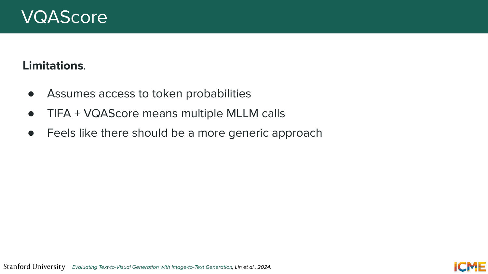

### 📝 幻灯片内容

VQAScore
Evaluating Text-to-Visual Generation with Image-to-Text Generation, Lin et al., 2024.
Limitations.
●
Assumes access to token probabilities
●
TIFA + VQAScore means multiple MLLM calls
●
Feels like there should be a more generic approach

### 💡 通俗解释

*（待补充解释）*

---

## Slide 103

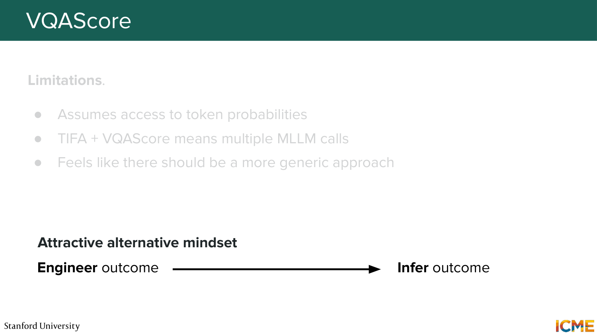

### 📝 幻灯片内容

VQAScore
Limitations.
●
Assumes access to token probabilities
●
TIFA + VQAScore means multiple MLLM calls
●
Feels like there should be a more generic approach
Attractive alternative mindset
Engineer outcome
Infer outcome

### 💡 通俗解释

*（待补充解释）*

---

## Slide 104

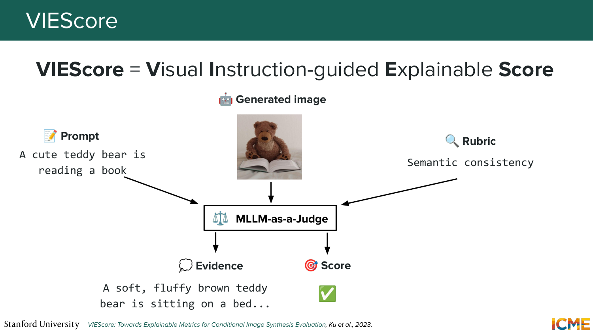

### 📝 幻灯片内容

VIEScore
VIEScore: Towards Explainable Metrics for Conditional Image Synthesis Evaluation, Ku et al., 2023.
VIEScore = Visual Instruction-guided Explainable Score
⚖  MLLM-as-a-Judge
📝 Prompt
🤖 Generated image
🔍 Rubric
🎯 Score
A cute teddy bear is 
reading a book
Semantic consistency
✅
💭 Evidence
A soft, fluffy brown teddy 
bear is sitting on a bed...

### 💡 通俗解释

*（待补充解释）*

---

## Slide 105

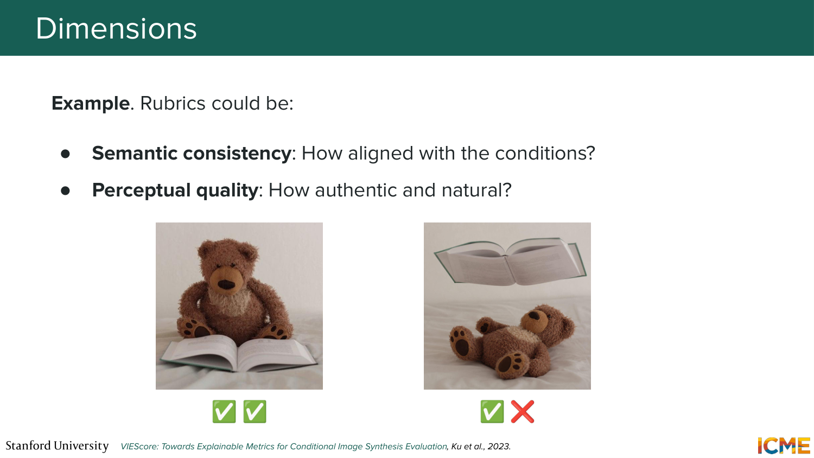

### 📝 幻灯片内容

Dimensions
Example. Rubrics could be:
●
Semantic consistency: How aligned with the conditions?
●
Perceptual quality: How authentic and natural?
VIEScore: Towards Explainable Metrics for Conditional Image Synthesis Evaluation, Ku et al., 2023.
✅ ✅
✅ ❌

### 💡 通俗解释

*（待补充解释）*

---

## Slide 106

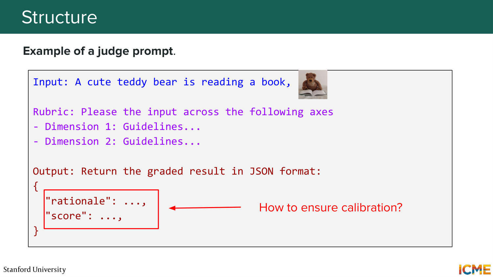

### 📝 幻灯片内容

Structure
Input: A cute teddy bear is reading a book, 
Rubric: Please the input across the following axes
- Dimension 1: Guidelines...
- Dimension 2: Guidelines...
Output: Return the graded result in JSON format: 
{
  "rationale": ...,
  "score": ...,
}
Example of a judge prompt.
How to ensure calibration?

### 💡 通俗解释

*（待补充解释）*

---

## Slide 107

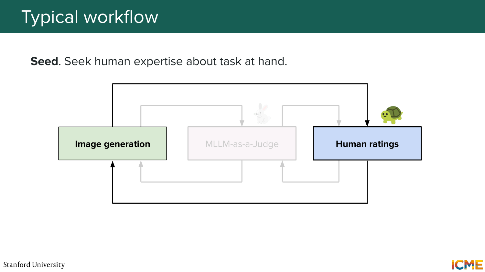

### 📝 幻灯片内容

Typical workflow
MLLM-as-a-Judge
🐇
Seed. Seek human expertise about task at hand.
Image generation
Human ratings
🐢

### 💡 通俗解释

*（待补充解释）*

---

## Slide 108

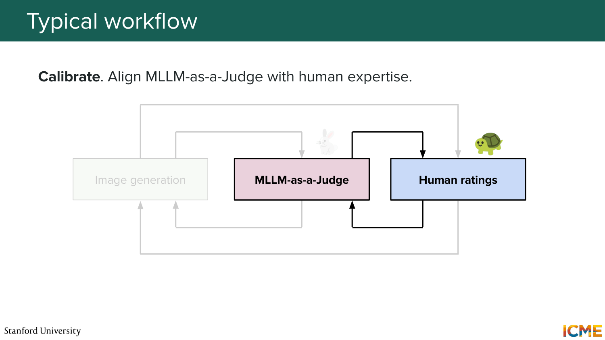

### 📝 幻灯片内容

Typical workflow
Image generation
🐇
Calibrate. Align MLLM-as-a-Judge with human expertise.
Human ratings
MLLM-as-a-Judge
🐢

### 💡 通俗解释

*（待补充解释）*

---

## Slide 109

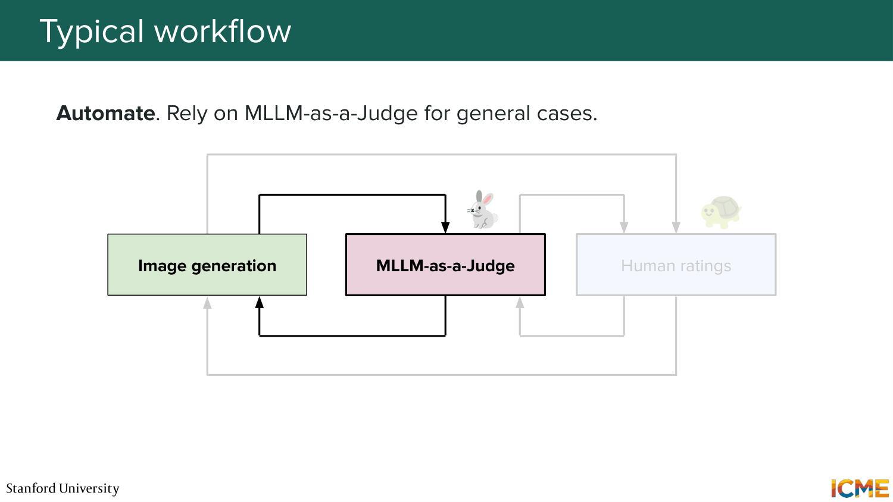

### 📝 幻灯片内容

Typical workflow
Human ratings
🐢
Automate. Rely on MLLM-as-a-Judge for general cases.
Image generation
MLLM-as-a-Judge
🐇

### 💡 通俗解释

*（待补充解释）*

---

## Slide 110

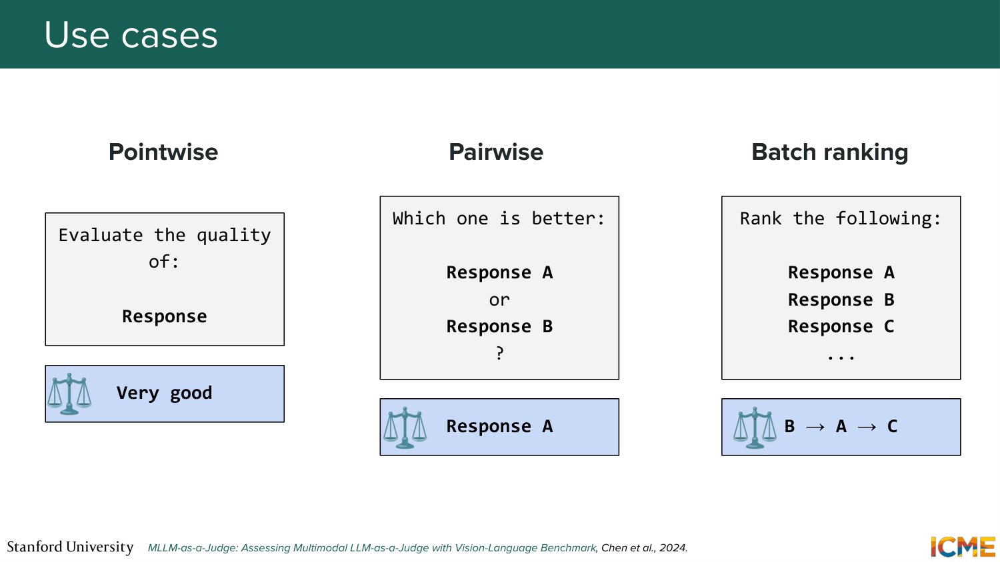

### 📝 幻灯片内容

Use cases
Pointwise
Pairwise
Which one is better:
Response A
or
Response B
?
Response A
Evaluate the quality 
of:
Response
Very good
⚖
⚖
Batch ranking
Rank the following:
Response A
Response B
Response C
...
B → A → C
⚖
MLLM-as-a-Judge: Assessing Multimodal LLM-as-a-Judge with Vision-Language Benchmark, Chen et al., 2024.

### 💡 通俗解释

*（待补充解释）*

---

## Slide 111

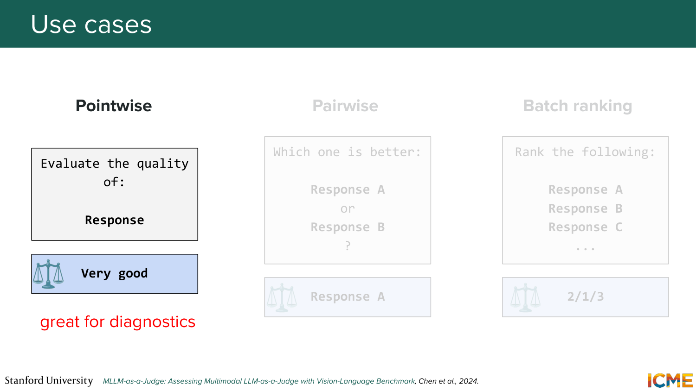

### 📝 幻灯片内容

Use cases
Pointwise
Pairwise
Which one is better:
Response A
or
Response B
?
Response A
Evaluate the quality 
of:
Response
Very good
⚖
⚖
Batch ranking
Rank the following:
Response A
Response B
Response C
...
2/1/3
⚖
great for diagnostics
MLLM-as-a-Judge: Assessing Multimodal LLM-as-a-Judge with Vision-Language Benchmark, Chen et al., 2024.

### 💡 通俗解释

*（待补充解释）*

---

## Slide 112

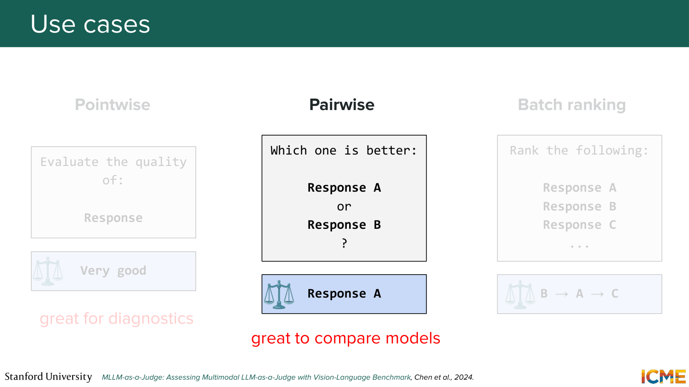

### 📝 幻灯片内容

B → A → C
Use cases
Pointwise
Evaluate the quality 
of:
Response
Very good
⚖
Batch ranking
Rank the following:
Response A
Response B
Response C
...
⚖
great for diagnostics
MLLM-as-a-Judge: Assessing Multimodal LLM-as-a-Judge with Vision-Language Benchmark, Chen et al., 2024.
Pairwise
Which one is better:
Response A
or
Response B
?
Response A
⚖
great to compare models

### 💡 通俗解释

*（待补充解释）*

---

## Slide 113

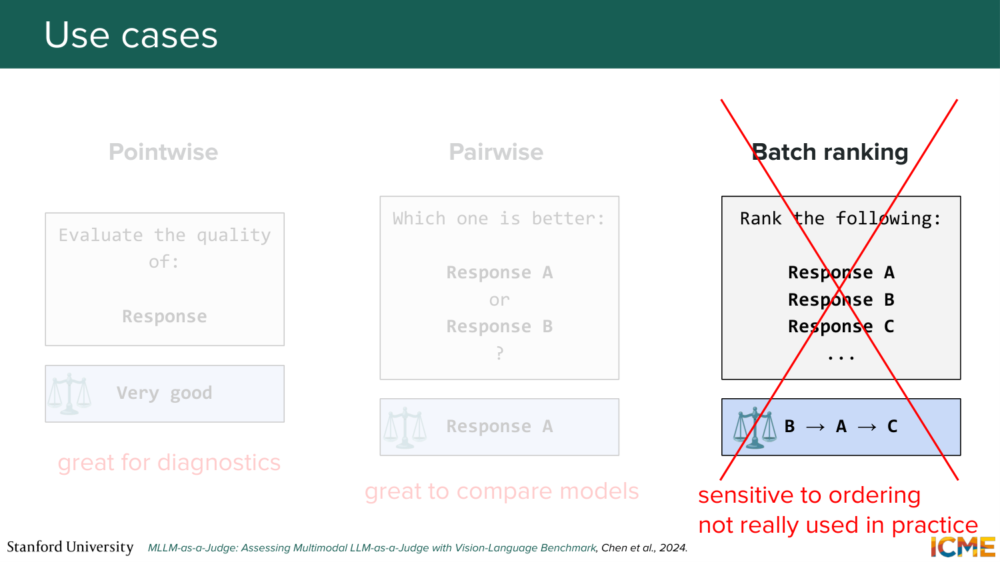

### 📝 幻灯片内容

Use cases
Pointwise
Pairwise
Which one is better:
Response A
or
Response B
?
Response A
Evaluate the quality 
of:
Response
Very good
⚖
⚖
great to compare models
great for diagnostics
MLLM-as-a-Judge: Assessing Multimodal LLM-as-a-Judge with Vision-Language Benchmark, Chen et al., 2024.
B → A → C
Batch ranking
Rank the following:
Response A
Response B
Response C
...
⚖
sensitive to ordering
not really used in practice

### 💡 通俗解释

*（待补充解释）*

---

## Slide 114

### 📝 幻灯片内容

Best practices
●
Parse score into atomic criteria

### 💡 通俗解释

*（待补充解释）*

---

## Slide 115

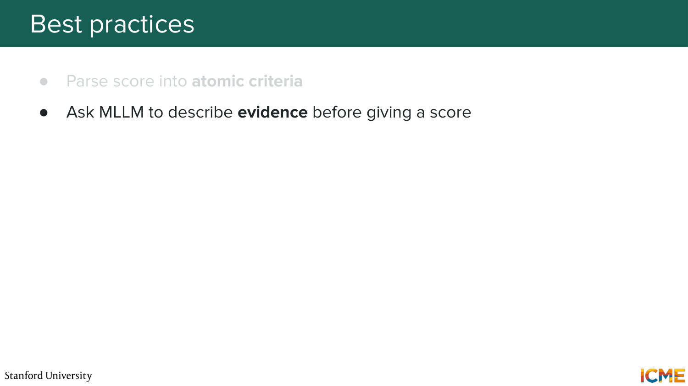

### 📝 幻灯片内容

Best practices
●
Parse score into atomic criteria
●
Ask MLLM to describe evidence before giving a score

### 💡 通俗解释

*（待补充解释）*

---

## Slide 116

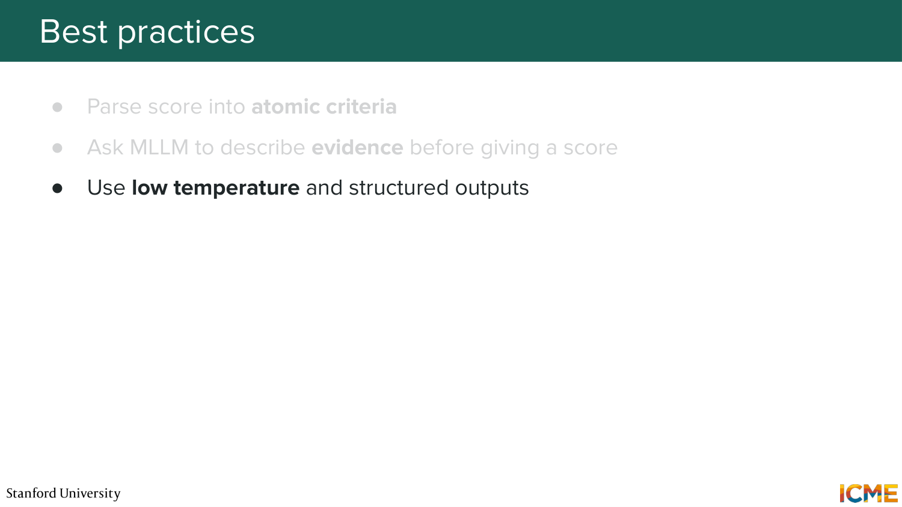

### 📝 幻灯片内容

Best practices
●
Parse score into atomic criteria
●
Ask MLLM to describe evidence before giving a score
●
Use low temperature and structured outputs

### 💡 通俗解释

*（待补充解释）*

---

## Slide 117

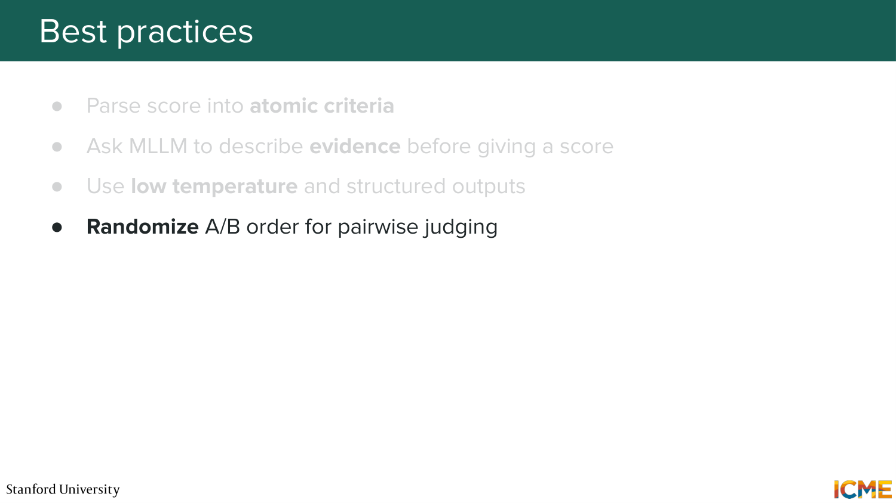

### 📝 幻灯片内容

Best practices
●
Parse score into atomic criteria
●
Ask MLLM to describe evidence before giving a score
●
Use low temperature and structured outputs
●
Randomize A/B order for pairwise judging

### 💡 通俗解释

*（待补充解释）*

---

## Slide 118

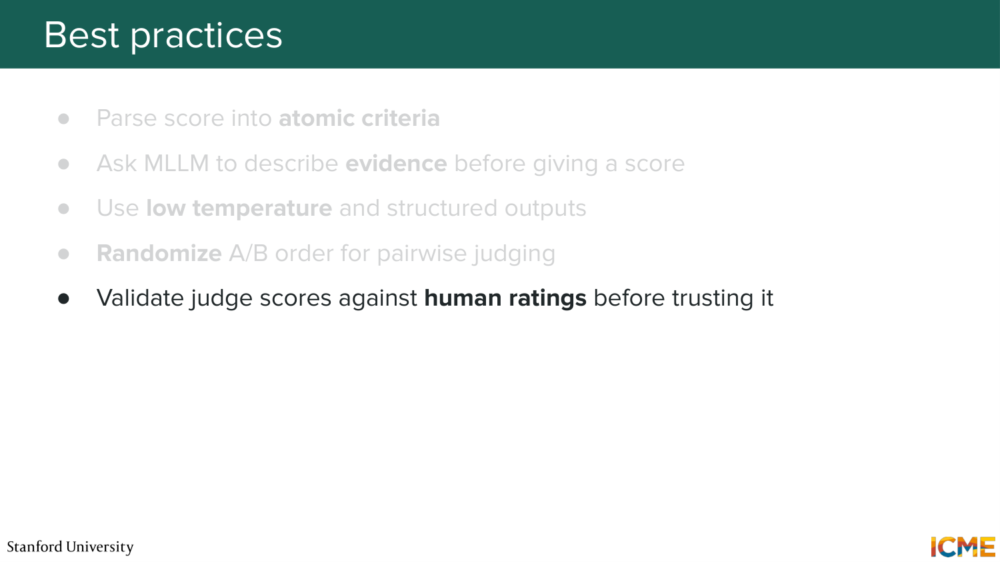

### 📝 幻灯片内容

Best practices
●
Parse score into atomic criteria
●
Ask MLLM to describe evidence before giving a score
●
Use low temperature and structured outputs
●
Randomize A/B order for pairwise judging
●
Validate judge scores against human ratings before trusting it

### 💡 通俗解释

*（待补充解释）*

---

## Slide 119

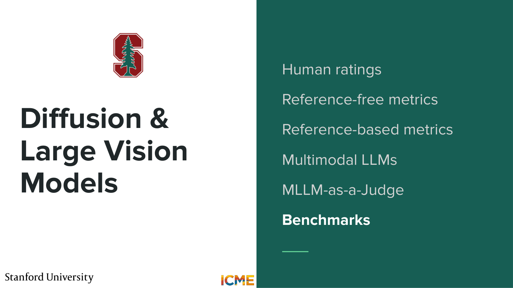

### 📝 幻灯片内容

Human ratings
Reference-free metrics
Reference-based metrics
Multimodal LLMs
MLLM-as-a-Judge
Benchmarks
Diffusion & 
Large Vision 
Models

### 💡 通俗解释

*（待补充解释）*

---

## Slide 120

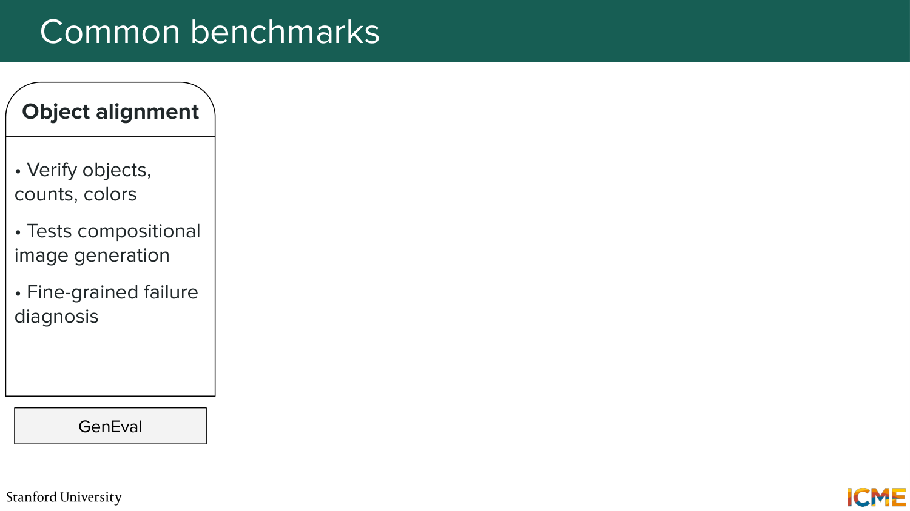

### 📝 幻灯片内容

Common benchmarks
Object alignment
• Verify objects, 
counts, colors
• Tests compositional 
image generation
• Fine-grained failure 
diagnosis
GenEval

### 💡 通俗解释

*（待补充解释）*

---

## Slide 121

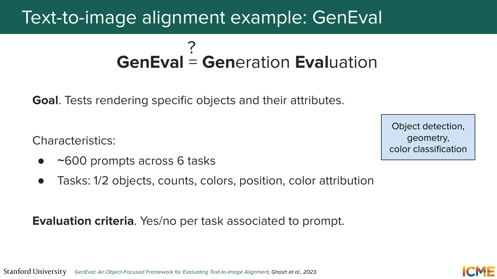

### 📝 幻灯片内容

Text-to-image alignment example: GenEval
GenEval: An Object-Focused Framework for Evaluating Text-to-Image Alignment, Ghosh et al., 2023.
GenEval = Generation Evaluation
?
Goal. Tests rendering specific objects and their attributes.
Characteristics:
●
~600 prompts across 6 tasks
●
Tasks: 1/2 objects, counts, colors, position, color attribution
Evaluation criteria. Yes/no per task associated to prompt.
Object detection,
geometry,
color classification

### 💡 通俗解释

*（待补充解释）*

---

## Slide 122

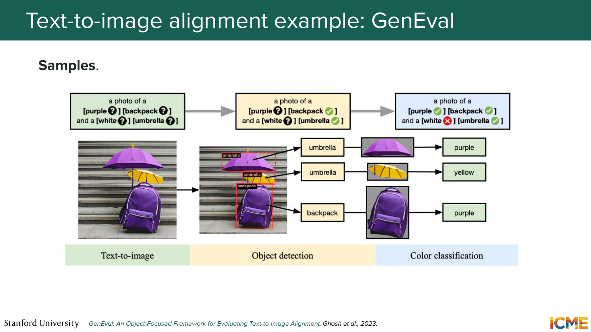

### 📝 幻灯片内容

Text-to-image alignment example: GenEval
GenEval: An Object-Focused Framework for Evaluating Text-to-Image Alignment, Ghosh et al., 2023.
Samples.

### 💡 通俗解释

*（待补充解释）*

---

## Slide 123

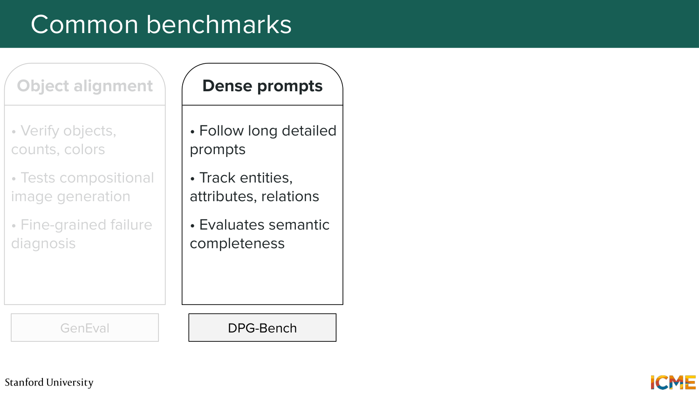

### 📝 幻灯片内容

Common benchmarks
Object alignment
Dense prompts
• Verify objects, 
counts, colors
• Tests compositional 
image generation
• Fine-grained failure 
diagnosis
• Follow long detailed 
prompts
• Track entities, 
attributes, relations
• Evaluates semantic 
completeness
GenEval
DPG-Bench

### 💡 通俗解释

*（待补充解释）*

---

## Slide 124

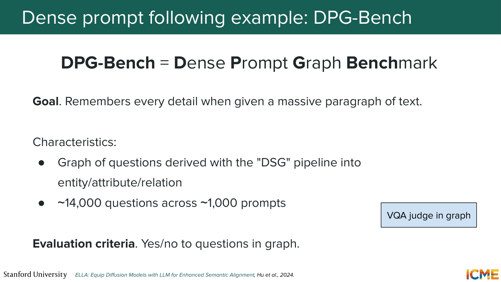

### 📝 幻灯片内容

Dense prompt following example: DPG-Bench
DPG-Bench = Dense Prompt Graph Benchmark
Goal. Remembers every detail when given a massive paragraph of text.
Characteristics:
●
Graph of questions derived with the "DSG" pipeline into 
entity/attribute/relation
●
~14,000 questions across ~1,000 prompts
Evaluation criteria. Yes/no to questions in graph.
VQA judge in graph
ELLA: Equip Diffusion Models with LLM for Enhanced Semantic Alignment, Hu et al., 2024.

### 💡 通俗解释

*（待补充解释）*

---

## Slide 125

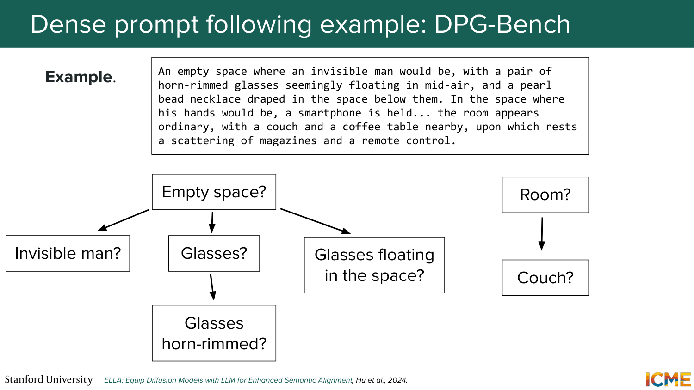

### 📝 幻灯片内容

Example.
Dense prompt following example: DPG-Bench
ELLA: Equip Diffusion Models with LLM for Enhanced Semantic Alignment, Hu et al., 2024.
An empty space where an invisible man would be, with a pair of 
horn-rimmed glasses seemingly floating in mid-air, and a pearl 
bead necklace draped in the space below them. In the space where 
his hands would be, a smartphone is held... the room appears 
ordinary, with a couch and a coffee table nearby, upon which rests 
a scattering of magazines and a remote control.
Empty space?
Invisible man?
Glasses?
Glasses 
horn-rimmed?
Glasses floating 
in the space?
Room?
Couch?

### 💡 通俗解释

*（待补充解释）*

---

## Slide 126

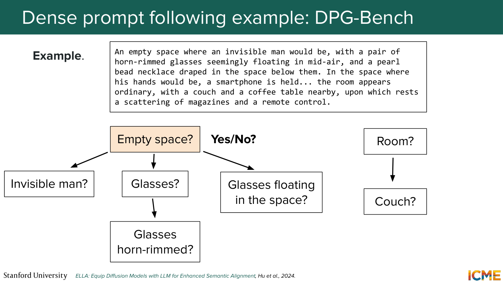

### 📝 幻灯片内容

Example.
Dense prompt following example: DPG-Bench
ELLA: Equip Diffusion Models with LLM for Enhanced Semantic Alignment, Hu et al., 2024.
An empty space where an invisible man would be, with a pair of 
horn-rimmed glasses seemingly floating in mid-air, and a pearl 
bead necklace draped in the space below them. In the space where 
his hands would be, a smartphone is held... the room appears 
ordinary, with a couch and a coffee table nearby, upon which rests 
a scattering of magazines and a remote control.
Empty space?
Invisible man?
Glasses?
Glasses 
horn-rimmed?
Glasses floating 
in the space?
Room?
Couch?
Yes/No?

### 💡 通俗解释

*（待补充解释）*

---

## Slide 127

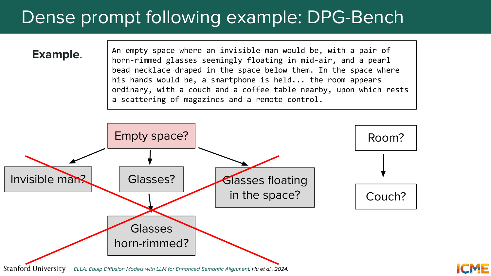

### 📝 幻灯片内容

Example.
Dense prompt following example: DPG-Bench
ELLA: Equip Diffusion Models with LLM for Enhanced Semantic Alignment, Hu et al., 2024.
An empty space where an invisible man would be, with a pair of 
horn-rimmed glasses seemingly floating in mid-air, and a pearl 
bead necklace draped in the space below them. In the space where 
his hands would be, a smartphone is held... the room appears 
ordinary, with a couch and a coffee table nearby, upon which rests 
a scattering of magazines and a remote control.
Empty space?
Invisible man?
Glasses?
Glasses 
horn-rimmed?
Glasses floating 
in the space?
Room?
Couch?

### 💡 通俗解释

*（待补充解释）*

---

## Slide 128

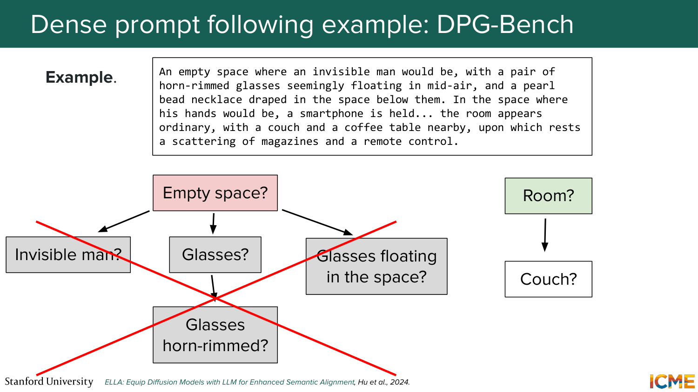

### 📝 幻灯片内容

Example.
Dense prompt following example: DPG-Bench
ELLA: Equip Diffusion Models with LLM for Enhanced Semantic Alignment, Hu et al., 2024.
An empty space where an invisible man would be, with a pair of 
horn-rimmed glasses seemingly floating in mid-air, and a pearl 
bead necklace draped in the space below them. In the space where 
his hands would be, a smartphone is held... the room appears 
ordinary, with a couch and a coffee table nearby, upon which rests 
a scattering of magazines and a remote control.
Empty space?
Invisible man?
Glasses?
Glasses 
horn-rimmed?
Glasses floating 
in the space?
Room?
Couch?

### 💡 通俗解释

*（待补充解释）*

---

## Slide 129

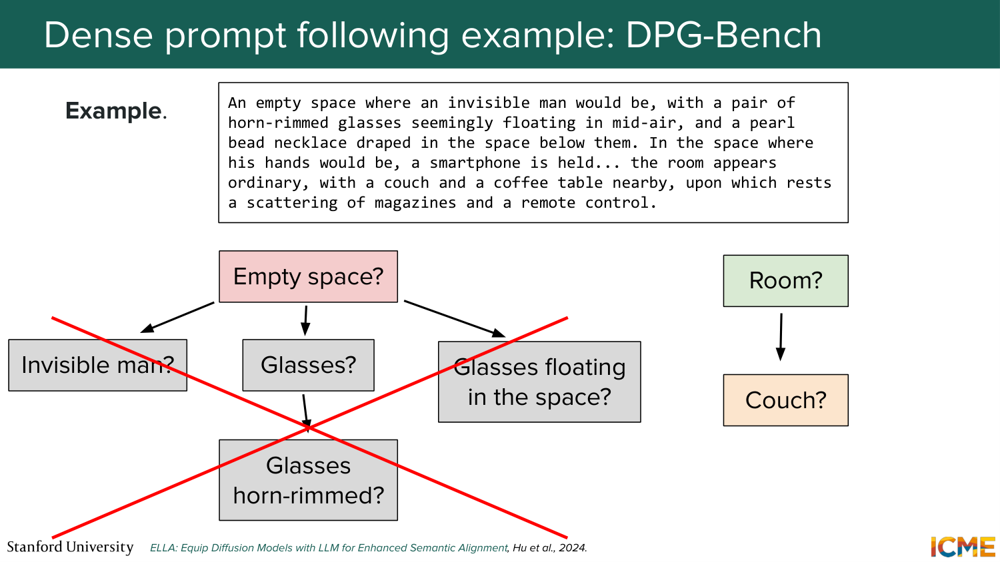

### 📝 幻灯片内容

Example.
Dense prompt following example: DPG-Bench
ELLA: Equip Diffusion Models with LLM for Enhanced Semantic Alignment, Hu et al., 2024.
An empty space where an invisible man would be, with a pair of 
horn-rimmed glasses seemingly floating in mid-air, and a pearl 
bead necklace draped in the space below them. In the space where 
his hands would be, a smartphone is held... the room appears 
ordinary, with a couch and a coffee table nearby, upon which rests 
a scattering of magazines and a remote control.
Empty space?
Invisible man?
Glasses?
Glasses 
horn-rimmed?
Glasses floating 
in the space?
Room?
Couch?

### 💡 通俗解释

*（待补充解释）*

---

## Slide 130

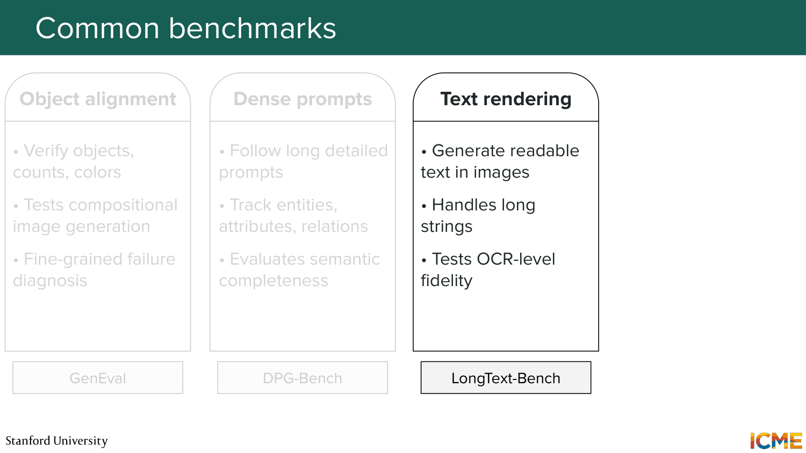

### 📝 幻灯片内容

Common benchmarks
Object alignment
Dense prompts
Text rendering
• Verify objects, 
counts, colors
• Tests compositional 
image generation
• Fine-grained failure 
diagnosis
• Follow long detailed 
prompts
• Track entities, 
attributes, relations
• Evaluates semantic 
completeness
• Generate readable 
text in images
• Handles long 
strings
• Tests OCR-level 
fidelity
GenEval
DPG-Bench
LongText-Bench

### 💡 通俗解释

*（待补充解释）*

---

## Slide 131

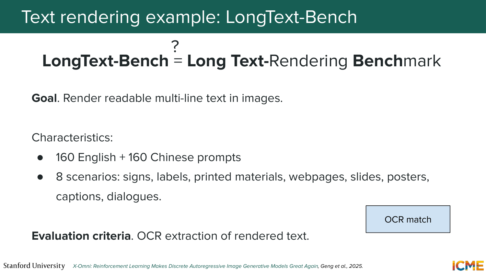

### 📝 幻灯片内容

Text rendering example: LongText-Bench
LongText-Bench = Long Text-Rendering Benchmark
?
Goal. Render readable multi-line text in images.
Characteristics:
●
160 English + 160 Chinese prompts
●
8 scenarios: signs, labels, printed materials, webpages, slides, posters, 
captions, dialogues.
Evaluation criteria. OCR extraction of rendered text.
OCR match
X-Omni: Reinforcement Learning Makes Discrete Autoregressive Image Generative Models Great Again, Geng et al., 2025.

### 💡 通俗解释

*（待补充解释）*

---

## Slide 132

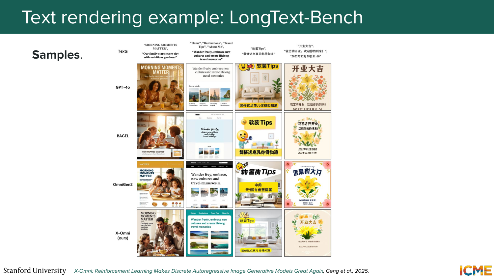

### 📝 幻灯片内容

Text rendering example: LongText-Bench
Samples. 
X-Omni: Reinforcement Learning Makes Discrete Autoregressive Image Generative Models Great Again, Geng et al., 2025.

### 💡 通俗解释

*（待补充解释）*

---

## Slide 133

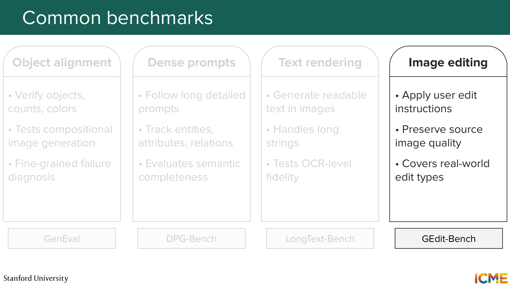

### 📝 幻灯片内容

Common benchmarks
Object alignment
Dense prompts
Text rendering
Image editing
• Verify objects, 
counts, colors
• Tests compositional 
image generation
• Fine-grained failure 
diagnosis
• Follow long detailed 
prompts
• Track entities, 
attributes, relations
• Evaluates semantic 
completeness
• Generate readable 
text in images
• Handles long 
strings
• Tests OCR-level 
fidelity
• Apply user edit 
instructions
• Preserve source 
image quality
• Covers real-world 
edit types
GenEval
DPG-Bench
LongText-Bench
GEdit-Bench

### 💡 通俗解释

*（待补充解释）*

---

## Slide 134

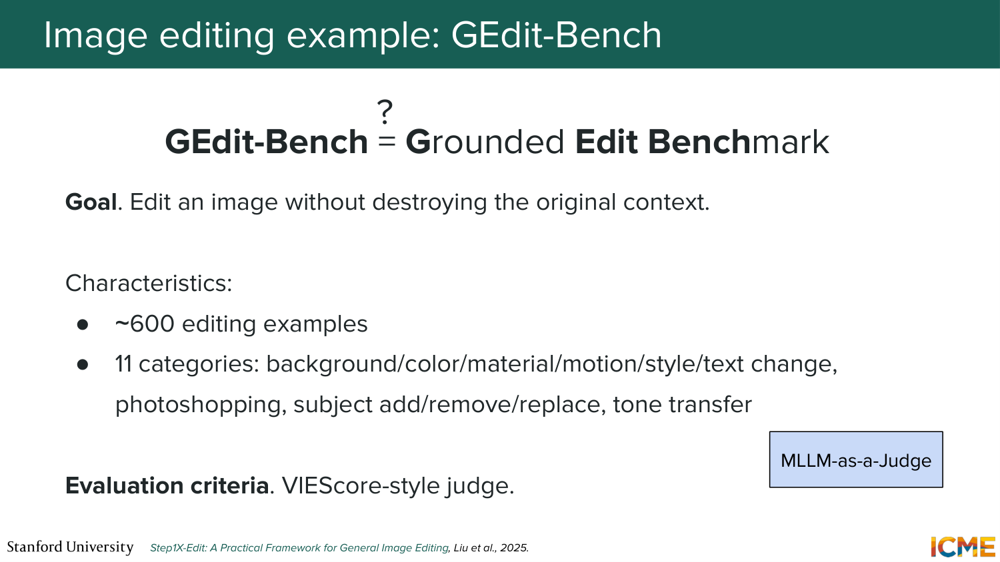

### 📝 幻灯片内容

Image editing example: GEdit-Bench
GEdit-Bench = Grounded Edit Benchmark
?
Goal. Edit an image without destroying the original context.
Characteristics:
●
~600 editing examples
●
11 categories: background/color/material/motion/style/text change, 
photoshopping, subject add/remove/replace, tone transfer 
Evaluation criteria. VIEScore-style judge.
MLLM-as-a-Judge
Step1X-Edit: A Practical Framework for General Image Editing, Liu et al., 2025.

### 💡 通俗解释

*（待补充解释）*

---

## Slide 135

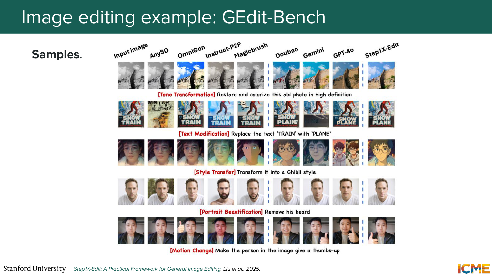

### 📝 幻灯片内容

Image editing example: GEdit-Bench
Step1X-Edit: A Practical Framework for General Image Editing, Liu et al., 2025.
Samples.

### 💡 通俗解释

*（待补充解释）*

---

## Slide 136

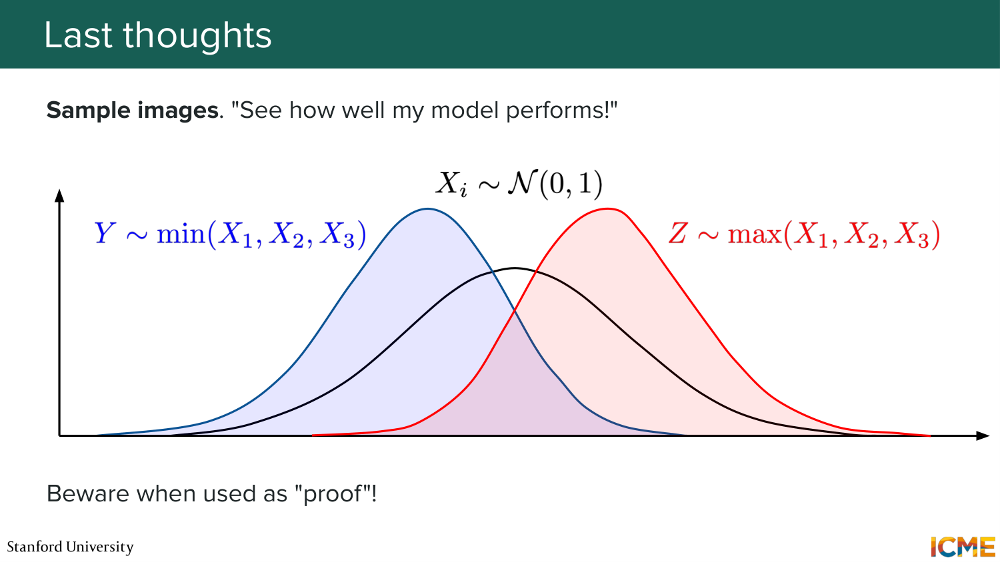

### 📝 幻灯片内容

Last thoughts
Sample images. "See how well my model performs!"
Beware when used as "proof"!

### 💡 通俗解释

*（待补充解释）*

---

## Slide 137

### 💡 通俗解释

*（待补充解释）*

---
