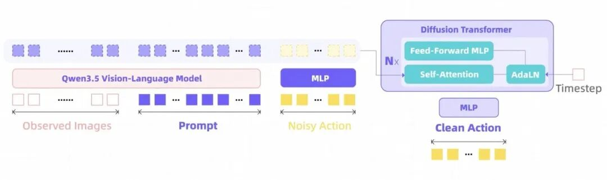
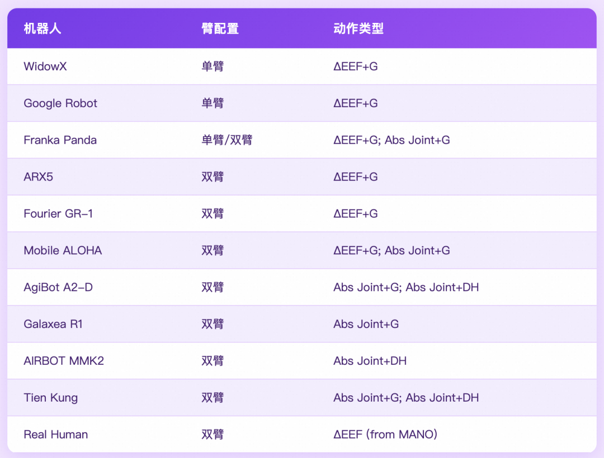
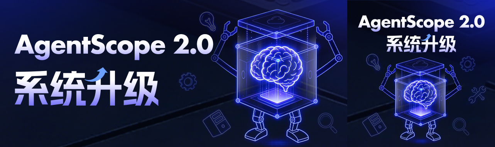
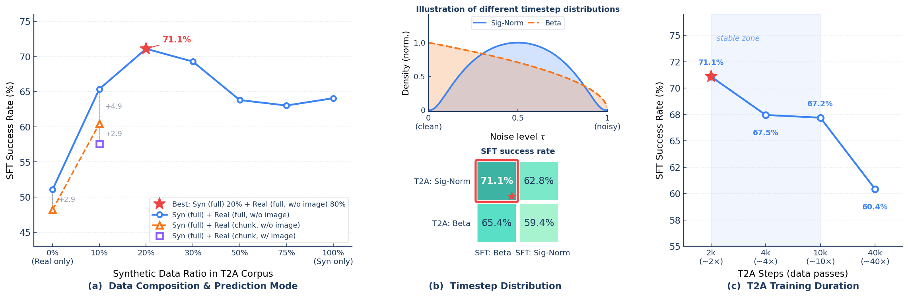
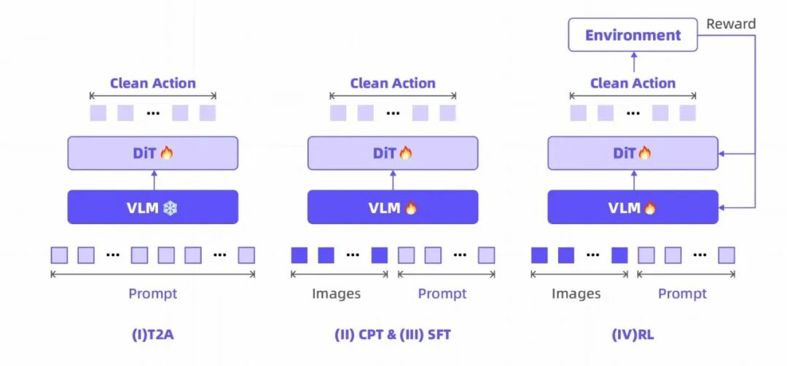
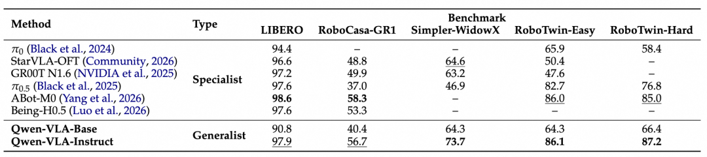
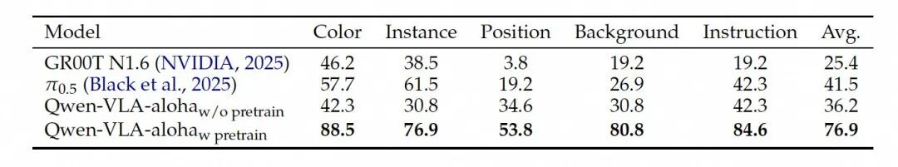
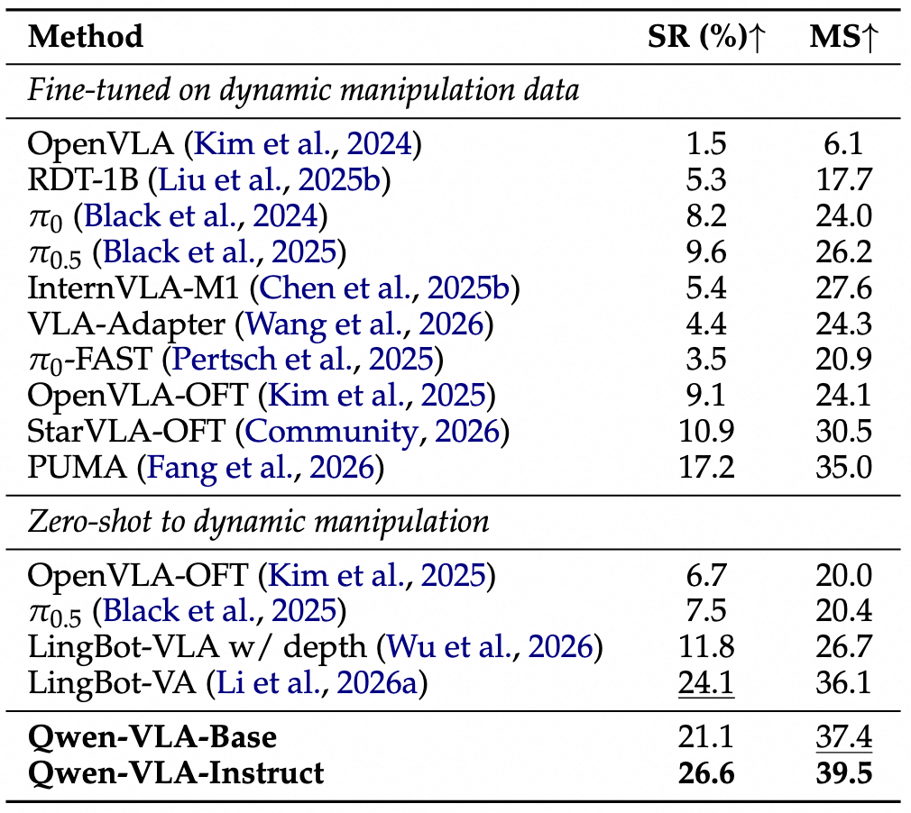
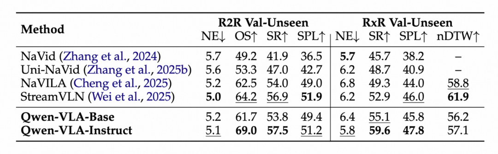
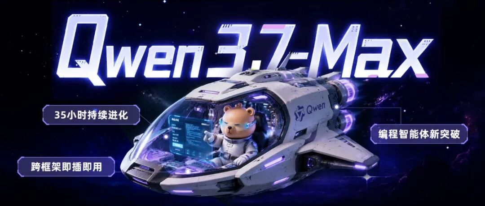

# Qwen-VLA：迈向通用具身智能的统一动作框架

> **通义实验室最新成果** — 以 Qwen3.5-4B 为底座，搭配 DiT 动作解码器，构建通用视觉-语言-动作模型
> 原文来源：微信公众号 | 论文：[arXiv 2605.30280](https://arxiv.org/abs/2605.30280) | 代码：[QwenLM/Qwen-VLA](https://github.com/QwenLM/Qwen-VLA)

---


*Qwen-VLA 理解语言-感知环境-精细操作*

在现有具身智能研究中，操作、导航、轨迹预测这些本应协同工作的能力，却被拆分成独立的模型，各自为战，以至于机器人换个物体、环境、甚至换一个机械臂就不会动了。

这让我们不禁思考：既然大语言模型能用一个大脑统一翻译、写作、问答等千百种文本任务，那机器人的"看、动、走"是不是也能装进同一个大脑？

基于这一思路，通义实验室研究团队最新论文提出了 **Qwen-VLA**。

团队以 Qwen3.5-4B 为底座，搭配基于 DiT 的动作解码器，通过**统一动作轨迹预测框架**、**本体感知提示条件化**、**文本到动作 DiT 预训练（T2A）**等技术路径，构建了通用的视觉-语言-动作模型。

在多项基准测试中，该通用模型不仅超越最佳专用模型，展现出强劲性能，更在 **11 种机器人平台**上实现了**操作**、**导航**与**跨本体控制**的统一，让具身智能正从"技能专家"走向"通用行动者"。

---

## 一、统一动作轨迹预测框架

视觉-语言模型已经"看懂了世界"，但机器人控制仍然是割裂的。

- **操作模型**：通常针对桌面场景或灵巧手设计；
- **导航模型**：围绕室内航路点或动作预测构建；
- **轨迹预测模型**：只在特定坐标系中做规划。

这些模型针对单一任务设计，碎片化的能力限制了跨任务迁移、跨环境适应和跨本体部署。但研究团队观察到一个关键事实，尽管这些任务表面上差异巨大，它们在**计算结构上是同构的**：

> **观察场景 + 理解指令 → 预测未来的动作序列**

这一洞察直接催生了统一建模的可能性。Qwen-VLA 将 Qwen 多模态模型的理解能力延伸到动作生成领域，将操作、导航和运动轨迹统一到同一个 VLA 框架下。



*Qwen-VLA 模型架构*

该模型将 **Qwen3.5-4B** 的视觉语言主干网络（负责感知和推理功能）与 **1.15B 参数的 DiT 动作解码器**相结合。不同任务数据可以在同一个训练过程中共同提供监督，模型从中习得的视觉定位和空间推理能力也因此可以跨任务迁移。

---

## 二、本体感知提示条件化

真实世界中的机器人硬件差异巨大：自由度数量、控制频率、运动学约束、接口协议各不相同。传统方案通常为每种机器人本体定制独立的模型分支或输出头。

Qwen-VLA 选择了一条更轻量的路径：将硬件差异转化为语言理解问题，用**一段结构化文本提示**作为**唯一的平台特定接口**。

在每个训练样本的输入前端，拼接一段描述当前机器人的文本提示：

```
The robot is {robot_tag} with {single arm / dual arms}[, waist][, and mobile base]. 
The control frequency is {FPS}Hz. 
Please predict the next {chunk_size} control actions to execute the following task: {ori_instruction}.
```

这段提示将机器人型号、机械臂数量、是否有腰部关节和移动底座、控制频率和预测时域等**关键信息全部编码为自然语言**，交由 VLM 骨干网络处理。骨干网络输出的隐藏状态随后与噪声动作块拼接，一起送入 DiT 动作专家。

整个过程**不需要对模型架构做任何修改**。这一机制使得同一个动作解码器可以在训练时同时接受来自十余种机器人平台的数据，在推理时只需替换提示中的平台描述即可切换控制约定。



*Qwen-VLA 支持的机器人平台类型*

---

## 三、文本到动作 DiT 预训练（T2A）

训练 Qwen-VLA 模型，本质上是要让两个模块协同工作：

1. **VLM 骨干网络**（已预训练）：负责看图和理解语言
2. **DiT 动作解码器**（随机初始化）：负责把理解结果转化成具体动作

这样会面临结构性的问题：如果直接启动多模态联合训练，可能会浪费计算资源在视觉无关的解码器学习上，并且干扰预训练的成果。

**解决方案：先把 VLM 冻住，单独训练 DiT，而且故意不给图像，只给文字。**



*T2A 文本到动作预训练*

目的是让 DiT 先学会"动作是什么"——理解不同指令对应什么样的动作模式，学会根据机器人类型调整控制方式。这一步完成后，DiT 虽然还不会看图，但已经具备了基本的动作生成能力。由于省去了图像编码，**T2A 每步的计算代价约为多模态训练的 1/10**。

### 消融实验成果

- **数据构成**：20%合成 + 80%真实混合达到最佳（71.1%），比纯真实提升 +20 百分点，比纯合成提升 +7 百分点
- **视觉输入对比**：不带图像达到 60.4%，带图像反而只有 57.6%（下降 -2.8 百分点）——验证了 T2A 无视觉设计的合理性
- **训练时长**：性能在 2,000 步达峰值（71.1%），40,000 步观察到退化（60.4%）

在文本到动作 DiT 预训练之后，解冻所有参数以进行**持续的多模态预训练 → 监督微调 → 强化学习**，逐步调整异构数据中的视觉、语言和动作。

---

## 四、四阶段训练



*Qwen-VLA 四阶段训练流程*

四个阶段构成一条清晰的能力递进链条：

### 阶段 1：文本到动作预训练（T2A）

- 冻结 VLM，纯文本训练 DiT
- 解码器学会动作分布、文本-动作对齐、本体条件化、flow-matching 动力学

### 阶段 2：持续预训练（CPT）

- 解锁 VLM 和 DiT 全部参数
- 在大规模异构数据混合上联合训练
- 专注于将动作落地到视觉观测，让骨干网络适应具身感知

### 阶段 3：监督微调（SFT）

从 CPT 检查点出发，分两条并行分支：

1. **多仿真环境微调**：验证一个通用模型在多任务联合训练下能够匹配甚至超越单任务专用模型
2. **真机遥操作微调**：验证预训练表征向真实场景的迁移能力

### 阶段 4：强化学习（RL）

- 从多任务 SFT 检查点出发
- 在 SimplerEnv 中用稀疏二值成功奖励做强化学习
- 直接优化闭环任务成功率

---

## 五、实验结果

### 5.1 通用模型超越专用模型

单一 Qwen-VLA 通用模型在 5 个仿真基准中的 **3 个超越了最佳专用模型**：



*Qwen-VLA vs 专用模型基准对比*

这些专用模型是针对每个基准独立微调的，而 Qwen-VLA 是在所有数据上统一训练的单一模型，通过本体感知提示即可部署到任何平台。

### 5.2 预训练模型开放世界泛化性测试

在 ALOHA 双臂机器人上对 QwenVLA-Base 进行了零样本评估，结果显示模型在 **5 种分布外维度**均表现卓越：

- 能精准区分仅颜色不同的目标物体
- 成功抓取或清理训练集中未见的日常物品（如西兰花、玩具鸭、雨伞）
- 正确理解"接近"等罕见动作指令以与新类别物体（如太阳镜、毛绒娃娃）交互
- 在未见过的黄色背景下完成拧笔帽等精细操作

### 5.3 真实世界的 OOD 泛化能力

在 ALOHA 双臂真机平台上，Qwen-VLA 在 6 类 in-domain 任务上达到 **83.6% 平均成功率**。



*真实世界分布外泛化表现*

更令人印象深刻的是分布外（OOD）泛化表现——在颜色、实例、位置、背景、指令五个泛化维度上：

| 模型 | 颜色 | 实例 | 位置 | 背景 | 指令 | **平均** |
|------|:---:|:---:|:---:|:---:|:---:|:---:|
| GR00T N1.6 | 46.2 | 38.5 | 3.8 | 19.2 | 19.2 | 25.4 |
| π₀.₅ | 57.7 | 61.5 | 19.2 | 26.9 | 42.3 | 41.5 |
| Qwen-VLA (无预训练) | 42.3 | 30.8 | 34.6 | 30.8 | 42.3 | 36.2 |
| **Qwen-VLA (有预训练)** | **88.5** | **76.9** | **53.8** | **80.8** | **84.6** | **76.9** |

平均 OOD 成功率达 **76.9%**，超越 π₀.₅（+35.4 个百分点）及无预训练变体（+40.7 个百分点）。

### 5.4 没有动态训练数据也能操作运动物体

DOMINO 是一个评估动态操作能力的基准，要求机器人在物体运动中实时追踪并完成操作。这对 VLA 模型是一个极端的分布外测试，因为绝大多数训练数据都是静态场景。



*DOMINO 动态操作基准*

Qwen-VLA 在**完全零样本**的条件下（没有使用任何 DOMINO 训练数据）达到 **26.6% 成功率**：

| 模型 | DOMINO SR | DOMINO MS |
|------|:---:|:---:|
| π₀.₅ (零样本) | 7.46% | - |
| OpenVLA-OFT (零样本) | 6.7% | - |
| PUMA (DOMINO 微调) | 17.2% | - |
| **Qwen-VLA (零样本)** | **26.6%** | **39.5%** |

这一能力归因于两个因素：

1. **flow-matching 动作解码器**产生连贯的动作块，减少了犹豫和迟疑
2. **大规模联合预训练**（操作+导航+轨迹预测+视觉-语言数据）提供了可迁移的视觉定位、空间推理和连续控制先验

### 5.5 通用模型超越导航专家

Qwen-VLA 在视觉-语言导航连续环境（VLN-CE）基准上达到最佳成功率：

| 模型 | R2R OS | R2R SR | RxR SR |
|------|:---:|:---:|:---:|
| StreamVLN (导航专用) | - | - | - |
| **Qwen-VLA-Instruct** | **69.0%** | **57.5%** | **59.6%** |



*Qwen-VLA 导航与跟踪能力*

Qwen-VLA 的**任务自适应 token 分配机制**是导航性能的关键：它为长时程指令跟随分配更大的视觉 token 预算，使模型能保留比固定均匀采样或滑动窗口上下文更丰富的 episode 历史。

---

## 六、GitHub 项目分析

### 6.1 项目概览

| 项目 | 信息 |
|------|------|
| **仓库** | [QwenLM/Qwen-VLA](https://github.com/QwenLM/Qwen-VLA) |
| **Stars** | 650+ |
| **创建时间** | 2026-05-29 |
| **论文** | [arXiv 2605.30280](https://arxiv.org/abs/2605.30280) |
| **作者数** | 40 位研究者 |
| **分类** | cs.RO (机器人学), cs.AI (人工智能), cs.CL (计算语言学) |

### 6.2 当前状态

截至 2026 年 6 月，该 GitHub 仓库目前处于**项目占位阶段**：

- ✅ README.md 已发布，包含项目介绍、Demo 视频、核心亮点、基准测试结果
- ✅ 论文已发布（arXiv）
- 📹 Demo 视频已上传
- ⏳ **代码尚未完全开源** — 目前仓库仅包含 README 和资源文件（assets/）

这是大型研究项目的常见发布节奏：先发论文和占位仓库，再逐步开源代码和模型权重。

### 6.3 论文核心贡献（来自 arXiv 摘要）

Qwen-VLA 将 Qwen 的视觉-语言建模栈从**感知、理解和推理**延伸到**连续动作和轨迹生成**，通过基于 DiT 的动作解码器实现。

训练采用大规模联合预训练配方，覆盖多种数据源：

- 机器人操作轨迹
- 人类第一人称演示
- 合成仿真数据
- 视觉-语言导航数据
- 轨迹级监督数据
- 辅助视觉-语言数据

---

## 七、结语

Qwen-VLA 的核心贡献不在于任何单一的数字突破，而在于系统性地证明了一个假设：

> **操作、导航和轨迹预测确实可以被视为同一个"条件动作预测问题"的不同实例化，而跨本体泛化可以通过将硬件差异编码为自然语言来优雅地实现。**

如果说过去两年 VLA 模型还在"做一个机器人、做一个任务、训一个模型"的阶段挣扎，那么 Qwen-VLA 是把整个领域往**"做一个通用具身大脑"**这条路推了实质性的一步。剩下的，是数据、硬件和工程的共同努力。

---

## 八、推荐阅读

[](https://mp.weixin.qq.com/s?__biz=MzkxMTYyMTAzNA==&mid=2247501096&idx=1&sn=e5ff142efc9dacc6389026628c71f33a&scene=21#wechat_redirect)

*Qwen3.7-Max 重新定义 AI Agent 基座*

[](https://mp.weixin.qq.com/s?__biz=MzkxMTYyMTAzNA==&mid=2247501135&idx=1&sn=0b96d8e21b27a20f60c423657f2bca84&scene=21#wechat_redirect)

*从透明开发到系统工程：AgentScope 2.0 发布*

---

## 附录：专业词汇通俗解释

| 术语 | 通俗解释 |
|------|---------|
| **VLA (Vision-Language-Action)** | 视觉-语言-动作模型。就像给机器人装了"眼睛+大脑+手脚"——眼睛看环境，大脑理解指令，手脚执行动作。以前的模型只会"看和说"，Qwen-VLA 让它能"看、想、做"一气呵成。 |
| **DiT (Diffusion Transformer)** | 扩散Transformer。一种生成模型架构，类似于AI画图时"从噪点逐步画出清晰图像"的过程，这里用来"从噪声逐步生成机器人的动作序列"。 |
| **Flow Matching** | 流匹配。Diffusion的升级版，训练更稳定、生成质量更高。类比：Diffusion像是"随机游走找到目的地"，Flow Matching像是"修一条直达的高速公路"。 |
| **本体感知提示 (Embodiment-Aware Prompt)** | 让同一个模型能控制不同机器人的秘诀。就像你告诉AI"你现在是一个有两条手臂、站在轮子上的机器人"或"你现在是一个有机械臂的移动底盘"，它就能自动调整控制方式，不需要重新训练。 |
| **OOD (Out-of-Distribution) 泛化** | 分布外泛化。模型在训练中没见过的情况下仍能正常工作的能力。类比：驾校只教了白天开车，但晚上、雨天、陌生路段也能开得好，这就是OOD泛化能力强。 |
| **T2A (Text-to-Action)** | 文本到动作。给模型一段文字指令，它直接输出机器人的动作序列。就像你说"把杯子拿起来"，模型就能计算出机械臂需要移动的每一个角度和位置。 |
| **SFT (Supervised Fine-Tuning)** | 监督微调。在大模型预训练完成后，用高质量的"问题-答案"配对数据进一步训练，让它更擅长特定任务。类比：大学生毕业后去公司实习，学习具体岗位技能。 |
| **RL (Reinforcement Learning)** | 强化学习。让模型在环境中尝试，成功了给奖励，失败了不给，通过不断试错来优化策略。类比：训练小狗，做对了给零食，做错了不给，久而久之它就学会了。 |
| **零样本 (Zero-Shot)** | 模型在没有见过某类任务数据的情况下，直接就能完成该任务。类比：你从来没学过法语，但看到一段法语指令也能猜出大概意思并做出正确反应。 |
| **CPT (Continued Pre-Training)** | 持续预训练。在已有预训练模型基础上，用新的、特定领域的数据继续训练，让模型"补课"。类比：一个通识教育毕业的学生，再去学医学专业知识。 |
| **LIBERO / SimplerEnv / R2R** | 机器人评测基准。LIBERO测操作能力（抓取、放置等），SimplerEnv测泛化能力，R2R/RxR测导航能力（根据语言指令在环境中行走）。就像考试的不同科目。 |
| **ALOHA** | 一种双臂机器人平台，有两个机械臂可以协同操作。Qwen-VLA在真机上做了大量实验验证其泛化能力。 |
| **DOMINO** | 动态操作基准。测试机器人在物体运动过程中实时追踪和操作的能力。大多数训练数据是静态场景，所以这对模型是很大的挑战。 |
| **Qwen3.5-4B** | 通义千问3.5的40亿参数版本，作为Qwen-VLA的"视觉语言大脑"，负责看图片和理解文字指令。 |
