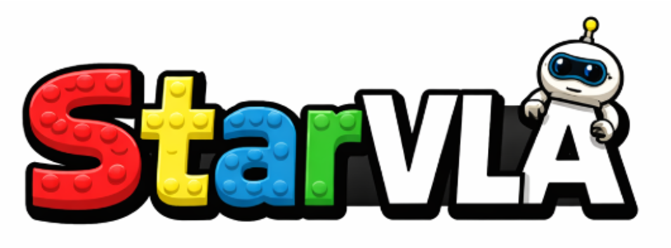
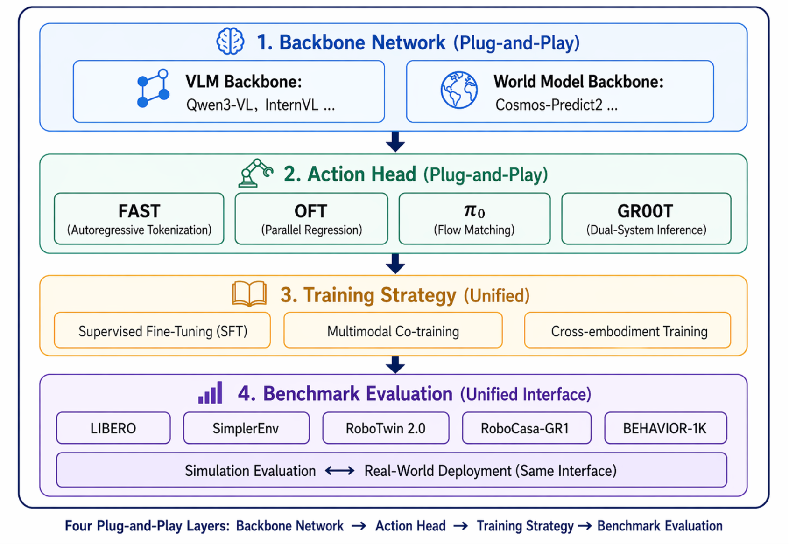
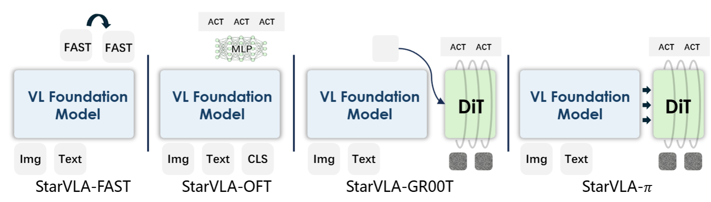
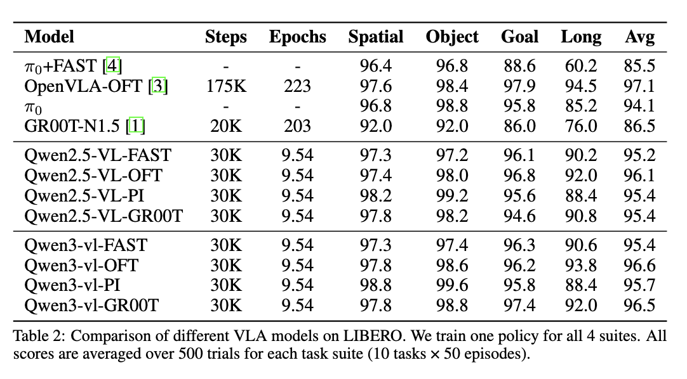
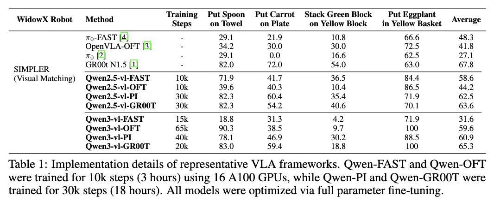
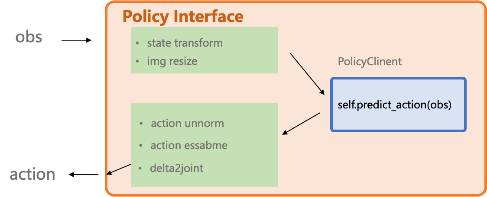

# StarVLA：乐高式 VLA 模型开发平台深度解析

> **A Lego-like Codebase for Vision-Language-Action Model Developing**
> 一个开源的通用机器人前沿技术集成与探索研究平台
> GitHub: [starVLA/starVLA](https://github.com/starVLA/starVLA) | 论文: [arXiv 2604.05014](https://arxiv.org/abs/2604.05014) | 主页: [starvla.github.io](https://starvla.github.io/)

---

## 一、StarVLA 是什么？

**一句话回答：** StarVLA 是一个**"乐高式"视觉-语言-动作（VLA）模型开源开发平台**，让研究者像搭积木一样组合不同的视觉大模型、动作解码器和数据集，快速实验具身智能新架构。



名字本身就是个双关语：**"StarVLA" = "Start VLA"**，意思是"开始你的 VLA 之旅"。

### 为什么需要 StarVLA？

在具身智能领域，研究者面临一个核心痛点：

> 每次想实验一个新 VLA 架构，都要从头搭建数据管道、训练框架、评测流程——重复造轮子，几个月才能跑出一个 baseline。

StarVLA 的解决方案是：**把 VLA 研究拆解成一个可组合的"堆栈"**，每个组件（模型、数据、训练器、配置、评测）都是独立的、可插拔的。换掉任意一个模块，不需要改其他代码。



*StarVLA 框架总览 — VLA 研究被组织成一个可组合的堆栈：共享训练基础设施 + 可插拔基础模型骨干 + 可互换动作头 + 与基准无关的部署钩子*

---

## 二、核心架构：乐高式设计

### 2.1 整体架构

```
┌─────────────────────────────────────────────────────────────────┐
│                        StarVLA 训练流程                          │
├─────────────────────────────────────────────────────────────────┤
│                                                                 │
│  📊 数据层  ──►  🧠 模型层  ──►  🏋️ 训练层  ──►  🚀 部署层       │
│                                                                 │
│  ┌────────────┐  ┌──────────────────────┐  ┌─────────────────┐ │
│  │ LeRobot数据 │  │ VLM骨干 (可插拔):     │  │ SFT 监督微调    │ │
│  │ VLM多模态   │  │ Qwen3/3.5 (0.8B-9B)  │  │ 多目标联合训练   │ │
│  │ GR00T管道   │  │ Gemma4, MiniCPM      │  │ 跨本体联合训练   │ │
│  │             │  │ Florence-2 (单卡可跑) │  │ RL 后训练(RLinf)│ │
│  └────────────┘  │ Cosmos-Reason2       │  └─────────────────┘ │
│                  └──────────────────────┘                       │
│                  ┌──────────────────────┐  ┌─────────────────┐ │
│                  │ 世界模型 (WM4A):      │  │ Docker 环境     │ │
│                  │ Wan2, Cosmos-Predict2│  │ Model Server    │ │
│                  └──────────────────────┘  │ 真机部署(Franka)│ │
│                  ┌──────────────────────┐  └─────────────────┘ │
│                  │ 动作头 (可互换):      │                      │
│                  │ FAST (离散自回归)    │                      │
│                  │ OFT (MLP并行解码)    │                      │
│                  │ PI (Flow-Matching)   │                      │
│                  │ GR00T (双系统)       │                      │
│                  └──────────────────────┘                      │
│                                                                 │
└─────────────────────────────────────────────────────────────────┘
```

### 2.2 数据流


*数据流视图 — 统一的模块化管道连接异构数据源、可插拔数据加载器和灵活的数据表示，通过标准化的模型前向传播接口，实现端到端训练和部署*

数据层的设计原则：
- **Dataloader 返回模型无关的原始字典**，不做模型特定的预处理（如 tokenization、图像编码）
- 每个样本包含：`image`（图像列表）、`lang`（语言指令）、`action`（动作序列）、`state`（可选的本体状态）
- `framework.forward()` 和 `framework.predict_action()` 直接在原始输入上操作，**训练/测试边界明确**

---

## 三、四种 VLA 架构变体（可插拔动作头）

StarVLA 内置了四种主流 VLA 架构，共享同一数据接口和基础设施，**只需换动作头**：



*StarVLA 四种架构变体 — 仅动作头不同，其余完全复用*

| 架构 | 动作解码方式 | 类比 | 适合场景 |
|------|------------|------|---------|
| **StarVLA-FAST** | 自回归离散动作 Token（π₀-fast 风格） | 像 GPT 逐字"说出"动作 | 快速推理，离散动作空间 |
| **StarVLA-OFT** | MLP 并行连续动作解码（OpenVLA-OFT 风格） | 一次性输出所有关节角度 | 简单直接，计算量小 |
| **StarVLA-PI** | Flow-Matching 扩散动作专家（π₀ 风格） | 从噪声逐步"画"出动作轨迹 | 高质量连续动作 |
| **StarVLA-GR00T** | 双系统：VLM=慢思考 + Flow-Matching=快反射 | 人类的双重认知系统 | 复杂任务，需要规划+反射 |

### 代码示例：注册一个新架构只需一行

```python
from starVLA.model.tools import FRAMEWORK_REGISTRY

@FRAMEWORK_REGISTRY.register("MyNewVLA")
class MyNewVLA(baseframework):
    def __init__(self, cfg):
        super().__init__(cfg)
        # 定义你的模型组件
        self.qwen_vl_interface = QwenVL(cfg)
        self.action_model = MyActionHead(cfg)
    
    def forward(self, **kwargs):
        # 前向传播
        ...
```

---

## 四、支持的视觉大模型（VLM）骨干

StarVLA 几乎支持所有主流开源 VLM 作为"大脑"：

| VLM 骨干 | 参数规模 | 特点 |
|---------|---------|------|
| **Qwen3 / Qwen3.5** | 0.8B / 2B / 4B / 9B | 通义千问，社区最快集成 ⚡ |
| **Gemma4** | - | Google 开源模型 |
| **MiniCPM_V** | - | 面壁智能的小而美模型 |
| **Florence-2** | - | 微软小模型，**单张 A100 即可训练** |
| **Molmo2** | - | Allen AI 的开源 VLM |
| **Cosmos-Reason2** | - | NVIDIA 的具身推理模型 |
| **ABot-M0** | - | 高德地图 CV 实验室预训练权重 |

这意味着你可以用 **Qwen3.5-0.8B 在单卡上跑实验**，也可以换 **Qwen3.5-9B 追求更强性能**，代码不需要大改。

---

## 五、世界模型到 VLA（WM4A）——创新特性

这是一个非常创新的方向：**用视频生成模型作为动作预测的骨干**！

### 支持的 WM4A 架构

| 架构 | 世界模型 | 动作头 |
|------|---------|--------|
| WanGR00T | Wan2 | GR00T 双系统 |
| WanOFT | Wan2 | OFT MLP 解码 |
| WanPI | Wan2 | Flow-Matching |
| CosmoPredict2GR00T | Cosmos-Predict2 | GR00T 双系统 |
| CosmoPredict2OFT | Cosmos-Predict2 | OFT MLP 解码 |
| CosmoPredict2PI | Cosmos-Predict2 | Flow-Matching |

**原理类比：**

> 让一个"会画未来的 AI"（视频生成模型）来"画出机器人下一步的动作"。
> 
> Wan2 或 Cosmos-Predict2 这些世界模型已经学会了"物理世界是如何演化的"，把它们用来预测动作，相当于让模型"想象"执行某个动作后世界会变成什么样，从而选择最优动作。

预训练模型权重已发布在 [StarVLA/world-model-to-vla](https://huggingface.co/collections/StarVLA/world-model-to-vla) HuggingFace 集合中。

---

## 六、训练策略

### 6.1 四种训练范式

| 训练策略 | 说明 | 适用场景 |
|---------|------|---------|
| **SFT（监督微调）** | 用高质量"指令-动作"配对数据微调 | 快速适配特定任务 |
| **多目标联合训练** | 同时训练 VLM 能力和 VLA 能力 | 防止遗忘语言能力 |
| **跨本体联合训练** | 多种机器人数据混合训练 | 训练通用模型 |
| **RL 后训练** | 通过 RLinf 集成，稀疏奖励优化 | 提升闭环任务成功率 |

### 6.2 三个训练脚本

```bash
# 1. 训练 VLA（视觉-语言-动作模型）
python starVLA/training/train_starvla.py \
  --config_yaml examples/LIBERO/train_files/starvla_cotrain_oxe.yaml

# 2. 训练 VLA + VLM 联合训练（多模态）
python starVLA/training/train_starvla_cotrain.py \
  --config_yaml examples/CoTrainVLM/starvla_cotrain_oxe.yaml

# 3. 训练 VLM（纯视觉语言模型）
python starVLA/training/train_starvlm.py \
  --config_yaml examples/CoTrainVLM/starvlm_config.yaml

# 4. 训练 VLN（视觉-语言-导航）
python starVLA/training/train_starvln.py \
  --config_yaml examples/VLN-CE/train_files/starvln_config.yaml
```

### 6.3 训练效率报告

StarVLA 发布了详细的 [Training Efficiency Report](https://github.com/starVLA/starVLA/issues/158) 和 [Training Curves](https://github.com/starVLA/starVLA/issues/68)，包含社区参考的训练配置和效率基准。

**关键技巧：**

- **冻结 VLM**：`--trainer.freeze_modules "qwen_vl_interface.model.model.visual"` 可以大幅减少显存
- **不同模块不同学习率**：在 config 中用 `learning_rate: {base: 1e-5, action_model: 1e-4}` 分别设置
- **从 checkpoint 恢复**：指定 `pretrained_checkpoint` 路径，支持部分模块重载

---

## 七、评测基准与 SOTA 表现

StarVLA 在多个权威基准上达到了最优性能：

### 7.1 LIBERO（桌面操作基准）



*StarVLA 在 LIBERO 各子任务上的表现*

### 7.2 SimplerEnv（WidowX 机器人泛化）



*StarVLA 在 SimplerEnv 上的表现*

### 7.3 RoboCasa-GR1（人形机器人操作）


*StarVLA 在 RoboCasa-GR1 上无需预训练即达到 SOTA*

### 7.4 Calvin（长程多步操作）


*StarVLA 在 Calvin 数据集上的表现*

更多实时结果可以在 [StarVLA Overleaf](https://www.overleaf.com/read/qqtwrnprctkf#d5bdce) 上查看。

---

## 八、支持的基准一览

| 基准 | 测试内容 | 状态 |
|------|---------|------|
| **SimplerEnv** | WidowX 机器人泛化能力 | ✅ 已集成 |
| **LIBERO** | 桌面操作（抓取、放置等） | ✅ 已集成 |
| **LIBERO-plus** | LIBERO 增强版 | ✅ 已集成 |
| **RoboCasa-GR1** | 人形机器人操作 | ✅ 已集成 |
| **RoboCasa365** | 365 种人形机器人任务 | ✅ 已集成 |
| **RoboTwin 2.0** | 双臂协作 | ✅ 已集成 |
| **DOMINO** | 动态物体操作 | ✅ 已集成 |
| **BEHAVIOR** | 家庭场景操作 | ✅ 已集成 |
| **Calvin** | 长程多步操作 | ✅ 已集成 |
| **SO101** | - | 🔄 进行中 |
| **RLBench** | - | 🔄 进行中 |

---

## 九、项目代码结构

```
starVLA/
├── starVLA/                        # 核心代码库
│   ├── dataloader/                 # 数据加载层
│   │   ├── lerobot_datasets.py     # LeRobot 格式数据（HuggingFace 标准）
│   │   ├── vlm_datasets.py         # 多模态 VLM 数据
│   │   └── gr00t_lerobot/          # NVIDIA GR00T 风格数据管道
│   │       ├── datasets.py         # 数据集注册
│   │       ├── mixtures.py         # 数据混合
│   │       ├── schema.py           # 数据 Schema 定义
│   │       └── transform/          # 数据变换
│   ├── model/
│   │   ├── framework/              # 模型架构定义（核心入口）
│   │   │   ├── base_framework.py   # 基础框架抽象类
│   │   │   ├── share_tools.py      # 共享配置工具
│   │   │   ├── VLM4A/             # VLM→Action 架构（17+ 个变体）
│   │   │   │   ├── QwenOFT.py
│   │   │   │   ├── QwenPI.py
│   │   │   │   ├── QwenGR00T.py
│   │   │   │   ├── QwenFast.py
│   │   │   │   ├── QwenAdapter.py
│   │   │   │   ├── QwenDual.py
│   │   │   │   ├── LangForce.py    # ICML 2026 论文实现
│   │   │   │   ├── M1.py
│   │   │   │   └── ...
│   │   │   └── WM4A/              # World Model→Action（6 个变体）
│   │   │       ├── WanGR00T.py
│   │   │       ├── WanOFT.py
│   │   │       ├── WanPI.py
│   │   │       └── CosmoPredict2*.py
│   │   ├── modules/                # 可复用模块
│   │   │   ├── vlm/               # VLM 封装（Qwen/Gemma/MiniCPM等）
│   │   │   ├── action_model/      # 动作头（DiT, LayerwiseDiscreteDiffusion）
│   │   │   ├── world_model/       # 世界模型（Wan2, CosmoPredict2）
│   │   │   ├── projector/         # 投影层（QFormer）
│   │   │   └── dino_model/        # DINO 视觉编码器
│   │   └── tools.py               # 注册表、工具函数
│   ├── training/                   # 训练脚本
│   │   ├── train_starvla.py        # VLA 训练入口
│   │   ├── train_starvla_cotrain.py # 多模态联合训练
│   │   ├── train_starvln.py        # VLN 导航训练
│   │   ├── train_starvlm.py        # VLM 训练
│   │   └── trainer_utils/          # 训练工具
│   │       ├── trainer_tools.py    # 训练器工具
│   │       ├── config_tracker.py   # 配置追踪
│   │       └── monkey_patch.py     # 补丁
│   └── config/                     # 配置文件
│       ├── deepseeds/              # DeepSpeed 配置
│       └── training/               # 训练参数配置
├── examples/                       # 各基准的完整示例
│   ├── LIBERO/                     # LIBERO 基准训练/评估
│   ├── SimplerEnv/                 # SimplerEnv 基准
│   ├── Franka/                     # 真机 Franka 机器人完整案例
│   ├── DOMINO/                     # 动态操作基准
│   ├── CoTrainVLM/                 # VLM+VLA 联合训练
│   ├── Robocasa_365/               # RoboCasa 365 任务
│   ├── Robocasa_tabletop/          # RoboCasa 桌面任务
│   ├── Robotwin/                   # RoboTwin 2.0
│   ├── VLN-CE/                     # 视觉-语言导航
│   ├── calvin/                     # Calvin 基准
│   ├── Behavior/                   # BEHAVIOR-1K
│   ├── VLA-Arena/                  # VLA 竞技场
│   ├── modelExtensions/            # 模型扩展
│   └── eval_protocol.md            # 评估协议
├── deployment/                     # 部署相关
│   ├── docker/                     # Docker 环境配置
│   ├── model_server/               # 模型推理服务
│   └── upload/                     # 模型上传
└── docs/                           # 文档
    ├── starVLA_guideline.md        # 快速入门指南
    ├── integrate_your_dataset.md   # 集成自定义数据集指南
    ├── faq.md                      # 常见问题
    ├── WM4A.md                     # 世界模型到 VLA 详解
    ├── agent_skills/               # AI 编程代理技能
    └── CONTRIBUTING.md             # 贡献指南
```

---

## 十、关键创新与亮点

### 10.1 每个模块可独立调试（Smoke Test）

```bash
# 单独测试模型（不启动训练）
python starVLA/model/framework/VLM4A/QwenOFT.py --config_yaml config.yaml

# 单独测试数据加载
python starVLA/dataloader/lerobot_datasets.py --config_yaml config.yaml
```

这意味着你可以**在提交训练任务前，先验证每个组件单独能跑通**，避免训练跑了半天才发现数据加载有问题。

### 10.2 AI 编程代理友好

StarVLA 专门为 AI 编码代理（如 GitHub Copilot / Claude Code）优化：

> 已验证：GitHub Copilot (Claude Opus 4.7) 可以**自主从零集成** [Robocasa_365](examples/Robocasa_365) 和 [RoboChallenge_table30v2](examples/RoboChallenge_table30v2) 两个新基准。

这意味着如果你用 Claude Code 或 Copilot，**让 AI 帮你集成新数据集**，比手动改代码更快。

### 10.3 真机部署完整案例

StarVLA 提供了 **Franka 机械臂**的完整真机部署案例，包括：
- Docker 环境配置
- 模型推理服务（Policy Server）
- 真机控制接口（Policy Interface）


*StarVLA 模型推理服务架构*



*StarVLA 策略接口*

### 10.4 华为昇腾 NPU 支持

```bash
# StarVLA 支持在 Ascend NPU 上训练 Qwen 系列骨干
# 自动 CUDA→NPU 映射，无需修改代码
```

这在具身智能开源项目中非常罕见，对国内研究者很友好。

---

## 十一、快速开始

### 11.1 安装

```bash
git clone https://github.com/starVLA/starVLA.git
cd starVLA
pip install -e .
```

### 11.2 训练示例（以 LIBERO 为例）

```bash
accelerate launch \
  --config_file starVLA/config/deepseeds/deepspeed_zero2.yaml \
  --num_processes 8 \
  starVLA/training/train_starvla.py \
  --config_yaml examples/LIBERO/train_files/starvla_cotrain_oxe.yaml \
  --framework.name QwenOFT \
  --framework.qwenvl.base_vlm Qwen/Qwen3.5-4B \
  --run_root_dir ./outputs \
  --run_id libero_qwen35_4b_oft \
  --wandb_project starvla_libero \
  --wandb_entity your_name
```

### 11.3 单卡训练（用小模型）

```bash
accelerate launch \
  --config_file starVLA/config/deepseeds/deepspeed_zero2.yaml \
  starVLA/training/train_starvla.py \
  --config_yaml examples/SimplerEnv/train_files/starvla_cotrain_oxe.yaml \
  --framework.name QwenGR00T \
  --framework.qwenvl.base_vlm microsoft/Florence-2-large \
  --run_root_dir ./outputs \
  --run_id simpler_florence2_gr00t
```

Florence-2-large 参数量较小，**单张 A100 即可训练**。

---

## 十二、基于 StarVLA 的衍生项目

| 项目 | 论文/描述 |
|------|---------|
| **NeuroVLA** | 类脑具身智能，实现流畅快速反射控制 |
| **PhysBrain** | 以人类第一人称数据为桥梁，连接 VLM 与物理智能 |
| **TwinBrainVLA** | 通过非对称混合专家释放通用 VLM 在具身任务中的潜力 |
| **LangForce** (ICML 2026) | 通过潜在动作查询对 VLA 模型进行贝叶斯分解 |

---

## 十三、StarVLA vs Qwen-VLA

| 对比维度 | **Qwen-VLA** | **StarVLA** |
|---------|-------------|------------|
| **定位** | 通义实验室的**具体模型产品** | 社区的**开源开发平台** |
| **代码状态** | 占位仓库，代码待开源 | ✅ 完整开源，可训练可部署 |
| **支持的 VLM** | 仅 Qwen3.5-4B | Qwen/Gemma/MiniCPM/Florence/Cosmos 等 7+ |
| **动作头** | 仅 DiT Flow-Matching | FAST/OFT/PI/GR00T 四种 |
| **训练脚本** | 未开源 | ✅ SFT/联合训练/RL 全流程 |
| **真机部署** | 未开源 | ✅ Franka 机器人完整案例 |
| **论文** | arXiv 2605.30280 | arXiv 2604.05014 |
| **社区** | 通义团队（40 位作者） | 全球社区 40+ 贡献者 |

**通俗类比：**

> - **Qwen-VLA** = 华为造的一辆具体汽车（性能好，但只有一种配置）
> - **StarVLA** = 汽车制造工厂的流水线（可以造任何品牌的车，换引擎、换轮胎、换底盘都行）

两者不是竞争关系，而是互补：StarVLA 的流水线完全可以用来训练 Qwen-VLA 的架构（实际上 StarVLA 已经支持了 Qwen 系列骨干）。

---

## 附录：专业词汇通俗解释（完整版）

### A. 核心概念

| 术语 | 通俗解释 |
|------|---------|
| **VLA (Vision-Language-Action)** | 视觉-语言-动作模型。给机器人装了"眼睛+大脑+手脚"——眼睛看环境，大脑理解指令，手脚执行动作。以前的模型只会"看和说"，VLA 让它能"看、想、做"一气呵成。 |
| **VLM (Vision-Language Model)** | 视觉-语言模型。VLA 的"大脑"部分，能看懂图片和理解文字，但不会动手。比如 GPT-4V、Qwen-VL 都是 VLM。类比：一个能看懂图纸的工程师，但没有手去施工。 |
| **具身智能 (Embodied AI)** | 有"身体"的 AI。不只是在电脑里跑的程序，而是能感知物理世界并动手操作的智能体。比如机器人、自动驾驶汽车、无人机都是具身智能。 |

### B. 模型架构

| 术语 | 通俗解释 |
|------|---------|
| **乐高式开发 (Lego-like)** | 像搭积木一样开发模型。每个模块（数据、模型、训练）都是独立的积木块，可以随意组合替换，不需要重新造轮子。在 StarVLA 中，换掉视觉骨干（比如从 Qwen 换成 Gemma）只需要改一行配置。 |
| **动作头 (Action Head)** | 模型最后输出动作的部分。就像人的"手"——大脑想好了要做什么，手来执行。不同的"手"（FAST/OFT/PI/GR00T）适合不同的任务。 |
| **骨干网络 (Backbone)** | 模型的基础部分，负责提取特征。就像建筑的地基和框架，上面可以加盖不同的"楼层"（动作头）。StarVLA 中 VLM 就是骨干网络。 |
| **DiT (Diffusion Transformer)** | 扩散Transformer。一种生成模型架构，结合了 Transformer 和扩散模型。Transformer 负责理解，扩散负责生成。类比：Transformer 是"设计师画草图"，扩散是"画家逐步上色完善"。 |
| **扩散模型 (Diffusion Model)** | 一种生成模型。训练时学会"如何一步步把清晰图片变成噪点"，推理时反向操作"从噪点一步步恢复出清晰图片"。用来生成动作时，就是从一团随机噪声中逐步"雕刻"出精确的动作轨迹。 |
| **Flow-Matching (流匹配)** | Diffusion 的升级版。Diffusion 像是在迷宫里随机游走找到出口，Flow-Matching 则是直接修一条从起点到终点的高速公路。训练更稳定，生成的动作更流畅。 |
| **MLP (Multi-Layer Perceptron)** | 多层感知机。最基础的神经网络，就像一排排的筛子，数据从上面流下来，每层筛子过滤掉一些信息、提取一些特征。OFT 架构用它来直接输出机器人关节角度，简单粗暴但有效。 |
| **Token** | 模型处理的基本单位。对语言模型来说，一个 Token 大约是一个字或一个词；对动作模型来说，一个 Token 可以是一个离散的动作指令（如"向前移动5厘米"）。FAST 架构把连续动作"翻译"成一个个 Token，然后像说话一样逐个生成。 |
| **离散 vs 连续动作** | **离散动作**：有限的、可数的动作选项。比如"上/下/左/右/抓取/松开"——就像棋类游戏，每步只能选有限的走法。**连续动作**：无限可能的精确数值。比如"机械臂旋转到 45.7°，移动 12.3cm，夹爪力度 0.67"——像开车，方向盘角度、油门力度可以无限微调。 |
| **自回归 (Autoregressive)** | 像说话一样一个字一个字往外蹦。FAST 架构就是这样，一个动作 Token 一个动作 Token 地生成。优点是简单直接，缺点是慢（因为要一步一步来）。 |
| **GR00T 双系统** | 借鉴诺贝尔奖得主卡尼曼的人类认知理论：系统1（快思考，直觉反射）+ 系统2（慢思考，理性规划）。在机器人中，VLM（系统2）负责"想清楚要做什么"，Flow-Matching（系统1）负责"快速执行动作"。就像你接住飞来的球：大脑瞬间判断轨迹（系统1），不需要慢慢推理。 |
| **本体感知 (Embodiment-Aware)** | 模型知道自己"长什么样"——有几条胳膊、几个手指、站在轮子上还是两条腿上。同一个模型通过文本提示就能切换控制不同的机器人，不需要为每种机器人重新训练。 |
| **World Model (世界模型)** | 能"想象未来"的 AI 模型。给它当前画面和动作，它能预测下一秒会发生什么。就像人脑能预判"如果我推这个杯子，它会倒"。Wan2 这类视频生成模型本质上就是世界模型。 |
| **WM4A (World Model for Action)** | 用世界模型来做动作预测的创新方向。让会"想象未来"的 AI（比如 Wan2 视频生成模型）来决定机器人该做什么动作。原理：模型"想象"执行不同动作后世界会变成什么样，然后选择最优的那个。 |
| **混合专家 (Mixture of Experts, MoE)** | 一个大模型里有多个"专家"子网络，每个专家擅长不同方面。遇到任务时，路由系统自动选择最合适的专家来处理。TwinBrainVLA 用这种方法让一个模型既能做精细操作又能做粗犷移动。 |
| **QFormer** | 一种投影层（投影器），负责把视觉特征"翻译"成语言模型能理解的形式。类比：翻译官，把"画面语言"翻译成"文字语言"，让 VLM 能看懂图片。 |
| **DINO 视觉编码器** | 一种不需要标注数据就能学会理解图片的视觉模型。DINO 通过"同一张图片不同裁剪版本应该得到相似理解"来自我学习。在 StarVLA 中用来提取空间特征。 |
| **Cross-Attention (交叉注意力)** | 让两种不同类型的信息"互相交流"的机制。比如让图像特征去"查询"语言特征中的相关信息。类比：开会时，视觉部门的人去问语言部门的人："这个画面对应你说的哪个部分？" |

### C. 训练相关

| 术语 | 通俗解释 |
|------|---------|
| **预训练 (Pre-Training)** | 让模型先"上完大学"——在海量通用数据上学习基础知识。预训练后的模型什么都会一点，但不精。 |
| **微调 (Fine-Tuning)** | 让模型"实习"——用特定领域的专业数据进一步训练，让它擅长某项具体任务。类比：计算机专业毕业生去互联网公司实习后变成后端工程师。 |
| **SFT (Supervised Fine-Tuning)** | 监督微调。用高质量的"指令-正确答案"配对数据训练模型。在 VLA 中就是给模型看"这个场景 + 这条指令 → 应该做这些动作"的示范数据。 |
| **Co-Training (联合训练)** | 同时用多种不同类型的数据训练模型。比如同时用机器人操作数据和图片描述数据训练，让模型既会动手又"会说话"，防止"学了新的忘了旧的"。 |
| **跨本体联合训练** | 用多种不同机器人（机械臂、人形机器人、移动底盘等）的数据一起训练一个模型。让模型学会"举一反三"——在 A 机器人上学到的技能，能迁移到 B 机器人上。 |
| **RL (Reinforcement Learning，强化学习)** | 让模型在环境中尝试，成功了给奖励，失败了不给，通过不断试错来优化策略。类比：训练小狗，做对了给零食，做错了不给，久而久之它就学会了。StarVLA 通过 RLinf 集成支持 RL 后训练。 |
| **稀疏奖励 (Sparse Reward)** | 只有最终成功或失败时才给奖励，中间过程没有反馈。比如机器人完成任务给 +1，失败给 0，中间不管做什么都没有奖励。这让学习变得困难——就像考试只告诉你总分不告诉你哪题错了。 |
| **闭环任务 (Closed-Loop Task)** | 机器人需要根据环境反馈实时调整动作的任务。比如"把杯子放到桌子上"——如果杯子滑了一下，机器人需要实时调整抓取力度。与开环任务（预先规划好所有动作，不管环境变化）相对。 |
| **DeepSpeed ZeRO** | 微软的显存优化技术。把大模型"切"到多张显卡上训练。ZeRO-1 只切优化器状态，ZeRO-2 连梯度也切，ZeRO-3 连模型参数都切。切得越细，单卡需要的显存越少。 |
| **Accelerate** | HuggingFace 推出的分布式训练库。让你写一套代码就能在单卡、多卡、多机上跑，不用手动处理复杂的分布式逻辑。类比：自动变速箱，不用手动换挡就能适应不同路况。 |
| **CheckPoint (检查点)** | 训练过程中的"存档"。每隔一段时间把模型当前的状态保存到硬盘，万一训练中断可以从最近的存档继续，不用从头开始。 |
| **Freeze (冻结模块)** | 训练中不让某些模块的参数更新。就像让老员工按原来的方式工作，只让新员工学习新技能。在 StarVLA 中常冻结 VLM 骨干，只训练动作头，节省显存和时间。 |
| **学习率 (Learning Rate)** | 模型每次更新参数时的"步子大小"。步子太大容易"跨过最优解"（震荡），步子太小学习太慢。StarVLA 支持对不同模块设不同学习率——比如 VLM 用小步子（1e-5），动作头用大步子（1e-4）。 |
| **冒烟测试 (Smoke Test)** | 给模块通个电看看能不能跑起来，不"冒烟"就算通过。在 StarVLA 中每个模块都可以单独运行验证基本功能，不用启动完整的训练流程。 |

### D. 数据与部署

| 术语 | 通俗解释 |
|------|---------|
| **LeRobot** | HuggingFace 推出的机器人数据集标准格式。就像图片有 JPEG、文本有 TXT，LeRobot 给机器人数据定了一个统一格式。包括视频帧、动作序列、本体状态等。 |
| **数据管道 (Data Pipeline / Dataloader)** | 从硬盘读取原始数据，经过清洗、转换、打包，最终喂给模型的一整套流程。就像自来水厂：从水源取水→过滤→消毒→加压→送到你家水龙头。 |
| **Tokenization** | 把原始数据转换成模型能处理的 Token 序列。对语言是"分词"，对动作是"离散化"（把连续的角度值映射到有限的 Token ID）。 |
| **前向传播 (Forward Pass)** | 数据从输入层流向输出层的过程。就像工厂流水线：原材料（图片+指令）从入口进入，经过一道道工序（VLM 编码→特征融合→动作解码），最终产出成品（动作指令）。 |
| **标准化/归一化 (Normalization)** | 把不同范围的数据缩放到统一的范围。比如关节角度可能是 -180° 到 +180°，移动距离可能是 0 到 100cm——标准化后都变成 -1 到 +1，模型更容易学习。 |
| **Benchmark (基准)** | 评测模型能力的标准化"考卷"。比如 LIBERO 考桌面操作，SimplerEnv 考泛化能力。所有模型做同一套题，分数才能直接比较。 |
| **SOTA (State of the Art)** | 当前最优水平。在某个基准测试中达到最高分的模型就是 SOTA。就像考试得了全班第一。 |
| **OOD (Out-of-Distribution，分布外泛化)** | 模型在训练中没见过的情况下仍能正常工作。类比：驾校只教了白天开车，但晚上、雨天、陌生路段也能开得好。StarVLA 中 Qwen-VLA 在 OOD 测试中达到 76.9%，远超其他模型。 |
| **Zero-Shot (零样本)** | 模型在没有见过某类任务数据的情况下，直接就能完成该任务。类比：从来没学过法语，但看到一段法语指令也能猜出大概意思。DOMINO 动态操作测试中 Qwen-VLA 在零样本条件下达到 26.6% 成功率。 |
| **Docker** | 一种"打包好所有依赖"的运行环境。就像预装了所有软件的电脑镜像，拿到手就能用，不用自己装 Python、装依赖、配环境。StarVLA 提供 Docker 环境让部署更简单。 |
| **Policy Server (策略服务)** | 把训练好的模型变成一个网络服务，机器人通过 API 调用获取动作指令。类比：把厨师变成外卖平台——你下单（发图片和指令），厨房做菜（模型推理），外卖员送达（返回动作）。 |
| **NPU (Neural Processing Unit)** | 神经网络处理器。华为昇腾芯片就是 NPU，专门用来跑 AI 模型。和 GPU 相比更节能、更适合推理。StarVLA 是国内少数支持昇腾 NPU 的开源具身智能项目。 |

### E. 论文与项目相关

| 术语 | 通俗解释 |
|------|---------|
| **注册表 (Registry)** | 一个"花名册"，记录了所有可用的模型架构。新的架构只需在花名册上登记一行，训练系统就能识别和使用它。 |
| **贝叶斯分解 (Bayesian Decomposition)** | LangForce 论文（ICML 2026）的方法。用概率论的方法把 VLA 模型的行为拆解成可理解的部分。类比：把一个复杂的决策过程拆解成"看到了什么 → 想到了什么 → 决定做什么"三步，每步都能单独分析。 |
| **Ablation Study (消融实验)** | 去掉模型中的某个组件，看性能下降多少，从而证明该组件的必要性。类比：做蛋糕时每次少放一种原料，看哪种原料对味道影响最大。StarVLA 中 T2A 阶段不带图像反而比带图像效果好 2.8%，证明了"先纯文本训练动作解码器"的设计合理性。 |
| **HuggingFace** | AI 界的"GitHub + 应用商店"。托管模型权重、数据集和 demo 的平台。StarVLA 的模型权重都发布在 HuggingFace 上，一键下载即可使用。 |
| **arXiv** | 学术论文的预印本服务器。研究者写完论文先发在 arXiv 上让所有人看到，不用等漫长的期刊审稿流程。具身智能领域的论文几乎都先发 arXiv。 |
| **MIT License** | 一种非常宽松的开源许可证。允许任何人免费使用、修改、甚至商用代码，只需要保留原作者的版权声明。StarVLA 使用 MIT 许可证，商业公司可以直接用。 |
