# 从Vibe Coding到Harness—— 一套大仓AI工程化实战


作者：fitchzheng、leoshli


> 一篇属于后端微服务 + 前端微应用大仓的 Harness 实战分享。 不讲理念有多重要，只讲我们这一路是怎么搭起来、怎么撞墙、撞完怎么补的。


### 写在前面


这篇文章想聊的是一件具体的事：**怎么让 AI 在一个真实的、跨多个仓库的前后端业务工程里稳定地跑完一个需求**。


现在大家手里都有越来越强的模型，但只要你试过让 AI 独立做完一个完整的产品需求——从产品那条 TAPD 单子开始，到方案落地、代码改完、接口跑通、CR 通过、最后 MR 提到工蜂上——你就会发现一件事：**模型够强了，工程没跟上**。AI 一个人跑不完，因为整条链路上太多事不是"写代码"本身，而是协作、流程、信任、收口。


我们 TAB 实验平台是一个**典型的前后端业务为主的技术平台**：拥有超过30+的微服务、10+ 个前端微应用、各平台SDK库，我们把它们集成在整个大仓做统一管理，然后用沙箱做集成验证、用TAPD 管各种需求输入、iWiki 沉淀方案、工蜂托管代码等等。在这种工程里搭建 Harness，会遇到一组很实在的一些挑战，比如：


- 你可能有时不是改一个仓库，是同时动可能跨 5 个 submodule 的代码
- 你不仅是验证一个功能是否跑得起来，是要拉沙箱、刷 schema、起 Redis、跑真实 HTTP 接口测试，是让整个功能能够真正放心上线
- 你不是面对一份本地用户文档，是面对 TAPD 单 + iWiki 文档 + 工蜂 MR + Knot知识库管理的四套外部输入输出系统
- .......


我们花了一段时间把这套 Harness 慢慢搭起来。这一路上踩了不少坑、撞了不少墙、删过不少自以为正确的设计。这篇文章把这些经验完整复盘一遍，希望对正在做类似事情的同学有用。


**全文阅读约 25 分钟。** 一共 10 小节，按"先讲项目 → 再讲方法论 → 再讲撞墙 → 最后讲取舍"的顺序展开。如果时间紧，可以直接跳到第六章（门禁脚本）和第七章（Team Mode 撞墙复盘）——这两章的密度最高、踩坑最深，对其他团队可能也最有参考价值。


---


### 第一章：TAB工程背景


在讲我们怎么搭 Harness 之前，必须先让你知道我们在搭什么样的工程上。否则后面所有取舍都没法理解——同样一套方法论，落在不同工程上长出来的样子会差很多。


#### 1.1 TAB 工程画像


TAB 是公司内部的 **A/B 实验平台**——产品同学发起一个实验、配人群、配指标、灰度推全，背后是一整套从实验编排到效果统计的服务体系。技术上它有几个显著特征：


| 维度 | TAB 的样子 |
| --- | --- |
| 仓库形态 | 多工作区 + 多子仓库（实验编排服务、人群服务、指标服务、网关、前端微应用…） |
| 主语言 | Go、Ts语言为主，同时融合各平台SDK技术栈，以及少量 Python 工具链 |
| 架构分层 | 胶水层（协议↔领域对象转换）→ 接口层 → 服务层 → 领域层（数据访问 + 领域模型） |
| 横切关注点 | 7 个切面顺序串成一条链：错误 → 日志 → 数据库上下文 → 鉴权 → 参数校验 → 事务 → 出参整形 |
| 验证手段 | 一键拉起完整沙箱环境（Docker Compose），数据库 / 缓存全新初始化，可跑真实 HTTP |
| 外部协作 | TAPD 管需求单、iWiki 沉淀制品方案、工蜂托管代码 + + Kont知识库管理 + MR、企微通知等 |


它的真实复杂度，在于**任何一个看上去 虽然只有个一行的 PRD，可能牵动 3个子仓库、改 5 个协议字段、增 8 个服务方法、补 12 个单测、加 2 个接口测试等一系列复杂流程**。


#### 1.2 Harness 在 TAB 上要解的真实痛点


团队一起坐下来盘点过，跑 PRD 这件事在 TAB 上的真实痛点不是"AI 写得不准"，而是这四件事：


| 真实卡点 | 长什么样 |
| --- | --- |
| **PRD 不能被信任** | 产品给你一句话："加个白名单删除"。但删除后会不会触发下游回收？灰度怎么处理？接口幂等吗？没人知道 |
| **方案对不上代码** | 方案写得很漂亮，但具体改哪几个服务、加几个协议字段、和现有数据访问层怎么对齐——看不出来 |
| **改完没人验证** | "我改完了"和"我跑过沙箱接口测试且新增覆盖率 ≥85%"是两件事。前者是 AI 的口头汇报，后者是机器可读的事实 |
| **交付环节碎成一地** | 写完代码要去 TAPD 改单子状态、去 iWiki 沉淀方案、去工蜂提 MR、在评论区贴度量——动作都对，但全靠人记 |


注意，这四件事**没有一件是模型问题**。它们都是**协作问题、流程问题、信任问题**。


也就是说，我们要搭的 Harness，**主要不是给 AI 用的，是给团队用的**。它的目标不是让 AI 看上去更聪明，而是让 AI 在 TAB 这个工程里**稳定、规范、可被审计地把事情做对**。


#### 1.3 SPEC-First：从一份完整的设计文档开始


我们 Harness 落地的第一步不是写 Rule、不是拆 Agent，而是**先和团队一起磨出一份完整的全链路产研流程技术设计文档**。这份文档承担的作用就是：


- 把目标拆成四个子目标：PRD 质量、需求分析、自动实现、集成验证
- 把"AI 能跑完什么"和"必须人介入什么"划清楚
- 把"做完什么算 Harness 一期"定下来，达成共识


> **没有这份 SPEC，Harness 不会被搭出来，会被搭歪。** 因为 Harness 不是一组工具，是一种工程纪律。纪律必须先有共识。


---


### 第二章：Harness 在 TAB 上由哪几块东西组成


> 我们这套 Harness 由六个层次的资产组成：Rule（规则）、Skill（标准操作手册）、Sub Agent（专职角色）、Workflow（流程定义）、Scripts（门禁脚本）、MCP（外部系统接口）。这几个概念在不同工程里会长成不同样子，下面讲它们在 TAB 大仓里具体的形态。


#### 2.1 Rule：我们最后没怎么写


这件事可能违反直觉。Rule 是写给 AI 看的自然语言约束，看上去最容易写、也最容易被想到。但 Rule 有一个天然的天花板：**自然语言天然能被解释性执行**——AI 可以说"这条规则在这个场景下不适用""我做了等价的事""这是历史问题"，每一句都可能是真的，但你没法每次都翻 git log 去验证AI所说的。


因此，我们的体感变成：**在我们的业务大仓里，Rule 几乎全部下沉成了 Skill 或脚本，独立的 Rule 反而最少**。


为什么？因为我们设计的Harness，几乎所有约束都是**有判定的**：


- "数据访问层必须用 GORM，不许直接拼 SQL" → 写成 lint 规则就行
- "错误必须用统一错误码包，不许用标准库 error" → 一个 lint 检查器搞定
- "服务层覆盖率 ≥70%、数据访问层 ≥50%" → 脚本进行强制规定
- "任何写操作必须走事务切面" → CR 阶段静态扫描


**能判定的就别留在 Rule 里**。这是我们和其他工程一个很明显的差别，我们会更早地把所有规则脚本化了。


#### 2.2 Skill：注意力管理而非能力增强


我们当前只留了 11 个 Skill，按职责分四组：


**脚手架与代码层规范（4 个）**


- 协议与领域模型脚手架
- 数据访问层规范手册（GORM 规约 + 数据库 mock 单测约束）
- 业务服务层规范手册（面向对象写法 + 切面对齐）
- HTTP 处理层规范手册


**测试规范（2 个）**


- 单元测试规范（mock 框架 + 函数打桩约定等）
- 接口测试生成（沙箱真实HTTP等）


**需求理解阶段的内部能力（3 个）**


- PRD 完整性自评工具（5 维度评分 0~100）
- 影响半径分析工具（涉及多少个子仓库、多少个接口等）
- PRD 模板


**代码审查阶段的能力（2 个）**


- 范围溢出检查（对比是否超出技术方案的计划）
- 前端增量与视觉审查


每个 Skill 解决的问题是同一个：**把"这件事具体怎么做"从主 prompt 里拆出去，让主 Agent 的注意力只放在当下的认知任务上**。


举个具体例子。我们数据访问层有一套很硬的规矩：必须用 GORM、必须用数据库 mock 写单测、增量覆盖率必须 ≥80%、错误必须用统一错误码包、包内类型必须按统一前缀命名等等。如果把这些规矩塞进开发 Agent 的主 prompt里面，会发生两件事：


1. 主 prompt 越来越长，开发 Agent 真正该关心的需求上下文被淹没
1. 改一条规矩，每个 Agent 同步都都得修改


所以我们独立成一份"数据访问层规范手册"，开发 Agent 跑到数据访问任务时按需加载。这就是 Skill 的本质——**AI 在某一类任务上的标准操作手册**。在后端这边它的价值更直接：**Skill 不是 AI 的能力增强，是 AI 的注意力管理**。


#### 2.3 Sub Agent：我们最后只留了 4 个


Sub Agent 这一层的本质是**给认知工作分工**——把一条长链路按"谁该关心什么"切成几个独立角色，每个角色只看自己该看的输入、只产自己该产的输出。


我们最终只留了 4 个：**需求 Agent 方案 Agent 开发 Agent / 代码审查 Agent**，外加 1 个总控 Agent 在最外面调度。先看一眼当前的角色契约：


| 角色 | 职责 | 必读 | 必写 | 不许做 |
| --- | --- | --- | --- | --- |
| **需求 Agent** | 把 TAPD 链接 → 结构化的需求理解 + 影响半径分析 | TAPD 单 / PRD 文本 | 需求理解文档 / 代码影响地图 | 不许写技术方案 |
| **方案 Agent** | 把需求 → 可执行的技术方案 | 需求理解文档 / 代码影响地图 | 设计文档 技术规约 任务清单 | 不许改需求理解文档 |
| **开发 Agent** | 按设计落代码 + 接口测试产物 | 需求理解 设计 技术规约 / 任务 | 实际代码 + 接口用例文档 + 增量 Go 接口测试 + 单元测试 | 不许超出设计文档计划范围 |
| **代码审查 Agent** | 从 4 个维度收口 | 上游全部产物 + git diff | 代码审查结论文档 | 不许改代码，只能产出阻塞项 |


**为什么只有 4 个 Agent？** 因为还有一类角色——流程调度、跑门禁、跑测试、提 MR——它们看上去也像"角色"，但其实是**纯确定性工作**。我们把这一类全部下沉成了 **总控 Agent + 脚本** 的组合：


- 流程调度（决定下一阶段是什么）→ 总控 Agent 里以伪代码形式存在的状态机
- 门禁入口 → 统一门禁脚本
- 测试执行 → 沙箱部署 接口测试 前端冒烟 三个独立的门禁脚本
- 分支与交付 → 分支准备脚本 + 交付收尾脚本


它们的工作完全是确定性的：决定下一阶段、跑门禁、跑测试、提 MR。**这些东西没有任何认知工作，让 AI 来解释执行只会徒增 token 和不确定性**。


> **能写成 bash 的就别让 Agent 跑**——这是我们 4 个 Agent 这个数字背后真正的判断标准。


#### 2.4 Workflow：13 个阶段的接力赛


Workflow 不是流程图，更像是一份**接力赛规则**：每一棒交什么、下一棒接到什么才能开跑、跑砸了回到哪一棒重来。Agent 之间是接力关系，不是协商关系——这个比喻在我们后面所有讨论里都很有用。


我们的接力赛 13 棒长这样：


```
初始化 → 需求分析 → 需求确认 → [Bug 复现] → 技术方案 → [方案确认]→ 方案评审 → 分支准备 → 开发 → 集成测试 → 代码审查 → 验收 → 交付收尾
```


方括号的是条件触发——bugfix 类需求才走 Bug 复现；涉及改协议或跨多服务时才弹方案确认。


每棒都明确写在流程定义文档里：


- 当前阶段是哪一棒 （checkpoint 文件里的阶段字段）
- 这一棒要交付什么 （产物清单）
- 下一棒接手前必须看到什么 （必读文件）
- 什么情况打回 （打回规则表）
- 打回后回到哪一棒 （集成测试失败回开发、方案评审失败可以回方案 Agent 或需求 Agent）


这套规则不是写在长文里，是**单独抽成可校验的资产**——一份高层流程定义文档、一份伪代码状态机文档、再加一个自检脚本检查完整性。流程一旦从"长文里的描述"变成"机器能校验的资产"，它的稳定性就会上一个台阶。


第三章会展开讲为什么是 13 棒、为什么不能再少。


#### 2.5 Scripts：最硬的那道墙


这个概念在我们这里就是流水线上的 7 道门禁脚本。第六章会单独展开。这里只留一句话：


> **Scripts 的价值不是多了一组工具，是把"完成"这个词的定义权从 AI 手里拿了回来**。


#### 2.6 MCP：通往交付闭环的接口层


MCP（Model Context Protocol）这一层做的事很具体：让 AI 能在受控、结构化、可审计的边界内调用外部系统——TAPD、iWiki、工蜂、企微、Knot。


我们目前接了 5 个 MCP：


- TAPD MCP：读 / 改 TAPD 单、加评论、关联 git 分支、状态扭转等
- iWiki MCP：写方案、批量上传制品等
- 工蜂 MCP：MR 创建、CR 评论拉取
- Knot MCP：拉取前端设计规范以及代码规范
- 企微 MCP：交付完成后通知


这一层补的是**从开发闭环到交付闭环**的最后一段路——单纯写完代码不算交付，需求单状态推进、方案归档、MR 提出、群里通知，每一步都得做。第九章会展开讲我们在这条路上踩过的坑。


### 第三章：为什么 13 个阶段一个都不能合


> 在 TAB 这种跨超多个子仓模块的环境里，每一个阶段的存在都对应着一类历史教训。这一章把这些教训摊开讲。


#### 3.1 直觉上你会觉得"能不能合"


我们一开始也想合：初始化和需求分析合并？开发和集成测试合并？合理啊，一个 Agent 顺手就把测试也写了嘛。


每次"合"都被现实打回来。**每一个阶段的存在都对应一类痛点**：


| 阶段 | 它存在是因为 | 不分开会怎样 |
| --- | --- | --- |
| 初始化 | 解析 TAPD 链接、派生需求 ID、改 TAPD 状态、打 Harness 标签——一组只在最开头跑一次的副作用 | 和需求分析混合，需求分析被打回时 TAPD 状态被反复改 |
| 需求分析 | 把模糊需求 → 结构化的需求理解文档，并跑 PRD 完整性自评 + 影响半径分析 | 直接进技术方案，方案设计被迫脑补需求边界 |
| Bug 复现 | bugfix 类需求必须先在沙箱复现，再去改 | 直接改代码，最后发现根本复现不出来，前面全白做 |
| 分支准备 | 在开发之前在每个涉及的子仓库创建特性分支 | 在开发里临时切分支，分支名跑偏，MR 目标分支错乱 |
| 集成测试 | 在代码审查之前用真实 HTTP 把接口用例打一遍 | 留到验收才发现接口对不上，代码审查已经评过了，全部白评 |
| 验收 | 代码审查之后再幂等重跑接口测试 + 跑 diff 基线对比 | 没有"基线对比"，AI 用"这是历史问题"糊弄过去 |
| 交付收尾 | 提交 推送 提 MR 度量 推 iWiki / 回写 TAPD 评论 | 散落在开发末尾，必然漏一项 |


合并阶段省下来的是流程图复杂度，但代价是状态机里多一堆隐式分支。我们最终接受了"流程图复杂一点"的代价。


#### 3.2 一个值得展开讲的故事：集成测试是怎么从"后置"挪到"前置"的


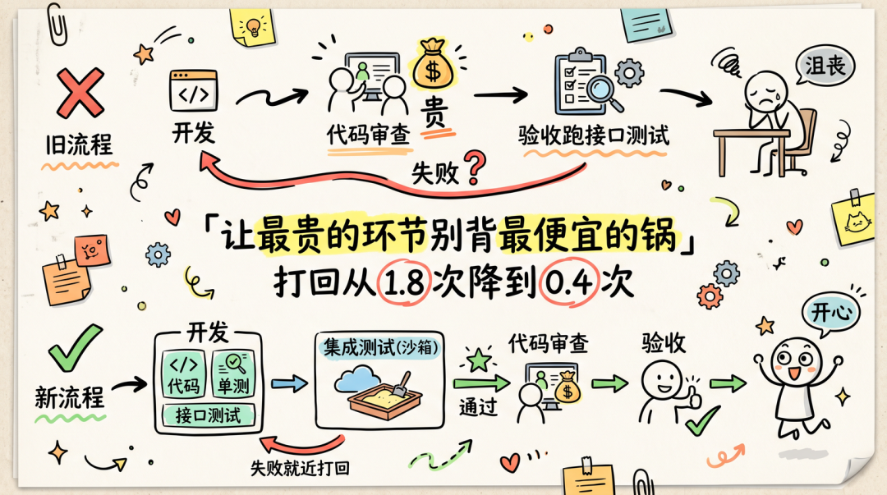


这是我们走过最值得分享的一段弯路。


最早的设计里**没有集成测试这一步**。接口测试放在验收阶段里，跟"日志验收"并列。逻辑很顺：代码审查评完代码 → 验收阶段跑测试 → 通过 → 交付收尾。


跑了几个真实需求之后，我们发现一个让人沮丧的循环：


```
开发写完 → 代码审查 Agent 把整个 diff 仔细审了200行 → 代码审查通过↓验收阶段跑接口测试 → 失败（路径写错 / 参数对不上 / 错误信息没对齐）↓打回开发 → 改 → 重新过代码审查 → ...
```


代码审查是整条链里最贵的环节，每次跑都要审查 Agent 把整个 diff 重看一遍。但接口测试问题其实是个**几秒就能验证**的事——我们却让它躺在代码审查之后，让最贵的环节背最便宜的锅。


决策：**接口测试前置到代码审查之前，作为强制硬门禁。不通过不准进代码审查**。


```
开发 Agent 写业务代码 + 单测→ 同时产出接口用例文档 + 增量 Go 接口测试代码→ 集成测试阶段拉沙箱 + 真实 HTTP 打一遍→ 通过才进代码审查
```


这一改之后，代码审查阶段的平均打回次数从 1.8 次降到 0.4 次。


但这次调整真正值得说的不是"少打回了"，而是它顺手把 **"开发完成"的定义改了**：以前"开发完成 = 业务代码 + 单测"，现在"开发完成 = 业务代码 + 单测 + 接口用例文档 + 增量接口测试代码"。


> **让产生问题的人，同时产生验证手段**——这才是一个真正交付完整的开发阶段该有的样子。


#### 3.3 一个反过来的故事：Bug 复现怎么从"必走"变成"可选"


接着说一个反方向的取舍。Bug 复现这个阶段最早是**所有 bugfix 必走**的——不复现不让改。


跑了几次发现一个问题：**很多 bug 是产品同事报的，TAPD 单里写得很清楚（请求 期望 实际），不需要复现**。强制复现等于在沙箱里多花好几分钟跑一遍已经知道答案的事。


所以我们把 Bug 复现改成**条件触发**：仅当需求类型是 bugfix **且** 用户明确要求复现时才走。默认跳过直接进技术方案。


这件事的小教训：


> **流程要给"明显已经清楚的事"留一条快车道**。强制所有需求走最严格的路径，等于惩罚那些已经准备充分的需求。


#### 3.4 阶段切分的判断标准


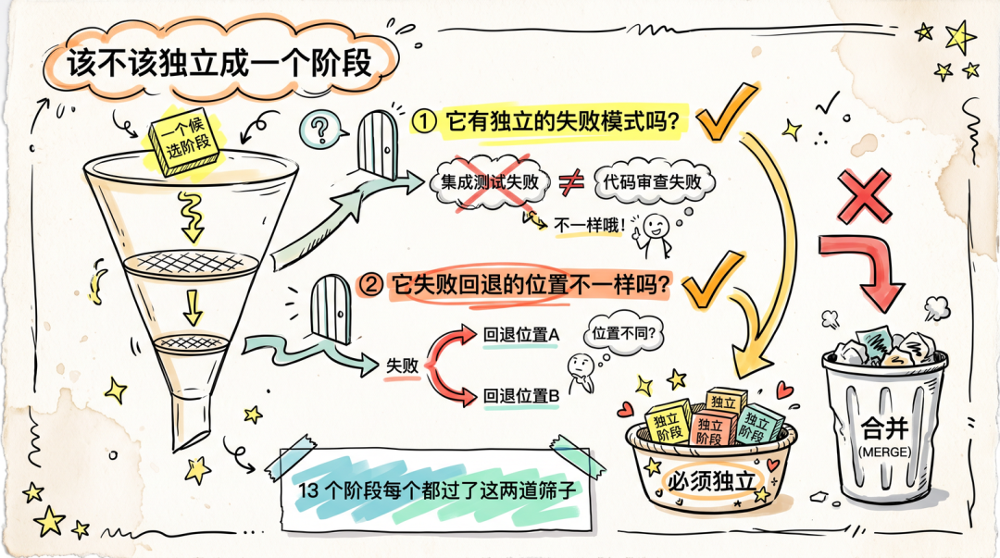


我们最后总结的"是否应该独立成阶段"的判断标准只有两条：


1. 它是否有独立的失败模式 ？（集成测试失败 ≠ 代码审查失败 ≠ 开发失败）
1. 它失败时回退的位置是否不一样 ？（集成测试失败回开发、代码审查失败可能回到方案）


两个都是"是" → 必须独立。否则就合。13 个阶段每一个都过这两道筛子。


---


### 第四章：四个 Agent 是被问题一步步逼出来的


> 我们的 4 个 Agent 不是设计出来的，是被一次次撞墙逼出来的。这一章把这条演进路径完整复盘一遍。


#### 4.1 第一阶段：单 Agent 跑全流程


最早我们试过"一个 Agent 干到底"——它读 TAPD、写方案、写代码、写单测、自己审查、自己跑测试。


跑了几个需求就出现一组很典型的问题：


- 上下文混杂 ：它分不清"TAPD 里写的"和"它自己推断的"
- 天然缺乏制衡 ：它写的方案它自己审，几乎不会否决
- 倾向往前推进 ：它会主动找理由说"问题不大，继续吧"
- token 爆炸 ：从 PRD 到 MR 一路，单 turn 上下文 1M 都不够用


最致命的是第三点。这个 Agent 不会**主动停下来**。它会反复说服自己继续。


#### 4.2 第二阶段：拆出需求 Agent 和方案 Agent


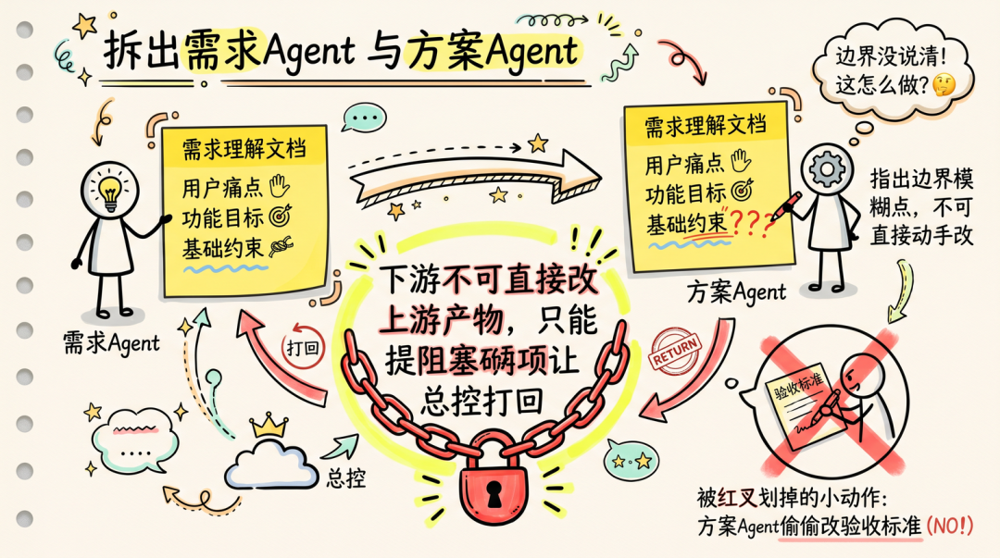


第一刀拆的是**需求理解和方案设计**。这一刀拆完之后立刻见效：


- 方案 Agent 看需求 Agent 写的需求理解文档时，会指出哪些边界没说清
- 很多原本会被"自我推断"埋进代码里的假设，被方案 Agent 主动暴露


但问题没解决完。**方案 Agent 经常会觉得需求 Agent 写得不严谨，顺手把验收标准改了**。这件事看上去是在"提高效率"，实际造成的混乱是：


> 代码审查阶段审代码时不知道哪句验收标准是产品要的、哪句是方案 Agent 自己加的。


我们于是定了 Harness 里**最重的一条纪律**：


> **下游 Agent 不可直接修改上游产物。需要改时只能提阻塞项，由总控 Agent 打回上一棒。**


这条纪律比任何 prompt 调优都关键。它解决的不是技术问题，是**责任边界问题**。


#### 4.3 第三阶段：拆出代码审查 Agent


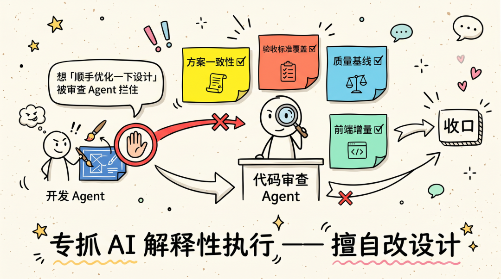


第二刀拆的是代码审查。**收口角色必须有人盯着**——不能让写代码的 Agent 顺手把自己写的代码也审了。这一点几乎是所有多 Agent 设计绕不开的硬规矩。


但我们一开始把代码审查设计得太"普通"——就是个普通的 code review，看看有没有逻辑 bug、有没有违反规范。


跑了一段时间发现这样不够。代码审查应该承担的是**整条链条的最终收口**：


| 审查维度 | 在审什么 |
| --- | --- |
| **方案一致性** | 实现是不是真的按设计文档走？有没有偷偷加范围之外的东西？ |
| **验收标准覆盖** | 需求理解里每条验收标准，是不是都有对应的代码 + 测试？ |
| **质量基线** | 接口测试是否完整？覆盖率是否达标？错误处理是否符合 TAB 错误码规约？ |
| **前端增量**（条件触发） | 涉及前端时，按前端审查 Skill 的问题模板输出阻塞项 |


注意"方案一致性"这一维度——它专门用来防一类很顽固的现象：**AI 解释性执行**。AI 实现到一半经常会觉得"设计这里写得不好，我顺手改一下"，从它的角度看是"优化"，从工程的角度看是"擅自改设计"。代码审查 Agent 就是专门来抓这个的。


#### 4.4 第四阶段：开发 Agent 不再只写代码


最后一刀其实不是"拆"，是"扩"。


最早开发 Agent 只写业务代码 + 单测。集成测试前置之后，开发 Agent 的职责被扩成了"业务代码 + 单测 + 接口用例文档 + 增量接口测试代码"。


这件事看似只是产物清单变长，实际改的是设计哲学：


> **每个角色对自己产物的"可验证性"负责**——你写了代码，你也要按照方案给出验证它的手段。否则验证会被推到下游，下游的成本永远比上游高。


#### 4.5 为什么不再继续拆


跑稳之后我也在思考要不要继续再拆——比如把开发 Agent 拆成"数据访问层 服务层 处理层"三个 Agent，按层并行。


最后没拆。原因有两个：


1. TAB 的四层架构是有强依赖的 （数据访问 → 服务 → 处理层）。并行的时间收益不大，但协调成本极高
1. Skill 已经解决了"分层规范"的问题 ——开发 Agent 跑到数据访问任务时加载"数据访问层规范手册"，跑到服务层时加载"服务层规范手册"。Skill 本质上就是"虚拟的子 Agent"


> **能用 Skill 解决的事，就不要再开一个 Agent**。Agent 是带状态、带 turn、带 token 成本的；Skill 是无状态的文档加载。


---


### 第五章：人工关卡——半自动模式才是当前的最优解


> 这一章讲一件特别容易被低估的事：**Harness 不是越自动越好，关键节点必须留人**。这不是技术保守，是基于对模型行为的实测得出的判断。


#### 5.1 我们为什么坚持半自动


理论上你可以让一个 Reviewer Agent 去判断"这个方案能不能进开发"。我们试过，结论是：**不行**。


原因不是模型不够强，是模型对自己生成的东西天然没有"否决欲望"。它倾向于推进，不倾向于停下。一个上游 Agent 写的方案，下游 Agent 99% 的情况会觉得"看上去挺好"。这个偏置是模型层面的，不是 prompt 层面能控制的。


所以我们最终确定：**关键节点必须有人**。不是不信任 AI，而是承认 AI 现阶段不擅长"否决自己人"。


#### 5.2 人工关卡是怎么设计的


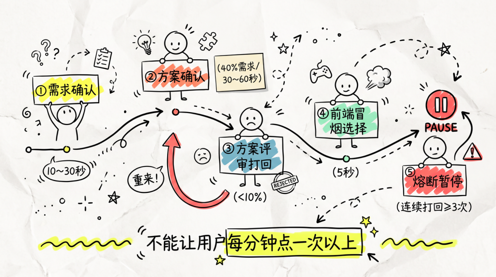


我们一共留了 5 个人工关卡：


| 关卡 | 干什么 | 用户实际花费 | 触发频率 |
| --- | --- | --- | --- |
| **需求确认** | 看 5 行需求摘要，按"确认继续"或"我要修改" | 10~30 秒 | 每个需求 1 次 |
| **方案确认** | 仅在跨子仓库 / 改协议时弹出，看一眼层级变更清单 | 30~60 秒 | 约 40% 需求 |
| **方案评审打回** | 极少触发，触发了说明真的有问题 | 1~2 分钟 | <10% |
| **前端冒烟选择** | 仅纯前端 涉及前端时弹，三选一：跑 复用 / 跳 | 5 秒 | 涉及前端时 |
| **熔断暂停** | 任意阶段连续打回 ≥3 次时触发 | 越短越好 | 异常情况 |


关键原则：


>**不能让用户每分钟点一次以上**——这是我们后来定的硬约束。半自动不只是"流程对"，更是"体感对"。体感不对，团队会主动绕过工具退回 Vibe Coding状态，就与我们的目标就背道而驰了。


#### 5.3 一个真实痛点：弹窗审批密度


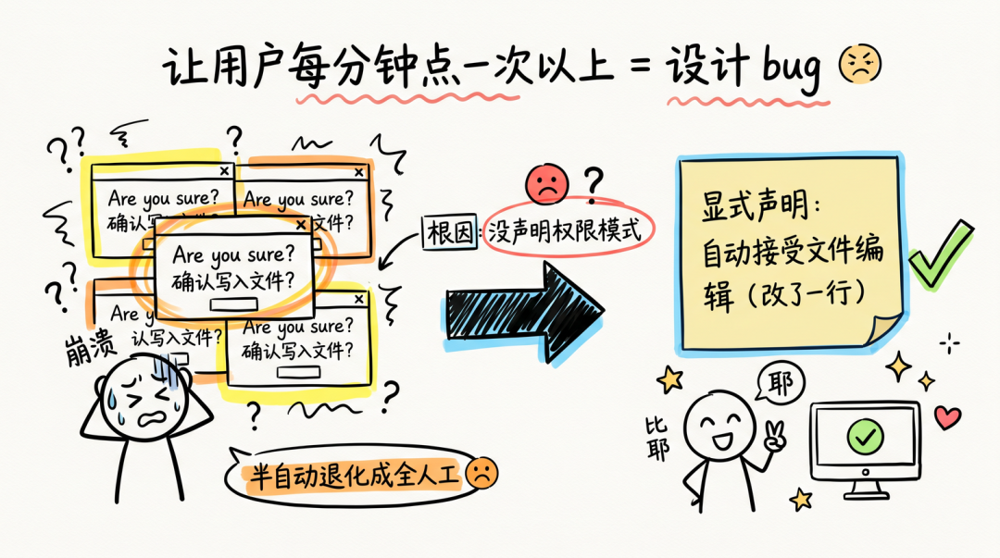


讲一个具体撞墙的故事。


把 4 个 Agent 拆出来之后，新问题立刻冒出来：用户每点一次"确认继续"，子 Agent 写一次产物文件就要弹一次"Are you sure you want to write to ..."。一次需求分析要写 3~5 份，开发阶段要写几十次。


体感上从"半自动"瞬间退化成"全人工 + AI 假装在帮忙"。


根因找了半天才定位到：调起子 Agent 时没显式声明权限模式，IDE 默认走最严格的写文件审批模式，每次写文件都要点一下。


**修复改了一行**：把权限模式显式声明为"自动接受文件编辑"。


但这件事我们后来专门留了一条：


> **任何让用户每分钟点一次以上的交互，都属于设计 bug**，都值得被优化。


#### 5.4 人工关卡的三级兜底


每个人工关卡我们同时都设计了**三级解析兜底**：


1. UI 按钮 （主通道）：弹窗 + 按钮，用户点按钮
1. 纯文本关键词 （兼容通道）："确认继续" "重做" "A"/"B"/"C" 等
1. 语义识别 （降级通道）：含"改" "调整" "重做" / "不对" → 自动路由到"修改请求"分支


为什么要三级？因为我们碰到过 IDE 版本回退、MCP 客户端切换等场景下按钮渲染异常。三级兜底保证**不管在哪个客户端**，用户都能用最自然的方式表达意图。


> 这条经验本质上是：人工关卡不是"等待人输入"，是"以最低摩擦的方式听懂人想干什么"。


---


### 第六章：7 道门禁脚本——把"完成"的定义权拿回来


> 这一章是我个人在整套 Harness 里最有共鸣的部分。前面所有章节都在解决"怎样让 AI 去做事"，这一章解决的是另一个问题：**做完之后，到底算不算做对了**。


#### 6.1 为什么脚本最终一定会变得越来越重要


这件事我们越做越深以后体会越强：**Rule 越多，AI 的解释空间就越大**。同一条规则放在不同需求里，AI 总能找到看上去合理的理由把它绕过去：


- "这个测试不通过不是我引入的，是历史问题"
- "这条规则这次场景特殊，可以先不管"
- "我做了等价验证，不需要完全照规则来"


这些话每一句都可能是真的。**但你不可能每次都翻 git log 去验证**。


所以最终所有"能判定"的约束都会下沉成脚本。脚本最大的价值不是"多了一组工具"，而是它把"完成"这个词的定义权从 AI 的口头汇报里拿了回来——"做完"不再是"AI 觉得做完了"，而是"统一入口的脚本判定通过了"。我们的脚本一共 7 道：


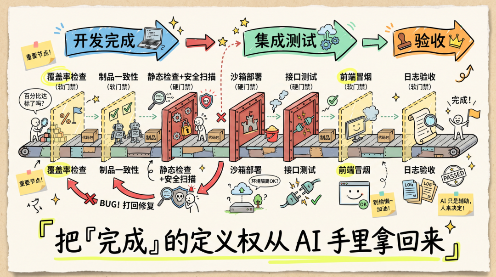


| 阶段 | 门禁 | 类型 | 干什么 |
| --- | --- | --- | --- |
| 开发完成时 | 覆盖率检查 | 软门禁 | 全量 ≥40% **且** 增量 ≥85%（按本次 diff 算） |
| 开发完成时 | 制品一致性检查 | 软门禁 | 任务清单上的勾选项是否全部勾上 |
| 开发完成时 | 静态检查 + 安全扫描 | **硬门禁** | golangci-lint 12 个检查器 + 硬编码密码 + SQL 拼接 + 哈希校验 |
| 集成测试 | 沙箱部署 | **硬门禁** | make sandbox-platform-full-ensure + 网关健康检查 |
| 集成测试 | 接口测试 | **硬门禁** | 真实 HTTP 跑接口用例文档 |
| 集成测试 | 前端冒烟 | 软门禁（条件触发） | Playwright 跑路由级渲染 + DOM 断言 + 截图 |
| 验收 | 日志验收 | 软门禁（可选） | 关键操作日志存在 + 敏感信息脱敏 |


#### 6.2 软硬门禁的取舍


看上去 7 道，硬门禁只有 3 道。这是有意为之。


- 硬门禁 = 失败立即中止流程
- 软门禁 = 失败留 WARN 痕迹但继续推进


我们的判断标准：


> **硬门禁宁少不多**。如果一个东西不是质量红线，就别让它阻断流程。流程被频繁打断会让团队怀疑工程化的价值，进而退回到 Vibe Coding。


前端冒烟就是个典型例子。它对前端类需求很有价值（路由级渲染 + 控制台错误阈值 + 截图归档），但**不是质量红线**。设成硬门禁，会让"我紧急发个 hotfix 但前端冒烟挂了"变成阻塞事件。所以它是软门禁，且用户可以主动跳过，但跳过会在代码审查结论里留下警告痕迹，提醒使用者关注。


#### 6.3 一个反作弊设计：基线对比


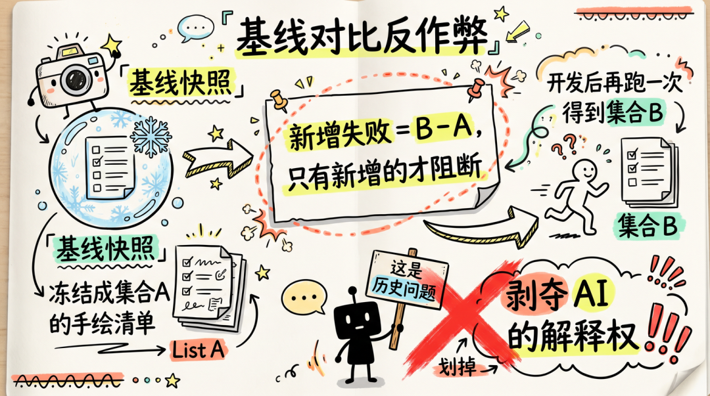


这是我个人最喜欢的一处设计。


AI 跑完门禁后会汇报"通过 / 失败"。但 AI 对失败有非常顽强的解释能力：


- "这个不是我引入的问题"
- "这个警告之前就有"


所以我们在开发启动前会先跑一次门禁脚本的"基线快照"模式——把当前状态的所有门禁输出冻结成一份基线状态文件。开发跑完后再跑一次"差异"模式：


```
开发前的失败集合 = A开发后的失败集合 = B新增的失败 = B - A
```


**只有"新增的失败"会阻断流程**。"历史问题"这把万能钥匙就被拿掉了。


这个机制听上去简单，但花了我们好几轮才意识到必须做。它的价值不在技术上，**在于剥夺 AI 的解释权**。


#### 6.4 软门禁失败也要留下"伤疤"


软门禁的定义是"失败不阻断"。但"不阻断"不等于"什么都不做"。


我们的所有软门禁失败都会：


1. 在门禁状态文件里写一条警告记录
1. 在代码审查结论文档里被审查 Agent 显式提到
1. 在最终的度量报告"软门禁告警"段沉淀


这是一种**让"绕过"在视觉上变得不舒服**的设计。AI 想绕没人拦，但绕了之后所有产物里都有显眼的黄色标记，代码审查必然会读到，交付收尾的度量报告上也会留疤。


> **你不能阻止 AI 偷懒，但你可以让偷懒变得很醒目。**


---


### 第七章：撞墙补稳——Team Mode 卡死那次复盘


> 下面这个故事是我们 Harness 演进里最关键的一次"撞墙"，值得单独展开讲。它的价值不只在于修了一个 bug，更在于让我们彻底理解了一种很容易踩进去的陷阱——"复杂度自给自足"。


#### 7.1 症状


人工关卡（需求确认）必现卡死。用户输入"确认继续"四个字之后，主 Agent 完全没反应。


体验上是：你看着屏幕，主 Agent 安静地待在那里，没有任何响应。你重复输入也没用。重启 IDE 就好了。


#### 7.2 我们一开始的诊断方向全是错的


这个 bug 我们前后修了三轮，每轮都以为已经修好了：


- 第一轮 ：怀疑是标记文件残留 → 加一个清理脚本清标记 → 没用
- 第二轮 ：怀疑是 60 秒虚假超时 → 撤销超时改为长等待 → 没用
- 第三轮 ：怀疑是按钮值没匹配 → 改成纯文本输入 → 还是没用


每一轮都局部止血了某些症状，但根因没动。


#### 7.3 真相


直到我们打开 IDE 的 Team 状态目录看消息收件箱，发现一个让人脊背发凉的画面：


> Team 还活着；Team 里的主控 Agent 的本轮对话已经结束；但用户输入的"确认继续"四个字**安安静静地躺在收件箱里，没有任何 Agent 在消费**。


根因：**我们用的"启动子 Agent 并等待"机制让主 Agent 的本轮对话跨越了整个子 Agent 执行时间。主 Agent 抛出确认提示后本轮对话自然结束，但 IDE 的 Team Mode 把后续用户输入路由到主控 Agent 的收件箱——可主控 Agent 已经下班了**。


消息有目的地，但目的地下班了。


#### 7.4 真正的解法不是修这个 bug，是删掉这个机制


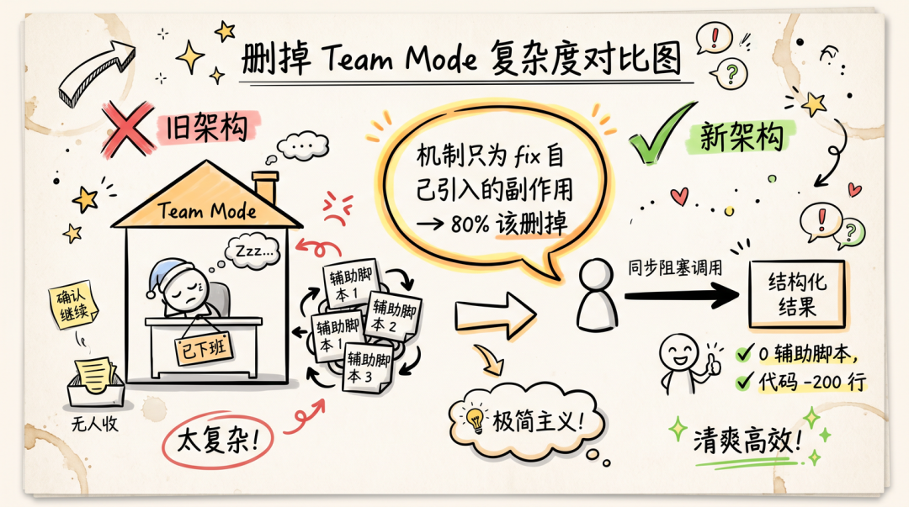


我们盯着架构图看了很久，意识到一件事：


> **Harness 的 4 个 spawn 点全部是"串行单个"模式，从来没用 Team Mode 的任何独有能力**——并行 spawn Agent 互发消息 长驻留 / 跨 turn 共享。Team Mode 带来的复杂度，**只是为了解决它自己引入的问题**。


这就是经典的"复杂度自给自足"陷阱。**当一个机制的存在主要是为了 fix 它自己引入的副作用时，它有 80% 的概率应该被删掉**。


最终决策：彻底删除 Team Mode，改用 IDE 原生支持的**项目级自定义子 Agent + 同步阻塞调用**。


| 维度 | 旧架构（Team Mode） | 新架构（项目级子 Agent） |
| --- | --- | --- |
| 调起协议 | 三步法：清理标记 + 启动子 Agent + 等待子 Agent | 单步：直接同步调用 |
| 子 Agent 返回方式 | 三通道：标记文件 + 消息发送 + 关闭请求 | 单通道：返回结构化结果 |
| Team 生命周期 | 每个需求初始化时创建 交付时销毁 关卡前清理 | 无 Team 概念 |
| 人工关卡 | 必现卡死 ❌ | 天然生效 ✅ |
| 辅助脚本 | 3 个（等待 清理 确认前清理） | 0 个（全部删除） |


删完之后人工关卡卡死问题彻底消失，**主 Agent 的代码反而少了将近 200多行**。


#### 7.5 这次撞墙留下的方法论


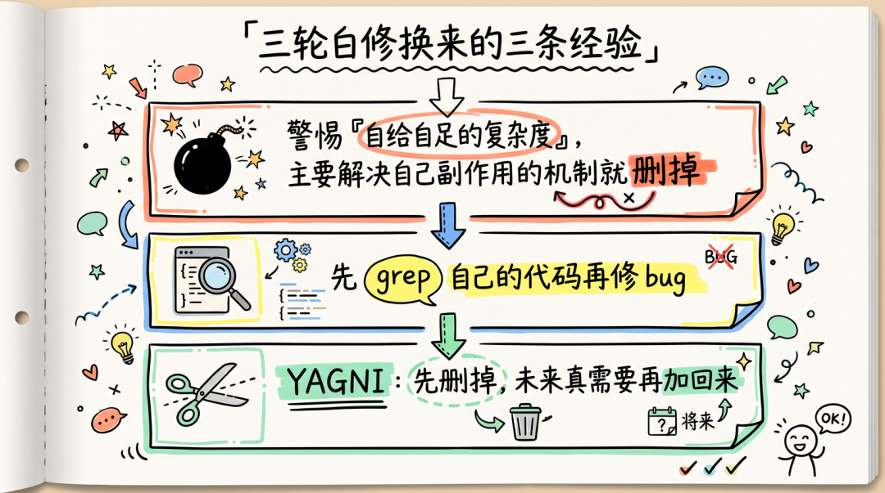


这件事给我们留了三条特别值得分享的经验：


**第一，永远警惕"自给自足的复杂度"。** 一个机制如果主要是在解决它自己带来的副作用，删掉它是更好的选择。


**第二，先 grep 自己的代码再修 bug。** 如果我们更早地确认"我们一次都没用过 Team Mode 的并行能力"，就不会在它的内部时序问题上浪费三轮迭代。


**第三，YAGNI（You Aren't Gonna Need It）原则在 Harness 设计里特别重要**。 保留可选路径意味着维护两套协议，不如先删掉，未来真需要时再加回来——那时候加，会比现在保留干净得多。


#### 7.6 顺手讲一下"人工关卡反复弹审批"这个相关坑


去 Team Mode 之后，相关的另一个坑是用户每次"确认继续"，子 Agent 写产物时要弹"Are you sure?"，一次需求分析要弹 5 次。


修复就一行：在调起子 Agent 时显式声明权限模式为"自动接受文件编辑"（在第五章已经讲过）。


但这件事和 Team Mode 撞墙的故事其实是同一类问题：**Harness 架构里只要有一处"人体感知能感受到的卡顿"，就会被团队当成失败信号，整个 Harness 的可信度就会崩**。所以在做撞墙复盘时，不能只看技术正确性，还要看体感正确性。


---


### 第八章：让 AI 带上"整个项目的记性"


> Harness 跑稳之后，下一个绕不开的问题是：**AI 缺乏对整个项目的全局视野**。在 TAB 这种跨 多个submodule 的大仓里，这一层是必修课，不是可选项。


#### 8.1 问题：AI 重复造轮子


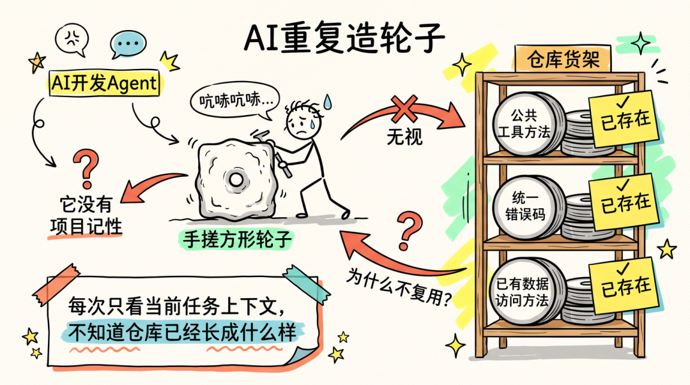


跑了一段时间之后，我们发现一个尴尬现象：


- 同一个工具方法，在公共工具包里已经有了，开发 Agent 在新需求里又写了一遍
- 同一个错误码，在统一错误码包里已经定义了，开发 Agent 又起了一个新的
- 同一个数据访问方法，在某个数据访问子仓库里已经有了，开发 Agent 又造了个新的


这不是模型不够强，是它没有"项目记性"。它每次只看当前任务的上下文，不知道仓库里已经长成什么样。


#### 8.2 我们的两层项目级索引


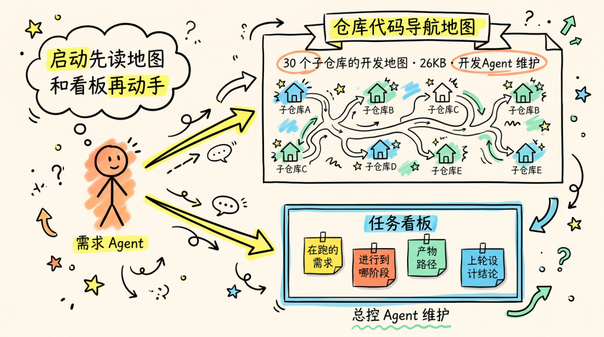


我们最终落了两层：


第一层： 仓库代码导航地图：所有子仓库的开发地图


这是一份约 26KB 的导航文档，由**开发 Agent 自己维护**（谁动谁更新）。它写的不是文件列表，是"这座工程长什么样"：


```
某个功能一般落在哪些子仓库某类服务怎么注册（trpc-go 风格 vs chi 风格）某类配置通常在哪定义改某个子仓库可能会牵动哪些下游链路项目里已有的标准写法长什么样
```


**核心一条**：先搞清楚这里已经长成了什么样，再下手。


需求 Agent 启动时会先读这份地图的"全景索引"段，决定本次需求大概会落在哪几个子仓库，然后才进入需求理解。这一步避免了 80% 的"在错的子仓库里改"。


第二层： 任务看板：跨需求的任务总览


这是一份**跨需求的任务总览**，由总控 Agent 维护的 CheckPonit文件：


- 当前在跑的需求有哪些
- 每个需求进行到哪个阶段
- 已完成需求的产物路径
- 上一轮设计结论是什么


需求 Agent 启动时会先扫一眼任务看板，判断"这个新需求是不是旧需求的延续"。一次小小的扫描，让"新需求把旧设计冲掉"的概率降低了一个量级。


#### 8.3 为什么这两层东西要"在仓库里"


这里要专门说一句和 **Memory** 的区别——也就是 AI 工具里那种藏在产品侧、跨会话还能记住一些事情的机制。仓库内的文档和 Memory 看起来都在解决"别丢上下文"，但解决的不是同一个问题：仓库里的文档是**团队共识，能审计、能交接**；Memory 是**个人偏好，看不见、对不齐**。


大仓尤其要警惕这件事——4 个工程师同时在不同需求上跑 Harness，如果项目级知识只存在某个人的 Memory 里，**4 个人的 Memory 会互相矛盾**，最后没人知道哪个是真的。所以我们的纪律是：**团队要对齐的东西必须落到仓库；Memory 只放纯个人偏好（比如"回答用中文"这种）**。


---


### 第九章：从开发闭环到交付闭环，MCP 才是关键


> 第六章解决了"做完算不算对"，第八章解决了"AI 知不知道项目长什么样"。还有最后一段路：**做完之后怎样把它真正交付出去**。这一章讲我们在这条路上踩过的几个坑。


#### 9.1 没用 MCP 之前 Harness 能做什么


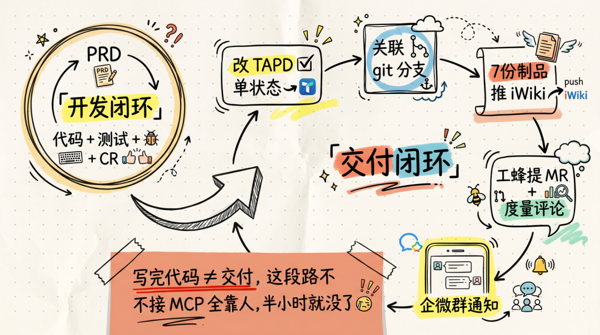


只有"开发闭环"：从 PRD 到代码 + 测试 + CR。


但 TAB 真实的研发链路远不止这些。一次完整的需求交付还要：


- 改 TAPD 单状态（TODO → DOING → REVIEWING → DONE）
- 给 TAPD 单关联开发 git 分支
- 把 proposal/specs/design/tasks 等 7 份制品上传到 iWiki
- 在工蜂提 MR、贴度量评论、推荐 reviewer
- 给企微群通知 MR 链接


这些事不接 MCP，全靠人，半小时就过去了。


我们目前接了 5 个 MCP：


| MCP | 干什么 | 何时调 |
| --- | --- | --- |
| TAPD MCP | 改单状态 加评论 关联分支 / 打 Harness 标签 | 初始化、交付收尾 |
| Knot MCP | 获取前端设计规则 代码规范 CR规则 | 开发前、CR审查阶段 |
| iWiki MCP | 批量上传 7 份制品到 iWiki 父目录 | 交付收尾 |
| 工蜂 MCP | 创建 MR 拉代码审查评论 推荐 reviewer | 交付收尾 |
| 企微 MCP | 给企微群发通知 | 交付收尾 |


#### 9.2 MCP 在 Harness 里到底承担什么


讲原则前，先把 MCP 这一层在我们这边的定位说清楚——它不是工具罗列，承担的是一个很具体的角色：把 AI 从"只能动本仓代码"扩到"能在受控边界内动外部系统"。


这件事必须强调一个边界：**MCP 不是给 AI 一个万能钥匙**。如果让 AI 拿着一把通用的 HTTP 工具自己去调 TAPD iWiki 工蜂，事故只是时间问题——拼错字段、改错单、改错状态、推错目录都可能。我们的做法是把每一类外部交互都收敛成一个**有明确入参、有明确语义、有审计痕迹**的 MCP 方法，AI 看到的不是"调一个 HTTP"，而是"改某个 TAPD 单的状态字段"。能用什么、不能用什么，被收敛在 MCP 这一层。


我们对 MCP 这一层就三句话的设计原则：


- 读多写少 。能读的尽量多接，让 AI 拿到完整的上下文（TAPD 描述、iWiki 已有方案、Knot 设计规范）；写的方法 严格挑 ，每一个写方法都要想清楚"重复调用会发生什么"
- 写操作必须有清晰的触发点 。改 TAPD 单状态、提 MR、推 iWiki、发企微通知——只在初始化和交付收尾这两个阶段触发，其他阶段一概只读。这一刀划清楚之后，"AI 半路改坏外部系统状态"的事就消失了
- MCP 调用全部留痕 。每次写操作都会在交付物里留下一条记录（什么时间、改了什么字段、改成了什么）。这样需求单状态被改错时能秒级定位，不用回头翻日志


最后顺带一提：MCP 解决的是"AI 怎样安全地动外部系统"，不是"AI 怎样思考"。所以 **MCP 接得多不等于 Harness 强**——Harness 的主体是前八章讲的那些东西，MCP 只是把开发闭环扩展成交付闭环的最后一段路。这个定位站不稳，很容易就走偏成"接了一堆 MCP 但开发闭环还没跑通"。


#### 9.3 接 MCP 时的几个原则


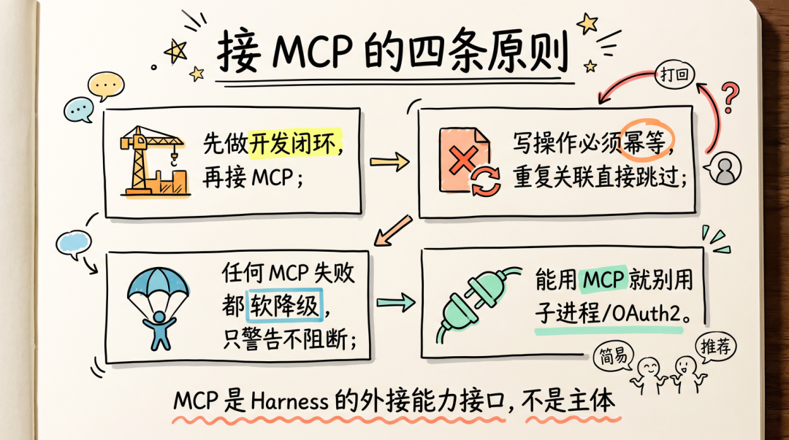


我们踩过坑总结的：


**第一，先做开发闭环，再接 MCP**。如果开发闭环本身不稳，接了 MCP 只会让 bug 影响范围扩大到外部系统。


**第二，写操作必须幂等**。比如 TAPD 的"关联 git 分支"接口必须先按 (仓库, 分支) 二元组判重，重复关联直接跳过。否则交付收尾阶段重跑一次就给 TAPD 灌一堆重复关联。


**第三，任何 MCP 失败都软降级**。我们的纪律是：**MCP 失败只警告，不阻断主流程**。一次 iWiki 推不上去不算大事，下一轮交付收尾自然补推。绝不允许"网络抖一下，主流程整个挂掉"。


**第四，能用 MCP 就别用子进程 OAuth2**。我们有过一段时间初始化阶段同时用 TAPD MCP 和 Python 子进程的双通道架构，审计 排障路径不一致。后来全部收敛到 MCP，OAuth2 凭据依赖归零，新成员上手成本大幅降低。


> **MCP 不是 Harness 的主体，是 Harness 的外接能力接口**。它解决的不是"AI 怎样思考"，而是"AI 怎样安全地动外部系统"。


---


### 第十章：四块拼图与给后来人的几句话


> 整篇文章讲到这里，可以把整套 Harness 压成一张总图：**约束与流程、反馈、知识库、进化**——四块拼图，彼此勾着走。这一章做收束。


#### 10.1 整套 Harness 是哪四块拼图


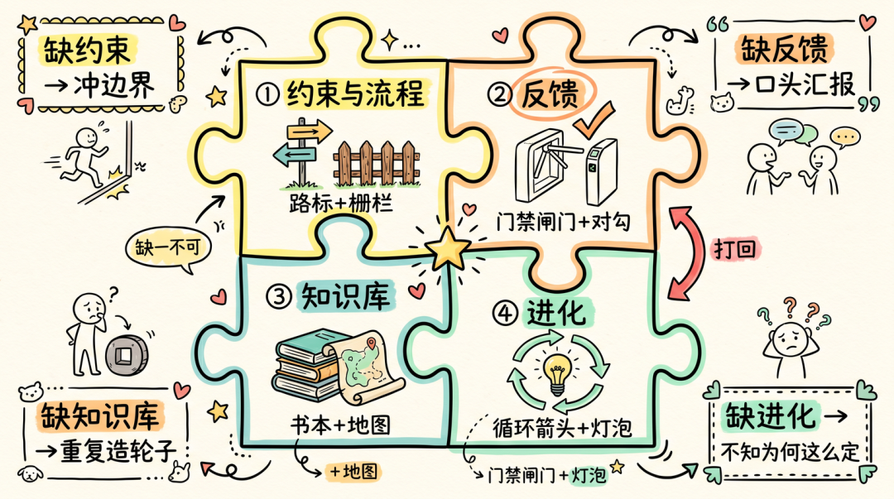


这四块各管一件事：


- 约束与流程 ：AI 该按什么顺序、什么边界做事；协作时谁接哪一棒。对应前面讲的 Workflow + Agent + Skill + 人工关卡。
- 反馈 ：做完以后系统能不能对结果有说法。对应门禁脚本 + 基线对比。
- 知识库 ：写进仓库，对应着各种开发设计规范以及演进迭代日志


| 缺哪块 | TAB 上会变成什么样 |
| --- | --- |
| 缺约束与流程 | AI 把接口规约的边界冲掉、方案 Agent 顺手改需求理解、开发改了设计之外的代码 |
| 缺反馈 | "我改完了"全靠口头，代码审查通过后接口测试一跑就挂 |
| 缺知识库 | 开发在新需求里把公共工具包已有的方法又写一遍 |
| 缺进化 | 演进日志不更新，下一次改 prompt 时不知道上一次为什么这么定 |


#### 10.2 当前的数字


跑了 50+ 个真实需求之后，目前的数字大致：


| 指标 | 当前值 |
| --- | --- |
| 端到端耗时（不含人工等待） | 30~75 分钟 |
| 人工介入次数（按按钮） | 2~3 次 |
| 集成测试一次通过率 | 约 70% |
| 代码审查阻塞率 | 约 25%（多数为"方案一致性"维度） |
| 开发阶段平均打回次数 | 0.4 次（接口测试前置后从 1.8 次降下来） |


诚实说几个限制：


- PRD 完整度强相关 。一句话需求 会让需求分析阶段 反复打回，整体耗时翻倍
- 跨子仓库越多越慢 。≥3 个子仓库时分支准备阶段开始变慢
- 前端 + 后端混合需求最难 。前端代码审查链路长、稳定性还在打磨


#### 10.3 如果你也想给团队搭一套


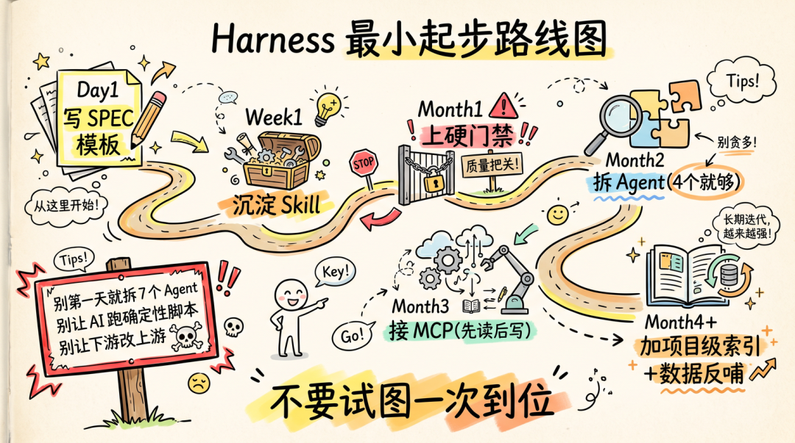


最重要的一条：**不要试图一次到位**。Harness 不是设计出来的，是哪儿痛补哪儿、补着补着四块才逐渐齐全。


**永远不要做的事**：


- ❌ 第一天就拆 7 个 Agent
- ❌ 让 AI 跑确定性脚本（提交 推送 拼链接，全部下沉成 bash）
- ❌ 让下游 Agent 改上游产物
- ❌ 把所有失败都设成硬门禁
- ❌ 没有基线对比就相信 AI 说的"这是历史问题"
- ❌ 把团队规约存进 Memory（必须落到仓库）


#### 10.4 最后留几句金句给读到这里的你


> **AI 的瓶颈早就不是模型，是协作、流程、信任。**


> **下游能改上游，整条流程的责任边界就崩了。**


> **能写脚本的就别让 AI 解释执行——4 个 Agent 不是设计出来的，是被"什么不该 AI 干"逼出来的。**


> **你不能阻止 AI 偷懒，但你可以剥夺它的解释权（基线对比），让偷懒变得很醒目（软门禁伤疤）。**


> **半自动比全自动更难，但更值得做——它是当前 AI 能力下唯一稳定可推广的形态。**


> **Harness Engineering 不是为了让 AI 看起来更聪明，是为了让 AI 在复杂工程里更可控、更可靠、更可维护。**

TAB（Tencent A/B Test）是腾讯自研的公司级A/B实验平台，为业务提供科学、高效、易用的实验全链路能力。它让每一次产品决策都有数据支撑，帮助业务降低创新试错成本、加速产品迭代——把"拍脑袋"变成"看数据"。。

核心价值


科学决策，让每个结论都站得住--TAB 以统计学原理构建实验全流程，通过正交分流、空跑回溯、方差缩减、SRM 校验等能力，系统性保障实验结果的准确性，将误判风险（第一类错误率）控制在 5% 以内。业务由此规避决策风险，避免无效策略全量上线带来的损失。


全场景覆盖，一个平台承接所有实验诉求--从标准 A/B 实验、层域实验，到 MAB 智能调优、Interleaving 排序实验、配置/开关实验、Agent实验，TAB 支持多种实验类型，适配内容、社交、游戏、金融、广告等全业务场景。


降本增效，让实验更快更省--TAB 以统一平台兼容不同业务的技术栈与开发习惯，显著降低接入成本；通过流量集中调度、实验模板、智能样本量预估、自动灰度放量等能力缩短迭代周期；并借助服务治理、查询引擎优化、带宽治理等手段，持续压降实验整体成本。


稳定可靠，支撑万亿级流量--TAB 采用地域级多活、读写分离（CQRS）、多级缓存兜底的高可用架构，日均分流请求达万亿级别，分流请求 SLA 成功率稳定维持在极高水平，为大规模实验场景提供坚实的服务保障。


规模与生态，TAB 已服务腾讯 PCG、IEG、WXG、CDG 等全公司 100+ 业务，覆盖腾讯视频、腾讯金融科技、腾讯新闻、微信支付、腾讯广告、腾讯游戏等核心产品，实验规模和用户量级处于领先地位。同时作为公司级项目，TAB 多次荣获腾讯开源协同奖、卓越研发奖等荣誉。平台还持续推动公司内部实验文化建设，通过专题课程、行业技术峰会分享等方式，普及科学实验理念，让"数据驱动"成为更多团队的共识。


前沿探索，Agentic AI--TAB 持续探索技术边界，已落地 Agentic AI 实验分析能力。通过本体建模、动态工具装配、资产级权限隔离等设计，平台为不同业务提供个性化的实验分析与归因决策，在保障数据安全的前提下大幅降低实验分析门槛、提升决策效率——让复杂的数据分析,人人可用。


