# 如何构建一个更“好”的知识库？

本文深入探讨构建高质量 RAG 知识库的垂直技术原理与工程实践。文章首先界定知识库作为外部记忆系统的角色，并引入 RAGAS 框架从检索相关性、生成忠实度及答案相关性维度建立评估标准。随后详细拆解离线索引与在线查询流程，重点分析文档切分策略如 Late Chunking 和意图驱动切分，对比稀疏、稠密及混合检索范式，并阐述HyDE等查询增强技术。此外，文章探讨 Cross-Encoder 重排序机制以优化精度，介绍 AutoRAG 自动化优化、 QuIM-RAG 问题倒排索引及 OpenViking 文件系统范式等前沿架构，旨在通过系统性技术选型解决幻觉、召回不准等问题，实现知识库性能的端到端优化 。

## 考古一下，RAG 的起源

RAG（Retrieval-Augmented Generation，检索增强生成） 由 Facebook AI Research（现 Meta AI）于 2020 年首次提出。

| 项目 | 内容 |
| --- | --- |
| 论文 | Retrieval-Augmented Generation for Knowledge-Intensive NLP Tasks |
| 作者 | Patrick Lewis, Ethan Perez, Aleksandra Piktus, Fabio Petroni, Vladimir Karpukhin 等 |
| 发表 | NeurIPS 2020 |
| 链接 | https://arxiv.org/abs/2005.11401 |

论文的核心贡献在于提出了一种将**参数化记忆（Parametric Memory）**与**非参数化记忆（Non-Parametric Memory）**相结合的架构：

- 参数化记忆： 预训练 seq2seq 模型（如 BART）的模型权重
- 非参数化记忆： Wikipedia 语料的密集向量索引，通过 DPR（Dense Passage Retriever）构建

这一架构在开放域问答（Open-Domain QA）任务上显著超越了纯参数化模型，奠定了后续 RAG 研究的基础。

在 Agent 构建的语境下，**知识库（Knowledge Base）**是一个外部记忆系统，用于存储和检索不在模型参数中的信息。它作为 RAG 架构的核心组件，承担非参数化记忆的角色。

RAG 的基本工作流程：

Query → Retriever（检索器） → Top-K Documents → Context Augmentation → Generator（生成器） → Response

其中，知识库的核心接口，就是上传和召回。不同版本和理论，就是召回的内容和排序的区别。

这个问题应该回到 LLM 的固有局限上，知识库是一种对应的解决方案：

结合前面几点，使用场景也比较清晰了。

**适合构建知识库的场景：**

不需要知识库的场景：

随着上下文窗口的扩展（Claude 200K, Gemini 1M+），需要重新审视 RAG 的适用边界：

**选型建议：**

- 数据量 < 50K tokens 且更新频率低 → Long Context
- 数据量大、更新频繁、需要精确召回 → RAG
- 混合方案：RAG 粗筛 + Long Context 精读

如题，我们想要构建更好的知识库，那么首先需要定义"好"的标准。

RAGAS（Retrieval Augmented Generation Assessment） 是目前最广泛采用的 RAG 评估框架，其核心价值在于 无参考评估（Reference-Free） ——无需人工标注 ground truth 即可进行自动化评估。

| 项目 | 内容 |
| --- | --- |
| 论文 | RAGAS: Automated Evaluation of Retrieval Augmented Generation |
| 链接 | https://arxiv.org/abs/2309.15217 |
| 发表 | 2023 |

RAGAS 将 RAG 系统的评估分解为三个核心维度：

这三个维度相互独立但互补，共同覆盖 RAG 系统的端到端性能。RAGAS 的关键洞察： RAG 系统的失败往往是检索和生成环节共同造成的 ，因此必须分别评估，才能定位问题根因。下面来看下这几个环节可以对应的指标有些什么。

检索环节的目标是：**召回与 query 相关的文档片段，并将相关内容排在前面**。

**定义**：评估检索器将相关文档排在不相关文档之上的能力。

**计算方法**：

其中：

直观理解 ：如果检索了 5 个 chunks，相关的 2 个排在第 1、2 位，比排在第 4、5 位的 precision 更高。

**定义**： 评估回答问题所需的信息有多少被成功检索到。

**计算方法**：

具体步骤：

1. 将参考答案分解为多个 claims（声明）
1. 判断每个 claim 是否可归因于检索到的上下文
1. 计算被支持的 claims 占比

**注意**：Context Recall 需要参考答案（reference），因此不是完全的 reference-free 指标。

▐ 考古一下，RAG 的起源 ▐ 知识库的定义 ▐ 使用知识库可以解决什么问题？ ▐ 适用场景分析 ▐ RAG vs Long Context 如何评判一个知识库的好坏？ ▐ 评估框架：RAGAS ▐ 检索质量指标 Context Precision（上下文精确率） Context Recall（上下文召回率） 传统 IR 指标：（除 RAGAS 定义的指标外，传统 IR（Information Retrieval）指标仍然适用）

## 生成质量指标

Precision、Recall 与 F1 的关系 ：

F1 是 Precision 和 Recall 的调和平均数，用于在两者之间取得平衡。当 Precision 和 Recall 差异较大时，F1 会偏向较小的那个值，因此 F1 高意味着两者都不能太低。

生成环节的目标是：**基于检索到的上下文，生成准确、相关的答案**。

▐ 生成质量指标 Faithfulness（忠实度）

## 定义

**定义**：生成的答案在事实上是否与检索到的上下文一致。取值范围 [0, 1]，值越高表示答案越忠实于上下文。

**计算方法**：

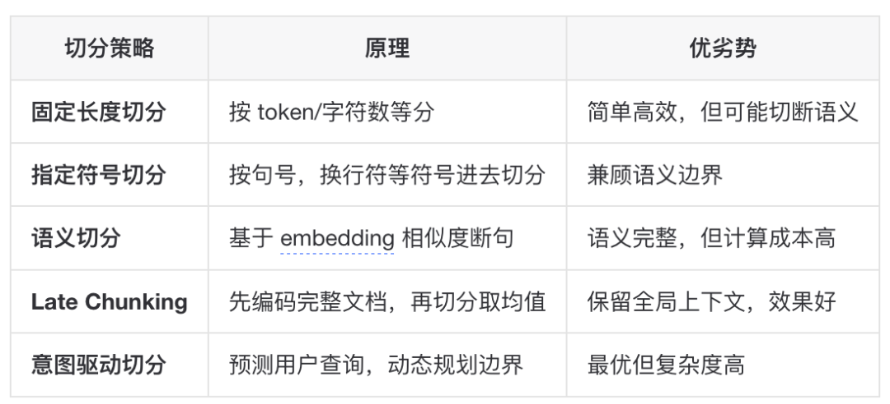

具体步骤：

1. 使用 LLM 从答案中提取所有声明（claims）
1. 对每个声明，验证是否能从检索上下文中推断
1. 计算被支持的声明占比

示例 ：

## 定义

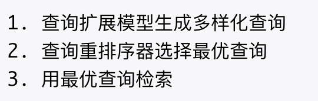

**定义**：答案是否直接且恰当地回应了问题。该指标不考虑事实准确性，而是惩罚不完整或包含冗余信息的答案。

**计算方法**：

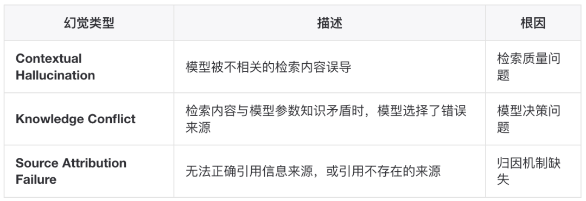

其中：

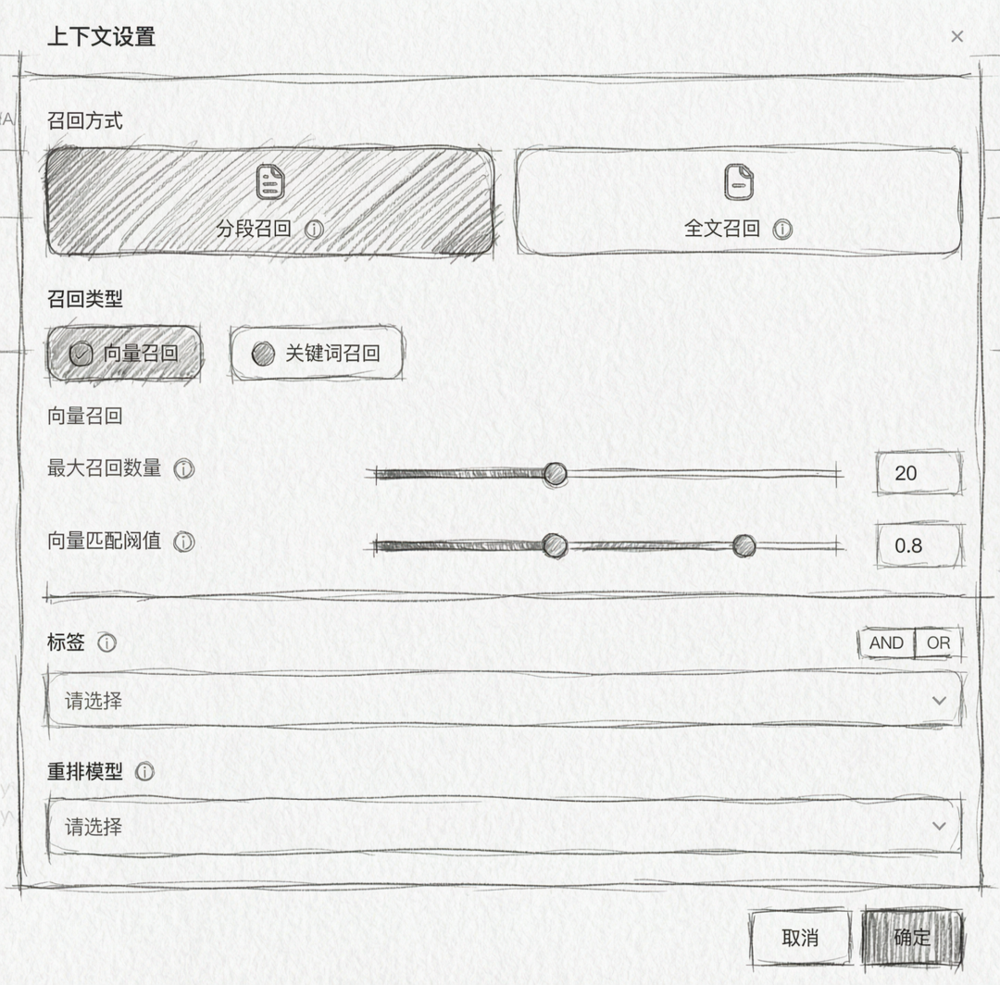

**核心思想**：如果答案正确回应了问题，那么从答案反向生成的问题应该与原问题高度相似。

Faithfulness 指标的本质是检测幻觉。RAG 系统的幻觉可进一步细分为三类：

Answer Relevance（答案相关性） ▐ 幻觉问题的深入分析 参考论文： https://arxiv.org/abs/2601.19927 幻觉检测方法

## RAG 场景的特殊考量

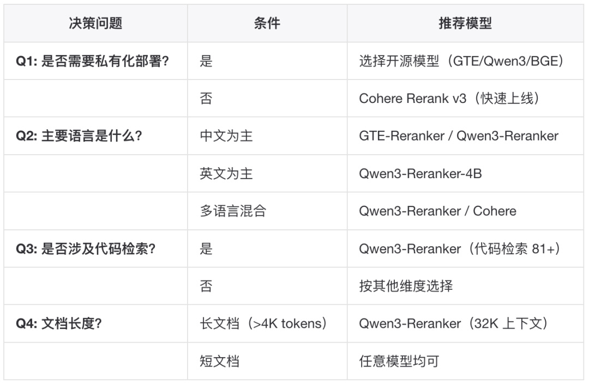

不同 RAG 应用场景（医疗、法律、通用 QA）对检测器的要求不同，需根据具体场景选择。

传统 IR 指标基于语义相似度评估检索质量，但在 RAG 场景下存在一个核心问题：**语义相似 ≠ 对 LLM 有用**。

ICLERB（In-Context Learning Embedding and Reranker Benchmark）提出了端到端评估思路，这意味着：一个"好"的检索结果，不仅要语义相关，还要能有效支撑 LLM 生成正确答案。

检索候选文档 → 注入 LLM 生成答案 → 评估答案准确性 → 反推检索器效果

参考论文：https://arxiv.org/abs/2411.18947

以上，在理解了评估标准后，接下来拆解知识库构建的完整流程，分析每个环节的优化空间。

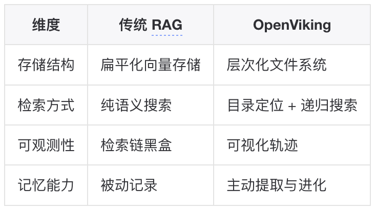

知识库的构建可以分为两个阶段：**离线索引阶段（Indexing）**和**在线查询阶段（Querying）**。本章节结合idealab平台（https://idealab.alibaba-inc.com/#/aistudio）的操作进行讲解。

**离线索引阶段**：Load → Split → Embed → Store

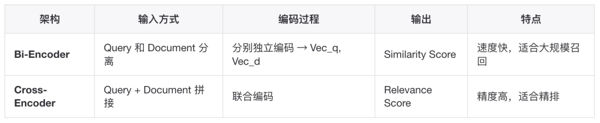

在线查询阶段 ： Query → Retrieve → Rerank → Generate

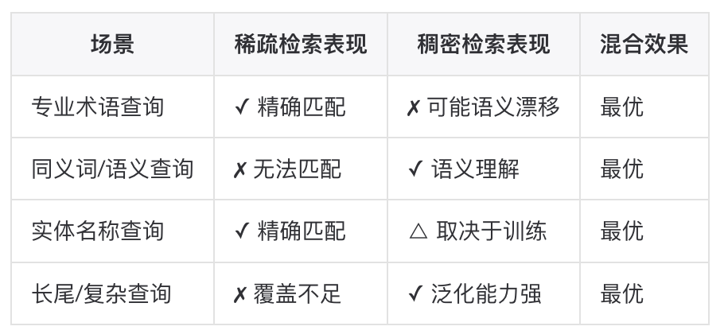

- Step 1: Load（文档加载）

这一步很好理解，就是将原始数据从各种来源和格式中提取出来。 目前idealab提供的知识库支持的有odps、语雀、钉钉文档、本地文件。

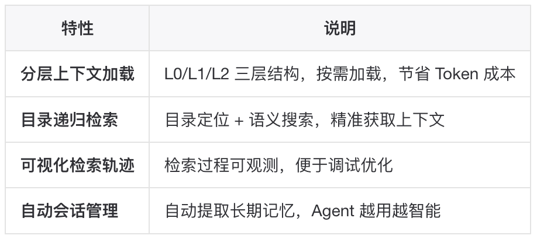

- Step 2: Split（文档切分）

将长文档切分为适合检索和上下文注入的片段（chunks）。这是影响检索质量的 关键环节 。 目前idealab提供的知识库支持的有默认智能切分（使用Opensearch切分方案），自定义切分（固定长度，符号切分），自定义工具切分。

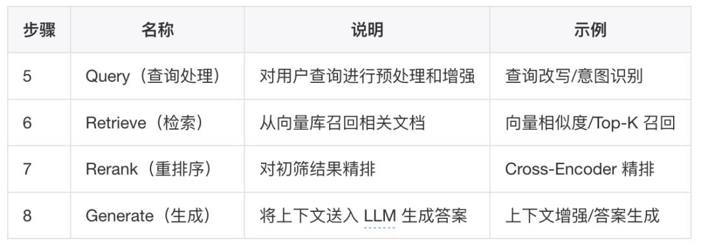

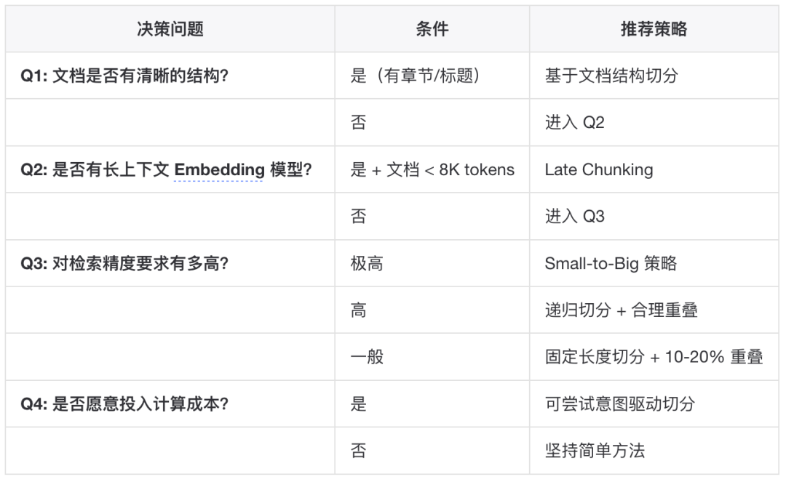

**关键参数**：

- chunk_size ：块大小，通常 256-1024 tokens
- chunk_overlap ：重叠区域，通常 10%-20%，防止切断关键信息

- Step 3: Embed（向量化）

使用 Embedding 模型将文本块转换为稠密向量。本环节idealab提供了多种模型可供选择。

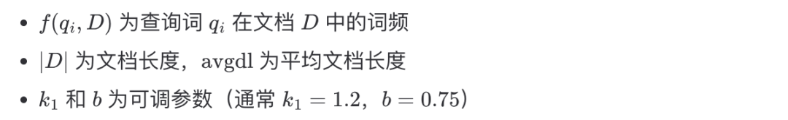

- Step 4: Store（存储与索引）

参考论文： https://arxiv.org/abs/2503.21157 ▐ RAG 场景的特殊考量 构建知识库分为几步？ ▐ 离线索引阶段

将向量及其元数据存入向量数据库，建立高效检索索引。

## 在线查询阶段

- Step 5: Query（查询处理）

对用户原始查询进行预处理和增强。这一步需要Agent的搭建者进行处理，最为简单的方式就是交给大模型自己来。充分信任基模的能力。 以下是一些常见的手段。

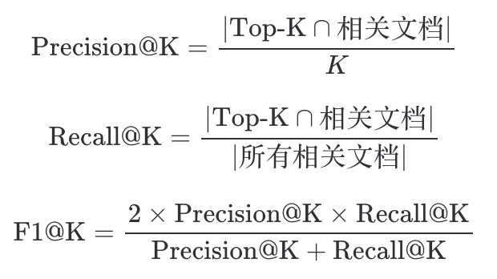

- Step 6: Retrieve（向量检索）

从向量数据库中召回与查询最相关的文档片段。

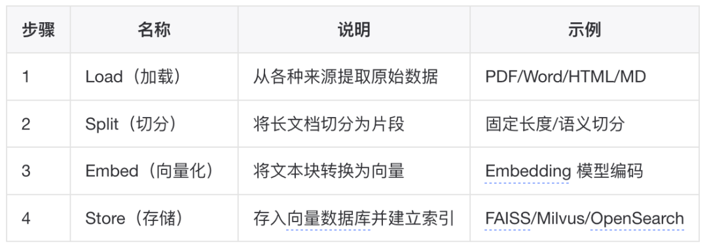

Query Embedding → ANN Search → Top-K Chunks

**检索模式**：

- 稠密检索： 基于向量相似度（余弦、内积）
- 稀疏检索： 基于词频统计（BM25）或学习权重（SPLADE）
- 混合检索： 稠密 + 稀疏，取长补短

同样的，idealab支持多种配置项；

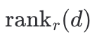

- Step 7: Rerank（重排序，可选）

对初筛结果进行精排，解决初步召回不够准确的问题,尤其是混合召回后的排序。提升最终送入 LLM 的内容质量。

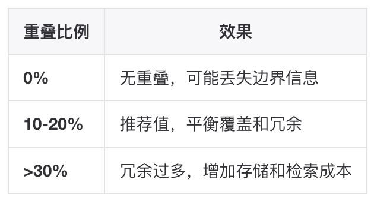

- Step 8: Generate（答案生成）

将检索到的上下文与用户问题一起送入 LLM 生成最终答案。

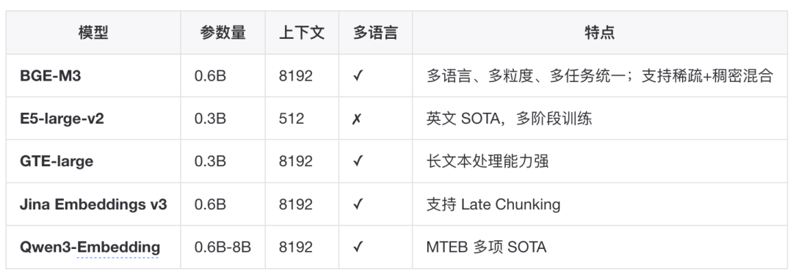

## 知识库的开源项目和案例

上述是 RAG 的常用实践路径，以及 idealab 提供了搭建 Agent 知识库的能力。但作为扩展 LLM 能力的一个方案，其选型和能做的还有很多想象空间。不妨站的更高一点看看别人搞了些啥。

## 案例一：AutoRAG - 自动化 RAG 模块优化框架

- 案例一：AutoRAG - 自动化 RAG 模块优化框架

| 项目信息 | 内容 |
| --- | --- |
| 论文 | AutoRAG: Automated Framework for optimization of Retrieval Augmented Generation Pipeline |
| 链接 | https://arxiv.org/abs/2410.20878 |
| GitHub | https://github.com/Marker-Inc-Korea/AutoRAG |

解决的问题：

RAG 系统涉及众多模块（分块策略、Embedding 模型、检索方式、Reranker 等），不同模块组合在不同数据集上表现差异很大。手动调优耗时且难以找到最优解。

**核心方法**：

AutoRAG 提供自动化的 RAG Pipeline 优化框架：

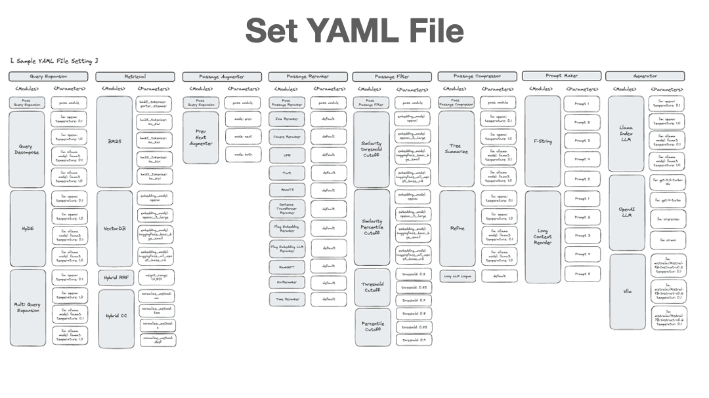

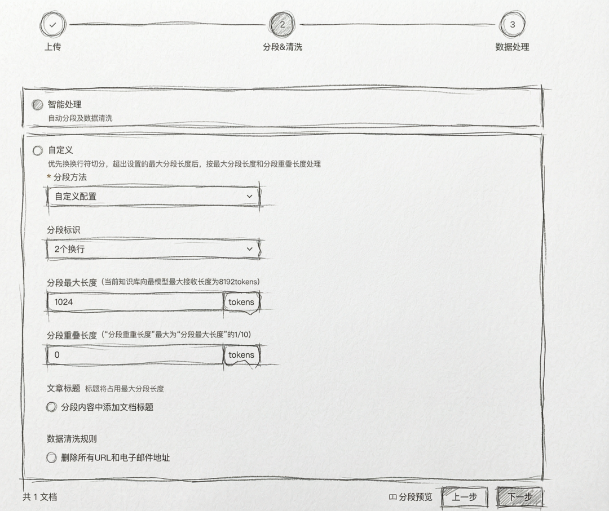

**适用场景**：

- 需要为特定领域数据集优化 RAG 配置
- 缺乏调优经验或资源
- 希望系统化比较不同方案

- 案例二：QuIM-RAG - 问题倒排索引匹配

| 项目信息 | 内容 |
| --- | --- |
| 论文 | QuIM-RAG: Advancing Retrieval-Augmented Generation with Inverted Question Matching for Enhanced QA Performance |
| 发表 | IEEE Access, vol. 12, pp. 185401-185410, 2024 |
| 链接 | https://arxiv.org/abs/2501.02702 |

**应用背景**：

部署在一个**日访问量数千次的高流量网站**，用于回答复杂问题。语料库包含 500+ 页的领域文档。

**解决的问题**：

传统 RAG 在处理大量数据时存在**信息稀释**和**幻觉**问题——直接用 query 检索文档片段，语义匹配不够精准。

**核心创新 - 问题倒排索引**：

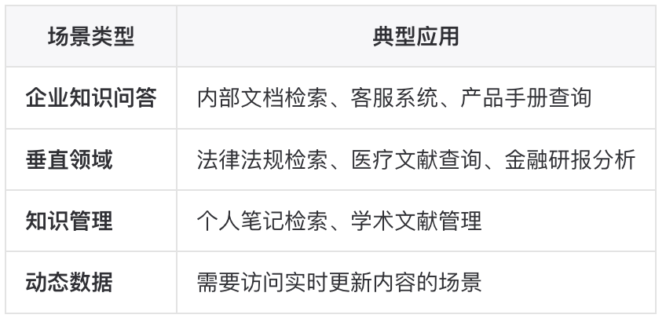

将"Query-Document 匹配"转化为"Query-Query 匹配"，提升检索精度。

**评测结果**：

- 使用 BERT-Score 和 RAGAS 指标评估
- 在两项指标上均优于传统 RAG 架构

- 案例三：OpenViking - 文件系统范式的上下文数据库

| 项目信息 | 内容 |
| --- | --- |
| GitHub | https://github.com/volcengine/OpenViking |
| 作者 | 字节跳动火山引擎 |

**解决的问题**：

传统 RAG 存在以下痛点：

- 上下文碎片化： 记忆在代码中、资源在向量库、技能分散各处
- 扁平化存储： 缺乏全局视角，难以理解信息的完整上下文
- 检索黑盒： 隐式检索链出错时难以调试
- 记忆迭代有限： 只是被动记录交互，缺少与任务相关的主动记忆

**核心创新 - 文件系统范式（Filesystem Paradigm）**：

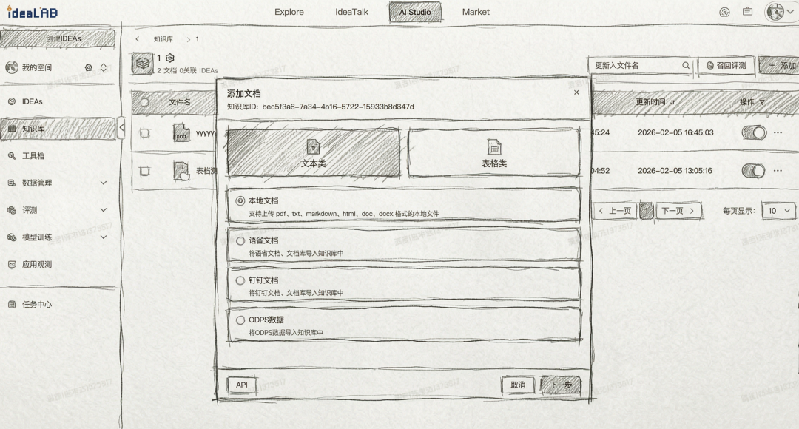

**技术特点**：

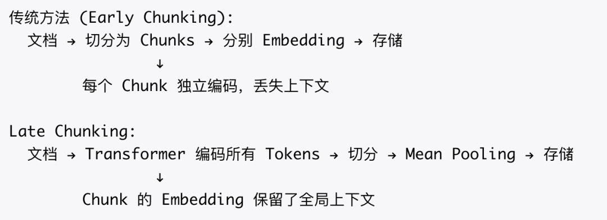

**与传统 RAG 的对比**：

**适用场景**：长时运行的 Agent、需要复杂上下文管理的场景、对检索可解释性要求高的应用。

**小结**：知识库构建没有标准答案，需要根据数据特点和业务场景选择合适的架构模式。核心原则：

1. 分块粒度 要匹配信息单元的自然边界
1. Embedding 模型 要匹配语料语种和领域
1. 检索策略 要兼顾语义召回和精确匹配
1. 架构模式 要根据查询复杂度选择（线性/条件/分支/循环）

如何获得更好的切分（Chunking）？

切分（Chunking）是知识库构建中**影响最大但最容易被忽视**的环节。切分质量直接决定了：

- 检索能否召回完整的答案信息
- 上下文是否包含足够的语义
- 是否会引入无关噪声

## 切分的核心挑战

切分存在一个**两难困境**：

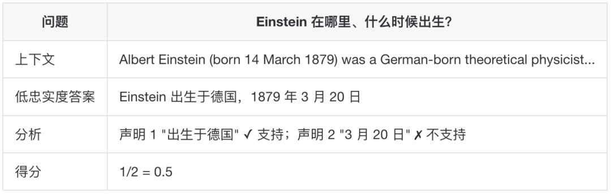

核心目标 ：在粒度和完整性之间找到平衡点。

## 常见切分策略对比

- 固定长度切分（Fixed-size Chunking）

最简单的方法：按固定 token 数切分，通常加上重叠区域。

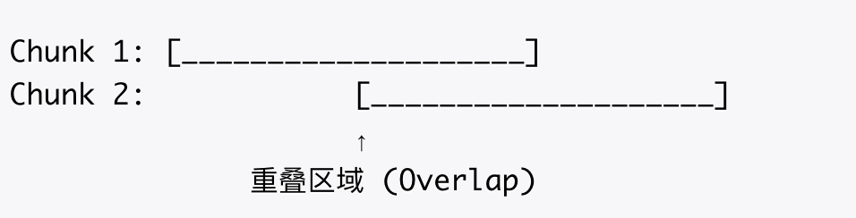

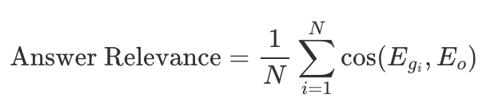

**适用场景**：快速原型、对切分质量要求不高的场景

- 递归切分（Recursive Chunking）

按层次结构递归切分：先尝试按段落分，段落太长则按句子分，句子太长则按字符分。

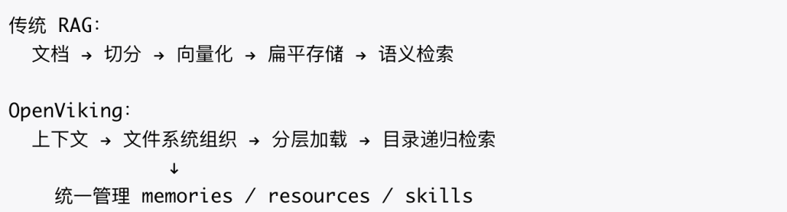

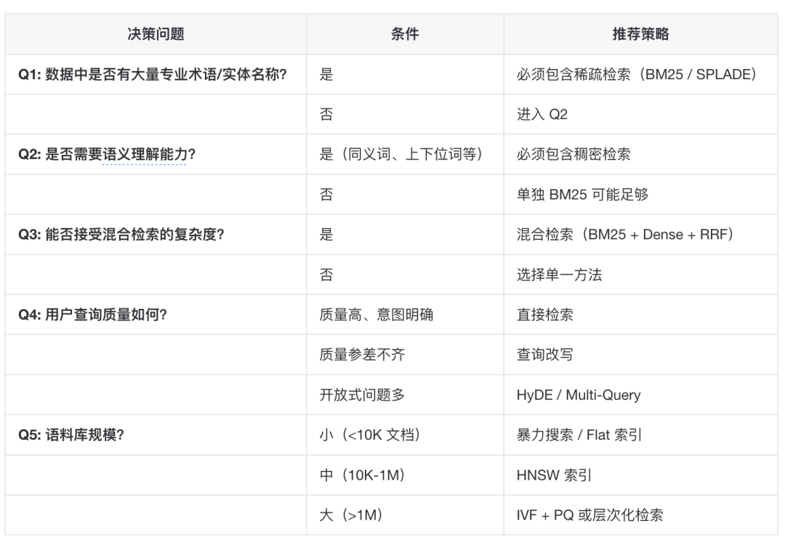

适用场景 ：通用文档处理，结构化文本

- 语义切分（Semantic Chunking）

基于语义相似度判断切分边界：相邻句子语义差异大时切分。

**计算方法**：

1. 对每个句子计算 embedding
1. 计算相邻句子的余弦相似度
1. 相似度低于阈值处切分

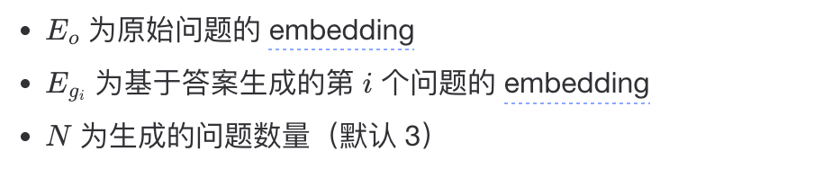

**关于成本效益的研究**：

论文 *"Is Semantic Chunking Worth the Computational Cost?"*（https://arxiv.org/abs/2410.13070）的研究发现：

语义切分的计算成本与性能提升不成正比

在文档检索、证据检索、答案生成三个任务上的实验表明，语义切分相比固定长度切分，性能提升有限，但计算成本显著增加。

**结论**：简单分块 + 合理重叠可能是更实用的选择。

## 进阶切分策略

- Late Chunking（延迟切分）

| 项目 | 内容 |
| --- | --- |
| 论文 | Late Chunking: Contextual Chunk Embeddings Using Long-Context Embedding Models |
| 链接 | https://arxiv.org/abs/2409.04701 |
| 作者 | Jina AI, 2024 |

**核心问题**：

传统方法"先切分，再编码"会导致每个 chunk 丢失来自其他 chunks 的上下文信息。

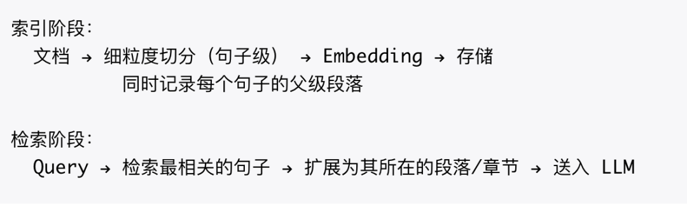

**为什么有效**：

Transformer 的注意力机制使每个 token 都"看到"了整个文档。先编码再切分，每个 chunk 的表示中已经融入了全局上下文。

**使用条件**：

- 需要支持长上下文的 Embedding 模型（如 Jina Embeddings v2 8K）
- 文档长度不超过模型的上下文窗口

**效果**：在各类检索任务上优于传统切分方法，无需额外训练。

- 意图驱动动态切分（Intent-Driven Dynamic Chunking）

| 项目 | 内容 |
| --- | --- |
| 论文 | Intent-Driven Dynamic Chunking: Segmenting Documents to Reflect Predicted Information Needs |
| 链接 | https://arxiv.org/abs/2602.14784 |

**核心思想**：

切分边界应该由"用户可能问什么问题"来决定，而非文档本身的结构。

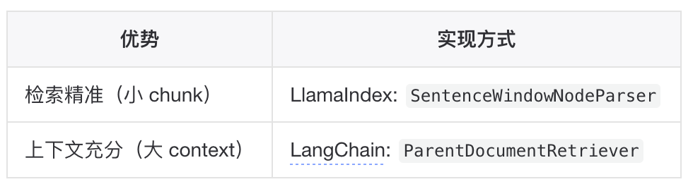

**效果**：

- 检索准确率提升 5%-67%
- 分块数量减少 40%-60%
- 答案覆盖率保持 93%-100%

适用场景 ：对检索质量要求高的场景，特别是长文档和异构文档。

- Small-to-Big 策略

检索时使用小粒度 chunk，生成时扩展为大粒度上下文。

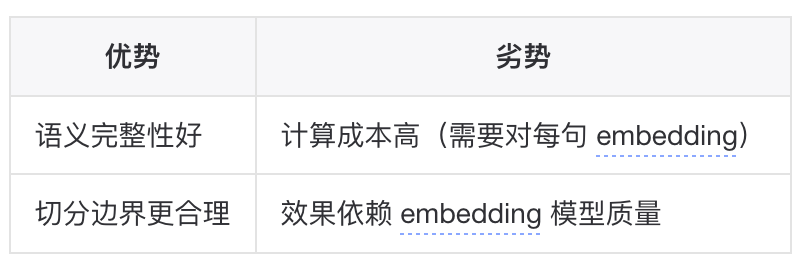

## 切分参数选择

- Chunk Size

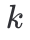

- Chunk Overlap

## 切分策略选型建议

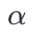

## 实践建议

1. 从简单开始： 先用递归切分 + 10% 重叠建立 baseline
1. 评估驱动： 用 RAGAS 的 Context Precision/Recall 评估切分效果
1. 关注边界： 检查切分是否切断了关键信息（答案、实体）
1. 元数据保留： 切分时保留来源、章节、页码等元数据
1. 迭代优化： 根据 bad case 分析调整切分策略

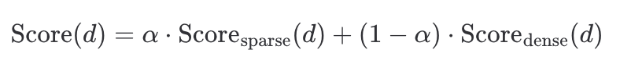

如何获得更好的召回（Retrieval）？

召回（Retrieval）是 RAG 系统的核心环节。检索质量直接决定了 LLM 能否获得正确的上下文信息——如果召回阶段就漏掉了相关文档，后续的 Rerank 和生成都无法弥补。

## 检索范式概述

当前主流的检索方法可分为三类：

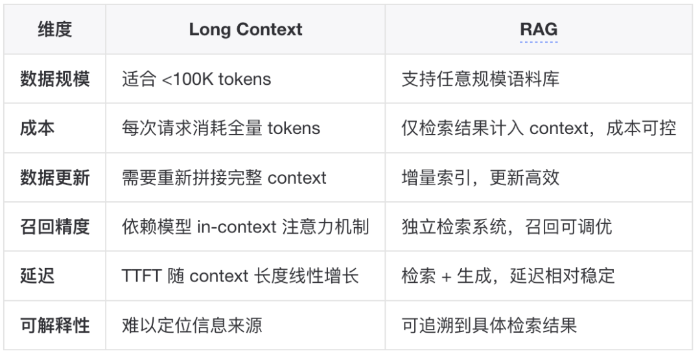

## 稀疏检索（Sparse Retrieval）

- BM25

BM25（Best Matching 25）是经典的稀疏检索算法，基于词频统计进行相关性打分：

其中：

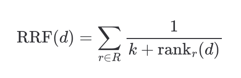

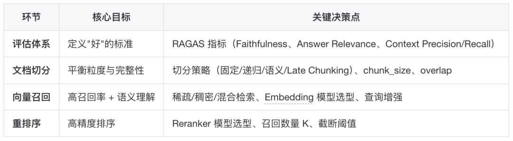

## 稠密检索（Dense Retrieval）

稠密检索使用 Embedding 模型将文本映射为稠密向量，通过向量相似度（余弦、内积）进行检索。

- Embedding 模型选型

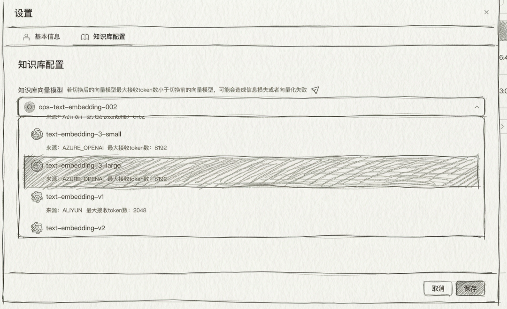

## 混合检索（Hybrid Retrieval）

混合检索结合稀疏和稠密方法的优势：

**混合检索架构流程**：

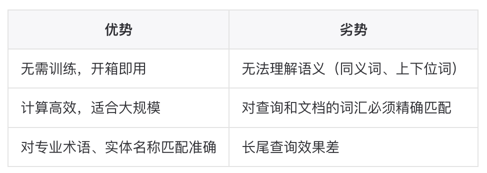

- 融合策略

1. Reciprocal Rank Fusion (RRF)

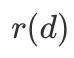

其中

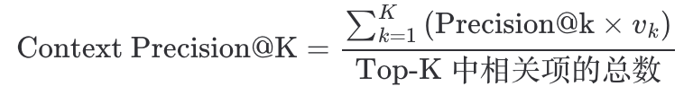

是文档

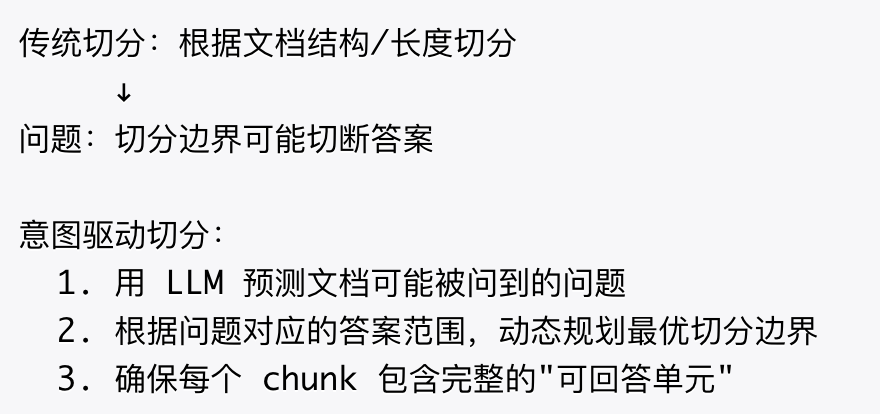

在第

路召回中的排名，

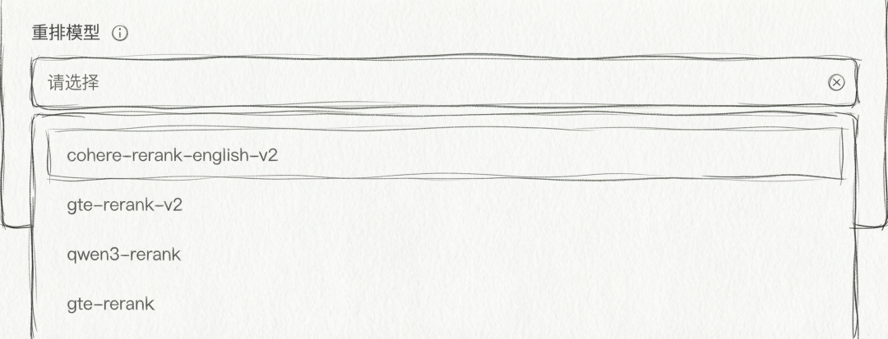

通常取 60。

**2. 加权线性组合**

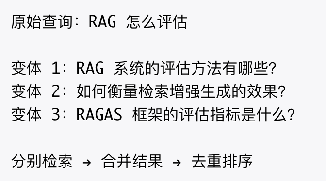

可通过验证集调优，通常在 0.3-0.7 之间。

- 混合检索的优势

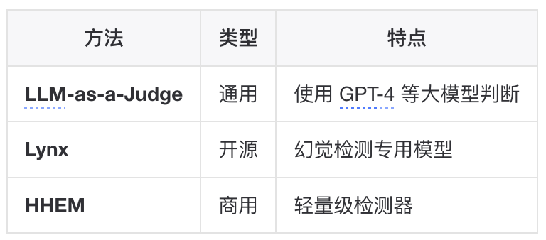

## 进阶检索策略

- 层次化检索（Hierarchical Retrieval）

| 项目 | 内容 |
| --- | --- |
| 论文 | Dense Hierarchical Retrieval for Open-Domain Question Answering |
| 链接 | https://arxiv.org/abs/2110.15439 |

当语料库规模庞大时，直接段落级检索可能导致上下文丢失。层次化检索采用两阶段策略：

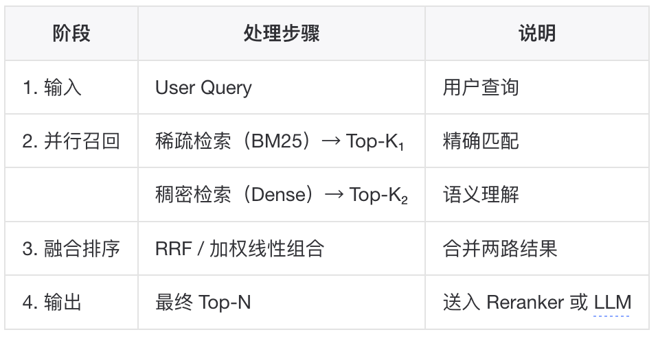

**优势**：

- 避免短段落丢失全局上下文
- 利用文档标题、章节结构等层次信息
- In-Doc 和 In-Sec 负采样策略提升训练效果

查询增强（Query Enhancement）

用户的原始查询往往不够清晰或完整，查询增强技术可以显著提升召回效果。

**1. 查询改写（Query Rewriting）**

使用 LLM 将用户查询改写为更适合检索的形式：

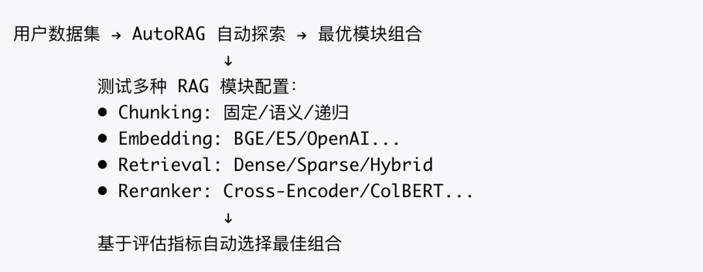

**2. HyDE（Hypothetical Document Embeddings）**

| 项目 | 内容 |
| --- | --- |
| 论文 | Precise Zero-Shot Dense Retrieval without Relevance Labels |
| 链接 | https://arxiv.org/abs/2212.10496 |

核心思想：先用 LLM 生成假设性答案，再用答案的 Embedding 进行检索。

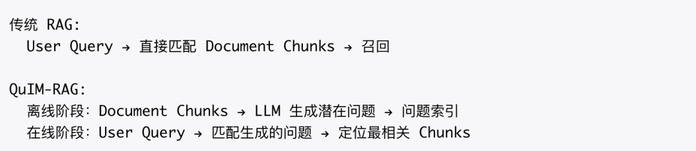

**原理**：答案与答案的语义空间比问题与答案的语义空间更近，从而提升召回精度。

**3. Multi-Query（多查询检索）**

生成多个查询变体，分别检索后合并去重：

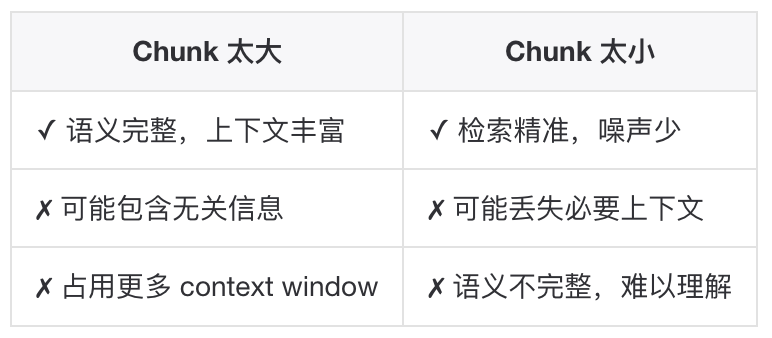

**4. EAR（Expand, Rerank, and Retrieve）**

| 项目 | 内容 |
| --- | --- |
| 论文 | Expand, Rerank, and Retrieve: Query Reranking for Open-Domain Question Answering |
| 链接 | https://arxiv.org/abs/2305.17080 |

核心发现：贪婪解码往往选不到最佳查询扩展。EAR 框架：

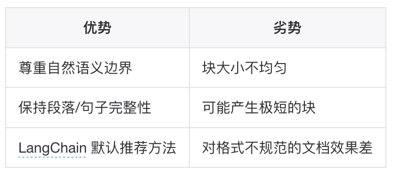

**效果**：

- 领域内 Top-5/20 准确率提升 3-8 个点
- 领域外 Top-5/20 准确率提升 5-10 个点

## 检索策略选型建议

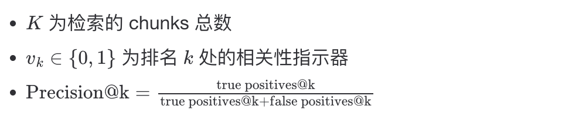

## 实践建议

1. 从混合检索开始 ：BM25 + Dense 的组合通常优于任何单一方法
1. 选择合适的 Embedding 模型 ：根据语言、文档长度、资源限制选型
1. 调优融合权重 ：在验证集上调整 RRF 的 或加权系数
1. 引入查询增强 ：HyDE 和 Multi-Query 对开放式问题效果显著
1. 关注端到端效果 ：使用 ICLERB 思路评估，而非仅关注 NDCG@K
1. 索引类型选择 ：HNSW 在精度和性能间取得良好平衡

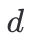

如何获得更好的 Rerank？

## 为什么需要 Rerank？

向量检索（Embedding + ANN Search）是一种**双编码器（Bi-Encoder）**架构：Query 和 Document 分别独立编码，通过向量相似度匹配。这种方式速度快，但精度有限——因为 Query 和 Document 之间没有直接交互。

**Reranker**采用**交叉编码器（Cross-Encoder）**架构：将 Query 和 Document 拼接后联合编码，能够捕捉更细粒度的语义交互，显著提升排序质量。

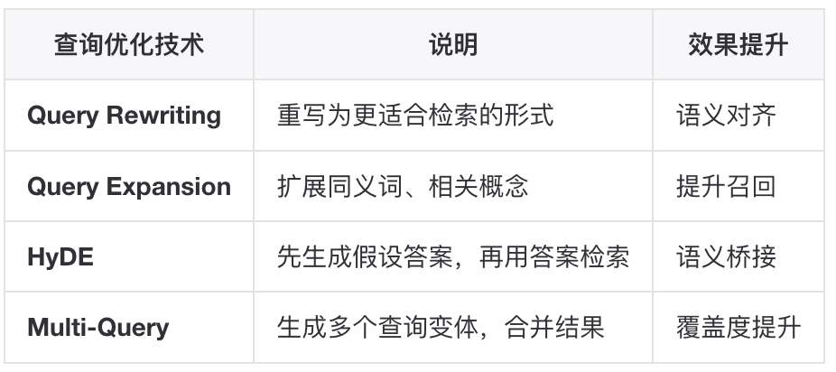

典型流程 ：向量检索召回 Top-100 → Reranker 精排 → 取 Top-5 送入 LLM ▐ Rerank 模型选型对比 主流 Reranker 模型 选型建议 ▐ Rerank 实践要点

- 召回数量与精排数量的权衡

**典型流程**：向量检索 Top-K (K=50200) → Reranker → Top-N (N=310) → LLM

- K 太小：可能漏掉相关文档
- K 太大：Rerank 延迟增加，Cross-Encoder 是 O(K) 复杂度

**经验值 ：K=50~100 是常见选择，根据延迟要求调整。**

- 截断阈值

Reranker 输出的是相关性分数，可以设置阈值过滤低质量结果：

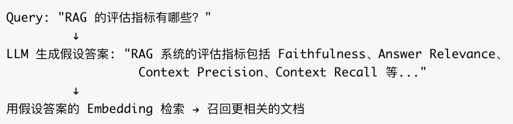

- 多路召回 + RRF 融合

当使用混合检索（BM25 + Dense）时，可以用**Reciprocal Rank Fusion (RRF)**融合排名，再送入 Reranker：

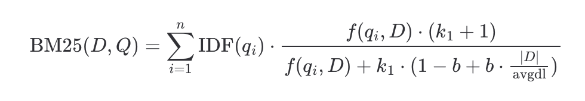

其中 是文档 在各路召回中的排名， 通常取 60。

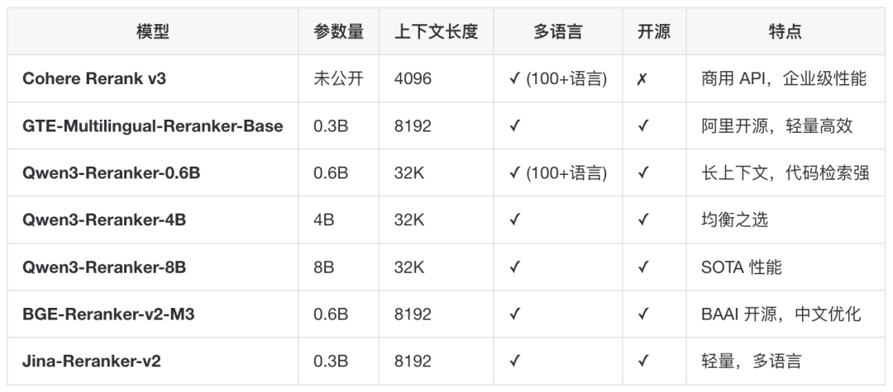

总结

**构建一个"好"的知识库，需要在多个环节进行系统性优化：**

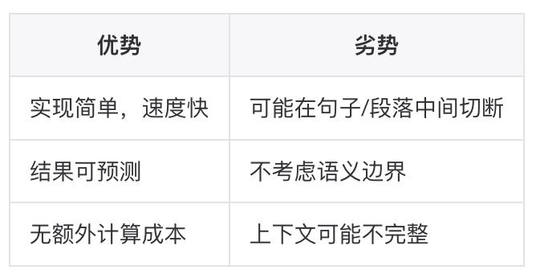

**核心原则 ：**

1. 评估先行 ：先建立评估体系，再迭代优化
1. 从简单开始 ：递归切分 + 混合检索 + 轻量 Reranker 是稳健的起点
1. 数据驱动 ：根据 bad case 分析定位瓶颈环节
1. 端到端思维 ：关注最终生成质量，而非单一环节指标

**知识库构建没有标准答案，需要根据数据特点、业务场景和资源约束进行权衡取舍。**

**服务端技术 | 技术质量 | 数据算法**

¤ 拓展阅读 ¤ 3DXR技术 | 终端技术 | 音视频技术

---

## 📚 专业词汇通俗解释（结合 NanoHermes 项目源码）

### 1. RAG（检索增强生成）

**一句话解释**：让 AI 回答前先"翻书"——从知识库里找到相关资料，再结合这些资料给出答案。就像考试开卷：先翻书找到相关内容，再用自己的话回答。

**NanoHermes 源码映射**：
- 记忆系统（`src/memory/file_provider.py`）本质是轻量级 RAG：从 `~/.nanohermes/memory/` 检索文件注入上下文
- 技能系统（`src/skills/`）也是 RAG 思想：按需加载 SKILL.md，而非一次性全塞给模型
- 工具搜索：BM25 + Regex 双引擎 = 一个"检索器"

---

### 2. Embedding（向量嵌入）

**一句话解释**：把文字变成数字（向量），让计算机能"理解"语义相似度。"猫"和"狗"的坐标比"猫"和"桌子"更近。

**对比**：
| 方法 | 原理 | NanoHermes 使用场景 |
|------|------|-------------------|
| BM25 | 词频统计，关键词匹配 | 工具搜索 |
| FTS5 | 倒排索引，全文搜索 | 会话搜索 |
| Embedding | 语义向量，相似度计算 | RAG 知识库（外部） |

---

### 3. 向量数据库

**一句话解释**：专门存储和搜索"文字向量"的数据库。普通数据库按精确条件查找，向量数据库按"相似度"查找。

**NanoHermes 方案**：SQLite + JSONL 双存储，没有用向量数据库。会话元数据和 FTS5 搜索在 SQLite，完整消息历史在 JSONL。

---

### 4. Context Precision & Recall

**一句话解释**：
- **Precision**：检索回来的内容中，有多少是真的有用的？——"找来的 10 篇里，几篇能用？"
- **Recall**：所有有用的内容中，我找到了多少？——"总共 20 篇有用，找到了几篇？"

---

### 5. Cross-Encoder 重排序

**一句话解释**：先快速海选（向量检索），再精细筛选（Cross-Encoder）。像招聘：先关键词筛 100 人，再一一面试挑 5 人。

**NanoHermes 体现**：责任链拦截机制（`EventBus.intercept()`）按优先级排序精细筛选。

---

### 6. 文档切分（Chunking）

**一句话解释**：把长文档切成小块，每块适合放进 AI 的"短期记忆"。像把厚书拆成章节。

**NanoHermes 切分**：上下文压缩（`compressor.py`）分层压缩——`PROTECT_FIRST_N=3`（保护开头），`PROTECT_LAST_N=20`（保护最近），中间生成摘要。

---

### 7. Faithfulness（忠实度）

**一句话解释**：AI 生成的答案是否忠于检索到的资料？有没有"编造"信息？像记者写报道：引用的话必须能在采访录音里找到。

---

### 8. HyDE（假设文档嵌入）

**一句话解释**：先让 AI 编一个"假答案"，再用这个假答案去知识库里找真资料。答案与答案的语义空间比问题与答案更近。

---

## 🔗 文章理念 vs NanoHermes 实现的对照

| 文章中的 RAG 概念 | NanoHermes 对应实现 | 状态 |
|-------------------|-------------------|------|
| 知识库作为外部记忆 | 记忆系统 + 技能系统 | ✅ 轻量版 |
| 检索器（Retriever） | BM25 + Regex + FTS5 | ✅ 非向量 |
| 文档切分 | 分层压缩（Head/Tail 保护 + 摘要） | ✅ 动态版 |
| 向量存储 | SQLite + JSONL | ⬜ 可扩展 |
| 重排序 | 责任链拦截机制 | ✅ 思路类似 |
| 评估体系 | 指标引擎 + 后台审查 | ✅ 有框架 |
| 上下文窗口管理 | 分层压缩 + 摘要预算 + 断路器 | ✅ 已实现 |

## 💡 可以借鉴文章改进的方向

1. **接入向量数据库**：记忆系统从文件检索升级为语义检索
2. **Embedding 工具**：增加 `embed_text` 工具用于相似度比较
3. **RAG 式技能推荐**：Embedding + 重排序替代纯 BM25
4. **知识库评估**：借鉴 RAGAS，定期审查记忆/技能质量
5. **混合检索**：BM25 + Embedding + Cross-Encoder 三重搜索
6. **智能切分**：按语义边界切分，而非固定长度

---

## 🤔 我的理解与思考：从 NanoHermes 开发实践看 RAG

### 1. RAG 的本质：不是"外挂"，而是"延伸"

RAG 不是简单地把资料丢给模型，而是让模型学会"知道什么时候该查资料、查什么、怎么用对"。

NanoHermes 的技能系统本质就是 RAG：用户说"写技术文档"时，系统按任务加载对应 SKILL.md，而非把所有写作技巧全塞给模型。关键区别：传统 RAG 是"用户提问→系统检索"的被动模式；Agent 的 RAG 是"模型自己决定何时检索"的主动模式。

### 2. 知识库 vs 记忆系统：边界在哪里？

| 维度 | 知识库 | 记忆系统 |
|------|--------|---------|
| 内容 | 领域知识、文档 | 用户偏好、历史决策 |
| 更新频率 | 低频 | 高频 |
| 检索方式 | 语义相似度 + 关键词 | 时间线 + 上下文关联 |
| 生命周期 | 长期有效 | 可能过期需淘汰 |
| NanoHermes | `src/skills/` | `~/.nanohermes/memory/` |

NanoHermes 采用"技能即知识"设计：SKILL.md 是结构化知识库，包含触发条件、步骤、注意事项。模型识别任务类型后自动加载，比"手动选择知识库"优雅得多。

### 3. 向量数据库的"过度设计"陷阱

NanoHermes 一开始也想用 Embedding + 向量搜索做工具发现，但 BM25 已经足够：
- 工具数量少（几十个），BM25 精度速度都够
- 工具名本身就是强信号（`read_file` 比任何 Embedding 都直接）
- 向量数据库增加部署复杂度，对本地 CLI 得不偿失

教训：不要为"技术先进性"引入不必要复杂度。SQLite FTS5 + BM25 在很多场景已足够。

### 4. "评估先行"的实战意义

NanoHermes 建立指标引擎（`src/insights/`）记录 token 消耗、工具调用、错误率，实际收益：
- prompt cache 命中率从 30% 提升到 85%（优化 system prompt 稳定性）
- 上下文压缩次数减少 40%（调整阈值）
- BM25 搜索准确率翻倍（优化工具描述）

建议：哪怕 RAG 再简单，也要建立核心指标——检索命中率、知识新鲜度、使用热度。

### 5. 对"混合检索"的再思考

NanoHermes 采用 **BM25 + Regex 双引擎 + Auto 模式**：
- 模糊意图："读取文件的工具" → BM25（语义匹配）
- 精确意图："read_file" → Regex（精确匹配）

Auto 模式根据查询特征自动选择。这个思路可推广到 RAG：知识型查询用 Embedding，事实型查询用关键词。

### 6. RAG 的未来：从"检索"到"推理"

未来方向是推理增强（Reasoning-Augmented Generation）：
- 当前 RAG：检索资料 → 生成答案
- 未来 RAG：检索资料 → 验证资料 → 推理矛盾 → 生成答案

NanoHermes 后台审查（`src/background/review.py`）已做类似事：会话结束后审查记忆和技能是否需要更新，本质是"后验验证"。

### 7. 给开发者的三条建议

**从文件开始，而不是向量数据库**：先用 Markdown + SQLite FTS5 验证检索逻辑，确定需要语义搜索再引入 Embedding。

**让模型参与检索决策**：不要硬编码检索逻辑，设计接口让模型自己决定是否需要检索、检索哪个库、用什么策略。

**建立"知识淘汰"机制**：过时知识比没有更危险——会让模型产生"我知道这个"的错觉。定期审查、标记过期、删除低质量知识。

---

*基于 NanoHermes（Python 自进化 AI Agent）实际开发经验，结合 RAG 理论分享个人思考。技术没有标准答案，只有适合场景的选择。*
