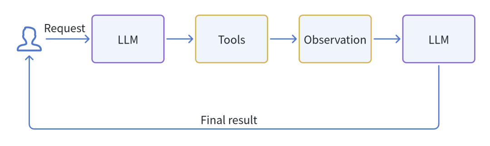
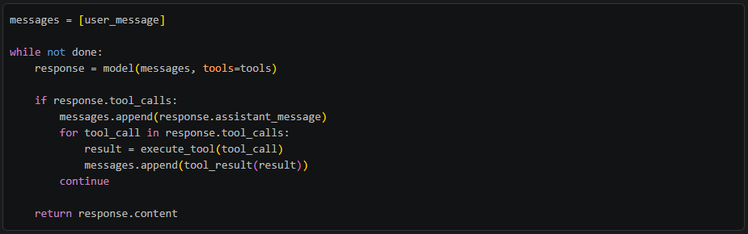
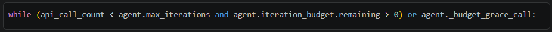
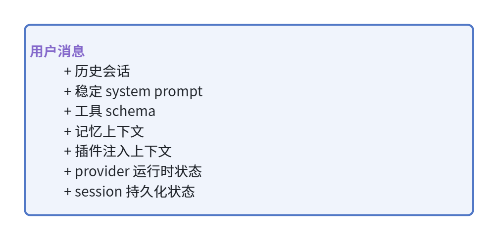
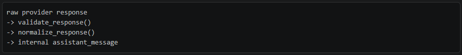
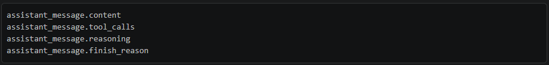
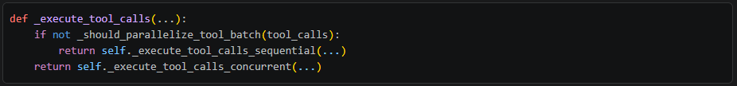
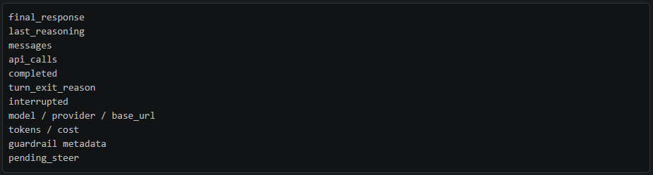
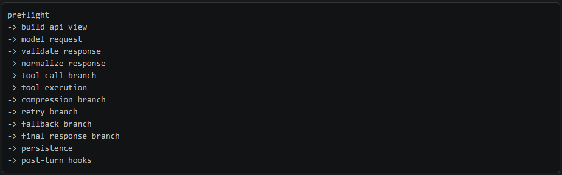

# Loop Engineering：AI Agent 真正的工程战场

过去一年，很多人谈 AI Agent 时，最常见的图都是这样：



看起来很优雅，也很容易让人误以为：Agent 的核心就是给大模型挂几个工具，再写一个 while loop。
但真正把 Agent 跑进 CLI、IDE、网关、定时任务、长会话、多 provider、多工具环境后，你会发现：Agent 的难点不在 loop，而在**loop engineering**。一个能 demo 的 Agent loop 可能只要 50 行。一个能长期服务真实用户的 Agent loop，往往要处理：

- 模型空回复
- 工具调用 JSON 崩坏
- provider 429 / 401 / 5xx
- 上下文爆炸
- 用户中途打断
- 工具执行超时
- 多轮 session 持久化
- prompt cache 命中率
- streaming 半路断开
- 工具结果太大
- 多模型 fallback
- 记忆与插件系统
- 后台任务与主任务互不干扰

Hermes Agent 的 conversation loop 是一个很好的观察样本。它的主实现位于 conversation_loop.py，AIAgent.run_conversation() 在 run_agent.py里已经变成了薄薄一层 forwarder。真正的循环逻辑被抽出来，作为一个模块级函数接收 agent 实例，然后通过 agent.xxx 读写状态。这不是教科书式的漂亮架构，但它非常真实：一个从生产复杂度里长出来的 Agent loop。
### 一、最小 Agent Loop 是什么？
如果把所有工程细节剥掉，Agent loop 的骨架大概是：



这就是 ReAct、tool calling、function calling 时代最核心的 Agent 模式：

- 模型决定下一步
- 工具改变外部世界
- 工具结果回填上下文
- 模型继续决策
- 直到模型给出最终答案

但 Hermes 的实现告诉我们：这个骨架只是开始。在 conversation_loop.py，主循环长这样：



这行代码背后已经有了两个工程判断：
第一，Agent 不能无限循环。
第二，预算耗尽时，最好还能给模型一次“收尾机会”，让它总结当前进展，而不是突然死掉。
这就是 loop engineering 的**第一个原则：Agent loop 必须有边界，但边界不能粗暴。**
### 二、每个用户 Turn 不是直接进模型
很多简化版 Agent 教程会直接把用户消息塞给模型。Hermes 不这么做。一次 run_conversation() 开始后，它会先做一大段 turn preflight：

- 确保 session DB 存在
- 设置日志里的 session context
- 恢复主 provider / model
- 清理输入里的非法 surrogate 字符
- 生成本轮 task_id
- 重置各种 retry counter
- 初始化 IterationBudget
- 从历史恢复 todo 状态
- 从历史恢复 memory nudge 计数
- 构建或恢复 cached system prompt
- 必要时先做上下文压缩

这说明一个成熟 Agent 的输入不是“用户消息”，而是：



这里有个很关键的设计点：Hermes 会缓存 system prompt，并把它持久化到 SQLite。继续会话时，它尽量恢复之前完全一致的 system prompt，而不是重新构建。
为什么？
因为 prompt cache 很贵，也很脆弱。尤其是 Anthropic / prefix-cache 这类机制，前缀字节不稳定就会 miss。Hermes 的策略是：系统提示词属于 Agent 内核，应该跨 turn 稳定；插件、记忆等动态上下文尽量注入 user message，而不是修改 system prompt。
这就是 loop engineering 的**第二个原则：上下文不是越丰富越好，稳定性本身就是性能优化。**
### 三、API Messages 和 Durable Messages 是两套东西
Hermes 内部维护的是 messages，这是会被保存进 session 的 durable history。但真正发给模型的是 api_messages，它是每次 API call 临时构造出来的 copy。这两者不能混用。在构造 api_messages 时，Hermes 会做很多只影响本次请求的处理：

- 注入 external memory prefetch
- 注入 plugin pre_llm_call 返回的上下文
- 加上 cached system prompt
- 插入 prefill messages
- 应用 Anthropic cache control
- 清理 provider 不接受的字段
- 修复 tool/result role alternation
- 丢弃 thinking-only assistant turn
- 规范化 tool-call JSON
- 清理 surrogate 字符

这些处理大多不应该污染 durable history。比如一个插件给当前 turn 注入了临时上下文，这个上下文应该帮助模型回答，但不应该永久写进用户会话。否则下一轮模型会看到一堆过期的“临时信息”，上下文越来越脏。所以成熟 Agent loop 里通常有两条消息流：

- **durable messages**: 真实会话历史，用于持久化和恢复
- **api messages**: 本次模型请求视图，可以临时增强、裁剪、修复、适配 provider

这就是 loop engineering 的**第三个原则：发给模型的上下文，不一定等于要保存的上下文。**
### 四、Transport 抽象：不要把 Loop 绑死在某个 API
很多 Agent demo 默认只有 OpenAI Chat Completions。但真实世界里，Hermes 需要跑在：

- OpenAI-compatible chat completions
- Anthropic Messages
- Bedrock Converse
- Codex Responses
- Copilot / ACP
- 各种 OpenRouter / local server / provider adapter

这些 API 的 response shape、finish reason、tool call 字段、reasoning 字段都不完全一样。Hermes 的做法是通过 transport 抽象统一：



主 loop 只关心归一化后的：



这一步非常重要。否则每加一个 provider，主循环就会多一堆 if/else，最后变成 provider 特判地狱。
这就是 loop engineering 的**第四个原则：Loop 应该处理 Agent 状态机，Provider 差异应该被 adapter 吃掉。**
### 五、Tool Calls：先校验，再执行，再回填
当模型返回 tool calls，Hermes 不会立刻执行。它会先做几层防御：

- 修复 hallucinated tool name
- 校验工具名是否在 valid_tool_names
- 校验 arguments 是否是合法 JSON
- 检测截断的 tool call arguments
- 对 delegate task 做数量限制
- 对重复 tool call 去重
- 应用 tool guardrail
- 必要时创建 checkpoint

之后才会 append assistant tool-call message，然后执行工具。工具执行逻辑在 tool_executor.py。入口在 run_agent.py：



这背后又是一个工程判断：不是所有工具都能并发。
读文件、搜索、查询类工具通常可以并发；但写文件、patch、terminal 这类会改变外部状态的工具，如果路径重叠或有交互行为，就要顺序执行。并发路径会用 ThreadPoolExecutor，但结果仍然按原 tool-call 顺序 append 回 messages，确保模型看到的 tool results 顺序稳定。
这就是 loop engineering 的**第五个原则：工具调用不是函数调用，而是带副作用的事务片段。**
### 六、空回复不是小概率事件，而是常态故障模式
真实 Agent 系统里，模型空回复非常常见。尤其是在这些场景：

- 刚执行完工具，模型应该继续但返回空
- thinking model 把 token 都花在 reasoning 上，没有 visible content
- provider streaming 半路断开
- weak model 看到复杂 tool results 后“沉默”
- fallback provider 对某些字段兼容不好

Hermes 对空回复有一整套恢复路径：

- 如果已有 partial streamed content，就用已送达内容恢复
- 如果上一轮是“内容 + housekeeping tools”，直接用上一轮内容作为 final
- 如果刚执行完工具后空回复，追加 synthetic nudge 让模型继续
- 如果只有 thinking 没有 visible content，做 thinking prefill continuation
- 多次空回复后尝试 fallback provider
- 最终才返回 (empty) sentinel

这说明：Agent loop 不能假设模型每次都会遵守协议。大模型不是传统 RPC 服务。它可能返回半个 JSON、空字符串、只有 reasoning、错误工具名、截断参数，或者在最需要回答的时候什么都不说。
所以 loop engineering 的**第六个原则是：不要相信模型会优雅失败，要为非优雅失败设计恢复路径。**
### 八、 Context Compression 是 Loop 的一部分
长会话 Agent 一定会撞上下文窗口。Hermes 有两种压缩触发：
第一种是 preflight compression。进入主循环前先估算 token，如果历史已经接近阈值，提前压缩。
第二种是错误恢复 compression。当 provider 返回 context overflow、413 payload too large、long context tier 等错误时，loop 会动态降低 context length、调用 compressor、重试请求。
这比简单“超过 N 条消息就摘要”更工程化。因为实际上下文压力不只来自消息，还来自：

- system prompt
- tool schemas
- tool results
- reasoning blocks
- provider-specific message wrapping
- multimodal payload

Hermes 的估算甚至会把 tool schema tokens 算进去。这个细节非常关键：启用几十个工具时，schema 本身就可能占掉几万 token。
这就是 loop engineering 的**第七个原则：上下文管理不是聊天历史管理，而是整次请求体管理。**
### 八、Interrupt：用户要能随时刹车
Agent 一旦可以执行 terminal、浏览器、文件写入、子任务委派，就必须支持 interrupt。Hermes 的 interrupt 不是只在主 while 顶部检查一次。它在多个地方都检查：

- API call 前
- API retry backoff 期间
- tool execution 前
- concurrent tool futures 等待期间
- error handling 期间
- streaming / non-streaming 调用中

工具执行线程也会注册 thread id，方便把 interrupt 信号传给正在运行的工具 worker。这背后是一个产品判断：Agent 不是 batch job，它是交互式系统。用户看到它走偏了，必须能立刻踩刹车。
这就是 loop engineering 的**第八个原则：可中断性不是 UI 功能，而是 loop 的控制面。**
### 九、Loop 的结束不是 return 那么简单
当 Hermes 得到 final_response 后，事情还没完。它还会做：

- 保存 trajectory
- 清理本轮 VM / browser 资源
- 删除内部 retry scaffolding
- 持久化 session
- 记录 turn exit diagnostic
- 添加文件修改失败 footer
- 触发 plugin transform_llm_output
- 触发 plugin post_llm_call
- 同步 external memory
- 根据 cadence 启动后台 memory / skill review
- 触发 on_session_end
- 清理 interrupt 和 stream callback 状态

最终返回的 result 也不只是文本，而是包含：



这说明成熟 Agent loop 的输出不是一句话，而是一份 turn report。
这就是 loop engineering 的**第九个原则：一次 Agent turn 是可观测、可恢复、可计费、可审计的执行单元。**
### 十、真正的 Agent Loop 是一个状态机
如果只看抽象图，Agent loop 像一个简单循环。但看 Hermes 的实现，它更像一个复杂状态机：



每条边上都有恢复策略。每个状态都可能被 interrupt。每次失败都要决定：重试、压缩、fallback、注入 synthetic message、返回 partial，还是终止。这就是为什么我更喜欢用 “loop engineering” 而不是 “agent loop” 来描述这件事。因为核心问题已经不是“怎么循环”，而是：

- 如何让循环不会失控？
- 如何让模型犯错后能自愈？
- 如何让工具副作用可控？
- 如何让上下文长期健康？
- 如何让 provider 故障不拖垮用户任务？
- 如何让 session 能恢复、能观测、能计费？
- 如何让用户随时介入？

**结语：Agent 的护城河在 Loop 里**
模型能力会变强，工具协议会标准化，function calling 会越来越好用。但 Agent 产品真正的体验差异，很多时候来自 loop engineering。一个脆弱的 Agent，在顺风局里看起来很聪明；一旦遇到空回复、截断、429、坏 JSON、上下文爆炸，就开始胡言乱语或者原地停止。一个成熟的 Agent，则会在这些脏乱差的真实条件下继续推进任务：能修复、能降级、能总结、能中断、能恢复。
Hermes Agent 的 conversation loop 不优雅，但很有启发性。它像一层厚厚的工程缓冲区，把不稳定的模型、不稳定的 provider、不稳定的工具世界，包成一个相对稳定的用户体验。这也许就是 AI Agent 工程最朴素的真相：
**智能来自模型，可靠来自 loop。**


---

## 📚 专业词汇通俗解释（结合 NanoHermes 项目源码）

### 1. Agent Loop（代理循环）

**一句话解释**：AI Agent 的"心脏"——它不断地让模型思考→调用工具→看结果→再思考，直到任务完成。就像厨师做菜：看菜谱（prompt）→切菜（tool call）→尝味道（tool result）→调整火候（再思考），循环往复。

**NanoHermes 源码映射**：
- 核心文件：`src/conversation/loop.py` 中的 `ConversationLoop` 类
- 主循环方法：`run(messages, tools)`，约 472 行
- 循环边界：`max_iterations=90`（第 56 行），防止无限循环
- 中断检查：`self._interrupted` 标志（第 117-120 行），每轮迭代开头检查是否被用户打断
- 关键流程：合并工具 schema → 发射事件 → 调用模型 → 处理工具调用 → 检查压缩

```python
# loop.py 核心循环骨架（简化版）
while iteration < self.max_iterations:
    if self._interrupted:
        break
    current_tools = self._get_current_tools()  # 动态工具发现
    response = self._call_model(messages, current_tools)
    if response.get("tool_calls"):
        # 执行工具，回填结果
        ...
```

**对比**：
| 概念 | 玩具版 Agent | 工程级 Agent（NanoHermes） |
|------|-------------|--------------------------|
| 循环边界 | 无限制或简单 count | max_iterations + interrupt + 预算系统 |
| 工具列表 | 启动时固定 | 动态发现（search_tools）+ 按需加载 |
| 错误处理 | try/except 了事 | 分类器（ErrorClassifier）+ 重试策略 |
| 可观测性 | 无 | 18 种事件类型（EventBus）全程可追踪 |

---

### 2. Conversation Loop vs Agent Run（对话循环 vs 代理运行）

**一句话解释**：Agent Run 是外层的"壳"，Conversation Loop 是内层的"引擎"。就像汽车：Agent Run 是方向盘和仪表盘（用户交互层），Conversation Loop 是发动机（核心计算层）。

**NanoHermes 源码映射**：
- 在 NanoHermes 中，`ConversationLoop.run()` 就是核心引擎
- 调用方（如 TUI 或 CLI）负责组装 messages、创建 loop 实例、处理返回结果
- 通过 `EventBus` 解耦：外部功能（记忆、TUI、调试）订阅事件接入，不侵入循环逻辑

```python
# events.py：18 种事件类型枚举
class EventType(Enum):
    LOOP_START = "loop_start"
    MODEL_REQUEST = "model_request"
    TOOL_START = "tool_start"
    INTERRUPT = "interrupt"
    # ... 共 18 种
```

---

### 3. Transport Abstraction（传输抽象）

**一句话解释**：让 Agent 不依赖特定 AI 公司的 API。就像充电器用 USB-C 接口，不管插什么品牌的充电头都能用——Transport 就是把不同 AI 厂商的 API 差异统一成一个标准接口。

**NanoHermes 源码映射**：
- NanoHermes 通过 `model_call` 回调函数实现传输抽象（loop.py 第 57-58 行）
- `ConversationLoop` 不直接调用 OpenAI/Anthropic API，而是接收一个 `_model_call` 函数
- 这个函数由外部注入，可以是 OpenAI 客户端、Anthropic 客户端、或任何兼容的适配器
- 归一化响应格式：`{"content": "...", "tool_calls": [...], "reasoning": "..."}`

**对比**：
| 方式 | 耦合型 | 抽象型（NanoHermes） |
|------|--------|---------------------|
| API 调用 | loop 里写死 `openai.ChatCompletion.create()` | 注入 `_model_call` 回调 |
| 换提供商 | 改主循环代码 | 换注入的函数即可 |
| 测试 | 必须打网络 | 可以注入 mock 函数 |

---

### 4. Context Compression（上下文压缩）

**一句话解释**：AI 模型的"短期记忆"有限（比如只能记住 128K 个词），对话太长就装不下了。压缩就是：保留最重要的开头和结尾，把中间的内容浓缩成摘要。就像读书做笔记：第一章和最后一章原文保留，中间章节只留摘要。

**NanoHermes 源码映射**：
- 核心文件：`src/compression/compressor.py` 中的 `ContextCompressor` 类，1044 行
- 分层压缩策略（四层）：
  1. **Tool Output Pruning**：裁剪工具输出，只保留关键结果（廉价，无 LLM 调用）
  2. **Head/Tail 保护**：`PROTECT_FIRST_N=3`（保护 system prompt 和初始任务），`PROTECT_LAST_N=20`（保护最近的工作记忆）
  3. **Middle 摘要**：用 LLM 生成中间对话的结构化摘要，比例 20%（`SUMMARY_RATIO=0.20`）
  4. **Session Splitting**：压缩也不够用时，创建新 session 并链接血缘
- 摘要前缀：`[CONTEXT COMPACTION — REFERENCE ONLY]`，防止模型把摘要中的旧指令当当前任务执行
- 触发时机：preflight（进循环前估算）+ error recovery（上下文溢出错误时动态压缩）

```python
# compressor.py 关键常量
PROTECT_FIRST_N = 3    # 首因效应：保护开头 3 条消息
PROTECT_LAST_N = 20    # 近因效应：保护最近 20 条消息
SUMMARY_RATIO = 0.20   # 摘要长度为被压缩内容的 20%
CHARS_PER_TOKEN = 4    # 估算：1 token ≈ 4 个英文字符
```

---

### 5. EventBus（事件总线）

**一句话解释**：Agent 内部的"广播系统"。核心循环做完一件事就广播一下，谁关心谁就过来听。就像公司的 Slack 频道：开发部发通知"代码部署完成"，测试部收到后自动跑测试，运维部收到后自动更新监控——彼此不需要直接联系。

**NanoHermes 源码映射**：
- 核心文件：`src/conversation/events.py`
- 18 种事件类型，覆盖完整生命周期
- 两种机制：
  - **观察者（Observer）**：`events.on(EventType, handler)` — 纯监听，不影响流程
  - **拦截器（Interceptor）**：`events.intercept(EventType, handler)` — 可修改数据或阻断流程
- 责任链模式：拦截器按优先级排序，一个不调用 `next()` 就阻断整个链
- 关键设计：拦截器阻断后，观察者仍触发（保证日志/持久化不丢失）

```python
# events.py 责任链结果
@dataclass
class ChainResult:
    blocked: bool = False   # 是否被拦截
    message: str = ""       # 阻断原因
```

---

### 6. Tool Call Validation（工具调用校验）

**一句话解释**：模型有时候会"胡说八道"——编造不存在的工具名、给出格式错误的 JSON 参数。校验就是在执行工具之前，先检查一遍模型说的话是否合法。就像餐厅服务员接到顾客的奇怪点单："给我来一份菜单上没有的菜"，服务员会确认而不是直接进厨房。

**NanoHermes 中的体现**：
- 工具通过 AST 自动发现：`discover_tools(tools_dir)` 扫描 `src/tools/` 模块
- 延迟加载机制：启动时只加载 6 个核心工具（read_file, write_file, search_files, patch, terminal, search_tools），其余 11 个通过 `search_tools` 按需发现
- BM25 + Regex 双引擎搜索工具，Auto 模式自动选择策略
- 工具执行结果按原 tool-call 顺序 append 回 messages，确保模型看到的顺序稳定

**始终加载 vs 延迟加载**：
| 加载时机 | 工具 | 原因 |
|---------|------|------|
| 始终加载 | read_file, write_file, search_files, patch, terminal, search_tools | 最基础的操作，每轮都可能需要 |
| 延迟加载 | execute_code, process, todo, memory, delegate_task 等 11 个 | 节省上下文窗口，按需发现 |

---

### 7. Prompt Cache（提示词缓存）

**一句话解释**：AI 厂商提供的一种"记忆加速"功能。如果你的系统提示词不变，厂商会缓存它，下次调用时不用重新处理，速度快且便宜。就像背课文：第一次要逐字读，背熟了之后只需要提示第一个字就能接下去。

**NanoHermes 中的策略**：
- 系统提示词属于 Agent 内核，跨 turn 保持稳定
- 插件、记忆等动态上下文尽量注入 user message，而不是修改 system prompt
- 缓存策略：Anthropic prompt caching 标记 stable 层的最后一个部分为缓存断点
- 只取前 16 位（64 bit）哈希值判断 stable 层内容是否变化，足够唯一性且节省存储

---

### 8. Durable Messages vs API Messages（持久消息 vs API 消息）

**一句话解释**：两套消息流——一套是"日记本"（永久保存的真实对话历史），一套是"草稿纸"（每次给模型看的临时增强版）。日记本只记真实发生过的事，草稿纸可以画辅助线、做标注，但用完就扔。

**为什么需要两套？**：
- 插件给当前轮注入的临时上下文不应该永久写进会话
- 否则下一轮模型会看到一堆过期的"临时信息"，上下文越来越脏
- API 消息可以裁剪、修复、适配 provider，不影响持久历史

---

## 🔗 NanoHermes vs 文章理念的对照

| 文章中的 Loop Engineering 原则 | NanoHermes 实现状态 | 具体位置 |
|-------------------------------|-------------------|---------|
| 循环必须有边界 | ✅ `max_iterations=90` + interrupt 检查 | `loop.py:56, 117-120` |
| 上下文稳定性 = 性能优化 | ✅ prompt cache + stable/context/volatile 三层提示词 | 缓存策略 |
| 发给模型的 ≠ 要保存的 | ✅ 需外部组装 api_messages vs durable messages | 调用方职责 |
| Provider 差异被 adapter 吃掉 | ✅ `_model_call` 回调注入 | `loop.py:57-58` |
| 工具调用先校验再执行 | ✅ AST 自动发现 + 延迟加载 + 双引擎搜索 | `tools/` 模块 |
| 非优雅失败需要恢复路径 | ✅ `ErrorClassifier` 分类 + 重试策略 | `loop.py:179-201` |
| 上下文管理 = 整次请求体管理 | ✅ `ContextCompressor` 分层压缩 + tool schema 计算 | `compressor.py` |
| 可中断性是控制面 | ✅ `_interrupted` 多处检查 | `loop.py:117-120` |
| turn 是可观测的执行单元 | ✅ 18 种 EventBus 事件覆盖全生命周期 | `events.py` |
| Agent loop 是状态机 | ✅ 事件驱动状态流转 + 责任链拦截 | `events.py + loop.py` |

## 💡 可以借鉴文章改进的方向

1. **Turn Preflight 机制**：NanoHermes 目前缺少文章提到的"进入循环前的一长串准备工作"（session DB 检查、task_id 生成、retry counter 重置等），可以考虑在 `run()` 方法开头增加 preflight 阶段
2. **API Messages 与 Durable Messages 分离**：NanoHermes 目前直接在 messages 上操作，没有区分"持久历史"和"临时增强"，可能导致上下文污染
3. **空回复恢复路径**：文章详细描述了模型空回复的 6 种恢复策略，NanoHermes 可以增加对空回复的检测和自愈机制
4. **后台任务调度**：文章提到"后台 memory/skill review"，NanoHermes 已有 `background/scheduler.py` 和 `background/review.py`，可以进一步强化
5. **Transport 归一化层**：目前通过 `_model_call` 回调实现了一定抽象，但响应格式的归一化还可以更彻底（如 finish_reason、reasoning 字段的统一处理）
