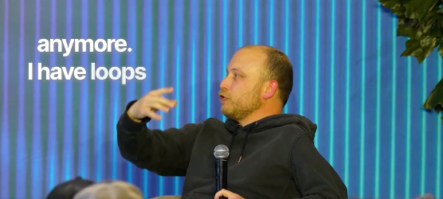
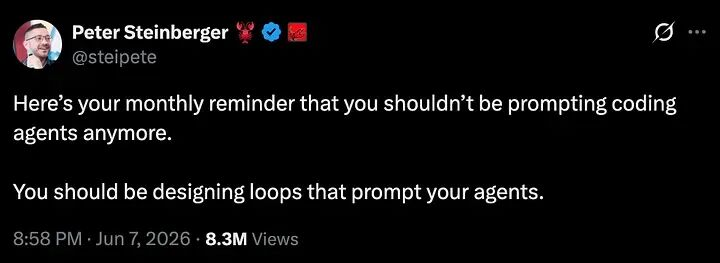
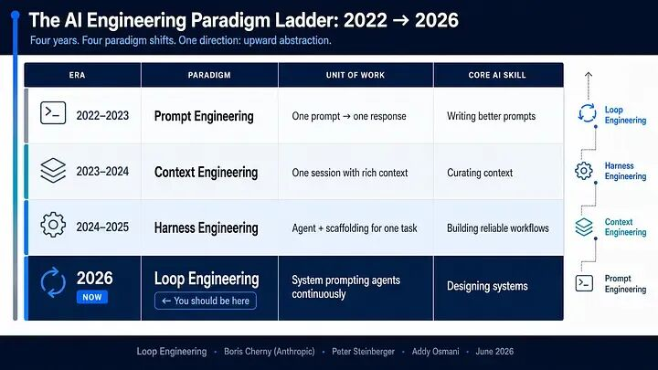
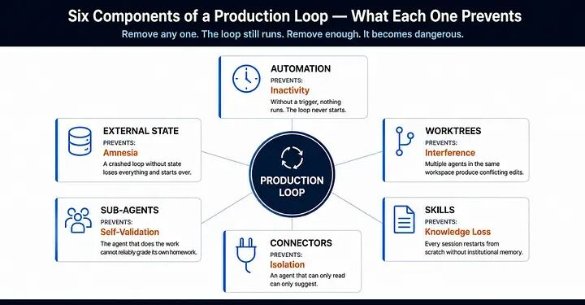
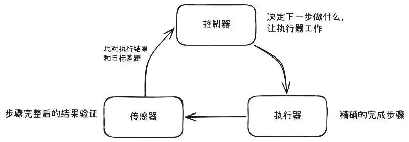

# 一文搞懂！Loop Engineering的进化史和本质

Datawhale干货

**作者：王大鹏，Dataw hale成员**

前两天，我们分享了《 重磅！Loop Engineering 实操手册公开》，系统梳理了 Loop Engineering 的六个核心组件和落地方法。

今天来聊聊额外的内容：一是补上 Loop 的演进脉络；二是补上对 Loop 本质的理解。我们就从最近这两个判断说起。

2026 年 6 月，Anthropic Claude Code 负责人 Boris Cherny 说了句让人愣住的话：

"I don't prompt Claude anymore. I have loops that are running. They're the ones that are prompting Claude and figuring out what to do. My job is to write loops."



有意思的是，大多数开发者仍在打造完美的提示词，而制作工具的人完全放弃了提示词。

同一周，OpenClaw 的创始人 Peter Steinberger 用另一种方式表达了同一件事：

"You shouldn't be prompting coding agents anymore. You should be designing loops that prompt your agents."



两个人在不同场合、不同产品上，得出了同一个结论。这不像是巧合，更像是某种工程实践自然走到了一个拐点。

本文讨论的问题是：Loop 它从哪里来？解决的到底是什么问题？以及对大多数人来说，现在该不该动手建一个？

### 一、Prompt → Context → Harness → Loop

要理解 Loop Engineering，得先理解它之前发生了什么，弄清楚整条链路发生了什么。

故事从 2024 年讲起。那时候跟 AI 协作的方式很简单：你写一条 prompt，模型回你一段结果。Prompt Engineering 这个词就是在这个阶段被发明的——用措辞+例子+格式，能让模型输出你想要的东西。

这套方法有一个根本性的局限：你必须在一条消息里事先预见模型需要的一切。你得把背景、规则、示例、约束全塞进去。模型看到什么就知道什么，看不到的只能猜。

到了 2025 年初，人们意识到问题不出在 prompt 的措辞上，而在于模型拿到的信息太少。Context Engineering（上下文工程）应运而生——不再纠结于怎么“问”，而是精心构造模型“看到”的东西：system prompt 提供角色和规则，few-shot 示例校准输出格式，RAG 检索注入实时知识，结构化输入让模型精确理解需求边界。

上下文做好了，模型不再猜了。但一个新问题浮出来：即使信息完美，复杂任务一次做不完。重构一个模块需要先读代码、再改接口、再更新调用方、再跑测试验证——这不是一个 prompt 能搞定的事。模型需要多步执行，需要工具，需要在中间观察结果再决定下一步。

于是 Harness Engineering出现了。这个名字有点奇怪，但它描述的事情很具体：给 Agent 装上工具——shell 命令、文件系统读写、MCP 连接器、沙箱环境——然后给它一套重试机制和权限控制，让它能在一次 session 内完成多步操作。Claude Code、Cursor、Codex 这些产品本质上都是 harness。你给它一个任务，它自己规划步骤、调用工具、观察结果、在失败后重试。

Harness 解决了“单次 session 内的执行能力”问题。但它没解决一个更大的瓶颈——人。

你有一个装备精良的 Agent。它能读代码、写代码、跑测试、开 PR。但每天早上，是你打开电脑、检查 CI 状态、复制错误日志、把日志贴给 Agent、等它修完、review 结果、批准合并。第二天重复。第三天你可能就烦了。

此时Agent 的能力不是瓶颈，人才是。

Loop Engineering 的出发点正基于此，把“人触发 Agent → 人判断结果 → 人决定下一步”这个循环中的人替换成一个自动化系统。这个系统能定时触发、能验证结果、能记住上次做到哪了、能决定继续还是停止还是上报。

你不再是那个写 prompt 的人。而是设计 prompt 系统的人。



### 二、让 Loop 跑起来需要什么

业界通用的Loop是六个组件，我们用一个具体场景来看。

假设你的团队每天都会遇到 CI 红了的情况——某个测试挂了，某个类型检查报错。没有 Loop 时，流程是这样的：早上打开电脑，看到 CI 红了，把错误日志复制出来，贴给 Agent，等它修完，跑测试，提 PR。明天重复。

有 Loop 时，流程变成：每天早上 8 点，系统自动醒来。接下来发生的事情，是一次完整的运行循环——

1. 找到要做的事（Automations）。 系统检查 CI 状态。全绿就什么也不做。有失败，就读取错误日志，确定今天的工作目标。这是触发层——Loop 需要某种东西把它叫醒，可以是定时器（cron）、可以是事件（CI 失败触发 webhook）、也可以是 Agent 自己的心跳检测。没有这个，Loop 不会自己开始。

2. 隔离：开一个干净的工作区（Worktrees）。 系统在一个独立的 git worktree 里启动修复。为什么不直接在主分支上改？因为如果你同时跑三个修复任务，它们不能在同一个代码目录里互相覆盖。每个子任务需要自己的副本，互不干扰。

3. 读规则：不从零开始（Skills）。 Agent 启动时先读项目知识文件——Codex 叫它 AGENTS.md，Claude Code 叫 CLAUDE.md，更细粒度的技能文件叫 SKILL.md。不管叫什么名字，做的是同一件事：把编码规范、架构约定、常见坑点写下来，Agent 每次启动时自动读取。否则每个 session 都在重新“学习”你的项目，浪费 token，浪费时间。

4. 动手：连接真实世界（Connectors）。 Agent 修完代码后，需要开 PR、关 ticket、通知你。这要求它能触达外部系统——通过 MCP 连接 GitHub、Linear、Slack、数据库，与外界交互或通知。

5. 验证：找另一个人打分（Sub-agents）。 修完后自动跑测试。但这里有个关键设计：写代码的 Agent 不能自己验证自己的代码——就像学生自己给自己批卷，它犯的错误恰恰是它发现不了的错误，需要用另一个 Agent 来检查。

6. 记住：写下今天发生了什么（Memory/State）。 测试通过了就开 PR 并更新状态文件；没通过就把“今天尝试了什么、卡在哪里”写进状态文件。下次 Loop 醒来时读取这个文件，就知道上次做到哪了、什么试过失败了。Agent 的上下文窗口每次都会清空，但磁盘可以用来存储记忆知识库。

这就是一次完整的 Loop 运行。你早上打开电脑看到的不再是“CI 红了”，而是“这里有个 PR 等你 review”或者“这个问题跑了两天没搞定，需要你看看”。

那这里可能会问：这和 cron job 有什么区别？看着就像一个定时执行的任务。

区别在于 cron 的逻辑是写入时就确定的——if CI red then run fix script then commit，硬编码的 if-else。Loop 内部的决策者是 LLM。同样是“CI 红了”，它可能判断“这是个 flaky test，跳过”，也可能判断“这涉及三个文件的依赖变更，需要分步处理”。它的行为在运行时才确定，因为决策者有判断力。



### 三、Loop 的本质：控制论

到目前为止，大多数关于 Loop Engineering 的讨论把它当成一个编排问题来讲——要用 Worktrees 做隔离，用 Connectors 做连接，用 Memory 做记忆。这些回答的都是怎么组装，而不是为什么要这样组装。

回到刚才的 CI triage 例子。仔细看那个流程在做什么：有一个目标（测试全通过），有一个执行动作（Agent 修复代码），有一个检查（测试套件跑完报告偏差），有一个反馈（把失败信息送回去让 Agent 再来一轮）。

这个结构似曾相识，家里空调设定 25 度，压缩机开始制冷，温度传感器测量室温，如果还没到 25 度就继续制冷，到了就停。汽车巡航定速设定 120 km/h，发动机调节输出，车速传感器测量实际车速，如果偏低就加油，偏高就减。

这本质都是同一个结构： 目标 → 执行 → 测量偏差 → 反馈修正 → 再测量。

这个结构有一个共同名字。 控制论 （Cybernetics / Control Theory）——研究 「系统如何通过反馈维持目标状态」 的学科，1940 年代诞生，核心问题只有一个：怎样让一个系统在受到干扰时自动修正回目标。它把这类系统拆成三个角色：控制器决定做什么，执行器去做，传感器检查做得怎么样并把偏差送回控制器，三者构成闭环。



先看控制器。

闭环需要一个决策中心——读取偏差信号，决定下一步怎么修正。这就是控制器（Controller）。在 Agent 场景下，控制器是整个编排逻辑：读取验证结果，判断是否达标，如果没达标就构造下一个 prompt 再跑一轮。

控制器要做出好的决策，面临两个困难。第一，它不知道你的项目怎么做事——编码规范、架构约定、工具用法，每次从零推导就慢且不稳定。于是就需要把这些规则写下来，让控制器每次启动时直接拿到。这就是 Skills 存在的原因。第二，它不记得上次做到哪了——上下文窗口每次清空，今天不知道昨天已经试过什么。于是就需要一个活在 session 之外的持久状态。这就是 Memory/State 存在的原因。

再看执行器。

闭环需要一个角色把决策变成对真实世界的动作。这就是执行器（Actuator）。在 Agent 场景下，执行器是工具调用层——文件编辑、shell 命令、API 调用。

执行器要精确操作，也面临两个困难。第一，它触达不了外部世界——控制器说「开个 PR」，得真能连上 GitHub 才行。于是就需要让执行器的手伸得够远。这就是 Connectors（通过 MCP 协议连接的外部服务）存在的原因。第二，多个 Agent 并行时会互相覆盖——于是就需要隔离的操作空间。这就是 Worktrees 存在的原因。

最后看传感器。

闭环需要一个角色在执行完成后测量结果、报告偏差。这就是传感器（Sensor）。在 Agent 场景下，传感器就是验证，产出的是误差信号，看离目标还差什么。

传感器面临一个结构性困难：独立性。如果做事的 Agent 同时充当验证者，错误是相关的——导致 bug 的那个盲点，恰好也是让它看不到 bug 的盲点。就像做题后用同一个思路检查，大概率发现不了错误。于是就需要另一个 Agent、甚至另一个模型来做检查。这就是 Sub-agents 存在的原因。

还有一个不属于三者中任何一个的东西：Automations（定时器、事件触发、心跳检测）。它是闭环的启动条件——谁来按开始键让回路转起来。没有它，三个角色再完善也不会自己主动运行。

至此，Loop Engineering的六个组件有了归属。它们不是拼凑的零件，而是控制自然需要的基础设施。因为控制器需要知识和记忆，所以有了 Skills 和 Memory；因为执行器需要触达和隔离，所以有了 Connectors 和 Worktrees；因为传感器需要独立性，所以有了 Sub-agents；因为闭环不会自己启动，所以有了 Automations。

现在问一个控制工程早就在问的问题：这个闭环跑起来之后，会怎样？

空调控制的被控对象是稳定的——加热功率和温度的关系不会突然变。而你控制的是一个语言模型——同样的输入给两次，输出可能完全不同。随机性越强，反馈修正就越不可缺少。

在这个系统上跑Loop，有三种结局。

收敛到正确状态 ——Agent 达到目标，验证通过，且验证没有撒谎，没有幻觉，这是唯一好的结局。

收敛到错误状态——Loop 停下来了，因为传感器报告“通过”，但传感器错了：测试通过是因为测试本身写得不对，构建通过是因为出问题的路径没被执行，审阅 Agent 通过是因为它太容易同意。这比永远不停还糟糕，因为它带着自信地停下了。

发散——Loop 达不到传感器接受的状态，它越改越偏，最后到达上限退出。

当你想让AI做些更复杂的事情，但是又对质量有要求时，你不能用「固定计划」去掌控这个系统。 而控制论给出的框架是：提高 「收敛正确」 结局的概率，或者限制后两种结局的损失。

那在这三个角色里，谁决定了收敛速度？是传感器。

同样是做验证，一个传感器只返回 pass/fail，控制器收到后只知道“还没好”，不知道哪里没好，下一步修正近乎盲猜。但如果传感器返回的是“哪个用例挂了、哪个断言失败了、是哪个 diff 引入的”，控制器就不是在猜，而是在针对一个具体缺陷做修复。搜索空间会被进一步压缩。

大多数人的直觉是反的，花大钱买最强的模型来写代码，然后用简单的chat来做验证，最后反复幻觉，离目标越来越偏。而高杠杆的方式是去设计好的传感器，从而返回更丰富的信号，而不仅仅关注模型更聪明。

这个逻辑就是："Great prompt + weak verification" will fail; "mediocre prompt + strong verification" will converge. 传感器就是设计本身。

### 四、怎么判断你需不需要 Loop

既然传感器是关键，那么判断“你该不该建 Loop”的问题就转化成了一个更具体的问题：

你能不能写出一个不需要你盯着就能拒绝坏输出的自动化检查？

能——你就有闭环的前提。不能——“完成”就是主观判断。

即使能闭环，还有几个现实约束。任务得重复——至少每周出现一次才值得自动化，否则你建的是一个很贵的一次性脚本。Token 预算得能承受浪费——Loop 会重读上下文、重试失败路径，无论是否产出成果，每一步探索都会消耗token。Agent 得拥有足够的工具观察结果，否则是在盲修。

有一类我们常常犯的错误，面对目标不可测量的任务的设计。比如“帮我重构这段代码让它更优雅”、“写一篇好的技术博客”、“设计一个好的 API”，这些都没有制定客观的 pass/fail 标准。“优雅”、“好”是主观判断。即使你可以让另一个 LLM 来打分，但 LLM 打分本身不可靠——它倾向于给高分，且标准会漂移。这种情况下你建了一个 Loop，传感器说“通过了”，但这个“通过”在没有任何客观标准时，就是假的闭环。

如果你判断自己满足条件，起步的顺序就是：先写 Skills（明确意图，让 Agent 不用每次从头推导你的标准），再写传感器（确保你能精确定义“什么叫做完”），最后才套上 cron 触发器。先建 Inspector，再建 Loop。

Loop 不关心操作它的人是谁。它只管跑“读传感器 → 判断 → 再来一轮”。但传感器是你写的——你对系统理解多深，传感器就能写多精确。Loop 放大的是你的判断力。

```
附录、参考资料1. Loop Engineering: The New Way to Use Claude Code & Codex (https://medium.com/towards-artificial-intelligence/loop-engineering-the-new-way-to-use-claude-code-codex-c55dd65ecc61) — Addy Osmani2. Loop Engineering Is NOT What Everybody Thinks It Is (https://medium.com/@agentnativedev/loop-engineering-is-not-what-everybody-thinks-it-is-6719a0f4f83f) — Agent Native Dev3. How Claude Code, Codex,andCursor Do Loop Engineering (https://medium.com/ai-all-in/how-claude-code-codex-and-cursor-do-loop-engineering-28b444968673)4. Loop Engineering (https://medium.com/@cobusgreyling/loop-engineering-62926dd6991c) — Cobus Greyling5. Why Is Loop Engineering Trending (https://medium.com/generative-ai/why-is-loop-engineering-trending-2acb7029af0c)6. Loop Engineering Is Replacing Prompt Engineering (https://medium.com/coding-nexus/loop-engineering-is-replacing-prompt-engineering-why-the-best-developers-dont-prompt-ai-anymore-639c944be3ee)7. What is Loop Engineering? How it is different than Harness Engineering (https://medium.com/gitconnected/what-is-loop-engineering-how-it-is-different-than-harness-engineering-0e764f373fb1) — Akshay Kokane8. Loop Engineering Is Here. Most of You Should Not Build One Yet (https://medium.com/@alirezarezvani/loop-engineering-is-here-most-of-you-should-not-build-one-yet-part-1-d56f63acda00)9. How To Build a Claude Loop Engineering Better Than99% of People](https://medium.com/data-science-collective/how-to-build-a-claude-loop-engineering-better-than-99-of-people-3ab8701d176c)
```


一起“

---

## 📚 专业词汇通俗解释（结合 NanoHermes 项目源码）

### 1. Loop Engineering（循环工程）

**一句话解释**：AI Agent 的核心不是写提示词，而是设计循环。就像造流水线，不是教机器人怎么拧螺丝，而是设计传送带让机器人不断工作。

**NanoHermes 源码映射**：
- `src/conversation/loop.py` 中的 `ConversationLoop` 类就是典型的 Loop Engineering 实践
- 循环包含：组装系统提示 → 调用模型 → 处理工具调用 → 错误重试 → 压缩触发
- 循环边界：`max_iterations=90`，防止无限循环

---

### 2. Prompt Engineering → Context Engineering → Harness Engineering

**一句话解释**：这是 AI 应用的进化史：
- **Prompt Engineering**：教模型"怎么说话"（措辞、格式）
- **Context Engineering**：给模型"看什么"（角色、规则、知识）
- **Harness Engineering**：给模型"干什么活"（工具、权限、环境）
- **Loop Engineering**：让模型"持续干活"（循环、状态管理、恢复）

**NanoHermes 体现**：
- Prompt：系统提示组装（`src/prompt/`）
- Context：会话历史 + 技能知识注入
- Harness：工具系统（`src/tools/`）提供 shell、文件、搜索等能力
- Loop：`ConversationLoop` 串联所有环节

---

### 3. Harness Engineering

**一句话解释**：给 Agent 装上"手脚"和"眼睛"——工具是手脚，观察是眼睛。没有 Harness 的模型只是个思想家，有了 Harness 才是行动者。

**NanoHermes 工具**：
- `terminal`：命令行操作（手脚）
- `read_file`/`write_file`：文件系统读写（手脚）
- `search_files`：代码库搜索（眼睛）
- `browser`：网页浏览（眼睛）

---

### 4. 上下文工程（Context Engineering）

**一句话解释**：不是纠结怎么"问"，而是精心构造模型"看到"的东西。就像给演员提供完整的剧本和背景设定，而不是只给一句台词。

**NanoHermes 三层架构**：
- **stable 层**：身份、工具指导、技能提示（缓存友好，跨轮稳定）
- **context 层**：上下文文件、system_message（每会话变化）
- **volatile 层**：记忆快照、用户画像、时间戳（每轮变化）

---

## 🔗 文章理念 vs NanoHermes 实现的对照

| 文章中的 Loop 概念 | NanoHermes 对应实现 | 状态 |
|-------------------|-------------------|------|
| Prompt Engineering | 系统提示组装（`src/prompt/`） | ✅ 已实现 |
| Context Engineering | 三层提示词架构（stable/context/volatile） | ✅ 已实现 |
| Harness Engineering | 工具系统（`src/tools/`）+ MCP 支持 | ✅ 已实现 |
| Loop Engineering | `ConversationLoop` + 事件总线 | ✅ 已实现 |
| 状态机管理 | 责任链拦截 + 错误分类器 | ✅ 已实现 |
| 可观测性 | 指标引擎 + 调试日志 | ✅ 已实现 |
| 上下文窗口管理 | 分层压缩 + 摘要预算 | ✅ 已实现 |

## 💡 可以借鉴文章改进的方向

1. **强化循环恢复机制**：文章提到循环需要"知道在哪里停下、在哪里恢复"，NanoHermes 可以增强 checkpoint 功能
2. **工具权限细化**：Harness Engineering 强调权限管理，NanoHermes 可以加入更细粒度的工具权限控制
3. **循环可观测性增强**：增加循环状态的可视化，方便开发者调试 Loop 行为
4. **多循环编排**：文章提到"设计循环"，NanoHermes 可以支持多循环并行或嵌套编排
