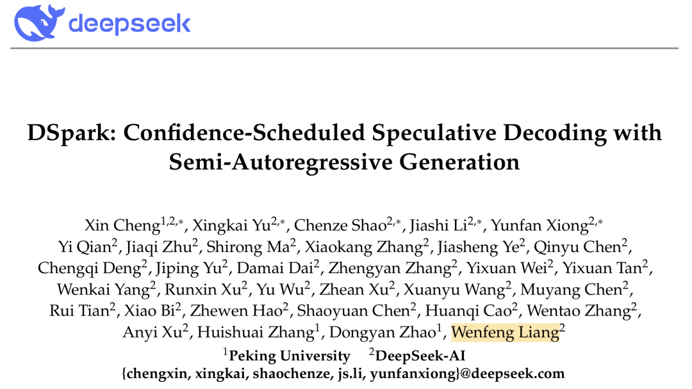
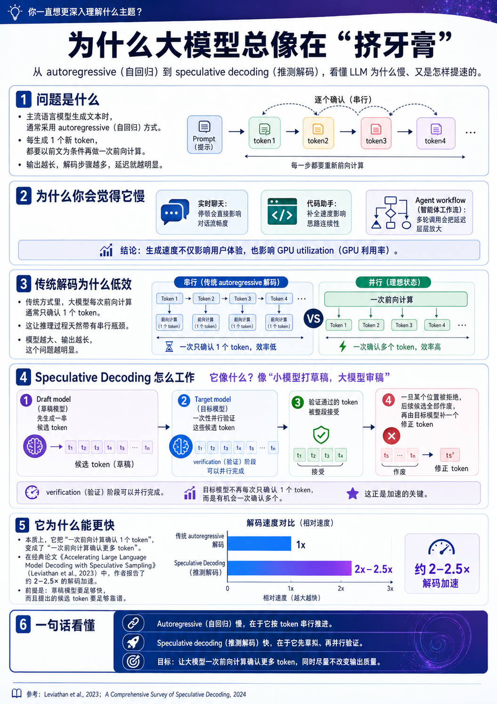
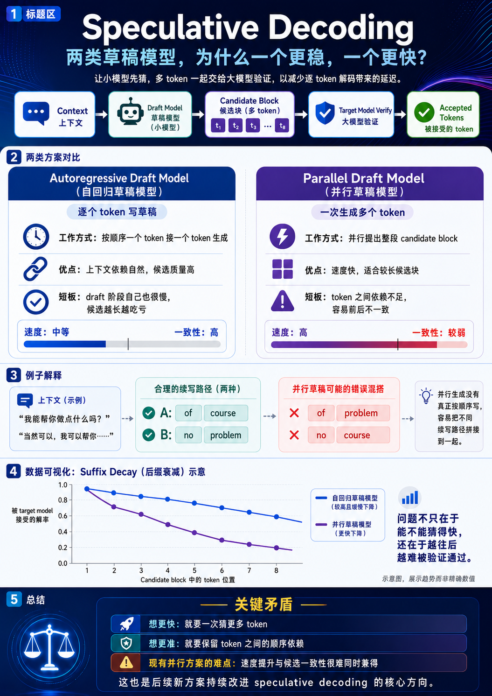
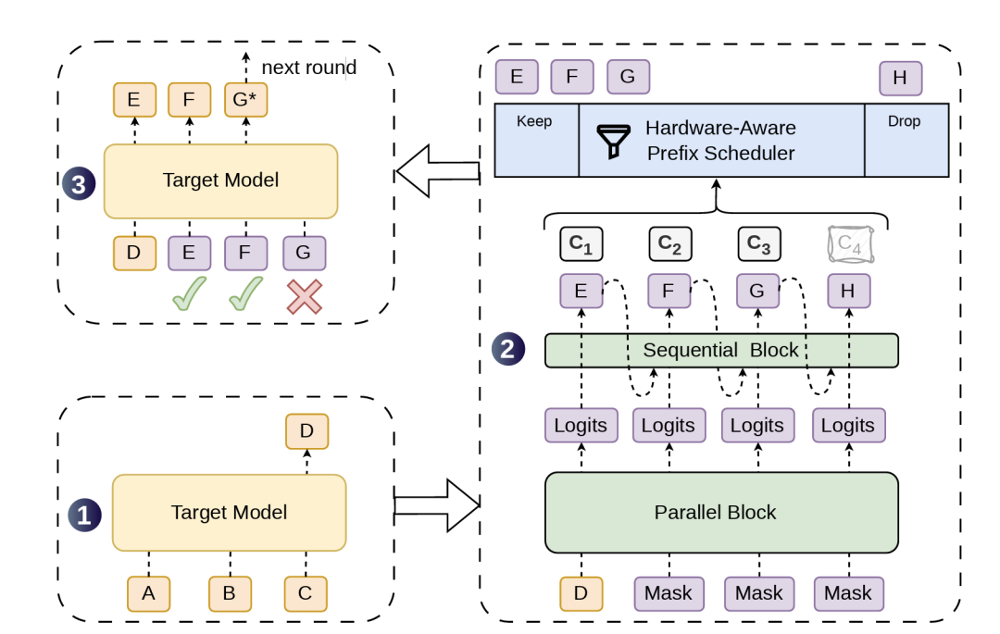
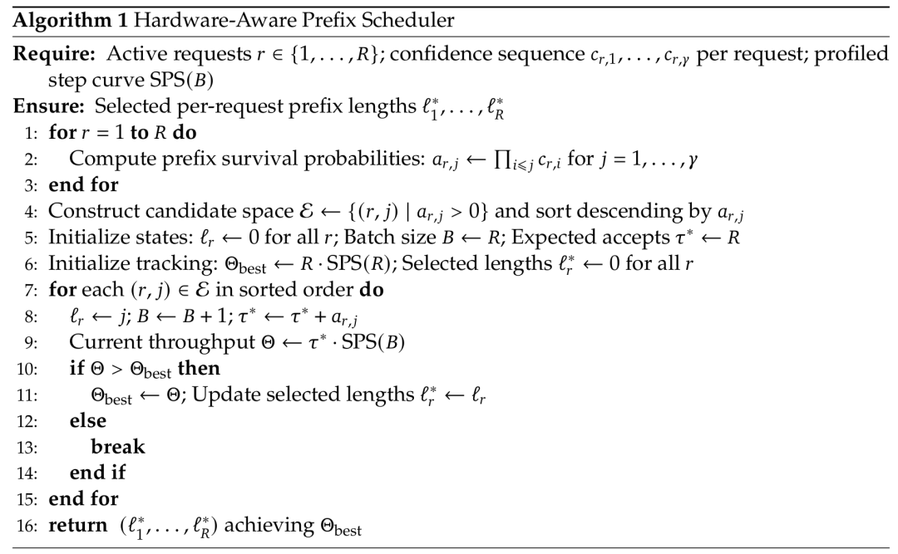
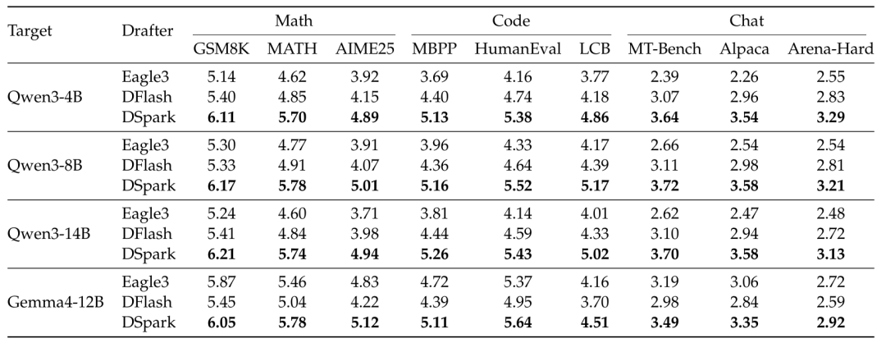
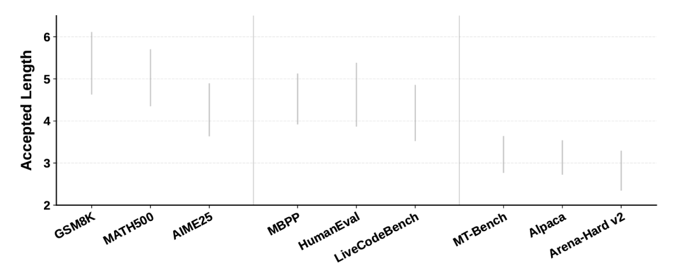
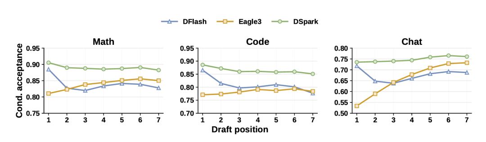

## 最近忙着大规模招兵买马的 DeepSeek，也始终没有忘记开源这条主线。

今天，DeepSeek 与北京大学团队联合发布论文《DSpark: Confidence-Scheduled Speculative Decoding with Semi-Autoregressive Generation》，

## 提出了一套新的大模型推理加速框架 DSpark。

技术报告 🔗https://github.com/deepseek-ai/DeepSpec/blob/main/DSpark_paper.pdf论文披露，DSpark 已经进入 DeepSeek-V4-Flash preview 和 DeepSeek-V4-Pro preview 的生产服务系统，并替代此前的 MTP-1 方案。在线上真实用户流量中，在系统总吞吐水平相同的情况下，

## DSpark 将 DeepSeek-V4-Flash 的单用户生成速度提升了 60% 至 85%，将 DeepSeek-V4-Pro 的单用户生成速度提升了 57% 至 78%。

速度飙成这样，DeepSeek 究竟给自家的推理引擎喂了什么灵丹妙药？当然，本文难免有些枯燥，感兴趣的朋友不妨耐心阅读。

## 天下苦 AI 「蹦字」久矣

为什么每次等到大模型的回复总感觉在「挤牙膏」？原因并不复杂。主流语言模型生成文本时，基本采用 autoregressive（自回归）方式。模型每生成一个新 token，都需要做一次以前文为条件的前向计算，因此输出越长，解码步骤越多，延迟也越容易累积。对于实时聊天、多轮 Agent workflow（智能体工作流）、代码助手这类高交互场景，生成速度会直接影响用户体验，也会影响 GPU 利用率。speculative decoding（推测解码）就是为了解决这个问题。

为方便阅读，图片由 AI 生成，仅供参考

## 它的思路像是让一个「小模型」先写草稿，再让「大模型」快速审稿。系统先用一个轻量级 draft model（草稿模型）生成一串候选 token，再由真正负责输出质量的 target model（目标模型）一次性验证这些候选 token。

通过验证的 token 会被接受；一旦某个位置被拒绝，后面的候选 token 全部作废，target model 再生成一个修正 token。由于 verification（验证）阶段可以并行完成，speculative decoding 可以在不改变 target model 输出分布的前提下提高生成速度。更直观地说，它想让大模型一次前向计算确认更多 token，而不是每次只确认一个。speculative decoding 已经是大模型推理加速的重要方向，但已有方案仍有明显限制。

## 第一类方案是 autoregressive draft model（自回归草稿模型）。

它像正常语言模型一样，一个 token 接一个 token 地生成候选内容。优点是前后关系更自然，候选质量较高；缺点也明显：draft model 自己写草稿时也要一步一步来，候选 token 越多，draft 阶段越慢。

## 第二类方案是 parallel draft model（并行草稿模型）。

它可以一次性生成多个候选 token，速度很快，也更适合生成较长的 candidate block（候选块）。问题在于，candidate block 内部的 token 之间缺少足够的依赖关系。

论文里举了一个很直观的例子。模型面对某个上下文时，可能同时存在 「of course」 和 「no problem」 两种合理续写。parallel draft model 因为没有真正按顺序生成，很容易把两条续写路径混在一起，生成 「of problem」 或 「no course」 这种前后不一致的组合。结果就是，parallel draft model 开头几个 token 往往还不错，但越往后，候选 token 被 target model 接受的概率下降越快。论文把这种现象称为 suffix decay（后缀衰减）。更现实的问题发生在线上服务里。parallel draft model 很容易一次生成一长串候选 token，但在真实高并发服务中，把这些 token 全部送给 target model 验证，未必划算。数学、代码这类结构化任务，答案路径相对明确，候选 token 更容易被接受。开放式聊天不确定性更高，后面的 token 更容易被拒绝。系统空闲时，多验证几个 token 影响不大；系统繁忙时，验证那些大概率会被拒绝的 token，会占用 batch capacity（批处理容量），影响其他用户请求。换句话说，推测解码的问题已经不只在于能不能一次生成更多 token，还在于哪些 token 值得交给 target model 验证。

## DSpark 是怎么「既要又要」的

DSpark 的思路可以概括为两件事：

## 草稿要写得更像样，审稿要更会挑重点。

## 在生成侧，

DSpark 采用 semi-autoregressive architecture（半自回归架构）。它保留 parallel draft model 的主干，让大部分计算仍然一次完成；同时在输出端加入一个轻量级顺序模块，让后面的 token 能参考前面已经采样出来的 token。可以把它理解成：前面用并行方式快速铺开候选，后面再用一个很轻的顺序模块检查相邻 token 的衔接关系。

论文默认使用 Markov head，也测试了 RNN head。Markov head 主要建模相邻 token 之间的转移关系，计算成本低，部署更方便；RNN head 能保留更长的块内历史，但收益有限，复杂度更高。因此，论文把 Markov head 作为默认方案。这种架构的目标很明确：

## 保留 parallel draft model 的速度，同时补上部分 autoregressive draft model 的前后连贯性。

## 在验证侧，

DSpark 引入 confidence-scheduled verification（基于置信度调度的验证）。系统会给每个候选位置预测一个 confidence score（置信度分数）。这个分数表示：在前面的 token 都已经被 target model 接受的情况下，当前位置继续被接受的概率有多高。

随后，hardware-aware prefix scheduler（硬件感知前缀调度器）会根据三个因素动态决定每个请求该验证多少 token：当前系统负载、每个候选位置的置信度、引擎在不同 batch size（批大小）下的 throughput curve（吞吐曲线）。因此，DSpark 不会机械地验证固定长度的 candidate block。系统资源宽松时，它可以验证更长的 prefix（前缀），让一次 target model 前向计算尽量产出更多有效 token。系统负载升高时，它会缩短低置信度请求的验证长度，减少对 target model batch capacity 的占用。

## 这也是 DSpark 相比传统推测解码更接近真实生产环境的地方：它不只追求单次生成更多候选 token，也会根据系统负载调整验证预算。

## 大模型的尽头，是复杂的系统工程问题

离线实验部分，论文在 Qwen3-4B、Qwen3-8B、Qwen3-14B 和 Gemma4-12B 四个 target model 上测试 DSpark，并与两类代表方案对比：autoregressive draft model Eagle3，以及 parallel draft model DFlash。评测覆盖数学推理、代码生成和日常聊天三个场景，包含 GSM8K、MATH500、AIME25、MBPP、HumanEval、Live-CodeBench、MT-Bench、Alpaca 和 Arena-Hard 等 benchmark（基准测试）。结果显示，在 Qwen3-4B、Qwen3-8B 和 Qwen3-14B 上，DSpark 相比 Eagle3 的macro-average accepted length（宏平均接受长度）分别提升 30.9%、26.7% 和 30.0%；相比 DFlash 分别提升 16.3%、18.4% 和 18.3%。在 Gemma4-12B 上，DSpark 也保持领先。

accepted length 可以理解为每一轮 speculative decoding 中，平均有多少 token 能被 target model 接受。这个数字越高，说明 draft model 写出的草稿越能被大模型认可，推理加速空间也越大。论文还观察到，不同任务之间差异很大。以 Qwen3-4B 为例，DSpark 在数学任务上的平均 accepted length 为 5.57，在代码任务上为 5.12，在聊天任务上为 3.49。

数学和代码更结构化，续写路径更稳定；聊天更开放，模型可能有很多种合理回答方式。因此，同样长度的候选 token，在不同任务里的价值并不一样。固定 verification length（验证长度）会浪费一部分计算资源。更详细的实验解释了 DSpark 为什么行之有效。DFlash 这类 parallel draft model 在第一个候选 token 上表现很强，因为它可以用更深的网络一次性生成候选。但从第二个 token 往后，它缺少块内依赖，接受率下降更明显。Eagle3 这类 autoregressive draft model 在后段一致性上更好，因为它确实按顺序生成。但为了控制 draft 阶段延迟，它通常不能做得太深，因此第一个 token 的预测能力受限。

## DSpark 介于两者之间。第一个 token 继承 parallel draft model 的强预测能力，后面的 token 通过 sequential module 减少 suffix decay。

结构实验也支持这个判断。论文显示，2 层 DSpark 已经超过 5 层 DFlash，说明轻量级顺序建模比单纯增加并行层数更有效。

## 📚 专业词汇通俗解释（DSpark 大模型推理加速）

### Speculative Decoding（推测解码）
**一句话总结**：让"实习生先打草稿，专家再审稿"，避免大模型一个字一个字地"挤牙膏"。
**通俗类比**：就像你让一个实习生先写一份报告草稿（用小模型快速生成候选词），然后你作为专家直接检查哪些写得好就用、哪些改掉（用大模型并行验证）。这比你从头一个字一个字写要快得多。

### Autoregressive / 自回归
**一句话总结**：一句话接一句话地生成，每说一个字都要重新思考整句话。
**通俗类比**：就像你每次只能说一个字，说完后要把前面的所有话重新读一遍再说下一个字。效率低但质量稳定。
**技术含义**：LLM 每次生成一个 token 都需要做一次完整的前向计算（forward pass），输出越长延迟越高。

### Semi-Autoregressive / 半自回归
**一句话总结**：先一次性铺开一大片，再用一个小模块检查前后衔接。
**通俗类比**：先让实习生一口气写完一段草稿（并行生成），然后安排一个轻量级的校对员快速检查相邻句子是否连贯（顺序验证）。DSpark 的核心创新就是这个"半自动"模式。

### Suffix Decay / 后缀衰减
**一句话总结**：草稿模型越往后写的词越不靠谱，被专家打回的概率越大。
**通俗类比**：就像你让 AI 续写一句话，前几个词很通顺，但越往后越离谱（比如把"当然可以"和"没问题"混在一起变成"当以没问"）。这就是 parallel draft 模型缺乏前后依赖导致的。

### Confidence-Scheduled Verification / 基于置信度调度的验证
**一句话总结**：不是每次都验证同样长度的草稿，而是"有把握的多验证，没把握的少验证"。
**通俗类比**：老板审批文件时，对写得好的部分多看几页，写得差的部分直接打回重写。DSpark 会根据每个位置的置信度分数动态调整验证长度。

### Hardware-Aware Prefix Scheduler / 硬件感知前缀调度器
**一句话总结**：根据服务器忙不忙、模型信不自信来动态决定每次验证多少词。

### Accepted Length / 接受长度
**一句话总结**：平均每次能让大模型"点头通过"多少个候选词。数字越高，加速效果越好。
**通俗类比**：实习生写 10 句话，专家认可了 7 句，接受长度就是 7。

### Markov Head / 马尔可夫头
**一句话总结**：只看相邻两个词的关系，计算量小，部署方便。
**通俗类比**：就像检查"我喜欢"后面接"苹果"是否通顺，只看相邻词的搭配，不管前面的长距离上下文。

### Target Model vs Draft Model 对照

| 角色 | 模型类型 | 速度 | 质量 | 职责 |
|------|---------|------|------|------|
| Draft Model | 轻量级小模型 | 快 | 一般 | 生成候选 token |
| Target Model | 大型高质量模型 | 慢 | 高 | 验证候选 token |

### DSpark vs Eagle3 vs DFlash 对比

| 方案 | 草稿方式 | 优势 | 劣势 |
|------|---------|------|------|
| DSpark | 半自回归（并行+顺序） | 前后兼顾，接受率高 | 架构稍复杂 |
| Eagle3 | 自回归（逐词） | 后段一致性好 | 第一阶段慢 |
| DFlash | 并行 | 第一阶段快 | 后缀衰减严重 |
