# 变分自编码器（VAE）全家桶：从 Autoencoder 到 VQ-VAE-2

> **来源**：微信公众号「AI生成未来」| 作者：APlayBoy | 原文：[知乎专栏](https://zhuanlan.zhihu.com/p/682709613)
> 
> **编者按**：随着 Stable Diffusion 和 Sora 等技术在生成图像和视频的质量与帧率上取得显著提升，能够在一个低维度的压缩空间进行计算变得越发重要。这种方法不仅大幅度提升了处理效率，还保证了生成内容的高质量。正是在这种背景下，变分自编码器（VAE）及其相关模型的重要性日益凸显。

随着Stable Diffusion和Sora等技术在生成图像和视频的质量与帧率上取得显著提升，能够在一个低维度的压缩空间进行计算变得越发重要。这种方法不仅大幅度提升了处理效率，还保证了生成内容的高质量。正是在这种背景下，变分自编码器（VAE）及其相关模型的重要性日益凸显。—— AI Dreams, APlayBoy Teams!

## 1 引言

在当今深度学习和人工智能的飞速发展中，自编码器（AE）和变分自编码器（VAE）等模型已成为理解和生成复杂数据结构的关键工具。这些模型不仅推动了我们对高维数据表示的深入理解，还在多个领域，如图像处理、自然语言处理和声音合成等方面发挥着至关重要的作用。

特别地，最近在图像生成领域引起广泛关注的Stable Diffusion，以及在视频处理领域的Sora，都严重依赖于VAE模型。这些先进技术能够将图片或视频压缩到潜在空间中，从而在这些潜在空间上处理数据，大大提高了效率。通过在潜在空间进行操作，这些系统能够以前所未有的速度和灵活性生成高质量的图像和视频内容。

在这篇博客中，我们将深入探讨自编码器的世界，介绍其基本原理、不同类型及其在实际问题中的应用。我们将从基础的符号和术语讲起，帮助读者理解后续内容。紧接着，我们会深入分析各种类型的自编码器，从基本的Autoencoder到Denoising Autoencoder、Sparse Autoencoder和Contractive Autoencoder等。

进一步，我们将转向VAE及其扩展。我们会详细探讨标准VAE以及通过各种手段扩展VAE的多种方法，如Conditional VAE、Beta-VAE、VQ-VAE和VQ-VAE-2等。这些模型在处理图像和声音数据方面展现出了卓越的性能。此外，我们还将介绍专门处理时间序列数据的TD-VAE，以及其他一些VAE的变体。

通过本博客，读者不仅能全面了解自编码器及其变种的知识，还能洞察这些模型在现代AI技术中的重要地位和应用潜力。无论您是数据科学家、研究人员还是对深度学习充满好奇的初学者，都能从这篇博客中获得宝贵的知识和灵感。

## 2 符号术语

### 2.1 AE中的符号

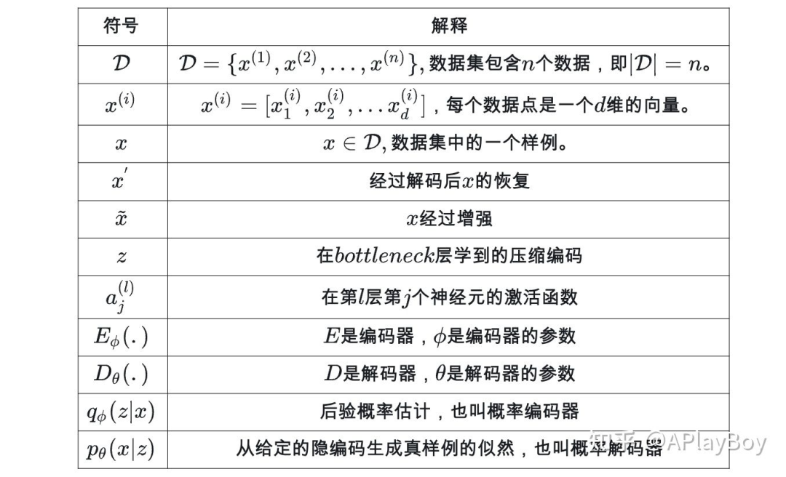latex手机显示有问题，这里做了截图
*latex手机显示有问题，这里做了截图*

### 2.2 VAE中的符号

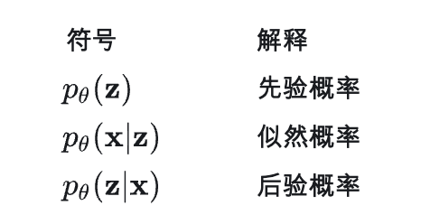

## 3 基础自编码器

### 3.1 Autoencoder

Autoencoder是一种自监督的神经网络，用于学习数据的高效表示。其主要目标是通过压缩数据并尝试重构它来捕捉数据的关键特征。

Autoencoder，即自编码器，是一种以无监督学习方式工作的神经网络。它的核心目标是通过学习一个恒等解码函数，来重构原始输入数据。在这个过程中，Autoencoder不仅实现了数据的重构，还对数据进行了压缩处理，揭示了数据的更有效的压缩表示。

两大部分

- 编码器网络（Encoder）：这一部分将原始的高维输入转换为低维的隐编码。通常，输入的维度大于输出的维度，实现了对数据的压缩和特征提取。数学上，编码器可以表示为，其中是编码函数，是其参数。
- 解码器网络（Decoder）：解码器的任务是从隐编码中恢复出原始数据。其结构可能包含逐渐扩展的输出层。解码器可以表示为，其中是解码函数，是其参数。

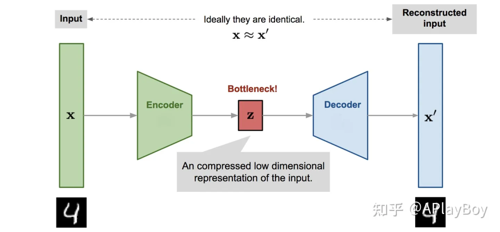Autoencoder模型架构
*Autoencoder模型架构*
实质

Encoder网络类似于我们使用主成分分析（PCA）或矩阵分解（MF）进行数据降维的过程。此外，Autoencoder对于从隐编码中恢复数据的过程进行了特别的优化。一个良好的中间表示（即隐编码）不仅能够有效捕捉数据的潜在变量，还对数据解压缩过程有所助益。

损失函数

在学习过程中，我们的目标是使得重构后的数据尽可能地接近原始输入，即。通过这种方式，同时学习编码器和解码器的参数和。这实际上等同于学习一个恒等函数。为了量化重构数据和原始数据之间的差异，我们可以使用不同的方法，例如当激活函数为Sigmoid时使用交叉熵，或者直接采用均方误差（MSE）损失函数为:

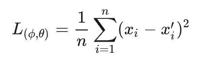应用：

- 数据降维：类似于PCA，但能捕捉非线性关系。
- 特征提取：从复杂数据中提取有用的特征。
- 数据去噪：学习去除输入数据中的噪声。
- 生成模型：生成与训练数据相似的新数据。

### 3.2 Denoising Autoencoder

Denoising Autoencoder是Autoencoder的一个变体，专门用于数据去噪和更鲁棒的特征学习。它通过在输入数据中引入噪声，然后训练网络恢复原始未受扰动的数据。这个过程迫使网络学习更为鲁棒的数据表示，忽略随机噪声，从而提高模型对输入数据中噪声或缺失值的容忍度。

由于Autoencoder（自编码器）学习的是恒等函数，当网络的参数数量超过数据本身的复杂度时，存在过拟合的风险。为了避免这一问题并提高模型的鲁棒性，这种改进方法是通过在输入向量中加入随机噪声或遮盖某些值来扰动输入，即，然后使用训练模型恢复出原始未扰动的输入。

在数学上，这可以表示为，其中、损失函数为

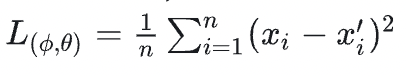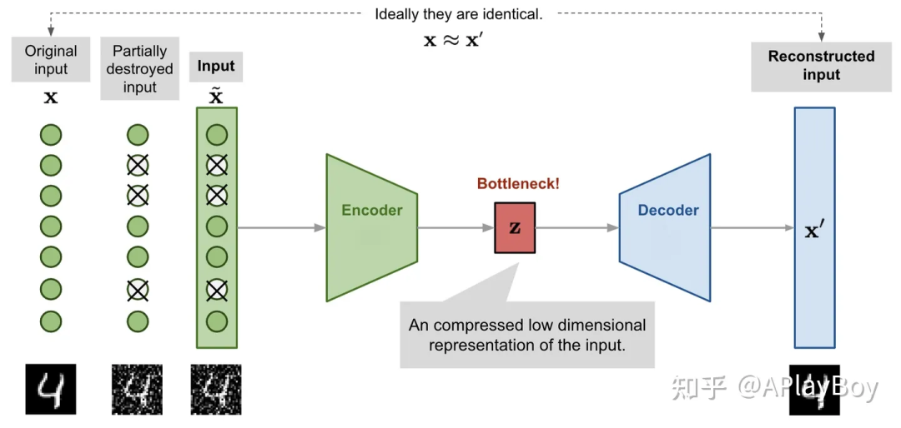Denoising Autoencode模型框架
*Denoising Autoencode模型框架*
人们即使在视觉部分被遮挡或损坏的情况下，也能轻易地识别出场景和物体。Denoising Autoencoder的设计灵感正来源于这一人类视觉的特性。通过修复输入的损坏部分，Denoising Autoencoder能够发现并捕获输入空间中的关系，进而推断出缺失的部分。

对于那些具有高冗余度的高维输入，例如图像，该模型能够依据多个输入维度的组合信息来恢复去噪后的版本，而不是对单个维度产生过拟合。这为学习更加鲁棒的隐含表征奠定了坚实的基础。引入的噪声是通过随机映射控制的，而不局限于特定类型的扰动过程（如掩蔽噪声、高斯噪声、椒盐噪声等），这种扰动过程可以自然地融入先验知识。

在原始DAE论文的实验中，通过在输入维度上随机选择固定比例的维度，然后将它们的值强制置为来添加噪声。这种方法听起来有点类似于dropout，但值得注意的是，Denoising Autoencoder最早于2008年提出，比dropout的论文早了整整4年。

应用：

- 图像去噪：用于清理图像和视频中的视觉噪声。
- 数据预处理：改善其他机器学习模型处理噪声数据的能力。
- 提高模型鲁棒性：对于自然语言处理和声音识别等领域的数据清洗。
- 特征提取：从噪声数据中提取关键特征，用于后续的数据分析或机器学习任务。

### 3.3 Sparse Autoencoder

Sparse Autoencoder（稀疏自编码器）是自编码器的一个变体，它在隐藏层上应用“稀疏”约束以防止过拟合并增强模型的鲁棒性。该模型通过限制隐藏层中同时激活的神经元数量，强制使大部分神经元大多数时间处于非激活状态。

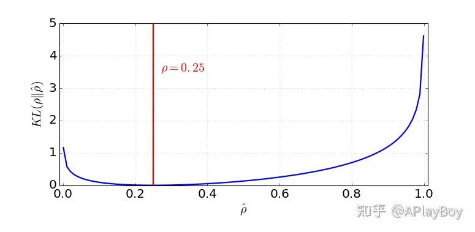均值为0.25的伯努利分布与均值在0-1之间的伯努利分布的KL散度
*均值为0.25的伯努利分布与均值在0-1之间的伯努利分布的KL散度*
稀疏性约束：

- 在Sparse Autoencoder中，隐藏层神经元的激活受到严格限制。常用的激活函数如、、和，在激活值接近时神经元激活，接近时则处于非激活状态。

数学表示：

- 设网络的第j隐藏层有k个神经元，第i个神经元的激活函数定义为，其中。
- 稀疏参数（一般较小，如0.05）代表神经元激活的预期比例。
- 神经元的实际平均激活度表示为，期望接近于。

KL散度和损失函数：

- 通过在损失函数中加入KL散度惩罚项实现稀疏性，KL散度计算两个伯努利分布之间的差异，一个均值为，另一个均值为。
- 总损失函数，其中是重构误差，是稀疏正则化项的权重。
- KL散度部分可表示为。

K-Sparse Autoencoder：

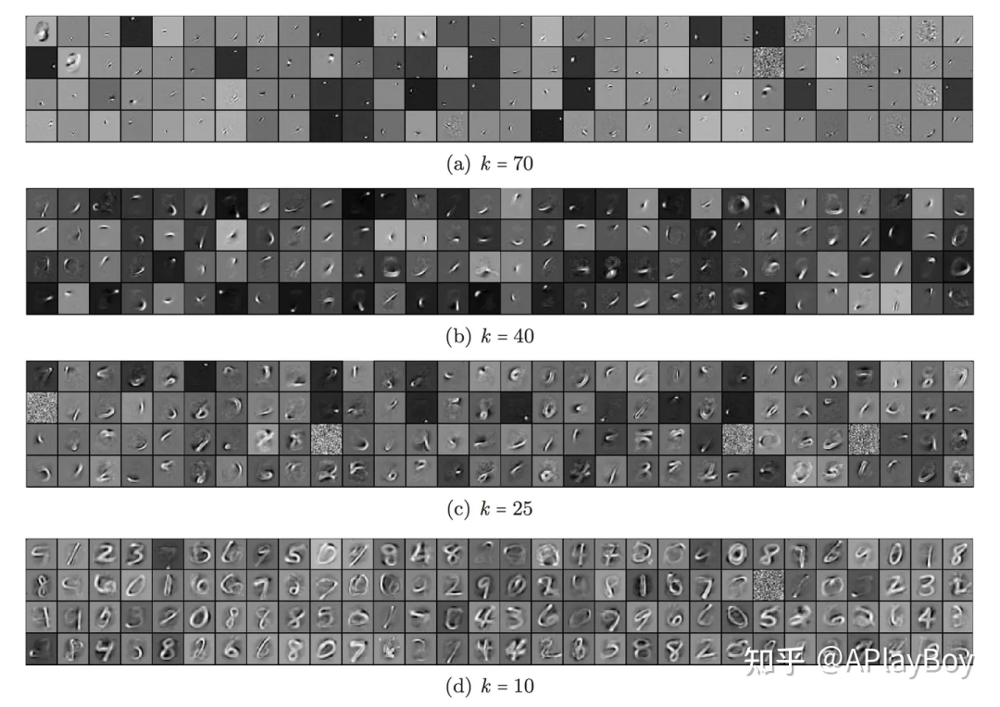从MNIST中用1000个隐藏单元学到的不同稀疏度k的滤波器
*从MNIST中用1000个隐藏单元学到的不同稀疏度k的滤波器*
- 在K-Sparse Autoencoder中（由Makhzani和Frey于2013年提出），稀疏性是通过在具有线性激活函数的瓶颈层中只保留最高的k个激活来实现的。
- 首先，通过编码器网络进行前馈运算以获取压缩的编码。对编码向量中的值进行排序，只保留最大的k个值，而其他神经元被设置为0。这也可以通过增加可调阈值的ReLU层来实现。
- 然后，我们得到一个稀疏化的编码。从这个稀疏化的编码计算输出和损失。
- 反向传播仅通过这k个被激活的隐藏单元进行，这进一步强化了模型的稀疏性。

应用

- 特征提取：在图像和文本处理中提取关键特征。
- 数据降维：有效降低数据维度，保留重要信息。
- 去噪：由于稀疏性，模型能够更加关注数据的主要特征，提高去噪效果。
- 数据预处理：作为其他机器学习模型的预处理步骤，改善数据可解释性和模型性能。

### 3.4 Contractive Autoencoder

Contractive Autoencoder（收缩自编码器）是一种自编码器，旨在通过学习鲁棒性更高的数据表示来提高模型性能。与K-Sparse Autoencoder类似，它通过在损失函数中加入额外的项来鼓励模型在被压缩的空间中学习更稳健的表示。

灵敏度惩罚：

- Contractive Autoencoder通过增加一个惩罚项来减少模型对输入的过度敏感性，从而提高对输入扰动的鲁棒性。
- 这种灵敏度是通过计算输入到编码器的Jacobian矩阵的Frobenius范数来衡量的，即

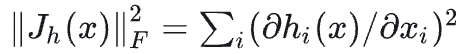其中是压缩编码的一个输出单位。

- 这个惩罚项实际上是对学习到的编码关于输入维度的偏导数的平方和。

应用

- 数据去噪：由于其对输入小扰动的鲁棒性，适用于去除数据中的噪声。
- 特征提取：提取对小变化不敏感的稳健特征，适用于图像识别、语音处理等领域。
- 数据预处理：作为机器学习流程中的预处理步骤，提高后续模型对数据的理解。

## 4 变分自编码器及其扩展

### 4.1 VAE

Variational Autoencoder（VAE），与前述的自编码器模型本质不同，是一种深度学习模型，紧密结合了贝叶斯网络的概念。VAE的核心特点在于，它不是将输入直接映射到一个固定的向量，而是将输入映射到一个概率分布上。这种方法使得VAE不仅能够进行数据重构，还能生成新的、与输入数据相似的数据。

在VAE中，输入数据被映射到一个潜在的隐向量的分布上，这个分布通常假设为正态分布，其参数由输入数据决定。因此，VAE的关键在于学习输入数据的概率分布特性，而不仅仅是确定性的映射关系。

原理

作者不是把输入映射成一个固定向量，而是把输入映射到一个分布上。记这种分布为，其中为参数，输入和隐编码向量的的关系可以定义为：为先验、为似然、为后验

假设我们知道分布的真实参数，为了生成一个和 一样的样例，我们做以下两步：首先，从先验分布中采样出一个。然后，从条件分布中生成。把最大化生成真实数据样例的可能性作为参数的优化：

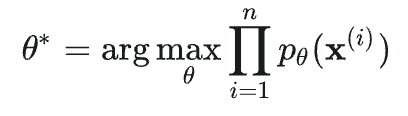我们取对数把累乘换成累加的形式：

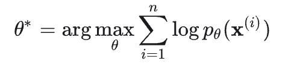现在，当我们更新方程，去优化编码器和解码器的过程，会涉及到隐编码向量:

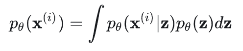是难以直接计算的，因为找到的所有值，然后把它们加起来的代价很大，也不太可能。为了缩小值空间以便更快的搜索，作者引入一个新的近似函数，来输出给定输入的可能编码，其中是参数。

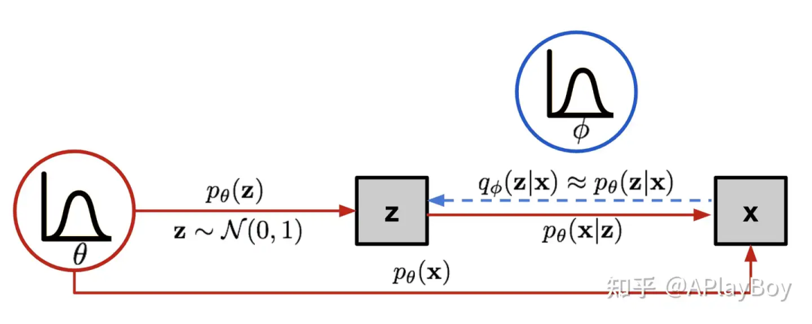Variational Autoencoder中的贝叶斯网络模型，实现是生成过程，虚线是难处理的后验p(z|x)的近似估计q(z|x)
*Variational Autoencoder中的贝叶斯网络模型，实现是生成过程，虚线是难处理的后验p(z|x)的近似估计q(z|x)*
现在这个结构看起来比较像Autoencoder了，首先，条件概率定义为生成模型，和上面的解码器类似,也是概率解码器。然后，近似函数是概率编码器，和上面的一样，都是编码器。

Loss Function: ELBO

后验估计应该和真实的和接近，我们可以用 散度来量化这两个分布之间的距离。散度表示用X表示Y时的信息丢失量，在这里我们要通过来最小化。但是为什么是用而不是？论文中对Bayesian Variational方法做了解释，简单说：

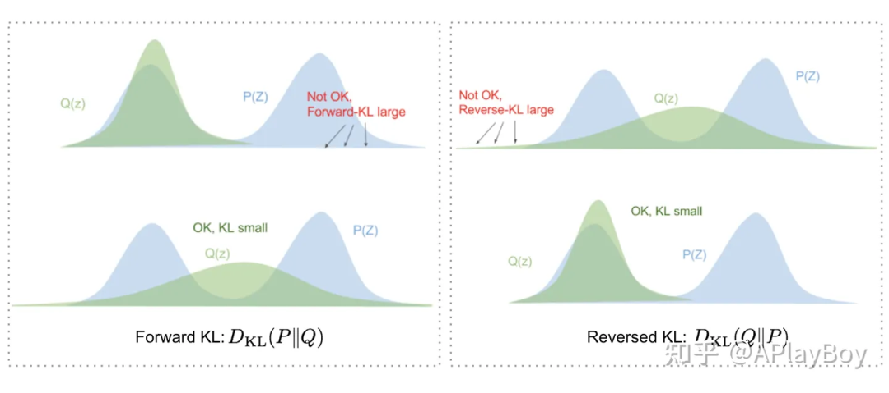图 7 匹配两个分布的时候，前后和后向KL散度功能不同
*图 7 匹配两个分布的时候，前后和后向KL散度功能不同*
- 前向KL散度会高估的信息；
- 后向KL散度$$D_KL}(Qlog \frac {Q(z)} {P(z)}会低估P(z)$的信息。

现在我们展开等式：

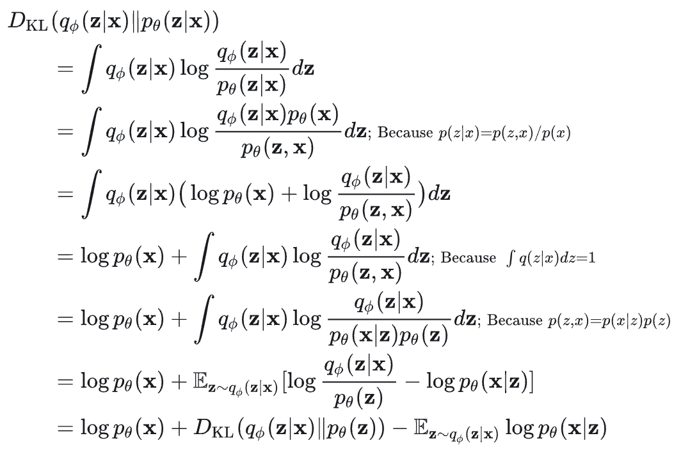所以有：

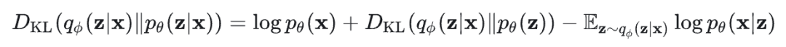重新排列一下等式得：

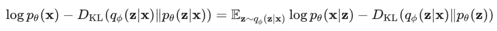等式的左边是我们学习真实分布的时候想要最大后的项，我们要最大化真实数据的对数似然，即最大化，同时最小化真实后验和近似分布之间的散度。所以上面等式的负值就是损失函数：

在Variational Bayesian方法中，这个损失函数被认为是变分下界，因为散度的值非负，所以是的下界，即：

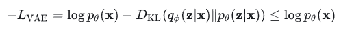因此，通过最小化损失，我们可以最大化生成真实数据样本的概率的下界。

重参数技巧

损失函数中的期望项和有关，采样是个随机过程，所以不能反向传播梯度。为了可训，隐入了重参数方法，随机变量由决定，其中是一个的辅助随机独立变量，转移函数以为参数，同时加入生成。

例如，一个的常见形式是有对角协方差结构的多元高斯分布：

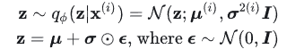其中表示点乘。

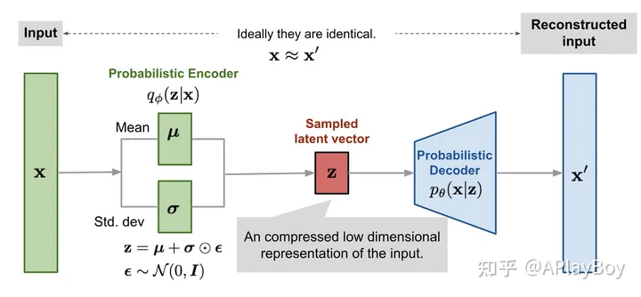图 8：让样本z的抽样可训练的重参数方法
*图 8：让样本z的抽样可训练的重参数方法*
重参数的方法也能用于其他的分布，不仅仅限于高斯分布，在多元高斯分布，我们使用了重参数方法，通过学习分布的均值 和方差，让模型可训练，并且在随机变量中仍然具有随机性。

图 9：多元高斯分布的variational autoencoder模型
*图 9：多元高斯分布的variational autoencoder模型*
应用

- 数据生成：VAE在生成新数据方面表现出色，尤其是在图像和文本数据生成中。
- 特征学习：通过学习输入数据的分布特性，VAE可以用于数据的非线性降维和特征提取。
- 数据去噪：VAE能够从噪声数据中学习到干净的数据分布，因此适用于数据去噪任务。

### 4.2 Conditional VAE

Conditional Variational Autoencoder（CVAE）是Variational Autoencoder（VAE）的一种扩展，它通过引入额外的条件变量来控制生成过程。CVAE能够根据给定的条件信息生成特定类型的数据，使得生成的数据不仅多样化且更具针对性。

引入条件变量：

- 在CVAE中，条件变量被引入到编码器和解码器中，这可以是类标签、部分数据或任何其他形式的辅助信息。
- 编码器和解码器的结构修改为考虑这个额外的条件变量。

编码器：

- 编码器的任务是将输入和条件映射到潜在空间的分布参数上。具体来说，编码器输出潜在空间的均值和方差，这两者都是条件和输入的函数。
- 编码器的输出可以表示为。

解码器：

- 解码器从潜在空间中采样得到的隐向量，再结合条件来重构输入。
- 解码器的输出是条件和采样的隐向量的函数。

损失函数：

- CVAE的损失函数包含两部分：重构损失和KL散度。
- 重构损失衡量重构数据和原始数据之间的差异。
- KL散度惩罚项衡量编码器输出的潜在分布与先验分布之间的差异。
- 损失函数可以表示为：

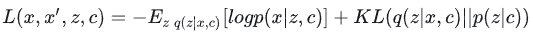应用

- 有条件的数据生成：根据特定的条件生成符合该条件的数据，如在给定类别下生成图片或文本。
- 风格迁移：在保持某些特性（如风格）不变的情况下，改变数据的其他特性。
- 数据增强：生成具有特定特征的新数据，用于增强现有数据集。

### 4.3 Beta-VAE

Beta-VAE（β-VAE）是Variational Autoencoder（VAE）的一个变体，由Higgins et al. 在2017年提出。其核心目标是发现解耦或分解的潜在因子。解耦表示具有良好的可解释性，并且易于泛化到多种任务。例如，在人脸图像生成中，模型可能分别捕捉到微笑、肤色、发色、发长、情绪、是否佩戴眼镜等相对独立的因素。

优化目标：

Beta-VAE的目标是最大化生成真实数据的概率，同时使真实和估计的后验分布之间的距离保持在较小的常数以下。这可以表示为以下优化问题：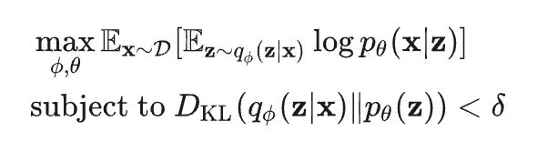

Lagrangian 方法：

- 使用Lagrangian乘数来解决这个带有不等式约束的优化问题，转化为Lagrangian函数的最大化问题：

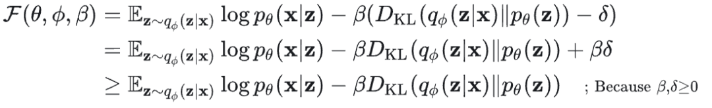损失函数：

Beta-VAE的损失函数定义为：

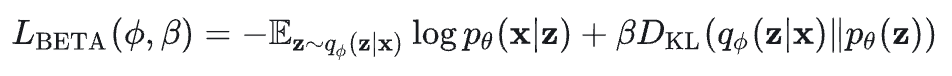- 这里的Lagrangian乘数被视为一个超参数。

的作用：

- 当时，Beta-VAE与标准VAE相同。
- 当时，Beta-VAE对潜在瓶颈的约束更强，限制了的表示能力。较高的值鼓励更高效的潜在编码，并进一步促进解耦。但同时，较高的值可能会在重构质量和解耦程度之间产生权衡。

应用

- 解耦特征学习：用于学习解耦的特征表示，特别适用于那些需要高度解释性和可操控性的生成任务。
- 数据生成：在控制生成数据的特定特征方面表现出色，如在控制条件下生成图像。
- 特征表示：提供可解释性强的特征表示，有助于理解和可视化复杂数据集。

### 4.4 VQ-VAE

VQ-VAE（Vector Quantised-Variational AutoEncoder），由van den Oord等人于2017年提出，是一种结合了变分自编码器和向量量化技术的模型。这种模型特别适用于处理自然语言处理、语音识别等任务，因为这些任务中的数据往往更适合用离散而非连续的表示。VQ-VAE的核心创新在于其潜在空间的离散化，这种离散化使得模型能够有效地处理和生成高度结构化的数据。

与传统的VAE相比，VQ-VAE在处理某些类型的数据时更为自然和高效，特别是在需要将输入数据映射到有限的离散空间时。这种离散的表示方式为复杂数据模式的学习提供了新的可能性。

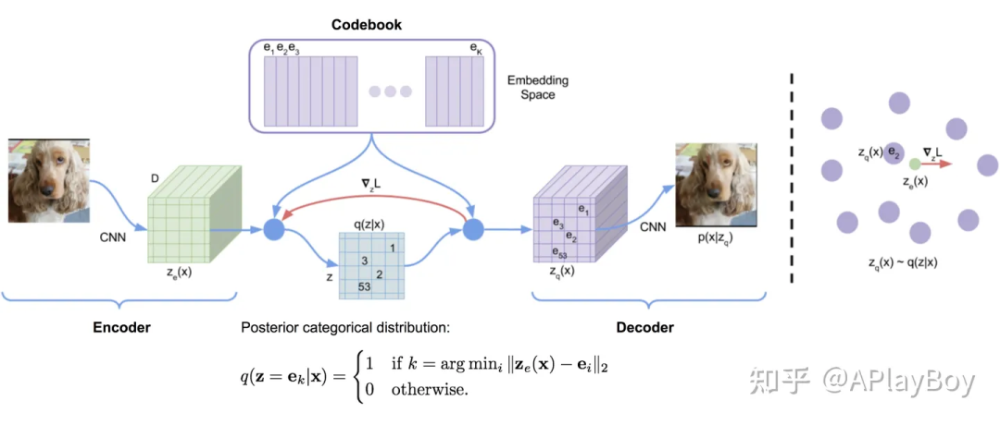VQ-VAE架构图
*VQ-VAE架构图*
向量量化（VQ）过程：

- VQ-VAE利用向量量化的方法将高维输入数据映射到有限的编码向量集合中，类似于K-最近邻（KNN）算法。这个过程将维的输入向量映射到一个有限的“编码”向量集合中。
- 潜在嵌入空间定义为，其中是潜在变量类别的数量，是嵌入大小。每个嵌入向量代表一个codebook。

编码器输出与量化：

编码器输出经过最近邻查找过程，以找到与之距离最近的嵌入向量

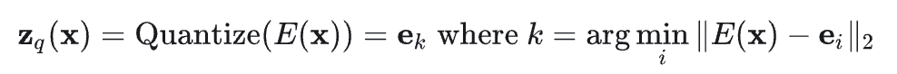梯度传播：

- 由于在离散空间上不可微分，因此从解码器输入的梯度被复制到编码器输出。

损失函数：VQ-VAE的损失函数包括三个部分：重构损失、VQ损失和承诺损失：

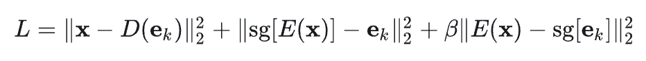- 其中是 stop gradient 操作符。

潜入向量更新：

- codebook中的嵌入向量通过指数移动平均（EMA）更新。

应用

- 数据生成：在语音、图像和视频领域的数据生成。
- 特征表示：为复杂数据提供离散的特征表示。

### 4.5 VQ-VAE-2

VQ-VAE-2，由Ali Razavi等人于2019年提出，是VQ-VAE的升级版。它引入了一个层次化的结构，旨在更细致地捕捉数据中的局部和全局信息。通过这种层次化设计，VQ-VAE-2能够更有效地捕获数据的多尺度特性，从而生成更高质量的图像。

这个模型的一个显著特点是，它结合了自回归模型和自注意力机制，进一步增强了其在复杂数据生成任务中的性能。VQ-VAE-2在图像生成领域表现出了特别的实力，尤其是在细节表现和多样性上，展现了显著的提升。

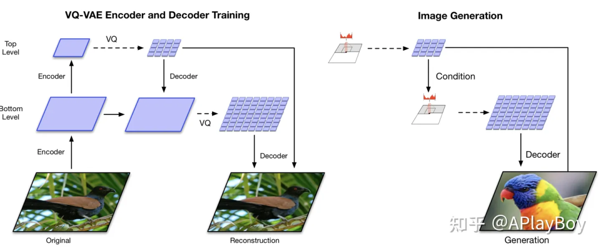分层VQ-VAE体系结构与多级图像生成。
*分层VQ-VAE体系结构与多级图像生成。*
层次化结构：

- VQ-VAE-2使用两级层次化结构，旨在分别捕获数据的局部模式（如纹理）和全局信息（如对象形状）。

训练过程：

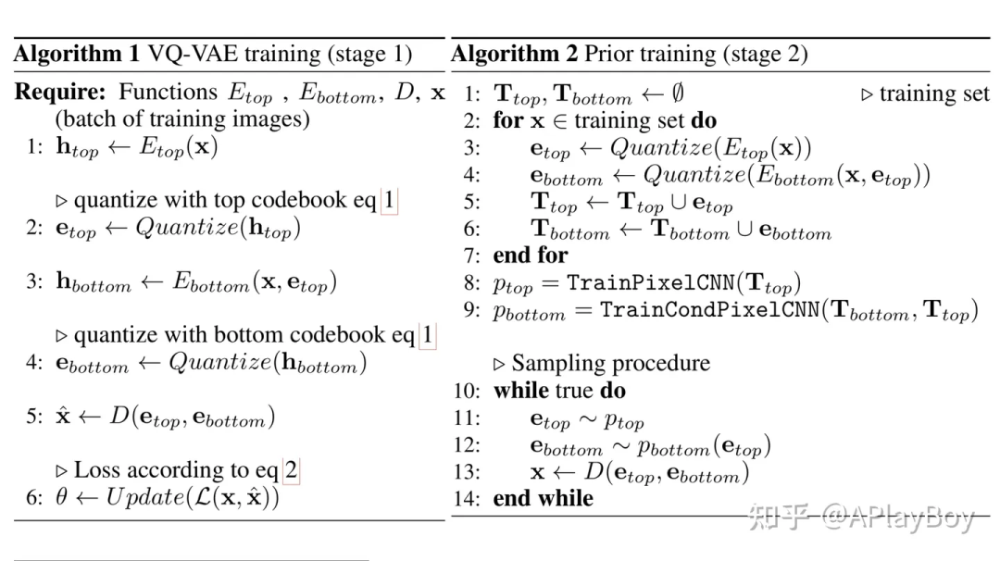vq-vee-2算法流程
*vq-vee-2算法流程*
- 第一阶段，训练层次化VQ-VAE，底层较大codebook的训练依赖于顶层较小codebook，使得底层不必从头开始学习所有信息。
- 第二阶段，学习潜在离散codebook上的先验分布，以便从中采样并生成图像。使用带自注意力机制的自回归模型来捕获这个先验分布。

应用：

- VQ-VAE-2在图像生成、特征提取等方面显示出卓越的性能，特别是在生成高质量图像方面。

### 4.6 TD-VAE（时序差分VAE）

TD-VAE（Temporal Difference VAE），由Gregor等人于2019年提出，是一种专门为处理序列数据设计的变分自编码器。它结合了状态空间模型和时间差分学习的理念，以处理具有时间依赖性的复杂数据序列。

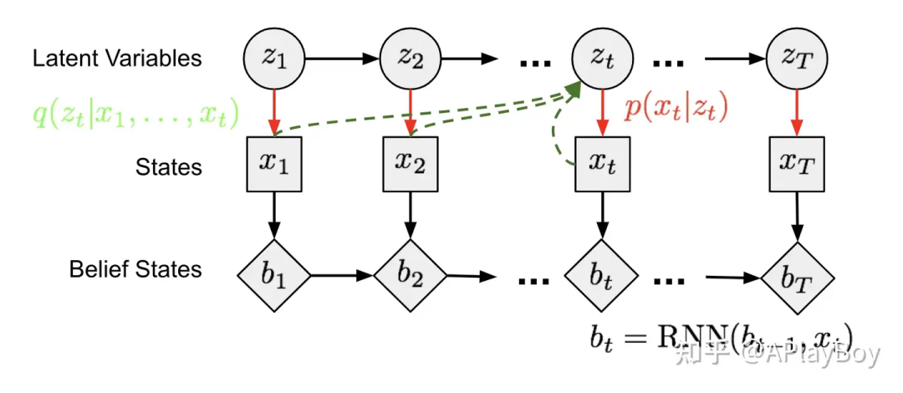作为马尔可夫链模型的状态空间模型
*作为马尔可夫链模型的状态空间模型*
- 状态空间模型：在TD-VAE中，一系列未观测的隐藏状态决定了观测状态。每个时间步的Markov链模型可以被训练来近似不可解的后验。
- 信念状态：TD-VAE旨在学习对过去状态的编码，以预测未来，称为“信念状态” 。这允许模型写出未来状态分布的条件形式。
- 跳跃预测：TD-VAE的一个关键功能是根据迄今为止收集的所有信息进行跳跃预测，即预测未来几步的状态。

方差下界：

- TD-VAE利用变分下界来建模状态的分布，这是一个关于所有过去状态和两个潜在变量和的条件概率函数。
方差下界可表示为：

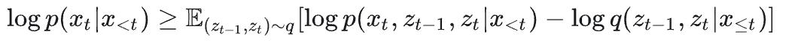TD-VAE的目标函数：TD-VAE的最终目标是最大化在两个不同时间戳上的序列ELBO：

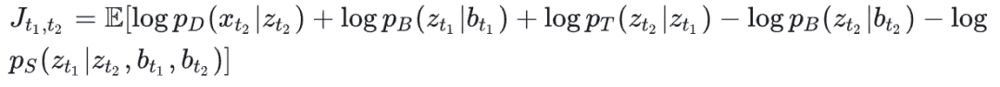TD-VAE通过其独特的时间差分框架和状态空间模型，为处理和预测序列数据提供了一个强大的工具。它在捕捉时间序列数据的复杂动态方面表现出色，特别是在需要预测未来状态的任务中。

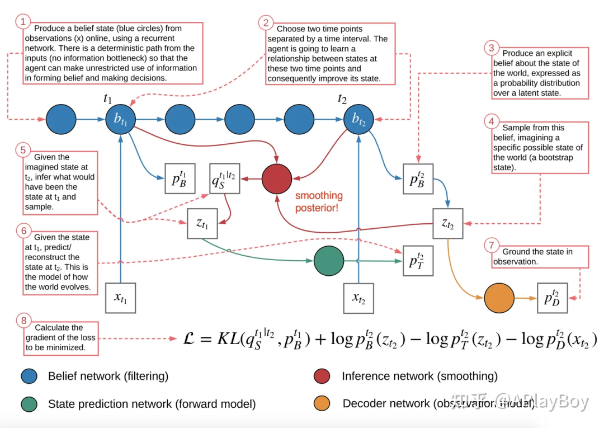TD-VAE架构
*TD-VAE架构*
应用

- 时间序列预测：在金融市场分析、天气预报、股价预测等领域，TD-VAE能够有效地预测未来的状态或趋势。
- 机器学习中的序列决策：TD-VAE能够用于强化学习或其他需要考虑未来潜在结果的序列决策任务，如游戏玩法策略制定或自动驾驶系统。
- 生成模型：在视频生成、音频合成等领域，TD-VAE可以生成具有时间连贯性的序列数据。
- 异常检测：在监控系统、网络安全等领域，TD-VAE能够识别时间序列数据中的异常模式。
- 医疗领域：在患者健康监测和疾病预测中，TD-VAE可以帮助预测病情的发展趋势和可能的健康风险。

### 4.7 其它VAE

Adversarial Autoencoder（对抗自编码器）

- 概述：AAE是一种结合了变分自编码器（VAE）和生成对抗网络（GAN）的模型。它使用一个对抗网络部分来迫使潜在空间符合某个预定义的分布。
- 原理：在AAE中，编码器生成潜在表示，然后一个对抗网络部分被用来确保这些表示符合特定分布。这通过使得生成器（编码器）和鉴别器之间的对抗过程来实现。
- 应用：AAE在生成高质量、多样化的数据方面表现出色，尤其适合那些需要精确控制生成数据分布的任务。

Dynamic VAE（动态变分自编码器）

- 概述：Dynamic VAE是为处理时间序列数据而设计的，特别适用于那些数据中的动态变化对模型学习来说至关重要的场景。
- 原理：这种模型通过在潜在空间中建模时间依赖性，来捕捉序列数据中的动态特征。它可以理解为在传统VAE框架内加入了时间动态性的处理能力。
- 应用：在视频处理、音频序列分析以及其他需要理解和预测时间序列数据的领域中具有重要应用。

Seq2Seq VAE（序列到序列的VAE）

- 概述：Seq2Seq VAE是一种特别用于处理序列数据的VAE，适用于机器翻译、文本生成等领域。
- 原理：它包括一个将输入序列编码成潜在表示的编码器，以及一个将潜在表示解码回输出序列的解码器。
- 应用：在需要序列到序列转换的任务中特别有用，如自然语言处理中的文本生成和翻译。

Hierarchical VAE（分层VAE）

- 概述：在分层VAE中，潜在空间是分层的，允许模型在不同的层次上捕捉数据的特征。
- 原理：这种分层结构使得模型能够在更细粒度上学习数据的不同方面，例如在图像处理中，不同层可以捕捉不同程度的细节。
- 应用：适用于处理具有多层次结构的复杂数据，如大规模图像或文本数据。

Invariant VAE（不变VAE）

- 概述：Invariant VAE的目标是学习一个对某些变换（如旋转、缩放等）不变的潜在表示。
- 原理：通过在学习过程中引入特定的不变性，使得模型对输入数据的这些变化保持不敏感。
- 应用：在需要模型对输入数据的变化保持稳定性的应用中非常有用，例如在医学影像分析中。

Neural Process VAE（神经过程VAE）

- 概述：结合了神经过程（Neural Processes）和VAE的特点，旨在处理不确定性和复杂数据分布，特别适合于建模序列数据或函数。
- 原理：这种模型通过整合神经过程的灵活性和VAE的生成能力，能够更好地处理序列和结构化数据。
- 应用：适用于需要模型理解和生成复杂数据模式的场景，如序列预测、函数逼近等。

这些“其他VAE”各有特点，适用于不同的应用场景。它们代表了VAE领域的多样性和不断的创新，是理解和探索自编码器潜力的重要组成部分。在你的博客中介绍这些模型可以大大丰富内容，提供给读者更广泛的视角。

## 相关阅读

- 变分推断理解：一文搞懂变分推断（Variational inference）(https://zhuanlan.zhihu.com/p/682453554)
- VAE精读：VAE: Auto-Encoding Variational Bayes(https://zhuanlan.zhihu.com/p/627313458)
- VQ-VAE精读：VQ-VAE:Neural Discrete Representation Learning 全文解读(https://zhuanlan.zhihu.com/p/684456268)
- VQ-VAE-2精读：VQ-VAE-2:Generating Diverse High-Fidelity Images with VQ-VAE-2 全文解读(https://zhuanlan.zhihu.com/p/684523670)

## 结束语

随着我们对变分自编码器（VAE）的深入了解，我在想：能否通过在潜在空间中引入额外的限制或先验来更精确地控制或者修改解码结果呢？你觉得怎么样？看完之后有什么其它想法吗？欢迎留言、讨论。

最后，在本次VAE探索之旅的尾声，感谢每位朋友的陪伴，如果对您有帮助，就点个赞呗。您的点赞、关注是我持续分享的动力。我是 @APlayBoy，期待与您一起在AI的世界里不断成长！

请加小助理加入AIGC技术交流群

备注公司/学校+昵称+研究方向

 往期推荐 

超越ControlNet+IP-Adapter和FreeControl！Ctrl-X：可控文生图新框架
---

## 附录：专业词汇通俗解释

| 术语 | 通俗解释 | 生活中的类比 |
|------|---------|------------|
| **Autoencoder (自编码器)** | 一种神经网络，先把数据压缩成小表示，再试着从压缩版本还原出原始数据。压缩过程会学到数据的关键特征。 | 就像你把一本书的精华浓缩成几页笔记，然后仅凭这几页笔记能大致还原全书内容。 |
| **Encoder (编码器)** | 负责把高维输入压缩成低维隐编码的部分。 | 就像把一部 2 小时的电影压缩成 5 分钟的精华剪辑。 |
| **Decoder (解码器)** | 负责从隐编码恢复出原始数据的部分。 | 就像看着精华剪辑，试图还原整部电影。 |
| **Latent Space (潜在空间/隐空间)** | 数据被压缩后的低维表示空间。这里存放的是数据的"本质特征"而非"表面细节"。 | 就像人的 DNA 编码——用很小的信息量就能描述一个人的核心特征。 |
| **Denoising Autoencoder (去噪自编码器)** | 给输入加噪声（比如把图片涂花），然后让网络学着还原干净的原图。比标准自编码器更鲁棒。 | 就像你做听力考试时旁边有人大声聊天，你仍然能听清听力内容——你的大脑就是一个去噪编码器。 |
| **Sparse Autoencoder (稀疏自编码器)** | 强制让大部分隐藏层神经元不激活，只有少数神经元对每个输入产生响应。防止过拟合。 | 就像一家餐厅有 100 道菜，但你每次来只点 3-5 道——菜单虽然大，但你的选择是"稀疏"的。 |
| **Contractive Autoencoder (收缩自编码器)** | 在损失函数中加入惩罚项，让编码对输入的小扰动不敏感。提高鲁棒性。 | 就像一个经验丰富的保安：无论来人穿什么衣服、什么发型，他都能认出是同一个人。 |
| **VAE (变分自编码器)** | 和普通自编码器不同，VAE 不是把输入映射到一个固定向量，而是映射到一个概率分布。这使得它不仅能重构数据，还能生成新数据。 | 普通 AE：给你一张猫的照片→输出一个固定编号"猫007"。VAE：给你一张猫的照片→输出"猫类"的分布（毛色、体型等特征的概率范围），从这个分布中可以采样生成新的猫。 |
| **KL 散度 (Kullback-Leibler Divergence)** | 衡量两个概率分布之间差异的指标。在 VAE 中用来让学到的分布接近标准正态分布。 | 就像比较两份食谱：KL 散度小=两份食谱很像，KL 散度大=两份食谱差别很大。 |
| **ELBO (Evidence Lower Bound)** | 变分下界，VAE 优化目标的名字。最大化 ELBO = 最大化生成真实数据的概率。 | 就像考试得分的"下限"——你至少能得这么多分，可能更高。VAE 保证这个下限越高越好。 |
| **重参数技巧 (Reparameterization Trick)** | 让采样过程可微分的技术。把随机性从采样移到输入噪声上，使反向传播能进行。 | 就像你想知道"如果我每天学习 8 小时能考多少分"——你不能真的试一个月（不可微），但你可以在模拟环境中推算（重参数化）。 |
| **Conditional VAE (条件 VAE)** | 在 VAE 的基础上加入条件变量（如类别标签），让生成过程可控。 | 普通 VAE：随机生成一张人脸。CVAE：生成一张"戴眼镜、微笑的女性"人脸。 |
| **Beta-VAE** | 在 VAE 损失函数中加大 KL 散度的权重（β>1），迫使模型学到解耦的特征表示。 | 就像要求每个学生只能精通一门课——数学好的就不让他物理也好，这样每个特征（神经元）负责一个独立因素。 |
| **VQ-VAE (向量量化 VAE)** | 把连续隐空间离散化成有限个向量（codebook）。用离散的 token 表示数据，特别适合自回归生成。 | 就像把调色板从无限颜色变成 256 种固定色——画家只能用这 256 种颜色，但效率更高，而且适合逐步作画。 |
| **VQ-VAE-2** | VQ-VAE 的升级版，用两层层次化 codebook 分别捕捉局部细节（纹理）和全局信息（形状）。 | 就像画画：先画大轮廓（顶层 codebook），再填充细节纹理（底层 codebook）。 |
| **Codebook (码本)** | VQ-VAE 中的一组固定向量集合，编码器输出会找最接近的那个向量。 | 就像字典——每个词对应一个固定释义，你说的话（编码器输出）会被映射到字典中最接近的词。 |
| **TD-VAE (时序差分 VAE)** | 专门为序列数据设计的 VAE，结合状态空间模型，能根据过去预测未来。 | 就像看了一半电影就能猜到结局——模型根据已看到的画面预测接下来会发生什么。 |
| **Stop Gradient (停止梯度)** | 在反向传播时阻止梯度通过某条路径。VQ-VAE 中用来让编码器学习到 codebook 而不更新 codebook。 | 就像老师说"你不用改，他改就行"——codebook 固定不动，编码器去适应它。 |
| **EMA (指数移动平均)** | VQ-VAE 更新 codebook 的方式。新值 = 旧值 × 权重 + 新值 × (1-权重)。越新的数据权重越大。 | 就像你的综合成绩：最近一次考试占比大，很久以前的考试占比小。 |
| **解耦表示 (Disentangled Representation)** | 潜在空间中的每个维度对应一个独立的语义因素（如颜色、形状、姿态互不干扰）。 | 就像调音台上的推子：每个推子控制一个独立参数（低音、高音、音量），互不影响。 |

