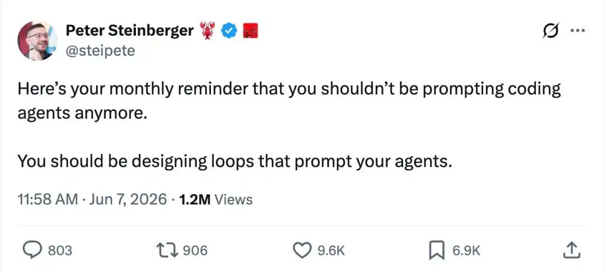
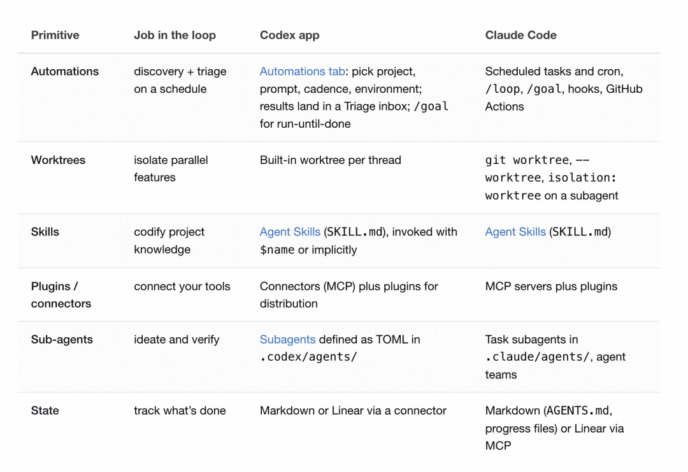

# 一文看懂 AI 编程智能体工程化新范式：Loop Engineering

过去两年，我们谈 AI 编程，最常说的词是 Prompt Engineering。
怎么把需求讲清楚？怎么给足上下文？怎么让 AI 一次生成更接近可用的代码？这些问题当然重要。但当 AI 编程智能体越来越强，真正的控制点正在发生变化。
以前，我们像是在一轮一轮地「指挥」AI：你写一句提示词，它回一段代码；你指出问题，它再改一版。整个过程里，人始终站在每一轮交互的入口处。
现在，一个新的思路开始出现：与其每次都手动提示智能体，不如设计一个系统，让这个系统去发现任务、分配任务、检查结果、记录状态，并决定下一步。
**AI 编程的关键能力，正在从「写好提示词」升级为「设计可持续运转的智能体工作系统」。**
这个工程化新范式，就是最近被频繁讨论的**Loop Engineering**。

## 为什么 Prompt Engineering 不够用了？

Peter Steinberger 最近说过一句话：

You shouldn’t be prompting coding agents anymore. You should be designing loops that prompt your agents.

大意是：你不应该再只是提示编程智能体了，你应该设计能够提示智能体的循环。
Claude Code 负责人 Boris Cherny 也表达过类似观点：

I don’t prompt Claude anymore. I have loops running that prompt Claude and figuring out what to do. My job is to write loops.

这两句话背后，其实指向同一个趋势：AI 编程协作的重心，正在从「人反复输入 Prompt」转向「人设计一个持续运行的工作循环」。

为什么会有这个变化？
因为真实的软件开发，从来都不只是一次问答。它包含需求澄清、方案设计、代码修改、测试验证、错误修复、文档更新、代码审查、发布跟进。每一步都可能失败，每一步都需要反馈。
如果我们仍然把 AI 当成一个「每次等我发指令」的工具，那么人的注意力会被卡在每一个细节节点上。AI 越强，人反而越容易陷入一种新的微操：不断复制上下文、不断解释项目规则、不断追问下一步。
Loop Engineering 想解决的，正是这个问题。
**Prompt Engineering 关注的是「这一轮怎么问得更好」，Loop Engineering 关注的是「整个流程怎么持续变好」。**
这并不意味着 Prompt Engineering 过时了。提示词仍然重要，只是它从舞台中央退到系统内部，变成循环中的一个组件。
就像写代码时，单个函数很重要，但真正决定系统质量的，是函数之间如何协作、状态如何流动、错误如何处理、边界如何收束。

## Loop Engineering 到底是什么？

可以先给一个简单定义：
**Loop Engineering，是围绕 AI 编程智能体设计一个可重复、可观察、可验证、可修正的工作循环。**
这里的 Loop，可以理解为一个递归目标。你给出目标、上下文、工具权限和停止条件，AI 在这个边界内持续迭代，直到任务完成，或者遇到需要人类判断的节点。
它关心的不只是「提示词怎么写」，还包括这些更工程化的问题：

- AI 什么时候启动？
- 它读取哪些上下文？
- 它能调用哪些工具？
- 它如何知道自己做对了？
- 失败后怎么继续修正？
- 哪些操作必须交给人确认？
- 状态如何在下一轮继续使用？

这就是 Loop Engineering 和 Prompt Engineering 最大的差别。
维度
关注点
单次提示词效果
持续任务闭环
典型问题
怎么问 AI 更准确
如何让 AI 可靠推进一组任务
输出形态
回答、建议、代码片段
自动化流程、协作链路、可验证结果
人类角色
提问者、修正者
流程设计者、约束制定者、审查者
风险控制
依赖提示词约束
依赖权限、验证、反馈、人工门禁
举个例子。
传统 Prompt Engineering 的问题可能是：「帮我修复这个登录失败的 bug。」
Loop Engineering 的问题会变成：「每天早上读取昨天的 CI 失败记录和用户反馈，找出高优先级 bug，为每个 bug 创建隔离工作区，生成修复方案，运行测试，失败后继续修正，通过后生成 PR，并把无法处理的部分写入待办清单。」
前者是一条指令，后者是一套系统。
**Prompt Engineering 解决的是一次回答的质量，Loop Engineering 解决的是一段流程的可靠性。**
这也是为什么它更像软件工程，而不只是提示词技巧。你需要设计输入、输出、状态、权限、验证、异常处理和人工确认点。
换句话说，Loop Engineering 把 AI 编程从「对话艺术」进一步推向「系统设计」。

## 一个 Loop 需要哪些核心构件？

一个 Loop 大致需要五个核心构件，再加一层外部记忆。
这六个部分分别是：Automations、Worktrees、Skills、Plugins / Connectors、Sub-agents，以及 Memory。

先用一张表把它们放在一起看：
作用
解决的问题
定时触发任务
人不必反复手动检查
隔离并行工作
多个 agent 修改互相冲突
沉淀项目知识
每轮都从零理解项目
接入真实工具
AI 只能停留在本地文件
分离执行和验证
实现者自我审查不可靠
记录长期状态
上下文跨轮次丢失

### Automations：循环的心跳

Automation 是让 Loop 真正「循环」起来的部分。
如果没有自动触发机制，所谓 Loop 只是你手动执行了一次任务。只有当它可以按时间、事件或条件自动启动，循环才会拥有自己的节奏。
比如每天早上自动检查 CI 失败，每隔一小时整理 issue，每次 PR 更新后触发审查，每晚生成一次项目状态简报。这些任务本身不复杂，但很消耗注意力。
Automation 的价值，就是把这些重复性的触发和发现动作交给系统。
在 Codex 里，可以通过 Automations tab 设置周期任务。在 Claude Code 里，也可以通过 scheduling、hooks、/loop、cron、GitHub Actions 等方式实现类似能力。
更关键的是停止条件。比如「所有 auth 测试通过，并且 lint 整洁」。当循环有了可验证的终点，它就不再只是盲目重试。

### Worktrees：并行工作的隔离层

当多个 agent 同时修改同一个仓库，最容易出问题的地方不是模型能力，而是文件冲突。
一个 agent 在重构登录逻辑，另一个 agent 在修复同一文件里的边界条件。如果它们共用同一个工作目录，结果很容易互相覆盖。
Git worktree 的作用，就是给每个 agent 一个独立 checkout。它们共享同一份仓库历史，但在不同目录里工作。这样一来，不同尝试可以并行推进，彼此不直接污染。
不过，Worktrees 只能解决机械冲突，不能解决人的审查带宽。
你可以同时跑十个 agent，但最终仍然要有人判断哪个方案值得合并，哪个方案引入了隐患，哪个方案只是看起来通过了测试。

### Skills：项目知识的沉淀方式

很多人使用 AI 编程工具时，都会遇到一个问题：每次新开会话，都要重新解释项目背景。
我们用什么框架？怎么跑测试？哪些目录不能动？这个模块为什么不能重构？上次线上事故留下了什么约束？
如果这些信息只存在于人的脑子里，每一轮 Loop 都会重新猜。
Skill 的价值，就是把这些项目知识、开发约定、构建步骤、历史决策写成外部能力。智能体每次执行任务时，都可以读取这些稳定上下文。
这相当于给 Loop 建了一套项目操作手册。
**没有 Skills，Loop 每轮都在重新理解项目；有了 Skills，项目意图才会逐渐形成复利效应。**

### Plugins / Connectors：连接真实工具链

一个只能读写本地文件的 Loop，能力边界很窄。
真实开发发生在更大的系统里：issue tracker、PR、CI、数据库、监控平台、Slack、Linear、Notion、内部 API。代码只是其中一部分。
Plugins 和 Connectors 的价值，就是让智能体接入这些真实工具链。
当 Loop 能读取 issue，查询 CI，打开 PR，关联 ticket，在测试通过后通知团队，它就从「给你建议」变成了「参与流程」。
当然，连接真实系统也意味着更高风险。权限给多大、能不能写生产数据、能不能自动发消息、能不能改 ticket 状态，这些都需要清晰边界。
工具链连接越深，权限设计越要保守。

### Sub-agents：把执行者和检查者分开

在无人值守的 Loop 里，最重要的结构之一，是把 maker 和 checker 分开。
写代码的 agent，不适合完全负责评价自己的代码。它很容易相信自己的假设，也容易把「测试刚好通过」当成「问题已经解决」。
更稳妥的方式，是让一个 agent 负责实现，另一个 agent 负责审查。审查者可以采用不同提示词、不同模型、不同关注点，比如只看安全风险、只看边界条件、只看是否符合规范。
这并不意味着 sub-agent 越多越好。每个 agent 都会消耗 token，也会增加协调成本。
更合理的做法，是在高风险、高价值、需要第二判断的环节使用它们。比如架构变更、权限逻辑、数据迁移、支付链路、发布前审查。

### Memory：让循环跨轮次延续

最后一个看似朴素，却非常关键的部分，是 Memory。
模型会忘记，仓库不会。对长周期任务来说，状态必须存在对话之外。
这个 Memory 可以是一个 Markdown 文件，也可以是 Linear board、issue 列表、状态表、任务清单。它记录已经尝试过什么、哪些测试通过了、哪些问题还没解决、下一轮应该从哪里继续。
没有 Memory，Loop 每次启动都像失忆。它可能重复处理同一个问题，忘记已经排除的方案，或者重新走一遍错误路径。
有了 Memory，Loop 才有连续性。

## 一个真实 Loop 是怎么跑起来的？

把上面的构件串起来，一个典型 Loop 可能长这样。
每天早上，Automation 自动在项目里运行。它调用一个 triage skill，读取昨天的 CI 失败、open issues、recent commits，以及团队反馈。
接着，它把发现的问题整理到一个 Markdown 状态文件，或者写入 Linear board。每个问题都带上来源、影响范围、初步判断和建议优先级。
对于值得处理的问题，Loop 会创建一个独立 worktree。一个 sub-agent 进入这个 worktree，阅读项目 skills，理解相关代码，起草修复方案，并完成第一版修改。
修改完成后，另一个 sub-agent 接手审查。它会检查实现是否符合项目约定，是否覆盖边界条件，是否需要补充测试，是否存在明显回归风险。
如果测试失败，Loop 会把失败输出重新送回实现 agent，让它继续修正。如果测试通过，Connectors 可以打开 PR、关联 ticket，并把摘要发到团队频道。
最后，state file 记录这一轮发生了什么：哪个问题已修复，哪个问题还在等待人工判断，哪个方案被放弃，哪些测试通过，下一轮应该接着看哪里。
这个流程可以压缩成一张表：
阶段
AI 可以做什么
人类需要把关什么
发现问题
读取 CI、issue、commit，整理异常
判断优先级是否符合业务目标
拆解任务
生成修复计划和影响范围
判断方案方向是否合理
编码实现
修改代码、补测试、更新文档
审查关键逻辑和边界条件
验证反馈
运行测试、根据失败继续修复
判断测试信号是否足够可信
提交结果
生成 PR、更新 ticket、写变更说明
决定是否合并与发布
这里最重要的，是让整个系统形成自主的反馈闭环，而非单纯追求 AI 自动写代码的产出数量。
它会发现问题，会尝试修复，会检查结果，会记录状态，会在下一轮继续推进。人的工作，则从每一步都亲自敲指令，变成设计边界、设置验证信号、处理关键判断。
**好的 Loop 不追求「一次生成正确答案」，而是设计一套能不断逼近正确结果的反馈系统。**
这也是它和普通自动化脚本的差别。
普通脚本更像固定流程：输入确定，步骤确定，输出也大致确定。Loop 面对的是更开放的工程任务，它需要在目标、上下文、工具和反馈之间不断调整。
所以，Loop Engineering 的本质，是设计一套能与 AI 智能体深度协作的工程控制系统，而非简单地编写一个自动化脚本。

## 构建 Loop，但不要离开驾驶位

Loop Engineering 很有吸引力，因为它让 AI 编程看起来更接近真正的自动化。
但越是能自动运行的系统，越需要认真设计边界。
第一个风险是 token 成本。Automation、sub-agents、长上下文、反复验证，都会快速放大消耗。如果没有清晰的触发条件和停止条件，一个 Loop 可能在低价值任务上持续燃烧资源。
第二个风险是无人值守错误。Loop 可以无人值守地运行，也可能无人值守地犯错。它生成的「done」只是一个声明，不等于代码真的可靠。
第三个风险是理解债。AI 帮你写得越快，你越容易来不及理解系统发生了什么。代码进入仓库，但人的认知没有同步更新，这会在后续维护中变成隐形债务。
第四个风险是认知投降。当 Loop 足够顺滑，人很容易从「设计系统」退化成「按下启动」。如果工程师不再提出判断，不再审查结果，不再理解改动，Loop 就会从杠杆变成黑箱。
所以，Loop Engineering 并没有让工程师消失。它只是把工程师的工作位置前移了。
你需要做的事情包括：

- 1. 设计循环：明确任务如何启动、如何推进、如何停止。
- 2. 设定边界：规定 AI 能读什么、能写什么、哪些动作必须确认。
- 3. 沉淀上下文：用 Skills 和 Memory 记录项目规则与历史决策。
- 4. 选择验证信号：明确什么叫「完成」，什么叫「失败」。
- 5. 审查最终结果：确认代码真的工作，而不是只相信系统摘要。

**Loop 是杠杆，不是替身。它能放大一个工程师的判断，也会放大一个工程师的缺席。**
这也是为什么 Loop Engineering 比 Prompt Engineering 更难。它不只考验你会不会写提示词，还考验你是否理解软件工程里的流程、状态、边界、反馈和责任。
未来的 AI 编程，很可能会越来越多地从「我让 AI 写一段代码」变成「我设计一套 AI 持续推进工作的系统」。
但无论工具怎么演进，最终要交付可靠软件的人，仍然是工程师。
**构建 Loop，但要像一个仍然打算掌控系统的工程师那样构建它。**

### 既然看到这里了，如果觉得有启发，随手点个赞、推荐、转发三连吧，你的支持是我持续分享干货的动力。推荐阅读：一文看懂 OpenAI 开源的 Codex 编排规范：Symphony

---

## 📚 专业词汇通俗解释

**Prompt Engineering（提示词工程）**
> 就是研究"怎么跟 AI 说话"的技巧。比如你想让 AI 帮你写代码，怎么说清楚需求、给足背景信息，让它一次就给出好结果。就像你跟同事交代任务，说得好同事做得好，说得含糊就要反复返工。

**Loop Engineering（循环工程）**
> 不是每次手动告诉 AI 做什么，而是设计一套"自动运转的系统"——让 AI 自己发现问题、分配任务、检查结果、记录进度，持续循环直到完成。相当于从"每次打电话指挥"变成"建了个自动化工厂"。

**CI（Continuous Integration，持续集成）**
> 代码每次提交后自动跑测试、检查代码质量的流程。比如你改了代码，系统自动跑一遍测试看看有没有把别的地方搞坏。就像厨师每做一道菜都要试吃，确保没问题才上桌。

**Worktree（Git 工作树）**
> Git 提供的一种"分身"功能——同一个仓库可以同时 checkout 出多个独立的工作目录。相当于你同时开了好几个副本在改，互不干扰。比如一个副本修登录 bug，另一个副本改界面，改完再决定合并哪个。

**PR（Pull Request，拉取请求）**
> 代码改完后，向主仓库申请"把我的改动合进来"的流程。相当于你写完报告交给领导审核，领导看完觉得 OK 才正式入库。

**Agent / 智能体**
> 能自主使用工具（终端、浏览器、文件等）来完成复杂任务的 AI 程序。不是单纯回答问题，而是能执行操作、检查结果、继续下一步。就像雇了个能动手干活的助手，而不是只给建议的顾问。

**Sub-agent（子代理）**
> 在主系统下干活的"小助手"。比如一个负责写代码，另一个负责审查代码——相当于开发团队里的"程序员 + 代码审查员"分工。

**Token**
> AI 模型处理文本的基本单位，可以简单理解为一个字或一个词。AI 说的每句话、读的每行代码都在消耗 token，token 用得越多成本越高。

**Skills（技能文件）**
> 写给 AI 看的"操作手册"，用 Markdown 文件记录项目的约定、构建步骤、注意事项。AI 每次开工前先读这些文件，就知道你的项目怎么跑、什么能改什么不能碰。相当于新员工入职的培训文档。

**Memory（记忆）**
> 让 AI 跨轮次记住状态的东西——比如一个文件记录"哪些修了、哪些还没、下一步做什么"。没有记忆，AI 每次启动都像失忆，可能重复处理同一个问题。

**Automation（自动化触发）**
> 让循环按时间或事件自动启动的机制。比如每天早上自动检查测试有没有失败，不用人每天手动去点。就像设了闹钟，到点自动提醒你该做的事。

**Connectors / Plugins（连接器/插件）**
> 让 AI 能连接真实开发工具的接口——比如连上 GitHub 查 issue、连 CI 看测试结果、连 Slack 发通知。没有这些，AI 只能读写本地文件，相当于只能在纸上写写画画，碰不到真正的系统。

**理解债（Understanding Debt）**
> AI 帮你写得越快，你越来不及搞懂系统发生了什么。代码进了仓库，但你对系统的认知没跟上——后面维护起来就会踩坑。就像别人帮你装修了房子，但你不知道水管电线走哪了，以后维修就麻烦。
