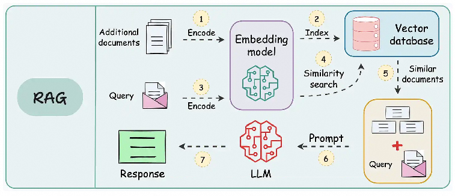
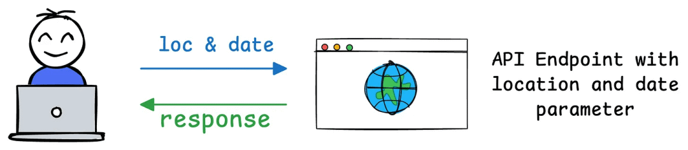
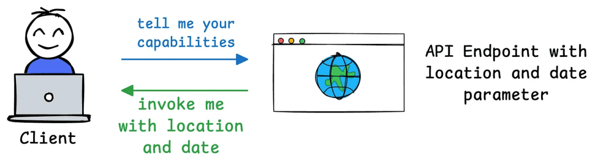

# 一文带你 "看见" MCP 的过程，彻底理解 MCP 的概念


### 一、前言

说实话，当我看到使用 MCP 服务还需要手动复制粘贴 JSON 的时候，包括现在很多 MCP 服务只有工具，没有资源和提示时，我认为 MCP 还不太成熟。
随着今年“智能体”的大爆发，使用工具的诉求越来越强烈。随着 MCP 服务市场、MCP 自动配置功能的出现，MCP 的使用门槛正在降低，越来越多的服务宣布支持 MCP 协议，开始要爆发的趋势。
网上也有很多介绍 MCP 的文章，但很多文章要么太理论化，动辄就上一堆 Python 代码，对于非开发者来说比较枯燥，要么就是直接介绍 MCP 如何配置使用，太偏实践，知其然，不知其所以然。
本文将先尽量用相对通俗的语言和图形介绍基本的理论，然后以 ModelScope 的 MCP 市场，Cherry Studio 客户端为例，为大家展示 MCP 的过程，让大家更加有体感，更好地理解和掌握 MCP ,最后分享一点资料和观点。

### 二、理论基础

RAG 是为了让大模型获取足够的上下文，Function Calling 是为了让模型使用工具，他们和 MCP 有或多或少的联系，因此，接下来，我先介绍前面两个概念再介绍 MCP。

### 2.1 先看 RAG

RAG（Retrieval Augmented Generation ，检索增强生成），我们不需要训练和微调大模型，只需要提供和用户提问相关的额外的信息到提示词中，从而可以获得更高质量的回答。



图片来源：https://www.dailydoseofds.com/16-techniques-to-supercharge-and-build-real-world-rag-systems-part-1/
通常，需要将资料通过嵌入模型生成服务转化为向量，然后存储到向量数据库中。
当用户提问时，将用户的问题向量化从向量数据库中进行相似度匹配出 TOP N 个片段，拼接成新的提示词发送给大模型，大模型就可以结合你的资料更好地回答问题了。
当然， RAG 还有很多变种，如Agentic RAG 、Modular RAG、Graph RAG 等多种高级形式，这里就不展了。

### 2.2 再看 Function Calling

Function Calling(函数调用) 是一种允许大型语言模型(LLM)根据用户输入识别它需要的工具并决定何时调用该工具的机制。


图片来源：ailydoseofds
基本工作原理如下：LLM 接收用户的提示词，LLM 决定它需要的工具，执行方法调用，后端服务执行实际的请求给出处理结果，大语言模型根据处理结果生成最终给用户的回答。
不同的 API 需要封装成不同的方法，通常需要编写代码，很难在不同的平台灵活复用。
参见百炼函数调用文档：https://help.aliyun.com/zh/model-studio/tool-calling-overview/

### 2.3 来看 MCP

模型上下文协议（Model Context Protocol，简称MCP）是一个由 Anthropic 在 2024 年 11 月 25 日开源的新标准。MCP 是一个开放标准，旨在连接AI助手与数据所在的系统，包括内容存储库、业务工具和开发环境。其目标是帮助前沿模型产生更好、更相关的响应。


图片来源：https://zhuanlan.zhihu.com/p/598749792
MCP 可以看作是 AI 应用程序的 "USB-C端口"。就像 USB-C 为连接设备与各种外设提供了标准化方式，MCP为 AI 模型连接不同数据源和工具提供了标准化方法。


#### 2.3.1 MCP 的核心

从技术角度看，MCP 遵循客户端-服务器架构，其中主机应用可以连接到多个服务器。
MCP 有三个关键组件：

- 主机(Host)
- 客户端(Client)
- 服务器(Server)

#### 2.3.2 组件详解

- **主机：代表任何提供 AI 交互环境的应用程序(如 Claude 桌面版、Cursor)，它能访问工具和数据，并运行 MCP 客户端。**

- **MCP 客户端：在主机内运行，使其能与 MCP 服务器通信。**

- **MCP 服务器：暴露特定功能并提供数据访问，例如：**

#### 2.3.3 MCP 相比传统 API 的优势

传统 API ：



- 如果 API 最初需要两个参数(例如天气服务的位置和日期)，用户集成应用程序会发送带有这些确切参数的请求。

- 如果后来添加第三个必需参数(例如温度单位，如摄氏度或华氏度)，API的合约就会改变。
- 这意味着所有 API 用户必须更新代码以包含新参数。如果不更新，请求可能失败、返回错误或提供不完整结果。

MCP 的设计解决了这个问题：

- MCP 引入了与传统 API 截然不同的动态灵活方法。
- 当客户端(如 Claude 桌面版)连接到 MCP 服务器(如您的天气服务)时，它发送初始请求以了解服务器的能力。

- 服务器响应其可用工具、资源、提示和参数的详细信息。例如，如果您的天气 API 最初支持位置和日期，服务器会将这些作为其功能的一部分进行通信。

- 如果您稍后添加单位参数，MCP 服务器可以在下一次交换期间动态更新其功能描述。客户端不需要硬编码或预定义参数—只需查询服务器的当前功能并相应地适应。
- 这样，客户端可以及时调整其行为，使用更新的功能(例如在请求中包含单位)，无需重写或重新部署代码。


图源：https://www.latent.space/p/why-mcp-won
其实，MCP 也是用了 “中间层”的思想，让大模型使用工具标准化，让大模型调用工具更方便，焕发出新的生机。

#### 2.3.4 MCP 的过程


首先需要在主机上自动或手动配置 MCP 服务，当用户输入问题时， MCP 客户端让 大语言模型选择 MCP 工具，大模型选择好 MCP 工具以后， MCP 客户端寻求用户同意（很多产品支持配置自动同意），MCP 客户端请求 MCP 服务器， MCP 服务调用工具并将工具的结果返回给 MCP 客户端， MCP 客户端将模型调用结果和用户的查询发送给大语言模型，大语言模型组织答案给用户。
**其实 RAG 、Function Call 和 MCP 本质上都是一样，都是为了借助外部工具帮助大模型完成更复杂的事情。**

### ### 三、“看见” MCP 的过程

### 3.1 ModelScope


我们来到魔搭的 MCP 市场：https://modelscope.cn/mcp，这里只是为了演示，其他的 MCP 广场也是一样的。


登录以后，我们选择一个 MCP 服务，点击右侧的“连接”按钮，就可以 获取 MCP服务的 SSE URL。

### 3.2 Cherry Studio

Cherry Studio 官网:https://cherry-ai.com/


在右上角点击开启，就可以看到该 MCP 服务提供的工具、提示和资源。


可以单独开启和关闭每个可用的工具。


每个 MCP 服务手动配置太麻烦，大家也可以点击“同步服务器”，配置 ModelScope 的 API 令牌，配置之后就可以一键同步 ModelScope 上开启的 MCP 服务了。

### 3.3 开发者模式


输入想要问的问题，开启需要的 MCP 服务。
为了看见 MCP 的执行过程，我们还需要通过 Ctrl+Shift+I（Mac端：Command+Option+I）打开开发者模式。


第一次请求，发送系统提示词，包括大模型可以选择的工具和要求等，然后给出用户的问题。


可以看到第二次调用，模型选择使用 infoq 工具获得资讯后组织语言展示给用户。
index =0 的系统提示词的内容：
{
"role": "system",
"content": "In this environment you have access to a set of tools you can use to answer the user's question. You can use one tool per message, and will receive the result of that tool use in the user's response. You use tools step-by-step to accomplish a given task, with each tool use informed by the result of the previous tool use.\n\n## Tool Use Formatting\n\nTool use is formatted using XML-style tags. The tool name is enclosed in opening and closing tags, and each parameter is similarly enclosed within its own set of tags. Here's the structure:\n\n<tool_use>\n<name>{tool_name}</name>\n<arguments>{json_arguments}</arguments>\n</tool_use>\n\nThe tool name should be the exact name of the tool you are using, and the arguments should be a JSON object containing the parameters required by that tool. For example:\n<tool_use>\n<name>python_interpreter</name>\n<arguments>{\"code\":\"5 + 3 + 1294.678\"}</arguments>\n</tool_use>\n\nThe user will respond with the result of the tool use, which should be formatted as follows:\n\n<tool_use_result>\n<name>{tool_name}</name>\n<result>{result}</result>\n</tool_use_result>\n\nThe result should be a string, which can represent a file or any other output type. You can use this result as input for the next action.\nFor example, if the result of the tool use is an image file, you can use it in the next action like this:\n\n<tool_use>\n<name>image_transformer</name>\n<arguments>{\"image\":\"image_1.jpg\"}</arguments>\n</tool_use>\n\nAlways adhere to this format for the tool use to ensure proper parsing and execution.\n\n## Tool Use Examples\n\nHere are a few examples using notional tools:\n---\nUser: Generate an image of the oldest person in this document.\n\nAssistant: I can use the document_qa tool to find out who the oldest person is in the document.\n<tool_use>\n<name>document_qa</name>\n<arguments>{\"document\":\"document.pdf\",\"question\":\"Who is the oldest person mentioned?\"}</arguments>\n</tool_use>\n\nUser: <tool_use_result>\n<name>document_qa</name>\n<result>John Doe, a 55 year old lumberjack living in Newfoundland.</result>\n</tool_use_result>\n\nAssistant: I can use the image_generator tool to create a portrait of John Doe.\n<tool_use>\n<name>image_generator</name>\n<arguments>{\"prompt\":\"A portrait of John Doe, a 55-year-old man living in Canada.\"}</arguments>\n</tool_use>\n\nUser: <tool_use_result>\n<name>image_generator</name>\n<result>image.png</result>\n</tool_use_result>\n\nAssistant: the image is generated as image.png\n\n---\nUser:\"What is the result of the following operation: 5 + 3 + 1294.678?\"\n\nAssistant: I can use the python_interpreter tool to calculate the result of the operation.\n<tool_use>\n<name>python_interpreter</name>\n<arguments>{\"code\":\"5 + 3 + 1294.678\"}</arguments>\n</tool_use>\n\nUser: <tool_use_result>\n<name>python_interpreter</name>\n<result>1302.678</result>\n</tool_use_result>\n\nAssistant: The result of the operation is 1302.678.\n\n---\nUser:\"Which city has the highest population , Guangzhou or Shanghai?\"\n\nAssistant: I can use the search tool to find the population of Guangzhou.\n<tool_use>\n<name>search</name>\n<arguments>{\"query\":\"Population Guangzhou\"}</arguments>\n</tool_use>\n\nUser: <tool_use_result>\n<name>search</name>\n<result>Guangzhou has a population of 15 million inhabitants as of 2021.</result>\n</tool_use_result>\n\nAssistant: I can use the search tool to find the population of Shanghai.\n<tool_use>\n<name>search</name>\n<arguments>{\"query\":\"Population Shanghai\"}</arguments>\n</tool_use>\n\nUser: <tool_use_result>\n<name>search</name>\n<result>26 million (2019)</result>\n</tool_use_result>\nAssistant: The population of Shanghai is 26 million, while Guangzhou has a population of 15 million. Therefore, Shanghai has the highest population.\n\n\n## Tool Use Available Tools\nAbove example were using notional tools that might not exist for you. You only have access to these tools:\n<tools>\n\n<tool>\n<name>f_u-LsDUyQWsNFAUjL-_Vi</name>\n<description>获取 36 氪热榜，提供创业、商业、科技领域的热门资讯，包含投融资动态、新兴产业分析和商业模式创新信息</description>\n<arguments>\n{\"type\":\"object\",\"properties\":{\"type\":{\"anyOf\":[{\"type\":\"string\",\"const\":\"hot\",\"description\":\"人气榜\"},{\"type\":\"string\",\"const\":\"video\",\"description\":\"视频榜\"},{\"type\":\"string\",\"const\":\"comment\",\"description\":\"热议榜\"},{\"type\":\"string\",\"const\":\"collect\",\"description\":\"收藏榜\"}],\"default\":\"hot\",\"description\":\"分类\"}},\"additionalProperties\":false,\"$schema\":\"http://json-schema.org/draft-07/schema#\"}\n</arguments>\n</tool>\n\n\n<tool>\n<name>fyQ3DOUpLJDGPLCjslT6P1</name>\n<description>获取 9to5Mac 苹果相关新闻，包含苹果产品发布、iOS 更新、Mac 硬件、应用推荐及苹果公司动态的英文资讯</description>\n<arguments>\n{\"type\":\"object\",\"properties\":{},\"additionalProperties\":false,\"$schema\":\"http://json-schema.org/draft-07/schema#\"}\n</arguments>\n</tool>\n\n\n<tool>\n<name>fBOukVLVbqIh69earzcYca</name>\n<description>获取 BBC 新闻，提供全球新闻、英国新闻、商业、政治、健康、教育、科技、娱乐等资讯</description>\n<arguments>\n{\"type\":\"object\",\"properties\":{\"category\":{\"anyOf\":[{\"type\":\"string\",\"const\":\"\",\"description\":\"热门新闻\"},{\"type\":\"string\",\"const\":\"world\",\"description\":\"国际\"},{\"type\":\"string\",\"const\":\"uk\",\"description\":\"英国\"},{\"type\":\"string\",\"const\":\"business\",\"description\":\"商业\"},{\"type\":\"string\",\"const\":\"politics\",\"description\":\"政治\"},{\"type\":\"string\",\"const\":\"health\",\"description\":\"健康\"},{\"type\":\"string\",\"const\":\"education\",\"description\":\"教育\"},{\"type\":\"string\",\"const\":\"science_and_environment\",\"description\":\"科学与环境\"},{\"type\":\"string\",\"const\":\"technology\",\"description\":\"科技\"},{\"type\":\"string\",\"const\":\"entertainment_and_arts\",\"description\":\"娱乐与艺术\"}],\"default\":\"\"},\"edition\":{\"anyOf\":[{\"type\":\"string\",\"const\":\"\"},{\"type\":\"string\",\"const\":\"uk\",\"description\":\"UK\"},{\"type\":\"string\",\"const\":\"us\",\"description\":\"US & Canada\"},{\"type\":\"string\",\"const\":\"int\",\"description\":\"Rest of the world\"}],\"default\":\"\",\"description\":\"版本，仅对 `category` 为空有效\"}},\"additionalProperties\":false,\"$schema\":\"http://json-schema.org/draft-07/schema#\"}\n</arguments>\n</tool>\n\n\n<tool>\n<name>fTU2iCLtmsEWljy_HbEhCa</name>\n<description>获取哔哩哔哩视频排行榜，包含全站、动画、音乐、游戏等多个分区的热门视频，反映当下年轻人的内容消费趋势</description>\n<arguments>\n{\"type\":\"object\",\"properties\":{\"type\":{\"anyOf\":[{\"type\":\"number\",\"const\":0,\"description\":\"全站\"},{\"type\":\"number\",\"const\":1,\"description\":\"动画\"},{\"type\":\"number\",\"const\":3,\"description\":\"音乐\"},{\"type\":\"number\",\"const\":4,\"description\":\"游戏\"},{\"type\":\"number\",\"const\":5,\"description\":\"娱乐\"},{\"type\":\"number\",\"const\":188,\"description\":\"科技\"},{\"type\":\"number\",\"const\":119,\"description\":\"鬼畜\"},{\"type\":\"number\",\"const\":129,\"description\":\"舞蹈\"},{\"type\":\"number\",\"const\":155,\"description\":\"时尚\"},{\"type\":\"number\",\"const\":160,\"description\":\"生活\"},{\"type\":\"number\",\"const\":168,\"description\":\"国创相关\"},{\"type\":\"number\",\"const\":181,\"description\":\"影视\"}],\"default\":0,\"description\":\"排行榜分区\"}},\"additionalProperties\":false,\"$schema\":\"http://json-schema.org/draft-07/schema#\"}\n</arguments>\n</tool>\n\n\n<tool>\n<name>f_OULD1Qnu5wPblKHFTzYw</name>\n<description>获取豆瓣实时热门榜单，提供当前热门的图书、电影、电视剧、综艺等作品信息，包含评分和热度数据</description>\n<arguments>\n{\"type\":\"object\",\"properties\":{\"type\":{\"anyOf\":[{\"type\":\"string\",\"const\":\"subject\",\"description\":\"图书、电影、电视剧、综艺等\"},{\"type\":\"string\",\"const\":\"movie\",\"description\":\"电影\"},{\"type\":\"string\",\"const\":\"tv\",\"description\":\"电视剧\"}],\"default\":\"subject\"},\"start\":{\"type\":\"integer\",\"default\":0},\"count\":{\"type\":\"integer\",\"default\":10}},\"additionalProperties\":false,\"$schema\":\"http://json-schema.org/draft-07/schema#\"}\n</arguments>\n</tool>\n\n\n<tool>\n<name>fL5c-CwZ3bUckaatY_MC8Z</name>\n<description>获取抖音热搜榜单，展示当下最热门的社会话题、娱乐事件、网络热点和流行趋势</description>\n<arguments>\n{\"type\":\"object\",\"properties\":{},\"additionalProperties\":false,\"$schema\":\"http://json-schema.org/draft-07/schema#\"}\n</arguments>\n</tool>\n\n\n<tool>\n<name>flPxhdB8Wyw8DDuban0pMa</name>\n<description>获取机核网游戏相关资讯，包含电子游戏评测、玩家文化、游戏开发和游戏周边产品的深度内容</description>\n<arguments>\n{\"type\":\"object\",\"properties\":{},\"additionalProperties\":false,\"$schema\":\"http://json-schema.org/draft-07/schema#\"}\n</arguments>\n</tool>\n\n\n<tool>\n<name>fdj1bDLATGns6ZdclA68UF</name>\n<description>获取爱范儿科技快讯，包含最新的科技产品、数码设备、互联网动态等前沿科技资讯</description>\n<arguments>\n{\"type\":\"object\",\"properties\":{\"limit\":{\"type\":\"integer\",\"default\":20},\"offset\":{\"type\":\"integer\",\"default\":0}},\"additionalProperties\":false,\"$schema\":\"http://json-schema.org/draft-07/schema#\"}\n</arguments>\n</tool>\n\n\n<tool>\n<name>f0Uk75Pbfsx0rfdD725CYI</name>\n<description>获取 InfoQ 技术资讯，包含软件开发、架构设计、云计算、AI等企业级技术内容和前沿开发者动态</description>\n<arguments>\n{\"type\":\"object\",\"properties\":{\"region\":{\"type\":\"string\",\"enum\":[\"cn\",\"global\"],\"default\":\"cn\"}},\"additionalProperties\":false,\"$schema\":\"http://json-schema.org/draft-07/schema#\"}\n</arguments>\n</tool>\n\n\n<tool>\n<name>fu70DSpIpWTVlq11tEKJZd</name>\n<description>获取掘金文章榜，包含前端开发、后端技术、人工智能、移动开发及技术架构等领域的高质量中文技术文章和教程</description>\n<arguments>\n{\"type\":\"object\",\"properties\":{\"category_id\":{\"anyOf\":[{\"type\":\"string\",\"const\":\"6809637769959178254\",\"description\":\"后端\"},{\"type\":\"string\",\"const\":\"6809637767543259144\",\"description\":\"前端\"},{\"type\":\"string\",\"const\":\"6809635626879549454\",\"description\":\"Android\"},{\"type\":\"string\",\"const\":\"6809635626661445640\",\"description\":\"iOS\"},{\"type\":\"string\",\"const\":\"6809637773935378440\",\"description\":\"人工智能\"},{\"type\":\"string\",\"const\":\"6809637771511070734\",\"description\":\"开发工具\"},{\"type\":\"string\",\"const\":\"6809637776263217160\",\"description\":\"代码人生\"},{\"type\":\"string\",\"const\":\"6809637772874219534\",\"description\":\"阅读\"}],\"default\":\"6809637769959178254\"}},\"additionalProperties\":false,\"$schema\":\"http://json-schema.org/draft-07/schema#\"}\n</arguments>\n</tool>\n\n\n<tool>\n<name>fZMjSXkog94GRA7VoZpJtw</name>\n<description>获取网易新闻热点榜，包含时政要闻、社会事件、财经资讯、科技动态及娱乐体育的全方位中文新闻资讯</description>\n<arguments>\n{\"type\":\"object\",\"properties\":{},\"additionalProperties\":false,\"$schema\":\"http://json-schema.org/draft-07/schema#\"}\n</arguments>\n</tool>\n\n\n<tool>\n<name>f5s3U6zXATp3L6wpAwNcn4</name>\n<description>获取纽约时报新闻，包含国际政治、经济金融、社会文化、科学技术及艺术评论的高质量英文或中文国际新闻资讯</description>\n<arguments>\n{\"type\":\"object\",\"properties\":{\"region\":{\"anyOf\":[{\"type\":\"string\",\"const\":\"cn\",\"description\":\"中文\"},{\"type\":\"string\",\"const\":\"global\",\"description\":\"全球\"}],\"default\":\"cn\"},\"section\":{\"type\":\"string\",\"default\":\"HomePage\",\"description\":\"分类，当 `region` 为 `cn` 时无效。可选值: Africa, Americas, ArtandDesign, Arts, AsiaPacific, Automobiles, Baseball, Books/Review, Business, Climate, CollegeBasketball, CollegeFootball, Dance, Dealbook, DiningandWine, Economy, Education, EnergyEnvironment, Europe, FashionandStyle, Golf, Health, Hockey, HomePage, Jobs, Lens, MediaandAdvertising, MiddleEast, MostEmailed, MostShared, MostViewed, Movies, Music, NYRegion, Obituaries, PersonalTech, Politics, ProBasketball, ProFootball, RealEstate, Science, SmallBusiness, Soccer, Space, Sports, SundayBookReview, Sunday-Review, Technology, Television, Tennis, Theater, TMagazine, Travel, Upshot, US, Weddings, Well, World, YourMoney\"}},\"additionalProperties\":false,\"$schema\":\"http://json-schema.org/draft-07/schema#\"}\n</arguments>\n</tool>\n\n\n<tool>\n<name>fSodMRu-GB5-mpBxBvxc2D</name>\n<description>获取什么值得买热门，包含商品推荐、优惠信息、购物攻略、产品评测及消费经验分享的实用中文消费类资讯</description>\n<arguments>\n{\"type\":\"object\",\"properties\":{\"unit\":{\"anyOf\":[{\"type\":\"number\",\"const\":1,\"description\":\"今日热门\"},{\"type\":\"number\",\"const\":7,\"description\":\"周热门\"},{\"type\":\"number\",\"const\":30,\"description\":\"月热门\"}],\"default\":1}},\"additionalProperties\":false,\"$schema\":\"http://json-schema.org/draft-07/schema#\"}\n</arguments>\n</tool>\n\n\n<tool>\n<name>fnY78eScFYQ-6xtUUQg8fB</name>\n<description>获取少数派热榜，包含数码产品评测、软件应用推荐、生活方式指南及效率工作技巧的优质中文科技生活类内容</description>\n<arguments>\n{\"type\":\"object\",\"properties\":{\"tag\":{\"type\":\"string\",\"enum\":[\"热门文章\",\"应用推荐\",\"生活方式\",\"效率技巧\",\"少数派播客\"],\"default\":\"热门文章\",\"description\":\"分类\"},\"limit\":{\"type\":\"integer\",\"default\":40}},\"additionalProperties\":false,\"$schema\":\"http://json-schema.org/draft-07/schema#\"}\n</arguments>\n</tool>\n\n\n<tool>\n<name>fFlnyuBJfPLifqYRkW94Lh</name>\n<description>获取腾讯新闻热点榜，包含国内外时事、社会热点、财经资讯、娱乐动态及体育赛事的综合性中文新闻资讯</description>\n<arguments>\n{\"type\":\"object\",\"properties\":{\"page_size\":{\"type\":\"integer\",\"default\":20}},\"additionalProperties\":false,\"$schema\":\"http://json-schema.org/draft-07/schema#\"}\n</arguments>\n</tool>\n\n\n<tool>\n<name>f0YfISsRrFbNGGwO3XVCFY</name>\n<description>获取澎湃新闻热榜，包含时政要闻、财经动态、社会事件、文化教育及深度报道的高质量中文新闻资讯</description>\n<arguments>\n{\"type\":\"object\",\"properties\":{},\"additionalProperties\":false,\"$schema\":\"http://json-schema.org/draft-07/schema#\"}\n</arguments>\n</tool>\n\n\n<tool>\n<name>fIKw7RiYt2oAptPSBtelf-</name>\n<description>获取 The Verge 新闻，包含科技创新、数码产品评测、互联网趋势及科技公司动态的英文科技资讯</description>\n<arguments>\n{\"type\":\"object\",\"properties\":{},\"additionalProperties\":false,\"$schema\":\"http://json-schema.org/draft-07/schema#\"}\n</arguments>\n</tool>\n\n\n<tool>\n<name>fH1Xj1bmY_qWxS6b8BoSCK</name>\n<description>获取今日头条热榜，包含时政要闻、社会事件、国际新闻、科技发展及娱乐八卦等多领域的热门中文资讯</description>\n<arguments>\n{\"type\":\"object\",\"properties\":{},\"additionalProperties\":false,\"$schema\":\"http://json-schema.org/draft-07/schema#\"}\n</arguments>\n</tool>\n\n\n<tool>\n<name>fIoNHXnzDif1o8sJSRpVBu</name>\n<description>获取微博热搜榜，包含时事热点、社会现象、娱乐新闻、明星动态及网络热议话题的实时热门中文资讯</description>\n<arguments>\n{\"type\":\"object\",\"properties\":{},\"additionalProperties\":false,\"$schema\":\"http://json-schema.org/draft-07/schema#\"}\n</arguments>\n</tool>\n\n\n<tool>\n<name>fX_nTem-9mBD-9Th_ZVRdA</name>\n<description>获取微信读书排行榜，包含热门小说、畅销书籍、新书推荐及各类文学作品的阅读数据和排名信息</description>\n<arguments>\n{\"type\":\"object\",\"properties\":{\"category\":{\"anyOf\":[{\"type\":\"string\",\"const\":\"rising\",\"description\":\"飙升榜\"},{\"type\":\"string\",\"const\":\"hot_search\",\"description\":\"热搜榜\"},{\"type\":\"string\",\"const\":\"newbook\",\"description\":\"新书榜\"},{\"type\":\"string\",\"const\":\"general_novel_rising\",\"description\":\"小说榜\"},{\"type\":\"string\",\"const\":\"all\",\"description\":\"总榜\"}],\"default\":\"rising\",\"description\":\"排行榜分区\"}},\"additionalProperties\":false,\"$schema\":\"http://json-schema.org/draft-07/schema#\"}\n</arguments>\n</tool>\n\n\n<tool>\n<name>fzIq8ORLIZHJLRU6pJt3O5</name>\n<description>获取知乎热榜，包含时事热点、社会话题、科技动态、娱乐八卦等多领域的热门问答和讨论的中文资讯</description>\n<arguments>\n{\"type\":\"object\",\"properties\":{\"limit\":{\"type\":\"number\",\"default\":50}},\"additionalProperties\":false,\"$schema\":\"http://json-schema.org/draft-07/schema#\"}\n</arguments>\n</tool>\n\n</tools>\n\n## Tool Use Rules\nHere are the rules you should always follow to solve your task:\n1. Always use the right arguments for the tools. Never use variable names as the action arguments, use the value instead.\n2. Call a tool only when needed: do not call the search agent if you do not need information, try to solve the task yourself.\n3. If no tool call is needed, just answer the question directly.\n4. Never re-do a tool call that you previously did with the exact same parameters.\n5. For tool use, MARK SURE use XML tag format as shown in the examples above. Do not use any other format.\n\n# User Instructions\n\n\nNow Begin! If you solve the task correctly, you will receive a reward of $1,000,000.\n"
主要包括：

- 工具使用格式 - 使用XML风格的标签来调用工具，包括工具名称和JSON格式的参数；
- 工具使用示例 - 展示了如何使用各种假设工具的例子，如文档问答、图像生成、Python解释器等；
- 可用工具列表 - 提供了多个实际可用的信息获取工具，主要是各种中英文新闻和内容平台的热门榜单；
- 工具使用规则 - 强调了正确使用参数、仅在需要时调用工具、不重复调用等规则；
- 最后，提示词以一个有趣的激励结束，表示如果任务正确完成，将获得一百万美元奖励。

index =1 的用户的内容

### {"role":"user","content":"帮我搜索 模型上下文协议 MCP 相关的最新技术文章"}

index =2 的助手的内容
"role": "assistant",
"content": "为了找到关于模型上下文协议（MCP）的最新技术文章，我将使用一些可用的工具来搜索相关资讯。首先，我可以从InfoQ开始，因为它经常发布企业级技术内容和前沿开发者动态。\n\n<tool_use>\n<name>f0Uk75Pbfsx0rfdD725CYI</name>\n<arguments>{\"region\":\"global\"}</arguments>\n</tool_use>"
index =3 的 用户的内容
"role": "user",
"content": [
"type": "text",
"text": "Here is the result of tool call f0Uk75Pbfsx0rfdD725CYI:"
"text": "[{\"type\":\"text\",\"text\":\"<title>Docker Desktop 4.40 Introduces Model Runner to Run LLMs Locally Expanding its AI Capabilities</title>\\n<description> 省略其他}]"


第三次调用主要是为了给话题起标题。
大家，可以多开启几个工具或者多问几次，结合理论部分的讲解，会对 MCP 的过程会有更深刻的体会。

### ### 四、MCP 市场和 MCP 学习经验

### 4.1 MCP 市场

MCP 市场有很多，国内常见的有 ModelScope 和 阿里云百炼。


ModelScope：https://modelscope.cn/mcp


百炼 MCP 市场：https://bailian.console.aliyun.com/?tab=mcp#/mcp-market

### 4.2 MCP 学习技巧


大家还可以使用 Qwen （https://chat.qwen.ai）深入研究功能来系统学习 MCP。


我们感兴趣可以 Clone Cherry Studio 的源码，使用通义灵码、 Cursor 等 AI 编程工具，打开仓库：https://github.com/CherryHQ/cherry-studio直接对你关心的问题进行提问，学习效果更好。


大家还可以通过我们之前分享的“通俗讲解专家智能体”，先用生活化的例子快速 GET 到意思，然后专业讲解，再给出易记的方法，最后通过 SVG 图解的方式帮助我们更直观理解知识。详情参见：《[我是如何基于 DeepSeek-R1 构建出高效学习Agent的？](https://mp.weixin.qq.com/s?__biz=MzIzOTU0NTQ0MA==&mid=2247546064&idx=1&sn=eff1383fbf75c57b85ebd4f66ba31da6&scene=21#wechat_redirect)》

### 五、观点

### 5.1 我发现的一些问题

**问题1：MCP 服务的配置、开关通常需要手动操作，使用方式还不够智能。这有点和 ChatGPT 的插件功能很相似，用户需要手动选择想要开启的插件，AI 还不能自动选择。**
在大模型上下文和能力没有完全解决之前， MCP 下一步应该需要支持场景化（剧本式）开启和关闭，而不是全局的手动开启和关闭，开启太多 Tokens消耗大，开启太少可能影响功能的使用，某个场景在特定环节能够用到的 MCP 是相对确定的，需要类似工作流编排的形式来解决。
**问题2：如果开启大量的 MCP 服务，客户端如果第一次将所有工具信息都发给大模型让大模型来抉择，会浪费大量 Tokens。未来这部分可能需要用本地模型来实现。**
**问题3：MCP 只是解决了协议的问题，工具的稳定性很重要，调用工具时服务不可用非常影响用户体验。应该有个工具可用性检测机制，不可用时及时下线。**
**问题4：现在 MCP 服务的封装主流还是前端框架和 Python，Java 来封装 MCP 似乎不太方便或者说上手门槛略高，未来可能需要再增加一个中间层来吃掉这个复杂度。**
**问题5：现在很多模型使用 MCP 的能力还不太强，有些场景哪怕适合调用某个 MCP 服务，有些模型也只会在需要明确告知使用 MCP 才会选择使用 MCP。**

### 5.2 关于 MCP 只是一种“过渡”的说法

很多人认为 MCP 只是一个过渡，因为目前 MCP 设计存在一些局限性，而且，尽管 MCP 获得了 OpenAI、Google 等大厂的支持，但其成为永久行业标准仍存在不确定性。
我认为，MCP 确实存在一些缺点，但，MCP 确实为大模型更好地调用工具提供了一个非常好的协议。大模型想要做更复杂发挥出更大价值必然要学会使用工具，模型上下文协议非常有必要，只是未必一定是 Anthropic 这个版本。
MCP 可能是一个过渡，但这不是问题。其实 RAG 也存在诸多问题，可能也是一个过渡。其实，从更大尺度来看，我们以前用的电话、功能机、现在用的这些传统软件都是一种过渡。人，总是有时代局限性，比如我们手动挡的汽车和现在的自动驾驶没法比，也是一种过渡，但不妨碍它能够真正帮助到我们。

### 5.3 展望

当前，大模型现在还很难通过 MCP 实现人类一样的操作。比如 PPT 制作、视频剪辑，大模型还不能通过 MCP 实现类似真正和人类一样的智能的 “RPA”操作。
随着越来越多的服务支持 MCP，随着模型的服务不断增强，面向 MCP 的业务流程编排会或许成为主流。随着 AI 使用工具的能力不断增强，未来，能够带来的帮助也会更大。


图源：https://www.dailydoseofds.com/p/a-visual-guide-to-agent2agent-a2a-protocol/
MCP 试图在解决模型使用工具的问题（就像人可以使用扳手、可以开车、可以使用的电脑等）。但是，想要完成非常复杂的事情，智能体之间必然需要协同（就像上下级之间的管理和执行，同事之间分工合作），智能体之间的标准协议非常重要。谷歌最近发布的 A2A 协议则试图解决智能体之间通信的协议问题。正如上图所示，两者可以结合使用，MCP 用户服务的注册和发现， A2A 用户智能体之间的通信。
AI 技术的发展比想象地要更快，正如 ChatGPT 刚出来时，很多人说它永远不会取代我们，它的知识不会更新，现在 AI 搜索、RAG 已经成为常态。
现在，模型虽然存在速度慢的问题，存在上下文长度限制问题，存在幻觉的问题，存在好用模型价格高的问题等，这些都将逐渐得到解决。 AI 将会更好地使用工具，Agent 也将更加智能， Agent 之间的协同也将更加通畅。
关联文章：
《[一行代码不用改！搞定 HSF 转 MCP Server](https://mp.weixin.qq.com/s?__biz=MzIzOTU0NTQ0MA==&mid=2247549191&idx=1&sn=88ace7c5b904ddbd4902e9ce54548430&scene=21#wechat_redirect)》

### 通义千问和LangChain搭建对话服务结合通义千问和LangChain技术构建高效的对话模型，该模型基于自然语言处理技术提升语义理解和用户交互体验。点击阅读原文查看详情。

---

## 📚 专业词汇通俗解释（结合 NanoHermes 项目源码）

### 1. RAG（Retrieval Augmented Generation，检索增强生成）

**一句话：** 不训练模型，而是把相关资料拼到提示词里，让模型结合资料回答。

**NanoHermes 对应：** NanoHermes 的整个技能系统就是一种 RAG 的变体——当用户提问时，系统从 `skills/` 目录中检索相关的 SKILL.md（就像从知识库检索文档），拼到 system prompt 里，让 AI 结合这些专业知识来回答。不同的是，NanoHermes 用的是文本匹配（BM25/语义匹配）而不是向量数据库。

### 2. Function Calling（函数调用）

**一句话：** LLM 根据用户输入识别需要调用的工具，返回工具名和参数，由后端执行后把结果返回给 LLM。

**NanoHermes 源码对应：**
- `src/tools/` → 工具注册表，每个工具通过 `register_tool()` 自动注册
- `src/conversation/` → 解析 LLM 返回的 tool call，分发到对应工具执行
- 16+ 个内置工具（terminal、read_file、browser 等）都通过这套机制调用

**关键流程：** 用户提问 → LLM 决定调哪个工具 → NanoHermes 执行工具 → 把结果喂回 LLM → LLM 生成最终回答

### 3. MCP（Model Context Protocol，模型上下文协议）

**一句话：** AI 连接外部工具和服务的标准化协议，相当于 AI 的 USB-C 接口。

**NanoHermes 源码对应：** `src/mcp/` 模块实现了完整的 MCP 支持：
- `server.py` → MCP 服务器，支持 stdio / streamable-http / SSE 三种传输模式
- `client.py` → MCP 客户端，连接外部 MCP 服务
- `bridge.py` → 桥接层，将 MCP 工具集成到 NanoHermes 工具系统
- `registry.py` → 注册表，管理 MCP 工具的发现和调用

**NanoHermes 中的 MCP 配置：** `~/.nanohermes/mcp_servers.json` 存储外部 MCP 服务配置。

### 4. Host / Client / Server（MCP 三层架构）

**一句话：** MCP 的客户端-服务器架构。

| 组件 | 含义 | NanoHermes 对应 |
|------|------|----------------|
| Host（主机） | 提供 AI 交互环境的应用 | NanoHermes 整体就是 Host（TUI 界面 + 对话循环） |
| Client（客户端） | 在 Host 内运行，与 MCP 服务器通信 | `src/mcp/client.py` 中的 MCP 客户端 |
| Server（服务器） | 暴露特定功能、提供数据访问 | `src/mcp/server.py` 让外部应用通过 MCP 调用 NanoHermes 的工具 |

**关键点：** NanoHermes 既是 MCP Client（可以连接外部 MCP 服务获取工具），也是 MCP Server（可以把自己的工具暴露给其他应用）。

### 5. MCP vs 传统 API

**一句话：** 传统 API 是"硬编码参数"，MCP 是"动态发现能力"。

| 维度 | 传统 API | MCP |
|------|---------|-----|
| 参数变更 | API 加了新参数，所有调用方都要改代码 | MCP 客户端自动发现服务器的最新能力 |
| 跨平台 | 每个平台都要写不同的集成代码 | 一次实现，任何支持 MCP 的客户端都能用 |
| NanoHermes 实践 | `src/tools/` 中每个工具手动注册 | `src/mcp/` 中工具通过协议自动发现和调用 |

### 6. Tool Discovery（工具发现）

**一句话：** 客户端连接服务器后，自动了解服务器有哪些能力（工具、资源、提示）。

**NanoHermes 对应：**
- `src/tools/search_tools.py` → BM25 + Regex 双引擎工具搜索引擎
- `src/skills/progressive_disclosure.py` → 渐进式披露，根据可用工具动态显示哪些 Skill
- MCP 工具发现：连接 MCP 服务器后自动获取其工具列表

### 7. MCP Tools / Resources / Prompts（MCP 三大能力）

**一句话：** MCP 服务器可以暴露三种能力。

| 能力 | 说明 | NanoHermes 对应 |
|------|------|----------------|
| Tools（工具） | 可执行的操作 | `src/tools/` 中的 16+ 个工具 |
| Resources（资源） | 可读取的数据/文件 | `read_file`、`search_files` 等 |
| Prompts（提示） | 预定义的交互模板 | Skills 系统中的 SKILL.md 模板 |

**文章提到：** 很多 MCP 服务只有工具，没有资源和提示——而 NanoHermes 的三样都有。

### 8. stdio / HTTP / SSE（MCP 传输模式）

**一句话：** MCP 支持的三种通信方式。

**NanoHermes 实现：** `src/mcp/server.py` 支持全部三种：
```bash
# Stdio 模式（默认，适合本地集成）
python -m src.mcp.server

# HTTP 模式（适合远程调用）
python -m src.mcp.server --transport streamable-http --port 8000

# SSE 模式（兼容模式，服务器推送事件）
python -m src.mcp.server --transport sse --port 8000
```

### 9. Agentic RAG / Graph RAG（高级 RAG 变体）

**一句话：** RAG 的进化版，加入 Agent 推理或图结构来增强检索效果。

**NanoHermes 对应：** NanoHermes 的 Skill 系统可以看作是 Agentic RAG——不是简单检索文档，而是根据任务类型自动加载相应的 Skill（包含指令、脚本、参考资料），让 AI 能执行而不仅是回答。

---

**💡 核心洞察：NanoHermes vs MCP 理念**

> 文章的核心观点是：**MCP 是 AI 的 USB-C 接口——标准化连接，让 AI 模型能灵活触达各种数据源和工具。**

你的 NanoHermes 在 MCP 方面的实现已经比较完整：

| 文章理念 | NanoHermes 实现 | 状态 |
|---------|----------------|------|
| MCP 是标准化协议 | `src/mcp/` 完整实现 server/client | ✅ 已实现 |
| 支持多种传输模式 | stdio / streamable-http / SSE | ✅ 已实现 |
| 工具动态发现 | BM25 + Regex 双引擎搜索 | ✅ 已实现 |
| 连接外部服务 | MCP 客户端 + `mcp_servers.json` 配置 | ✅ 已实现 |
| 暴露自身能力 | MCP 服务器模式 | ✅ 已实现 |

**NanoHermes 超越 MCP 的地方：**
- MCP 只解决"怎么连接工具"，NanoHermes 还解决了"怎么用好工具"（Skills、Memory、Curator）
- NanoHermes 的技能系统（SKILL.md）是 MCP 之上的一层抽象——教 AI 不仅"怎么用工具"，还"怎么完成任务"
