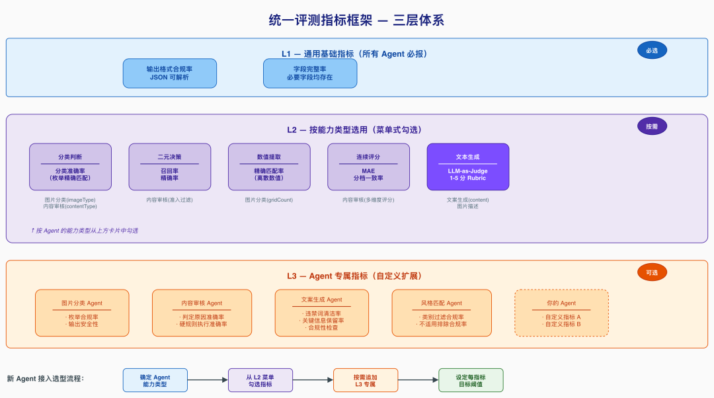

# 基于顶级 Agent（Claude Code）的 Harness 工程搭建式业务 Agent 评测方案


阿里妹导读
用一个强 Agent 构建评测 Harness，系统性评测一群业务 Agent（文章内容基于作者个人技术实践与独立思考，旨在分享经验，仅代表个人观点。）

### 一、背景与问题

### 1.1 业务场景

某业务系统的内容生成链路由多个子 Agent 协作完成，每个 Agent 负责不同的任务（图片理解、内容审核、文案生成、风格匹配等）。这些 Agent 的 prompt 方案频繁迭代，每次变更后需要快速验证效果。
核心矛盾：业务 Agent 迭代快（天级），但传统评测工程搭建慢（周级）。

### 1.2 传统评测的痛点

痛点
表现
启动成本高
搭建评测工程、写脚本、部署服务，还没开始评就花了一周
人力密集
标注数据集、写分析脚本、出报告，每个环节都需人工介入
迭代慢
prompt 改了一行，想看效果要等半天重新跑
可复现性差
评测逻辑散落在各种脚本和 Notebook 里
指标不统一
不同 Agent 各搞一套，无法横向对比
工程化沉重
每换一个 Agent 就要新写一套评测代码

### 1.3 我们的解法：Harness 工程搭建式评测

**核心思路**：用一个顶级 Agent（Claude Code）作为 Harness 工程的搭建者和运行者，系统性地对业务 Agent 进行评测。

## 什么是 "Harness 工程搭建式"？

传统做法：人写评测代码 → 跑脚本 → 看结果 → 改代码 → 再跑
Harness 式做法：顶级 Agent 搭建完整的评测骨架（harness），包括评测方案、数据集、评测逻辑（以 Agent 提示词形式表达）、分析流程。人只需提供被测对象和做关键决策。

## 为什么 Claude Code 是合适的 Harness 搭建者？

能力
在 Harness 中的作用
深度理解 prompt
分析被测 Agent 的逻辑，设计针对性评测维度
代码生成
数据获取/处理脚本，评测辅助工具
结构化输出
评测方案文档、评测 Agent 提示词、评测报告
多轮协作
跨版本持续迭代（v1→v2→v3），保持上下文连贯
数据分析
对跑批结果做统计、归因、对比
关键洞察：评测 Harness 的本质是一套结构化的评估规则 + 执行流程。传统做法把它编码为 Python 脚本，而我们把它编码为 Agent 提示词——更灵活、更可读、更易迭代。

### 二、Harness 工程整体架构

### 2.1 三层架构


### 2.2 Harness 搭建五步法


### 2.3 与传统评测工程的类比

Harness 式评测
变化
test_config.yaml
评测方案 .md
规则从配置文件变为自然语言文档
test_data.json
评测集 Excel（system.question）
数据格式统一，人可直接看懂
test_runner.py（数百行）
评测 Agent 提示词（数千字）
**执行逻辑从代码变为 Prompt**
conftest.py+ fixtures
GT 标注 + ground_truth 字段
预期结果内嵌在数据中
report_generator.py
CC 实时分析
报告生成从脚本变为交互
requirements.txt+ CI
评测平台一键跑批
零部署成本

### 2.4 职责分工

角色
职责
不做什么
**人**
GT 标注、方案审核、最终决策
不写评测脚本、不手动计算指标
**Claude Code**
Harness 全链路搭建 + 结果分析
不做批量推理主循环（交给平台）
**评测平台**
批量执行引擎（逐行调用）
不做方案设计和指标汇总

### 三、统一评测指标框架

### 3.1 三层指标体系


在评测 6 个不同类型的 Agent 后，我们沉淀了一套通用的三层指标框架：
**L1：通用基础指标（所有 Agent 必报）**
含义
为什么重要
输出格式合规率
JSON 可成功解析的比例
下游消费方直接报错
字段完整率
必要字段均存在的比例
缺字段 = 功能不可用
**L2：按能力类型选用（从菜单中按需勾选）**
适用场景
分类判断
分类准确率
枚举值选择（如类型判断）
二元决策
召回率 / 精确率
过滤 / 准入决策
数值提取
精确匹配率
离散数值的精确提取
连续评分
MAE + 分档一致率
内容质量打分
文本生成
LLM-as-Judge 1-5 分
文案、描述等开放式输出
**L3：Agent 专属指标（按需自定义）**
每个 Agent 可在 L1+L2 基础上追加专有指标。例如：
●文案生成 Agent：违禁词清洁率、关键信息保留率
●风格匹配 Agent：不适用风格过滤合规率

### 3.2 新 Agent 接入时的指标选型流程

确定 Agent 涉及的能力类型
↓
从 L2 菜单勾选对应指标
按需追加 L3 专属指标
设定每个指标的目标阈值

### 四、Harness 各层的搭建方法

### 4.1 规则层：评测方案设计（CC 角色：方案架构师）

**输入**：被测 Agent 的 prompt 文件 + 业务上下文描述
**CC 输出**：
●完整的评测方案文档（含维度、指标、阈值、数据集要求、错误分类体系）
●边界用例建议（CC 分析 prompt 逻辑后主动提出应覆盖的场景）
实际效果：从一个 prompt 文件到一份完整评测方案，大约 10 分钟的交互。
示例对话：
人：这是新的内容审核 Agent 的 prompt，帮我设计评测方案
CC：[分析 prompt] 我建议从以下维度评测：
1. 格式合规（JSON可解析 + 字段完整）
2. 过滤决策（召回率/精确率）
3. 评分准确性（MAE + 分档一致率）
需要覆盖的边界：少量输入/全过滤/极端分数...
目标阈值建议：过滤精确率≥90%，MAE≤3...
人：某个维度容易低估，阈值放宽到 MAE≤5
CC：好的，已更新。[输出完整方案文档]

### 4.2 数据层：黄金评测集构建（CC 角色：数据工程师）

**CC 做的事：**
1.**数据获取**：编写脚本调用业务接口，批量拉取候选数据
2.**数据处理**：格式化为评测所需的 JSON 结构
3.**GT 辅助标注**：对分类型指标，CC 先给建议标注，人工复核
4.**评测集打包**：生成评测平台可直接消费的 Excel（含 system.question 列）
**关键设计**：system.question 列
每行数据都有一个system.question列，格式为 JSON，包含：
●被测 Agent 所需的全部输入字段
●ground_truth（人工标注的黄金答案）
评测 Agent 读取这一列即可获得输入和预期输出，无需额外配置。
{
"sample_id": 243,
"title": "XX品牌零食合集...",
"content": "最近发现了...",
"items": [...],
"ground_truth": {
"should_filter": false,
"total_score": 64,
"dimension_a": 22,
"dimension_b": 22,
"dimension_c": 20
}

### 4.3 执行逻辑层：评测 Agent 提示词（CC 角色：Harness 工程师）


**这是整套方案最核心的创新**：把传统的评测脚本（Python/Java）替换为一份评测 Agent 提示词。评测逻辑从"代码"变为"自然语言指令"，一个 Agent 来评测另一个 Agent。
**评测 Agent 的工作流程：**
读取 system.question（一行数据）
调用被测 Agent（获取实际输出）
解析输出 → 硬规则自动检查 → LLM 打分
输出结构化 JSON（所有指标的计算结果）
**评测 Agent 提示词的结构模板：**
##角色定义
你是一个严谨的 AI 评测专家，负责对「XXX」Agent 进行单条样本评测。
##工具声明
-{agentId}：调用被测 Agent，传入 XXX，返回原始输出
##约束
1.必须先调用工具获取 Agent 输出，再评测
2.最终只输出一个合法 JSON
3.数值统计必须精确计算，不可估算
##工作流程
1.解析输入（提取 post_id、输入数据、ground_truth）
2.调用被测 Agent
3.解析输出为 JSON
4.硬规则自动检查（格式/字段/枚举/字数/...）
5.LLM-as-Judge 打分（对比 ground_truth 或按评分标准）
6.错误归因（FORMAT_ERROR / WRONG_CHOICE / ...）
7.输出最终 JSON
##输出 Schema
{完整的 JSON schema 定义}

## 为什么要这样设计？

优势
说明
逻辑可读
评测逻辑以自然语言写在提示词里，无需读代码
快速迭代
发现评测逻辑有误，改一段文字就行，不用改代码重部署
统一执行
所有 Agent 的评测逻辑结构一致，只改内容不改框架
评测即文档
提示词本身就是评测标准的完整说明

### 4.4 输出层：结果分析与报告（CC 角色：数据分析师）

**典型流程：**
人：跑批完了，结果在 XXX.xlsx，帮我出报告
CC：[读取 Excel]
- 总量 50 条，API 成功 46 条
- 格式合规率 92%
- 过滤 Recall 100% / Precision 18.2% ❌
- 核心问题：模型将评分维度误用为过滤条件
- 建议：修复 prompt 中过滤逻辑的边界定义
[输出完整报告 Markdown]
**CC 在分析中的增值：**
1.**自动识别 pattern**：不只报数字，还归因（"18 条误过滤中，12 条都是把某评分维度<60 当过滤条件"）
2.**跨批次对比**：和上一版结果对比，明确哪些指标进步/退步
3.**给出可操作建议**：不只是"分数低"，而是"建议在 prompt 第三段加入明确的过滤条件边界"

### 五、关键实践经验

### 5.1 评测集设计原则

原则
反例
**小而精**
20-55 条足够，覆盖所有边界场景
200+ 条但都是简单 case
**分布均衡**
正/负例比例合理，边界场景必须有
全是正例，评不出问题
**GT 可复核**
每条 GT 标注有据可查
GT 靠感觉打分
**版本化管理**
评测集跟随被测 prompt 版本变更
用 v1 评测集评 v3 prompt

### 5.2 评测 Agent 提示词的迭代策略

我们发现评测 Agent 本身也需要迭代（评测系统 bug ≠ 被测 Agent bug）：
**常见评测系统 bug：**
修复方式
匹配逻辑过严
语义等价的判定原因被判错
GT⊆AI 超集匹配
硬编码规则误报
排除列表不全导致误判
改为动态语义比对
Token 截断
输出超长被评测平台截断
正则容错提取关键字段
GT 覆盖缺口
新增选项未在 GT 中体现
更新 GT 标注
**迭代节奏：**
●v1：基本逻辑跑通（调试模式，带推导过程）
●v2：切换为跑批模式（纯 JSON 输出），修复首批发现的评测逻辑 bug
●v3+：基于实际结果持续调优（指标定义、匹配方式、容错逻辑）

### 5.3 LLM-as-Judge 的使用心得

对文本生成类 Agent（无法精确匹配 GT），我们用 LLM 做评委：
做法：在评测 Agent 提示词中嵌入评分标准（1-5 分 rubric），评测 Agent 同时扮演"执行者"和"评委"。
有效的 rubric 设计：
5 分：改写自然，传达原文单一核心意图，一次读完即懂
4 分：基本达标，有轻微瑕疵但整体可读
3 分：勉强可接受，但存在轻度问题
2 分：明显问题：信息压缩过度或照抄原文
1 分：严重错误：与输入无关或完全无法理解
**注意事项：**
●每个分值必须有具体、可区分的判定标准
●避免"好/较好/一般"这类主观描述
●分值之间的差异应该一个正常人也能判断

### 5.4 "评测 Agent 调被测 Agent" 的技巧

→ 调用评测 Agent（一个 LLM 实例）
→ 评测 Agent 通过工具调用被测 Agent（另一个 LLM 实例）
→ 获得被测 Agent 的原始输出
→ 评测 Agent 对输出进行多维度评分
→ 返回结构化评测 JSON
**实际踩坑：**
解法
评测 Agent 忘记调用工具
在 Constraints 中强调"必须先调用工具"
工具参数传递失败
在提示词中显式写明参数构造逻辑
评测 Agent 重试耗尽 token
添加"禁止重试"约束
输出截断
减少推导过程，只输出最终 JSON

### 六、效率对比


### 6.1 时间投入

阶段
传统方式
CC 协助
加速比
评测方案设计
1-2 天
10-30 分钟
~10x
评测集构建
2-3 天
半天（含人工标注）
~5x
评测脚本/Agent 开发
1-2 小时
跑批执行
同（平台执行）
结果分析 + 报告
半天-1天
10-20 分钟
**单 Agent 全流程**
**~1.5 周**
**~1-2 天**
**~5x**

### 6.2 质量保障

CC 方案不仅更快，分析质量往往更高：
●覆盖性：CC 不会遗漏任何数据行（人工数 50 行 Excel 容易看漏）
●一致性：同样的评测标准，CC 不会因为疲劳而评分漂移
●溯源性：每条评测结果都可追溯到 prompt 中的具体逻辑
●可复现：同一份评测 Agent 提示词 + 同一份评测集 = 结果可复现

### 七、适用场景与局限

### 7.1 适用场景

适合度
Prompt 迭代验证
⭐⭐⭐⭐⭐
改 prompt → 跑批 → 看报告，闭环最快
多 Agent 横向对比
统一指标框架 + 相同评测流程
新 Agent 上线前验收
系统性覆盖，不依赖人工抽检
线上问题复盘
可快速构造问题用例验证

### 7.2 局限与建议

局限
LLM-as-Judge 本身有偏差
对关键决策用人工抽检兜底
评测集规模受限（人工 GT）
小而精优于大而糙，20-55 条覆盖边界即可
依赖评测平台稳定性
token 截断、API 超时需做容错
首次搭建有学习成本
第二个 Agent 起复用率很高

### 八、可复用资产

经过 6 个 Agent 的实战，已沉淀的可复用资产：
复用方式
三层指标框架模板
L1/L2/L3
新 Agent 对照选用
评测方案文档模板
目标+维度+数据集+流程+错误分类
填空式生成
评测 Agent 提示词模板
角色+工具+约束+工作流+输出 schema
替换业务逻辑即可
评测集 Excel 格式
system.question 列规范
标准化接入评测平台
评测报告模板
执行情况+指标汇总+问题分析+建议
CC 自动填充
按需扩展
Agent 平台调用经验
接口格式/参数/踩坑记录
减少试错

### 九、快速上手指南

想要复用这套方案的同学，按以下步骤操作：

# Step 1：准备工作（5 分钟）

●准备好被测 Agent 的 prompt 文件
●确认被测 Agent 的接口信息和调用方式
●在 Claude Code 中打开项目目录

# Step 2：设计评测方案（10-30 分钟）

告诉 CC：这是被测 Agent 的 prompt [粘贴/路径]，帮我设计评测方案。
CC 会输出：维度、指标、阈值、数据集要求、错误分类。
你来审核和调整。

# Step 3：构建评测集（半天，含人工标注）

告诉 CC：帮我从 XXX 接口拉取候选数据，格式化为评测集。
CC 输出：候选数据 Excel。
你来做 GT 标注（CC 可以先给 AI 建议，你复核）。
CC 打包为带 system.question 列的最终评测集。

# Step 4：编写评测 Agent 提示词（1-2 小时）

告诉 CC：基于评测方案，帮我写评测 Agent 的提示词。
CC 输出：完整的评测 Agent System Prompt。
上传到评测平台，用 1-2 条数据调试。
根据调试结果让 CC 修改（通常需要 2-3 轮）。

# Step 5：跑批 + 出报告（30 分钟）

上传评测集到平台 → 等待跑批完成。
下载结果 Excel → 告诉 CC：帮我分析这份结果。
CC 输出：完整评测报告 + 优化建议。

### 十、总结

### 10.1 核心理念

**一句话**：用一个强 Agent（Claude Code）搭建评测 Harness 工程，将评测逻辑从"代码"升级为"Prompt"，实现业务 Agent 的系统性快速评测。
**范式转变：**
传统：人写评测代码 → 跑脚本 → 人看结果 → 人改代码 → 再跑
（周级启动，天级迭代）
Harness式：CC搭建Harness → 平台跑批 → CC分析 → CC调整Harness → 再跑
（天级启动，小时级迭代）

### 10.2 核心收益

收益
具体表现
**从周到天**
单 Agent 评测全流程从 ~1.5 周压缩到 1-2 天
**一人成军**
一个人 + Claude Code 完成原来需要测试开发 + 数据标注 + 分析师的工作
**可持续迭代**
每次 prompt 变更后的验证成本极低（改提示词 → 重跑 → 看报告）
**零部署**
评测逻辑是 Prompt 而非代码，无需 CI/CD，改完即生效
**方法论沉淀**
指标框架 + Agent 提示词模板 + 错误分类体系，可迁移复用到任何 Agent

### 10.3 适用场景

●任何有 Agent/LLM 应用、需要系统性评测能力的业务组
●Prompt 迭代频繁（天级/周级），需要快速验证效果
●多 Agent 协作系统，需要分模块独立评测

### 10.4 开放讨论

评测 Agent 自身的准确性如何保证？
调试期用 2-3 条数据人工核对；正式跑前先小批次验证
能否替代人工测试？
不能完全替代，但可以覆盖 80%+ 的重复劳动
与 Evals 框架（OpenAI）的关系？
理念类似，但我们的 Harness 更轻量、更灵活、无需工程部署
能否跨团队复用？
可以——三层指标框架 + 评测 Agent 模板 + 工作流模板，换被测对象即可

### 十一、最后

感谢对营销消费清单 AI 项目评测专项给予大力支持和鼓励的各位老师：
团队战友：岑坚、茉书、沈芃、飘飘、鲜佳伟等同学
协作兄弟：危素、朱八、墨謧、临汀、图兔、书屹、深空等同学

---

## 📚 专业词汇通俗解释（结合 NanoHermes 项目源码）

### 1. Harness 工程（评测脚手架）

**一句话：** Harness 就是给被测对象搭建的一套"评测流水线骨架"——包括评测方案、数据集、执行逻辑、分析报告四个环节。

**类比：** 就像给工厂产品建质检流水线：进料口（数据）→ 检测台（规则）→ 传送带（执行）→ 质检报告（输出）。传统做法是工程师手工造这条线（写 Python 脚本），Harness 式做法是让 Claude Code 这个"包工头"帮你建线，你只负责说"我要检什么"。

**NanoHermes 源码对应：**
- NanoHermes 目前没有专门的评测 Harness 模块，但它的**测试基础设施**可以看作一种轻量 Harness：
  - `src/conversation/error_classifier.py` → `ErrorClassifier` 类：对 API 错误进行分类（auth/billing/rate_limit/context_overflow 等 8 种），自带 `retryable` 和 `recovery_hint`，相当于评测中的"错误归因"
  - `src/tools/dfx/retry_classifier.py` → `ToolErrorClassifier` + `RecoveryAction`：工具执行错误分类和恢复策略
  - `src/tools/dfx/execution_tracker.py` → `ToolExecutionTracker`：追踪每次工具执行的耗时和结果，类似评测的结果收集

**可以借鉴的方向：** NanoHermes 已经有错误分类和追踪基础设施，可以扩展为一套内置的"Agent 自评测 Harness"——用 delegate_task 生成评测子 Agent，对自身的工具调用质量进行自动化评估。

---

### 2. LLM-as-Judge（大模型当评委）

**一句话：** 让一个强模型给另一个模型的输出打分，用自然语言 rubric（评分标准）代替精确匹配。

**类比：** 就像请一个资深编辑来评审实习生写的文章——不是靠"字数对不对""有没有错别字"这种硬规则，而是靠"行文是否流畅""信息是否完整"这种整体判断。

**NanoHermes 源码对应：**
- NanoHermes 目前没有 LLM-as-Judge 的内置实现，但**具备实现条件**：
  - `src/provider/` 模块支持多模型（DashScope/OpenAI/Anthropic），可以配置"评委模型"和"被测模型"用不同 API Key
  - `src/conversation/loop.py` → `ConversationLoop.run()` 支持注入不同的 `model_call` 函数，理论上可以用一个 Loop 做评测者、另一个做被评测者
  - `src/tools/core/dispatcher.py` → `dispatch()` 函数：评测 Agent 可以通过工具调用被测 Agent，架构上已支持"Agent 调 Agent"

| 维度 | 文章做法 | NanoHermes 可实现方式 |
|------|---------|---------------------|
| 评委模型 | Claude Code 自身 | 用更强的模型（如 Claude Sonnet）做评委 |
| 评分标准 | 写在评测 Agent 提示词中 | 作为 SKILL.md 加载到评测子 Agent |
| 输出格式 | 结构化 JSON | 已有 JSON 解析 + ErrorClassifier 兜底 |
| 执行方式 | 评测平台批量跑 | delegate_task 批量 + cronjob 定时 |

---

### 3. 评测 Agent（Agent 评 Agent）

**一句话：** 一个专门的 Agent，它的"工作"就是调用另一个 Agent、分析输出、打分、出报告——相当于 AI 世界的质检员。

**类比：** 就像老师批改学生作业：老师（评测 Agent）不发卷子、不答题，只负责"看答案 → 对标准 → 打分 → 写评语"。

**NanoHermes 源码对应：**
- `src/delegation/manager.py` → `DelegationManager`：支持 spawn 子 Agent（leaf/orchestrator 角色），可通过 `delegate_task(goal="评测 Agent X 的输出")` 启动评测子 Agent
- `src/delegation/types.py` → `DELEGATE_BLOCKED_TOOLS` / `ORCHESTRATOR_ALLOWED_TOOLS`：子 Agent 的权限边界控制，评测 Agent 可以限制只读权限
- `src/skills/loader.py` → `SkillLoader`：评测 Agent 的"评分标准 rubric"可以做成 SKILL.md，按需加载
- `src/conversation/events.py` → `EventBus` 18 种事件：评测 Agent 可以订阅被测 Agent 的事件流进行实时监控

---

### 4. 评测提示词化（Prompt as Code → Code as Prompt）

**一句话：** 把原来写在 Python 脚本里的评测逻辑（if/else/assert），改写成自然语言的 Prompt 指令。

**类比：** 以前质检要写一本"操作手册"（代码），每个步骤精确到"用卡尺量到小数点后两位"；现在直接告诉质检员"你觉得这个产品好不好，好在哪里"——靠经验和判断力，而不是死板流程。

**NanoHermes 源码对应：**
- `src/skills/` 整个模块就是"提示词化知识"的体现：
  - SKILL.md 文件用 YAML frontmatter + Markdown 定义技能知识，Agent 按需加载
  - `src/skills/manager.py` → `SkillManager`：负责技能编排，把自然语言知识注入 system prompt
  - `src/skills/progressive_disclosure.py`：三层渐进式披露，`_CACHE_MAX = 8` 控制缓存上限
- `src/prompt/` 模块：三层提示组装（stable/context/volatile），评测逻辑可以作为 volatile 层动态注入

| 维度 | 传统代码式评测 | Prompt 式评测 | NanoHermes 对应 |
|------|-------------|-------------|----------------|
| 评测规则 | Python assert/regex | 自然语言 rubric | SKILL.md |
| 修改成本 | 改代码→提交→部署 | 改文字→即生效 | `skill_manage(action='patch')` |
| 可读性 | 需要读代码 | 人类直接可读 | Markdown |
| 可复用性 | 复制代码 | 加载技能 | `skill_view(name)` |

---

### 5. 三层指标体系（L1/L2/L3）

**一句话：** 通用基础指标（所有 Agent 必报）+ 按能力选型指标（按需勾选）+ Agent 专属指标（自定义）。

**类比：** 就像体检：L1 是每个人都要查的（身高体重血压），L2 是按年龄性别选查的（女性查乳腺、男性查前列腺），L3 是按个人病史加查的（糖尿病人查糖化血红蛋白）。

**NanoHermes 源码对应：**
- `src/insights/` 模块已经实现了类似的"分层指标"思想：
  - Token 聚合、成本估算、工具调用统计
  - 可以通过扩展实现 L1（token 用量、错误率）/ L2（按工具类型分指标）/ L3（自定义业务指标）
- `src/tools/dfx/result_budget.py` → `apply_budget_to_dispatch_result`：对工具输出做 token 预算控制，类似 L1 基础指标
- `src/tools/dfx/execution_tracker.py`：执行追踪，天然支持按工具名分组统计

---

### 6. 黄金评测集（Ground Truth Dataset）

**一句话：** 一套精心挑选的、带标准答案的测试数据，用来衡量 Agent 输出"对不对"。

**类比：** 就像考试的标准答案卷——学生做完卷子后，老师拿着标准答案逐题批改。

**NanoHermes 源码对应：**
- `src/session/` 模块的 SQLite + JSONL 双存储可以作为评测数据的载体
- 文章提到的 `system.question` 列（JSON 格式包含输入 + ground_truth），在 NanoHermes 中可以用 JSONL 消息格式自然表达
- `src/memory/` 模块：MEMORY.md 文件存储的持久化事实，可以类比为"黄金标注知识"

---

### 7. 自进化 Agent（Self-Evolving Agent）

**一句话：** Agent 不仅能完成任务，还能从经验中学习、优化自己的行为模式——比如 NanoHermes 的 Curator 自动管理技能生命周期。

**类比：** 一个会自己整理工具箱的工匠——用完的工具放回原位，不常用的收到柜子顶层，坏掉的扔掉，新买的放到最顺手的地方。

**NanoHermes 源码对应：**
- `src/skills/curator.py` → `Curator` 类：后台技能维护，自动转换生命周期状态（active → stale → archived）
  - `stale_after_days = 30`：30 天不用的技能标记 stale
  - `archive_after_days = 90`：90 天不用的技能归档
  - `min_idle_hours = 24` / `interval_hours = 168`：空闲 24 小时后触发，每周审查一次
- `src/skills/manager.py` → `SkillManager`：技能的 CRUD + 分类 + 提示注入
- `src/background/scheduler.py` → `BackgroundTaskScheduler`：信号量并发 + 事件驱动触发
- 整个 NanoHermes 项目就是"自进化 Agent"理念的实践——通过技能系统、Curator 后台审查、记忆系统实现自我优化

---

### 8. 错误归因体系（Error Classification）

**一句话：** 不只是告诉用户"出错了"，还要说出"为什么错"和"怎么修"。

**类比：** 汽车仪表盘不只是亮红灯，而是告诉你"发动机温度过高，请停车冷却"——精确到具体原因和应对措施。

**NanoHermes 源码对应：**
- `src/conversation/error_classifier.py` → `ErrorClassifier` + `ErrorCategory`（8 种分类）：
  ```
  AUTH → "检查 API Key 是否有效"（不可重试）
  RATE_LIMIT → "等待后重试"（可重试）
  CONTEXT_OVERFLOW → "需要压缩上下文"（可重试）
  SERVER_ERROR → "服务端错误，稍后重试"（可重试）
  ```
- `src/tools/dfx/retry_manager.py` → `DEFAULT_RETRYABLE_TOOLS`：定义哪些工具失败时可自动重试
- `src/tools/dfx/retry_classifier.py` → `ToolErrorClassifier` + `RecoveryAction`：工具级错误分类

---

---

**💡 核心洞察：NanoHermes vs 文章理念的对照**

> **文章核心观点：** 用强 Agent（Claude Code）搭建评测 Harness 工程，将评测逻辑从"代码"升级为"Prompt"，实现业务 Agent 的系统性快速评测。

你的 NanoHermes 在以下方面**已经实现**了文章的理念：

| 文章理念 | NanoHermes 实现 | 状态 |
|---------|----------------|------|
| 评测逻辑提示词化 | SKILL.md 技能系统，自然语言定义行为规范 | ✅ 已实现 |
| 错误分类与归因 | `ErrorClassifier`（8 类错误 + 恢复建议） | ✅ 已实现 |
| Agent 评 Agent | `delegate_task` 子代理，leaf/orchestrator 角色 | ✅ 已实现 |
| 自进化能力 | `Curator` 后台技能生命周期管理（30/90 天规则） | ✅ 已实现 |
| 分层指标体系 | `insights/` token 聚合 + DFX 执行追踪 | ⬜ 可扩展为 L1/L2/L3 |
| LLM-as-Judge | 多模型支持（DashScope/OpenAI/Anthropic） | ⬜ 可实现评测 Agent |
| 黄金评测集 | JSONL 消息存储 + SQLite 元数据 | ⬜ 可引入 ground_truth 字段 |
| Harness 工程搭建 | 无专门的评测 Harness 模块 | ⬜ 可新建 `src/evaluation/` 模块 |
| 评测报告自动生成 | 无内置报告生成 | ⬜ 可用 delegate_task + cronjob 实现 |

**可以借鉴文章改进的方向：**

1. **新建 `src/evaluation/` 模块**：实现内置的 Harness 工程，包含 `EvaluationHarness` 类，支持定义评测方案（自然语言）、评测集（JSONL + ground_truth）、评测 Agent 提示词模板
2. **LLM-as-Judge 技能化**：把文章中的 rubric 设计方法做成 SKILL.md（如 `evaluation-judge`），Agent 可以按需加载评测标准
3. **评测自审视**：让 NanoHermes 用 delegate_task 给自己跑评测——用强模型做评委，评测弱模型的决策质量，形成自我优化的闭环
4. **cronjob 定期评测**：用 `cronjob` 工具设置定时任务，每周自动跑一次评测，生成报告发送到微信/Telegram
