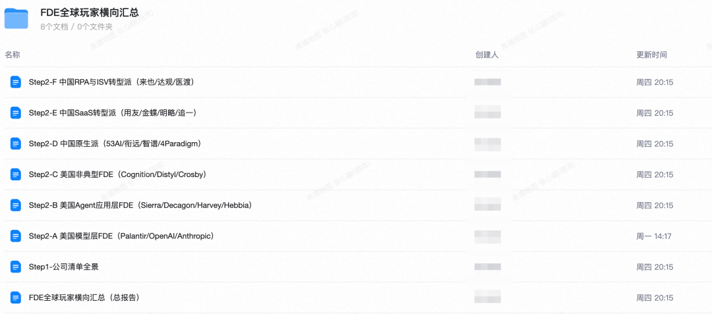
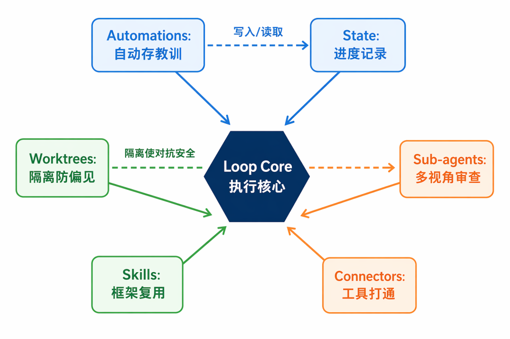
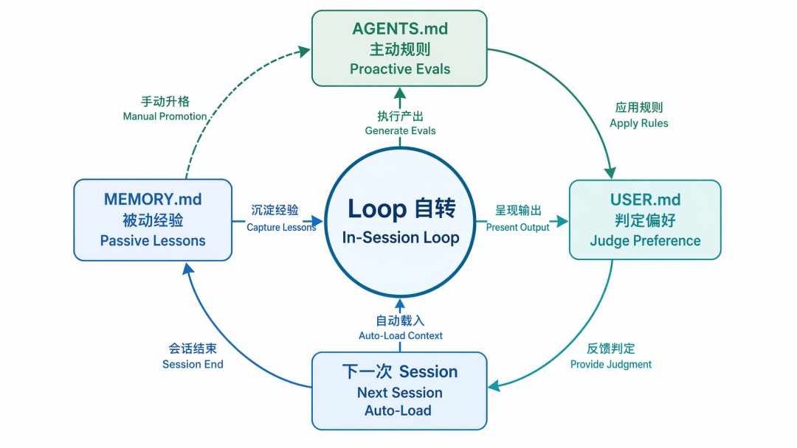
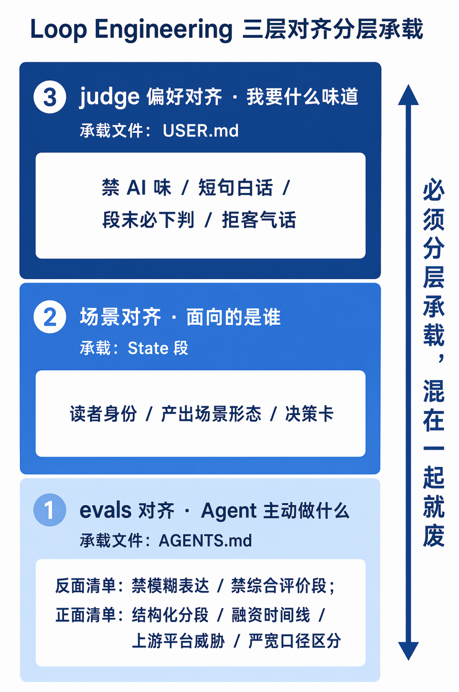
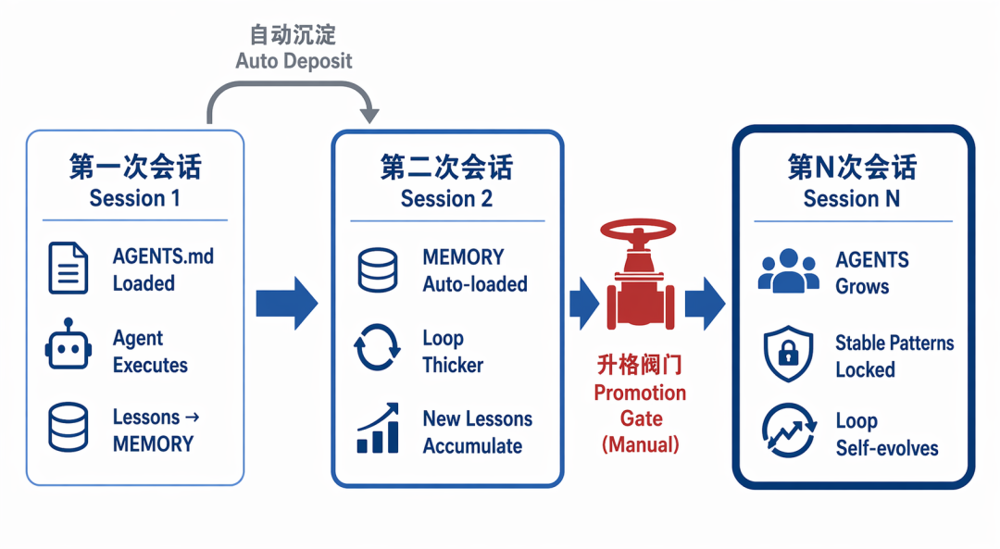
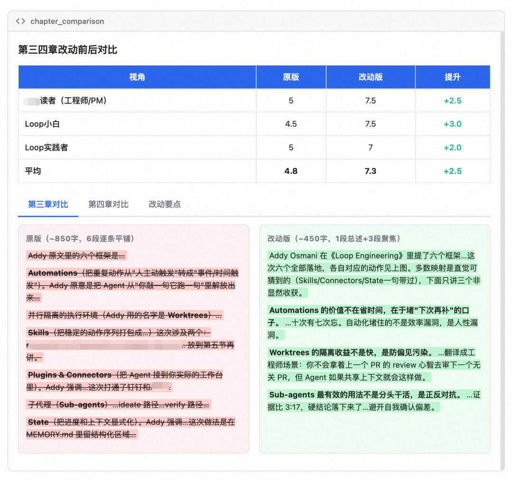

# 意识 × Loop：让 Loop 跨 Session 自进化的最佳实践

> 原文：https://mp.weixin.qq.com/s/39K69b_556bD_-QRc0sViQ

这是2026年的第 34 篇文章

（ 本文阅读时间：约20分钟 ）

> 本文提到的意识指 QoderWork 内的意识功能，包括但不限于长短期记忆、用户画像、工作手册等，但本最佳实践适用于任何市面主流的 Agent 。

# 01

开篇

Loop Engineering 这个月的讨论度很高。大家都在讲，如何让 Agent 在一次会话里自动跑，配好 Automations、Skills、Sub-agents，Loop 就转起来了。

但 Loop 有一个很少被讨论的致命问题：一次会话结束，Loop 就“死了”。

你花一下午调试好 evals，Agent 终于不犯某个错；关掉窗口，下次会话这个“不犯错”的经验却不在了。又或者，你手动纠正了三次判断偏差，关掉窗口，下次 Agent 依然会重蹈覆辙。Loop 转得再顺，也是一次性的。

你永远在重复教学同一件事。Loop 不自进化，就只是一个更花哨的 prompt。

就好比老板每天都在训练新员工，但 ta 每天失忆。所谓的“跨 Session 自进化”，就是让 ta 终于有了笔记本，而且每天上班自动翻开上次写到的地方。

为什么用调研做实践场景？主要出于两个原因。

第一，调研天然是长时任务。这次的对象是FDE（Forward Deployed Engineering）公司的横向深度调研，按 3C 框架（Company / Customer / Competitor）展开。如果 Loop 不能跨 Session 积累，每次开新 Session 都从零开始教 Agent “数字要三源交叉”、“不能只信官方 PR 稿”，效率比不用 Loop 还低。

第二，调研有硬标准。数字要可溯源、判断要区分严口径和宽口径、获客来源要拆到通道级而不是一句“销售外拓”糊弄。简单 Loop 跑出来的调研报告看着流畅，让 Agent 自己回过头 check 真实性，大面积返工。简单 Loop 不是效率问题，是产出可信度问题。

所以才需要让 Loop 自进化。下文贯穿的案例是本次 FDE 调研，但方法论对任何长时任务都成立。

1. 怎么让教训跨 Session 自动加载
1. 怎么把对齐拆成三层不互相污染
1. 哪个位置必须人守着不能让 Agent 自己动

# 02

先看效果：产出到什么程度才叫「不需要返工」

结论前置：单人 1 天跑完 FDE 方向 61 家公司的 3C 深度调研 + 横向汇总，总计 12 万字。但速度不是本文重点，产出质量不过关的话，速度快只是“快速生产垃圾”。

拿 Palantir 那篇为例。

每家公司的深度分析严格按 Company / Customer / Competitor 三个维度展开：

- Company 部分包括商业模式核心、提供的产品/服务、核心竞争力、融资/估值/盈利、关键节点。
- Customer 部分把获客通道拆到四类：自上而下 CEO 直连、政府关系网络、AIP Bootcamp 导流漏斗、投资者叙事拉动，每类给占比定性估算。
- Competitor 部分给出“FDE×自营产品×政府牌照三位一体”的差异化定位判断，不是列一堆竞品名字。

数字方面，每个硬数字都挂了来源链接。“FY2024 总收入 $2.87B（YoY +29%）”后面跟的是 Captide Q4 2024 Earnings Summary，“FDE 平均 TC ~$665K”后面跟的是 Perspective AI 2026 FDE 薪酬报告。

61 家汇总后，做到了深度横行对比：五种定价模式各给成立条件；拉一条估值倍数横线得出“FDE 含量与估值倍数反相关：偏产品型 53x，偏服务型 15x”；给出“中国 FDE 公司的最大威胁不是同行而是云厂商”。做过技术选型的都知道，“先给轴再挂组件”和“逐个组件写报告”的决策价值差在哪。

这些产出能直接进入团队对齐文档、架构评审或 OKR 立项决策。调研最大的时间黑洞从来不是“写”，是“返工”，是写完一版被打回来补数据、补视角、补结论。意识×Loop 版从第一版就卡住了质量红线，在“数据来源是否可追溯、结论是否有支撑”这两条硬标准上一版过。

最后一层价值，在稿子背后的意识文件里。这次沉淀下来的 AGENTS.md、MEMORY.md、USER.md 和一个 Skill 是可复利的。下一次做别的方向调研，启动那一刻这套意识层已经全部到位。实际测试下，第二个方向的调研（不同行业）启动 Session 的第一篇产出即满足 evals 全部硬标准。

行业知识不迁移，换一个全新领域，第一篇仍然需要人校准判断标准。迁移的是流程骨架和质量红线，不是行业认知本身。

# 03

Loop Engineering 的六大框架，这次是怎么落的

Addy Osmani 在《Loop Engineering》里提了六个框架：Automations、Worktrees、Skills、Plugins & Connectors、Sub-agents、State，让 Agent 自动循环工作的六种基础设施。

这次调研六个框架都找到了对应动作。其中三个映射比较直觉：Skills 对应调研框架的复用，Connectors 对应钉钉文档和内部技术社区的打通，Automations 对应会话结束时自动触发总结子任务、把踩过的坑追加到 MEMORY.md。

下面只展开两个跑完才有特殊发现的框架，以及一个被我大幅重定义、直接催生了下一节“意识层”的框架。

Worktrees：隔离的收益不是快，是防偏见污染。

严格来说，Addy 讲的 Worktrees 解决的是多 Agent 并行改同一仓库的 Git 文件冲突。调研场景没有这个原始问题，但底层逻辑相通：并行任务共享状态就会互相污染，隔离是解法。我把它映射为上下文隔离。

六份深度报告并行跑，每份一个隔离上下文，中间状态不共享，写完再合流。我最初以为这只是并行加速。跑完发现真正的收益是：调研完 A 公司之后满脑子它的商业模式，再看 B 公司时下意识把 B 也套进 A 的框里。隔离上下文强制每份分析从原点起步，避免了“先入为主”的偏见在公司之间传染。你不会拿着上一个 PR 的 review 心智去审下一个无关 PR，但 Agent 如果共享上下文就会这样做。

Sub-agents：最有效的用法不是分头干活，是正反对抗。

有一条方向感很强但证据不够的判断，我派两个子 Agent 并行去找：一个专门找支持证据，一个专门找反例。两边都拿全之后证据比是 3:17，硬结论落下来了。这种做法比让一个 Agent 自己权衡靠得多。任何 Agent 单独跑都会被自己写过的话带偏——先给了一个方向，后面的搜索就会确认偏差。最终稿的审校也是同理：另起独立子 Agent，只发标准不发历史，避开自我确认偏差。

State：从进度记录到行为塑造。

标准定义里 State 只解决一个问题：追踪哪些事做完了。但跑完这次调研我发现，光记进度远远不够。我真正需要的是“上次犯的错下次自动避开”、“我的判断偏好每次自动加载”、“被纠正过的认知跨 Session 延续”。这些是行为塑造，不是进度记录。我把 State 扩展成了三个文件：AGENTS.md、MEMORY.md、USER.md，由他们构成一套意识层。

# 04

意识×Loop：为什么必须结合，以及 Loop 自进化的具体机制

Loop Engineering 讲的是“一次会话里怎么让 Agent 转起来”。六大框架搭好，Agent 就能跑。但一次会话结束之后，Loop 本身留下来的痕迹在哪里？

如果什么都不留，下次做同类工作，Loop 从零搭起，实属浪费。

那么，如果把 Loop 沉淀到 Skill 里呢？Skill 的定位是“稳定动作骨架”，承载不了全部沉淀。使用侧的细颗粒经验，比如“文档 API 一次不能落太多字节”、“某类判断容易在特定行业翻车”、全部塞进 Skill 会把 Skill 拖臃肿，而且很多经验是我个人独有的，根本不适合塞进跨用户共享的 Skill。

所以我们可以把 Loop 里沉淀不进 Skill 的那部分，放进意识层。意识层有三个文件：

- AGENTS.md：proactive rules / evals。规定 Agent 每次输出前要主动做什么、要自查什么、什么表达一定要用或一定不能用。
- MEMORY.md：passive lessons / state。记录这次会话踩过的坑、被纠正的判断、能力使用中的注意事项，以及跨会话需要延续的进度状态。
- USER.md：judge preferences。记录“我”这个人的判断标准、我喜欢的输出味道、我厌恶的表达。

三个文件的共同点是每次会话开启时 Agent 自动加载，每次会话中自动沉淀更新。这就带来了 Loop 自进化的能力。

举一个这次调研里的真实例子。

第一次 Session，我让 Agent 分析一家 AI 应用公司。Agent 写“客户从哪来”那段，简单归为“销售外拓 + 大厂合作”。我读得皱眉：这家真实的模式是“存量老客户升级 + 大厂生态挂靠”双轮驱动，纯外拓做不出来那个客单价。纠正、重写、并且让 Agent 把这条教训同步写进 MEMORY.md：

> 判断中国 AI 应用公司的客户来源时，不能只看销售动作，必须区分“存量客户升级”、“投资人圈层”、“大厂生态”、“公开演讲 IP”四类通道，并各自给出比例的定性估算。

MEMORY.md 更新之后，Session 结束。

第二次 Session 我开始分析另一家 RPA 转 Agent 的公司。会话一开局，Agent 自动加载 MEMORY.md，那条教训就在意识里。它主动把“客户从哪来”拆成了“存量老客户升级”、“新场景客户”、“大厂生态挂靠”三条通道来讲，我没有再说一遍，Agent 自己带上来了。写出来的段落质量比第一次 Session 稳定得多。

Loop 自进化在这里变得可观测：上一次的教训通过意识文件跨 Session 传递，成为下一次 Loop 的一部分。

顺便把 MEMORY.md 里当前真实沉淀的几条列出来：

- 用文档 API 写入长文档时，一次落入字节量有阈值上限，超阈必须分批切片写入并复核。
- 判断某类公司的客户来源时，必须拆成“存量客户升级/投资人圈层/大厂生态/公开演讲 IP”四类通道并给比例定性估算。
- 涉及外部披露的关键数字，必须走三源交叉反推（官方口径 + 高管公开发言 + 第三方数据），不能只信官方 PR 稿。
- 上游平台方是否亲自下场做同类产品，是判断该赛道独立公司威胁的第一位信号；连续三家公司出现同一信号，可考虑升格进 AGENTS。

再举一个 AGENTS 层的例子。这次调研过程中，Agent 反复出现同一个问题：写完深度分析的分段结构之后，喜欢追加一个“综合评价”段落，那段话往往很虚，全是套话。我把这条写进 AGENTS.md：

> 深度分析在结构化分段之后，禁止追加“综合评价/整体评估”这类总结段。硬结论必须落在具体证据里，不再另起段落。

从此之后，Agent 每次做深度调研都不会再画蛇添足写虚的总结段。AGENTS.md 是 evals 的载体，Agent 每次输出前自查的清单。这份清单会随着我的积累越来越厚，Loop 也就越来越稳。

AGENTS 和 MEMORY 的分工区别是，AGENTS 承载“以后都要主动做什么”，是主动规则；MEMORY 承载“这次学到了什么、这个能力用起来要小心什么”，是被动经验。当 MEMORY 里某条经验反复复现、稳定命中之后，我会把它升格进 AGENTS，从“这次学到”变成“以后都要”。这个升格动作是我人肉做的，为什么不让 Agent 自己做？下文单独解释。

# 05

对齐：Loop Engineering 最难的地方，我的三层解法

「对齐」其实是 Loop Engineering 里最难的一件事，因为对齐很容易被简化成“Prompt 调好就行”。但真实场景里的对齐至少有三层，每一层的难度和方法都各不相同。

第一层是 evals 对齐，Agent 该主动做什么。我用 AGENTS.md 来承载。当前 AGENTS.md 约 15 条规则，经验上超过 20 条时 Agent 遵从率会下降，所以不是无限堆叠，是精简到每条都高频命中。具体做法是先写反面清单、再写正面清单。

这次调研 AGENTS.md 里真实生效的几条：

反面清单（绝不能出现）：

- 任何数字后必须有来源，缺来源的数字禁止入稿。
- 定性判断没有直接证据支撑时，必须显式标注“定性推断”。
- 禁止出现“综合来看”、“整体而言”、“值得关注”、“深度赋能”这类正确废话。
- 结构化分段之后禁止追加“综合评价/整体评估”段，硬结论必须落在具体证据里。

正面清单（每次必须做）：

- 每份深度分析严格按预设结构分段，缺一段视为未完成。
- 涉及外部融资/迭代节奏时必须给时间线（时间点 + 关键动作 + 参与方）。
- 涉及独立公司/独立模块时必须单独讨论上游平台威胁（大平台是否已下场做同类）。
- 判断必须显式区分口径（严格定义 vs 宽泛定义），两个口径的结论不能混着用。

evals 对齐的关键不是一次写全的，是随着 MEMORY 的积累慢慢升格的。比如“上游平台威胁必须单独讨论”这一条，最早只是 MEMORY.md 里一条经验，连续三家出现同样的模式之后，我把它升格进 AGENTS。这层的核心通道就是“MEMORY 上升为 AGENTS”。

第二层是场景对齐。Loop 跑出来的东西给谁看、以什么方式被消费、读者读完要做什么决策。我把这三件事叫“三要素”，每次调研启动先给 Agent。三要素说清楚，Agent 的语气、深度、结构就都对了。

第三层最微妙：judge 偏好。同样是“合格的稿子”，我和另一个 judge 的判断可能完全不同。比如我不支持“综合来看”、“整体而言”这类正确的废话，他人可能觉得这样很稳妥。这一层不是 evals（不是客观正确），也不是场景（不是给谁看），是 judge 本人的偏好，我用 USER.md 承载。

下面这几条就是我 USER.md 里当前真实生效的原条目：

- 厌恶 AI 味表达：破折号连用、“值得关注”、“重要意义”、“综合来看”、“深度赋能”，一律禁用。
- 偏好短句、白话、口语转书面语；段落之间允许跳跃，默认读者是聪明人。
- 拒绝“客气话”：不要“这个观点非常有价值”、“感谢您的深入思考”这类元评论。
- 每段结尾必须敢下判断，不允许“两面都有道理”。

USER.md 一旦写好，每次会话 Agent 自动加载，输出「就像我写的」。

三层对齐必须分层承载，绝不能混在一起。我看过很多同事在一个 Prompt 里既写 evals 又写场景又写 judge 偏好，Prompt 又长又乱，Agent 抓不住重点。分层承载、各归各的文件，这一步做不到 Loop 跑不久。

文件之间出现张力怎么办？AGENTS.md 是硬约束（客观正确性），USER.md 是软偏好（味道），硬约束永远优先。实际操作中冲突不常见，因为 USER 写的是“怎么表达”，AGENTS 写的是“表达什么”。但一旦出现，这个优先级规则让 Agent 不用纠结。

# 06

为什么这次没上「全自动 Loop」

这次调研有几个环节我特地没让 Agent 全自动，比如“MEMORY 升格 AGENTS”这个动作、“总报告六条硬结论”这个下判动作，都是我人肉在做。

原因不是不信任 Agent，是这几个位置的判断权重太重，一错就把整条 Loop 带偏。

MEMORY 升格 AGENTS 是一个“松变紧”的动作。MEMORY 允许试探性表达（“这次学到”），AGENTS 是硬约束（“以后都要”）。如果 Agent 自己判断升格，一旦把偶发情况当成通用规律，那条错误规则会在之后每一次会话里污染 Loop。

这次做到第 14 家公司时，Agent 尝试自动升格过一次：它把“该行业的客户普遍在乎 ROI 可量化”写进 AGENTS，但事实上这只是前几家公司的特征，后面几家的客户在乎的是合规认证而非 ROI。如果我没拦住，后续 7 家公司的分析全部会被这条伪规则带偏。这就是自动升格的典型翻车：样本量不够时概括出的“规律”是噪声不是信号。如果错误升格已经写入，我的做法是 AGENTS.md 用 git 做版本控制，发现污染后 git revert 回上一个干净版本。

总报告六条硬结论是“下判”动作。硬结论意味着“我敢挂名字担这个判断”，会被同事拿去做架构选型、拿去做 PRD 立项判断。这不是“稿子好不好”的问题，是“我个人信用”的问题。这一步我一定亲自过。

换句话说，Loop 可以自转，judge 不能自动。整套体系里我保留了两个人的位置：MEMORY 升格 AGENTS 的手动阀门，最终硬结论的亲自过稿。其他地方，Agent 都自转。

# 07

人人都可以搭建的 loop 自进化步骤

第一步，建 AGENTS.md。把你这类工作的“绝不能出现”和“必须做到”写下来，哪怕只有 5 条。这一步立刻带来一档提效，因为 Agent 每次输出前会自查。第二步，同步开始积累 MEMORY.md：每次会话结束前花 2 分钟，让 Agent 把这次的教训写进去，关键动作是主动纠错，你觉得 Agent 写错了别只纠正当下输出，务必让它把教训写进 MEMORY，跨 Session 才能受益。第三步，补 USER.md，把你个人的偏好写出来（“我厌恶什么”往往比“我喜欢什么”更好写），让 Agent 的输出味道对起来。

想不出前5条写什么？打开你最近被打回/返工的3份产出，每份问自己“如果 Agent 一开始就检查了 X，这次就不会被打回”，那个 X 就是一条 AGENTS 规则。另一个入口是回忆你最近3次纠正 Agent 时说的话，你骂它的内容就是规则。

启动成本：第一次建三件套大约多花 30 分钟，前两三个 Session 比不用意识文件反而慢 10-15%（因为要停下来纠正并写 MEMORY），但从第四个 Session 开始明显加速，该踩的坑已经记住了，Agent 不再重复犯同类错误。

意识文件三件套跑稳之后再动 Skill 和 Automation。顺序反了会痛苦：先上 Skill 而不建意识文件，Skill 里的偏好和你不一致，你会反复推倒重来。

最后说一个容易被忽略的成本：MEMORY.md 不是只增不减的。随着条目增多，Agent 的上下文窗口被占满，甚至出现“太多规则互相打架”的情况。我的做法是每周扫一遍 MEMORY，把已升格进 AGENTS 的条目删掉、把不再复现的经验归档到日期文件。保持 MEMORY 精简是让意识层长期可用的必要维护动作。

# 08

写在最后

taste 是 Loop 的准备动作，不是产出。很多人以为搭好 Loop，Agent 就能替他有品味，这是幻觉。Loop 只放大你已有的 taste，不生产 taste。如果我对这个 topic 没有阅读积累，我根本写不出 AGENTS.md 里“必须区分严格定义/宽泛定义”、“必须单独讨论上游平台威胁”这些规则。没有 taste，你连 evals 都写不出来。“Loop 让工作变轻松”是真的，“Loop 让新手变专家”是幻觉，这两件事必须分开讲。

另一个值得讲的判断：loop engineering 目前 90% 讨论集中在 AI Coding，但跑完这次调研我觉得正好反过来。Coding 场景的 eval 天然存在（能跑、通过测试、性能达标），调研的 eval 得你自己设计。eval 越难写的场景，搭 loop 的边际收益越大，因为那里连“什么叫好”都没人替你定义过。

最后一个小彩蛋：本文的创作也是有在用 loop engineering，我使用了三个 subAgent，分别扮演“技术社区普通读者”、“不懂 loop 的技术读者”、“懂 loop 的实践读者”。让他们按不同维度（术语门槛、节奏、可迁移性等）对文章打分，提出问题，基于问题再继续优化，通过阈值设在 9 分，不到继续 loop，直到都过线。

（下图为过程中产物）

---

*注：本文为作者个人技术思考与经验分享，不代表公司的官方立场或观点。文中部分论述涉及对技术趋势和发展方向的前瞻性判断，基于作者写作时的实践、认知与经验，所有内容仅供交流参考，读者应结合自身场景独立评估。

欢迎留言一起参与讨论~